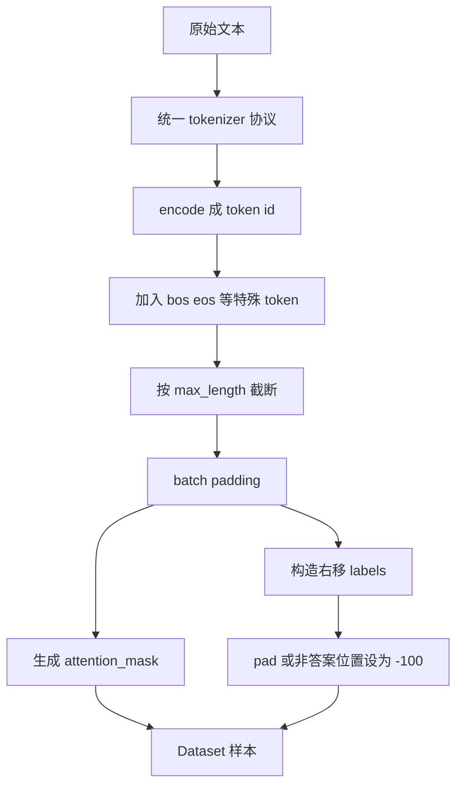

# mermaid-01 Mermaid render prompt

- Article: `lessons/03_tokenizer_and_dataset.md`
- Source: `lessons/assets/03_tokenizer_and_dataset/mermaid-01.mmd`
- Target: `lessons/assets/03_tokenizer_and_dataset/mermaid-01.png`

## Prompt

展示文本如何经过 tokenizer、特殊 token、padding 和 label mask 变成可训练数据集样本。

## Mermaid Source

