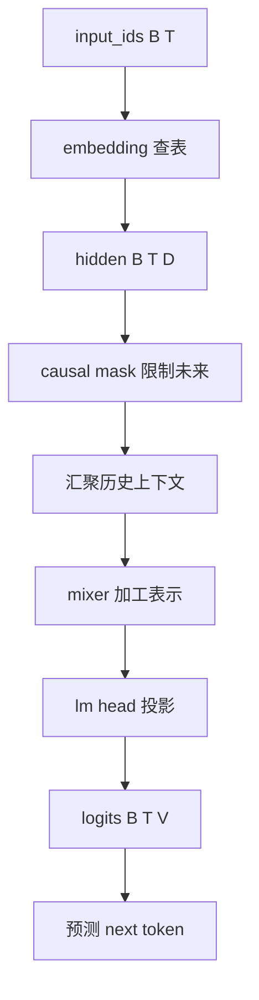

# mermaid-01 Mermaid render prompt

- Article: `lessons/04_embedding_and_neural_lm.md`
- Source: `lessons/assets/04_embedding_and_neural_lm/mermaid-01.mmd`
- Target: `lessons/assets/04_embedding_and_neural_lm/mermaid-01.png`

## Prompt

展示 token id 通过 embedding、因果上下文汇聚和 lm head 变成 next-token logits 的主线。

## Mermaid Source

