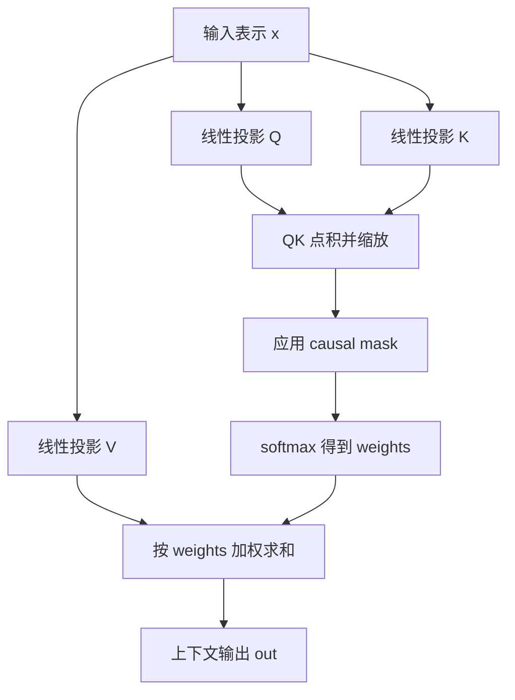

# mermaid-01 Mermaid render prompt

- Article: `lessons/05_attention.md`
- Source: `lessons/assets/05_attention/mermaid-01.mmd`
- Target: `lessons/assets/05_attention/mermaid-01.png`

## Prompt

说明 causal self-attention 从输入表示生成 QKV、计算权重并在 mask 约束下汇聚历史信息。

## Mermaid Source

