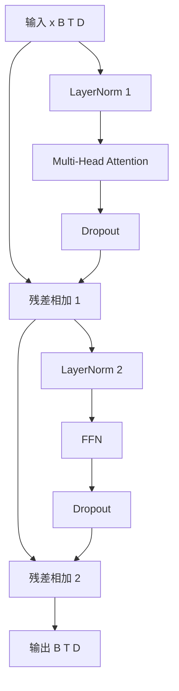

# mermaid-01 Mermaid render prompt

- Article: `lessons/06_transformer_block.md`
- Source: `lessons/assets/06_transformer_block/mermaid-01.mmd`
- Target: `lessons/assets/06_transformer_block/mermaid-01.png`

## Prompt

展示 Transformer Block 如何用 pre-norm、attention、残差和 FFN 组成可堆叠模块。

## Mermaid Source

