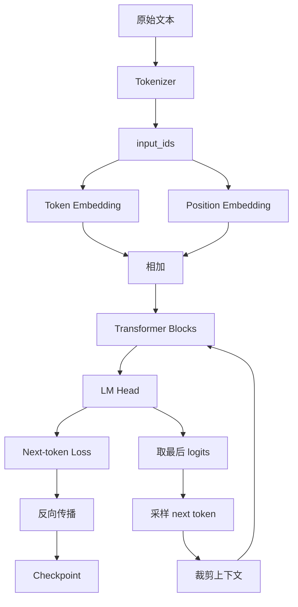

# mermaid-01 Mermaid render prompt

- Article: `lessons/07_mini_gpt.md`
- Source: `lessons/assets/07_mini_gpt/mermaid-01.mmd`
- Target: `lessons/assets/07_mini_gpt/mermaid-01.png`

## Prompt

展示 Mini GPT 从文本输入到训练、保存和自回归生成的完整工程闭环。

## Mermaid Source

