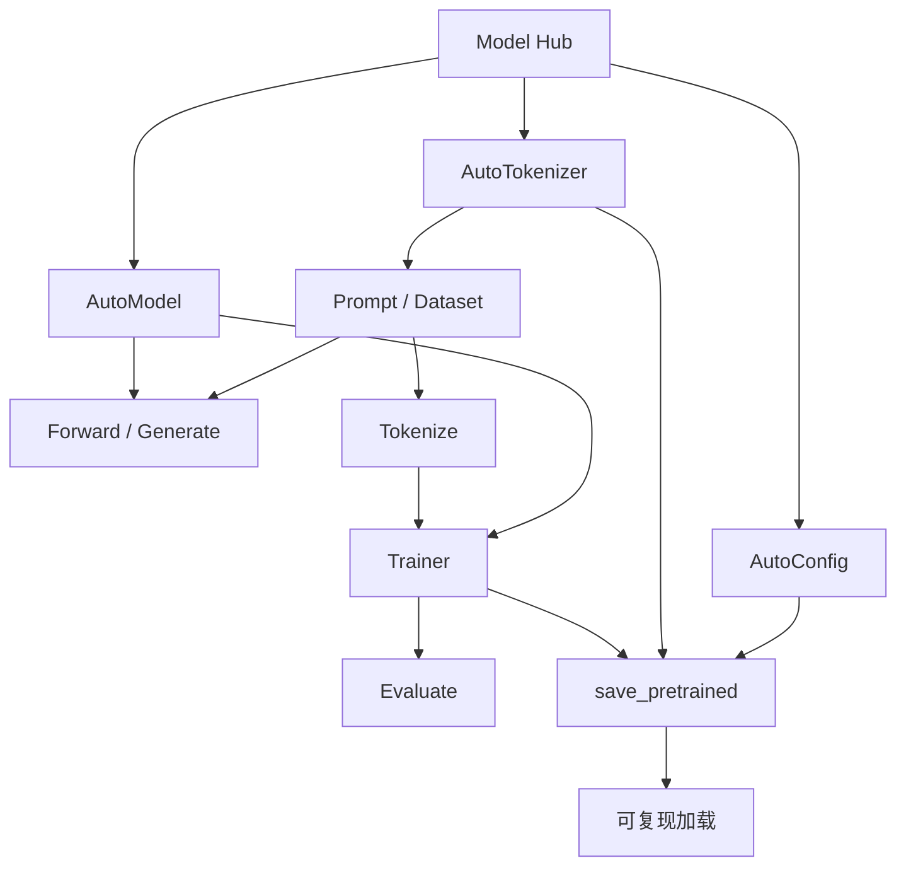

# mermaid-01 Mermaid render prompt

- Article: `lessons/08_huggingface_workflow.md`
- Source: `lessons/assets/08_huggingface_workflow/mermaid-01.mmd`
- Target: `lessons/assets/08_huggingface_workflow/mermaid-01.png`

## Prompt

展示 Hugging Face 工作流如何把开源模型、数据、训练和保存连接成可复现实验。

## Mermaid Source

