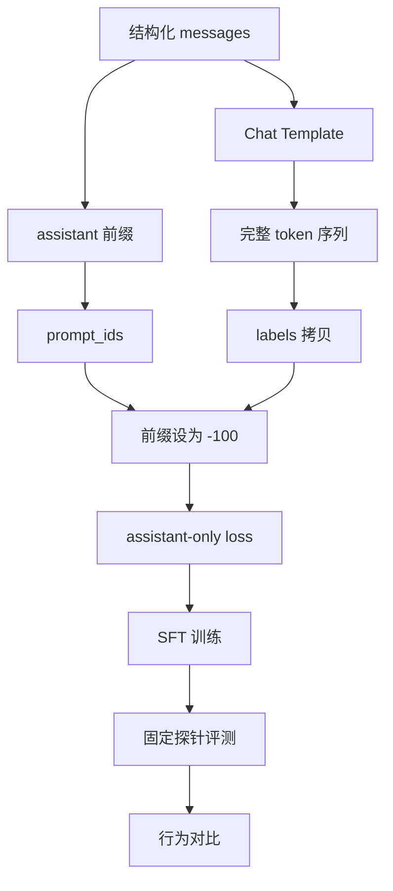

# mermaid-01 Mermaid render prompt

- Article: `lessons/09_sft_instruction_tuning.md`
- Source: `lessons/assets/09_sft_instruction_tuning/mermaid-01.mmd`
- Target: `lessons/assets/09_sft_instruction_tuning/mermaid-01.png`

## Prompt

展示 SFT 如何把结构化消息转换为只监督 assistant 回答的训练样本。

## Mermaid Source

