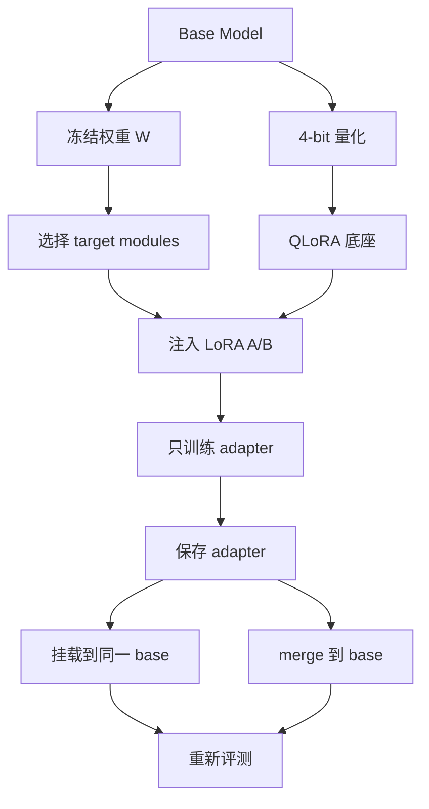

# mermaid-01 Mermaid render prompt

- Article: `lessons/10_lora_qlora.md`
- Source: `lessons/assets/10_lora_qlora/mermaid-01.mmd`
- Target: `lessons/assets/10_lora_qlora/mermaid-01.png`

## Prompt

展示 LoRA/QLoRA 如何冻结底座、训练低秩 adapter，并在保存或合并后重新评测。

## Mermaid Source

