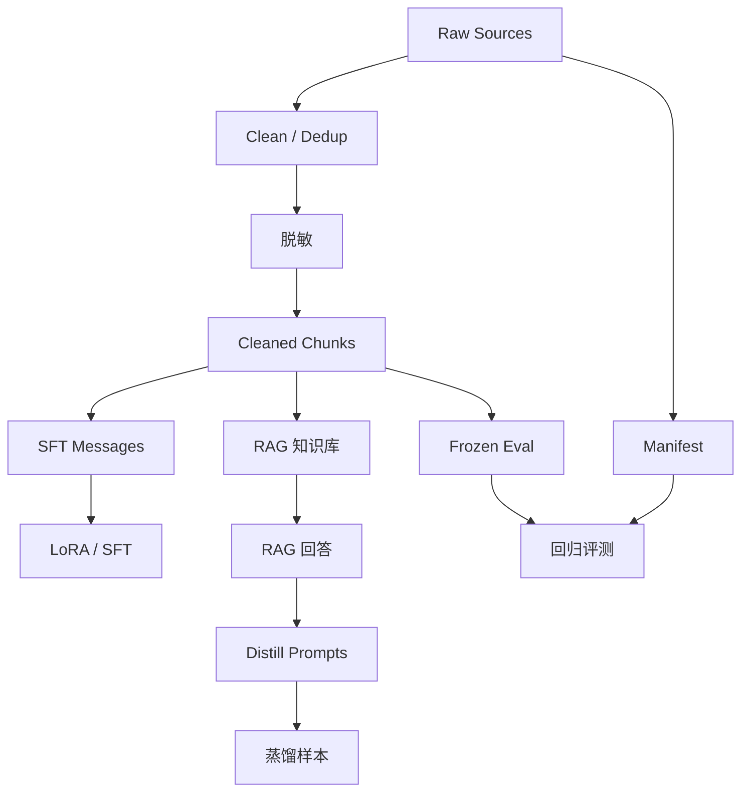

# mermaid-01 Mermaid render prompt

- Article: `lessons/11_domain_data_engineering.md`
- Source: `lessons/assets/11_domain_data_engineering/mermaid-01.mmd`
- Target: `lessons/assets/11_domain_data_engineering/mermaid-01.png`

## Prompt

展示领域数据从原始来源到清洗、训练、检索、评测和蒸馏的血缘关系。

## Mermaid Source

