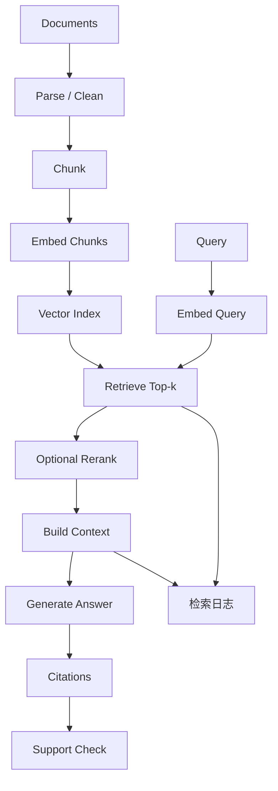

# mermaid-01 Mermaid render prompt

- Article: `lessons/12_rag_baseline.md`
- Source: `lessons/assets/12_rag_baseline/mermaid-01.mmd`
- Target: `lessons/assets/12_rag_baseline/mermaid-01.png`

## Prompt

展示 RAG 基线从文档索引到检索、生成、引用和失败定位的可诊断链路。

## Mermaid Source

