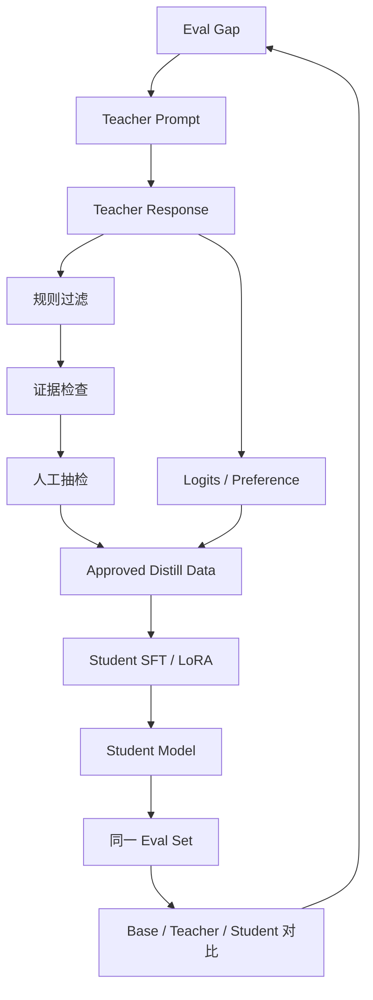

# mermaid-01 Mermaid render prompt

- Article: `lessons/13_distillation.md`
- Source: `lessons/assets/13_distillation/mermaid-01.mmd`
- Target: `lessons/assets/13_distillation/mermaid-01.png`

## Prompt

展示蒸馏如何从评测缺口出发，经 teacher 生成、过滤和 student 训练形成闭环。

## Mermaid Source

