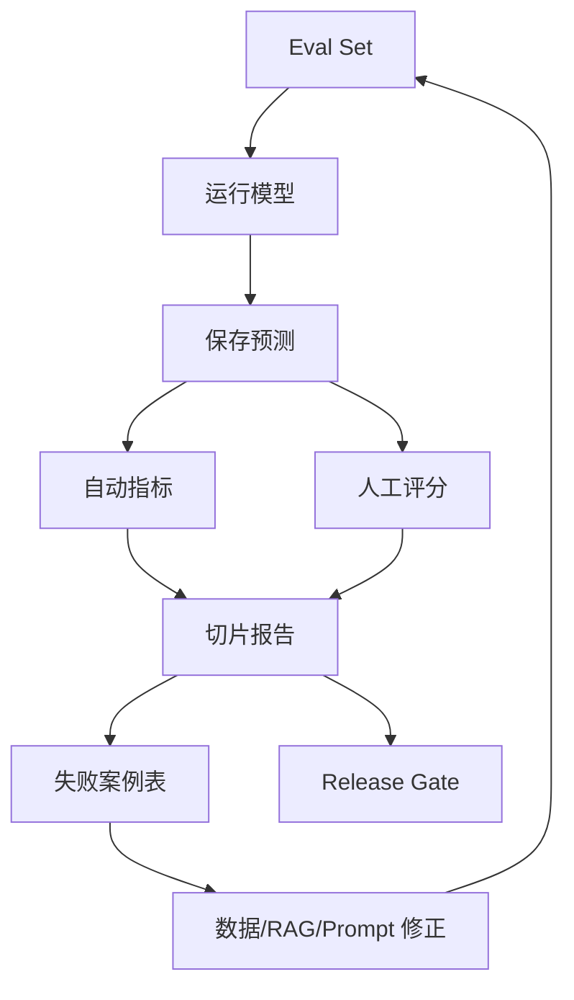

# mermaid-01 Mermaid render prompt

- Article: `lessons/14_evaluation.md`
- Source: `lessons/assets/14_evaluation/mermaid-01.mmd`
- Target: `lessons/assets/14_evaluation/mermaid-01.png`

## Prompt

展示模型评测从样本设计、运行、指标聚合到失败案例回流的完整证据链。

## Mermaid Source

