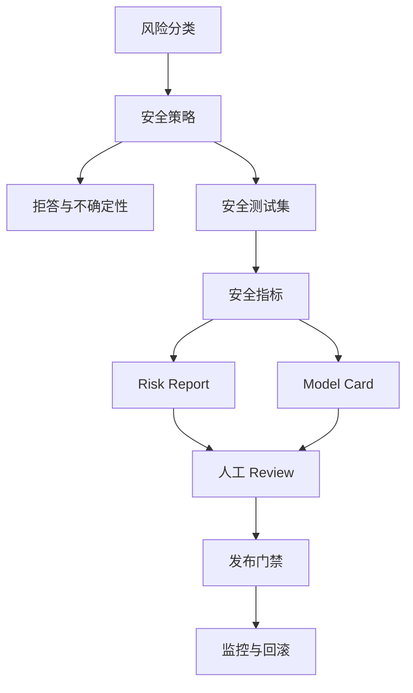

# mermaid-01 Mermaid render prompt

- Article: `lessons/15_safety_and_model_card.md`
- Source: `lessons/assets/15_safety_and_model_card/mermaid-01.mmd`
- Target: `lessons/assets/15_safety_and_model_card/mermaid-01.png`

## Prompt

展示安全边界如何从风险分类进入策略、测试、文档、人工复核和发布门禁。

## Mermaid Source

