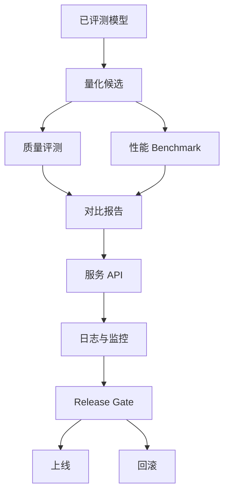

# mermaid-01 Mermaid render prompt

- Article: `lessons/16_quantization_and_serving.md`
- Source: `lessons/assets/16_quantization_and_serving/mermaid-01.mmd`
- Target: `lessons/assets/16_quantization_and_serving/mermaid-01.png`

## Prompt

展示量化实验与服务化发布如何共同决定模型能否上线。

## Mermaid Source

