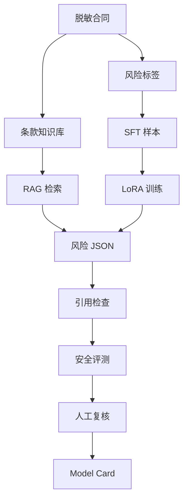

# mermaid-01 Mermaid render prompt

- Article: `lessons/17_legal_domain_project.md`
- Source: `lessons/assets/17_legal_domain_project/mermaid-01.mmd`
- Target: `lessons/assets/17_legal_domain_project/mermaid-01.png`

## Prompt

展示法律合同审查小模型从脱敏合同数据到风险 JSON、评测和人工复核的项目闭环。

## Mermaid Source

