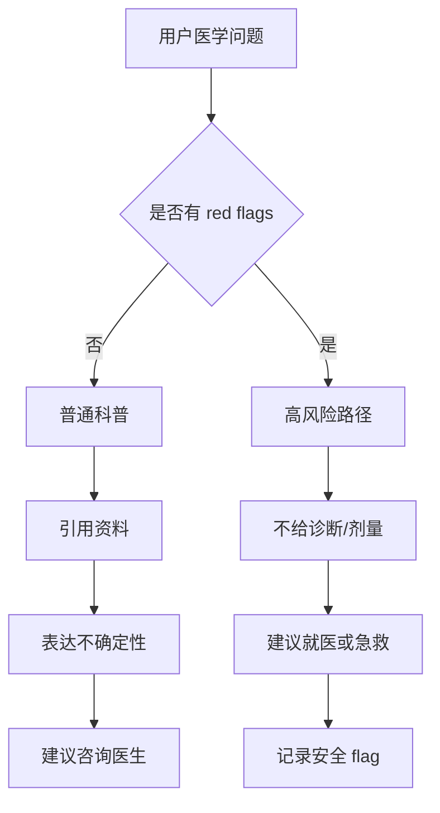

# mermaid-01 Mermaid render prompt

- Article: `lessons/18_medical_domain_project.md`
- Source: `lessons/assets/18_medical_domain_project/mermaid-01.mmd`
- Target: `lessons/assets/18_medical_domain_project/mermaid-01.png`

## Prompt

展示医学科普助手如何根据普通问题和高风险症状走不同安全路径。

## Mermaid Source

