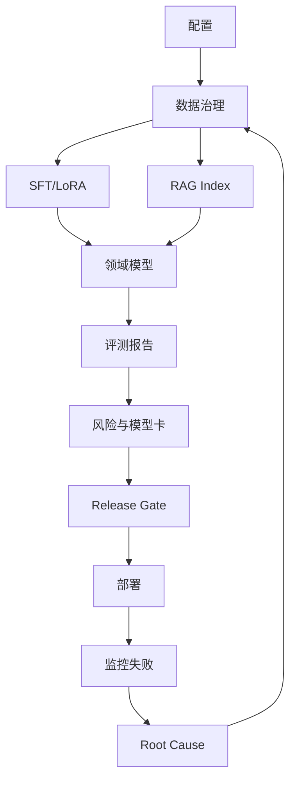

# mermaid-01 Mermaid render prompt

- Article: `lessons/19_domain_model_template.md`
- Source: `lessons/assets/19_domain_model_template/mermaid-01.mmd`
- Target: `lessons/assets/19_domain_model_template/mermaid-01.png`

## Prompt

展示可复用领域模型模板从配置、数据、训练到评测、发布和持续迭代的工程闭环。

## Mermaid Source

