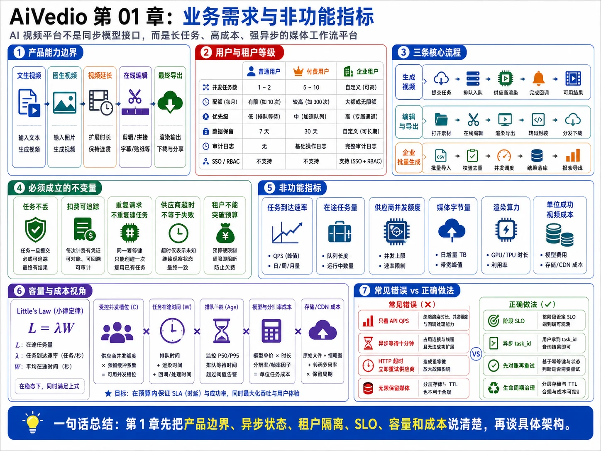
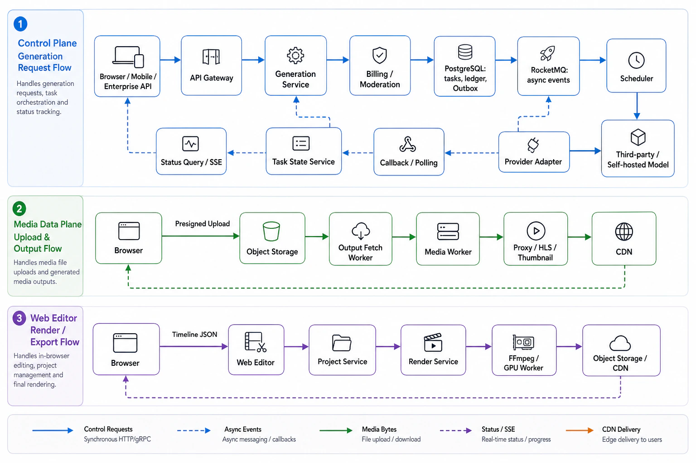

# 第 01 章：业务需求与非功能指标



> 图注：本章全文重点总结图，围绕产品能力边界、用户与租户等级、核心流程、业务不变量、非功能指标、容量成本视角和常见错误展开。

> **本章核心结论**：AI 视频平台不是“一个调用模型的接口”，而是一个面向长耗时、高成本、强异步、弱确定性任务的媒体工作流平台。它的容量单位不只是 HTTP QPS，更重要的是**任务到达速率、在途任务量、供应商并发额度、媒体字节量、渲染算力和单位成功视频成本**。

---

## 1. 本章要解决的业务问题

### 1.1 产品到底提供什么能力

平台需要覆盖从“生成素材”到“形成最终作品”的完整闭环，而不是只返回一个第三方视频地址。

| 能力 | 输入 | 输出 | 平台必须承担的责任 | 主要工程难点 |
|---|---|---|---|---|
| 文生视频 | Prompt、负向提示词、时长、比例、模型 | 原始生成视频 | 审核、计费、异步调度、状态通知、结果回源 | 长耗时、输出不确定、供应商限流 |
| 图生视频 | Prompt、参考图、首帧或人物素材 | 带运动的视频 | 参考素材校验、能力匹配、隐私和肖像治理 | 素材合规、模型兼容性、人物一致性 |
| 视频延长 | 原视频、延长方向、Prompt | 延长后的视频 | 原资产版本管理、任务链路追踪 | 上下文依赖、耗时和成本上升 |
| 在线编辑 | 视频、音频、字幕、贴图、转场、滤镜 | 时间轴项目版本 | 非破坏式编辑、自动保存、预览一致性 | 多轨同步、版本冲突、浏览器性能 |
| 最终导出 | 时间轴 JSON、输出参数 | 最终成品 | 服务端可靠渲染、封装、存储和分发 | CPU/GPU 密集、音画同步、跨片段依赖 |

第三方视频生成接口通常采用异步任务或长运行操作，而不是让一个 HTTP 请求持续等待到视频生成完成；某些供应商返回的结果地址还是短期地址，平台需要尽快回源到自己的存储。因此，产品层必须从一开始就向用户暴露“已受理、排队中、生成中、后处理中、成功、失败、取消中”等异步语义，而不能伪装成同步接口。[^runway-output] [^veo-lro]

### 1.2 业务边界

**本期纳入范围：**

1. Prompt、图片、视频等参考素材上传。
2. 文生视频、图生视频、视频延长等生成能力。
3. 多供应商模型接入与调度。
4. 内容审核、额度预占、结算、退款和对账。
5. 第三方输出回源、媒体探测、转码、代理视频、缩略图和波形。
6. 浏览器端非破坏式时间轴编辑。
7. 服务端最终渲染、对象存储和 CDN 分发。
8. 企业租户隔离、审计、配额和数据保留策略。

**暂不纳入或作为独立子系统处理：**

1. 基础视频模型的训练、预训练和大规模微调。
2. 社交信息流、推荐系统、广告投放等内容分发业务。
3. 影视工业级调色、复杂三维合成等专业工作站全部能力。
4. 强实时数字人和 WebRTC 媒体会话；该类能力应采用独立实时媒体架构。
5. 第三方版权归属的法律裁定；平台负责策略执行、留痕和申诉流程，但不替代法律判断。

明确边界的价值在于：防止团队把“生成平台”“在线剪辑器”“内容社区”“模型训练平台”混成一个无限扩张的系统，也便于为不同子系统设置不同的 SLO、成本模型和恢复目标。

### 1.3 用户类型与服务等级

下面是一组用于架构推导的示例产品策略，具体数值应由商业团队、供应商合同和容量测试共同确定。

| 维度 | 普通用户 | 付费用户 | 企业租户 |
|---|---|---|---|
| 单用户同时运行任务 | 1 | 4 | 按租户合同，例如 50～500 |
| 每日生成额度 | 低额度或按活动发放 | 按积分或套餐 | 共享额度池、预算上限 |
| 调度权重 | 1 | 5 | 10，或预留容量 |
| 排队目标 | 可接受分钟级等待 | 秒级至一分钟级 | 合同化 P95 排队目标 |
| 输出规格 | 可能限制分辨率、时长和水印 | 1080p、较长保留期 | 自定义规格、私有模型或专属供应商账号 |
| 数据保留 | 7 天示例 | 30 天示例 | 90 天或合同化策略 |
| 管理能力 | 个人项目 | 个人项目和账单 | SSO、RBAC、审计、数据驻留、成本中心 |
| 隔离方式 | 共享资源池 | 共享资源池内高权重 | 默认逻辑隔离；大客户可使用专属队列、配额或存储 |

企业租户隔离不应只理解为数据库里多一个 `tenant_id`。至少要覆盖：

- 身份和权限隔离。
- 任务并发和预算隔离。
- 调度公平性和预留容量。
- 对象存储命名空间与访问控制。
- 日志、指标和审计隔离。
- 数据保留、删除和地区策略。
- 供应商账号、密钥和账单归属。

### 1.4 三条核心用户流程

#### 流程 A：生成视频

```text
上传参考素材（可选）
→ 提交生成参数
→ 校验与审核
→ 额度预占
→ 任务排队
→ 模型生成
→ 输出回源与后处理
→ 获得可播放预览
```

#### 流程 B：编辑与导出

```text
将生成结果加入项目
→ 多轨时间轴编辑
→ 自动保存项目版本
→ 使用代理素材预览
→ 提交导出
→ 服务端渲染
→ 成品写入对象存储并通过 CDN 分发
```

#### 流程 C：企业批量生成

```text
企业 API 或控制台提交批量任务
→ 租户级预算与并发准入
→ 公平调度或预留容量
→ 批量回调/查询
→ 审计、成本中心归集和每日对账
```

### 1.5 必须成立的业务不变量

1. **任何已确认扣费都必须能关联到任务、供应商尝试和账本流水。**
2. **任何已向用户确认受理的任务都不能因为单点故障而无记录消失。**
3. **第三方调用超时不能直接等价为调用失败。** 对方可能已创建付费任务。
4. **同一个用户请求不能因重复点击或网络重试创建多个业务任务。**
5. **技术重试与用户主动“再生成一次”必须区分。** 后者是新的创作和新的成本。
6. **第三方临时输出必须转存为平台资产，不能直接作为永久产品地址。**
7. **任何租户都不能突破自身预算和并发限制占满全平台资源。**
8. **最终导出必须绑定不可变项目版本和素材版本，避免渲染过程中内容漂移。**

---

## 2. 核心设计原则

### 原则一：异步任务是产品协议，不只是后端实现细节

生成接口在完成校验、额度预占和持久化后应快速返回 `task_id`。用户随后通过快照查询与 SSE/WebSocket 增量通知观察状态。这样才能正确表达排队、重试、取消、供应商结果未知和后处理等状态。

### 原则二：控制面和媒体数据面分离

- **控制面**处理鉴权、任务、状态、额度、项目版本、调度和审计。
- **数据面**处理上传、下载、转码、HLS、代理视频、渲染和 CDN 流量。

Go API 传输元数据和签名凭证，不应成为数百 MB 视频的中转站。

### 原则三：按阶段定义 SLO，不使用一个笼统的“系统可用性”

创建任务、排队、供应商生成、输出回源、媒体处理和导出属于不同故障域。用户真正关心的是“什么时候能看到预览”和“什么时候能拿到成品”。Google SRE 的实践强调以可度量的服务级别指标定义目标，并用错误预算指导可靠性投入。[^google-slo]

### 原则四：PostgreSQL 管事实，Redis 管速度，RocketMQ 管异步传递，对象存储管媒体

- PostgreSQL：任务、计费、项目版本和资产元数据的事实源。
- Redis：限流、并发槽位、短期状态缓存和在线通知加速。
- RocketMQ：削峰、解耦、延迟重试、死信和工作流事件传递。
- 对象存储/CDN：原始素材、代理素材、生成结果和最终成品。

任何一个加速组件失效，都不应破坏任务和余额的最终事实。

### 原则五：成本是一级资源，也是正确性指标

一次错误重试可能不只是多发一条消息，而是再次触发一笔真实模型费用。因此系统必须同时控制：

- 每用户和每租户额度。
- 每分钟平台成本上限。
- 供应商在途任务数。
- 重试预算。
- 结果未知任务的对账。
- 重复生成和重复结算率。

### 原则六：容量规划以在途量和字节量为中心

普通 Web 系统常以 QPS 为主要容量指标；AI 视频平台还必须关注：

- 每秒到达任务数。
- 平均和 P95 生成时长。
- 供应商并发额度。
- 队列最老消息年龄。
- 每日新增媒体字节数。
- 转码和渲染的 CPU/GPU 秒。
- CDN 下行流量。

### 原则七：多租户系统先保证隔离，再追求平均利用率

简单 FIFO 可以提高局部吞吐，却可能让一个企业批量任务占满供应商额度。调度器应按租户选队列，再在租户内部选任务，并结合权重、等待时间 aging、并发上限和预留容量。

### 原则八：可靠性目标必须允许降级，而不是只描述“永不失败”

依赖故障时，应有明确顺序：优先保护账本与任务事实，其次保护已受理任务，再保护企业和付费用户 SLO，最后才是免费流量、精确进度、高清预览等可降级能力。

---

## 3. 详细架构与组件职责

### 3.1 逻辑架构



### 3.2 组件职责与边界

| 组件 | 核心职责 | 不应承担的职责 |
|---|---|---|
| API Gateway | 认证、租户限流、请求大小、幂等键透传 | 长时间等待模型完成 |
| Generation Service | 参数归一化、任务创建、额度预占、Outbox | 在数据库事务中调用供应商 |
| Asset Service | 上传会话、素材元数据、状态和权限 | 通过应用服务中转所有媒体字节 |
| Billing Service | 估价、预占、结算、释放、退款、对账 | 直接覆盖余额而不保留流水 |
| Moderation Service | 输入和输出审核、策略版本 | 自动无限重试审核失败任务 |
| Scheduler | 多级准入、公平队列、优先级、供应商选择 | 依赖单一 FIFO 或无限消费 MQ |
| Provider Adapter | 参数、状态、错误和回调归一化 | 把供应商特有逻辑散落到业务代码 |
| Callback Gateway | 验签、去重、快速落事件 | 在回调线程中下载视频和转码 |
| Polling Service | 回调缺失补偿、结果未知对账 | 高频无上限轮询所有任务 |
| Output Fetch Worker | 回源、校验、checksum、写对象存储 | 将第三方临时 URL 直接长期暴露给用户 |
| Media Worker | ffprobe、转码、代理、缩略图、波形、HLS | 与 API 服务共享无隔离 FFmpeg 进程 |
| Project Service | 时间轴版本、patch、乐观锁、自动保存 | 修改原始素材完成剪辑 |
| Render Service | 时间轴编译、渲染 DAG、最终导出 | 直接信任前端拼出的 FFmpeg 命令 |
| Notification Gateway | SSE/WebSocket 在线通知 | 作为任务事实的唯一来源 |

---

## 4. 文字版时序图

```text
1. 用户向 Asset Service 请求预签名上传地址。
2. 浏览器直接把参考图片或视频上传到对象存储。
3. Asset Service 在上传完成后异步校验 MIME、magic number、时长和分辨率。
4. 用户携带 asset_id、prompt、模型参数和 Idempotency-Key 提交生成请求。
5. API Gateway 完成身份认证、租户限流和请求体限制。
6. Generation Service 校验参数、素材状态和模型能力。
7. Moderation Service 执行输入审核。
8. Billing Service 估算成本并写入 RESERVE 流水。
9. Generation Service 在同一个 PostgreSQL 事务中创建任务、账本流水和 OutboxEvent。
10. 接口提交事务后立即返回 task_id，不等待模型结果。
11. Outbox Relay 将事件投递到 RocketMQ。
12. Scheduler 根据用户等级、租户额度、供应商健康度、成本和并发槽位选择执行路径。
13. Provider Adapter 提交供应商任务并记录 attempt_id、provider_job_id 或 SUBMIT_UNKNOWN。
14. 供应商通过回调或后端轮询返回状态。
15. Task State Service 以版本化状态机提交状态变化，并通知前端。
16. 成功后 Output Fetch Worker 立即把临时输出回源到平台对象存储。
17. Media Worker 完成探测、转码、代理视频、缩略图和输出审核。
18. 平台把可播放资产通过 CDN 暴露给用户，任务进入 SUCCEEDED。
19. 用户在编辑器中保存时间轴 patch，Project Service 生成不可变 revision。
20. 用户导出时，Render Service 固定 project_revision 和 asset checksum，提交异步渲染任务。
21. 渲染完成后成品写入对象存储，Billing Service 按实际消耗结算，用户获得平台 CDN 地址。
```

这条时序的关键不是组件数量，而是三个边界：

- **用户请求与长任务执行解耦。**
- **数据库提交与消息发送通过 Outbox 解耦。**
- **供应商成功与平台资产可播放之间通过回源和媒体处理解耦。**

---

## 5. 关键数据结构、指标和 SLO

### 5.1 任务请求模型

```text
GenerationRequest
- tenant_id
- user_id
- project_id
- idempotency_key
- generation_mode
- asset_ids[]
- prompt
- negative_prompt
- requested_model
- duration_sec
- resolution
- aspect_ratio
- seed
- priority_class
- budget_limit
- created_at
```

### 5.2 任务时间点

只有记录完整时间点，才能准确拆分排队、生成、回源和后处理耗时。

```text
TaskTiming
- accepted_at
- queued_at
- dispatch_started_at
- provider_submitted_at
- provider_started_at
- provider_finished_at
- output_fetch_started_at
- output_stored_at
- preview_ready_at
- finished_at
```

由此可计算：

```text
queue_wait              = provider_submitted_at - queued_at
provider_elapsed        = provider_finished_at - provider_submitted_at
platform_postprocess    = preview_ready_at - provider_finished_at
first_preview_time      = preview_ready_at - accepted_at
end_to_end_time         = finished_at - accepted_at
```

### 5.3 租户策略

```text
TenantPolicy
- plan
- daily_credit_limit
- max_inflight_tasks
- scheduler_weight
- reserved_provider_slots
- max_resolution
- retention_days
- data_region
- allowed_providers[]
- minute_cost_limit
```

### 5.4 成本字段

```text
CostProfile
- estimated_provider_cost
- actual_provider_cost
- retry_cost
- media_compute_cost
- storage_cost_allocated
- cdn_cost_allocated
- refunded_amount
- currency
```

### 5.5 SLI 定义

```text
任务创建可用率 = 成功提交事务并返回 task_id 的有效请求数 / 有效创建请求总数

用户感知生成成功率 = 最终成功任务数 / 已受理且未被用户取消的任务数

平台归因成功率 = 最终成功任务数 / 排除用户输入不合法、审核拒绝后的可执行任务数

首个预览时间 = preview_ready_at - accepted_at

排队时间 = provider_submitted_at - queued_at

单位成功视频成本 = 全部供应商尝试成本 + 媒体处理成本 + 可归因存储/CDN成本
                  ----------------------------------------------------------
                                  成功视频数量
```

“用户感知成功率”和“平台归因成功率”必须同时保留。只报告剔除大量失败后的内部成功率，会掩盖真实用户体验；完全不做归因，又无法判断故障来自输入、平台还是供应商。

### 5.6 示例 SLO

以下均为架构推导假设，不是通用行业标准。

| 服务阶段 | 示例目标 | 说明 |
|---|---|---|
| 有效创建请求可用率 | 月度 99.95% | 约等于 0.05% 错误预算；不包含参数校验拒绝 |
| 创建任务接口延迟 | P95 ≤ 300ms，P99 ≤ 800ms | 不等待模型和大文件上传 |
| 任务状态查询 | 月度 99.9%，P95 ≤ 200ms | Redis 失败时可回源 PostgreSQL |
| 企业任务排队 | P95 ≤ 15s | 依赖预留容量或合同化并发 |
| 付费任务排队 | P95 ≤ 60s | 高峰时有明确排队状态 |
| 普通任务排队 | P95 ≤ 300s | 可在过载时暂停新任务 |
| 标准短视频首个预览 | P95 ≤ 10min | 包含外部供应商耗时，应按模型单独拆分 |
| 供应商成功到平台可播放 | P95 ≤ 90s | 平台可控的回源和后处理 SLO |
| 3 分钟 1080p 导出 | P95 ≤ 10min | 复杂滤镜和 4K 项目另设档位 |
| 账本正确性 | 重复结算率趋近 0，日对账闭环 | 正确性目标不能只写成可用率 |
| 已确认任务持久性 | 不允许无记录丢失 | 通过数据库、Outbox 和对账验证 |

99.95% 的月度错误预算不是“每次事故都可用 21.6 分钟”，而是用于约束整月失败请求比例，并指导是否暂停高风险发布。

---

## 6. 正常流程

### 6.1 生成阶段

1. 客户端先上传素材，业务接口只接收 `asset_id`。
2. 后端根据租户策略检查额度、并发、模型权限和数据地区。
3. 输入审核通过后预占额度。
4. 在一个事务中创建任务、账本预占和 Outbox。
5. 任务进入租户队列，调度器按权重和配额领取。
6. 供应商提交成功后记录 `provider_job_id`。
7. 回调为主、轮询为补偿，推进内部状态机。
8. 成功输出立即回源，生成平台 Asset。
9. 后处理和输出审核完成后，任务对用户可播放。
10. 按实际成本结算，多余预占释放。

### 6.2 编辑阶段

1. 用户将平台 Asset 加入时间轴。
2. 编辑器只修改 `Timeline JSON`，不改原文件。
3. 操作以 patch 批量自动保存，携带 `base_revision`。
4. 后端使用乐观锁生成新项目 revision。
5. 预览使用代理视频，减少解码压力和网络流量。

### 6.3 导出阶段

1. 用户选择输出分辨率、码率和格式。
2. Render Service 固定项目 revision、素材 checksum 和渲染器版本。
3. 估算渲染成本并预占额度或并发槽位。
4. 编译为 Render DAG，提交渲染队列。
5. Worker 渲染、校验音画同步并封装成品。
6. 成品写入对象存储，账单结算并通知用户。

---

## 7. 异常流程和竞态条件

| 场景 | 风险 | 正确处理 |
|---|---|---|
| 用户重复点击提交 | 重复任务、重复费用 | `tenant_id + idempotency_key` 唯一约束，返回原任务 |
| 供应商已受理但本地超时 | 自动重试产生两个付费任务 | 进入 `SUBMIT_UNKNOWN`，先对账再决定是否重试 |
| 回调先于提交响应到达 | 本地还没有完整 `provider_job_id` | 使用 attempt_id、回调暂存和幂等关联 |
| 回调重复或乱序 | `SUCCEEDED` 被旧 `RUNNING` 覆盖 | 事件去重、状态版本、终态粘性 |
| 用户取消与供应商完成同时发生 | 错误退款或丢失结果 | 先写 `CANCEL_REQUESTED`，按供应商真实阶段结算 |
| 供应商成功但输出 URL 即将过期 | 结果永久丢失 | 高优先级回源队列、URL 到期监控和轮询补偿 |
| 租户在排队期间降级套餐 | 已排队任务是否继续执行不明确 | 创建时固化服务等级快照，后续按合同规则处理 |
| 额度预占成功但任务创建失败 | 余额被冻结 | 同库事务，或补偿释放流水 |
| MQ 重复投递 | 重复提交模型或重复转码 | 消费端 inbox 去重和业务唯一约束 |
| 对象存储不可用 | 已生成结果无法回源 | 暂停新提交或降低并发，避免临时 URL 大面积过期 |
| 项目导出期间素材被删除 | 渲染失败或内容漂移 | 导出清单固定版本，资产删除采用引用计数或延迟回收 |
| 企业批量任务突发 | 挤占普通用户或打穿供应商配额 | 租户并发、加权公平、预留槽位和平台总成本上限 |

特别需要向面试官说明：AI 生成具有弱确定性。即便使用相同 Prompt 和 seed，不同供应商版本、内部实现或安全策略也可能产生差异。因此“重试”不是普通数据库查询重试，它可能生成不同内容并产生新费用。

---

## 8. 幂等、一致性、重试和补偿设计

### 8.1 五层幂等

1. **API 层**：`Idempotency-Key` 绑定租户和请求指纹。
2. **数据库层**：任务、供应商任务、消费事件和账本业务键建立唯一约束。
3. **消息层**：每条消息携带全局 `event_id`，消费者记录 `consumer_name + event_id`。
4. **供应商层**：优先使用供应商幂等键；不支持时记录独立 `attempt_id` 并处理结果未知。
5. **资产层**：输出 Asset 使用任务、尝试、输出序号和 checksum 建立唯一关系。

### 8.2 一致性策略

- 任务、预占流水和 Outbox 在同一 PostgreSQL 事务提交。
- RocketMQ 按至少一次投递理解，不能假设天然 exactly-once。
- 状态更新使用允许转换表和乐观锁版本。
- Redis 只是缓存和准入，不作为任务、余额或项目版本的唯一事实源。
- 账本采用追加式流水，不直接原地修改历史记录。

### 8.3 重试分类

| 错误 | 是否自动重试 | 说明 |
|---|---:|---|
| 参数错误、格式不支持 | 否 | 用户修改后创建新请求 |
| 内容审核拒绝 | 否 | 防止反复触发供应商安全策略 |
| 429 限流 | 是 | 指数退避、抖动、尊重 Retry-After |
| 502/503/504 | 有上限 | 前提是能确认请求尚未被供应商受理 |
| 连接建立前失败 | 通常可重试 | 仍需根据客户端和供应商语义判断 |
| 请求发送后读超时 | 不能立即重试 | 进入结果未知并对账 |
| 输出回源超时 | 可重试 | 使用 Range、断点和 URL 有效期预算 |
| 转码 Worker 崩溃 | 可重试 | 输出键唯一，临时目录隔离 |
| 账单结算失败 | 可重试 | 账本业务键保证不重复结算 |

### 8.4 补偿

```text
预占成功、最终失败      → RELEASE
供应商已收费、平台异常  → COMPENSATE 或按业务规则 SETTLE
重复供应商任务          → 标记重复成本，尝试取消并进入对账
成功结果丢失            → 查询供应商、重新获取地址；无法恢复时退款或赠送额度
取消太晚                → 根据供应商实际收费阶段进行部分或不退款
```

补偿不是“把数据库改回去”，而是创建新的、可审计的状态事件和账本流水。

---

## 9. 性能瓶颈与容量估算

### 9.1 假设数据

以下数据仅用于展示推导方法，不代表任何实际产品或供应商报价。

| 指标 | 假设值 |
|---|---:|
| 日活用户 DAU | 200,000 |
| 每日生成任务 | 240,000 |
| 平均任务到达率 | 2.78 个/秒 |
| 1 分钟峰值到达率 | 16 个/秒 |
| 平均生成与平台处理时间 | 180 秒 |
| 供应商慢化场景平均时间 | 300 秒 |
| 每个生成结果平台占用 | 33 MB |
| 每日上传参考素材 | 120,000 个，平均 35 MB |
| 每日导出任务 | 30,000 |
| 导出峰值到达率 | 1.2 个/秒 |
| 平均导出执行时间 | 360 秒 |
| 每日控制面 API 调用 | 12,000,000 |

### 9.2 使用 Little’s Law 估算在途任务

Little’s Law 在稳态下表示：

```text
L = λ × W

L：系统平均在途任务数
λ：平均到达率
W：任务平均停留时间
```

MIT 的排队论课程材料明确说明该关系适用于大量实际稳态系统，但使用时要注意它描述的是平均量，不能替代峰值、长尾和故障场景分析。[^little-law]

#### 日均在途量

```text
λ = 240,000 / 86,400 ≈ 2.78 个/秒
W = 180 秒
L = 2.78 × 180 ≈ 500 个任务
```

#### 正常峰值在途量

```text
λ_peak = 16 个/秒
W = 180 秒
L_peak = 16 × 180 = 2,880 个任务
```

#### 供应商慢化场景

```text
λ_peak = 16 个/秒
W_slow = 300 秒
L_slow = 16 × 300 = 4,800 个任务
```

再加入 25% 的容量余量：

```text
4,800 × 1.25 = 6,000 个在途槽位
```

因此，本例不能只准备“16 QPS 的提交接口”，而要准备大约 6,000 个受控在途任务槽位，并把它们拆分到租户、供应商、模型和平台媒体处理阶段。

### 9.3 队列积压推导

假设高峰到达率为 16 个/秒，故障期间平台实际处理能力下降到 12 个/秒，持续 10 分钟：

```text
积压增长 = (16 - 12) × 600 = 2,400 个任务
```

故障恢复后处理能力提升到 20 个/秒，净消化速度为 4 个/秒：

```text
清空时间 = 2,400 / (20 - 16) = 600 秒 = 10 分钟
```

这说明“系统恢复”不等于“用户体验恢复”。监控不仅要看服务实例是否健康，还要看：

- 队列积压量。
- 最老任务等待时间。
- 净消化速度。
- 按租户和优先级拆分的等待时间。

### 9.4 供应商容量

若规划 6,000 个在途槽位，可以示例拆分为：

```text
Provider A：2,400
Provider B：1,800
Provider C / 自建模型：1,500
应急保留或弹性额度：300
总计：6,000
```

但这并不意味着单个最大供应商失效后仍能维持所有用户的峰值 SLO。若要求 N+1 全量承载，剩余供应商总容量必须仍大于峰值需求，成本和合同复杂度会明显上升。更现实的策略通常是：

1. 企业预留容量优先保护。
2. 付费任务延长排队时间。
3. 普通用户暂停新建或进入更长队列。
4. 只在能力、合规和输出语义兼容时切换供应商。

### 9.5 控制面 API 容量

```text
12,000,000 次/天 ÷ 86,400 ≈ 139 QPS 平均值
```

若峰谷系数取 7：

```text
峰值约 139 × 7 ≈ 973 QPS
```

考虑发布、故障转移、批量企业调用和 50% 余量，可将初始控制面目标设为约 1,500 QPS。这里的 API QPS 远小于媒体字节和在途任务带来的资源压力，因此不能用“接口能抗 1 万 QPS”证明系统具备 AI 视频平台容量。

### 9.6 数据库写入估算

假设每个生成任务平均产生：

- 10 次关键状态或任务更新。
- 10 条任务事件。
- 3 条账本流水。

则生成链路约产生：

```text
240,000 × 23 = 5,520,000 行级写入/天
```

再加项目自动保存、资产状态和导出事件，假设总计 8,500,000 次/天：

```text
平均约 98 次/秒
峰值按 7 倍估算约 686 次/秒
```

可以先按 1,500 次/秒持续写入能力设计，并通过压测验证 WAL、索引、Autovacuum 和连接池。高频百分比进度不应全部写 PostgreSQL，否则写放大远大于上述估算。

### 9.7 对象存储容量

#### 生成结果

```text
240,000 × 33 MB = 7.92 TB/天
30 天热存储 = 237.6 TB
```

#### 用户参考素材

```text
120,000 × 35 MB = 4.2 TB/天
30 天热存储 = 126 TB
```

#### 加入 20% 的版本、冗余派生文件和估算余量

```text
(237.6 + 126) × 1.2 = 436.32 TB 热数据
```

这里还未包含企业长期归档和最终导出成品，因此必须从产品层明确保留期、归档和删除策略。无限保留会使存储成本成为不可控的长期负债。

### 9.8 CDN 流量

假设每个生成结果平均播放 3.5 次，每次因部分观看和自适应码率实际下行 12 MB：

```text
240,000 × 3.5 × 12 MB = 10.08 TB/天
```

假设每日 30,000 个导出成品，每个平均下载 120 MB：

```text
30,000 × 120 MB = 3.6 TB/天
```

总下行约：

```text
13.68 TB/天
≈ 410.4 TB/月
```

CDN 容量还应按地区、峰值带宽、Range 请求、缓存命中率和防盗链拆分，而不是只看月总流量。

### 9.9 渲染容量

```text
峰值导出到达率 = 1.2 个/秒
平均执行时间 = 360 秒
在途渲染 = 1.2 × 360 = 432 个
加入 25% 余量 ≈ 540 个渲染槽位
```

“一个渲染槽位”不是固定一台机器。实际应按 720p、1080p、4K、滤镜复杂度、GPU 特效和编码器分别统计 CPU 秒、GPU 秒、内存峰值和临时盘字节，采用多种 Worker 规格。

### 9.10 成本推导

假设平均模型成本为 **¥1.8/任务**：

```text
日模型成本 = 240,000 × 1.8 = ¥432,000
月模型成本 ≈ ¥12,960,000
```

若热存储单价假设为 **¥0.12/GB·月**：

```text
436,320 GB × 0.12 ≈ ¥52,358/月
```

若 CDN 下行假设为 **¥0.18/GB**：

```text
410,400 GB × 0.18 ≈ ¥73,872/月
```

以上价格只是演算变量，实际供应商、地区、阶梯折扣和请求费用会显著不同。这个例子要表达的是：在该假设下，模型成本远高于存储和 CDN，因此重复生成、无效重试和供应商账单偏差必须成为核心监控指标。

即使重复提交率只有 0.1%：

```text
240,000 × 0.1% × ¥1.8 = ¥432/天
≈ ¥12,960/月
```

若重复率上升到 1%，则该异常成本放大十倍。成本正确性不是财务系统上线后再补的功能，而是生成链路设计的一部分。

### 9.11 容量规划方法

1. 使用 30、90、180 天业务增长预测，而不是只看昨天峰值。
2. 分别记录 P50、P95、P99 生成时间和输出大小。
3. 按模型、供应商、地区、租户等级拆分到达率。
4. 把最大供应商故障、对象存储故障和回源积压纳入压测。
5. 设置平台总并发、租户并发、供应商并发、模型并发和分钟成本五级阈值。
6. 每季度进行容量和灾难恢复演练，校准假设数据。

---

## 10. 高可用和降级方式

### 10.1 RTO 与 RPO

RTO 是服务中断后可接受的最大恢复时间；RPO 是故障发生时可接受的数据恢复点距离，也就是最多可以容忍丢失多长时间的数据。两者应由业务影响和成本共同决定，而不是统一设成越小越好。[^aws-rto-rpo]

下面是一组示例目标：

| 数据或服务 | 示例 RTO | 示例 RPO | 设计说明 |
|---|---:|---:|---|
| 同区域控制面可用区故障 | 2 分钟 | 近似 0 | 多副本应用、数据库同步高可用 |
| 区域级控制面灾难 | 30 分钟 | ≤ 5 分钟 | 跨区域日志/备份、基础设施自动化 |
| 计费账本 | 30 分钟 | ≤ 1 分钟 | 比一般业务日志更严格，恢复后必须对账 |
| 项目版本和任务事实 | 30 分钟 | ≤ 5 分钟 | PostgreSQL PITR 和跨区域复制 |
| 用户原始素材 | 60 分钟 | ≤ 15 分钟 | 对象版本、跨区域复制或可验证备份 |
| Redis 状态和并发计数 | 允许重建 | 不定义持久 RPO | 从 PostgreSQL 和运行任务重新对账 |
| MQ 未消费事件 | 由 Outbox 恢复 | 与 PostgreSQL RPO 对齐 | 不把 MQ 当作唯一任务事实源 |

对关键账本声称跨区域严格 RPO=0，通常意味着同步跨区域提交、显著延迟和更高成本。面试中应说明业务取舍，而不是给出无法验证的绝对承诺。

### 10.2 故障与降级矩阵

| 故障 | 系统行为 |
|---|---|
| 单个供应商失败 | 熔断；兼容任务切换；不兼容任务保留排队 |
| 全部供应商失败 | 停止继续消耗额度；保留任务；限制新建并显示延迟 |
| PostgreSQL 写不可用 | 暂停新付费任务，避免产生无法记录的外部成本 |
| Redis 失败 | 状态查询回源数据库；SSE 降级轮询；限流采用保守策略 |
| RocketMQ 失败 | Outbox 堆积；超过安全阈值后停止接新任务 |
| 对象存储失败 | 暂停或降低模型提交，优先抢救已成功的临时输出 |
| CDN 失败 | 切备用域名或限流回源，不让业务 API 承接全部视频流量 |
| Media Worker 积压 | 生成可继续但“可播放预览”SLO下降；按 URL 到期时间优先 |
| Render Worker 过载 | 导出排队；编辑和生成控制面保持可用 |
| SSE Gateway 失败 | 客户端重连并重新获取任务快照 |
| 区域级灾难 | 切换控制面；恢复前先对账供应商任务，禁止盲目重复提交 |

### 10.3 降级优先级

```text
第一优先级：任务事实、账本和租户隔离正确
第二优先级：已受理任务不丢失、第三方结果不失效
第三优先级：企业和付费用户的排队与恢复目标
第四优先级：普通用户新任务、高清代理、精确进度
第五优先级：非关键推荐、实时动画和装饰性功能
```

---

## 11. 安全风险

| 风险 | 设计要求 |
|---|---|
| 越权访问其他租户素材 | 所有任务、项目和对象访问均校验 tenant_id 与资源权限 |
| 预签名 URL 泄漏 | 短期有效、限制对象键和方法、必要时限制大小与 Content-Type |
| 任意 URL 导致 SSRF | 平台受控下载、域名白名单、阻止私网地址和 DNS rebinding |
| 恶意媒体攻击 ffprobe/FFmpeg | 沙箱、资源限制、超时、独立工作目录、及时更新版本 |
| Prompt 与素材敏感信息泄漏 | 日志脱敏、最小化留存、供应商数据策略和地区约束 |
| 供应商密钥泄漏 | 密钥管理系统、短期凭证、禁止下发浏览器 |
| Webhook 伪造或重放 | 签名、时间戳、nonce、事件去重和来源限制 |
| 额度和并发滥用 | 多级限流、预算上限、异常账号检测 |
| Idempotency-Key 被恶意复用 | 绑定用户、租户和请求指纹，并设置保留窗口 |
| 生成内容合规风险 | 输入与输出双重审核、策略版本、申诉和审计 |
| 版权和肖像风险 | 用户声明、素材来源记录、企业策略、删除和投诉流程 |
| 导出命令注入 | 不拼接 shell 字符串，使用参数数组和受控模板 |

---

## 12. 常见错误设计及其后果

| 错误设计 | 后果 |
|---|---|
| 把生成做成同步 HTTP | 连接占用、网关超时、用户重试、任务状态不可恢复 |
| 只做 API QPS 压测 | 忽略数千在途任务、供应商额度和媒体吞吐 |
| 全部用户进入一个 FIFO | 大客户挤占全平台资源，普通和付费 SLO 失控 |
| 使用一个笼统的 99.9% SLA | 无法定位创建、排队、生成、回源还是渲染阶段失败 |
| HTTP 超时后立即重试供应商 | 产生重复付费任务和双重计费 |
| Redis 保存余额和任务唯一状态 | 故障或切换时破坏核心事实 |
| 认为 MQ 天然 exactly-once | 重复消费导致重复提交、重复转码或重复结算 |
| 第三方 URL 直接给前端 | URL 过期后作品不可用，也难以审核和权限控制 |
| 无限保留所有原始和派生媒体 | 存储成本持续增长且删除合规困难 |
| 额度只在任务完成后扣除 | 并发任务可透支预算，企业成本失控 |
| 所有供应商失败都自动切换 | 能力、Prompt 语义、地区和合规可能不兼容 |
| 把“重试”与“重新生成”混为一谈 | 用户作品变化、账单争议、审计困难 |
| 故障恢复后盲目重放全部任务 | 已被供应商受理的任务被再次提交 |
| 免费和企业任务共享同一降级策略 | 无法满足合同化服务等级 |

---

## 13. 面试官可能追问的 10 个问题

1. 为什么生成任务不能采用同步 HTTP，设置一个十分钟超时不可以吗？
2. Little’s Law 在这里如何使用，它有哪些限制？
3. 为什么不能只用 QPS 进行容量规划？
4. 生成成功率的分母应该如何定义，审核失败算不算失败？
5. 如何保证企业租户 SLO，同时又不让普通用户永久饥饿？
6. 供应商已创建任务但本地超时时，系统怎样避免重复生成？
7. RTO 和 RPO 应该如何为不同组件分别制定？
8. 如果最大供应商突然不可用，是否必须做到无感切换？
9. 第三方供应商不受平台控制，端到端 SLO 应该怎样承诺？
10. 如何证明你的容量假设和成本模型不是拍脑袋？

---

## 14. 每个追问的资深回答

### 14.1 为什么不能同步等待十分钟？

同步等待会把长任务生命周期绑定到浏览器、网关和服务实例连接上。任何中间超时都会让用户不知道任务是否创建成功，并诱发重复提交。异步接口先在数据库中完成幂等任务和额度预占，再返回 `task_id`；后续状态与请求连接解耦，可以支持取消、重试、故障恢复和多端查看。同步接口可以作为极短任务的包装，但不能成为任务事实边界。

### 14.2 Little’s Law 如何使用，有什么限制？

用 `L = λW` 根据到达率和平均停留时间估算平均在途量。例如峰值 16 个任务/秒、平均 180 秒，约有 2,880 个在途任务。它要求系统近似稳态，且使用平均值，因此不能直接覆盖突发、P99 长尾、供应商故障和有限队列。实际容量还要增加慢化场景、队列增长和安全余量，并用生产分布校准。

### 14.3 为什么不能只看 QPS？

创建接口可能只有几十或几百 QPS，但每个请求会占用数分钟的供应商并发、产生几十 MB 媒体、触发转码并承担真实成本。真正的瓶颈常是供应商槽位、最老消息等待时间、对象存储吞吐、FFmpeg/GPU 资源和 CDN 带宽。QPS 只是控制面指标之一。

### 14.4 生成成功率分母怎么定义？

至少同时报告两个口径。用户感知成功率以所有已受理且未主动取消的任务为分母，反映真实体验；平台归因成功率可以剔除输入校验和内容审核拒绝，用于工程归因。不能只展示经过大量剔除后的高成功率。还应按模型、供应商、地区和失败类别拆分。

### 14.5 企业 SLO 与普通用户公平如何兼顾？

使用分层队列和加权公平调度，而不是简单优先级抢占。企业可获得预留并发和更高权重，但普通队列通过最低服务份额、等待时间 aging 和最大连续调度数避免饥饿。平台还要限制单租户并发，即使企业客户也不能无限占用公共资源池。

### 14.6 提交结果未知怎样处理？

请求发送后读超时不能直接重试。系统记录 `attempt_id` 并进入 `SUBMIT_UNKNOWN`，优先使用供应商幂等键、任务列表、请求标签或账单查询对账。确认未创建才重试；确认已创建则补录 `provider_job_id`；无法确认时采用延迟重试和人工/自动对账，并把重复成本作为独立指标。

### 14.7 RTO/RPO 如何制定？

先做业务影响分析，再按数据价值分层。任务和账本比进度缓存更严格；Redis 可以重建，不必追求和账本相同的 RPO。区域内可通过同步高可用取得近似 RPO 0，跨区域严格 RPO 0 会增加延迟和成本，因此可给账本设 1 分钟、项目和任务设 5 分钟、派生缓存允许重建。所有目标都要通过恢复演练验证。

### 14.8 最大供应商故障是否必须无感切换？

不一定。不同供应商的模型能力、Prompt 语义、安全策略、数据地区和成本可能不兼容。强行切换可能产出不同内容或违反企业合同。应先做能力矩阵判断：兼容任务自动切换，不兼容任务保留排队；企业预留容量优先，普通用户延长等待。是否做 N+1 全量承载是成本与合同的业务决策。

### 14.9 外部依赖下如何承诺端到端 SLO？

把 SLO拆成平台可控部分和用户端到端部分。平台可控指标包括任务创建、排队调度、供应商成功后的回源和后处理；端到端首个预览时间则按具体模型和地区给产品目标，并披露外部依赖。供应商故障不会免除用户体验指标，但内部归因和合同责任必须分开。

### 14.10 如何验证容量和成本模型？

先用业务漏斗和 Little’s Law 得到初始模型，再用供应商压测、影子流量、媒体样本集和生产指标校准。每个假设都应有来源和误差范围，例如到达率、平均时长、输出大小、播放次数和重试率。每月用实际账单、对象存储清单、CDN 日志和数据库事件重新拟合，并在最大供应商故障、对象存储故障和队列恢复演练中验证。

---

## 15. 三分钟口述稿

我们做的不是一个同步调用 AI 接口的功能，而是一个面向长耗时、高成本、强异步任务的 AI 视频生成和在线剪辑平台。业务上覆盖文生视频、图生视频、视频延长、时间轴编辑和最终导出。用户提交请求后，平台先做参数校验、内容审核、额度预占和幂等任务创建，然后通过 Outbox 和 RocketMQ 异步调度供应商。生成成功后不能直接把供应商临时 URL 交给用户，而要回源到自己的对象存储，完成探测、转码、代理视频、缩略图和输出审核，再通过 CDN 播放。编辑器采用非破坏式时间轴，最终由服务端可靠渲染。

非功能指标上，我不会只说系统能抗多少 QPS。假设每天 24 万个生成任务，峰值 16 个每秒，平均生成和处理时间 180 秒，根据 Little’s Law，峰值约有 2,880 个在途任务；供应商慢化到 300 秒后会达到 4,800 个，加入 25% 余量，需要约 6,000 个受控槽位。这个容量要继续拆到租户、供应商和模型，而不是无限开 goroutine。

SLO 也按阶段拆分：任务创建月度 99.95%，企业、付费和普通用户分别设置排队目标；供应商成功后到平台可播放的 P95 例如控制在 90 秒；三分钟 1080p 导出 P95 控制在十分钟。端到端生成时间受外部供应商影响，需要按模型单独统计。

成本同样是核心正确性问题。模型调用可能远高于存储和 CDN，因此 HTTP 超时后不能直接重试；对方可能已经创建了付费任务。系统要进入结果未知状态，先对账，再决定是否重试。任务、账本和 Outbox 由 PostgreSQL 保证事实；Redis 只做限流和缓存；RocketMQ 按至少一次处理；对象存储负责媒体。故障时优先保护任务和账本，随后保护已受理任务和企业 SLO，最后再降级普通用户、高清预览和实时进度。

---

## 16. 十分钟深入讲解提纲

### 0:00～1:00：业务定位

- 平台不是“模型 API 封装”，而是生成、资产、编辑、渲染和计费闭环。
- 明确文生视频、图生视频、延长、编辑、导出五类能力。
- 强调异步、弱确定性和真实成本。

### 1:00～2:00：用户与租户分层

- 普通、付费、企业的并发、排队、保留期和管理能力不同。
- 企业隔离涵盖身份、预算、调度、存储、审计和地区。
- 说明逻辑隔离与专属资源池的成本取舍。

### 2:00～3:30：控制面与数据面

- 控制面负责任务、状态、账本、调度和项目版本。
- 数据面负责上传、回源、转码、代理、渲染和 CDN。
- PostgreSQL、Redis、RocketMQ、对象存储职责边界。

### 3:30～5:00：SLO 设计

- 创建、排队、供应商生成、回源、预览、导出分别度量。
- 同时报告用户感知成功率和平台归因成功率。
- 示例目标：创建 99.95%，企业排队 P95 15 秒，供应商成功到可播放 P95 90 秒。
- 说明错误预算和外部依赖归因。

### 5:00～6:30：容量推导

- 24 万任务/天，平均 2.78/s，峰值 16/s。
- Little’s Law：正常峰值 2,880 在途，慢化场景 4,800，加余量约 6,000。
- 队列能力下降 4/s、持续十分钟会积压 2,400 个任务。
- 控制面约 1,500 QPS 目标，但不是主要瓶颈。

### 6:30～7:30：媒体和渲染容量

- 每日生成结果约 7.92 TB，参考素材约 4.2 TB。
- 30 天热数据加余量约 436 TB。
- CDN 月下行约 410 TB。
- 导出峰值 1.2/s、平均 360 秒，约 540 个含余量渲染槽位。

### 7:30～8:30：成本与正确性

- 假设模型成本 ¥1.8/任务，月成本约 ¥1,296 万。
- 0.1% 重复提交也会产生持续异常成本。
- 区分技术重试和业务再生成。
- 账本追加、预占、结算、释放和补偿。

### 8:30～9:30：故障恢复和降级

- PostgreSQL 失败时暂停新付费任务。
- Redis 失败时回源数据库并降级实时通知。
- MQ 失败由 Outbox 承接，超过阈值停止接单。
- 最大供应商失败时按能力切换，不承诺所有任务无感迁移。
- RTO/RPO 按任务、账本、素材和缓存分别设定。

### 9:30～10:00：总结

- 高并发的核心是准入、排队、公平、背压和恢复，不是无限 goroutine。
- 高可用的核心是任务和成本事实可恢复，不是每个组件都宣称永不失败。
- 面试收口语句：**PostgreSQL 管事实，RocketMQ 管异步传递，Redis 管速度和准入，对象存储管媒体；容量看在途任务与字节，正确性同时包含状态和成本。**

---

## 参考依据

[^runway-output]: [Runway API — Output formats](https://docs.dev.runwayml.com/assets/outputs/)。官方说明任务成功后返回输出 URL，且该 URL 为短期地址，应保存到自己的存储。
[^veo-lro]: [Google Cloud — Generate videos with Veo](https://docs.cloud.google.com/gemini-enterprise-agent-platform/models/video/generate-videos-from-an-image)。官方示例采用长运行操作并将输出写入指定存储。
[^google-slo]: [Google SRE Workbook — Implementing SLOs](https://sre.google/workbook/implementing-slos/)。SLO 用于定义服务可靠性的目标水平，并结合错误预算指导决策。
[^little-law]: [MIT OpenCourseWare — Markov Processes and Queues](https://ocw.mit.edu/courses/2-854-introduction-to-manufacturing-systems-fall-2016/resources/markov-processes-and-queues/)。课程材料给出稳态下的 Little’s Law：`L = λW`。
[^aws-rto-rpo]: [AWS Well-Architected — Disaster Recovery objectives](https://docs.aws.amazon.com/wellarchitected/latest/reliability-pillar/disaster-recovery-dr-objectives.html)。文档给出 RTO 和 RPO 的定义及其在恢复策略中的作用。
