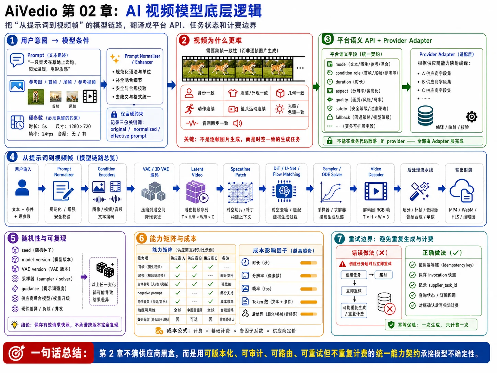

# 第 02 章：AI 视频模型底层逻辑



> 图注：本章全文重点总结图，围绕模型条件、跨帧一致性、平台语义 API、提示词到视频帧链路、随机性、能力矩阵、成本和重试边界展开。

> **本章定位**：面试中不需要复现某家商业模型的训练细节，而要能说明“从提示词到视频帧”的通用技术链路，并把模型能力、随机性、成本与失败语义翻译成可落地的平台 API、任务状态和计费边界。
>
> **一句话主线**：AI 视频生成通常是在压缩后的视频潜空间中，将文本、图片或参考视频编码为条件，由扩散 Transformer、时空 U-Net 或流匹配模型从噪声逐步生成时空潜变量，再解码、增强、审核并封装为视频；平台工程的关键不是猜测供应商内部网络，而是建立可版本化、可审计、可路由、可重试但不重复计费的统一能力契约。

---

## 1. 本章要解决的业务问题

平台对外暴露的是“文生视频、图生视频、首尾帧控制、参考人物、视频延长、生成音频”等业务能力，但供应商底层的模型结构、参数名称、限制和失败语义并不统一。本章需要解决六类问题。

### 1.1 把用户意图翻译成模型可消费的条件

用户可能只输入一句“一个人在雨夜奔跑”，但生成模型更容易从结构明确的描述中理解：

- 主体是谁、外观如何；
- 在做什么，动作如何随时间变化；
- 场景、天气、光照和风格；
- 景别、机位、镜头运动和构图；
- 视频时长、宽高比、帧率和节奏；
- 是否有对白、环境声或音乐；
- 需要避免的元素和合规限制。

因此平台通常需要提示词规范化和可选的 prompt enhancement，但不能悄悄改变用户的关键意图，也不能让增强结果在每次重试时随机变化。

### 1.2 解释为什么视频生成比单张图片更难

图片只需要在二维空间内保持结构合理；视频还需要在时间维度上保持：

- 人物身份与服装连续；
- 物体数量和几何关系稳定；
- 动作符合时间顺序；
- 镜头运动连贯；
- 光照、纹理和背景不过度闪烁；
- 音频与口型、动作或环境同步。

这也是视频模型需要时间压缩、时序注意力、3D 卷积、时空 patch 或分阶段生成的原因。

### 1.3 将模型参数映射成稳定的平台 API

平台不能简单暴露供应商原始字段。比如：

- `seed` 有的供应商支持，有的只接受但不承诺精确复现；
- `negative_prompt` 有的模型支持，有的没有，有的通过安全策略或 prompt rewriter 间接实现；
- “首帧”“尾帧”“主体参考图”“风格参考图”在不同模型中是不同能力；
- 分辨率、时长、帧率可能是离散枚举，而不是任意数值；
- 某些参数必须作为 API 字段传入，写进自然语言提示词并不会生效。

因此需要“平台语义模型 + 供应商适配编译”，而不是在业务代码中散落 `if provider == ...`。

### 1.4 管理随机性、版本漂移和可复现性

同样的 prompt 不一定得到相同视频。影响结果的因素包括：

- 随机初始噪声；
- seed；
- 模型版本、VAE 版本和文本编码器版本；
- 采样器、步数、噪声调度和 guidance；
- prompt enhancement 结果；
- 输入素材预处理；
- 推理硬件、精度和并行方式；
- 供应商在后台进行的模型升级。

平台必须保存“有效请求快照”，而不能只保存用户原始 prompt。

### 1.5 把模型不确定性变成可运营的任务语义

生成模型可能出现技术成功但业务质量不达标的情况，例如：

- 视频已生成，但主体身份漂移；
- 首尾帧约束没有完全满足；
- prompt 语义遗漏；
- 输出带有闪烁或不自然运动；
- 音频缺失或不同步；
- 输出被安全审核拦截。

平台要区分“系统失败”“供应商失败”“审核失败”“质量未达标”和“用户主动重抽”，否则会把非确定性生成错误地当成可无限重试的基础设施故障。

### 1.6 避免重试造成重复生成和重复计费

第三方调用最危险的场景是：

> 供应商已经受理任务，但平台在收到响应前超时。

此时直接重试可能创建第二个付费任务。模型层参数越复杂、单次费用越高，错误重试的财务影响越大。因此模型调用必须与幂等键、请求快照、供应商任务 ID、额度预占和对账机制一起设计。

---

## 2. 核心设计原则

### 2.1 用“通用模型抽象”解释原理，不反向猜测商业模型内部实现

公开研究已经展示了几类常见路径：潜空间扩散、视频扩散、Diffusion Transformer、3D VAE、时空 patch 和流匹配等。Sora 的技术说明公开了“压缩视频后提取时空 patch，再由 Transformer 处理”的抽象；Stable Video Diffusion 展示了潜空间视频扩散与分阶段训练；CogVideoX 公开了 3D causal VAE 与 expert transformer。[R1][R5][R6]

但这些资料不能推出所有商业供应商都使用完全相同的网络、损失函数或采样器。面试中应使用以下表述：

> “我把模型层抽象为条件编码、潜空间表示、时空生成、解码后处理四个阶段。具体供应商可能采用扩散、流匹配、自回归或混合架构，因此平台只依赖其公开能力和 API 契约，不依赖未公开实现。”

### 2.2 平台 API 描述业务语义，Provider Adapter 负责降维或编译

平台层定义：

- 生成模式；
- 主体、场景和镜头意图；
- 条件素材的角色；
- 时长、尺寸、音频和质量等级；
- 可接受的降级策略；
- 安全和数据处理策略。

Provider Adapter 再把它编译为某家供应商的字段。无法表达的能力必须显式拒绝或路由到其他模型，不能静默丢弃。

### 2.3 将随机性、有效 prompt 和模型版本视为一等数据

至少持久化：

- `original_prompt`：用户原始输入；
- `normalized_prompt`：清洗、翻译和结构化后的内容；
- `effective_prompt`：真正提交给供应商的内容；
- `prompt_rewriter_version`；
- `seed_requested` 与 `seed_effective`；
- `provider`、`model`、`model_version`；
- 规范化参数和供应商请求体摘要；
- 条件素材版本和 checksum。

这样才能解释结果差异、支持重放、处理投诉和进行 A/B 评估。

### 2.4 控制面与媒体数据面分离

**控制面**传递小对象：任务 ID、prompt、参数、资产 ID、状态、计费和审计信息。

**媒体数据面**传递大对象：参考图、参考视频、潜在中间产物、生成视频、音频和缩略图。

Go 服务、PostgreSQL、Redis 和 RocketMQ 不应成为大媒体文件的中转层。媒体通过对象存储和短期签名 URL 在受控边界内流转。

### 2.5 安全审核是生成链路的一部分，不是最后补一个接口

输入 prompt、参考素材和最终输出可能分别触发不同风险。设计上应包含：

1. 输入文本审核；
2. 输入媒体审核；
3. 供应商侧策略检查；
4. 输出视频与音频复审；
5. 发布或下载前的租户策略检查。

审核拒绝通常属于不可自动重试的业务失败；无限重试既浪费成本，也可能提高账号风险。

### 2.6 “可重试”必须同时满足技术安全和经济安全

一个操作只有在下面两点都成立时才可自动重试：

- **技术上**不会破坏状态一致性；
- **经济上**不会创建重复付费任务或重复结算。

轮询任务状态通常可安全重试；创建生成任务在结果未知时通常不可盲目重试。

### 2.7 通用原理与供应商差异必须明确分层

| 层次 | 相对通用的原理 | 供应商可能不同的部分 |
|---|---|---|
| 文本条件 | tokenizer/文本编码器将 prompt 转为条件表示 | 编码器类型、最大长度、语言支持、自动改写 |
| 视觉条件 | 图片或视频被编码为视觉 token 或 latent 条件 | 首帧、尾帧、主体、风格、姿态等能力和限制 |
| 视频表示 | 在压缩后的时空 latent 中计算较常见 | VAE 类型、压缩率、是否因果、是否离散 token |
| 生成主干 | 时空网络迭代预测噪声、速度场或 token | DiT、U-Net、flow、自回归或混合架构 |
| 采样控制 | seed、guidance、步数影响结果 | 是否暴露、取值范围、可复现程度 |
| 后处理 | 解码、超分、补帧、去闪烁、封装 | 是否原生音频、实际帧率、编码格式 |
| 安全 | 输入输出都需要策略控制 | 禁止内容、人物政策、版权规则、地区要求 |

---

## 3. 详细架构和组件职责

## 3.1 从提示词到视频帧的通用链路

```text
用户输入
  │
  ├── 原始 prompt
  ├── 参考图 / 首帧 / 尾帧 / 参考视频
  └── 时长、尺寸、质量、音频等显式参数
  │
  ▼
Prompt Normalizer / Enhancer
  ├── 清洗、翻译、结构化
  ├── 镜头和时间描述扩写
  ├── 保留用户硬约束
  └── 输入安全审核
  │
  ▼
Condition Encoders
  ├── Text Encoder
  ├── Image / Vision Encoder
  ├── Video / Motion Encoder
  └── Pose / Depth / Mask / Camera 条件
  │
  ▼
Video Autoencoder
  ├── VAE / 3D VAE 编码
  └── 得到 latent video
  │
  ▼
Spacetime Tokenization
  ├── 时空 patch
  ├── 位置与时间编码
  └── 条件 token 融合
  │
  ▼
Generative Backbone
  ├── Diffusion Transformer
  ├── Spatiotemporal U-Net
  ├── Flow Matching / Rectified Flow
  └── 其他自回归或混合模型
  │
  ▼
Sampler / ODE Solver
  ├── 从随机噪声或带噪条件开始
  ├── 多步去噪或沿速度场积分
  └── 应用 guidance、seed、调度器
  │
  ▼
Video Decoder
  ├── latent 解码为帧
  ├── 分块 / 滑窗 / 重叠融合
  └── 颜色与边界处理
  │
  ▼
Post-processing
  ├── 超分、补帧、去闪烁
  ├── 音频生成与同步
  ├── 编码、封装、元数据
  └── 输出安全审核
  │
  ▼
MP4 / WebM / HLS 等可交付媒体
```

这条链路是解释模型原理的工程抽象，不表示所有供应商都暴露或采用完全相同的模块。

## 3.2 Prompt 结构化与 Prompt Enhancement

### 3.2.1 为什么要结构化

自由文本容易混合“内容描述”和“硬参数”。平台应把二者拆开：

- **硬参数**：时长、尺寸、宽高比、帧率、是否音频、模型、质量档位；
- **语义描述**：主体、动作、场景、镜头、光照、风格和时间节奏。

官方 Sora 提示指南也明确区分了自然语言控制的内容与必须由 API 参数显式指定的尺寸、时长等属性；这说明平台不能依赖“在 prompt 中写 20 秒、1080p”来替代参数校验。[R9]

### 3.2.2 推荐的结构化表示

```json
{
  "subject": {
    "type": "person",
    "description": "穿黄色雨衣的年轻女性",
    "identity_constraints": ["面部与服装在全片保持一致"]
  },
  "action_timeline": [
    {"phase": "0%-30%", "action": "站在霓虹灯下观察街道"},
    {"phase": "30%-80%", "action": "沿湿润街道奔跑"},
    {"phase": "80%-100%", "action": "停在路口回头"}
  ],
  "scene": {
    "location": "雨夜城市街道",
    "weather": "中雨",
    "lighting": "蓝紫色霓虹灯反射"
  },
  "camera": {
    "shot": "medium tracking shot",
    "movement": "handheld backward tracking",
    "lens": "35mm",
    "pace": "steady"
  },
  "style": ["cinematic", "realistic", "high contrast"],
  "audio_intent": {
    "dialogue": null,
    "ambience": ["rain", "distant traffic"]
  },
  "avoid": ["extra limbs", "text overlays", "rapid cuts"]
}
```

这份结构不是直接发送给所有模型，而是作为平台内部的中间表示。Provider Adapter 可将其编译为一段自然语言、多个字段或一组条件素材。

### 3.2.3 Prompt Enhancement 的边界

Prompt enhancer 可以：

- 补充镜头语言；
- 将模糊动作改写为时间顺序；
- 翻译为供应商表现更好的语言；
- 将平台结构化字段编译成模型 prompt；
- 生成供应商特定的负向描述。

Prompt enhancer 不应该：

- 擅自改变人物、品牌、地点或事实性要求；
- 绕过安全策略；
- 在重试时重新随机改写；
- 把用户未授权的数据拼入 prompt；
- 将内部系统提示词、密钥或租户信息泄露给供应商。

Google Veo 的公开文档展示了供应商侧 LLM prompt rewriter，并说明不同模型对是否可关闭该功能的支持不同。这是典型的供应商差异，平台应记录“原始 prompt、平台改写、供应商改写是否启用”，而不是假设提交文本就是最终条件。[R10]

## 3.3 文本编码器

文本编码器通常包含：

1. tokenizer 将文本切分为 token；
2. 文本模型把 token 转为上下文向量；
3. 通过 cross-attention、联合注意力、拼接或调制层注入视频生成主干。

模型并不是逐字“理解” prompt，而是在训练分布中利用文本表示影响生成轨迹。工程上需要关注：

- 最大 token 长度和截断策略；
- 多语言表现；
- 专有名词、字幕和拼写能力；
- 长 prompt 中条件权重是否衰减；
- 是否存在供应商自动翻译或改写；
- 文本编码器和主模型是否同步版本升级。

平台不要把 prompt 越长等同于质量越高。过多互相冲突的描述会让条件竞争，导致动作、镜头或主体约束被弱化。

## 3.4 图片、首帧、尾帧与参考视频条件

### 3.4.1 图生视频

图生视频一般把输入图编码为视觉特征或初始 latent，再在时间维度上生成运动。首帧的外观约束通常强于纯文本，但不代表后续帧能够完全保持身份、纹理和几何。

平台应显式区分：

- `START_FRAME`：目标视频第一帧或初始状态；
- `END_FRAME`：目标视频结束状态；
- `SUBJECT_REFERENCE`：保持人物、角色或商品身份；
- `STYLE_REFERENCE`：仅提供画风、材质或色彩；
- `MOTION_REFERENCE`：提供动作节奏或相机运动；
- `SOURCE_VIDEO`：视频编辑、重绘或延长的源素材。

把所有图片都叫 `image_url` 会丢失业务语义，也无法做正确路由。

### 3.4.2 首尾帧插值

首尾帧控制的本质是同时满足两个时间边界条件，模型需要生成中间运动路径。风险包括：

- 两张图主体不一致，导致变形或突变；
- 视角差异过大，生成不自然转场；
- 结束状态与 prompt 动作冲突；
- 供应商只支持特定模型或尺寸。

Google Veo 和 Luma 的公开文档都展示了首尾帧或 `frame0`/`frame1` keyframe 能力，但支持模型和字段语义不同，说明平台必须通过能力矩阵做校验。[R11][R12]

### 3.4.3 参考视频

参考视频可能用于：

- 视频到视频重绘；
- 动作迁移；
- 运镜参考；
- 风格转换；
- 视频延长；
- 局部编辑和遮罩修复。

不同任务对应的底层条件方式不同，可能是对源视频 latent 加噪后重建，也可能单独编码运动或姿态。因此平台不能用一个模糊的 `strength` 字段涵盖所有场景，应把“保留内容、保留运动、保留构图、允许变化幅度”分别表达。

## 3.5 VAE、3D VAE 与 Latent Video

### 3.5.1 为什么不直接在像素空间生成

假设视频张量为：

\[
x \in \mathbb{R}^{T \times H \times W \times 3}
\]

直接在像素空间对长视频做多步生成，计算和显存开销极高。Latent Diffusion 的核心思想是先用自动编码器把高维像素压缩到潜空间，在较小表示上完成生成，再解码回像素空间。[R2]

编码过程可抽象为：

\[
z_0 = E(x), \quad \hat{x} = D(z_0)
\]

其中 `E` 是编码器，`D` 是解码器。

### 3.5.2 2D VAE 与 3D VAE

- **2D VAE**：逐帧进行空间压缩，工程成熟，但时间冗余没有被充分利用，逐帧编码也可能带来闪烁。
- **3D VAE**：同时在空间和时间上压缩，更适合视频，但训练、长序列编码和边界处理更复杂。
- **因果 3D VAE**：某一时刻只依赖当前和过去帧，适合流式或分块处理，但实际是否采用由模型决定。

CogVideoX 公开描述了在空间和时间维度上压缩视频的 3D causal VAE，目的是提升压缩率与视频保真度。[R6]

若空间压缩因子为 `f_s`、时间压缩因子为 `f_t`，则潜变量形状可近似表示为：

\[
z_0 \in \mathbb{R}^{\lceil T/f_t \rceil \times \lceil H/f_s \rceil \times \lceil W/f_s \rceil \times C}
\]

压缩越强，主干模型越省算力，但 VAE 可能丢失细节、文字、小物体、快速运动和细微表情。平台提供“质量档位”时，本质上可能对应不同分辨率、压缩、采样步数或后处理组合，不应承诺只是一个无成本的开关。

## 3.6 时空 Patch 与位置表示

得到 latent video 后，模型常把它切成时空 patch。若 latent 尺寸为 `T' × H' × W'`，patch 尺寸为 `p_t × p_h × p_w`，token 数近似为：

\[
N = \left\lceil\frac{T'}{p_t}\right\rceil
    \left\lceil\frac{H'}{p_h}\right\rceil
    \left\lceil\frac{W'}{p_w}\right\rceil
\]

每个 token 需要携带：

- 空间位置；
- 时间位置；
- 噪声时间步或连续时间；
- 文本和视觉条件；
- 可选的帧率、宽高比、镜头或运动信息。

Sora 的公开技术说明将压缩后的输入视频转换为时空 patch，并把 patch 作为 Transformer token；DiT 论文则展示了 Transformer 在 latent patch 上替代传统 U-Net 的思路。[R1][R3]

Dense self-attention 的时间和显存复杂度大致随 `N²` 增长，因此长时长、高分辨率和小 patch 会迅速放大成本。实际模型可能采用：

- 空间与时间分解注意力；
- 局部或窗口注意力；
- 稀疏注意力；
- 分块生成与重叠融合；
- 多尺度 token；
- 更强的视频压缩；
- 并行化和 sequence parallel。

平台看不到这些内部优化，但可以通过供应商的分辨率、时长、P95 延迟和价格观察其外部结果。

## 3.7 Diffusion Transformer、时序注意力与去噪

### 3.7.1 扩散的基本抽象

前向加噪可写成：

\[
z_t = \alpha_t z_0 + \sigma_t \epsilon,
\quad \epsilon \sim \mathcal{N}(0, I)
\]

训练时，网络学习根据带噪 latent、时间 `t` 和条件 `c` 预测：

- 噪声 `ε`；
- 干净样本 `z₀`；
- 速度参数 `v`；
- 或其他等价参数化。

推理时从随机噪声开始，多步调用网络，逐步得到可解码的视频 latent。Video Diffusion Models 展示了把图像扩散架构扩展到视频并联合处理时空信息的早期通用路径。[R4]

### 3.7.2 DiT 与时空 U-Net

**时空 U-Net**的特点：

- 继承卷积和多尺度结构；
- 便于插入空间、时间卷积与注意力；
- 对局部纹理和多尺度处理成熟。

**Diffusion Transformer**的特点：

- 把 latent patch 视为 token；
- 更容易随模型规模和 token 数扩展；
- 便于融合文本、图片和其他条件；
- 长序列 attention 成本高，需要高效注意力和并行策略。

面试中不要说“DiT 一定优于 U-Net”。更准确的回答是：

> DiT 在规模化和多模态 token 融合上有优势，U-Net 在多尺度局部归纳偏置和成熟工程上有优势；最终取决于数据、训练预算、序列长度和推理目标。

### 3.7.3 时序一致性如何建立

模型需要让不同帧之间共享上下文，常见手段包括：

- temporal attention；
- 3D convolution；
- joint spacetime attention；
- factorized spatial/temporal attention；
- motion embedding 或 optical-flow-like condition；
- 前后帧条件与滑动窗口；
- 身份、姿态、深度或相机轨迹约束；
- 高质量视频数据和时间一致的 caption。

时序一致性不是后处理可以完全修复的问题。去闪烁和插帧能改善局部视觉，但无法可靠修复人物身份、物体拓扑或错误动作因果。

## 3.8 Diffusion 与 Flow Matching 的关系

不是所有现代视频模型都应笼统称为“扩散模型”。Flow Matching 学习一个随时间变化的向量场：

\[
\frac{dz}{dt} = v_\theta(z, t, c)
\]

推理时通过 ODE 求解器将噪声分布运输到数据分布。Flow Matching 可以使用包含扩散路径在内的多类概率路径，公开论文把它描述为对条件概率路径向量场的回归。[R8]

工程上，扩散和 flow 模型都可能表现为“多步迭代生成”，但以下细节可能不同：

- 网络预测目标；
- 时间参数化；
- 采样器或 ODE solver；
- 步数与质量的关系；
- guidance 的实现；
- 蒸馏和少步推理方式。

平台不应对外暴露“必须是 50 个 diffusion steps”之类假设。更合适的是暴露 `quality_tier` 或 `latency_preference`，由模型适配层决定具体推理设置。

## 3.9 Seed、Guidance 与 Negative Prompt

### 3.9.1 Seed

Seed 通常影响随机初始噪声或采样随机数状态。相同 seed 能否复现结果取决于：

- 模型和权重版本是否相同；
- prompt 是否完全相同；
- 输入素材预处理是否相同；
- 采样器、步数和 guidance 是否相同；
- 推理精度、硬件和并行方式是否确定；
- 供应商是否承诺确定性。

因此平台应将 seed 语义定义为：

> “尽可能控制随机起点的提示参数”，而不是跨版本、跨供应商的字节级复现承诺。

建议字段：

```text
seed_requested     用户请求值，可为空
seed_effective     供应商确认或平台实际使用值
seed_mode          unsupported / best_effort / deterministic_within_version
reproducibility_scope  复现承诺边界
```

### 3.9.2 Classifier-Free Guidance

CFG 的通用形式可以写为：

\[
\hat{\epsilon}
= \epsilon_{u} + s(\epsilon_{c} - \epsilon_{u})
\]

其中 `εu` 是无条件预测，`εc` 是有条件预测，`s` 是 guidance scale。它在条件一致性与多样性之间做权衡。[R7]

通常：

- guidance 太低：可能偏离 prompt；
- guidance 太高：可能损失多样性、产生过饱和、僵硬或伪影；
- 最佳范围随模型和任务变化。

平台不应统一暴露一个在所有供应商间等价的 `guidance_scale`。若要开放高级参数，应标记为模型特定参数，并设置白名单范围。

### 3.9.3 Negative Prompt

负向提示可被某些系统作为“反条件”参与 guidance，也可能仅被拼入自然语言或完全不支持。一个常见抽象是：

\[
\hat{\epsilon}
= \epsilon_{neg} + s(\epsilon_{pos} - \epsilon_{neg})
\]

但这不是所有供应商的统一实现。工程上要避免：

- 假设 `negative_prompt` 一定生效；
- 把安全审核当成负向提示；
- 把平台默认负向词无限追加，造成语义冲突；
- 在不同语言之间机械翻译负向词。

## 3.10 解码、补帧、超分、音频与安全审核

### 3.10.1 VAE 解码

生成主干输出的是 latent，不是最终 RGB 视频。VAE decoder 将其还原为帧。长视频可能需要：

- temporal chunk；
- 空间 tile；
- 重叠区域 blending；
- 颜色和曝光一致性处理；
- 显存受限的分块解码。

分块边界处理不好会出现接缝、闪烁或时间跳变。

### 3.10.2 补帧与超分

模型可能先生成较低帧率或较低分辨率视频，再执行：

- video super-resolution；
- frame interpolation；
- temporal denoise；
- de-flicker；
- face/detail enhancement。

这些步骤能提高交付指标，但会增加延迟和成本。补帧创造的是中间运动估计，不等价于主模型真正理解了更高帧率下的物理过程。

### 3.10.3 音频

音频能力可能是：

- 模型原生联合生成音画；
- 先生成视频，再单独生成环境声、音乐或对白；
- 通过字幕、TTS、口型驱动和混音流水线合成。

平台必须在 API 中区分：

- `audio_requested`；
- `audio_mode`；
- 是否允许静音降级；
- 是否包含对白；
- 语言和说话人；
- 音频失败是否算整个任务失败。

### 3.10.4 输出审核

输出审核不能只抽取第一帧。至少考虑：

- 均匀采样帧；
- 场景切换附近关键帧；
- 音频转写和分类；
- OCR 与水印检测；
- 人脸、人物和敏感内容策略；
- 供应商审核结果与平台自有策略的合并。

安全审核是不可简单“重试直到通过”的业务判定。

## 3.11 平台侧组件职责

| 组件 | 核心职责 | 不应承担的职责 |
|---|---|---|
| Prompt Service | 清洗、结构化、翻译、版本化增强 | 决定最终供应商路由 |
| Capability Registry | 保存模型能力、枚举、限制、地区和版本 | 只放 Redis 且无事实源 |
| Model Spec Compiler | 将平台语义编译为供应商请求 | 直接下载和转发大媒体 |
| Provider Adapter | 鉴权、字段映射、提交、查询、取消、错误归一化 | 在业务代码里写计费结算 |
| Scheduler | 根据能力、成本、配额和健康度选择模型 | 猜测模型未公开内部结构 |
| Moderation Service | 输入输出审核和策略版本管理 | 用 negative prompt 代替审核 |
| Generation Service | 幂等创建任务、保存快照、状态推进 | 在数据库事务中等待模型返回 |
| Billing Service | 额度预占、结算、退款、对账 | 依据 Redis 计数直接扣余额 |
| Asset Service | 资产元数据、签名 URL、checksum、权限 | 让 Go API 中转所有视频字节 |
| Output Worker | 回源、校验、入对象存储、媒体探测 | 把临时供应商 URL 直接长期交付 |

## 3.12 PostgreSQL、Redis、RocketMQ 与对象存储边界

| 基础设施 | 本章中的正确边界 |
|---|---|
| PostgreSQL | 模型能力事实源、请求快照、prompt 改写记录、调用记录、状态、计费与审计 |
| Redis | 能力缓存、限流、并发槽位、短期去重和进度缓存；不是任务与余额唯一事实源 |
| RocketMQ | 异步投递生成、查询、回源和后处理任务；不承诺业务 exactly-once，消费端仍需幂等 |
| 对象存储 | 输入图片、参考视频、输出视频、音频、中间媒体和 checksum 对应对象 |
| CDN | 受控分发代理视频和最终成品，不参与模型控制逻辑 |

---

## 4. 文字版时序图

```text
Client
  -> Generation API: 提交 original_prompt、asset_ids、duration、size、audio_policy、Idempotency-Key
Generation API
  -> PostgreSQL: 查询幂等键与租户权限
Generation API
  -> Asset Service: 校验参考素材状态、角色、checksum 和访问权限
Generation API
  -> Moderation Service: 审核输入文本和参考素材
Generation API
  -> Capability Registry: 获取候选模型能力和参数约束
Generation API
  -> Prompt Service: 结构化 prompt，生成 normalized/effective prompt
Prompt Service
  -> PostgreSQL: 保存改写版本、输入摘要和有效 prompt
Generation API
  -> Billing Service: 估价并预占额度
Generation API
  -> PostgreSQL: 在同一事务写 generation_task、request_snapshot、credit_ledger、outbox_event
Outbox Relay
  -> RocketMQ: 发布 generation.dispatch
Scheduler
  -> PostgreSQL/Redis: 读取任务事实、能力快照、配额和供应商健康度
Scheduler
  -> Provider Adapter: 选择模型并编译供应商请求
Provider Adapter
  -> Object Storage: 为条件素材生成短期、最小权限签名 URL
Provider Adapter
  -> Provider: 带 provider_idempotency_key 提交生成任务
Provider
  --> Provider Adapter: 返回 provider_task_id，或发生“已受理但本地超时”
Provider Adapter
  -> PostgreSQL: 保存调用状态、请求摘要、provider_task_id 或 UNKNOWN_SUBMISSION
Polling/Callback Service
  -> Provider: 查询任务状态或接收回调
Polling/Callback Service
  -> PostgreSQL: 以状态机和版本号幂等推进任务
Provider
  --> Output Worker: 返回临时输出 URL 或输出对象位置
Output Worker
  -> Object Storage: 回源视频、校验 checksum、写平台对象
Output Worker
  -> Media Worker: 触发 ffprobe、转码、缩略图、音频分析和输出审核
Media Worker
  -> Moderation Service: 审核关键帧、音频和 OCR
Media Worker
  -> PostgreSQL: 写资产元数据和最终任务状态
Billing Service
  -> PostgreSQL: 按唯一 invocation 结算或退款
Notification Service
  -> Client: SSE/WebSocket 通知可播放结果
```

关键点：

1. 第三方模型调用不在 PostgreSQL 事务内；
2. prompt enhancement 结果在首次成功后固定，重试复用；
3. MQ 可能重复投递，所有消费端必须以任务版本和业务键幂等；
4. “提交超时”进入未知状态，不能直接创建第二个付费调用；
5. 媒体字节通过对象存储传递，控制面只传 ID、URL 和摘要。

---

## 5. 关键数据结构、数据库表与消息字段

## 5.1 平台统一请求结构

下面是面试级伪 Go 结构，目的是展示边界，不是完整工程文件。

```go
type GenerationSpec struct {
    TenantID       string
    ProjectID      string
    Mode           string // TEXT_TO_VIDEO, IMAGE_TO_VIDEO, EXTEND, VIDEO_TO_VIDEO

    OriginalPrompt string
    PromptLanguage string
    NegativeIntent []string

    Conditions     []ConditionAsset
    Output         OutputSpec
    Sampling       SamplingSpec
    Audio          AudioSpec
    SafetyPolicyID string

    PreferredModel string
    RoutePolicy    string
    FallbackPolicy string

    ClientIdempotencyKey string
    SpecVersion          int
}

type ConditionAsset struct {
    AssetID       string
    Role          string // START_FRAME, END_FRAME, SUBJECT_REFERENCE...
    Checksum      string
    TimeRangeMS   *[2]int64
    StrengthHint  *float64
}

type OutputSpec struct {
    DurationMS      int64
    Width           int
    Height          int
    AspectRatio     string
    FPSPreference   *int
    QualityTier     string
    Container       string
}

type SamplingSpec struct {
    SeedRequested   *uint64
    GuidanceHint    *float64
    DiversityPolicy string
}

type AudioSpec struct {
    Requested       bool
    Mode            string
    AllowSilentFallback bool
    Language        string
}
```

### 设计理由

- `DurationMS` 与尺寸是平台硬约束，不混入 prompt；
- 条件素材有明确角色，便于路由和校验；
- `GuidanceHint` 是“提示”而非跨模型统一数值；
- `FallbackPolicy` 明确用户是否允许换模型或降级；
- `SpecVersion` 用于保持请求解释的一致性。

## 5.2 模型能力结构

```json
{
  "provider": "provider_a",
  "model": "video_model_x",
  "version": "2026-05-01",
  "modes": ["TEXT_TO_VIDEO", "IMAGE_TO_VIDEO"],
  "condition_roles": ["START_FRAME", "SUBJECT_REFERENCE"],
  "durations_ms": [4000, 8000, 12000],
  "sizes": ["1280x720", "720x1280"],
  "audio_modes": ["NONE", "NATIVE"],
  "seed_support": "BEST_EFFORT",
  "negative_prompt_support": "UNSUPPORTED",
  "prompt_rewriter": "PROVIDER_MANAGED",
  "callback_support": true,
  "cancel_support": true,
  "idempotency_support": true,
  "output_url_ttl_seconds": 86400,
  "data_region": "region-a",
  "status": "ACTIVE",
  "effective_from": "2026-05-01T00:00:00Z"
}
```

能力记录必须版本化。调度时应保存使用的 capability version，避免任务创建后能力表更新导致解释变化。

## 5.3 PostgreSQL 表

### `model_capabilities`

| 字段 | 说明 |
|---|---|
| `provider`、`model`、`version` | 唯一模型版本 |
| `capability_json` | 能力、枚举、限制和地区 |
| `status` | ACTIVE、DEPRECATED、DISABLED |
| `effective_from/to` | 生效窗口 |
| `checksum` | 配置完整性校验 |
| `updated_by` | 审计 |

### `prompt_rewrite_records`

| 字段 | 说明 |
|---|---|
| `task_id` | 关联任务 |
| `original_prompt` | 用户输入，需按策略加密或脱敏 |
| `normalized_prompt` | 规范化文本 |
| `effective_prompt` | 实际提交文本 |
| `structured_prompt_json` | 平台中间表示 |
| `rewriter_model/version` | 改写器版本 |
| `rewrite_status` | SUCCESS、FALLBACK_ORIGINAL、REJECTED |
| `input_hash` | 幂等判定 |

### `generation_request_snapshots`

| 字段 | 说明 |
|---|---|
| `task_id` | 主键或唯一键 |
| `spec_version` | 平台请求语义版本 |
| `normalized_spec_json` | 规范化后的请求 |
| `condition_manifest_json` | 资产角色、版本和 checksum |
| `request_fingerprint` | 稳定摘要 |
| `capability_version` | 校验所用能力版本 |
| `created_at` | 审计时间 |

### `model_invocations`

| 字段 | 说明 |
|---|---|
| `invocation_id` | 平台一次外部调用标识 |
| `task_id` | 所属任务 |
| `attempt_no` | 调用尝试序号 |
| `provider`、`model`、`model_version` | 实际路由结果 |
| `provider_idempotency_key` | 供应商幂等键 |
| `provider_task_id` | 供应商任务 ID，可为空 |
| `submission_state` | NOT_SENT、SENDING、ACCEPTED、UNKNOWN、REJECTED |
| `provider_request_hash` | 请求摘要 |
| `provider_request_encrypted` | 必要时保存加密快照 |
| `seed_effective` | 实际 seed |
| `estimated_cost`、`settled_cost` | 成本 |
| `last_error_class` | 错误归一化 |
| `version` | 乐观锁 |

`UNIQUE(provider, provider_idempotency_key)` 和 `UNIQUE(provider, provider_task_id)` 是重要约束，但不能替代业务状态机。

## 5.4 RocketMQ 消息

```json
{
  "event_id": "uuid",
  "event_type": "generation.dispatch.v1",
  "task_id": "uuid",
  "tenant_id": "uuid",
  "request_snapshot_id": "uuid",
  "expected_task_version": 3,
  "priority": 5,
  "trace_id": "...",
  "occurred_at": "..."
}
```

消息中不放：

- 视频二进制；
- 完整 base64 图片；
- 长期有效的公开 URL；
- 明文供应商密钥；
- 不必要的完整 prompt 和个人敏感信息。

消费者先查 PostgreSQL 事实状态，再决定是否执行。RocketMQ 重复投递时，`event_id` 去重只是优化，最终仍要由任务状态和唯一约束保证业务幂等。

## 5.5 Redis 键示例

```text
cap:model:{provider}:{model}:{version}       能力缓存
quota:provider:{provider}:{model}            短期配额视图
slot:provider:{provider}:{model}             并发槽位
progress:task:{task_id}                      短期进度缓存
idem:event:{event_id}                        短期消费去重
```

Redis 丢失后系统应能从 PostgreSQL 和供应商状态恢复；否则 Redis 就越界成了唯一事实源。

## 5.6 对象存储清单

```text
tenants/{tenant_id}/assets/{asset_id}/source
.../proxy.mp4
.../thumbnail.jpg
.../generation/{task_id}/provider-original.mp4
.../generation/{task_id}/normalized.mp4
.../generation/{task_id}/audio.wav
.../generation/{task_id}/moderation/keyframes/*.jpg
```

数据库保存 object key、版本、checksum、媒体元数据和租户归属，不保存大文件内容。

---

## 6. 正常流程

### 6.1 接收和规范化请求

1. 校验用户、租户、项目和素材权限；
2. 按 `Idempotency-Key` 查询是否已有任务；
3. 将尺寸、时长、宽高比、生成模式和素材角色规范化；
4. 计算原始请求 fingerprint；
5. 检查候选模型是否存在可满足全部硬约束的能力组合。

### 6.2 输入审核与 Prompt Enhancement

1. 审核原始 prompt；
2. 审核参考素材；
3. 结构化用户意图；
4. 使用固定版本 enhancer 生成有效 prompt；
5. 对 enhancer 输出再次执行策略检查；
6. 保存改写记录，之后所有技术重试复用同一结果。

如果 enhancer 不可用，可以按租户策略：

- 使用原始 prompt 降级；
- 使用规则模板编译；
- 对专业模式直接失败并提示用户。

安全审核不可“fail open”。

### 6.3 能力匹配和估价

Scheduler 根据以下条件筛选：

- 模式和条件素材角色；
- 时长、尺寸和音频能力；
- 地区和数据政策；
- 模型状态与健康度；
- 用户质量档位；
- 单次成本和剩余额度；
- 供应商并发和速率限制。

估价必须基于有效模型、时长、尺寸和附加后处理，不能只按“一个视频任务”粗略定价。

### 6.4 持久化和异步投递

在一个 PostgreSQL 事务中写入：

- generation task；
- request snapshot；
- credit reservation；
- outbox event。

事务提交后由 Relay 发送 RocketMQ。第三方请求在事务外执行，避免长事务和连接池占用。

### 6.5 编译供应商请求

Provider Adapter：

1. 读取固定 request snapshot；
2. 读取固定 capability version；
3. 生成短期签名素材 URL；
4. 把平台字段编译为供应商字段；
5. 生成 `provider_idempotency_key`；
6. 保存 `model_invocation` 为 `SENDING`；
7. 发起请求。

### 6.6 任务执行与状态同步

- 成功返回 `provider_task_id`：状态进入 `ACCEPTED/RUNNING`；
- 供应商回调：验签、防重放、归一化状态；
- 无回调或回调不可靠：轮询服务补偿；
- 进度仅用于体验，最终状态以供应商终态和本地状态机为准。

### 6.7 输出回源和后处理

1. 立即回源供应商临时输出；
2. 校验 HTTP 状态、长度、checksum 和媒体格式；
3. ffprobe 获取时长、分辨率、帧率、音轨和编码；
4. 写平台对象存储；
5. 生成标准代理视频、缩略图和必要音频资产；
6. 执行输出审核；
7. 结算调用成本；
8. 标记可播放并通知客户端。

---

## 7. 异常流程和竞态条件

| 场景 | 风险 | 正确处理 |
|---|---|---|
| Prompt enhancer 超时 | 每次重试生成不同有效 prompt | 首次成功结果固化；超时按策略使用原文或失败 |
| 能力表在排队期间更新 | 创建时合法，执行时不再支持 | 保存 capability version；执行前二次校验并显式迁移 |
| 供应商已受理但本地超时 | 盲重试产生第二次生成和费用 | 标记 `UNKNOWN`，先按幂等键/请求 ID 查询或对账 |
| 供应商返回成功但保存 task ID 失败 | 丢失外部任务关联 | 先持久化 invocation 和幂等键；通过对账接口恢复 |
| 回调先于提交响应到达 | 状态倒退或找不到任务 | invocation 在发起前存在；回调按 provider idempotency key 关联 |
| 回调与轮询并发 | 重复推进状态、重复结算 | 状态机条件更新、版本号和唯一结算键 |
| 用户取消与供应商完成竞态 | 已完成结果被误退款，或取消无效仍收费 | 以供应商终态、取消确认和计费规则决策 |
| 条件素材签名 URL 过期 | 供应商拉取失败 | URL TTL 覆盖排队和拉取窗口，或提供受控代理刷新机制 |
| 供应商不支持 negative prompt | 平台静默忽略用户要求 | 能力校验，提示不支持或路由其他模型 |
| seed 被接受但不保证复现 | 用户误以为完全可重复 | 返回 `seed_mode` 和模型版本，明确 best-effort |
| 模型后台升级 | 同样请求结果显著变化 | 使用可固定版本时固定；否则记录供应商版本与时间窗口 |
| 输出 URL 很快过期 | 用户稍后无法下载 | 完成后立即回源自有对象存储 |
| 视频成功、音频失败 | 整体状态语义不清 | 根据 `AllowSilentFallback` 标记成功、部分成功或失败 |
| 输出审核失败 | 无限重试增加费用并绕策略 | 归类不可重试业务失败，按政策退款或保留成本 |
| 后处理失败 | 模型已产生费用但用户无结果 | 可重试回源/转码，不重新生成；必要时人工补偿 |
| 同一任务重复消费 | 重复提交供应商任务 | 按 invocation 唯一键和任务状态拒绝第二次创建 |

### 7.1 Prompt 改写竞态

若两个 Worker 同时为同一任务执行 prompt enhancement，可能得到不同结果。解决方式：

```sql
INSERT INTO prompt_rewrite_records (...)
VALUES (...)
ON CONFLICT (task_id) DO NOTHING;
```

未获得插入权的 Worker 读取已有记录，不再重新生成。

### 7.2 能力缓存与事实源不一致

Redis 中的能力缓存可能比 PostgreSQL 旧。可采用：

- 配置版本号；
- 数据库生效时间；
- 调度消息携带 capability version；
- Adapter 发现版本不一致时拒绝执行并重新调度。

不能因为缓存显示“支持首尾帧”就静默向不支持的模型发请求。

### 7.3 技术成功与质量失败

供应商可能返回 `SUCCEEDED`，但视频质量不符合用户主观预期。平台不应自动将“用户不喜欢”映射成系统重试。更合理的是：

- 提供“重新生成”作为新业务操作；
- 明确是否再次收费；
- 记录用户质量反馈用于模型路由评估；
- 对客观违规或媒体损坏走退款/补偿，而不是普通重抽。

---

## 8. 幂等、一致性、重试和补偿设计

## 8.1 四层幂等键

### 第一层：客户端请求幂等

```text
(tenant_id, client_idempotency_key) UNIQUE
```

相同键必须返回同一平台任务。若请求体摘要不同，应返回冲突，而不是覆盖原任务。

### 第二层：平台请求快照幂等

`request_fingerprint` 基于以下稳定内容计算：

- 规范化业务参数；
- 固化后的 effective prompt；
- 条件素材 ID、版本和 checksum；
- spec version；
- 安全策略版本。

它用于审计和检测重复，不应简单替代客户端幂等键，因为用户可能有意使用相同参数生成多个随机结果。

### 第三层：供应商调用幂等

每个收费调用生成唯一：

```text
provider_idempotency_key = HMAC(platform_invocation_id, provider_scope)
```

若供应商支持幂等键，所有网络重试复用同一个键。若不支持，提交超时必须进入未知状态并通过查询、列表、回调或账单对账恢复。

### 第四层：计费幂等

```text
UNIQUE(ledger_type, invocation_id)
```

同一 invocation 只能发生一次预占结算和一次相应退款。MQ 重复消息、回调重复或轮询重复都不能重复扣费。

## 8.2 提交请求的状态机

```text
NOT_SENT
  -> SENDING
      -> ACCEPTED(provider_task_id)
      -> REJECTED
      -> UNKNOWN
UNKNOWN
  -> ACCEPTED     通过查询/回调/对账确认已受理
  -> NOT_FOUND    达到确认窗口且供应商证明未创建，才允许新 attempt
  -> MANUAL_REVIEW 无法确认且成本较高
```

`UNKNOWN` 不是普通失败状态，它表示系统不知道外部世界发生了什么。

## 8.3 重试决策矩阵

| 操作 | 是否自动重试 | 原因与约束 |
|---|---|---|
| Prompt 结构化前的本地纯函数 | 可以 | 无外部副作用 |
| Prompt enhancer 调用 | 有条件 | 必须使用固定幂等键；成功结果固化 |
| 输入审核 | 有条件 | 技术超时可重试，明确拒绝不可重试 |
| 创建第三方生成任务 | 仅在明确未受理或支持幂等时 | 否则可能重复生成和计费 |
| 查询任务状态 | 可以 | 通常只读；需要退避和限流 |
| 取消任务 | 有条件 | 重复取消应幂等，但供应商可能已完成 |
| 下载输出 | 可以 | 以 object key、ETag、checksum 幂等 |
| ffprobe/转码 | 可以 | 输出写临时对象，成功后原子切换 |
| 输出审核 | 技术失败可重试 | 策略拒绝不可重试 |
| 计费结算 | 可以 | 必须有唯一账本键 |

## 8.4 Prompt Enhancement 的一致性

为了让重试不会改变生成语义：

1. 原始请求先生成 `rewrite_input_hash`；
2. enhancer 请求带幂等键；
3. 首个成功结果写 PostgreSQL；
4. 后续重试只读取已固化结果；
5. 用户主动编辑 prompt 时创建新的 task 或 spec version。

不能在每次供应商路由失败后重新“优化 prompt”，否则即使用户没有修改请求，实际语义也发生了变化。

## 8.5 供应商已成功但本地超时

处理顺序：

1. 保存 invocation 已进入 `SENDING`；
2. 请求使用供应商幂等键或客户端引用 ID；
3. 网络超时后标记 `UNKNOWN`；
4. 优先调用按幂等键查询、任务列表或状态接口；
5. 等待可能迟到的回调；
6. 结合供应商账单、审计日志和请求时间窗口对账；
7. 只有在能够证明未创建任务时，才创建新 attempt；
8. 无法证明时根据成本阈值进入人工复核或延迟决策。

这比“最多重试三次”更资深，因为它同时考虑技术状态与真实费用。

## 8.6 补偿而不是回滚外部世界

第三方任务创建后，数据库事务无法把它回滚。可用补偿包括：

- 尽力取消供应商任务；
- 若供应商仍收费，则结算真实成本并按平台政策补偿用户；
- 生成成功但本地后处理失败时只重做后处理；
- 输出被审核拦截时按合同决定退款或扣除已发生成本；
- 每日按 provider task ID 对账，补录漏单和费用差异。

---

## 9. 性能瓶颈和容量估算方法

## 9.1 模型侧复杂度

### 9.1.1 Latent token 数

视频时长、帧率、分辨率、VAE 压缩率和 patch 尺寸共同决定 token 数：

\[
T = duration \times fps
\]

\[
N = \left\lceil\frac{T/f_t}{p_t}\right\rceil
    \left\lceil\frac{H/f_s}{p_h}\right\rceil
    \left\lceil\frac{W/f_s}{p_w}\right\rceil
\]

例如，一个 8 秒、24 fps、1280×720 视频共有 192 帧。若仅作示意，时间压缩 4 倍、空间压缩 8 倍，再用 `2×2×2` latent patch，则 token 数约为：

```text
T' = 192 / 4 = 48
H' = 720 / 8 = 90
W' = 1280 / 8 = 160
N  = (48/2) × (90/2) × (160/2)
   = 24 × 45 × 80
   = 86,400 tokens
```

若完全使用 dense attention，`N²` 极大。这只是说明为什么视频模型需要更强压缩、分解/稀疏注意力、窗口化和并行，并不是对某个供应商真实参数的断言。

### 9.1.2 主要延迟因子

- 视频时长；
- 分辨率与宽高比；
- 输出帧率；
- 采样步数或 ODE 求解步数；
- guidance 是否需要额外条件分支；
- 条件图片或视频数量；
- 是否生成音频；
- 超分、补帧和审核；
- 模型负载、队列和冷启动。

因此调度和计费不能只用“任务个数”，应使用加权工作量。

## 9.2 平台侧加权工作单元

可定义一个用于调度的近似工作量：

```text
work_units = duration_seconds
           × resolution_factor
           × quality_factor
           × condition_factor
           × audio_factor
```

示例因子仅用于内部容量模型：

| 参数 | 因子示例 |
|---|---:|
| 720p | 1.0 |
| 1080p | 2.0 |
| 4K | 6.0 |
| 标准质量 | 1.0 |
| 高质量 | 1.5 |
| 多参考素材 | 1.2 |
| 原生音频 | 1.25 |

真实因子应通过供应商账单、P50/P95 延迟和成功率回归校准，不能永久硬编码。

## 9.3 使用 Little’s Law 估算在途任务

若峰值到达率为 `λ = 3 jobs/s`，平均端到端生成时间为 `W = 150 s`：

\[
L = \lambda W = 3 \times 150 = 450
\]

即平均约有 450 个在途任务。

若平均工作量因子为 1.3，则并发等价工作量约为：

\[
450 \times 1.3 = 585
\]

加 25% 余量：

\[
585 \times 1.25 \approx 732
\]

若供应商只允许 500 个等价并发槽位，平台不能靠增加 Go 实例解决，必须排队、限流、扩供应商或降低峰值准入。

## 9.4 带宽和存储估算

假设平均每个 8 秒交付视频为 10 MB，峰值完成速率 3 个/秒：

```text
回源带宽 ≈ 30 MB/s ≈ 240 Mbps
每日原始输出 ≈ 10 MB × 3 × 86,400 ≈ 2.59 TB/day
```

再考虑：

- 原始输出；
- 标准化视频；
- 代理视频；
- 缩略图和关键帧；
- 音频；
- 用户参考素材；
- 多副本和生命周期策略。

实际存储量可能是交付文件的 2～4 倍。应通过生命周期规则删除临时中间产物，而不是只看数据库大小。

## 9.5 自建模型的 GPU 容量

若自建模型平均每任务消耗 `g` GPU-seconds，目标到达率为 `λ`，目标利用率为 `u`：

\[
GPU\ count \ge \frac{\lambda \times g}{u}
\]

例如平均每任务 600 GPU-seconds，到达率 0.5 job/s，目标利用率 70%：

\[
GPU\ count \ge \frac{0.5 \times 600}{0.7} \approx 429
\]

这说明视频生成容量非常昂贵。实际还要考虑：

- 单任务跨多 GPU 并行；
- 显存限制；
- 模型加载和冷启动；
- 不同尺寸的 batch 兼容性；
- 失败重跑；
- 维护和预留容量。

## 9.6 需要监控的指标

### 模型语义指标

- prompt rewrite 成功率；
- 原文与有效 prompt 的差异度；
- seed 支持和复现命中率；
- 条件素材能力拒绝率；
- 输出时长、尺寸和音轨符合率；
- 用户重抽率和投诉率。

### 性能指标

- 各模型 P50/P95/P99 排队时间；
- 供应商接受延迟和完成延迟；
- 每 work unit 的耗时和成本；
- 回源吞吐、转码实时倍速；
- 输出 URL 过期前回源成功率；
- unknown submission 数量与恢复时间。

---

## 10. 高可用和降级方式

## 10.1 Prompt Service 降级

- enhancer 故障但原始 prompt 合法：按租户策略使用原文；
- 翻译服务故障：可路由到原语言表现较好的模型；
- 结构化失败：使用规则模板提取有限字段；
- 安全审核故障：停止提交，不可直接放行。

降级结果必须记录，便于解释质量变化。

## 10.2 Capability Registry 高可用

- PostgreSQL 保存版本化事实；
- Redis 提供只读缓存；
- 服务启动可加载最近有效快照；
- 配置发布经过 schema 校验、灰度和回滚；
- 缓存不可用时回源数据库；
- 数据库不可用时只允许使用未过期、签名校验通过的只读快照，不接受能力变更。

## 10.3 多供应商降级

只有在语义兼容时才能自动切换。例如：

- 文生视频 720p、无音频，可在多个模型间切换；
- 需要首尾帧、主体参考和原生音频时，候选集可能很小；
- 某模型不支持负向提示，不能静默切换并丢失约束；
- 数据不能出特定地区时，不能为可用性绕过合规。

推荐把降级策略分为：

```text
STRICT              不改变模型和语义
COMPATIBLE_PROVIDER  仅切换完全兼容供应商
ALLOW_QUALITY_DOWN   可降质量，但需用户或租户预授权
NO_FALLBACK          失败即失败
```

## 10.4 后处理降级

- 超分服务不可用：可交付原始分辨率，但必须符合用户政策；
- 补帧失败：可交付原始帧率；
- 音频后处理失败：依据 `AllowSilentFallback` 决定；
- 缩略图失败：不应阻塞原视频资产，但可标记待修复；
- 输出审核不可用：不能发布，只能保持受限状态。

## 10.5 自建模型故障降级

- GPU 节点故障：任务重新入队，但复用 invocation 语义，避免重复结算；
- OOM：按可预期错误归类，可切换更小 batch、分块或低尺寸；
- 模型权重加载失败：熔断该版本；
- 全量自建集群故障：仅在合规和能力允许时切第三方。

## 10.6 灾难恢复

恢复顺序：

1. PostgreSQL 任务、调用和账本；
2. 对象存储资产；
3. Outbox 与 RocketMQ 未完成事件；
4. 重建 Redis 缓存和槽位；
5. 对 `ACCEPTED/RUNNING/UNKNOWN` 任务向供应商对账；
6. 恢复回源和后处理；
7. 最后恢复新任务准入。

不能先开放新流量，再处理未知付费任务，否则积压和费用会进一步失控。

---

## 11. 安全风险

## 11.1 Prompt Injection 与增强器隔离

用户 prompt 可能包含“忽略系统规则、输出内部提示词、调用某工具”等文本。Prompt enhancer 应：

- 把用户输入当数据而不是系统指令；
- 使用固定模板和 JSON schema；
- 禁止访问密钥和任意外部工具；
- 限制输出字段；
- 对输出再次审核；
- 记录 enhancer 版本和策略。

## 11.2 敏感信息和数据外发

Prompt、参考图和视频可能包含：

- 人脸与生物特征；
- 商业机密；
- 未发布产品；
- 地理位置和个人信息；
- 版权素材。

路由前必须检查供应商地区、数据保留、训练使用政策和租户合同。不能只按价格选择模型。

## 11.3 签名 URL、SSRF 与素材拉取

- 签名 URL 只允许读取指定对象；
- TTL 覆盖供应商真正拉取时间，但不应过长；
- 禁止用户直接提交任意内网 URL；
- 验证 DNS 解析与重绑定风险；
- 屏蔽私网、metadata 和 loopback 地址；
- 输出回源只允许已登记供应商域名或受控存储；
- 下载后校验 MIME、magic number、大小和 checksum。

## 11.4 人脸、肖像、版权和深度伪造

平台需要：

- 人物授权或同意流程；
- 公共人物和未成年人策略；
- 版权角色和品牌规则；
- 输出标识、水印或内容凭证策略；
- 举报、下架和审计机制；
- 不同国家或地区的策略覆盖。

供应商政策会变化，能力矩阵除了技术字段，还要包含安全限制和生效日期。

## 11.5 输出审核覆盖时间维度

只审核 prompt 或第一帧会漏掉：

- 中后段出现的敏感内容；
- 逐帧变化形成的文字；
- 音频中的违规对白；
- 短暂出现的人脸或标志；
- 通过参考视频带入的内容。

需要关键帧采样、场景检测、音频转写、OCR 和必要的人审升级。

## 11.6 模型和配置供应链

对自建模型：

- 权重和容器镜像签名；
- 模型文件 checksum；
- 禁止加载不可信 pickle；
- 最小权限运行；
- GPU Worker 网络隔离；
- FFmpeg/解码器沙箱；
- 依赖漏洞和模型版本审计。

---

## 12. 常见错误设计及其后果

| 错误设计 | 后果 |
|---|---|
| 宣称所有视频模型都是同一种扩散架构 | 技术表述失真，无法解释 flow、自回归或供应商差异 |
| 只保存原始 prompt | 无法重现实际请求、解释改写或处理投诉 |
| 每次重试重新做 prompt enhancement | 同一任务语义漂移，结果和费用不可审计 |
| 把尺寸、时长全部写进 prompt | 模型可能忽略，参数校验和计费失真 |
| 对外统一暴露原始 `guidance_scale` | 不同模型数值不等价，导致质量不可控 |
| 认为 seed 保证跨版本完全复现 | 模型升级或推理差异后无法兑现承诺 |
| 把所有参考图都映射成一个 `image_url` | 丢失首帧、主体和风格语义，无法正确路由 |
| 不支持某条件时静默丢弃 | 用户以为约束生效，结果不可解释 |
| 提交超时后立即重试 | 产生重复生成、重复成本和复杂退款 |
| 把 MQ 当 exactly-once | 重复消费导致重复供应商调用和计费 |
| 把 Redis 当任务或余额事实源 | 缓存丢失后状态和资金不一致 |
| 让 Go API 中转大视频 | 带宽、连接池、内存和临时磁盘成为瓶颈 |
| 直接向用户暴露供应商临时 URL | URL 过期、跨域、权限和审计不可控 |
| 审核失败无限自动重试 | 重复花费、策略规避风险和账号封禁 |
| 用补帧掩盖模型时序错误 | 无法修复身份漂移、几何突变和错误因果 |
| 自动跨供应商切换但不比较能力 | 丢失音频、首尾帧、地区或隐私约束 |

---

## 13. 面试官可能追问的 10 个问题

1. 为什么视频生成通常在 latent space 中进行，而不是直接生成像素？
2. 2D VAE、3D VAE 和 causal 3D VAE 有什么区别？
3. 视频模型如何解决跨帧一致性？
4. Diffusion Transformer 与时空 U-Net 应该如何比较？
5. Flow Matching 和传统扩散模型有什么关系，平台为什么不应绑定某一种？
6. Seed、guidance 和 negative prompt 各自控制什么，能否跨供应商统一？
7. 首帧、尾帧、主体参考图和风格参考图在平台 API 中为什么要分开？
8. Prompt enhancement 应如何设计才能既提升质量又保证可审计？
9. 如何做多供应商能力抽象而不落入“最低公共能力”陷阱？
10. 第三方已经创建任务但本地超时，如何避免重复生成和重复计费？

---

## 14. 每个追问的资深回答

### 14.1 为什么在 latent space 生成？

像素视频维度非常高，直接多步去噪会消耗大量显存和算力。VAE 先把视频压缩到潜空间，主干网络在较小的时空表示上建模，最后再解码，因此能在质量和成本之间取得更现实的平衡。代价是压缩会损失小文字、细纹理和快速运动，所以压缩率不能无限提高，VAE 本身也是画质上限的一部分。平台层不需要控制 VAE 参数，但需要理解分辨率、时长和质量档位为什么会显著改变成本与延迟。[R2]

### 14.2 2D VAE、3D VAE 和 causal 3D VAE 的区别？

2D VAE 逐帧做空间压缩，简单且可复用图像模型，但没有显式利用时间冗余。3D VAE 同时压缩空间和时间，token 更少、时间建模更自然，但训练和长视频分块更复杂。Causal 3D VAE 限制当前表示只依赖当前和过去帧，更适合流式或因果生成，但可能在双向上下文利用上有取舍。CogVideoX 是公开采用 3D causal VAE 的例子，但不能据此断言所有商业模型相同。[R6]

### 14.3 视频模型如何解决跨帧一致性？

核心不是简单把图片模型逐帧调用，而是让帧之间共享时空上下文。可通过时序注意力、3D 卷积、联合时空注意力、运动条件、滑动窗口和高质量视频训练数据建立连续性。后处理的去闪烁和补帧只能改善局部观感，无法可靠修复身份漂移或错误运动逻辑。因此平台质量评估要看全片，而不是只看首帧清晰度。

### 14.4 DiT 与时空 U-Net 如何比较？

DiT 把 latent patch 当 token，易于扩大模型规模和融合多模态条件；U-Net 具有多尺度卷积归纳偏置，在局部纹理和成熟工程上有优势。DiT 的长序列 attention 成本高，U-Net 也会在高分辨率和长时间上变得昂贵。选择取决于模型训练数据、预算、序列长度和推理优化，不能简单说某一种绝对更好。[R3]

### 14.5 Flow Matching 与扩散有什么关系？

扩散常通过离散或连续的噪声过程学习反向生成；Flow Matching 直接回归一条概率路径上的速度场，再用 ODE 求解器采样。两者在一些参数化下关系很近，但训练目标、时间路径和采样器可以不同。平台只应抽象质量、延迟、可控性和能力，不应把“采样步数”作为所有模型的公共合同。[R8]

### 14.6 Seed、guidance 和 negative prompt 能否统一？

只能统一业务意图，不能保证数值语义统一。Seed 主要控制随机起点，但复现还依赖模型版本、预处理和推理实现；guidance 调节条件一致性与多样性，数值范围是模型特定的；negative prompt 有些模型通过负条件实现，有些不支持。平台可以暴露 `diversity_policy`、`seed_mode` 等稳定语义，高级原始参数放进模型特定扩展并严格校验。[R7]

### 14.7 为什么参考图角色要分开？

首帧描述初始状态，尾帧描述结束边界，主体参考图强调身份，风格图强调视觉风格，运动参考强调时间变化。它们在模型中的注入方式和支持范围不同。若统一成 `image_url`，调度器无法判断哪家模型真正兼容，Adapter 也可能把主体图误当首帧，造成结果偏差。能力矩阵应按条件角色建模。[R11][R12]

### 14.8 Prompt enhancement 如何可审计？

保存原文、结构化结果、有效 prompt、改写器版本、输入输出 hash 和安全策略版本。第一次成功结果固化，技术重试复用；用户主动修改则创建新版本。增强器可以补充镜头和时间描述，但不能改变关键实体、越过审核或把内部信息带给供应商。供应商若还有自己的 prompt rewriter，也要记录是否启用。[R10]

### 14.9 多供应商抽象如何避免最低公共能力？

采用“核心语义 + 能力扩展”。核心层描述生成模式、条件角色、输出和安全政策；能力注册表声明每个模型支持哪些组合；Provider Adapter 负责编译。高级能力不强行压成所有模型共有字段，而是通过 capability negotiation 返回“可用、不可用、可降级”。这样既保持统一入口，又不牺牲各模型差异化能力。

### 14.10 已受理但本地超时怎么办？

把调用标记为 `UNKNOWN_SUBMISSION`，复用供应商幂等键，通过查询、回调、任务列表和账单对账确认。不能直接重试创建，因为可能产生第二个付费任务。只有证明供应商未创建，才开启新 attempt。计费账本以 invocation 为唯一键，确保回调和轮询重复不会重复结算。这是分布式系统里“外部世界不能随本地事务回滚”的典型问题。

---

## 15. 3 分钟口述稿

AI 视频模型我通常分成四层理解：条件编码、潜空间表示、时空生成和解码后处理。

第一层是条件编码。用户输入的 prompt 往往比较短，平台会先做清洗、结构化和可选的 prompt enhancement，把主体、动作、场景、镜头、光照和时间节奏表达清楚。同时，时长、尺寸、宽高比这类硬参数必须单独传给 API，不能指望写在自然语言里一定生效。图片条件也不能统称一个 image URL，要区分首帧、尾帧、主体参考、风格参考和源视频，因为它们的模型语义不同。

第二层是潜空间。视频像素量太大，所以常见做法是通过 VAE，尤其是 3D VAE，在空间和时间上压缩成 latent video。压缩能显著降低主干模型的计算量，但压缩过强会损失小文字、细节和快速运动，因此 VAE 质量本身就是最终画质的一部分。

第三层是时空生成。latent 会被切成时空 patch，再由 Diffusion Transformer、时空 U-Net、flow matching 或其他模型处理。扩散可以理解为从噪声逐步去噪，flow matching 则学习从噪声到数据的速度场。模型通过时序注意力、3D 卷积或联合时空注意力来保持人物、物体和动作的跨帧一致性。Seed 控制随机起点，guidance 调节 prompt 一致性和多样性，但这些参数在不同供应商之间不能简单等价。

第四层是解码和后处理。生成的 latent 需要 VAE 解码成帧，再做超分、补帧、去闪烁、音频生成、编码封装和输出审核。后处理能改善观感，但不能完全修复身份漂移或错误动作逻辑。

从平台工程看，我不会猜测每家商业模型内部结构，而是建立版本化的能力矩阵和统一语义 API。PostgreSQL 保存请求快照、模型版本、prompt 改写和计费事实；Redis 只做缓存、限流和并发槽位；RocketMQ 做异步解耦但消费端仍然幂等；媒体走对象存储，不经过 Go 服务和 MQ 搬运。

最关键的异常是供应商已经受理、但本地请求超时。此时不能盲目重试，否则会重复生成和重复计费。正确做法是保存 invocation 和供应商幂等键，进入未知状态，通过查询、回调和账单对账确认。这样才把模型随机性、外部调用不确定性和真实成本统一纳入系统设计。

---

## 16. 10 分钟深入讲解提纲

### 第 0～1 分钟：定义问题

- AI 视频不是同步接口，而是高成本、长耗时、弱确定性任务；
- 目标不是背某家模型结构，而是连接模型原理与平台工程；
- 给出四层抽象：条件、latent、时空生成、后处理。

### 第 1～2 分钟：Prompt 和多模态条件

- 区分自然语言语义与时长、尺寸等硬参数；
- Prompt enhancement 的价值与边界；
- 首帧、尾帧、主体、风格、运动和源视频角色；
- 说明为什么需要中间语义表示和能力矩阵。

### 第 2～4 分钟：VAE 与 latent video

- 像素视频维度高，为什么需要潜空间；
- 2D VAE、3D VAE、causal 3D VAE 的取舍；
- 空间和时间压缩率对成本与画质的影响；
- 说明 VAE 也是最终画质瓶颈。

### 第 4～6 分钟：时空 patch 和生成主干

- latent patch token 数公式；
- dense attention 的 `N²` 问题；
- DiT 与时空 U-Net 的优劣；
- 时序注意力、3D 卷积、窗口化和运动条件；
- 为什么补帧无法替代真正时序建模。

### 第 6～7 分钟：Diffusion、Flow、Seed 与 Guidance

- 从噪声生成的基本公式；
- flow matching 的速度场抽象；
- seed 的 best-effort 复现边界；
- CFG 的质量与多样性权衡；
- negative prompt 不具备跨供应商统一语义。

### 第 7～8 分钟：解码、音频和审核

- VAE 解码、分块、超分、补帧和去闪烁；
- 原生音频与后置音频流水线；
- 输入与输出双重审核；
- 技术成功与业务质量失败的区别。

### 第 8～9 分钟：平台 API 和基础设施边界

- 统一 `GenerationSpec`、条件角色和 capability registry；
- Provider Adapter 编译供应商请求；
- PostgreSQL 管事实、Redis 管速度、RocketMQ 管异步、对象存储管媒体；
- 保存 original/normalized/effective prompt、模型版本和请求快照。

### 第 9～10 分钟：正确性和成本

- MQ 重复消费不能产生第二个供应商任务；
- prompt enhancement 结果固化；
- 供应商已受理但本地超时进入 UNKNOWN；
- 查询、回调和账单对账后再决定是否重试；
- invocation 级唯一账本避免重复计费；
- 最后总结：平台不依赖未公开模型内部，而依赖可验证能力和可审计契约。

---

## 附录 A：平台语义到供应商字段的映射示例

| 平台语义 | 供应商 A 可能字段 | 供应商 B 可能字段 | 适配原则 |
|---|---|---|---|
| 视频时长 | `seconds` 枚举 | `duration` 整数/枚举 | 先做能力交集，不自动四舍五入 |
| 输出尺寸 | `size=1280x720` | `aspect_ratio=16:9` + quality | 编译后校验实际像素 |
| 首帧 | `input_reference` | `keyframes.frame0` | 保留角色语义 |
| 尾帧 | 不支持 | `keyframes.frame1` | 不支持时拒绝或换模型 |
| 主体参考 | `character_id` | reference asset image | 不等同于首帧 |
| Prompt enhancement | 平台负责 | 供应商默认 rewriter | 保存双方改写配置 |
| Seed | 不暴露 | `seed` | 返回支持等级 |
| Negative prompt | 不支持 | `negative_prompt` | 不静默丢弃 |
| 原生音频 | 支持/不支持 | 模型特定 | 输出 contract 明确音轨 |

这张表只是说明适配模式。供应商字段与能力会变化，生产系统必须以版本化官方文档和自动化契约测试为准。

---

## 附录 B：本章关键结论

1. 视频模型的通用链路是条件编码、潜空间生成、时空建模、解码后处理；具体内部实现不应臆测。
2. Prompt、尺寸、时长、条件素材角色和安全策略必须分层表达。
3. VAE 降低计算量，但也可能成为细节和时间一致性的瓶颈。
4. 时空 patch 数决定注意力规模，时长和分辨率会非线性放大成本。
5. DiT、U-Net、扩散和 flow 是实现选项，不是平台稳定合同。
6. Seed、guidance 和 negative prompt 只能做能力级抽象，不能假设跨模型等价。
7. original、normalized、effective prompt 和模型版本都要持久化。
8. 不支持的条件必须显式拒绝或兼容路由，不能静默忽略。
9. 第三方提交超时属于未知结果，盲目重试会重复生成和计费。
10. PostgreSQL 管事实，Redis 管速度和准入，RocketMQ 管异步传递，对象存储管媒体。

---

## 参考资料

> 以下资料用于说明公开可验证的通用原理和供应商 API 示例。商业模型能力会持续变化，访问日期：2026-06-23。

- **[R1]** OpenAI, [Video generation models as world simulators](https://openai.com/index/video-generation-models-as-world-simulators/) — 压缩视频与时空 patch 抽象。
- **[R2]** Rombach et al., [High-Resolution Image Synthesis with Latent Diffusion Models](https://arxiv.org/abs/2112.10752) — 在自动编码器潜空间中执行扩散。
- **[R3]** Peebles & Xie, [Scalable Diffusion Models with Transformers](https://arxiv.org/abs/2212.09748) — Transformer 处理 latent patch 的 DiT 架构。
- **[R4]** Ho et al., [Video Diffusion Models](https://arxiv.org/abs/2204.03458) — 将扩散架构扩展到视频及时空条件生成。
- **[R5]** Blattmann et al., [Stable Video Diffusion: Scaling Latent Video Diffusion Models to Large Datasets](https://arxiv.org/abs/2311.15127) — 潜空间视频扩散和分阶段训练。
- **[R6]** Yang et al., [CogVideoX: Text-to-Video Diffusion Models with An Expert Transformer](https://arxiv.org/abs/2408.06072) — 3D causal VAE、expert transformer 和视频压缩。
- **[R7]** Ho & Salimans, [Classifier-Free Diffusion Guidance](https://arxiv.org/abs/2207.12598) — 条件与无条件预测组合的 guidance。
- **[R8]** Lipman et al., [Flow Matching for Generative Modeling](https://arxiv.org/abs/2210.02747) — 向量场和概率路径的 flow matching 框架。
- **[R9]** OpenAI, [Sora 2 Prompting Guide](https://developers.openai.com/cookbook/examples/sora/sora2_prompting_guide) 与 [Video Generation API](https://developers.openai.com/api/docs/guides/video-generation) — prompt 与显式 API 参数的边界示例。
- **[R10]** Google Cloud, [Turn off Veo prompt rewriter](https://docs.cloud.google.com/gemini-enterprise-agent-platform/models/video/turn-the-prompt-rewriter-off) — 供应商侧 prompt enhancement 的版本差异示例。
- **[R11]** Google Cloud, [Generate Veo videos from first and last frames](https://docs.cloud.google.com/gemini-enterprise-agent-platform/models/video/generate-videos-from-first-and-last-frames) 与 [Use reference images](https://docs.cloud.google.com/gemini-enterprise-agent-platform/models/video/use-reference-images-to-guide-video-generation) — 首尾帧、主体和风格参考能力示例。
- **[R12]** Luma AI, [Video Generation API](https://docs.lumalabs.ai/docs/video-generation) — `frame0`、`frame1` 和视频延长的 keyframe 语义示例。
