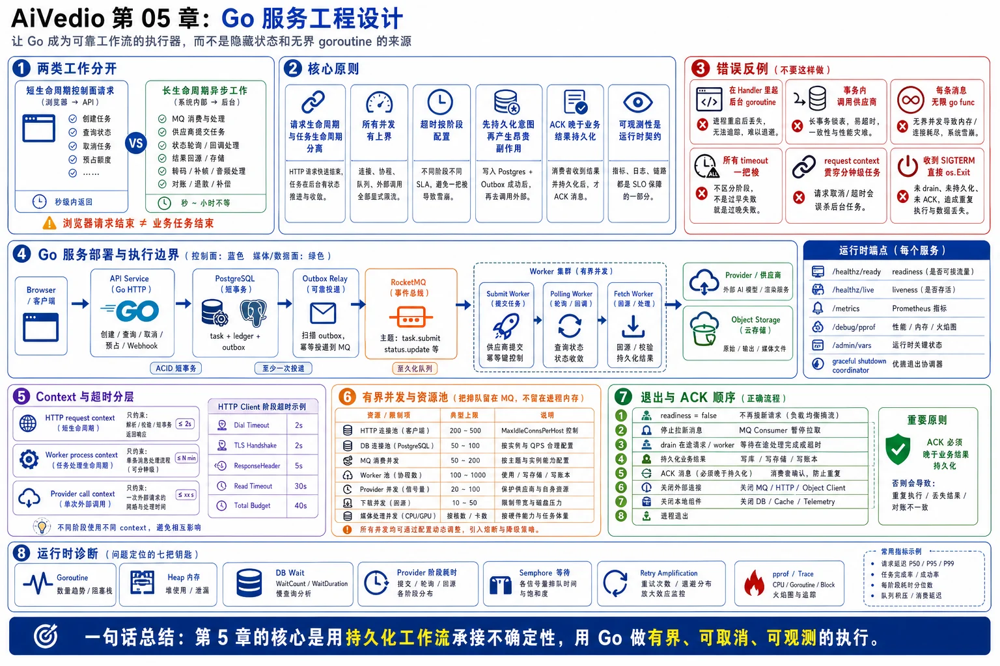

# 第 05 章：Go 服务工程设计



> 图注：本章全文重点总结图，围绕控制面与异步 Worker、Go 服务执行边界、Context 与超时、有界并发、退出 ACK 顺序和运行时诊断展开。

> **本章主题：** Go 在长任务平台中的服务实现原则。
> **核心目标：** 把“能调用第三方接口”的代码，提升为一个并发有界、超时明确、可优雅退出、可观测、可恢复，并且不会因重试而重复生成或重复计费的生产级服务。

---

## 5.0 本章定位

AI 视频生成平台中的 Go 服务主要处理两类工作：

1. **短生命周期控制面请求**：创建任务、查询状态、取消任务、项目保存、计费预占。
2. **长生命周期异步工作**：消费 RocketMQ、调用供应商、轮询任务、回源输出、驱动转码和补偿。

这两类工作的工程约束完全不同。控制面要求低延迟、快速失败和稳定吞吐；异步工作要求可恢复、可重放、结果可对账。最重要的判断是：

> **浏览器请求结束，不代表业务任务结束；Go 进程退出，也不代表第三方任务没有被创建。**

因此，本章不把 goroutine 当成“后台任务系统”，也不把 `context canceled` 当成业务失败，而是把 Go 运行时能力放在 PostgreSQL、RocketMQ、Redis 和对象存储所形成的持久化边界之内使用。

---

## 5.1 本章要解决的业务问题

### 5.1.1 控制面不能被慢请求拖垮

创建生成任务通常只应完成校验、额度预占、任务落库和 Outbox 写入，然后立即返回 `task_id`。如果 HTTP Server 没有读取超时、请求体限制和连接上限，慢客户端或异常代理会长期占用连接、文件描述符和 goroutine。

### 5.1.2 第三方调用既慢又不确定

供应商调用可能发生：

- DNS、TCP、TLS 或响应头超时。
- 429、502、503、504。
- 请求已经到达供应商，但响应在返回途中丢失。
- 本地 `context` 已超时，供应商仍继续创建付费任务。
- 返回成功后，本地尚未落库进程就退出。

因此不能使用“请求报错就自动重试”的统一策略。

### 5.1.3 goroutine 很轻，但外部资源并不轻

每个 goroutine 背后可能占用：

- 一个 PostgreSQL 连接。
- 一个供应商并发槽位。
- 一个 HTTP 连接。
- 一条媒体下载流。
- 数百 KB 缓冲区。
- 大量带宽或临时磁盘。

无限制 `go func()` 会把排队从可观测的 MQ 转移到进程内存，并把下游故障放大成自身 OOM、连接池耗尽或重试风暴。

### 5.1.4 服务必须能够安全退出

滚动发布、扩缩容和节点故障都可能发生在以下时刻：

- 消息刚被拉取但尚未处理。
- 供应商刚受理请求但本地尚未获得响应。
- 数据库事务已提交但 MQ ACK 尚未发送。
- 输出文件正在流式回源。

优雅退出不是简单执行 `server.Close()`，而是一个有顺序的协议：停止接新流量、停止领取新消息、等待关键区完成、对不确定结果留下持久化证据，再释放依赖。

### 5.1.5 故障必须可定位

仅有 API P99 不足以定位 Go 服务问题。还需要知道：

- goroutine 是否持续增长。
- 哪些栈阻塞在 channel、网络、锁或数据库连接池。
- heap 是业务缓存、媒体缓冲还是泄漏。
- provider 调用的连接、TLS、响应头和读取阶段分别耗时多久。
- DB `WaitCount` 和 `WaitDuration` 是否增长。
- 重试流量占原始流量的比例。

---

## 5.2 核心设计原则

| 原则 | 工程含义 | 反例 |
|---|---|---|
| 请求生命周期与任务生命周期分离 | HTTP 请求只负责持久化任务；异步任务由 MQ 和数据库恢复 | 浏览器断开后 goroutine 继续“偷偷跑任务” |
| 所有并发都必须有上界 | HTTP、DB、供应商、MQ、下载、转码分别设限 | 每条消息启动一个无限 goroutine |
| 超时按阶段配置 | 连接、TLS、响应头、整体操作分别控制 | 一个 `Client.Timeout` 覆盖所有类型请求 |
| 先持久化意图，再产生昂贵副作用 | 调用供应商前创建 attempt；成功后持久化结果再 ACK | 先调用供应商，成功后才创建任务记录 |
| 可重试不等于可安全重试 | 单独判断 `retryable` 与 `safe_to_retry` | 所有 5xx 和 timeout 都立即重试 |
| 连接池是容量阀门，不是越大越好 | 结合所有 Pod 和数据库预算统一配置 | 每个实例 `MaxOpenConns=500` |
| 进程内锁只解决进程内竞争 | 全局配额由调度器、Redis 租约或数据库约束管理 | 用 Go semaphore 声称保证全局模型并发 |
| ACK 必须晚于持久化业务结果 | 重投由幂等兜底 | 业务刚开始就 ACK |
| 退出流程必须可重复执行 | 多个组件按依赖顺序 drain，超时后进入恢复流程 | 收到 SIGTERM 立即 `os.Exit(0)` |
| 可观测性是运行时契约 | 指标、trace、pprof 和稳定错误码同时建设 | 出事后临时加日志猜问题 |

一句话概括：

> **Go 负责高效执行，不负责替代持久化工作流；goroutine 是执行单元，不是可靠任务载体。**

---

## 5.3 详细架构与组件职责

建议将控制面和不同类型 Worker 分开部署，即使它们复用同一个 Go module 和基础库。

```text
                         ┌─────────────────────────┐
Browser / Mobile ───────►│ API Service             │
                         │ - HTTP Server            │
                         │ - Auth / Validation      │
                         │ - DB Transaction         │
                         │ - Task + Ledger + Outbox │
                         └───────────┬─────────────┘
                                     │ PostgreSQL
                                     ▼
                              Outbox Relay
                                     │
                                     ▼
                                RocketMQ
                                     │
                   ┌─────────────────┼──────────────────┐
                   ▼                 ▼                  ▼
          Submit Worker       Polling Worker      Fetch Worker
          - dedup             - query status      - stream output
          - semaphore         - backoff           - checksum
          - provider client   - state event       - object storage
          - attempt record    - no busy loop      - size limit
                   │                 │                  │
                   └──────────► Provider ◄─────────────┘

Independent runtime endpoints:
- readiness / liveness
- metrics
- admin-only pprof
- graceful-shutdown coordinator
```

### 5.3.1 API Service

职责：

- 配置严格的 HTTP Server 超时和请求体上限。
- 传递请求级 `context.Context`。
- 在短事务内写入任务、额度流水和 Outbox。
- 事务提交后立即返回，不等待供应商生成。
- 客户端断开时取消尚未完成的同步操作，但不回滚已经提交的业务任务。

不应该：

- 直接上传或中转大视频。
- 在数据库事务内调用供应商。
- 启动脱离持久化状态的“后台 goroutine”。

### 5.3.2 Submit Worker

职责：

- 消费 `generation.submit`。
- 做消息幂等和任务状态校验。
- 申请进程内执行槽位与平台级供应商槽位。
- 创建或读取 `task_attempt`。
- 使用独立的 provider 调用超时。
- 对结果进行错误分类。
- 将任务更新为 `SUBMITTED`、`SUBMIT_UNKNOWN` 或失败状态。
- 持久化完成后再返回消费成功。

注意：Submit Worker 的 goroutine 只应等待“提交供应商”这段网络调用，不应一直等待远端视频生成完成。

### 5.3.3 Polling Worker

职责：

- 根据下一次查询时间消费延迟任务。
- 每次只执行一次查询并更新状态。
- 使用指数退避和抖动，避免所有任务同时轮询。
- 任务终态后停止调度。

不应该使用一个 goroutine 对单个供应商任务循环 `for { sleep; query }` 数分钟。否则进程重启会丢失轮询计划，且大量长期 goroutine 难以治理。

### 5.3.4 Fetch Worker

职责：

- 流式下载第三方临时 URL。
- 限制域名、重定向、大小、速度和总时长。
- 同时计算 checksum。
- 使用对象存储 multipart upload。
- 完整上传、校验和媒体探测通过后再发布 Asset。

Fetch Worker 是典型数据面，应与 API Service 隔离资源池和扩缩容策略。

### 5.3.5 Runtime Coordinator

职责：

- 接收 SIGTERM/SIGINT。
- 将 readiness 置为失败。
- 停止 MQ 拉取和定时任务调度。
- 关闭 HTTP listener，并等待在途请求。
- 等待 Worker 的可安全结束区间。
- 最后关闭 MQ client、HTTP Transport 空闲连接、数据库和 telemetry exporter。

---

## 5.4 文字版时序图

### 5.4.1 正常创建与提交

```text
1. Browser -> API Service：POST /generation-tasks，携带 Idempotency-Key。
2. API Service：限制请求体，解析 JSON，校验权限和参数。
3. API Service -> PostgreSQL：开启短事务。
4. PostgreSQL：插入 generation_task、credit_ledger、outbox_event。
5. PostgreSQL -> API Service：COMMIT 成功。
6. API Service -> Browser：返回 202 + task_id。
7. Outbox Relay -> RocketMQ：投递 generation.submit。
8. Submit Worker：收到消息，检查 inbox_dedup 和任务状态。
9. Submit Worker：申请本地 semaphore 和平台级 provider slot。
10. Submit Worker -> PostgreSQL：创建 attempt，状态 SUBMITTING。
11. Submit Worker -> Provider：携带 provider idempotency key 提交任务。
12. Provider -> Submit Worker：返回 provider_job_id。
13. Submit Worker -> PostgreSQL：attempt=ACCEPTED，task=SUBMITTED，写入下一次 poll 事件。
14. PostgreSQL：事务提交。
15. Submit Worker -> RocketMQ：消费成功；随后释放本地提交槽位。
```

### 5.4.2 供应商已受理但本地超时

```text
1. Submit Worker -> Provider：发送创建请求。
2. Provider：已经创建付费任务。
3. 网络：响应在返回途中超时。
4. Submit Worker：不能确认供应商是否受理。
5. Submit Worker -> PostgreSQL：将 attempt 标记为 SUBMIT_UNKNOWN，记录 request_fingerprint。
6. Submit Worker：不立即再次创建。
7. Reconcile Worker -> Provider：通过 idempotency key、client_request_id 或任务列表查询。
8a. 找到远端任务：绑定 provider_job_id，转为 SUBMITTED。
8b. 确认远端未创建：在重试预算内重新提交。
8c. 无法确认：继续延迟对账或进入人工处理，不伪装为普通瞬时失败。
```

### 5.4.3 进程退出

```text
1. Orchestrator -> Go Process：发送 SIGTERM。
2. Runtime Coordinator：readiness=false。
3. Runtime Coordinator -> MQ Consumer：停止领取新消息。
4. Runtime Coordinator -> HTTP Server：Shutdown，等待在途控制面请求。
5. Runtime Coordinator -> Worker Pool：等待已领取任务到达持久化边界。
6. 若 provider submit 正处于结果未知区间：attempt 保持 SUBMITTING/SUBMIT_UNKNOWN，由后续对账恢复。
7. Runtime Coordinator：关闭 MQ、空闲 HTTP 连接、数据库和 telemetry。
8. 进程退出；未 ACK 消息会重投，消费端通过幂等处理。
```

---

## 5.5 关键数据结构、配置与消息字段

### 5.5.1 服务配置

以下值仅表示配置维度，不是所有系统都应采用同一数值。

```go
type HTTPServerConfig struct {
    Addr              string
    ReadHeaderTimeout time.Duration
    ReadTimeout       time.Duration
    WriteTimeout      time.Duration
    IdleTimeout       time.Duration
    MaxHeaderBytes    int
    MaxJSONBodyBytes  int64
    ShutdownTimeout   time.Duration
}

type HTTPClientConfig struct {
    DialTimeout           time.Duration
    TLSHandshakeTimeout   time.Duration
    ResponseHeaderTimeout time.Duration
    RequestTimeout        time.Duration
    IdleConnTimeout       time.Duration
    MaxIdleConns          int
    MaxIdleConnsPerHost   int
    MaxConnsPerHost       int
}

type DBPoolConfig struct {
    MaxOpenConns    int
    MaxIdleConns    int
    ConnMaxLifetime time.Duration
    ConnMaxIdleTime time.Duration
}

type WorkerConfig struct {
    WorkerCount       int
    QueueCapacity     int
    MaxAttempts       int
    MaxRetryRatio     float64
    ShutdownTimeout   time.Duration
    ProviderCallLimit map[string]int64
}
```

### 5.5.2 标准错误结构

必须区分“暂时性”与“安全重试性”。

```go
type ErrorClass string

const (
    ErrorPermanent     ErrorClass = "PERMANENT"
    ErrorTransient     ErrorClass = "TRANSIENT"
    ErrorThrottled     ErrorClass = "THROTTLED"
    ErrorSubmitUnknown ErrorClass = "SUBMIT_UNKNOWN"
    ErrorCanceled      ErrorClass = "CANCELED"
    ErrorInternal      ErrorClass = "INTERNAL"
)

type AppError struct {
    Code          string
    Class         ErrorClass
    Operation     string
    Retryable     bool
    SafeToRetry   bool
    RetryAfter    time.Duration
    ProviderCode  string
    PublicMessage string
    Cause         error
}

func (e *AppError) Error() string { return e.Operation + ": " + e.Code }
func (e *AppError) Unwrap() error { return e.Cause }
```

语义：

- `Retryable=true`：未来再次执行可能成功。
- `SafeToRetry=true`：再次执行不会造成重复副作用，或已有幂等保护。
- `SUBMIT_UNKNOWN` 常常是 `Retryable=true`、`SafeToRetry=false`，应先对账。

### 5.5.3 Attempt 记录

```text
task_attempts
- id
- task_id
- attempt_no
- operation                 # SUBMIT / QUERY / CANCEL / FETCH
- provider
- client_request_id
- provider_job_id
- request_fingerprint
- status                    # CREATED/SUBMITTING/ACCEPTED/UNKNOWN/FAILED
- error_class
- provider_error_code
- started_at
- deadline_at
- finished_at
- worker_instance_id
- version
```

关键约束：

```text
UNIQUE(task_id, operation, attempt_no)
UNIQUE(provider, client_request_id)
UNIQUE(provider, provider_job_id) WHERE provider_job_id IS NOT NULL
```

### 5.5.4 MQ 消息

```text
event_id
message_type
task_id
attempt_id
trace_id
tenant_id
schema_version
not_before
retry_count
created_at
payload_reference
```

消息只携带定位信息和少量调度字段。完整提示词、供应商密钥、视频二进制和大响应体不进入 MQ。

---

## 5.6 Go 服务实现细节

### 5.6.1 HTTP Server：超时、限制与长连接隔离

控制面 API 可使用显式 `http.Server`：

```go
srv := &http.Server{
    Addr:              cfg.Addr,
    Handler:           handler,
    ReadHeaderTimeout: cfg.ReadHeaderTimeout,
    ReadTimeout:       cfg.ReadTimeout,
    WriteTimeout:      cfg.WriteTimeout,
    IdleTimeout:       cfg.IdleTimeout,
    MaxHeaderBytes:    cfg.MaxHeaderBytes,
}
```

各超时含义：

| 配置 | 保护对象 | 设计注意 |
|---|---|---|
| `ReadHeaderTimeout` | 慢速请求头 | 通常应明确设置，防止连接长期占用 |
| `ReadTimeout` | 读取整个请求，包括 body | 控制面 JSON 可较短；大媒体不应走 API |
| `WriteTimeout` | 写响应 | 不适合直接套在长时间 SSE/流式响应上 |
| `IdleTimeout` | keep-alive 空闲连接 | 防止空闲连接无限占用 |
| `MaxHeaderBytes` | 请求头大小 | 与网关限制保持一致 |

请求体还要在 Handler 层限制：

```go
r.Body = http.MaxBytesReader(w, r.Body, cfg.MaxJSONBodyBytes)
defer r.Body.Close()
```

工程取舍：

1. **API、SSE 和内部管理端口最好使用不同 Server 配置。** SSE 连接的写入模型与普通 JSON API 不同，不能简单继承短 `WriteTimeout`。
2. **网关、负载均衡器和 Go Server 的超时要形成从外到内的预算。** 外层先超时而内层继续执行，会制造无效工作。
3. **不要通过增大所有超时来“解决超时”。** 这会延长资源占用并掩盖下游异常。
4. 对 `/health/live` 与 `/health/ready` 分开设计：liveness 表示进程是否需要重启，readiness 表示是否应继续接流量。

### 5.6.2 HTTP Client：复用 Transport，并拆分超时阶段

每个供应商通常使用一个长期复用的 Client/Transport，而不是每次调用新建：

```go
transport := &http.Transport{
    Proxy: http.ProxyFromEnvironment,
    DialContext: (&net.Dialer{
        Timeout:   cfg.DialTimeout,
        KeepAlive: 30 * time.Second,
    }).DialContext,
    MaxIdleConns:          cfg.MaxIdleConns,
    MaxIdleConnsPerHost:   cfg.MaxIdleConnsPerHost,
    MaxConnsPerHost:       cfg.MaxConnsPerHost,
    IdleConnTimeout:       cfg.IdleConnTimeout,
    TLSHandshakeTimeout:   cfg.TLSHandshakeTimeout,
    ResponseHeaderTimeout: cfg.ResponseHeaderTimeout,
    ExpectContinueTimeout: time.Second,
}

client := &http.Client{
    Transport: transport,
    Timeout:   cfg.RequestTimeout,
}
```

关键点：

- `http.Client` 和 `http.Transport` 应复用；频繁创建会丢失连接池收益并增加 TCP/TLS 握手。
- `Client.Timeout` 覆盖连接、重定向和读取响应体的完整生命周期。对大文件回源，宜使用独立 Client 或请求级 deadline，避免与短 JSON 提交共用一套整体超时。
- 所有请求都应使用 `http.NewRequestWithContext`。
- 响应 `Body` 必须关闭。需要连接复用时，可在有大小上限的前提下读取完小响应；不要为了复用连接而无上限地 drain 一个异常大响应。
- `Content-Length` 只能作为提前拒绝依据，不能替代实际读取上限。
- 重定向必须限制次数并校验目标域名，特别是供应商输出 URL。

小响应处理示例：

```go
resp, err := client.Do(req)
if err != nil {
    return classifyTransportError(err)
}
defer resp.Body.Close()

body, err := io.ReadAll(io.LimitReader(resp.Body, maxResponseBytes+1))
if err != nil {
    return err
}
if int64(len(body)) > maxResponseBytes {
    return ErrResponseTooLarge
}
```

此处只适用于供应商 JSON 响应，不适用于视频文件。

### 5.6.3 Context：传递取消，但不要混淆业务终态

推荐规则：

1. `ctx` 是需要取消能力函数的第一个参数。
2. 不把 `Context` 长期存进 struct。
3. 派生 `WithCancel`、`WithTimeout` 后始终调用 `cancel()`。
4. `Context.Value` 只存 trace、request ID 等请求范围元数据，不存业务可选参数。
5. 所有阻塞操作都应能响应 `ctx.Done()`，包括 channel 发送、信号量申请、数据库和 HTTP 调用。

最关键的生命周期分离：

```text
HTTP request context
  └── 只约束：解析、校验、短事务、返回响应

Worker process context
  └── 约束：一条 MQ 消息的本地处理生命周期
       └── provider call context
            └── 约束：单次第三方网络调用
```

任务创建事务一旦提交，后续异步执行不能继续依赖浏览器的 request context。否则用户刷新页面就可能取消已付费任务。

反过来，也不能在请求结束后直接用 `context.Background()` 启动无记录 goroutine。正确做法是先写 Outbox，再由 Worker 使用自己的生命周期 context 执行。

### 5.6.4 `database/sql`：连接池是共享预算

一个进程通常只创建一个长期复用的 `*sql.DB`：

```go
db.SetMaxOpenConns(cfg.MaxOpenConns)
db.SetMaxIdleConns(cfg.MaxIdleConns)
db.SetConnMaxLifetime(cfg.ConnMaxLifetime)
db.SetConnMaxIdleTime(cfg.ConnMaxIdleTime)
```

`MaxOpenConns` 达到上限后，新查询会等待可用连接，因此它本质上也是一个 semaphore。配置时应满足：

```text
所有应用实例 MaxOpenConns 总和
+ 迁移任务连接
+ 运维和管理连接
+ 复制、监控等保留连接
≤ PostgreSQL 可接受连接预算
```

需要持续监控 `db.Stats()`：

```text
OpenConnections
InUse
Idle
WaitCount
WaitDuration
MaxIdleClosed
MaxLifetimeClosed
```

判断方式：

- `InUse` 长期贴近上限且 `WaitDuration` 上升：池可能太小，也可能 SQL 太慢或事务过长。
- 池很大但数据库 CPU、锁等待和上下文切换恶化：不是继续扩池，而是降并发、优化 SQL 或引入连接代理。
- `MaxLifetimeClosed` 突然集中增长：实例连接可能同时过期，建议生命周期加入适度随机化，避免重连尖峰。

### 5.6.5 短事务与 Outbox：禁止在事务中调用外部服务

正确事务边界：

```go
func (s *Service) CreateTask(ctx context.Context, cmd CreateTaskCommand) error {
    tx, err := s.db.BeginTx(ctx, &sql.TxOptions{Isolation: sql.LevelReadCommitted})
    if err != nil {
        return err
    }
    defer tx.Rollback()

    if err := insertTask(ctx, tx, cmd); err != nil {
        return err
    }
    if err := reserveCredit(ctx, tx, cmd); err != nil {
        return err
    }
    if err := insertOutbox(ctx, tx, cmd); err != nil {
        return err
    }

    return tx.Commit()
}
```

错误做法：

```text
BEGIN
INSERT task
调用供应商，等待 3 秒～30 秒
UPDATE task
COMMIT
```

后果：

- 数据库连接和行锁被外部延迟占用。
- 供应商超时后事务回滚，但远端可能已经创建任务。
- 高峰期事务堆积，连接池耗尽。
- 数据库故障与供应商副作用难以组成原子事务。

正确方案是：事务内只记录本地事实和待执行事件；事务外由幂等 Worker 执行第三方副作用。

### 5.6.6 Bounded Worker Pool：把排队留在 MQ，不留在内存

固定 Worker 数量示意：

```go
type Job func(context.Context) error

type Pool struct {
    jobs    chan Job
    handlerCtx context.Context
    wg      sync.WaitGroup
}

func NewPool(ctx context.Context, workers, capacity int) *Pool {
    p := &Pool{
        jobs:       make(chan Job, capacity),
        handlerCtx: ctx,
    }
    for i := 0; i < workers; i++ {
        p.wg.Add(1)
        go func() {
            defer p.wg.Done()
            for {
                select {
                case <-ctx.Done():
                    return
                case job, ok := <-p.jobs:
                    if !ok {
                        return
                    }
                    _ = job(ctx)
                }
            }
        }()
    }
    return p
}
```

生产代码还需要明确：

- 谁负责关闭 job channel。
- 关闭后是否允许继续 Submit。
- panic 如何恢复并上报。
- 任务失败如何返回 MQ 重试，而不是只写日志。
- shutdown 时是取消当前 job，还是等待关键区结束。

**Drain 与 force cancel 必须分开。** 收到 SIGTERM 后，先停止生产新 job，并让已进入执行窗口的 job 完成持久化；只有 drain deadline 到期后才取消执行 context。若一收到信号就取消所有 Worker 共用的 context，上面的 `select` 会立即退出，缓冲队列中的工作将不会被正常 drain。

通常 MQ 客户端自身已有消费并发配置，不需要再叠加一个巨大内存队列。更推荐让 MQ 消费并发与本地 semaphore 共同形成小而有界的执行窗口。

### 5.6.7 Semaphore：限制本地昂贵操作

供应商维度可以使用 weighted semaphore：

```go
type ProviderLimiter struct {
    sem *semaphore.Weighted
}

func (l *ProviderLimiter) Do(ctx context.Context, weight int64, fn func(context.Context) error) error {
    if err := l.sem.Acquire(ctx, weight); err != nil {
        return err
    }
    defer l.sem.Release(weight)
    return fn(ctx)
}
```

注意四个边界：

1. Go semaphore 只限制当前进程，不保证多 Pod 的全局并发。
2. 全局 provider/model 槽位应由调度器、Redis 租约或数据库状态统一管理。
3. 不要先创建成千上万个 goroutine，再让它们阻塞等待 semaphore；应在消费入口就施加背压。
4. 提交槽位只覆盖 HTTP Submit 调用，不应持有到视频在供应商侧生成完成。远端在途并发应由持久化配额记录管理。

### 5.6.8 MQ 消费者生命周期

一条消息的推荐处理边界：

```text
收到消息
→ 校验 schema_version
→ inbox_dedup / 业务唯一约束
→ 加载 task 和 version
→ 检查状态是否仍允许执行
→ 申请本地资源
→ 写 attempt 意图
→ 执行一次外部动作
→ 事务内持久化结果和后续事件
→ 事务提交
→ 返回消费成功
```

ACK 原则：

- **持久化成功后 ACK。**
- 业务已成功但 ACK 丢失时，RocketMQ 会重投，消费者必须通过 `event_id`、状态机和唯一约束返回幂等成功。
- 对永久错误，先把任务可靠写成最终失败并完成额度释放，再 ACK；不能通过无限 MQ 重试处理参数错误。
- 对瞬时错误，返回重试或发布带 `not_before` 的延迟事件。
- 对 `SUBMIT_UNKNOWN`，先持久化不确定状态和对账事件，再 ACK 当前消息，避免立即重复提交。

优雅退出时：

1. 停止拉取新消息。
2. 等待正在执行的 handler 到达持久化边界。
3. 未完成且无安全结果的消息不 ACK，让其重投。
4. 消费者关闭后再关闭数据库和 HTTP Client。

### 5.6.9 Goroutine 泄漏

常见泄漏来源：

- 向无人接收的 channel 永久发送。
- 下游提前退出，上游 pipeline 不响应取消。
- `time.NewTicker` 未停止。
- `context.WithTimeout` 未调用 cancel。
- HTTP response body 未关闭。
- 无限重试循环没有最大次数和退出信号。
- goroutine 等待永远不会关闭的 channel。
- MQ handler 再派生后台 goroutine，handler 已 ACK 但 goroutine 仍运行。

所有 channel 阻塞都应考虑取消：

```go
select {
case out <- item:
    return nil
case <-ctx.Done():
    return ctx.Err()
}
```

检测方法：

- 监控 `runtime.NumGoroutine()` 趋势，而非单点值。
- 对比稳定流量下 goroutine 基线。
- 使用 goroutine profile 查看重复栈。
- 使用 block profile 定位 channel/锁阻塞。
- 在压测结束后验证 goroutine、连接和文件描述符是否回落。

### 5.6.10 大文件流式 IO

媒体文件不应 `io.ReadAll`。流式回源可以一边写对象存储，一边计算哈希：

```go
limited := io.LimitReader(resp.Body, maxBytes+1)
h := sha256.New()
reader := io.TeeReader(limited, h)

n, err := objectStore.MultipartUpload(ctx, stagingKey, reader)
if err != nil {
    return err
}
if n > maxBytes {
    _ = objectStore.AbortOrDelete(ctx, stagingKey)
    return ErrObjectTooLarge
}
checksum := hex.EncodeToString(h.Sum(nil))
```

生产设计应包含：

- `Content-Length > max` 时提前拒绝，但仍验证实际读取量。
- 下载和上传都响应 context 取消。
- 使用 staging key；只有完整上传、checksum、ffprobe 和审核通过后才创建可见 Asset。
- multipart 未完成时执行 abort 或生命周期清理。
- 限制每实例并发流数量与总带宽。
- 缓冲区大小通过压测确定；过大导致内存随并发线性增长，过小则增加系统调用。
- 记录首字节时间、吞吐、停滞时间和总字节数。

### 5.6.11 Graceful Shutdown

示意框架：

```go
signalCtx, stopSignal := signal.NotifyContext(
    context.Background(),
    syscall.SIGINT,
    syscall.SIGTERM,
)
defer stopSignal()

// runCtx 用于真正执行组件；不要让 SIGTERM 自动立刻取消全部在途工作。
runCtx, forceCancel := context.WithCancel(context.Background())
defer forceCancel()

// start HTTP server, consumers, pollers and workers with runCtx...

<-signalCtx.Done()
readiness.Set(false)
consumer.StopFetching()
scheduler.StopCreatingNewWork()

shutdownCtx, cancel := context.WithTimeout(context.Background(), cfg.ShutdownTimeout)
defer cancel()

_ = srv.Shutdown(shutdownCtx)
_ = consumer.Drain(shutdownCtx)
_ = workers.Drain(shutdownCtx)

// 正常 drain 完成，或 deadline 到期后，再取消残余阻塞操作。
forceCancel()
providerTransport.CloseIdleConnections()
_ = mqClient.Close()
_ = db.Close()
```

推荐退出顺序：

1. readiness 置为 false，停止新流量进入。
2. 停止 MQ 拉取、定时扫描和新任务调度。
3. 停止 HTTP listener，等待在途控制面请求。
4. 等待已领取异步任务到达安全持久化点。
5. 关闭 SSE/WebSocket 等 `Shutdown` 不一定完全管理的长连接。
6. flush telemetry。
7. 关闭 MQ、HTTP 空闲连接、数据库等依赖。

竞态处理：

- 若退出发生在 provider 已受理但本地响应未知，应留下 `SUBMITTING/SUBMIT_UNKNOWN` attempt，不能强行写成失败。
- 若事务已提交但 ACK 未完成，消息重投后按幂等成功处理。
- 若对象存储 multipart 中断，依赖 abort 和 staging 生命周期清理。
- orchestrator 的 termination grace 应大于应用 drain deadline，并为强制退出留出余量。

### 5.6.12 错误分类与重试预算

推荐错误矩阵：

| 场景 | Retryable | SafeToRetry | 动作 |
|---|---:|---:|---|
| 参数不合法 | 否 | — | 最终失败 |
| 内容审核失败 | 否 | — | 最终失败，不自动改写后重试 |
| 429，供应商未受理 | 是 | 是 | 遵循 Retry-After，指数退避 |
| 连接建立失败且确认未发送请求 | 是 | 通常是 | 有预算重试 |
| 请求写出后超时 | 可能 | 否 | `SUBMIT_UNKNOWN`，先对账 |
| 查询接口 503 | 是 | 是 | 延迟查询 |
| DB 序列化冲突 | 是 | 是 | 短退避后重试本地事务 |
| 用户取消 context | 视阶段 | 视阶段 | 同步操作停止；已提交任务不自动取消 |
| 进程 shutdown | 视阶段 | 视阶段 | 未 ACK 重投；外部结果未知则对账 |

上层判断错误时应使用 `errors.Is`、`errors.As` 或稳定错误码，不应通过错误字符串匹配。错误通常在系统边界统一记录一次，内部层负责补充 operation 和 cause，避免每层都重复打印同一故障。

重试设计：

```text
单请求最大尝试次数
+ 每进程/每供应商单位时间重试预算
+ 指数退避
+ full jitter
+ Retry-After
+ 熔断和半开探测
+ 只允许一个调用层负责重试
```

退避上限可抽象为：

```text
maxDelay = min(cap, base × 2^attempt)
delay = random(0, maxDelay)
```

多层重试会乘法放大。若三个调用层各自最多执行三次，则最下游一次用户请求理论上可能承受 `3 × 3 × 3 = 27` 次调用。因此应选择最了解错误语义的一层重试，并让上层得到清晰的“可重试/不可重试/结果未知”错误。

### 5.6.13 pprof 与运行时诊断

建议独立启动仅内部可访问的管理端口：

```text
127.0.0.1:6060 或独立 admin network
- /debug/pprof/profile
- /debug/pprof/heap
- /debug/pprof/goroutine
- /debug/pprof/block
- /debug/pprof/mutex
```

安全要求：

- 不暴露在公网。
- 使用网络策略、mTLS 或强认证。
- 不与用户 API 共用公开路由。
- profile 可能包含 URL、栈参数、对象内容或业务标识，应按敏感诊断数据管理。

排障顺序示例：

| 症状 | 首先查看 |
|---|---|
| CPU 高 | CPU profile、热点函数、序列化和压缩 |
| 内存持续升高 | heap in-use、alloc profile、媒体缓冲、缓存 |
| goroutine 持续升高 | goroutine profile、重复阻塞栈 |
| 延迟高但 CPU 不高 | block/mutex、DB pool wait、网络阶段耗时 |
| GC 压力大 | alloc rate、对象生命周期、临时 byte slice |
| 任务吞吐下降 | semaphore 等待、MQ backlog、provider latency |

不要在没有证据时先做对象池、手写内存复用或复杂 lock-free 优化。先通过 benchmark、trace 和 pprof 确认瓶颈。

---

## 5.7 正常流程

### 5.7.1 API 创建任务

1. 网关完成认证和租户级限流。
2. Go Handler 使用 `MaxBytesReader` 限制 JSON。
3. request context 贯穿权限校验和数据库事务。
4. 事务中写任务、额度预占和 Outbox。
5. 提交成功后返回 `202 Accepted`。
6. 即使客户端未收到响应，重试时也通过 `Idempotency-Key` 返回同一任务。

### 5.7.2 Worker 提交供应商

1. 消费消息并进行 dedup。
2. 检查任务是否仍为可提交状态。
3. 获取本地执行 semaphore；全局槽位由调度层控制。
4. 持久化 attempt 意图。
5. 创建 provider call context，执行一次提交。
6. 正常返回后保存 `provider_job_id`。
7. 事务中写状态、下一次轮询事件和审计记录。
8. 提交事务后 ACK。
9. 释放本地 semaphore。

### 5.7.3 轮询与回源

1. Polling Worker 每条消息只查询一次。
2. 未终态则计算下一次 `not_before`。
3. 成功后投递 `asset.fetch`。
4. Fetch Worker 流式回源到 staging object。
5. checksum、ffprobe 和审核通过后原子发布资产元数据。
6. 任务转为 `SUCCEEDED`，通知层发增量事件。

---

## 5.8 异常流程与竞态条件

### 5.8.1 客户端断开与事务提交竞态

可能发生：

```text
事务 COMMIT 成功
→ COMMIT 响应或 HTTP 响应在返回途中丢失
→ Handler/客户端看到超时或连接错误
→ 用户认为创建失败并重试
```

这也是一种“结果未知”：客户端不能仅凭连接错误判断事务一定回滚。处理方式是使用 `(tenant_id, idempotency_key)` 唯一约束；第二次请求先查询并返回原任务，不能再扣一次额度。若第一次确实未提交，第二次才执行创建。

### 5.8.2 Shutdown 与供应商提交竞态

```text
Worker 写 attempt=SUBMITTING
→ 向供应商发送请求
→ 收到 SIGTERM
→ 本地 context 取消
→ 供应商可能已经受理
```

处理：该 attempt 进入 `SUBMIT_UNKNOWN` 或保持可对账状态；未获得明确未受理证据前不重新创建。

### 5.8.3 DB 提交成功与 MQ ACK 竞态

```text
业务事务成功
→ 进程在 ACK 前崩溃
→ RocketMQ 重投
```

处理：`inbox_dedup`、任务状态和唯一业务键让第二次消费直接返回成功，不重复调用供应商。

### 5.8.4 Semaphore 泄漏

异常路径或 panic 未 Release，会导致吞吐逐渐归零。必须在成功 Acquire 后立刻 `defer Release`，并在 worker 边界恢复 panic、记录指标，让消息重试。

### 5.8.5 关闭 channel 与并发 Submit 竞态

生产者仍可能发送时关闭 channel 会 panic。应由单一生命周期拥有者关闭；退出时先停止生产者，再关闭队列，最后等待消费者。

### 5.8.6 连接池耗尽与重试风暴

DB 变慢后：

```text
查询变慢
→ 连接池等待增加
→ Handler 超时
→ 客户端和服务内同时重试
→ DB 流量进一步增加
```

处理：短 deadline、负载丢弃、重试预算、只在一个层级重试，并监控 `WaitDuration`。不能只增大连接池。

### 5.8.7 Response Body 未关闭

高峰期会表现为连接不能复用、端口和文件描述符增长、TLS 握手增加。必须对所有成功获得的 response 使用 `defer resp.Body.Close()`，并限制读取大小。

### 5.8.8 错误使用 request context 执行异步任务

用户关闭页面后 request context 取消，若后台生成继承该 context，会将已持久化任务错误终止。异步 Worker 必须由 MQ 触发并使用 Worker context。

### 5.8.9 回调与轮询并发更新

Callback 和 Polling Worker 可能同时看到不同状态。Go 层不能依赖 mutex 解决跨实例竞态，而应使用数据库版本号、状态转换表和终态粘性。

---

## 5.9 幂等、一致性、重试与补偿设计

### 5.9.1 四层幂等

1. **API 幂等**：`UNIQUE(tenant_id, idempotency_key)`。
2. **消息幂等**：`UNIQUE(consumer_name, event_id)`。
3. **外部提交幂等**：provider idempotency key 或 `client_request_id`。
4. **状态与计费幂等**：任务 version CAS、账本 `business_key` 唯一。

任何单层都不能替代其他层。例如 provider 支持幂等键，也不能省略 MQ 消费去重，因为重复消息还可能重复写本地状态、通知和计费。

### 5.9.2 一致性边界

```text
本地强一致事务：
- task
- credit reserve
- outbox

跨系统最终一致：
- RocketMQ 投递
- provider job
- output asset
- billing settlement
```

跨系统不追求分布式强事务，而通过 attempt、Outbox、Inbox、状态机和对账完成可恢复的一致性。

### 5.9.3 `SUBMIT_UNKNOWN` 恢复算法

```text
读取 attempt.client_request_id
→ 若供应商支持幂等查询，按该 ID 查询
→ 若找到远端任务，绑定 provider_job_id
→ 若明确不存在，且仍在重试预算内，重新提交
→ 若供应商不支持查询，检查任务列表、时间窗口和输入指纹
→ 仍无法确认则延迟对账或人工处理
→ 账单日对账发现重复任务时执行补偿流水
```

### 5.9.4 补偿不是回滚

供应商任务一旦创建，数据库回滚无法撤销远端成本。补偿动作可能包括：

- 调用 provider cancel。
- 释放或退款用户预占额度。
- 对重复供应商任务记录平台成本损失。
- 将意外成功输出归档或删除。
- 生成不可变补偿账本，而不是修改历史流水。

---

## 5.10 性能瓶颈与容量估算方法

Go 服务容量不能只按 CPU 核数估算，需要分别计算连接、goroutine、DB、外部并发、流式 IO 和重试放大。

### 5.10.1 HTTP 在途请求

根据 Little’s Law：

```text
平均在途请求数 = 请求速率 × 平均响应时间
```

若控制面为 `300 RPS`，平均响应时间 `80 ms`：

```text
300 × 0.08 = 24 个平均在途请求
```

还要按突发、P95/P99、GC 和依赖抖动留出余量，但不能把余量变成无界接收。

### 5.10.2 数据库连接池

粗略估算：

```text
平均活跃 DB 操作数 ≈ DB 操作速率 × 平均占用连接时间
```

示例：六个 API Pod 合计每秒执行 `1200` 次 SQL，平均每次占用连接 `12 ms`：

```text
1200 × 0.012 = 14.4 个平均活跃连接
```

实际池上限还要覆盖事务内多次操作、突发和后台任务，但总和必须受 PostgreSQL 连接预算约束。应先从较保守值开始，通过 `WaitCount/WaitDuration`、数据库 CPU 和锁等待共同调优。

### 5.10.3 Provider Submit 并发

```text
提交调用并发 ≈ 提交速率 × 提交 API 平均耗时
```

若每秒提交 `12` 个任务，供应商提交接口平均 `1.2 s`：

```text
12 × 1.2 = 14.4 个并发提交调用
```

应将平台级上限设在供应商配额之内，再分配到各 Worker Pod。进程内 semaphore 总和不能无意超过全局配额。

### 5.10.4 远端在途任务

远端生成并发与提交 HTTP 并发不同：

```text
远端在途任务 ≈ 任务到达速率 × 平均生成时长
```

如果 `2 task/s × 120 s = 240` 个远端在途任务，Submit Worker 不应持有 240 个 goroutine 等待，而应持久化 240 个状态记录，通过 callback/polling 驱动。

### 5.10.5 输出回源

若每秒完成 `1` 个视频，平均下载 `100 s`：

```text
平均并发下载流 = 1 × 100 = 100
```

若每流平均 `4 MB/s`，理论入口带宽约：

```text
100 × 4 MB/s = 400 MB/s
```

这往往比 Go CPU 更早成为瓶颈。因此 Fetch Worker 应按带宽、对象存储连接和临时资源独立扩容，并设置全局与单实例限速。

### 5.10.6 内存

仅计算复制缓冲区：

```text
内存缓冲 ≈ 并发流 × 每流 buffer
```

`100` 个流、每流 `256 KiB`，只计算显式 buffer 就约 `25 MiB`；还未包含 TLS、HTTP、SDK、goroutine 栈、multipart 和媒体探测开销。容量测试必须观察真实 RSS 与 heap，而不是只算业务 byte slice。

### 5.10.7 重试放大

定义：

```text
retry_ratio = retry_requests / original_requests
实际调用率 = 原始调用率 × (1 + retry_ratio)
```

若将重试流量预算限制为原始流量的 10%，总调用率约为 `1.1×`；若各层独立无限重试，故障时可能远高于该值。

### 5.10.8 应重点压测的场景

- 正常流量下的稳定态。
- provider P99 延迟突然上升。
- 429 比例持续增加。
- PostgreSQL 变慢和连接池排队。
- MQ 重复投递与积压恢复。
- 滚动发布时同时存在大量在途 submit。
- Fetch Worker 下载慢、无 Content-Length 或中途断流。
- 压测停止后 goroutine、连接和内存是否回落。

---

## 5.11 高可用与降级方式

| 故障 | Go 服务行为 |
|---|---|
| 单个 API Pod 退出 | 无状态流量切走；幂等键处理客户端重试 |
| Submit Worker 退出 | 未 ACK 消息重投；attempt 用于恢复 |
| Provider 变慢 | 降低本地并发、熔断、延迟消息、停止盲目重试 |
| PostgreSQL 变慢 | 控制面快速失败或只读降级；不创建无法记账的付费任务 |
| RocketMQ 不可用 | Outbox 堆积；超过阈值后停止接新付费任务 |
| Redis 不可用 | 使用保守本地限制；不破坏任务事实和计费 |
| Fetch Worker 带宽饱和 | 暂停拉取、延迟回源、优先处理临时 URL 即将过期任务 |
| pprof/admin 端口异常 | 不影响业务端口；独立隔离 |
| Telemetry exporter 失败 | 业务继续，但本地缓冲有界，不能因日志阻塞主流程 |

降级原则：

1. **宁可排队，不无界并发。**
2. **宁可明确失败，不产生无法记录的供应商成本。**
3. **关闭非关键功能时保持核心任务状态可查询。**
4. **熔断只防止继续伤害，不替代对账和恢复。**
5. **readiness 不应用于掩盖永久业务错误；只表示实例当前是否适合接流量。**

---

## 5.12 安全风险

### 5.12.1 HTTP 输入面

- 请求头和 body 大小限制。
- JSON 深度和字段数量控制。
- 上传媒体使用预签名对象存储，不进入 API Service。
- 网关和 Go 层均做认证、租户隔离和速率限制。
- 错误响应不回显内部堆栈和供应商密钥。

### 5.12.2 出站 HTTP

- provider 域名和协议 allowlist。
- 限制重定向并重新校验每一跳。
- 防 SSRF、DNS rebinding 和私网 IP。
- TLS 验证不可随意关闭。
- API Key 来自密钥管理系统，不写入日志。
- 日志中对 prompt、URL query、Authorization 和响应体脱敏。

### 5.12.3 pprof

pprof 可能暴露内存、goroutine 栈、路径和业务标识，必须放在内部管理面，不能直接注册到公网默认路由。

### 5.12.4 资源耗尽

- 限制 goroutine、连接、channel、流和 buffer。
- 对压缩响应设置解压后大小限制，防止压缩炸弹。
- 对输出文件设置最大字节数和最低合理吞吐，避免无限慢流。
- 对 Worker 临时目录设置配额与清理策略。

### 5.12.5 供应链与运行权限

- 锁定依赖版本并执行漏洞扫描。
- 容器使用非 root 用户。
- API Service 不应拥有 FFmpeg Worker 的系统权限。
- 供应商密钥按服务和环境最小授权。

---

## 5.13 常见错误设计及其后果

| 错误设计 | 后果 | 正确方式 |
|---|---|---|
| 每个请求新建 `http.Client` | 连接无法有效复用，握手和端口开销上升 | 长期复用 Client/Transport |
| 不设置 Server 超时 | 慢连接长期占用资源 | 分阶段超时和 body 限制 |
| 所有接口共用一个超时 | 短 JSON 与大文件相互不适配 | 按业务类型拆分 Client/Server |
| `io.ReadAll` 下载视频 | 内存随文件大小增长，易 OOM | 流式 IO + 实际大小限制 |
| 每条 MQ 消息无限 `go func()` | 内存排队、下游被压垮 | 消费并发 + bounded pool + semaphore |
| 用本地 semaphore 控制全局供应商配额 | 多 Pod 后总并发失控 | 分布式配额加本地保护 |
| 在事务中调用供应商 | 长事务、锁等待、未知副作用 | Outbox + Worker |
| timeout 后立即重试 Submit | 重复付费生成 | `SUBMIT_UNKNOWN` + 对账 |
| Handler ACK 后再后台执行 | 进程退出后任务永久丢失 | 业务结果持久化后 ACK |
| request context 贯穿分钟级任务 | 用户断开导致任务误取消 | HTTP 与 Worker 生命周期分离 |
| 不关闭 response body | 连接泄漏、握手增加 | 所有路径关闭，有限 drain |
| shutdown 先关闭 DB | 在途 Worker 无法提交结果 | 先停止接活和 drain，最后关依赖 |
| pprof 暴露公网 | 敏感数据与运行细节泄漏 | 独立内部管理面 |
| 每层都自动重试三次 | 下游调用乘法放大 | 单层重试 + 全局预算 |
| 用增加 DB pool 解决所有等待 | 数据库过载更严重 | 分析 SQL、事务和总连接预算 |

---

## 5.14 面试官可能追问的 10 个问题与资深回答

### 问题 1：Go 的 goroutine 很轻，为什么不能每个任务启动一个 goroutine？

**资深回答：**

轻量只代表创建和调度成本较低，不代表其占用的外部资源轻。一个任务通常还会占数据库连接、HTTP 连接、供应商额度、带宽和缓冲区。若 MQ 积压十万条消息后全部变成 goroutine，系统会把可靠、可观测的 Broker 排队变成不可控的内存排队。我的做法是让 MQ 保留大部分等待任务，只在进程内维持很小的有界执行窗口；本地用消费并发、worker pool 和 provider semaphore 控制，平台级配额由调度器或分布式租约控制。

### 问题 2：HTTP Server 的几个 timeout 怎么设置？

**资深回答：**

我不会给所有服务复制同一组数字，而是先区分控制面 JSON、SSE 和媒体数据面。控制面设置较严格的 `ReadHeaderTimeout`、`ReadTimeout`、`WriteTimeout`、`IdleTimeout` 和请求体上限。SSE 使用独立 Server，因为长连接不适合普通短响应的 WriteTimeout。外层网关、LB 和内层服务形成明确的 deadline 预算，并通过 P95/P99 与故障演练校准，而不是遇到超时就无限放大数值。

### 问题 3：为什么要复用 `http.Client` 和 `Transport`？

**资深回答：**

连接池在 Transport 中。复用可以利用 keep-alive、减少 TCP/TLS 握手和临时端口消耗，并通过 `MaxConnsPerHost`、`MaxIdleConnsPerHost` 等参数形成容量边界。不同供应商或不同流量类型可以使用不同 Client，例如短 JSON Submit 与长视频 Fetch 不共用整体超时和连接上限。所有 response body 都要关闭，否则连接可能无法复用。

### 问题 4：Context 应该贯穿整个生成任务吗？

**资深回答：**

不能贯穿浏览器请求到分钟级任务。HTTP request context 只约束同步校验和短事务；事务提交后，任务已经成为数据库事实，应由 MQ Worker 使用进程生命周期 context 执行。Worker 内再为单次 provider call 派生 deadline。否则用户关闭页面会取消已创建任务。反过来，我也不会在 Handler 里用 Background 启动无持久化 goroutine，而是写 Outbox。

### 问题 5：`database/sql` 连接池如何定大小？

**资深回答：**

先做全局连接预算，而不是单 Pod 拍脑袋。所有 Pod 的 `MaxOpenConns`、迁移、运维和监控连接之和必须低于 PostgreSQL 的安全容量。再用 Little’s Law 估算平均活跃连接，结合突发和事务长度留余量。线上同时观察 `DB.Stats()` 的 `InUse`、`WaitCount`、`WaitDuration`，以及数据库 CPU、锁和慢 SQL。如果池等待高，不一定是池太小，也可能是事务过长或数据库已经过载。

### 问题 6：调用供应商超时后如何处理？

**资深回答：**

先判断超时发生在哪个语义阶段。连接建立前明确失败，通常可在预算内重试；请求已经写出后超时，供应商可能已经受理，这时不能盲重试。我会提前创建 attempt 和 client request ID，供应商支持幂等键时必须传递；本地进入 `SUBMIT_UNKNOWN`，通过幂等查询、任务列表或账单对账确认。如果确认未创建才重试，找到远端任务就绑定 provider_job_id。

### 问题 7：优雅退出的正确顺序是什么？

**资深回答：**

先 readiness=false，停止新流量和新消息；再停止调度器、关闭 HTTP listener，等待在途请求和 Worker 到达持久化边界；SSE/WebSocket 单独通知关闭；最后关闭 MQ、HTTP Transport 和数据库。若 submit 正处于结果未知区间，要保留 attempt 供后续对账，而不是强写失败。未 ACK 消息允许重投，消费端幂等兜底。

### 问题 8：MQ 消费成功应在什么时候返回？

**资深回答：**

在业务效果已经持久化之后。对 Submit Worker，就是 attempt 和任务状态已经可靠提交，并且后续 poll 或补偿事件也已写入事务或 Outbox。若在 ACK 前崩溃，消息会重投，消费端通过 event_id、状态机和唯一约束返回幂等成功。不能一收到消息就 ACK，再异步起 goroutine，因为进程退出会永久丢任务。

### 问题 9：如何定位 goroutine 泄漏？

**资深回答：**

先看 goroutine 数量在稳定流量和压测结束后是否回落，再抓 goroutine profile，按重复栈聚合，重点看 channel send/receive、锁、网络读取和 context 未取消。结合 block/mutex profile、DB pool wait、文件描述符和 HTTP 连接指标判断根因。修复通常是给阻塞点加入 context 分支、停止 ticker、关闭 body、让 pipeline 下游退出能广播到上游，而不是直接提高机器规格。

### 问题 10：为什么外部调用不能放在数据库事务里？

**资深回答：**

数据库事务无法和第三方 HTTP 副作用构成原子提交。外部调用会延长持锁和占连接时间；超时时本地可能回滚，但远端已经创建了付费任务，反而制造更难处理的不一致。我把任务、账本预占和 Outbox 放在一个短本地事务，随后由幂等 Worker 调供应商。跨系统一致性通过 attempt、状态机、对账和补偿实现。

---

## 5.15 三分钟口述稿

我们这个平台里，Go 服务设计的重点不是“goroutine 越多吞吐越高”，而是把所有外部资源做成有界、可取消、可恢复的执行单元。

首先我会把 HTTP 请求生命周期和 AI 任务生命周期分开。浏览器创建任务时，Go API 只做参数校验、额度预占、任务和 Outbox 落库，事务提交后立即返回 task ID。后续生成由 RocketMQ Worker 执行，不能继承浏览器的 request context，也不能在 Handler 里启动一个没有持久化记录的后台 goroutine。

HTTP Server 会显式配置请求头、读取、写入和空闲超时，并限制 JSON body；SSE 使用独立配置。出站调用复用长期的 http.Client 和 Transport，分别限制连接、TLS、响应头和整体操作时间。短 JSON 提交和大文件回源使用不同 Client。所有 response body 都关闭，大文件通过流式 IO 写对象存储，不使用 io.ReadAll。

并发方面，我会使用 RocketMQ 消费并发、有界 worker pool 和每供应商 semaphore，但本地 semaphore 只保护单 Pod，全局模型额度仍由调度器或分布式租约控制。提交 HTTP 调用完成后就释放本地槽位，不让 goroutine 等待供应商数分钟生成；远端在途任务持久化在数据库，再由回调或轮询推进。

数据库连接池按全局预算配置，所有 Pod 的 MaxOpenConns 总和不能压垮 PostgreSQL，并持续监控 WaitCount 和 WaitDuration。第三方调用绝不放在数据库事务里，而是通过短事务加 Outbox 解耦。

最关键的异常是供应商已受理但本地超时。此时 timeout 不等于失败，我会提前创建 attempt 和幂等请求 ID，把状态标为 SUBMIT_UNKNOWN，先通过供应商查询或账单对账确认，不能立即重试造成重复付费。

退出时先 readiness=false、停止拉新消息，再 drain HTTP 和 Worker，最后关闭 MQ、HTTP 连接池和数据库。ACK 必须发生在业务结果持久化之后，ACK 丢失导致的重投由幂等处理。运行中通过 metrics、trace 和受保护的 pprof 观察 goroutine、heap、DB pool、semaphore 等待和重试比例。这样 Go 才是可靠工作流的执行器，而不是隐藏状态的来源。

---

## 5.16 十分钟深入讲解提纲

### 0:00—1:00：先定义问题

- 平台同时存在毫秒级控制面和分钟级异步任务。
- goroutine 不是可靠任务队列。
- 三个核心风险：无界并发、外部调用结果未知、退出时丢失状态。

### 1:00—2:10：服务拆分

- API Service、Submit Worker、Polling Worker、Fetch Worker 分开部署。
- 控制面传元数据，数据面传媒体。
- 共享 Go 基础库，但使用独立资源池、超时和扩缩容。

### 2:10—3:20：HTTP Server 与 Client

- Server 四类 timeout、header/body 限制。
- SSE 独立 Server。
- 复用 Client/Transport。
- 短 JSON 与长下载拆分配置。
- response body 关闭、重定向与 SSRF 防护。

### 3:20—4:20：Context 生命周期

- request context 只到任务持久化完成。
- Worker context 管消息处理。
- provider call context 管单次外部请求。
- 解释为什么用户断开不能取消已持久化任务。

### 4:20—5:20：DB 和事务

- `sql.DB` 是连接池和 semaphore。
- 全集群连接预算与 `DB.Stats()`。
- 短事务：task + ledger + outbox。
- 外部调用放事务内的锁、连接与未知副作用问题。

### 5:20—6:20：有界并发

- MQ 保留大队列，进程只保留小执行窗口。
- worker pool、channel capacity、semaphore。
- 本地限制与全局供应商配额边界。
- Submit 槽位不持有到远端生成完成。

### 6:20—7:20：错误与重试

- `Retryable` 和 `SafeToRetry` 分离。
- 429、连接失败、响应超时、业务失败分类。
- 指数退避、full jitter、Retry-After、重试预算。
- 多层重试乘法放大。

### 7:20—8:20：最危险场景

- provider 已受理、本地超时。
- attempt、client_request_id、`SUBMIT_UNKNOWN`。
- 查询、任务列表、账单对账和补偿。
- 为什么不能把所有 timeout 当成 transient error。

### 8:20—9:10：优雅退出与 MQ ACK

- readiness=false。
- stop fetch、drain handler、持久化、ACK。
- DB commit 成功但 ACK 丢失的重复消费。
- shutdown 中 submit 未知结果的恢复。

### 9:10—10:00：性能和可观测性收尾

- Little’s Law 估算 HTTP、provider submit、远端任务和下载流。
- 带宽和 DB 往往先于 Go CPU 成为瓶颈。
- goroutine、heap、block、mutex、DB wait、retry ratio。
- pprof 只放内部管理面。

---

## 5.17 本章检查清单

### HTTP

- [ ] 显式 `http.Server`，不是只调用默认 `ListenAndServe`。
- [ ] 设置 header、read、write、idle timeout。
- [ ] 对 JSON body 设置实际字节上限。
- [ ] API、SSE 和 Fetch 使用不同超时模型。
- [ ] 复用 Client/Transport，关闭 response body。

### Context 与并发

- [ ] request context 不跨越到持久化后的异步任务。
- [ ] 每个 `WithCancel/WithTimeout` 都调用 cancel。
- [ ] 所有 channel、semaphore 和网络阻塞可响应取消。
- [ ] MQ 消费并发、worker queue 和 semaphore 全部有界。
- [ ] 本地 semaphore 不被误认为全局配额。

### 数据库与一致性

- [ ] `sql.DB` 全局复用并设置连接池。
- [ ] 监控 `DB.Stats()`。
- [ ] 外部 HTTP 调用不在数据库事务中。
- [ ] API、消息、provider submit 和账本都有幂等键。
- [ ] 存在 `SUBMIT_UNKNOWN` 和对账流程。

### 退出与诊断

- [ ] readiness、停止拉取、drain、关闭依赖顺序明确。
- [ ] MQ ACK 晚于业务结果持久化。
- [ ] goroutine、heap、block、mutex profile 可用。
- [ ] pprof 不暴露公网。
- [ ] 压测结束后资源可回落。

---

## 5.18 参考资料

1. [Go `net/http` 官方文档](https://pkg.go.dev/net/http)
2. [Go `context` 官方文档](https://pkg.go.dev/context)
3. [Go 数据库连接管理](https://go.dev/doc/database/manage-connections)
4. [Go `io` 官方文档](https://pkg.go.dev/io)
5. [Go `os/signal.NotifyContext` 官方文档](https://pkg.go.dev/os/signal)
6. [Go `runtime/pprof` 官方文档](https://pkg.go.dev/runtime/pprof)
7. [Go `errors` 官方文档](https://pkg.go.dev/errors)
8. [Go `x/sync/semaphore` 官方文档](https://pkg.go.dev/golang.org/x/sync/semaphore)
9. [Go Concurrency Patterns: Pipelines and cancellation](https://go.dev/blog/pipelines)
10. [Apache RocketMQ 5.0 Consumption Retry](https://rocketmq.apache.org/docs/featureBehavior/10consumerretrypolicy/)
11. [Google SRE：Addressing Cascading Failures](https://sre.google/sre-book/addressing-cascading-failures/)
