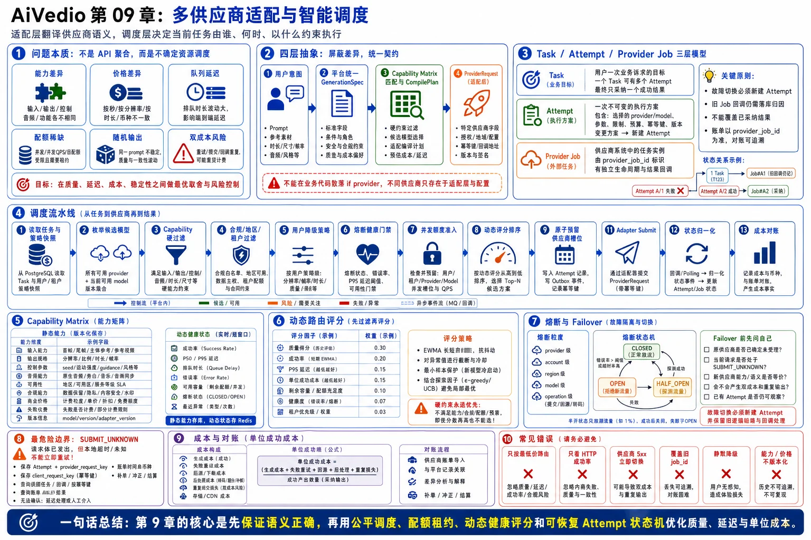

# 第 09 章：多供应商适配与智能调度



> 图注：本章全文重点总结图，围绕供应商语义抽象、Task/Attempt/Provider Job 三层模型、调度流水线、能力矩阵、动态路由评分、熔断 Failover、SUBMIT_UNKNOWN 和成本对账展开。

> 本章讨论如何在同一套 AI 视频平台中接入 Runway、Google Veo、自建模型及其他供应商，并在能力、质量、延迟、成本、配额和故障状态不断变化的情况下，做出可解释、可恢复、可对账的调度决策。
>
> 供应商能力与接口会持续变化。本文中的厂商示例按 **2026 年 6 月 24 日**可查阅的官方资料整理，只用于说明工程抽象；生产系统必须通过版本化能力矩阵和配置中心管理，而不能把具体模型参数永久写死在代码中。

---

## 9.1 本章目标

完成本章后，应能够清楚回答以下问题：

1. 为什么多供应商接入不能写成一组 `if provider == ...`。
2. 如何设计稳定的 `Provider Adapter`，隔离各家请求、状态和错误语义。
3. 如何建立可版本化的 `Capability Matrix`，在提交前完成硬约束过滤。
4. 如何区分任务、执行尝试和供应商任务，避免故障切换后数据混乱。
5. 如何同时管理用户公平性、模型并发额度、供应商配额和平台成本。
6. 如何基于质量、成功率、延迟、成本和健康度进行动态路由。
7. 哪些错误可以重试，哪些可以切换供应商，哪些必须进入“提交结果未知”。
8. 如何实现熔断、半开探测、恢复、防抖和路由可解释性。
9. 如何处理供应商已受理但本地超时这一类最危险的边界。
10. 如何对供应商账单、平台任务和用户计费进行每日对账。

本章的核心结论是：

> **适配层解决“不同供应商如何说同一种业务语言”，调度层解决“当前任务应该由谁、何时、以什么约束执行”。**

---

## 9.2 问题本质：不是 API 聚合，而是不确定资源调度

从接口表面看，各供应商通常都提供以下操作：

```text
提交生成任务
查询任务状态
取消任务
获取输出地址
查询用量或账单
```

但真正困难的地方不在 HTTP 调用，而在语义差异：

- 有的供应商支持文生视频，有的还支持图生视频、首尾帧、参考人物或视频延长。
- 同样是“8 秒、1080p”，可能对应不同模型、不同价格和不同排队时延。
- 有的供应商返回平台任务 ID，有的返回 long-running operation。
- 有的任务会进入供应商内部队列，有的会直接因配额不足返回 429。
- 有的支持取消，但取消只是 best effort；有的开始执行后无法退款。
- 有的支持请求幂等键，有的只能依赖平台自己做未知结果恢复。
- 同一个 `seed` 在不同模型中并不具有相同的可复现语义。
- 内容审核、地区、人像、版权和数据保留政策也可能不同。

因此，多供应商系统不能把“模型名称”直接等同于“业务能力”。正确抽象至少需要四层：

```text
用户意图
  ↓
平台统一生成规格 GenerationSpec
  ↓
供应商能力匹配与编译 CompilePlan
  ↓
供应商原生请求 ProviderRequest
```

调度系统面对的也不是普通负载均衡。普通 HTTP 负载均衡通常把近似同质的短请求分发给多个实例，而 AI 视频任务具有以下特征：

- 单次执行成本高。
- 执行时间长且方差大。
- 输出带随机性，切换供应商会改变业务结果。
- 供应商并发额度稀缺。
- 请求提交结果可能不确定。
- 失败后重试可能产生双份成本。
- 质量很难只用 HTTP 成功率衡量。

所以更准确的定义是：

> **智能调度是一个带硬约束、软目标、稀缺配额、随机输出和不确定外部状态的在线决策系统。**

---

## 9.3 首先拆开 Task、Attempt 和 Provider Job

多供应商设计中最常见的建模错误，是把用户任务和供应商任务放在同一行记录中。例如：

```text
错误模型：
generation_tasks.provider
generation_tasks.provider_job_id
generation_tasks.retry_count
```

只要发生一次故障切换，这个模型就会立即遇到问题：

- 原供应商任务是否还在运行？
- 新供应商任务覆盖了旧 `provider_job_id` 后，如何接收旧任务回调？
- 哪一次尝试产生了费用？
- 哪一次尝试的输出被用户采用？
- 失败原因属于用户任务，还是某一次供应商执行？

正确做法是拆成三层。

### 9.3.1 Generation Task：用户业务目标

`generation_task` 表示用户想得到一个视频结果，关注的是业务生命周期：

```text
QUEUED
SCHEDULING
SUBMITTING
RUNNING
SUCCEEDED
FAILED
CANCELLED
```

一个任务可以拥有多次执行尝试，但最终只能选择一个被采纳的结果。

### 9.3.2 Task Attempt：一次不可变的执行方案

`task_attempt` 表示一次具体执行决策，必须固定以下内容：

```text
attempt_no
provider
provider_account
provider_model
provider_model_version
capability_snapshot_version
normalized_spec_hash
compile_plan
estimated_cost
route_reason
status
```

一次 Attempt 创建后，不应把它从 Runway 改成 Veo。切换供应商必须新建 Attempt，保留完整历史。

### 9.3.3 Provider Job：外部系统中的任务

`provider_job` 表示供应商已经识别的外部任务或 operation：

```text
provider_job_id
provider_request_id
raw_status
normalized_status
submitted_at
last_polled_at
output_locator
raw_error
```

建议约束：

```sql
UNIQUE (provider_account_id, provider_job_id)
UNIQUE (task_id, attempt_no)
```

如果供应商支持调用方请求标识，还应保存：

```sql
UNIQUE (provider_account_id, client_request_key)
```

### 9.3.4 必须守住的领域不变量

1. **一个 Attempt 只绑定一个供应商账号、模型和编译结果。**
2. **一次明确的故障切换必须创建新 Attempt。**
3. **Provider Job 一旦出现，不允许被另一个外部任务覆盖。**
4. **父任务只能采纳一个最终输出。**
5. **旧 Attempt 的迟到回调仍需落库，但不得覆盖已采纳结果。**
6. **计费、成本和对账以 Attempt/Provider Job 为颗粒度，不以父任务重试次数猜测。**
7. **所有路由决策必须保存输入快照和原因，保证事后可解释。**

---

## 9.4 统一领域模型：GenerationSpec

平台 API 不应直接暴露某一家供应商的原生参数。建议先定义稳定的业务规格：

```go
package generation

import "time"

type Mode string

const (
    ModeTextToVideo       Mode = "TEXT_TO_VIDEO"
    ModeImageToVideo      Mode = "IMAGE_TO_VIDEO"
    ModeFirstLastToVideo  Mode = "FIRST_LAST_TO_VIDEO"
    ModeVideoToVideo      Mode = "VIDEO_TO_VIDEO"
    ModeExtendVideo       Mode = "EXTEND_VIDEO"
)

type AssetRef struct {
    AssetID     string
    ObjectURI   string
    MIMEType    string
    SizeBytes   int64
    ChecksumSHA string
}

type OutputSpec struct {
    Width       int
    Height      int
    Duration    time.Duration
    FPS         int
    WithAudio   bool
    SampleCount int
}

type RoutingPolicy struct {
    Mode                 string   // STRICT_MODEL / PREFERRED / AUTO
    RequiredProvider     string
    RequiredModel        string
    PreferredProviders   []string
    MaxEstimatedCostMicros int64
    MaxQueueDelay        time.Duration
    AllowSemanticDegrade bool
    Region               string
}

type GenerationSpec struct {
    TenantID      string
    UserID        string
    ProjectID     string
    Prompt        string
    NegativePrompt string
    Mode          Mode

    FirstFrame    *AssetRef
    LastFrame     *AssetRef
    SourceVideo   *AssetRef
    References    []AssetRef

    Output        OutputSpec
    Seed          *int64
    SafetyProfile string
    Routing       RoutingPolicy

    CreatedAt     time.Time
}
```

这里有两个重要原则。

### 原则一：统一参数表达业务意图，不表达供应商偶然实现

例如，平台可以表达：

```text
需要首尾帧插值
输出竖屏
需要原生音频
最多花费 2 美元
禁止语义降级
```

但不应在统一接口中直接出现某供应商独有的临时字段名。

### 原则二：统一规格不等于最低公共能力集合

不能为了统一接口，只保留所有供应商共同支持的最小功能。否则会失去高阶模型能力。

更合理的方式是：

- 统一核心字段。
- 对高级能力建立明确的扩展结构。
- 由 Capability Matrix 声明哪些模型支持。
- 由 CompilePlan 记录如何映射。
- 无法等价映射时显式拒绝或要求用户允许降级。

---

## 9.5 Provider Adapter 不是一个 `Submit` 方法

一个可用于生产的适配器至少需要覆盖以下职责：

```go
package provider

import (
    "context"
    "time"
)

type Name string

type CompilePlan struct {
    Provider          Name
    ProviderAccountID string
    Model             string
    ModelVersion      string
    NativeRequest     any
    RequestHash       string
    Transformations   []Transformation
    EstimatedCostMicros int64
    CapabilityVersion string
}

type Transformation struct {
    Field    string
    Kind     string // EXACT / LOSSLESS / DEGRADE / REJECT
    Detail   string
}

type SubmitKind string

const (
    SubmitAccepted SubmitKind = "ACCEPTED"
    SubmitRejected SubmitKind = "REJECTED"
    SubmitUnknown  SubmitKind = "UNKNOWN"
)

type JobRef struct {
    ProviderJobID    string
    ProviderRequestID string
}

type SubmitOutcome struct {
    Kind       SubmitKind
    Job        *JobRef
    RawStatus  string
    RetryAfter time.Duration
    Err        *Error
}

type JobStatus struct {
    State       State
    Progress    *float64
    Outputs     []Output
    RawStatus   string
    RawPayload  []byte
    Failure     *Error
    UpdatedAt   time.Time
}

type Output struct {
    URI         string
    MIMEType    string
    ExpiresAt   *time.Time
    SizeBytes   *int64
    Checksum    string
}

type RecoverRequest struct {
    ClientRequestKey string
    SubmittedAfter   time.Time
    SubmittedBefore  time.Time
    RequestHash      string
}

type RecoverResult struct {
    Found bool
    Job   *JobRef
}

type Adapter interface {
    Name() Name

    Compile(ctx context.Context, spec any, model string) (CompilePlan, *Error)
    Submit(ctx context.Context, plan CompilePlan, clientRequestKey string) SubmitOutcome
    Get(ctx context.Context, job JobRef) (JobStatus, *Error)
    Cancel(ctx context.Context, job JobRef) *Error

    // 供应商支持按幂等键、请求标识或近期任务检索时实现。
    RecoverSubmission(ctx context.Context, req RecoverRequest) (RecoverResult, *Error)
}
```

### 9.5.1 为什么 SubmitOutcome 必须有三态

最危险的设计是：

```go
jobID, err := adapter.Submit(...)
```

因为一个普通 `error` 无法区分：

1. 请求在发出前就失败，供应商肯定没有受理。
2. 供应商明确返回拒绝，肯定没有创建任务。
3. 请求体已经发出，但响应在返回前超时，供应商可能已经创建任务。

第三种情况不能直接重试。否则可能产生两个视频和两笔供应商费用。

因此提交结果必须是：

```text
ACCEPTED：已确认受理，拿到 job/operation 标识
REJECTED：已确认未受理
UNKNOWN：是否受理未知，必须进入恢复流程
```

这不是代码风格问题，而是外部副作用接口的正确性边界。

### 9.5.2 适配器不应该承担的职责

Provider Adapter 不应决定：

- 用户优先级。
- 租户公平性。
- 选哪一家供应商。
- 是否允许成本超预算。
- 是否进行业务级故障切换。
- 是否向用户收费。

这些属于调度、策略和计费层。适配器只负责：

> **将平台语义可靠地翻译成供应商语义，并把供应商结果可靠地翻译回来。**

---

## 9.6 Capability Matrix：先过滤，再评分

智能调度不能一开始就给所有供应商打分。第一步必须是硬约束过滤：不具备所需能力的候选项，无论多便宜、多快，都不能进入评分阶段。

### 9.6.1 能力矩阵至少包含什么

建议按 `provider + account + region + model + model_version` 管理：

| 维度 | 示例字段 |
|---|---|
| 模式 | text-to-video、image-to-video、video-to-video、extend |
| 输入能力 | 首帧、尾帧、参考图数量、源视频、透明通道 |
| 输出能力 | 时长集合、分辨率、宽高比、帧率、样本数量 |
| 音频 | 原生音频、静音、音频可关闭、对白支持 |
| 控制参数 | seed、negative prompt、运镜、人物一致性 |
| 媒体限制 | MIME、文件大小、像素、时长、URL/上传方式 |
| 生命周期 | 上传地址 TTL、输出地址 TTL、任务保留时间 |
| 任务操作 | 查询、回调、取消、删除、幂等键、任务检索 |
| 配额 | 并发、每分钟、每日、固定额度、区域额度 |
| 合规 | 可用地区、人像策略、数据保留、训练使用策略 |
| 商业 | 单价、最低计费单位、失败是否收费、退款规则 |
| 发布状态 | preview、stable、deprecated、sunset date |

厂商文档本身就说明能力与限制并不统一。例如，Google 的 Veo 文档采用 long-running operation，调用方轮询 operation 完成后再下载视频；不同 Veo 版本在首尾帧、参考图、延长、分辨率和时长组合上存在不同约束。Runway 当前文档则采用任务式接口，并明确其输出 URL 是临时地址，需要尽快回源到自己的存储。[1][2]

### 9.6.2 静态能力和动态状态必须分开

不要把以下内容混在一个 JSON 中：

```text
静态或慢变化：
模型是否支持首尾帧
最大参考图数量
支持的分辨率

动态或快变化：
当前并发占用
最近 5 分钟成功率
当前 P95 延迟
熔断状态
剩余额度
```

建议拆分：

```text
provider_model_capabilities  // 版本化、审计、发布
provider_runtime_health      // 高频更新、短期窗口
provider_quota_leases        // 实时准入
provider_price_versions      // 独立生效区间
```

### 9.6.3 示例能力配置

```yaml
provider: google
account: veo-prod-apac
region: asia-northeast1
model: veo-3.1-generate-preview
version: 2026-06-01
status: preview

modes:
  - TEXT_TO_VIDEO
  - IMAGE_TO_VIDEO
  - FIRST_LAST_TO_VIDEO
  - EXTEND_VIDEO

output:
  aspect_ratios: ["16:9", "9:16"]
  durations_seconds: [4, 6, 8]
  resolutions: ["720p", "1080p", "4k"]
  native_audio: true

constraints:
  - when: resolution in ["1080p", "4k"]
    require: duration_seconds == 8
  - when: mode == "EXTEND_VIDEO"
    require: resolution == "720p"

operations:
  polling: true
  callback: false
  cancellation: false
  client_idempotency_key: false

commercial:
  currency: USD
  price_version: veo-2026-06
```

这个配置只表示结构示例。模型发布状态、区域、限制和价格必须由自动或人工发布流程维护。

### 9.6.4 能力矩阵也要版本化

一次任务必须记录它所使用的能力版本：

```text
capability_snapshot_version = google/veo-3.1/2026-06-01
price_version               = veo-2026-06
routing_policy_version      = router-v17
```

否则一个月后模型规则改变，团队无法解释：

- 为什么当时允许这个参数组合？
- 为什么估价和账单不一致？
- 为什么路由到了已下线模型？

---

## 9.7 参数编译：精确映射、无损转换、语义降级和拒绝

统一规格转换成供应商请求时，必须给每个转换定性。

### 9.7.1 四类转换

| 类型 | 含义 | 是否可自动执行 |
|---|---|---:|
| `EXACT` | 业务语义与供应商语义完全一致 | 是 |
| `LOSSLESS` | 表达形式变化，但业务语义不变 | 是 |
| `DEGRADE` | 供应商无法完整实现，需要降低能力 | 仅用户明确允许 |
| `REJECT` | 无合法编译方案 | 否 |

示例：

```text
1920×1080 → ratio=16:9               LOSSLESS
duration=7s → 供应商仅支持 6s/8s      DEGRADE
需要原生音频 → 供应商只输出静音         REJECT 或 DEGRADE
需要尾帧约束 → 模型不支持尾帧            REJECT
negative_prompt → 模型无对应参数         DEGRADE
```

### 9.7.2 不要把后处理误认为模型能力等价

以下做法可能改善媒体格式，但不能等价替代生成语义：

```text
生成 16:9 后裁成 9:16
生成 8 秒后裁成 7 秒
静音视频后配一段通用音乐
生成普通视频后通过插帧提高 FPS
```

这些转换可能改变构图、动作节奏和音画语义。系统可以提供，但必须记录为降级方案，并纳入用户选择、质量评估和计费说明。

### 9.7.3 规范化请求哈希

对一次 Attempt 建议计算：

```text
request_hash = SHA256(
    normalized_generation_spec
    + selected_provider
    + selected_model_version
    + capability_version
    + compile_plan
    + referenced_asset_checksums
)
```

用途包括：

- 判断重复提交是否真的是同一业务请求。
- 恢复“提交结果未知”的供应商任务。
- 对账与审计。
- 适配器 golden test。

不要只哈希原始 JSON，因为字段顺序、默认值和 URL 临时签名都会导致不稳定。

---

## 9.8 状态归一化：保留原始状态，但业务只依赖统一状态

供应商原始状态可能包括：

```text
PENDING
QUEUED
THROTTLED
PROCESSING
RUNNING
DONE
SUCCEEDED
FAILED
CANCELED
EXPIRED
```

平台应同时保存：

```text
raw_status         // 供应商原值，便于排障
normalized_status  // 平台统一语义
```

推荐 Attempt 状态：

```text
CREATED
RESERVING
READY_TO_SUBMIT
SUBMITTING
SUBMIT_UNKNOWN
ACCEPTED
PROVIDER_QUEUED
PROVIDER_THROTTLED
RUNNING
SUCCEEDED
FAILED
CANCEL_REQUESTED
CANCELLED
ABANDONED
```

### 9.8.1 状态必须单调推进

供应商查询和回调可能乱序。例如：

```text
10:00:05 轮询得到 RUNNING
10:00:07 延迟回调到达 QUEUED
```

不能把状态从 `RUNNING` 回退到 `QUEUED`。可为状态定义阶段序号：

```go
var phase = map[State]int{
    StateCreated:           10,
    StateSubmitting:        20,
    StateSubmitUnknown:     25,
    StateAccepted:          30,
    StateProviderQueued:    40,
    StateProviderThrottled: 40,
    StateRunning:           50,
    StateSucceeded:         100,
    StateFailed:            100,
    StateCancelled:         100,
}
```

但不能只靠数值比较，因为终态之间也有竞态。更稳妥的是显式状态迁移表加版本条件：

```sql
UPDATE task_attempts
SET status = $new_status,
    status_version = status_version + 1,
    updated_at = now()
WHERE id = $attempt_id
  AND status_version = $expected_version
  AND status = ANY($allowed_from_states);
```

### 9.8.2 父任务状态和 Attempt 状态不同

例如，Attempt A 已失败，调度器正在选择 Attempt B：

```text
父任务：SCHEDULING
Attempt A：FAILED
Attempt B：CREATED
```

不要简单地把最后一次 Attempt 状态复制给父任务。

---

## 9.9 错误归一化：先分类，再决定重试与切换

供应商错误码不能原样驱动业务。建议统一为以下错误类别：

```go
type ErrorClass string

const (
    ErrInvalidInput        ErrorClass = "INVALID_INPUT"
    ErrUnsupported         ErrorClass = "UNSUPPORTED_CAPABILITY"
    ErrSafetyInput         ErrorClass = "SAFETY_INPUT"
    ErrSafetyOutput        ErrorClass = "SAFETY_OUTPUT"
    ErrAuth                ErrorClass = "AUTH"
    ErrPermission          ErrorClass = "PERMISSION"
    ErrQuota               ErrorClass = "QUOTA"
    ErrRateLimited         ErrorClass = "RATE_LIMITED"
    ErrProviderOverloaded  ErrorClass = "PROVIDER_OVERLOADED"
    ErrTransientNetwork    ErrorClass = "TRANSIENT_NETWORK"
    ErrAssetUnavailable    ErrorClass = "ASSET_UNAVAILABLE"
    ErrAssetInvalid        ErrorClass = "ASSET_INVALID"
    ErrInternalRetryable   ErrorClass = "INTERNAL_RETRYABLE"
    ErrInternalPermanent   ErrorClass = "INTERNAL_PERMANENT"
    ErrSubmissionUnknown   ErrorClass = "SUBMISSION_UNKNOWN"
    ErrOutputExpired       ErrorClass = "OUTPUT_EXPIRED"
)

type Error struct {
    Class          ErrorClass
    Code           string
    Message        string
    Retryable      bool
    Failoverable   bool
    ProviderMayHaveAccepted bool
    RetryAfter     time.Duration
    RawStatusCode  int
}
```

### 9.9.1 推荐处理矩阵

| 错误类别 | 同供应商重试 | 切换供应商 | 说明 |
|---|---:|---:|---|
| 参数非法 | 否 | 通常否 | 应在编译阶段拦截 |
| 能力不支持 | 否 | 是 | 重新选择具备能力的候选项 |
| 输入审核拒绝 | 否 | 通常否 | 不应通过换供应商绕过平台安全策略 |
| 输出审核拒绝 | 视产品策略 | 视产品策略 | 需评估是否允许重新生成 |
| 认证/权限 | 否 | 可切账号/供应商 | 先熔断错误账号 |
| 配额耗尽 | 延迟 | 是 | 区分短期并发与长期额度 |
| 429/过载 | 是 | 是 | 指数退避、抖动、限次 |
| 明确未受理的 5xx | 是 | 是 | 需要供应商契约确认 |
| 请求发送结果未知 | 否 | 否 | 先恢复，禁止盲重试 |
| 素材失效 | 修复后 | 有条件 | 重新签名或重新上传 |
| 永久内部失败 | 否 | 有条件 | 取决于能力等价性和用户策略 |
| 输出 URL 失效 | 查询/刷新 | 否 | 不应重新生成视频 |

Runway 官方错误文档将输入类 400 视为不可重试，将 429、502、503、504 视为可采用指数退避和 jitter 重试；其任务失败文档还明确区分安全审核类失败和部分可重试的内部失败。[3][4] Google 官方错误模型中，429 `RESOURCE_EXHAUSTED` 可能表示配额耗尽或共享容量过载，因此平台仍需结合错误详情和自身配额状态进一步分类。[5]

### 9.9.2 安全错误不能通过自动换供应商规避

系统必须先执行平台统一安全策略。若平台判定请求不允许，则不能因为另一家供应商可能接受，就自动绕过。

正确分层是：

```text
平台安全策略：决定业务是否允许
供应商安全策略：决定该供应商是否接受
```

供应商比平台更严格时，可以提示用户修改内容或选择满足政策的合法路径；供应商比平台更宽松时，也不能突破平台底线。

---

## 9.10 调度流水线：硬过滤、准入、评分、预留、提交

推荐把一次调度拆成可观测的阶段：

```text
1. 读取任务与路由策略快照
2. 枚举模型候选项
3. Capability 硬约束过滤
4. 合规、区域、租户策略过滤
5. 预算和价格过滤
6. 熔断与健康门禁
7. 检查配额可用性
8. 计算候选分数
9. 原子预留供应商并发槽位
10. 创建 Attempt 与 RouteDecision
11. 写入 Outbox
12. 异步执行 Submit
```

关键原则：

> **先过滤，再评分；先预留，再提交；路由决策先持久化，再产生外部副作用。**

### 9.10.1 为什么不能先调用供应商再落库

错误顺序：

```text
调用供应商成功
  ↓
本地创建 Attempt 失败
```

此时供应商已经在收费执行，但平台没有可靠记录。正确顺序是：

```text
事务内创建 Attempt + RouteDecision + Outbox
  ↓
事务提交
  ↓
消费者根据 Attempt 幂等提交供应商
```

由于提交本身仍可能出现未知结果，Attempt 在发起请求前要进入 `SUBMITTING`，并保存稳定的 `client_request_key`。

### 9.10.2 路由决策必须可解释

建议保存：

```json
{
  "policy_version": "router-v17",
  "capability_version": "cap-2026-06-24",
  "selected": "runway/gen4.5/prod-us",
  "candidates": [
    {
      "id": "runway/gen4.5/prod-us",
      "eligible": true,
      "score": 0.812,
      "quality": 0.91,
      "success_rate": 0.97,
      "latency": 0.72,
      "cost": 0.55,
      "capacity": 0.88
    },
    {
      "id": "google/veo-3.1/apac",
      "eligible": false,
      "reason": "STRICT_MODEL_MISMATCH"
    }
  ]
}
```

这份快照用于：

- 客诉解释。
- 成本异常分析。
- 路由策略回放。
- A/B 实验。
- 事故复盘。

---

## 9.11 并发额度不是一个计数器，而是带租约的稀缺资源

供应商通常同时存在多种限制：

```text
账号总并发
模型并发
视频模态共享并发
区域配额
每分钟提交数
每日生成数
月度消费上限
```

Runway 当前文档明确按组织和模型/模态设置使用层级及并发限制；超过并发时，任务可能进入供应商端 `THROTTLED` 队列，而超过滚动日生成上限时会返回 429。[6] 即使供应商会代为排队，平台仍应在本地做准入，原因是：

- 供应商内部队列不可见，难以保证租户公平。
- 大量预提交会放大成本与取消难度。
- 无法准确估计平台自己的排队时间。
- 供应商异常时，数千个任务可能同时积压在外部。
- 路由器失去动态切换机会。

### 9.11.1 Redis 租约模型

可以为每个资源维度维护：

```text
capacity:{provider}:{account}:{model}
lease:{attempt_id}
```

租约至少包含：

```text
attempt_id
resource_key
slots
lease_token
fencing_token
expires_at
last_heartbeat_at
```

原子预留逻辑：

```lua
-- KEYS[1] capacity hash
-- KEYS[2] lease key
-- ARGV[1] max slots
-- ARGV[2] requested slots
-- ARGV[3] lease value
-- ARGV[4] ttl ms

local used = tonumber(redis.call('HGET', KEYS[1], 'used') or '0')
local max_slots = tonumber(ARGV[1])
local requested = tonumber(ARGV[2])

if used + requested > max_slots then
    return 0
end

redis.call('HINCRBY', KEYS[1], 'used', requested)
redis.call('SET', KEYS[2], ARGV[3], 'PX', ARGV[4], 'NX')
return 1
```

实际实现还要处理：

- `SET NX` 失败时回滚计数。
- 同时预留账号、模型、区域多层资源时的原子性。
- Redis Cluster 的 hash slot。
- 释放幂等。
- 续租与最大租期。
- Worker 崩溃后的过期回收。

更稳妥的做法是把同一供应商账号的相关 key 放在同一 hash tag：

```text
capacity:{runway-prod}:all-video
capacity:{runway-prod}:gen4.5
lease:{runway-prod}:attempt-123
```

### 9.11.2 为什么必须对账

任何分布式计数都会发生泄漏：

- Worker 在供应商终态前崩溃。
- 回调丢失。
- Redis 主从切换。
- 释放消息重复或乱序。
- 人工修改任务状态。

因此应定期根据 PostgreSQL 事实源重算：

```text
真实在途 Attempt =
SUBMITTING
SUBMIT_UNKNOWN
ACCEPTED
PROVIDER_QUEUED
PROVIDER_THROTTLED
RUNNING
CANCEL_REQUESTED
```

对账程序比较：

```text
expected_used_slots vs redis_used_slots
```

发现差异后修正，并记录审计事件，而不是假设 Redis 永远正确。

### 9.11.3 未知提交是否占用槽位

`SUBMIT_UNKNOWN` 不应立即释放全部资源。因为供应商可能已经在执行。

可采用两层资源：

```text
confirmed_active_slots
unknown_submission_slots
```

并为未知提交设置独立上限，例如：

```text
unknown_submission_slots <= max(2, total_capacity * 5%)
```

如果未知任务持续增加，应停止新提交并触发告警，因为这通常意味着网络、供应商响应或幂等恢复链路出现系统性问题。

---

## 9.12 公平队列：不能让一个大客户吃光所有模型配额

简单优先队列通常按：

```text
ORDER BY priority DESC, created_at ASC
```

它会造成两个问题：

- 高优先级租户长期压制普通租户。
- 大租户批量提交时占满全部供应商并发。

### 9.12.1 推荐分层调度

```text
第一层：服务等级
  ├── interactive
  ├── standard
  └── batch

第二层：租户
  ├── tenant A，weight=5
  ├── tenant B，weight=2
  └── tenant C，weight=1

第三层：租户内部
  ├── 用户公平
  ├── 项目优先级
  └── FIFO + aging
```

### 9.12.2 Deficit Round Robin

工程上可采用加权 Deficit Round Robin：

```text
每轮：
deficit[tenant] += quantum * tenant_weight

若任务 estimated_cost_units <= deficit[tenant]：
    取出任务
    deficit[tenant] -= estimated_cost_units
否则：
    跳到下一个租户
```

`estimated_cost_units` 不应只按任务个数计算。一个 4 秒 720p 任务和一个高分辨率长视频任务占用资源不同，可以综合：

```text
预计供应商执行秒数
预计价格
分辨率系数
样本数量
历史 P50 运行时间
```

### 9.12.3 Aging 防止饥饿

可以让排队时间逐步提高有效优先级：

```text
effective_priority = base_priority
                   + min(max_aging_bonus, queue_age / aging_interval)
```

但 aging 只影响同一服务等级内的排序，不应突破安全、预算或能力硬约束。

### 9.12.4 Durable Queue 与加速索引

推荐：

```text
PostgreSQL：任务排队事实源
RocketMQ：唤醒和异步传递
Redis：活跃租户、虚拟时间、临时调度索引
```

不要让 Redis Sorted Set 成为唯一任务队列。Redis 故障后，调度器应能从 PostgreSQL 中重新扫描待调度任务并恢复。

---

## 9.13 动态路由评分：质量、成功率、延迟、成本和容量

通过硬过滤的候选项，可以计算综合效用：

```text
score =
    wq * quality_score
  + ws * success_score
  + wl * latency_score
  + wc * cost_score
  + wa * capacity_score
  + wr * region_score
  + wp * preference_score
  - penalties
```

示例权重：

```text
quality     0.28
success     0.22
latency     0.18
cost        0.14
capacity    0.10
region      0.04
preference  0.04
```

权重只是示例，应按产品场景区分：

| 场景 | 主要目标 |
|---|---|
| 交互式创作 | 排队时间、P95 延迟、成功率 |
| 广告成片 | 质量、一致性、合规 |
| 批量素材 | 单位成功成本、吞吐 |
| 企业私有项目 | 地区、数据策略、固定供应商 |
| 免费试用 | 成本上限、共享容量 |

### 9.13.1 硬约束绝不能被高分覆盖

以下条件必须先排除：

```text
不支持所需生成模式
分辨率/时长组合非法
地区不允许
用户指定严格模型
预算上限不足
供应商账号熔断
合规策略不匹配
模型已下线
```

### 9.13.2 指标归一化

原始指标量纲不同，必须归一化到 `[0,1]`。

成功率：

```text
success_score = WilsonLowerBound(successes, total)
```

使用置信下界比直接使用成功率更稳健，避免只有两次成功的新模型得到 100% 高分。

延迟：

```text
latency_score = clamp(
    (latency_bad - predicted_p95) / (latency_bad - latency_good),
    0,
    1
)
```

成本：

```text
cost_score = clamp(
    (max_acceptable_cost - predicted_cost)
    / (max_acceptable_cost - min_candidate_cost),
    0,
    1
)
```

容量：

```text
capacity_score = available_slots / max_slots
```

但当剩余槽位接近 0 时，可使用非线性惩罚，避免所有请求继续涌向同一候选项：

```text
capacity_score = (available_slots / max_slots)^2
```

### 9.13.3 使用 EWMA，但不要只看短窗口

建议同时维护：

```text
1 分钟窗口：发现突发退化
15 分钟窗口：当前路由决策
24 小时窗口：稳定基线
7 天窗口：质量与成本趋势
```

可使用 EWMA：

```text
EWMA_t = alpha * sample_t + (1 - alpha) * EWMA_(t-1)
```

短窗口权重大，响应快；长窗口用于防止抖动。

### 9.13.4 防止路由振荡

当两个供应商分数接近时，如果每次都选择瞬时最高分，流量会来回摆动。可加入：

- 迟滞：新候选项至少高出当前候选 `δ` 才切换。
- 最小驻留时间：策略在一个短周期内保持稳定。
- 分段权重：容量低于阈值时才显著惩罚。
- 路由分桶：按 `tenant_id` 或 `task_id` 做一致性散列。
- 平滑窗口：避免单次异常样本改变整体路由。

### 9.13.5 探索流量要受控

新模型没有足够历史数据时，可分配少量 canary 流量：

```text
0.5% → 2% → 5% → 10%
```

每一级都要求满足：

```text
成功率阈值
P95 延迟阈值
安全失败率阈值
单位成功成本阈值
人工质量抽检阈值
```

不能把用户的高价值任务当成无约束探索样本。

---

## 9.14 质量不是一个静态分数

视频模型的质量具有任务依赖性：

```text
人物一致性强，不代表文字渲染好
写实质量高，不代表动漫风格好
文生视频好，不代表首尾帧插值好
```

因此质量画像应按标签分桶：

```text
mode
content_category
style
has_human
camera_motion
resolution
duration
reference_count
```

质量信号可以来自：

- 用户明确评分。
- 用户是否立即重新生成。
- 用户是否下载或进入编辑器。
- 输出是否通过自动审核。
- 人物/主体一致性模型评分。
- 闪烁、黑帧、静帧、音画不同步检测。
- 人工抽检。

但要避免把“用户没有下载”直接等同于质量差，因为也可能是用户离开页面、项目被取消或生成速度过慢。

推荐区分：

```text
technical_quality_score
semantic_quality_score
user_acceptance_score
```

最终路由评分使用经过校准的组合，而不是一个不可解释的神秘分数。

---

## 9.15 熔断：按供应商、账号、模型、区域和操作拆分

错误的熔断粒度：

```text
provider=google 全部熔断
```

这可能因为某个区域的某个模型提交失败，就连查询、下载和其他模型也全部停掉。

推荐熔断键：

```text
(provider, account, region, model, operation)
```

`operation` 至少区分：

```text
SUBMIT
POLL
CANCEL
UPLOAD
DOWNLOAD_OUTPUT
USAGE_QUERY
```

### 9.15.1 哪些错误计入熔断

通常计入：

- 连接失败。
- DNS/TLS 错误。
- 502/503/504。
- 供应商内部可重试失败。
- 超过基线的超时。
- 连续响应格式异常。

通常不计入：

- 用户参数错误。
- 输入安全拒绝。
- 用户主动取消。
- 明确不支持的能力。
- 账户配置错误造成的单一静态失败，应直接停用该账号而非统计波动。

### 9.15.2 状态机

```text
CLOSED
  │ 失败率或连续失败超过阈值
  ▼
OPEN
  │ 冷却时间到
  ▼
HALF_OPEN
  │ 少量探测成功
  ├────────────► CLOSED
  │ 探测失败
  └────────────► OPEN
```

示例阈值：

```text
至少 20 个样本后才评估
最近 2 分钟失败率 > 50%
或连续 8 次可重试失败
或 P95 提交延迟超过基线 4 倍
```

阈值必须按调用频率调整，不能把示例数字直接复制到所有模型。

### 9.15.3 半开探测不能放开全部流量

半开阶段只允许少量并发探测：

```text
max_probe_concurrency = 1~3
required_successes = 3~5
```

并使用指数增加的冷却时间：

```text
30s → 1m → 2m → 5m → 10m
```

### 9.15.4 本地熔断和全局健康状态

建议两层：

```text
Pod 本地 breaker：快速阻止当前实例继续打故障端点
全局 health state：让所有调度器统一降低或停止路由
```

全局状态可放在 Redis/配置服务中加速，但健康事件和人工操作要持久化到 PostgreSQL，便于审计和恢复。

---

## 9.16 Provider Failover：能切换不代表应该切换

供应商故障切换必须先回答两个问题：

1. **原供应商是否确定没有受理？**
2. **新供应商是否能保持用户要求的业务语义？**

### 9.16.1 安全切换的典型情况

```text
能力过滤阶段发现不支持
供应商账号处于 OPEN
明确返回配额不足且未创建任务
明确返回服务不可用且契约保证未受理
素材上传在提交任务前失败
供应商任务进入可判定的永久失败终态
```

### 9.16.2 不能直接切换的情况

```text
请求体已发送，响应超时
连接在响应阶段被重置
供应商返回 2xx，但本地解析失败
拿到 job_id 后本地事务失败
任务已运行，只是轮询暂时失败
用户指定严格模型或供应商
供应商专属的视频延长链路
依赖该供应商生成历史或专属资产 ID
不同供应商的安全/地区政策不等价
seed、音频或人物一致性无法保持
```

### 9.16.3 三种路由模式

建议产品层明确提供：

```text
STRICT_MODEL
  用户指定确切模型，不自动换模型。

PREFERRED
  优先指定模型；在明确可安全切换且语义等价时降级。

AUTO
  用户只声明业务目标，由平台选择候选项。
```

即使是 `AUTO`，也不能在提交结果未知时立刻切换。

### 9.16.4 已受理后失败，是否可以再生成

需要同时考虑：

- 失败是否收费。
- 用户是否仍在等待。
- 新供应商是否等价。
- 是否会改变内容审核结论。
- 是否超过用户预算。
- 是否已达到最大 Attempt 数。

推荐设置：

```text
max_total_attempts
max_provider_switches
max_estimated_platform_loss
task_deadline
```

如果因平台故障产生重复供应商成本，通常不应向用户收取重复费用，应记入平台损失或供应商争议账目。

---

## 9.17 最危险场景：供应商已受理，但本地请求超时

这是高级面试中必须主动讲出的边界。

### 9.17.1 事故过程

```text
1. 平台向供应商 POST /generate
2. 供应商创建任务并开始执行
3. 响应返回途中网络超时
4. 平台没有拿到 provider_job_id
5. Worker 将其当普通失败重试
6. 供应商创建第二个任务
7. 用户只需要一个结果，平台支付两次成本
```

### 9.17.2 正确状态：SUBMIT_UNKNOWN

只要不能证明供应商未受理，就必须：

```text
Attempt.status = SUBMIT_UNKNOWN
```

并记录：

```text
client_request_key
request_hash
request_started_at
request_body_sent_at
transport_error_stage
provider_request_trace
account_id
model
estimated_cost
```

### 9.17.3 网络错误要按阶段分类

| 失败阶段 | 是否可能已受理 | 推荐处理 |
|---|---:|---|
| DNS 解析失败 | 否 | 可重试 |
| TCP 连接建立前失败 | 否 | 可重试 |
| TLS 握手失败且未写请求 | 否 | 可重试 |
| 请求体部分写入后断开 | 是 | UNKNOWN |
| 请求体全部写入、等响应超时 | 是 | UNKNOWN |
| 收到明确 4xx/429 | 通常否 | 按供应商契约分类 |
| 收到 2xx 和 job ID | 是 | ACCEPTED |
| 收到 2xx 但响应体损坏 | 是 | UNKNOWN，并尝试恢复 |

Go 中可以借助自定义 `RoundTripper`、`httptrace` 或客户端中间件记录请求阶段，但不要过度相信“本地 write 成功”就等于供应商已处理。最终仍以供应商幂等和检索能力为准。

### 9.17.4 恢复优先级

```text
1. 使用相同幂等键查询或重试提交
2. 按 client_request_key 查询供应商任务
3. 按 provider request ID 查询
4. 搜索该账号近期任务及元数据
5. 检查先到达的回调事件
6. 检查供应商用量或账单记录
7. 进入人工/延迟补偿队列
```

如果供应商支持幂等键，必须在同一 Attempt 的所有重试中复用同一个 key，不能每次生成新 key。

### 9.17.5 何时可以放弃恢复

需要定义不确定窗口：

```text
unknown_recovery_deadline
max_recovery_queries
max_unknown_age
```

超过窗口后也不能假装“确定失败”。可将 Attempt 标记为 `ABANDONED`，但继续保留后台对账；父任务是否创建新 Attempt，要根据：

- 用户等待时限。
- 最大潜在重复成本。
- 供应商历史最长建单延迟。
- 是否存在稳定幂等保障。
- 产品对重复生成的容忍度。

这是一项明确的业务风险决策，而不是单纯技术重试参数。

---

## 9.18 轮询、回调与取消在适配层中的边界

详细的回调、SSE 和 WebSocket 设计将在后续章节展开，本章只说明调度相关原则。

### 9.18.1 回调和轮询应汇入同一个状态入口

```text
Provider Callback ─┐
                   ├──► Provider Event Normalizer ─► Attempt State Machine
Polling Worker ────┘
```

二者都必须：

- 验证供应商身份或签名。
- 按 `provider_job_id` 幂等。
- 保存原始响应。
- 允许重复和乱序。
- 使用版本条件推进状态。

### 9.18.2 轮询退避

不要固定每秒轮询所有任务。可按运行阶段退避：

```text
刚提交：2s、4s、8s
供应商排队：15s、30s、60s
运行中：10s、15s、30s
接近供应商 P95：缩短到 10s
超出最大合理时长：进入卡住检测
```

加入 10%～30% jitter，避免大量任务同时轮询。

### 9.18.3 取消是请求，不是事实

平台发起取消后：

```text
Attempt = CANCEL_REQUESTED
```

只有供应商确认取消或查询到取消终态，才能标为 `CANCELLED`。如果取消与成功同时发生：

- 保留供应商真实终态。
- 父任务是否展示结果由产品策略决定。
- 计费按供应商实际执行和平台规则结算。

---

## 9.19 数据模型设计

下面给出一组核心表的简化结构。

### 9.19.1 供应商账号

```sql
CREATE TABLE provider_accounts (
    id                  BIGSERIAL PRIMARY KEY,
    provider            TEXT NOT NULL,
    account_name        TEXT NOT NULL,
    region              TEXT NOT NULL,
    credential_ref      TEXT NOT NULL,
    status              TEXT NOT NULL,
    config              JSONB NOT NULL DEFAULT '{}',
    created_at          TIMESTAMPTZ NOT NULL DEFAULT now(),
    updated_at          TIMESTAMPTZ NOT NULL DEFAULT now(),
    UNIQUE (provider, account_name, region)
);
```

凭据应放在 KMS/Secret Manager 中，数据库只保存引用。

### 9.19.2 模型能力版本

```sql
CREATE TABLE provider_model_capabilities (
    id                  BIGSERIAL PRIMARY KEY,
    provider_account_id BIGINT NOT NULL REFERENCES provider_accounts(id),
    model               TEXT NOT NULL,
    model_version       TEXT NOT NULL,
    capability_version  TEXT NOT NULL,
    lifecycle_status    TEXT NOT NULL,
    capabilities        JSONB NOT NULL,
    effective_from      TIMESTAMPTZ NOT NULL,
    effective_to        TIMESTAMPTZ,
    created_at          TIMESTAMPTZ NOT NULL DEFAULT now(),
    UNIQUE (
        provider_account_id,
        model,
        model_version,
        capability_version
    )
);
```

### 9.19.3 执行尝试

```sql
CREATE TABLE task_attempts (
    id                    BIGSERIAL PRIMARY KEY,
    task_id               BIGINT NOT NULL REFERENCES generation_tasks(id),
    attempt_no            INT NOT NULL,
    provider_account_id   BIGINT NOT NULL REFERENCES provider_accounts(id),
    provider_model        TEXT NOT NULL,
    provider_model_version TEXT NOT NULL,
    capability_version    TEXT NOT NULL,
    price_version         TEXT NOT NULL,
    routing_policy_version TEXT NOT NULL,
    client_request_key    TEXT NOT NULL,
    normalized_spec_hash  TEXT NOT NULL,
    compile_plan          JSONB NOT NULL,
    route_decision_id     BIGINT,
    status                TEXT NOT NULL,
    status_version        BIGINT NOT NULL DEFAULT 0,
    estimated_cost_micros BIGINT NOT NULL,
    actual_cost_micros    BIGINT,
    currency              CHAR(3) NOT NULL,
    created_at            TIMESTAMPTZ NOT NULL DEFAULT now(),
    updated_at            TIMESTAMPTZ NOT NULL DEFAULT now(),
    UNIQUE (task_id, attempt_no),
    UNIQUE (provider_account_id, client_request_key)
);
```

### 9.19.4 供应商任务

```sql
CREATE TABLE provider_jobs (
    id                    BIGSERIAL PRIMARY KEY,
    attempt_id            BIGINT NOT NULL REFERENCES task_attempts(id),
    provider_account_id   BIGINT NOT NULL REFERENCES provider_accounts(id),
    provider_job_id       TEXT NOT NULL,
    provider_request_id   TEXT,
    raw_status            TEXT,
    normalized_status     TEXT NOT NULL,
    output_locator        JSONB,
    raw_failure           JSONB,
    submitted_at          TIMESTAMPTZ NOT NULL,
    last_polled_at        TIMESTAMPTZ,
    completed_at          TIMESTAMPTZ,
    created_at            TIMESTAMPTZ NOT NULL DEFAULT now(),
    UNIQUE (provider_account_id, provider_job_id),
    UNIQUE (attempt_id)
);
```

### 9.19.5 路由决策

```sql
CREATE TABLE route_decisions (
    id                    BIGSERIAL PRIMARY KEY,
    task_id               BIGINT NOT NULL REFERENCES generation_tasks(id),
    decision_no           INT NOT NULL,
    policy_version        TEXT NOT NULL,
    selected_candidate    TEXT,
    candidate_snapshot    JSONB NOT NULL,
    reason_code           TEXT NOT NULL,
    created_at            TIMESTAMPTZ NOT NULL DEFAULT now(),
    UNIQUE (task_id, decision_no)
);
```

### 9.19.6 供应商健康样本

高频指标适合进入时序系统，PostgreSQL 只保留聚合快照或健康事件：

```sql
CREATE TABLE provider_health_events (
    id                    BIGSERIAL PRIMARY KEY,
    provider_account_id   BIGINT NOT NULL REFERENCES provider_accounts(id),
    model                 TEXT,
    operation             TEXT NOT NULL,
    old_state             TEXT NOT NULL,
    new_state             TEXT NOT NULL,
    reason                TEXT NOT NULL,
    metrics_snapshot      JSONB NOT NULL,
    occurred_at           TIMESTAMPTZ NOT NULL DEFAULT now()
);
```

---

## 9.20 Go 调度器骨架

下面的代码强调边界和顺序，不代表完整生产实现。

```go
package scheduler

import (
    "context"
    "errors"
    "fmt"
    "sort"
)

type Candidate struct {
    ID        string
    Provider  string
    AccountID string
    Model     string
    Plan      CompilePlan
    Score     float64
    Reason    ScoreBreakdown
}

type ScoreBreakdown struct {
    Quality    float64
    Success    float64
    Latency    float64
    Cost       float64
    Capacity   float64
    Preference float64
    Penalty    float64
}

type Scheduler struct {
    registry   Registry
    policy     PolicyEngine
    health     HealthStore
    quota      QuotaManager
    repository Repository
    outbox     OutboxWriter
}

func (s *Scheduler) Schedule(ctx context.Context, task Task) (Attempt, error) {
    spec, err := s.repository.LoadGenerationSpec(ctx, task.ID)
    if err != nil {
        return Attempt{}, fmt.Errorf("load spec: %w", err)
    }

    models, err := s.registry.ListCandidates(ctx, spec)
    if err != nil {
        return Attempt{}, fmt.Errorf("list candidates: %w", err)
    }

    candidates := make([]Candidate, 0, len(models))
    rejected := make([]RejectedCandidate, 0)

    for _, model := range models {
        if reason := s.policy.HardReject(spec, model); reason != "" {
            rejected = append(rejected, RejectedCandidate{ID: model.ID, Reason: reason})
            continue
        }

        adapter := s.registry.Adapter(model.Provider)
        plan, compileErr := adapter.Compile(ctx, spec, model.Name)
        if compileErr != nil {
            rejected = append(rejected, RejectedCandidate{
                ID: model.ID, Reason: string(compileErr.Class),
            })
            continue
        }

        if !s.health.Allowed(model.HealthKey("SUBMIT")) {
            rejected = append(rejected, RejectedCandidate{
                ID: model.ID, Reason: "CIRCUIT_OPEN",
            })
            continue
        }

        breakdown := s.policy.Score(ctx, spec, model, plan)
        candidates = append(candidates, Candidate{
            ID:        model.ID,
            Provider:  model.Provider,
            AccountID: model.AccountID,
            Model:     model.Name,
            Plan:      plan,
            Score:     breakdown.Total(),
            Reason:    breakdown,
        })
    }

    sort.SliceStable(candidates, func(i, j int) bool {
        return candidates[i].Score > candidates[j].Score
    })

    for _, candidate := range candidates {
        lease, leaseErr := s.quota.TryAcquire(ctx, QuotaRequest{
            AccountID: candidate.AccountID,
            Model:     candidate.Model,
            Slots:     1,
        })
        if errors.Is(leaseErr, ErrNoCapacity) {
            continue
        }
        if leaseErr != nil {
            return Attempt{}, fmt.Errorf("acquire quota: %w", leaseErr)
        }

        attempt, txErr := s.repository.CreateAttemptAndOutbox(ctx, CreateAttemptInput{
            Task:       task,
            Candidate:  candidate,
            LeaseToken: lease.Token,
            Rejected:   rejected,
        })
        if txErr != nil {
            _ = s.quota.Release(ctx, lease.Token)
            return Attempt{}, fmt.Errorf("persist route decision: %w", txErr)
        }

        return attempt, nil
    }

    return Attempt{}, ErrNoEligibleCapacity
}
```

关键点：

- 编译失败和熔断候选要记录拒绝原因。
- 按分数排序后仍需逐个原子抢占槽位。
- 预留成功但数据库事务失败，要释放租约。
- `CreateAttemptAndOutbox` 必须在同一事务中完成。
- 没有容量时应保持父任务排队，而不是直接失败。

### 9.20.1 Submit Worker

```go
func (w *SubmitWorker) Handle(ctx context.Context, attemptID int64) error {
    attempt, err := w.repo.LoadAttemptForSubmit(ctx, attemptID)
    if err != nil {
        return err
    }

    if attempt.Status != StatusReadyToSubmit &&
       attempt.Status != StatusSubmitting {
        return nil // 重复消息，已被处理
    }

    claimed, err := w.repo.MarkSubmitting(ctx, attempt.ID, attempt.StatusVersion)
    if err != nil || !claimed {
        return err
    }

    adapter := w.registry.Adapter(attempt.Provider)
    outcome := adapter.Submit(
        ctx,
        attempt.CompilePlan,
        attempt.ClientRequestKey,
    )

    switch outcome.Kind {
    case provider.SubmitAccepted:
        return w.repo.RecordAcceptedJob(ctx, attempt.ID, *outcome.Job, outcome.RawStatus)

    case provider.SubmitRejected:
        return w.failureHandler.HandleRejected(ctx, attempt, outcome.Err)

    case provider.SubmitUnknown:
        return w.repo.MarkSubmitUnknown(ctx, attempt.ID, outcome.Err)

    default:
        return fmt.Errorf("unknown submit outcome: %q", outcome.Kind)
    }
}
```

这里不能让 SDK 自动重试所有提交请求。SDK 的通用重试在查询类接口上通常安全，但对具有外部副作用的“创建任务”接口，必须确认供应商幂等语义后才能启用。

---

## 9.21 自建模型如何纳入同一适配体系

自建模型并不意味着不需要 Provider Adapter。它只是“供应商”从外部 SaaS 变成内部推理平台。

可将自建模型账号抽象为：

```text
provider = self_hosted
account  = gpu-cluster-a
region   = ap-northeast
model    = video-diffusion-v12
```

能力矩阵还需要额外字段：

```text
required_gpu_type
estimated_vram_mb
estimated_gpu_seconds
batchable
checkpoint_version
container_image_digest
scheduler_queue
cold_start_seconds
```

路由评分中加入：

```text
GPU 利用率
显存碎片
节点可用性
镜像冷启动
Spot 中断风险
单位 GPU 秒成本
推理队列长度
```

自建模型的优势是可控，缺点是平台要承担：

- GPU 容量规划。
- 模型发布和回滚。
- 推理服务健康。
- Checkpoint 与容器版本管理。
- 输出质量漂移。
- GPU OOM 和节点故障恢复。

统一适配之后，上层调度器不需要知道它是外部 API 还是内部 GPU 集群，只需要读取能力、价格、容量和健康状态。

---

## 9.22 供应商输出必须尽快回源

供应商成功不等于平台任务已经成功交付。任务至少还要完成：

```text
拿到输出定位信息
下载或复制输出
校验 MIME、大小和 checksum
ffprobe 探测
写入平台对象存储
生成平台 Asset
触发后处理
```

Runway 官方文档明确提示输出 URL 通常在 24～48 小时内失效，不应直接暴露给产品用户，应下载并保存到自己的存储。[2]

因此 Attempt 可以是：

```text
供应商生成：SUCCEEDED
父任务：OUTPUT_FETCHING
```

只有平台资产回源成功，父任务才进入最终 `SUCCEEDED`。

输出回源失败时，优先尝试：

1. 重新查询供应商任务，获取新的输出地址。
2. 刷新签名或下载凭据。
3. 从供应商存储复制到平台存储。
4. 最后才考虑重新生成。

不能因为临时 URL 失效就直接重新支付一次生成成本。

---

## 9.23 成本控制与每日账单对账

智能路由不能只看标价。真正应该优化的是：

```text
单位成功结果成本 =
(生成费用 + 重试费用 + 回源费用 + 后处理费用 + 平台损失)
/ 成功交付数量
```

### 9.23.1 预估、预占和结算

```text
创建任务：estimate
调度前：reserve user credits / budget
供应商受理：record expected provider cost
任务终态：settle actual user charge
每日账单：reconcile provider actual cost
```

用户余额和供应商成本是两本账，不能混在一起：

```text
credit_ledger          // 用户额度
provider_usage_ledger  // 平台供应商成本
```

### 9.23.2 使用最小货币单位

```text
estimated_cost_micros BIGINT
actual_cost_micros    BIGINT
currency              CHAR(3)
```

供应商 credits 也要保留原始单位和换算版本：

```text
provider_units
provider_unit_name
conversion_rate_version
```

不要使用浮点数直接记账。

### 9.23.3 每日对账流程

```text
1. 拉取供应商用量 API 或账单文件
2. 原样写入 immutable raw_usage_import
3. 规范化为 provider_usage_records
4. 按 provider_job_id 精确匹配
5. 无 job_id 时按 request_id、时间、模型、金额辅助匹配
6. 标记 matched / unmatched / duplicate / disputed
7. 比较预计成本、实际成本和用户结算
8. 生成差异报表与补偿任务
```

对账键优先级：

```text
provider_job_id
provider_request_id
client_request_key
account + model + submitted_at window + amount
```

### 9.23.4 需要重点监控的差异

```text
供应商收费但本地无 Provider Job
本地成功但供应商账单缺失
同一个 job_id 重复收费
UNKNOWN Attempt 后出现实际费用
失败任务仍被收费
模型价格版本错误
汇率或 credit 换算错误
用户被重复结算
```

如果平台因未知提交处理不当产生重复任务，额外供应商成本应进入平台损失或争议流程，不应自动转嫁给用户。

---

## 9.24 可观测性：看“单位成功成本”和“未知提交”，不只看 HTTP 500

推荐指标：

### 调度

```text
scheduler_decision_total{provider,model,reason}
scheduler_no_candidate_total{reason}
scheduler_queue_age_seconds{service_class}
scheduler_route_score{provider,model}
scheduler_failover_total{from,to,reason}
```

### 配额

```text
provider_capacity_slots{provider,model}
provider_active_leases{provider,model}
provider_unknown_submission_slots{provider,model}
provider_lease_reconcile_delta{provider,model}
```

### 供应商

```text
provider_submit_total{provider,model,outcome,error_class}
provider_submit_latency_seconds{provider,model}
provider_generation_latency_seconds{provider,model}
provider_task_success_ratio{provider,model}
provider_throttled_tasks{provider,model}
provider_circuit_state{provider,model,operation}
```

### 成本与质量

```text
provider_cost_per_success{provider,model}
provider_retry_cost_micros{provider,model}
provider_reconciliation_delta_micros{provider}
model_user_acceptance_ratio{provider,model,mode}
model_regeneration_ratio{provider,model,mode}
```

### 高优先级告警

```text
SUBMIT_UNKNOWN 数量突增
同一供应商 5xx 与超时同时升高
账单出现未匹配费用
并发租约与 PostgreSQL 在途任务差异扩大
故障切换率异常升高
单位成功成本超过预算
安全失败率突然改变
模型延迟超过历史基线数倍
```

不要把 `task_id`、`provider_job_id` 放进 Prometheus label，避免高基数。它们应进入结构化日志和 Trace 属性。

推荐链路标识：

```text
trace_id
request_id
task_id
attempt_id
client_request_key
provider_request_id
provider_job_id
route_decision_id
```

---

## 9.25 测试策略：适配器契约测试比手工联调更重要

### 9.25.1 Adapter Contract Test

所有适配器必须通过同一套测试：

```text
合法请求可以编译
非法参数在提交前被拒绝
默认值稳定
状态映射完整
终态不会回退
错误分类正确
输出地址和过期时间被保留
取消是幂等的
重复回调不会重复推进状态
```

### 9.25.2 Golden Test

对每个典型规格保存期望的原生请求：

```text
testdata/
  text_to_video_16x9.golden.json
  image_to_video_portrait.golden.json
  first_last_8s.golden.json
```

供应商 SDK 升级后，Golden diff 可以及时暴露字段变化。

### 9.25.3 故障注入

必须测试以下提交边界：

```text
DNS 失败
连接前超时
请求体写一半断开
请求体写完后读超时
2xx 但响应 JSON 损坏
拿到 job_id 后数据库失败
回调先于 Submit 响应到达
重复回调
状态乱序
供应商返回未知新状态
输出 URL 已过期
```

尤其要验证：任何“可能已受理”的场景都不会自动生成新 Attempt。

### 9.25.4 Shadow Routing

新路由算法上线前，可以只计算、不执行：

```text
production_selected = A
shadow_selected     = B
```

记录两者在以下维度的差异：

```text
预计成本
预计延迟
候选分数
硬过滤原因
实际结果反事实评估
```

Shadow 模式不应调用第二家供应商生成视频，否则会产生真实成本。

### 9.25.5 配置发布验证

能力矩阵更新需要：

```text
JSON Schema 校验
互斥约束校验
价格完整性校验
示例规格编译测试
灰度发布
快速回滚
生效时间审计
```

---

## 9.26 常见错误设计

### 错误一：业务代码直接判断供应商

```go
if provider == "runway" {
    // ...
} else if provider == "veo" {
    // ...
}
```

后果：参数、状态、错误、计费和回调逻辑散落，模型升级时无法控制影响范围。

### 错误二：把供应商模型名作为业务能力

```text
model == "xxx" 就假设支持 1080p、8 秒和首尾帧
```

后果：模型版本、区域或 preview 状态变化后出现运行时错误。

### 错误三：只按最低价格路由

后果：低成功率、长排队和高重试率使单位成功成本更高。

### 错误四：只看 HTTP 成功率

供应商可能提交接口 100% 成功，但生成任务大量内部失败，或输出质量无法使用。

### 错误五：供应商 5xx 就立即切换

请求可能已经被受理，导致双份任务和双份费用。

### 错误六：Redis 并发计数没有租期

Worker 崩溃后计数永久泄漏，最终所有任务都认为没有容量。

### 错误七：把供应商内部排队当成自己的公平队列

平台失去租户隔离、取消控制和动态路由能力。

### 错误八：切换供应商时覆盖旧 job_id

迟到回调会污染新任务状态，也无法完成账单匹配。

### 错误九：自动静默降级

用户要求首尾帧和原生音频，平台却切到不支持的模型，虽然 HTTP 成功，但业务结果不正确。

### 错误十：能力和价格不保存历史版本

模型规则变化后，无法解释旧任务和成本差异。

---

## 9.27 一次完整时序

```text
Client
  │ 创建任务 AUTO / PREFERRED / STRICT
  ▼
Generation Service
  │ 校验、审核、费用预占、写 Outbox
  ▼
Scheduler
  │ 读取 Capability Matrix
  │ 硬约束过滤
  │ 公平队列准入
  │ 健康与熔断过滤
  │ 质量/延迟/成本评分
  │ 原子预留配额
  │ 创建 Attempt + RouteDecision + Outbox
  ▼
Submit Worker
  │ Attempt -> SUBMITTING
  │ 使用稳定 client_request_key
  ▼
Provider Adapter
  ├── ACCEPTED ──► 保存 Provider Job
  ├── REJECTED ──► 分类错误，重试/切换/失败
  └── UNKNOWN  ──► SUBMIT_UNKNOWN + Recovery
                          │
                          ├── 按幂等键查询
                          ├── 检查回调
                          ├── 查询近期任务
                          └── 用量对账

Provider Job
  │ Callback / Polling
  ▼
Attempt State Machine
  │ 状态单调推进
  ▼
Output Fetch
  │ 回源、校验、写对象存储
  ▼
Generation Task SUCCEEDED
  │ 释放配额、结算费用、记录质量信号
  ▼
Daily Reconciliation
```

---

## 9.28 面试高频追问与参考回答

### 问题一：为什么不直接用策略模式封装几个 SDK？

参考回答：

> 策略模式只能解决调用入口统一，解决不了能力版本、参数语义、状态归一化、错误分类、并发配额、提交结果未知和成本对账。我会把系统拆成 Provider Adapter、Capability Registry、Scheduler、Quota Manager、Health Service 和 Reconciliation 六个边界。适配器只负责语义翻译，调度器基于硬约束和动态指标做选择。

### 问题二：路由为什么不能只根据成功率？

参考回答：

> HTTP 提交成功不代表生成成功，生成成功也不代表结果可用。路由至少要看端到端成功率、P95 延迟、单位成功成本、剩余容量和质量接受率。硬能力和合规约束先过滤，评分只在合法候选项之间进行。

### 问题三：如何保证多租户公平？

参考回答：

> 我会按服务等级和租户做分层队列，使用加权 DRR 或 WFQ；任务成本按预计执行时间或价格计量，而不是每个任务都算一个单位。同时设置租户最大在途量、aging 和 batch 背压，避免大租户占满供应商并发。

### 问题四：供应商请求超时后为什么不能直接重试？

参考回答：

> 因为超时只说明本地没拿到结果，不说明供应商没受理。请求体已发送后可能已经创建外部任务。此时应进入 SUBMIT_UNKNOWN，使用稳定幂等键、请求标识、近期任务检索、回调和账单进行恢复。盲重试会产生重复视频和双份成本。

### 问题五：如何管理供应商并发额度？

参考回答：

> PostgreSQL 保存任务事实，Redis 保存带 TTL 的并发租约。调度器先原子预留账号、模型和区域槽位，再创建 Attempt。Worker 心跳续租，终态幂等释放，并定期根据 PostgreSQL 在途 Attempt 重算 Redis 计数，修复崩溃造成的泄漏。

### 问题六：什么时候允许自动切换供应商？

参考回答：

> 只有在原供应商确定未受理，或者原 Attempt 已进入明确失败终态，并且新候选项满足能力、合规、预算和用户路由模式时才允许。严格模型、供应商专属资产、视频延长、结果未知和无法保持语义的场景不能直接切换。

### 问题七：熔断应该按什么粒度？

参考回答：

> 至少按 provider、account、region、model、operation 拆分。提交失败不代表查询也失败，某个模型失败不代表整个供应商不可用。用户参数和安全拒绝不计入熔断，只统计网络、过载、可重试内部错误和异常延迟。半开阶段只放少量探测流量。

### 问题八：供应商能力变化如何避免线上事故？

参考回答：

> 能力矩阵和价格都版本化，任务保存 capability、price 和 routing policy 快照。配置发布经过 Schema、约束和编译测试，再灰度生效。模型下线采用 effective_to 和 drain，不直接删除历史配置。

### 问题九：如何衡量真正的成本？

参考回答：

> 我关注单位成功交付成本，而不是标价。它包含生成、失败重试、回源、后处理和平台重复提交损失。用户额度与供应商成本分账，任务完成后结算，每日通过 provider_job_id、request_id 和账单记录对账。

### 问题十：自建模型和第三方模型能否使用同一调度器？

参考回答：

> 可以。把自建 GPU 集群也作为 Provider，能力矩阵增加 GPU 类型、显存、预计 GPU 秒、冷启动和队列信息。上层仍然按照能力、成本、容量和健康度路由，区别只在 Adapter 和配额来源。

---

## 9.29 本章检查清单

### 适配层

- [ ] 是否有稳定的统一 `GenerationSpec`。
- [ ] 是否使用 `CompilePlan` 记录参数转换。
- [ ] 是否区分 `ACCEPTED / REJECTED / UNKNOWN`。
- [ ] 是否保存供应商原始状态和原始错误。
- [ ] 是否禁止业务代码到处判断供应商名称。

### 能力与配置

- [ ] Capability Matrix 是否按模型、版本、账号和区域管理。
- [ ] 能力、价格和路由策略是否版本化。
- [ ] 是否区分硬约束和语义降级。
- [ ] 模型 preview、deprecated 和下线时间是否可管理。

### 调度

- [ ] 是否先硬过滤再评分。
- [ ] 是否有租户公平和最大在途量。
- [ ] 是否同时考虑质量、成功率、延迟、成本和容量。
- [ ] 是否保存完整 RouteDecision 快照。
- [ ] 是否有迟滞和灰度机制，避免振荡。

### 正确性

- [ ] Task、Attempt、Provider Job 是否分表建模。
- [ ] 供应商切换是否创建新 Attempt。
- [ ] `SUBMIT_UNKNOWN` 是否有独立恢复流程。
- [ ] 是否使用稳定幂等键。
- [ ] 取消和终态竞态是否通过状态机处理。

### 配额和健康

- [ ] 并发是否使用租约而非永久计数。
- [ ] 是否有租约续期、过期和事实源对账。
- [ ] 熔断是否按模型、账号、区域和操作隔离。
- [ ] 半开是否限制探测并发。

### 成本和对账

- [ ] 用户额度与供应商成本是否分账。
- [ ] 是否使用最小货币单位。
- [ ] 每日账单是否按 Provider Job 对账。
- [ ] 未匹配费用和重复收费是否告警。
- [ ] 平台造成的重复生成是否避免向用户重复收费。

---

## 9.30 本章小结

多供应商平台的核心，不是把几个 SDK 包装成统一函数，而是建立一套能够长期演进的语义和控制体系：

1. 用 `GenerationSpec` 表达稳定的用户意图。
2. 用 Provider Adapter 隔离请求、状态、错误和输出差异。
3. 用版本化 Capability Matrix 做硬约束过滤和参数编译。
4. 用 Task、Attempt、Provider Job 三层模型保留每次执行事实。
5. 用公平队列和带租约的配额管理稀缺并发。
6. 用质量、成功率、延迟、成本和容量进行可解释评分。
7. 用细粒度熔断、半开探测和防抖控制供应商退化。
8. 用 `SUBMIT_UNKNOWN` 处理“对方可能已成功、本地结果未知”。
9. 用回源、计费分账和每日对账闭合业务成本。

面试中可以用一句话总结：

> **我不会把多供应商路由做成简单的最低价负载均衡，而会先用能力矩阵保证语义正确，再通过公平调度、配额租约、动态健康评分和可恢复的 Attempt 状态机优化质量、延迟与单位成功成本；任何外部提交重试前，都先判断供应商是否可能已经受理。**

---

## 参考资料

[1]: https://ai.google.dev/gemini-api/docs/video "Generate videos with Veo — Google AI for Developers"
[2]: https://docs.dev.runwayml.com/assets/outputs/ "API Output Formats — Runway API"
[3]: https://docs.dev.runwayml.com/errors/errors/ "HTTP Error Codes — Runway API"
[4]: https://docs.dev.runwayml.com/errors/task-failures/ "Handle Task Failures — Runway API"
[5]: https://docs.cloud.google.com/gemini-enterprise-agent-platform/reference/models/api-errors "API errors — Google Cloud"
[6]: https://docs.dev.runwayml.com/usage/tiers/ "API Usage Tiers & Limits — Runway API"
