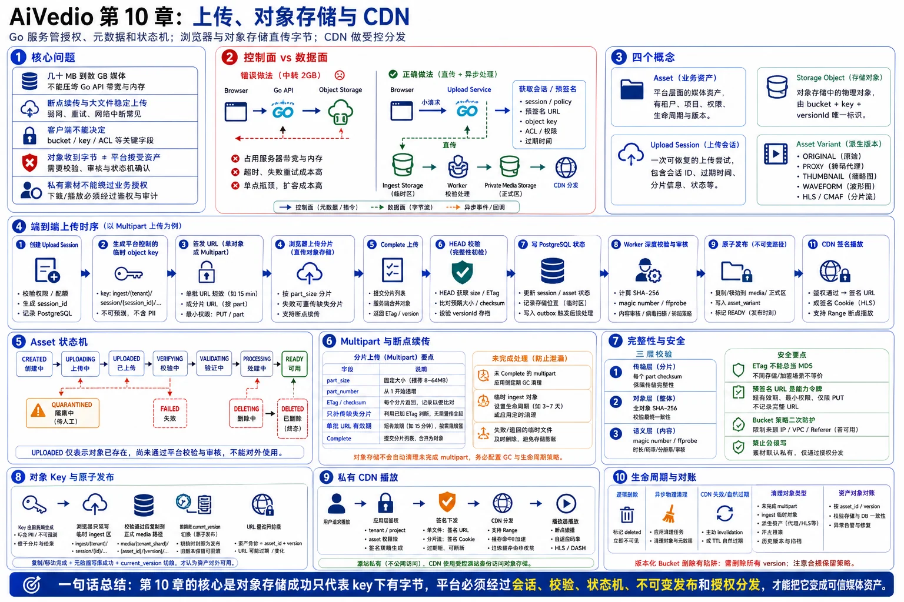

# 第 10 章：上传、对象存储与 CDN



> 图注：本章全文重点总结图，围绕控制面与数据面分离、上传时序、资产状态机、Multipart 断点续传、完整性校验、对象 Key、私有 CDN 和生命周期对账展开。

> **本章主题：大文件上传和媒体资产生命周期。**
>
> 本章以 S3 兼容对象存储和通用 CDN 为例，重点说明预签名上传、分片上传、断点续传、完整性校验、上传会话、媒体探测、多租户隔离、私有分发和生命周期治理。具体云厂商 API 可以替换，但控制面与数据面分离、资产状态机、不可变发布和异步校验这些原则不应改变。

---

## 10.1 本章要解决的核心问题

AI 视频平台面对的不是普通头像上传，而是几十 MB 到数 GB 的图片、音频和视频素材。真正困难的部分不是调用一次 `PutObject`，而是同时保证：

- 大文件不会压垮 Go API 的带宽、连接池、内存和临时磁盘。
- 网络中断后只重传失败分片，不必从头开始。
- 客户端不能自行决定 bucket、对象 key、租户路径和访问权限。
- “对象存储已收到字节”不等于“平台已接受为合法资产”。
- 重复完成、超时重试、事件乱序和服务崩溃不会产生错误资产。
- 原始素材、代理视频、缩略图、波形和 HLS/CMAF 切片能够统一管理。
- 私有素材只能由授权租户访问，CDN 不能绕过业务授权。
- 删除、归档、版本和缓存失效具备可审计、可补偿的生命周期。

一句话概括本章：

> **Go 服务负责授权、元数据和状态机；浏览器与对象存储直接传输字节；异步 Worker 负责验证和派生；CDN 负责受控分发。**

面试时应主动强调：

> **对象存储成功只证明“某个 key 下出现了一组字节”，并不能证明上传者、文件类型、媒体结构、内容安全和业务归属都正确。**

---

## 10.2 控制面与数据面必须分离

### 错误架构

```text
Browser
   │  2 GB video
   ▼
Go API
   │  再上传 2 GB
   ▼
Object Storage
```

这种方案的问题包括：

- 同一份数据经过平台网络两次。
- Go 实例长期占用连接和 goroutine。
- 反向代理、网关、Pod 和临时磁盘都要处理大流量。
- 任意一层超时都会导致用户从头重传。
- 扩容 API 实例并不能经济地解决媒体吞吐问题。
- 上传流量会与创建任务、查询状态、计费等控制面请求互相干扰。

### 推荐架构

```text
                         ┌──────────────────────────┐
                         │       Control Plane      │
                         │                          │
Browser ──小请求────────►│ Go Upload Service        │
   │                     │ - 身份与租户校验         │
   │                     │ - 配额与参数校验         │
   │                     │ - 创建 Upload Session   │
   │                     │ - 生成预签名请求         │
   │                     │ - 完成与状态机           │
   │                     └────────────┬─────────────┘
   │                                  │ metadata/event
   │                                  ▼
   │                          PostgreSQL / MQ
   │
   │  大文件直传
   ▼
Ingest Object Storage ──► Verify / Probe / Moderate Worker
                                   │
                                   │ 校验通过后发布
                                   ▼
                           Private Media Storage
                                   │
                                   ▼
                                  CDN
```

核心边界如下：

| 组件 | 核心职责 | 不应承担的职责 |
|---|---|---|
| Go Upload Service | 鉴权、会话、签名、幂等、状态机、资产元数据 | 中转全部媒体字节 |
| PostgreSQL | 上传会话、资产、对象引用、版本和审计的事实源 | 存储媒体二进制 |
| Ingest Storage | 接收尚未信任的上传字节 | 直接作为 CDN 公网源站 |
| Validation Worker | checksum、magic number、ffprobe、审核、隔离 | 决定用户权限 |
| Media Storage | 保存已发布的原始素材和派生资产 | 接受浏览器任意写入 |
| CDN | Range、缓存、HLS/CMAF 分发、边缘鉴权 | 代替业务层租户授权 |

---

## 10.3 先区分四个容易混淆的概念

### 10.3.1 Asset

`Asset` 是业务资产，例如“用户上传的一段参考视频”。它包含：

- 所属租户、项目和创建者。
- 业务类型，例如 image、video、audio、subtitle。
- 生命周期状态。
- 原始文件名和用户声明信息。
- 服务端验证后的媒体元数据。
- 当前可用版本和访问策略。

### 10.3.2 Storage Object

`Storage Object` 是对象存储中的物理对象，由以下信息定位：

```text
provider
bucket
object_key
version_id（如启用版本）
```

一个 Asset 可以对应多个 Storage Object，例如原始文件、代理视频、缩略图和波形。

### 10.3.3 Upload Session

`Upload Session` 是一次可恢复的上传尝试，负责记录：

- 谁在上传。
- 准备上传到哪个临时 key。
- 单文件还是 multipart。
- 存储供应商返回的 `upload_id`。
- 分片大小、已上传分片和过期时间。
- 预期大小、类型和 checksum。
- 当前会话状态与版本号。

同一个 Asset 可以因为网络失败产生多次 Upload Session，但最终只应绑定一个被接受的源对象版本。

### 10.3.4 Asset Variant

`Asset Variant` 是从源资产派生出的版本，例如：

```text
ORIGINAL
PROXY_720P
THUMBNAIL_320
THUMBNAIL_1280
WAVEFORM_JSON
WAVEFORM_PNG
HLS_MASTER
HLS_RENDITION_720P
CMAF_VIDEO_SEGMENT
CMAF_AUDIO_SEGMENT
```

不要把这些派生物全部塞进 `assets` 表的若干 URL 字段。应使用独立的 `asset_variants` 或 `asset_objects` 表建模。

---

## 10.4 资产与上传会话状态机

### 10.4.1 Asset 状态机

```text
CREATED
   │
   ▼
UPLOADING
   │
   ▼
UPLOADED
   │
   ▼
VERIFYING
   │
   ▼
VALIDATING
   │
   ├──────────────► QUARANTINED
   │
   ▼
PROCESSING
   │
   ▼
READY
   │
   ▼
DELETING ─────────► DELETED

任意非终态 ───────► FAILED
```

各状态的语义必须明确：

| 状态 | 语义 |
|---|---|
| `CREATED` | 已创建业务资产，但还没有可用对象 |
| `UPLOADING` | 至少存在一个活跃上传会话 |
| `UPLOADED` | 存储侧已形成对象，尚未完成可信验证 |
| `VERIFYING` | 正在核对大小、checksum、对象版本和上传会话 |
| `VALIDATING` | 正在做 MIME、magic number、ffprobe、安全扫描和内容审核 |
| `QUARANTINED` | 文件可疑或等待人工处理，禁止进入 CDN |
| `PROCESSING` | 正在生成代理、缩略图、波形或流媒体版本 |
| `READY` | 至少一个允许业务使用的版本已原子发布 |
| `FAILED` | 当前资产不可用，需要重传或人工补偿 |
| `DELETING` | 已对用户隐藏，后台正在删除全部对象和缓存引用 |
| `DELETED` | 业务删除完成；是否保留审计记录由合规策略决定 |

最重要的边界是：

> **`UPLOADED` 不是 `READY`。未经验证的上传对象不能直接进入生成任务或剪辑时间轴。**

### 10.4.2 Upload Session 状态机

```text
INITIATED
   │
   ▼
UPLOADING
   │
   ▼
COMPLETING
   │
   ├──────────────► COMPLETED
   ├──────────────► FAILED
   └──────────────► ABORTED

INITIATED / UPLOADING ──超时──► EXPIRED
```

状态迁移必须通过版本号或条件更新完成，例如：

```sql
UPDATE upload_sessions
SET state = 'COMPLETING', version = version + 1
WHERE id = $1
  AND state IN ('INITIATED', 'UPLOADING')
  AND version = $2;
```

更新行数为 0 时，说明发生了重复请求或并发竞争，调用方应读取最新状态，而不是盲目再次执行外部操作。

---

## 10.5 端到端上传时序

```text
Browser            Upload Service       PostgreSQL       Object Storage       Worker
   │                      │                   │                  │                 │
   │ 1. create session    │                   │                  │                 │
   ├─────────────────────►│ 校验权限/配额      │                  │                 │
   │                      ├──事务────────────►│                  │                 │
   │                      │ 创建 asset/session│                  │                 │
   │                      │◄──────────────────┤                  │                 │
   │                      ├─ create MPU / sign ────────────────►│                 │
   │ 2. session + URLs    │                   │                  │                 │
   │◄─────────────────────┤                   │                  │                 │
   │                      │                   │                  │                 │
   │ 3. upload parts ──────────────────────────────────────────►│                 │
   │◄──────────────────────────────────────── ETag/checksum ────┤                 │
   │                      │                   │                  │                 │
   │ 4. complete(parts)   │                   │                  │                 │
   ├─────────────────────►│ 条件迁移 COMPLETING│                  │                 │
   │                      ├──────────────────►│                  │                 │
   │                      ├─ Complete MPU / Head ──────────────►│                 │
   │                      │◄──────── object metadata ───────────┤                 │
   │                      ├──事务：UPLOADED + Outbox───────────►│                 │
   │ 5. accepted          │                   │                  │                 │
   │◄─────────────────────┤                   │                  │                 │
   │                      │                   │                  │                 │
   │                      │                   │ outbox/event      │                 │
   │                      │                   ├──────────────────────────────────►│
   │                      │                   │                  │ verify/probe    │
   │                      │                   │                  │◄────────────────┤
   │                      │                   │                  │ publish object  │
   │                      │                   │◄──────────────────────────────────┤
   │                      │                   │ asset READY       │                 │
```

完整流程如下：

1. 客户端提交文件名、大小、声明类型、用途和可选 checksum。
2. 服务端完成身份、租户、项目权限、套餐配额和文件上限校验。
3. 服务端生成 `asset_id`、`upload_session_id` 和平台控制的临时对象 key。
4. 根据文件大小、终端能力和存储限制选择单对象上传或 multipart。
5. 浏览器直接向 Ingest Storage 上传字节。
6. 客户端提交分片号、ETag 和 checksum 列表，请求完成上传。
7. 服务端完成 multipart，并通过 `HEAD` 或等价 API 读取真实对象元数据。
8. 服务端将 Asset 更新为 `UPLOADED`，同时写入 Outbox。
9. Worker 做 checksum、格式、媒体结构和内容验证。
10. 校验通过后，将对象发布到不可变媒体路径，并生成派生资产。
11. 数据库切换当前版本指针，Asset 进入 `READY`。
12. 客户端通过任务状态、SSE 或轮询获知资产可用。

这里应采用三种互补触发方式：

- 客户端 `complete` 请求：低延迟主路径。
- 对象存储事件：补充信号。
- 定时 Reconciler：最终兜底。

不能只依赖对象存储事件。以 Amazon S3 为例，其事件通知按至少一次语义设计，可能重复，也不保证事件顺序，因此消费端必须去重并容忍乱序。[5]

---

## 10.6 Upload Session API 设计

### 10.6.1 创建上传会话

```http
POST /v1/upload-sessions
Idempotency-Key: 01J...
Content-Type: application/json
```

```json
{
  "project_id": "prj_123",
  "asset_kind": "VIDEO",
  "purpose": "GENERATION_REFERENCE",
  "filename": "reference.mov",
  "size_bytes": 2147483648,
  "declared_content_type": "video/quicktime",
  "checksum": {
    "algorithm": "SHA256",
    "value": "base64-or-hex"
  }
}
```

响应示例：

```json
{
  "asset_id": "ast_123",
  "upload_session_id": "upl_123",
  "upload_mode": "MULTIPART",
  "part_size_bytes": 33554432,
  "max_concurrency": 4,
  "expires_at": "2026-06-24T08:30:00Z",
  "parts_sign_endpoint": "/v1/upload-sessions/upl_123/parts:sign"
}
```

创建接口需要满足：

- `Idempotency-Key` 在租户内唯一。
- 同一幂等键重复请求返回同一 Asset 和 Session。
- 客户端不能提交 bucket 和 object key。
- 文件名只作为展示元数据，不参与最终 key 拼接。
- 配额校验同时考虑“已占用存储”和“在途上传预留”。
- 对超大文件应在签名前拒绝，而不是上传完成后才发现超限。

### 10.6.2 批量签发分片 URL

```http
POST /v1/upload-sessions/{session_id}/parts:sign
```

```json
{
  "part_numbers": [1, 2, 3, 4]
}
```

一次签发一小批 URL，而不是创建会话时签出全部 10,000 个分片。这样可以：

- 减少响应体和签名 CPU。
- 缩短每批 URL 的有效期。
- 便于暂停、恢复和动态并发。
- 避免用户拿到长期有效的大量能力令牌。

### 10.6.3 查询上传状态

```http
GET /v1/upload-sessions/{session_id}
```

返回：

- 会话状态。
- 分片大小。
- 已确认分片号。
- 过期时间。
- 是否允许继续签发。
- 最近错误。

服务端可以通过数据库记录与存储侧 `ListParts` 做对账。客户端本地记录只能用于加速恢复，不能作为事实源。

### 10.6.4 完成上传

```http
POST /v1/upload-sessions/{session_id}:complete
Idempotency-Key: 01J...
```

```json
{
  "parts": [
    {"part_number": 1, "etag": "...", "checksum": "..."},
    {"part_number": 2, "etag": "...", "checksum": "..."}
  ]
}
```

服务端必须验证：

- Session 属于当前租户和用户可访问项目。
- 状态允许完成。
- 分片号无重复、范围合法、顺序可归一化。
- 非末尾分片大小满足存储限制。
- 分片总大小与声明大小相符。
- `CompleteMultipartUpload` 返回的对象 key 与会话绑定 key 完全一致。
- `HEAD` 得到的对象大小、checksum、加密和版本信息符合预期。

### 10.6.5 取消上传

```http
POST /v1/upload-sessions/{session_id}:abort
```

取消操作需要幂等。如果存储侧已经完成对象，而本地仍显示 `UPLOADING`，不能简单把 Asset 标成 `ABORTED`；应先检查对象是否存在，再根据完成与取消的竞态规则决定保留、隔离或删除。

---

## 10.7 单对象上传与 Multipart 的选择

### 10.7.1 选择原则

| 场景 | 推荐方式 |
|---|---|
| 小图片、小音频、短字幕 | 单对象预签名 PUT/POST |
| 大视频、弱网络、移动端 | Multipart |
| 需要暂停、恢复、并行传输 | Multipart |
| 服务端内部已知长度的稳定网络流 | SDK Upload Manager |

不要把阈值写死在前端。服务端应根据以下信息返回上传策略：

- 文件大小。
- 存储供应商限制。
- Web、桌面端或移动端。
- 当前网络类型。
- 租户套餐和单文件上限。
- 平台期望的分片数量和并发。

以 Amazon S3 为例，multipart 最多 10,000 个 part，普通 part 大小至少 5 MiB，最后一个 part 可以更小。[2][3]

### 10.7.2 分片大小算法

应保留一部分 part 编号余量，不要正好用满 10,000：

```text
max_parts      = 9500
minimum_part   = 存储供应商最小 part 大小
preferred_part = 平台默认值，例如 16 MiB 或 32 MiB

part_size = align_up(
    max(preferred_part, ceil(file_size / max_parts)),
    1 MiB
)
```

示例：

```text
文件大小：20 GiB
默认 part：32 MiB
预计 part 数：640
```

这是合理规模。若文件极大，算法会自动增大 part，而不是上传到第 10,001 个分片才失败。

### 10.7.3 并发控制

浏览器分片并发不是越高越好。建议由服务端给出上限，客户端再按网络动态调整：

- 桌面宽带可从 4 个并发开始。
- 移动网络可从 2～3 个开始。
- 连续成功且吞吐仍上升时小幅增加。
- 出现 429、5xx、超时或明显丢包时降低并发。
- 单分片使用指数退避和随机抖动。
- 设置单分片最大重试次数和会话总失败阈值。

并发过高会增加：

- 浏览器内存占用。
- TCP/TLS 连接竞争。
- 移动端耗电。
- NAT 和代理压力。
- 对象存储限流概率。

### 10.7.4 断点续传

断点续传需要稳定保留：

```text
upload_session_id
provider_upload_id
object_key
part_size
part_number -> ETag/checksum/size
expires_at
```

客户端恢复时：

1. 从 IndexedDB 或本地数据库读出会话 ID。
2. 调用平台查询会话。
3. 平台从数据库和存储侧读取已存在 part。
4. 客户端只补传缺失分片。
5. 完成时提交服务端认可的 part 列表。

同一 part number 再次上传通常会覆盖该 part，因此每次恢复必须保持相同切片边界，不能随意改变 `part_size`。[13]

### 10.7.5 清理未完成分片

Multipart 初始化后，已上传分片会持续占用存储，直到完成或主动 abort。必须同时具备：

- 应用层 Session 过期任务。
- 存储侧自动清理未完成 multipart 的生命周期规则。
- 定期统计“未完成 multipart 字节数”和最老年龄。

对象存储官方文档也建议配置生命周期规则，自动终止超过指定天数的未完成 multipart，以避免长期计费。[6]

---

## 10.8 Checksum：不要把 ETag 当成完整文件哈希

完整性校验至少分三层：

### 10.8.1 传输层完整性

用于判断某次 part 传输是否损坏，可使用存储支持的 CRC、SHA 或其他 checksum。

### 10.8.2 整体对象完整性

用于确认最终对象与客户端准备上传的文件一致，建议保存：

```text
checksum_algorithm
checksum_value
checksum_scope = FULL_OBJECT
```

平台可使用 SHA-256 作为跨存储供应商、跨生命周期的稳定资产指纹。

### 10.8.3 语义完整性

即使 SHA-256 完全一致，文件仍可能是：

- 伪造扩展名。
- 损坏容器。
- 缺失索引。
- 超长、超分辨率或不支持编码。
- 恶意构造的媒体文件。

因此 checksum 不能替代 magic number 和 ffprobe。

### 10.8.4 ETag 的正确理解

不要写出以下逻辑：

```text
if ETag == MD5(file) {
    upload is valid
}
```

Multipart 对象的 ETag 通常不是完整对象的 MD5；启用某些加密方式时也不能把 ETag 当作内容哈希。应使用对象存储提供的显式 checksum 字段，或由平台独立计算完整文件哈希。[4]

### 10.8.5 去重的安全边界

可以基于 SHA-256 做存储去重，但要注意：

- 不要通过“秒传成功”向一个租户泄露另一个租户是否拥有某文件。
- 去重决策应发生在授权之后。
- 默认优先租户内去重。
- 跨租户物理去重时，逻辑 ACL 和引用计数必须完全隔离。
- 删除一个 Asset 不能直接删除仍被其他 Asset 引用的物理对象。

---

## 10.9 预签名上传的安全设计

预签名 URL 本质上是一个限时能力令牌。持有者在有效期内可以执行签名中允许的操作。以 S3 为例，预签名 URL 使用签发者的权限，并且同一个 URL 在过期前可被多次使用。[1]

因此必须遵守以下规则。

### 10.9.1 后端控制 key

禁止客户端直接提交：

```text
bucket
object_key
tenant_prefix
acl
storage_class
kms_key
```

服务端应生成不可预测、不可枚举的临时 key。

### 10.9.2 浏览器只写 Ingest 区

推荐：

```text
Browser
  └── PUT/Multipart ──► ingest-private/{session_id}/payload

Validation Worker
  └── verify + server-side copy ──► media-private/{asset_id}/{version}/original
```

不要给浏览器签发最终 CDN 源站路径的写权限。这样可以避免：

- 未审核内容被直接播放。
- 单对象预签名 URL 被重复使用并覆盖已发布资产。
- 用户猜测其他租户对象路径。
- 上传者设置任意对象 metadata 或 ACL。

对于单对象 PUT，URL 在有效期内可能重复覆盖同一临时 key。将临时对象校验后复制到新的不可变最终 key，可以把发布资产与可重用上传能力隔离开。

### 10.9.3 缩短有效期并支持续签

- 单批 part URL 只需要覆盖当前一轮上传时间。
- 大文件不要依赖一个持续数小时的单 URL。
- URL 过期时，根据 Session 状态重新签发尚未完成的 part。
- 可使用存储策略限制签名年龄；例如 S3 支持通过 `s3:signatureAge` 进一步限制预签名请求的最大年龄。[12]

### 10.9.4 最小权限

签名服务使用的云身份只应拥有必要能力：

- 指定 ingest bucket/prefix 的上传权限。
- multipart 创建、上传 part、列出 part、完成和 abort。
- 不允许读取其他租户对象。
- 不允许写入 published media prefix。
- 不允许设置 public ACL。

### 10.9.5 限制请求条件

根据存储实现，可将以下条件纳入签名或上传策略：

- 固定 object key。
- 固定 HTTP 方法。
- 固定或允许集合内的 Content-Type。
- 允许的内容长度范围。
- 指定 checksum 算法和请求头。
- 指定服务端加密方式。

即使签名层限制了声明值，完成后仍要以 `HEAD` 和实际媒体探测结果为准。

### 10.9.6 不记录完整签名 URL

签名 URL 含有可直接使用的凭据参数，不应进入：

- 普通业务日志。
- 错误追踪明文标签。
- Analytics 事件。
- 前端埋点。
- Referer 可外泄的页面链接。

日志只保留：

```text
session_id
asset_id
bucket_alias
object_key_hash
part_number
expires_at
request_id
```

---

## 10.10 上传完成不是一个简单的数据库事务

一个典型故障是：

```text
对象存储 CompleteMultipartUpload 已成功
        ↓
Go 服务在写 PostgreSQL 前崩溃
        ↓
客户端重试 complete
        ↓
存储返回 upload_id 不存在
```

如果把“upload_id 不存在”直接解释成失败，就会把一个真实存在的完整对象错误标成失败。

### 推荐完成算法

```text
1. 短事务读取 Session，校验租户和状态。
2. CAS 将状态改为 COMPLETING，并记录 operation_token/lease。
3. 提交事务。
4. 调用对象存储 CompleteMultipartUpload。
5. 调用 HEAD 获取对象大小、checksum、version_id。
6. 短事务写入 Storage Object、Session=COMPLETED、Asset=UPLOADED、Outbox。
```

若第 4 步成功、第 6 步前崩溃，重试时：

```text
A. 先读取 Session 和 operation_token。
B. 再 HEAD 固定的临时 object key。
C. 若对象存在且元数据符合预期，则按“外部已成功”继续本地收敛。
D. 若对象不存在且 upload_id 仍存在，则重新执行 complete。
E. 若两者都不存在，才进入 FAILED 或人工补偿。
```

不要在持有数据库行锁的事务中等待对象存储网络调用。外部调用可能耗时或超时，会造成长事务和连接池占用。

### Go 伪代码

```go
type ObjectStore interface {
    CompleteMultipart(ctx context.Context, req CompleteMultipartRequest) error
    HeadObject(ctx context.Context, bucket, key string) (ObjectMetadata, error)
    AbortMultipart(ctx context.Context, bucket, key, uploadID string) error
}

func (s *UploadService) Complete(ctx context.Context, cmd CompleteCommand) (*Asset, error) {
    session, err := s.repo.BeginCompleting(ctx, cmd.SessionID, cmd.TenantID, cmd.Parts)
    if err != nil {
        return nil, err
    }

    if session.State == "COMPLETED" {
        return s.repo.GetAsset(ctx, session.AssetID)
    }

    err = s.store.CompleteMultipart(ctx, CompleteMultipartRequest{
        Bucket:   session.Bucket,
        Key:      session.ObjectKey,
        UploadID: session.ProviderUploadID,
        Parts:    cmd.Parts,
    })
    if err != nil && !isPossiblyAlreadyCompleted(err) {
        return nil, err
    }

    meta, err := s.store.HeadObject(ctx, session.Bucket, session.ObjectKey)
    if err != nil {
        return nil, err
    }
    if err := verifyExpectedObject(session, meta); err != nil {
        return nil, err
    }

    return s.repo.FinalizeUploadedWithOutbox(ctx, session, meta)
}
```

这段代码的重点不是具体 SDK，而是：

- 外部完成操作与本地事务分离。
- 用固定 key 和 `HEAD` 解决结果未知。
- 本地最终写入必须幂等。
- Outbox 与资产状态同事务提交。

---

## 10.11 MIME、Magic Number 与 ffprobe

客户端提供的以下信息全部不可信：

```text
filename
extension
Content-Type
duration
resolution
codec
frame_rate
```

验证流程建议分层执行。

### 第一层：对象级检查

- 对象是否存在。
- 实际大小是否等于预期。
- 是否超过租户和业务上限。
- checksum 是否一致。
- 是否采用要求的服务端加密。
- 对象是否位于当前 Session 的 ingest key。

### 第二层：文件类型检查

- 根据文件头和容器结构识别真实类型。
- 声明 MIME 与检测 MIME 不一致时按策略拒绝或修正。
- 不依赖扩展名。
- 禁止可执行文件、脚本和不允许的压缩容器。

### 第三层：媒体探测

在隔离的 Media Probe Worker 中执行 ffprobe 或等价探测，提取：

```text
container
video_codec
video_profile
width
height
pixel_format
frame_rate
video_bitrate
duration
time_base
rotation
color_primaries
color_transfer
has_audio
audio_codec
sample_rate
channels
```

必须设置：

- 最大运行时间。
- 最大内存和 CPU。
- 最大输入字节数。
- 临时磁盘配额。
- 禁止不必要的网络访问。
- 只通过参数数组启动进程，不拼接 shell 命令。

### 第四层：业务约束

例如生成参考视频可能要求：

```text
时长 <= 30 秒
分辨率 <= 4K
至少包含一个视频流
允许的编码为 H.264/H.265/VP9/AV1 中的子集
帧率处于平台支持范围
不允许损坏时间戳或极端可变帧率
```

### 第五层：内容安全

- 恶意文件扫描。
- 输入内容审核。
- 人脸、肖像、版权或企业策略检查。
- 可疑文件进入 `QUARANTINED`，而不是直接删除证据。

验证完成后，服务端应保存“检测结果”，不要继续沿用客户端声明值。

---

## 10.12 对象 Key 设计

### 10.12.1 不要使用原始文件名作为 key

错误示例：

```text
uploads/alice/客户机密视频 final v8.mov
```

问题包括：

- 暴露个人信息和业务信息。
- Unicode、转义、斜杠和特殊字符处理复杂。
- 同名覆盖。
- CDN 日志和监控系统泄露文件名。
- 用户可尝试构造路径语义。

### 10.12.2 推荐 key 结构

临时上传区：

```text
ingest/{tenant_shard}/{upload_session_id}/payload
```

已发布原始素材：

```text
media/{tenant_shard}/{asset_id}/source/{source_version}/original
```

代理视频：

```text
media/{tenant_shard}/{asset_id}/proxy/{profile_version}/720p.mp4
```

缩略图：

```text
media/{tenant_shard}/{asset_id}/thumbnail/{profile_version}/000001.jpg
```

波形：

```text
media/{tenant_shard}/{asset_id}/waveform/{profile_version}/waveform.json
```

HLS/CMAF：

```text
media/{tenant_shard}/{asset_id}/stream/{stream_version}/master.m3u8
media/{tenant_shard}/{asset_id}/stream/{stream_version}/video/720p/init.mp4
media/{tenant_shard}/{asset_id}/stream/{stream_version}/video/720p/seg_000001.m4s
```

### 10.12.3 Key 设计原则

- key 由服务端生成。
- 使用不可变版本路径，禁止原地覆盖已发布对象。
- 文件名只存数据库展示字段。
- key 中不放邮箱、手机号、提示词和项目名称。
- 对象扩展名只用于兼容和调试，不能作为类型事实。
- 每个派生配置带 `profile_version`，便于重新处理和灰度切换。
- 数据库保存 bucket、key、version_id 和 checksum，不只保存完整 URL。
- URL 是访问结果，不是资产身份。

### 10.12.4 原子发布

对象存储通常没有传统文件系统的 rename。发布一个新版本时，应采用：

```text
1. 在新版本前缀下写完所有对象。
2. 校验对象数量、大小和 checksum。
3. 最后写 manifest，或确认 manifest 已完整引用所有 segment。
4. 数据库事务切换 asset.current_version。
5. CDN URL 使用不可变 version 路径。
```

对业务而言，数据库当前版本指针的切换才是“发布时刻”。不要让客户端通过列举 bucket 猜测哪些对象已经准备好。

---

## 10.13 数据模型

### 10.13.1 assets

```text
id
 tenant_id
project_id
creator_user_id
kind
purpose
state
original_filename
declared_content_type
detected_content_type
size_bytes
sha256
duration_ms
width
height
frame_rate_num
frame_rate_den
current_source_object_id
current_ready_revision
moderation_state
failure_code
failure_message
retention_policy_id
version
created_at
updated_at
deleted_at
```

### 10.13.2 upload_sessions

```text
id
 tenant_id
asset_id
idempotency_key
mode                    -- SINGLE / MULTIPART
state
storage_provider
ingest_bucket
ingest_object_key
provider_upload_id
expected_size_bytes
declared_content_type
checksum_algorithm
expected_checksum
part_size_bytes
expected_part_count
expires_at
operation_token
version
created_at
updated_at
completed_at
```

关键约束：

```text
UNIQUE(tenant_id, idempotency_key)
UNIQUE(storage_provider, ingest_bucket, ingest_object_key)
```

可增加 partial unique index，限制一个 Asset 同时只有一个活跃 Session：

```sql
CREATE UNIQUE INDEX ux_one_active_upload_per_asset
ON upload_sessions(asset_id)
WHERE state IN ('INITIATED', 'UPLOADING', 'COMPLETING');
```

### 10.13.3 upload_parts

```text
upload_session_id
part_number
etag
checksum_algorithm
checksum_value
size_bytes
state
uploaded_at
```

约束：

```text
PRIMARY KEY(upload_session_id, part_number)
```

大规模场景下，可以只保存客户端提交的最终 part 列表和关键审计信息，已上传进度以存储侧 `ListParts` 为事实，避免对每个 part 产生过多数据库写放大。是否持久化每个 part，应根据审计要求和上传规模决定。

### 10.13.4 asset_objects

```text
id
 tenant_id
asset_id
role                    -- ORIGINAL / PROXY / THUMBNAIL / ...
revision
storage_provider
bucket
object_key
object_version_id
size_bytes
checksum_algorithm
checksum_value
content_type
cache_control
status
created_at
deleted_at
```

关键约束：

```text
UNIQUE(storage_provider, bucket, object_key, object_version_id)
UNIQUE(asset_id, role, revision, object_key)
```

数据库事实源中保存对象定位信息，而不是把临时签名 URL 永久存储到表里。

---

## 10.14 多租户 ACL 与对象存储权限

### 10.14.1 Key 前缀不是授权机制

即使 key 中包含 `tenant_id`，也不能仅凭路径判断调用者有权访问。正确流程是：

```text
用户身份
   ↓
应用层检查 tenant/project/asset 权限
   ↓
生成 CDN 签名 URL、签名 Cookie 或短期下载 URL
```

### 10.14.2 Bucket 默认私有

推荐：

- 开启阻止公共访问。
- 禁止对象级 public ACL。
- 浏览器只能写 ingest prefix。
- Media Worker 才能读 ingest 和写 published media。
- CDN 通过专用源站身份访问私有 media bucket。
- 普通用户不能直接访问对象存储源站地址。

CloudFront 等 CDN 支持使用源站访问控制，使私有 S3 源站只接受 CDN 的受信请求；AWS 当前建议优先使用 OAC 而不是旧的 OAI。[9]

### 10.14.3 加密

至少启用服务端静态加密。对高合规租户可以进一步考虑：

- 客户管理密钥。
- 租户级或数据域级 KMS key。
- 密钥轮换。
- 加密上下文。
- 跨区域复制时的密钥授权。

不要允许浏览器自行选择任意 KMS key 或关闭加密。

### 10.14.4 审计

对以下操作保留审计事件：

```text
UPLOAD_SESSION_CREATED
UPLOAD_PARTS_SIGNED
UPLOAD_COMPLETED
UPLOAD_ABORTED
ASSET_QUARANTINED
ASSET_PUBLISHED
DOWNLOAD_AUTHORIZED
ASSET_DELETE_REQUESTED
OBJECT_DELETE_CONFIRMED
```

签名 URL 本身不写日志，但应记录签发对象、请求者、有效期、用途和策略版本。

---

## 10.15 CDN：签名 URL、签名 Cookie、Range、HLS 与 CMAF

### 10.15.1 原始素材与代理素材分离

前端预览通常不应直接播放原始 4K/高码率素材。推荐：

- 原始素材用于最终渲染、重新处理和下载。
- 代理 MP4 用于简单预览和时间轴拖动。
- HLS/CMAF 用于长视频、自适应码率和多清晰度播放。
- 缩略图和波形用于编辑器快速加载。

### 10.15.2 签名 URL 与签名 Cookie 的选择

| 场景 | 推荐 |
|---|---|
| 下载单个原始文件 | 签名 URL |
| 查看单张缩略图 | 签名 URL 或应用授权后的 CDN URL |
| 播放一个 MP4 | 签名 URL |
| HLS/DASH/CMAF，需请求 manifest、init、segment | 签名 Cookie |
| 允许访问某个受限目录下的一组文件 | 签名 Cookie 或通配资源策略 |

签名 URL 和签名 Cookie 都可控制私有内容访问；当一个播放会话需要请求大量 HLS/CMAF 文件时，签名 Cookie 可以避免为每个 segment 单独生成签名 URL。[7][8]

### 10.15.3 播放授权流程

```text
Browser ──► Playback API
             │
             ├── 校验 tenant/project/asset 权限
             ├── 校验 Asset=READY
             ├── 生成短期播放策略
             └── 返回 signed URL 或 Set-Cookie

Browser ──► CDN ──► Private Media Origin
```

应处理播放中凭据续期：

- 播放策略有效期应覆盖正常播放窗口。
- 前端在过期前刷新，而不是等到 segment 403 后再处理。
- 新旧 Cookie 可短暂重叠，避免切换瞬间失败。
- 不要把长期业务 JWT 直接放进媒体 URL 查询参数。

### 10.15.4 Range 请求

浏览器播放和拖动大 MP4 时通常依赖 HTTP byte-range。服务端或 CDN 应正确支持：

```text
Range: bytes=start-end
206 Partial Content
Content-Range
Accept-Ranges: bytes
```

HTTP Range 允许客户端只获取对象的一部分；CloudFront 在源站支持 Range 时可以返回并缓存对应范围。[10][11]

同时应将 MP4 处理为 fast start，使关键索引位于文件前部，否则浏览器可能需要先读取文件尾部才能开始播放。

### 10.15.5 HLS 与 CMAF

HLS 使用 manifest 描述媒体切片，客户端按需获取 segment；RFC 8216 定义了其基本传输与播放列表语义。[14]

在平台中应注意：

- master manifest、variant manifest、init segment 和 media segment 属于同一资产版本。
- 不可混用不同转码版本的 manifest 和 segment。
- 先写完 segment，再发布引用它们的 manifest。
- 对不可变 segment 设置长缓存。
- manifest 的缓存时间按更新需求设置；点播成品也可使用不可变版本路径。
- CDN 鉴权策略必须覆盖整个流媒体前缀。
- 音频与视频切片的时间轴需要一致，避免编辑预览音画漂移。

### 10.15.6 Cache-Control 和版本化 URL

推荐使用不可变版本路径：

```text
/media/{asset_id}/stream/{stream_version}/...
```

对于已经发布且永不原地覆盖的对象，可设置较长缓存并使用：

```text
Cache-Control: public, max-age=..., immutable
```

私有内容中的 `public` 是否合适取决于 CDN 和共享缓存策略；关键是 CDN 边缘可缓存但源站保持私有，并由边缘鉴权控制访问。不要因为需要更新内容就覆盖同一 key，而应生成新版本并切换数据库指针。

### 10.15.7 CORS

浏览器直传和媒体播放通常跨域，需要配置 CORS。配置应最小化：

- `AllowedOrigins` 只允许正式站点和受控开发域名。
- `AllowedMethods` 区分上传和下载 bucket。
- 仅允许必需请求头。
- 暴露前端需要读取的 ETag、checksum 或 request ID 响应头。
- 不要把 `*` 当作默认生产配置。

对象存储会根据 Origin、方法和请求头匹配 CORS 规则，因此签名正确但 CORS 不匹配时，浏览器仍可能失败。[15]

---

## 10.16 生命周期、归档与删除

### 10.16.1 对象分类

建议按用途制定不同生命周期：

| 类型 | 示例策略 |
|---|---|
| 未完成 multipart | 数天后自动 abort |
| Ingest 临时对象 | 校验完成或失败后尽快删除；另设兜底过期 |
| 处理中间文件 | 数小时或数天后删除 |
| 原始素材 | 按项目活跃度和套餐保留 |
| 代理视频、缩略图、波形 | 跟随 Asset；可按需重建 |
| 旧版本流媒体 | 新版本稳定后延迟清理 |
| 审计和合规留存 | 按法律与合同策略处理 |

生命周期规则不能替代业务删除工作流。它是存储层兜底和成本治理工具。

### 10.16.2 逻辑删除与物理删除

推荐流程：

```text
1. 权限校验和引用检查。
2. Asset 状态改为 DELETING，并立即停止签发新访问凭据。
3. 写入 AssetDeleteRequested Outbox。
4. Worker 删除所有 variant、source、ingest 残留和索引。
5. 处理 CDN 紧急失效需求。
6. 对账确认对象不存在或进入合规保留。
7. Asset 状态改为 DELETED。
```

对于正常删除，若 URL 不可变且访问需要短期签名，通常可以等待边缘对象自然过期；涉及安全事件或法律删除时，应执行 CDN invalidation、密钥策略收紧或其他紧急撤销措施。

### 10.16.3 版本化 Bucket 的删除陷阱

启用对象版本后，普通 DELETE 可能只创建 delete marker，旧版本仍占用存储。要实现真正物理删除，需要处理：

- 当前版本。
- 非当前版本。
- delete marker。
- 未完成 multipart。

S3 文档明确区分 delete marker 与真实版本删除，因此合规删除不能只检查“默认 GET 返回 404”。[16]

### 10.16.4 引用计数

一个原始对象可能被多个项目版本或剪辑引用。删除 Asset 前需要决定：

- 是否允许删除仍被项目引用的素材。
- 删除后历史项目能否回放。
- 采用强引用阻止删除，还是保留快照。
- 跨 Asset 去重对象的引用计数何时归零。

引用计数更新必须与业务引用变更保持事务一致，物理删除则异步执行并可重试。

---

## 10.17 典型竞态与处理方式

### 竞态一：两个浏览器标签同时完成同一 Session

处理：

- `COMPLETING` 状态 CAS。
- 只有一个请求获得 operation token。
- 其他请求读取最终状态并返回同一 Asset。

### 竞态二：取消与完成同时发生

处理：

- 定义明确优先级。
- 若已进入 `COMPLETING`，取消请求只记录 cancel intent，不立即假定对象不存在。
- 完成后可将对象转入删除或隔离流程。

### 竞态三：单对象 PUT 完成后 URL 被再次使用

处理：

- URL 只写临时 ingest key。
- 短 TTL。
- 最终资产复制到新的不可变 key。
- 可启用版本并绑定精确 version_id 作为额外审计依据。

### 竞态四：对象事件先于数据库提交到达

处理：

- 事件处理器按 bucket/key 查 Session。
- 未找到时做短延迟重试。
- 仍未找到则写入 unmatched event 表，交 Reconciler 处理。
- 不因一条早到事件创建未知租户资产。

### 竞态五：数据库显示完成但对象被人工删除

处理：

- 定期资产—对象对账。
- 播放 404 告警关联 asset_id 和 object key。
- 从副本恢复、重新生成派生物或将 Asset 标为损坏。

---

## 10.18 故障场景推演

| 场景 | 发现方式 | 正确处理 |
|---|---|---|
| Part URL 过期 | 客户端 403、签名过期码 | 查询 Session，仅续签缺失 part |
| 单个 part 5xx | part 重试指标 | 指数退避和 jitter，不重传其他 part |
| 客户端 complete 响应丢失 | 客户端超时重试 | 幂等读取状态；HEAD 收敛外部已成功结果 |
| 存储 complete 成功、本地写库失败 | Session 长时间 `COMPLETING` | Reconciler HEAD 固定 key 后补写状态与 Outbox |
| 对象事件重复 | 相同事件或对象版本重复出现 | Inbox/唯一约束去重，状态迁移幂等 |
| 对象事件乱序 | 删除事件先于创建事件消费 | 使用对象版本、事件版本和当前状态判断，不回退状态 |
| checksum 不一致 | 完成后校验失败 | `QUARANTINED/FAILED`，禁止发布，删除或保留证据 |
| 文件扩展名与真实类型不符 | magic/ffprobe | 按策略拒绝或纠正，不信任扩展名 |
| ffprobe 卡死或资源爆炸 | Worker 超时、CPU/内存告警 | 沙箱终止任务，文件隔离 |
| 大量 abandoned multipart | 最老 Session、未完成字节指标 | Session GC + 存储生命周期 abort |
| 越权下载 | 授权日志、CDN 403 | 应用层先鉴权，缩短签名，检查租户关联 |
| CDN Cookie 播放中到期 | segment 403、播放器错误 | 过期前刷新并提供短暂重叠窗口 |
| 删除后旧版本仍计费 | 版本对象和 delete marker 指标 | 删除所有版本并对账，不只写 delete marker |

---

## 10.19 可观测性与容量指标

### 10.19.1 上传指标

```text
upload_session_created_total
upload_session_completed_total
upload_session_failed_total
upload_session_expired_total
upload_bytes_total
upload_active_sessions
upload_part_retry_total
upload_part_latency
upload_complete_latency
upload_resume_rate
checksum_mismatch_total
```

### 10.19.2 资产处理指标

```text
asset_verification_lag
asset_validation_latency
asset_quarantined_total
asset_ready_latency
ffprobe_failure_total
orphan_object_count
orphan_object_bytes
missing_object_count
```

### 10.19.3 存储与 CDN 指标

```text
incomplete_multipart_count
incomplete_multipart_bytes
storage_bytes_by_role
storage_bytes_by_tenant
cdn_cache_hit_ratio
cdn_origin_bytes
cdn_viewer_bytes
cdn_4xx_rate
cdn_5xx_rate
cdn_range_request_ratio
signed_auth_failure_total
```

### 10.19.4 容量估算

每日新增存储量可粗略估算为：

```text
每日上传文件数 × 平均原始文件大小
+ 代理视频膨胀量
+ 缩略图和波形
+ HLS/CMAF 多码率版本
- 生命周期删除量
```

CDN 源站流量可粗略估算为：

```text
用户播放流量 × (1 - CDN 命中率)
```

需要按对象角色统计，而不是只看 bucket 总容量，否则无法判断成本来自原始素材、代理、多码率切片还是废弃 multipart。

### 10.19.5 核心告警

- `COMPLETING` 超过阈值。
- `UPLOADED` 长时间未进入验证。
- 最老未完成 multipart 超龄。
- checksum mismatch 突增。
- ffprobe 超时率升高。
- orphan object bytes 持续增长。
- CDN 命中率显著下降。
- 源站 403/404/5xx 突增。
- 单租户上传字节或并发异常。

---

## 10.20 面试高频追问

### 问题一：为什么不让文件经过 Go API？

参考回答：

> 我们把控制面和数据面分离。Go 服务只做鉴权、配额、上传会话、预签名和状态机，浏览器用短期预签名 URL 直接上传对象存储。这样避免双倍带宽、长连接、内存和临时盘压力。上传完成后也不会直接把对象当成可用资产，而是经过 checksum、magic number、ffprobe 和内容审核，再原子发布到私有媒体区。

### 问题二：断点续传怎样实现？

参考回答：

> 大文件使用 multipart。服务端保存 upload session、provider upload ID、固定 part size 和过期时间；客户端保存已完成 part 的 ETag。恢复时由服务端结合数据库与对象存储 ListParts 返回真实进度，客户端只补传缺失分片。完成请求幂等，未完成 multipart 通过应用层 GC 和存储生命周期双重清理。

### 问题三：ETag 能否作为 MD5？

参考回答：

> 不能一概而论。Multipart 对象的 ETag 通常不是完整文件 MD5，加密模式也会影响其含义。我们使用显式 checksum 字段或独立 SHA-256 做全对象完整性，ETag 主要用于 multipart 完成时标识 part。

### 问题四：预签名 URL 泄露怎么办？

参考回答：

> 预签名 URL 是 bearer capability，所以必须短有效期、最小权限、固定 key 和操作，不记录完整 URL。浏览器只写隔离的 ingest key，不能写最终媒体路径。校验通过后由服务端复制到新的不可变 key。CDN 源站保持私有，播放前仍由应用层做租户和资产权限检查。

### 问题五：对象存储完成成功但本地超时怎么办？

参考回答：

> 不能直接重做并假定第一次失败。我们把 Session 先 CAS 到 COMPLETING，外部完成后再 HEAD 固定 object key。如果服务崩溃，重试或 Reconciler 通过对象是否存在、大小和 checksum 判断外部是否已经成功，再补写 PostgreSQL 和 Outbox，实现最终收敛。

### 问题六：签名 URL 和签名 Cookie 如何选？

参考回答：

> 单文件下载或 MP4 播放适合签名 URL；HLS/CMAF 会请求 manifest、init 和大量 segment，更适合签名 Cookie 或目录级资源策略，避免为每个 segment 生成独立 URL。无论哪种方式，都先经过业务层鉴权，CDN 只执行短期访问策略。

---

## 10.21 30 秒章节总结

> 上传系统采用控制面和数据面分离。客户端先调用 Go 服务创建幂等 Upload Session，服务端校验权限、配额和文件上限，并生成平台控制的 ingest key。小文件使用预签名单对象上传，大文件使用 multipart、固定分片大小、有限并发和断点续传。完成时不能信任客户端，也不能把 ETag 当作完整文件 MD5；服务端需要通过 HEAD、显式 checksum、magic number 和 ffprobe 校验。未经验证的对象只存在隔离区，校验通过后由 Worker 发布到不可变媒体路径，并生成代理、缩略图、波形和 HLS/CMAF。对象存储和 CDN 都保持私有，单文件使用签名 URL，多文件流媒体使用签名 Cookie。删除采用先逻辑隐藏、再异步物理清理和对账的方式，同时处理未完成 multipart、对象版本和 CDN 缓存。

---

## 10.22 本章检查清单

### 上传入口

- [ ] 浏览器是否直接上传对象存储？
- [ ] Go API 是否只处理元数据和签名？
- [ ] 是否限制单文件大小、租户在途字节和并发 Session？
- [ ] 是否使用租户内幂等键？

### Multipart

- [ ] part size 是否根据文件大小动态计算？
- [ ] 是否保留 10,000 part 限制余量？
- [ ] 是否支持 ListParts 与恢复？
- [ ] 是否配置应用层和存储层的 abandoned multipart 清理？

### 完整性与安全

- [ ] 是否使用显式 checksum，而非假定 ETag 等于 MD5？
- [ ] 是否检查 magic number 和真实 MIME？
- [ ] ffprobe 是否运行在受限 Worker 中？
- [ ] 未验证对象是否与 CDN 隔离？
- [ ] 签名 URL 是否短期、最小权限且不进入日志？

### 对象与权限

- [ ] key 是否由服务端生成且不包含 PII？
- [ ] 最终对象是否不可变、带版本？
- [ ] bucket 是否默认私有？
- [ ] 是否在应用层做 tenant/project/asset 鉴权？
- [ ] CDN 是否通过受控源站身份访问对象存储？

### 生命周期

- [ ] 是否区分 ingest、original、proxy、thumbnail、waveform 和 stream？
- [ ] 删除是否处理对象全部版本和 delete marker？
- [ ] 是否存在 orphan object 和 missing object 对账？
- [ ] 是否按角色与租户统计存储和 CDN 成本？

---

## 参考资料

[1]: https://docs.aws.amazon.com/AmazonS3/latest/userguide/using-presigned-url.html "Download and upload objects with presigned URLs"
[2]: https://docs.aws.amazon.com/AmazonS3/latest/userguide/mpuoverview.html "Uploading and copying objects using multipart upload"
[3]: https://docs.aws.amazon.com/AmazonS3/latest/userguide/qfacts.html "Amazon S3 multipart upload limits"
[4]: https://docs.aws.amazon.com/AmazonS3/latest/userguide/checking-object-integrity.html "Checking object integrity in Amazon S3"
[5]: https://docs.aws.amazon.com/AmazonS3/latest/userguide/notification-how-to-event-types-and-destinations.html "S3 event ordering and duplicate events"
[6]: https://docs.aws.amazon.com/AmazonS3/latest/userguide/mpu-abort-incomplete-mpu-lifecycle-config.html "Abort incomplete multipart uploads with lifecycle"
[7]: https://docs.aws.amazon.com/AmazonCloudFront/latest/DeveloperGuide/private-content-signed-urls.html "Use signed URLs"
[8]: https://docs.aws.amazon.com/AmazonCloudFront/latest/DeveloperGuide/private-content-signed-cookies.html "Use signed cookies"
[9]: https://docs.aws.amazon.com/AmazonCloudFront/latest/DeveloperGuide/private-content-restricting-access-to-s3.html "Restrict access to an Amazon S3 origin"
[10]: https://www.rfc-editor.org/info/rfc9110/ "RFC 9110: HTTP Semantics"
[11]: https://docs.aws.amazon.com/AmazonCloudFront/latest/DeveloperGuide/RangeGETs.html "How CloudFront processes partial requests"
[12]: https://docs.aws.amazon.com/prescriptive-guidance/latest/presigned-url-best-practices/additional-guardrails.html "Additional guardrails for presigned URLs"
[13]: https://docs.aws.amazon.com/AmazonS3/latest/API/API_UploadPart.html "UploadPart"
[14]: https://www.rfc-editor.org/info/rfc8216/ "RFC 8216: HTTP Live Streaming"
[15]: https://docs.aws.amazon.com/AmazonS3/latest/userguide/cors.html "Using cross-origin resource sharing"
[16]: https://docs.aws.amazon.com/AmazonS3/latest/userguide/DeleteMarker.html "Working with delete markers"
