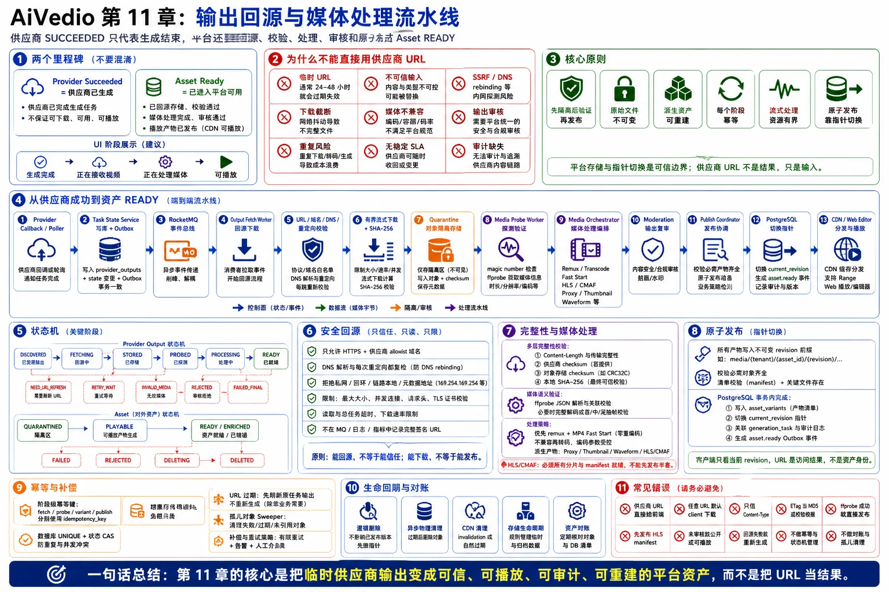

# 第 11 章：输出回源与媒体处理流水线



> 图注：本章全文重点总结图，围绕供应商成功与资产 READY 的边界、受控回源、quarantine、媒体探测、处理流水线、输出审核、原子发布、幂等补偿和常见错误展开。

> **本章核心结论**：第三方模型返回 `SUCCEEDED`，只代表“供应商侧生成结束”，不代表“平台资产已经可用”。平台必须把临时输出经过**受控回源、完整性校验、媒体探测、兼容性处理、内容复审和原子发布**，才能向用户声明资产 `READY`。

---

## 11.1 本章要解决的业务问题

AI 视频供应商通常在任务完成后返回一个下载 URL。这个 URL 可能带签名、可能经过多次重定向，也可能只在有限时间内有效。以 Runway 为例，其官方文档明确说明输出 URL 是临时地址，通常会在访问 API 后 24～48 小时内过期，并要求调用方尽快下载到自己的存储中。[1]

因此，平台不能把供应商输出 URL 当作永久资产地址，而要解决以下问题：

1. **临时性**：URL 过期后，历史项目、编辑器和导出任务仍需访问该视频。
2. **不可信输入**：回调中的 URL、响应头和媒体文件都属于外部输入，可能触发 SSRF、DNS rebinding、超大文件、畸形媒体或解析器漏洞。
3. **传输不确定性**：下载可能超时、截断、返回 5xx，或出现“对象已经上传成功，但 Worker 没收到成功响应”的未知结果。
4. **媒体不兼容**：供应商可能返回浏览器不支持的编码、非 Fast Start MP4、可变帧率、异常时间戳、缺少音轨或旋转元数据。
5. **内容与合规**：输入审核通过不代表输出一定安全，生成结果仍需执行输出侧复审。
6. **多阶段一致性**：原始文件、播放版、HLS/CMAF、缩略图、波形和数据库记录不可能在一个跨系统事务中同时提交。
7. **成本与用户体验**：应尽快抢救即将过期的输出，同时避免重复下载、重复转码、重复生成和重复计费。

平台需要明确区分两个里程碑：

```text
Provider Succeeded
    = 供应商已生成完成，平台已经知道输出描述

Asset Ready
    = 输出已经进入平台存储，校验和审核通过，必要播放产物已发布
```

用户界面可以显示：

```text
生成完成 → 正在接收视频 → 正在处理媒体 → 可播放
```

而不是在供应商刚返回成功时立即显示“完成”。

---

## 11.2 核心设计原则

### 11.2.1 供应商完成与平台资产就绪分离

`generation_tasks.provider_status = SUCCEEDED` 与 `assets.status = READY` 是两个状态，不能合并成一个布尔字段。前者用于供应商对账和生成计费，后者用于播放、编辑和导出准入。

### 11.2.2 控制面与媒体数据面分离

**控制面**只传递任务 ID、输出描述、资产 ID、状态和事件：

- PostgreSQL：任务、资产、版本、校验结果和发布状态的事实源。
- RocketMQ：回源、探测、转码、审核和补偿任务的异步传递。
- Redis：短期进度、限流、租约加速和实时通知，不作为资产事实源。

**媒体数据面**负责大字节流：

- 供应商 CDN → Output Fetch Worker → 隔离区对象存储。
- 对象存储 → Media Worker → 派生资产前缀。
- 对象存储/CDN → 浏览器和渲染 Worker。

Go API 服务只传元数据，不中转视频正文。

### 11.2.3 先隔离、后验证、再发布

供应商文件先写入私有的 `quarantine` 区域。未完成完整性检查、媒体验证和内容复审前：

- 不生成公开 CDN 地址；
- 不作为编辑器素材；
- 不允许最终渲染引用；
- 不与正式资产前缀混用。

### 11.2.4 原始文件不可变，派生资产可重建

保留供应商原始输出作为不可变源资产。转码版、代理版、HLS、缩略图和波形都带 `pipeline_version`，可在编码策略、播放器兼容性或审核算法升级后重新生成。

### 11.2.5 每个阶段都必须幂等

RocketMQ 应按“至少一次投递”设计。重复消息、消费者崩溃和人工重放都不能产生多个正式资产或多次发布。正确性依赖 PostgreSQL 唯一约束、状态 CAS、不可变对象 key 和阶段级幂等键，而不是依赖 Redis 锁或假设 MQ exactly-once。

### 11.2.6 流式处理和资源有界

下载不能使用 `io.ReadAll` 将完整视频放入内存。Go 的 `net/http` 响应体本身支持按需流式读取，[2] 但仍必须同时限制：

- 最大响应体大小；
- 建连、TLS、响应头、空闲读取和总任务超时；
- 单 Host 连接数；
- Worker 并发数；
- 临时磁盘；
- 对象存储分片上传缓冲；
- FFmpeg CPU、内存、GPU、进程数和执行时长。

### 11.2.7 “原子发布”通过指针切换实现

对象存储通常没有跨多个对象的数据库式事务，也不应依赖“目录改名”。正确做法是：

1. 所有派生对象写入不可变的版本前缀；
2. 校验必需对象全部存在；
3. 在一个 PostgreSQL 事务中写入变体记录并切换 `current_revision`；
4. 同事务写 Outbox；
5. 事务提交后才允许生成 CDN 授权。

原子边界是**数据库中的发布指针**，不是对象存储中的文件移动。

---

## 11.3 详细架构与组件职责

```text
Provider Webhook / Poller
          │
          ▼
Task State Service
  ├── 记录 provider SUCCEEDED
  ├── 写 provider_outputs
  └── 写 Outbox: output.fetch.requested
          │
          ▼
       RocketMQ
          │
          ▼
Output Fetch Worker
  ├── 读取加密 URL 描述
  ├── URL/域名/DNS/重定向校验
  ├── 有界流式下载
  ├── 流式计算 SHA-256
  └── 写 quarantine 对象存储
          │
          ▼
Media Probe Worker
  ├── magic number / 容器识别
  ├── ffprobe JSON
  ├── 关键参数验证
  └── 必要时执行解码完整性检查
          │
          ▼
Asset Service
  ├── 创建 QUARANTINED 原始资产
  └── 写 Outbox: media.pipeline.requested
          │
          ▼
Media Orchestrator
  ├── Remux / Transcode
  ├── MP4 Fast Start
  ├── HLS/CMAF 多码率
  ├── 编辑器代理视频
  ├── 缩略图/精灵图
  ├── 音频波形
  └── 输出侧内容复审
          │
          ▼
Publish Coordinator
  ├── 校验必需变体
  ├── PostgreSQL 事务切换 revision
  ├── assets.status = READY
  └── Outbox: asset.ready
          │
          ▼
Notification Gateway / CDN / Web Editor
```

### 组件职责表

| 组件 | 核心职责 | 不应承担的职责 |
|---|---|---|
| Task State Service | 归一化供应商终态，保存输出描述 | 直接下载大文件 |
| Output Fetch Worker | 安全、限速、可恢复地回源 | 执行业务发布或用户计费 |
| Quarantine Storage | 保存未验证的不可变原始字节 | 直接公开给 CDN |
| Media Probe Worker | 探测和验证容器、流与关键参数 | 修改原始资产 |
| Media Orchestrator | 编排转码、切片、缩略图、波形和审核 | 作为任务事实源 |
| Media Worker | 执行 FFmpeg/GPU 处理 | 直接更新多个业务终态 |
| Publish Coordinator | 验证发布条件并原子切换版本 | 转码大文件 |
| PostgreSQL | 任务、资产、版本、幂等和审计事实 | 高频字节进度刷新 |
| Redis | 并发槽位、短期进度、通知加速 | 唯一发布状态和资产目录 |
| RocketMQ | 阶段解耦、削峰、重试和死信 | 天然 exactly-once |
| 对象存储/CDN | 原始与派生媒体的持久化和分发 | 决定业务资产是否 READY |

### 必需产物与可选产物

为了降低首个可播放时间，可将派生结果分成两类：

- **发布必需**：原始资产、至少一个浏览器可播放版本、核心媒体元数据、输出审核结果。
- **异步增强**：多码率 HLS、缩略图精灵图、完整波形、镜头切分、AI 标签。

这样可以先将资产发布为 `PLAYABLE`，随后进入 `ENRICHED`。但每个可见版本仍需通过数据库指针原子发布，不能暴露半套 HLS 或缺失引用的清单。

---

## 11.4 文字版时序图

```text
1. Provider 向 Callback Gateway 回调任务成功，并携带 provider_task_id、输出 URL、有效期和可选 checksum。
2. Callback Gateway 验签、防重放后，只做快速持久化，不在回调请求内下载视频。
3. Task State Service 在同一 PostgreSQL 事务中：
   - 将 generation_task 更新为 PROVIDER_SUCCEEDED；
   - upsert provider_outputs；
   - 写入 outbox_events(output.fetch.requested)。
4. Outbox Relay 将事件投递到 RocketMQ。
5. Output Fetch Worker 收到消息，以 provider_output_id + fetch_pipeline_version 作为幂等键领取任务。
6. Worker 从数据库解密读取临时 URL，校验 scheme、域名、端口、DNS 结果和每一次重定向目标。
7. Worker 发起 GET，设置大小上限和多层超时；响应体边读边：
   - 计算 SHA-256；
   - 统计字节数；
   - 通过分片上传写入 quarantine 对象；
   - 更新 Redis 中的非关键进度。
8. 下载结束后，Worker 校验 Content-Length、供应商 checksum、对象存储 checksum和实际字节数。
9. Worker 将 fetch 状态 CAS 为 STORED，并发出 media.probe.requested。
10. Probe Worker 对隔离对象运行 ffprobe，检查容器、视频流、音频流、时长、分辨率、帧率和时间戳。
11. 对高风险或关键资产执行轻量抽帧或完整解码检查，避免只有容器头正常而尾部损坏。
12. Asset Service 创建 QUARANTINED 原始 Asset，并触发媒体处理 DAG。
13. Media Worker 按 DAG 生成 MP4 Fast Start、HLS/CMAF、代理视频、缩略图、波形等派生结果。
14. Moderation Worker 对代表帧、音频和必要文本执行输出侧审核。
15. Publish Coordinator 检查所有必需节点成功、对象存在、审核通过、任务未被删除或撤销。
16. Publish Coordinator 在一个 PostgreSQL 事务中：
   - 写 asset_variants；
   - 将 asset_revision 设为 READY；
   - 切换 assets.current_revision；
   - 关联 generation_task.output_asset_id；
   - 写 outbox_events(asset.ready)。
17. 事务提交后，Notification Gateway 通知浏览器；浏览器获取平台自己的签名 CDN 地址。
```

---

## 11.5 关键状态机

### 11.5.1 Provider Output 状态

```text
DISCOVERED
   └──► FETCH_PENDING
           └──► FETCHING
                   ├──► STORED
                   ├──► RETRY_WAIT
                   ├──► NEED_URL_REFRESH
                   ├──► INVALID_RESPONSE
                   └──► OUTPUT_LOST
```

### 11.5.2 Asset 状态

```text
QUARANTINED
   └──► PROBING
           ├──► PROCESSING
           │       ├──► PLAYABLE
           │       │       └──► ENRICHED
           │       ├──► REJECTED
           │       └──► PROCESSING_FAILED
           └──► INVALID_MEDIA
```

### 11.5.3 状态规则

1. `PROVIDER_SUCCEEDED` 不能直接跳到 `ASSET_READY`。
2. 终态更新必须带 `version` 或期望前置状态，防止迟到事件覆盖新状态。
3. `REJECTED`、`INVALID_MEDIA` 和 `OUTPUT_LOST` 属于不同业务语义，不能都压缩成 `FAILED`。
4. `RETRY_WAIT` 必须带 `next_retry_at`、`error_class` 和剩余重试预算。
5. 用户删除或取消应写 tombstone/version；旧 Worker 完成时必须因 CAS 不匹配而放弃发布。

---

## 11.6 关键数据结构、数据库表与消息字段

以下为面试级结构，字段可按实际业务裁剪。

### 11.6.1 `provider_outputs`

```sql
CREATE TABLE provider_outputs (
    id                    uuid PRIMARY KEY,
    tenant_id             bigint NOT NULL,
    generation_task_id    uuid NOT NULL,
    provider              text NOT NULL,
    provider_task_id      text NOT NULL,
    output_index          smallint NOT NULL,
    output_revision       integer NOT NULL DEFAULT 1,

    source_url_ciphertext bytea NOT NULL,
    source_url_expires_at timestamptz,
    provider_etag         text,
    expected_size_bytes   bigint,
    expected_checksum_alg text,
    expected_checksum     text,

    fetch_status          text NOT NULL,
    descriptor_version    bigint NOT NULL DEFAULT 1,
    last_error_code       text,
    created_at            timestamptz NOT NULL,
    updated_at            timestamptz NOT NULL,

    UNIQUE (provider, provider_task_id, output_index, output_revision)
);
```

设计说明：

- URL 可能包含访问凭证，不应明文写日志、MQ 或普通审计事件；数据库中建议加密保存。
- `output_revision` 用于处理同一供应商任务后来返回不同内容的情况。
- URL 不是幂等键，签名刷新后 URL 会变化。

### 11.6.2 `output_fetch_jobs`

```sql
CREATE TABLE output_fetch_jobs (
    id                    uuid PRIMARY KEY,
    provider_output_id    uuid NOT NULL,
    pipeline_version      integer NOT NULL,
    status                text NOT NULL,
    priority              integer NOT NULL,
    deadline_at           timestamptz,

    attempt_count         integer NOT NULL DEFAULT 0,
    next_retry_at         timestamptz,
    lease_owner           text,
    lease_until           timestamptz,

    temp_object_key       text,
    actual_size_bytes     bigint,
    sha256                text,
    last_error_class      text,
    last_error_detail     text,
    version               bigint NOT NULL DEFAULT 1,
    created_at            timestamptz NOT NULL,
    updated_at            timestamptz NOT NULL,

    UNIQUE (provider_output_id, pipeline_version)
);
```

### 11.6.3 `assets`

```sql
CREATE TABLE assets (
    id                    uuid PRIMARY KEY,
    tenant_id             bigint NOT NULL,
    source_type           text NOT NULL,
    source_provider_output_id uuid,
    status                text NOT NULL,
    current_revision      integer,

    media_type            text,
    duration_us           bigint,
    width                 integer,
    height                integer,
    video_codec           text,
    audio_codec           text,
    frame_rate_num        integer,
    frame_rate_den        integer,
    source_size_bytes     bigint,
    source_sha256         text,

    moderation_status     text NOT NULL,
    delete_version        bigint NOT NULL DEFAULT 0,
    created_at            timestamptz NOT NULL,
    updated_at            timestamptz NOT NULL
);
```

### 11.6.4 `asset_variants`

```sql
CREATE TABLE asset_variants (
    id                    uuid PRIMARY KEY,
    asset_id              uuid NOT NULL,
    revision              integer NOT NULL,
    variant_type          text NOT NULL,
    object_key            text NOT NULL,
    mime_type             text NOT NULL,
    size_bytes            bigint NOT NULL,
    checksum_alg          text NOT NULL,
    checksum              text NOT NULL,
    width                 integer,
    height                integer,
    bitrate               bigint,
    codec                 text,
    status                text NOT NULL,
    created_at            timestamptz NOT NULL,

    UNIQUE (asset_id, revision, variant_type)
);
```

`variant_type` 可以包括：

```text
SOURCE
PLAYBACK_MP4
PROXY_720P
HLS_MASTER
HLS_1080P
HLS_720P
THUMBNAIL_POSTER
THUMBNAIL_SPRITE
THUMBNAIL_VTT
AUDIO_WAVEFORM
KEYFRAME_INDEX
```

### 11.6.5 对象 key 设计

```text
quarantine/{tenant_hash}/{provider_output_id}/{fetch_job_id}/source.bin

assets/{tenant_hash}/{asset_id}/source/{sha256}.bin
assets/{tenant_hash}/{asset_id}/rev/{revision}/playback/video.mp4
assets/{tenant_hash}/{asset_id}/rev/{revision}/hls/master.m3u8
assets/{tenant_hash}/{asset_id}/rev/{revision}/hls/720p/init.mp4
assets/{tenant_hash}/{asset_id}/rev/{revision}/hls/720p/seg-00001.m4s
assets/{tenant_hash}/{asset_id}/rev/{revision}/thumb/poster.jpg
assets/{tenant_hash}/{asset_id}/rev/{revision}/thumb/sprite-0001.jpg
assets/{tenant_hash}/{asset_id}/rev/{revision}/audio/waveform.json
```

原则：

- key 由平台生成，不采用响应中的文件名。
- 正式对象不可覆盖；策略变化时增加 revision。
- 跨租户内容去重需谨慎，避免通过哈希和时序泄漏其他租户是否拥有同一内容。

### 11.6.6 回源消息

```json
{
  "event_id": "uuid",
  "event_type": "output.fetch.requested",
  "schema_version": 1,
  "tenant_id": 10001,
  "generation_task_id": "uuid",
  "provider_output_id": "uuid",
  "fetch_job_id": "uuid",
  "pipeline_version": 3,
  "priority": 80,
  "deadline_at": "2026-06-24T06:00:00Z",
  "trace_id": "trace-id",
  "created_at": "2026-06-24T03:00:00Z"
}
```

消息中不携带完整签名 URL。消费者凭 `provider_output_id` 从数据库按权限读取，减少凭证泄漏面。

### 11.6.7 媒体处理消息

```json
{
  "event_id": "uuid",
  "event_type": "media.pipeline.requested",
  "schema_version": 1,
  "asset_id": "uuid",
  "revision": 4,
  "pipeline_version": 7,
  "required_outputs": [
    "PLAYBACK_MP4",
    "THUMBNAIL_POSTER",
    "MODERATION_RESULT"
  ],
  "optional_outputs": [
    "HLS_MASTER",
    "THUMBNAIL_SPRITE",
    "AUDIO_WAVEFORM"
  ],
  "trace_id": "trace-id"
}
```

---

## 11.7 正常流程

### 11.7.1 接收供应商输出描述

Webhook 或 Poller 获得任务成功结果后，先持久化：

- provider task ID；
- 输出索引；
- URL；
- URL 过期时间；
- 可选大小、ETag、checksum；
- 描述版本。

回调处理必须快速返回。不能在供应商回调 HTTP 请求内同步下载、ffprobe 和转码，否则会引起供应商重试、重复回调和连接资源占用。

### 11.7.2 URL 安全校验

回源前执行：

1. 只允许 `https`，极少数受控场景才允许 `http`。
2. 优先采用供应商级域名 allowlist，而不是接受任意域名。
3. 拒绝 URL 中的 userinfo、非常规端口和不支持的 scheme。
4. 解析所有 A/AAAA 记录，拒绝环回、私网、链路本地、组播、保留地址和云元数据地址。
5. 每次重定向都重新执行完整校验，限制最大跳数。
6. 实际建连时通过受控 `DialContext` 再次解析并校验，避免“校验时为公网、连接时变私网”的 DNS rebinding。
7. 跨 Host 重定向时剥离敏感认证头。
8. Fetch Worker 使用独立出口网络和 egress ACL；即使应用校验漏掉，网络层也不能访问内网控制面。

OWASP 的 SSRF 防护指南强调应对目标地址实施严格校验和网络层限制。[6]

### 11.7.3 有界流式下载

`HEAD` 只能作为优化，不能作为安全和完整性的唯一依据：部分签名 URL 不支持 HEAD，且 HEAD 与 GET 可能经过不同缓存或重定向路径。

GET 流程：

```text
Provider Response Body
        │
        ├──► byte counter + hard limit
        ├──► SHA-256 hasher
        └──► multipart uploader ──► quarantine object storage
```

关键实现点：

- 复用全局 `http.Transport`，设置 `MaxConnsPerHost`、空闲连接和响应头超时。
- 任务使用 `context` 总 deadline，并增加空闲读取超时，避免服务端无限慢速发送。
- 若 `Content-Length > max_size`，立即拒绝；若缺失，仍通过 `LimitReader(max_size + 1)` 强制截断。
- 禁止透明压缩或明确使用 `Accept-Encoding: identity`，使字节上限和 checksum 语义稳定。
- 使用 `io.Pipe` 或对象存储 SDK 的流式分片上传；上传失败后立即取消上游下载。
- 进度可写 Redis，但只在关键百分比或时间间隔写 PostgreSQL，避免写放大。

### 11.7.4 完整性校验

下载结束后比较：

- 实际字节数与可信的预期大小；
- 本地计算的 SHA-256 与供应商 checksum；
- 对象存储返回的 checksum；
- 对象 `HEAD` 的大小和元数据。

对象存储原生 checksum 可用于传输完整性校验。AWS S3 文档说明可在上传时指定校验算法，由服务端独立计算并验证；分片上传也支持部件或完整对象 checksum。[5]

不要把 ETag 一律当成文件 MD5。分片上传、服务端加密和不同对象存储实现都可能使 ETag 不等于完整内容哈希。平台应保存自己计算的 SHA-256，并明确记录算法。

### 11.7.5 媒体探测与验证

`ffprobe` 可以结构化输出容器和流信息，[4] 建议使用 JSON 并验证：

- 是否至少存在一条可用视频流；
- 容器格式与 MIME/magic number 是否一致；
- codec、profile、level、pixel format；
- width、height、sample aspect ratio、rotation；
- duration、start_time、time_base；
- 平均帧率和真实帧率；
- 音频 codec、sample rate、channel layout；
- 流数量、附件、字幕和异常 metadata；
- 参数是否符合本模型声明的时长、分辨率和宽高比容差。

仅有 ffprobe 成功仍不等于文件全部可解码。对于高价值资产，可以执行：

```text
ffmpeg -v error -xerror -i input -f null -
```

或至少抽取开头、中间、结尾关键帧，检测截断、损坏包、异常时间戳和解码器错误。完整解码更可靠但成本更高，可按供应商历史质量、文件大小和用户等级分层执行。

### 11.7.6 Remux、转码和 Fast Start

处理策略应先判断能否无损 remux：

- 若视频编码、音频编码、时间戳和浏览器兼容性均满足要求，只做容器整理和 Fast Start。
- 若 codec、profile、像素格式或分辨率不兼容，再执行转码。

FFmpeg 文档说明，普通 MP4 的元数据通常可能位于文件尾部，`-movflags +faststart` 可将相关元数据移动到前部，以便网络播放更早开始。[3]

典型播放版：

```text
Container: MP4
Video: H.264 / 合理 profile 与 level
Audio: AAC-LC
Pixel format: yuv420p
Timestamps: 单调、从可接受起点开始
Flags: +faststart
```

不能机械地把所有源文件都转成同一固定码率。应根据源分辨率、运动复杂度、时长、目标终端和成本选择 CRF、最大码率、GOP 和音频策略。

### 11.7.7 HLS/CMAF

较长视频、弱网播放或需要自适应码率时，可生成 HLS 多码率版本。CMAF 使用分段媒体对象，适合与 HLS 组合。[7]

关键点：

- 各码率层的 GOP 和关键帧时间对齐，否则切换码率可能卡顿。
- 先上传 init segment 和全部 media segment，最后才允许发布 manifest 指针。
- 每个 revision 使用独立前缀，避免 CDN 缓存新旧分片混用。
- master playlist 中只引用已校验存在的 rendition。
- 私有 HLS 优先采用覆盖资源前缀的签名 Cookie 或统一授权，不要为每个分片生成生命周期不一致的短签名 URL。

### 11.7.8 缩略图和音频波形

缩略图产物可包括：

- poster；
- 固定时间间隔缩略图；
- sprite sheet；
- WebVTT 或 JSON 时间索引。

波形不应保存全部 PCM 样本。通常按时间窗口计算 min/max 或 RMS 峰值，生成不同缩放层级，供时间轴快速绘制。

### 11.7.9 输出侧内容复审

输出审核可组合：

- 首帧、尾帧和均匀抽帧；
- 镜头边界附近帧；
- OCR 文本；
- 音频转写；
- 人脸、暴力、色情、版权和品牌规则；
- 供应商原始安全标签。

审核未完成前资产保持私有。审核拒绝后，不发布 CDN 地址；原始文件按合规策略进入隔离保留或延迟删除，便于申诉和审计。

### 11.7.10 原子发布

发布前检查清单：

```text
原始对象存在且 checksum 正确
必需播放版存在
媒体元数据已写入
审核通过
资产未被删除或撤销
处理 revision 仍是当前候选 revision
所有必需变体状态为 SUCCEEDED
```

随后执行一个 PostgreSQL 事务：

```sql
BEGIN;

-- 校验 asset/version/delete_version
-- 插入或确认 asset_variants
-- 标记 asset_revision = READY
-- CAS 切换 assets.current_revision
-- 更新 generation_tasks.output_asset_id
-- 写 outbox_events(asset.ready)

COMMIT;
```

对象存储对象必须在事务前已写好，因为不能把外部存储操作放入数据库事务。若数据库提交失败，对象成为暂时孤儿，由定期 Sweeper 根据对象 metadata、创建时间和数据库引用关系清理或重新挂接。

---

## 11.8 异常流程和竞态条件

| 场景 | 正确处理 | 不应采取的处理 |
|---|---|---|
| URL 在回源前过期 | 通过 Provider Adapter 重新查询任务或刷新下载地址；标记 `NEED_URL_REFRESH` | 直接重新提交一次生成任务 |
| URL 返回 404 | 若刚生成且仍在有效期内，短退避重试；超过窗口后刷新 URL | 无限重试 404 |
| 429/5xx | 尊重 Retry-After，指数退避并加入抖动 | 所有 Worker 同时立即重试 |
| 403 | 区分签名过期、权限变化和永久拒绝；优先刷新凭证 | 把所有 403 当临时网络错误 |
| 下载中断 | 丢弃或终止未完成 multipart，重新下载；仅在供应商稳定支持 Range 时考虑断点续传 | 将截断文件继续进入 ffprobe |
| 对象上传成功但 Worker 超时 | `HEAD` 临时对象，比较大小/checksum；确认成功后继续 | 无条件再次创建正式资产 |
| 重复回调/重复 MQ | 唯一键 + CAS，复用同一 fetch job 和 asset | 依赖 Redis 锁保证唯一 |
| 同一任务后来返回不同 URL | URL 变化不代表内容变化；比较 descriptor version 与最终 SHA-256 | 以 URL 字符串作为资产唯一键 |
| 相同 output ID 内容发生变化 | 创建新的 `output_revision`，不可覆盖旧正式资产 | 覆盖原对象导致历史不可重现 |
| 用户取消与回源并发 | 根据策略可继续抢救原始输出但不发布；最终发布检查取消版本 | Worker 完成后无条件把任务改回成功 |
| 用户删除与转码并发 | tombstone/delete_version；发布事务 CAS 失败后清理候选 revision | 仅删除数据库行，不阻止迟到发布 |
| ffprobe 成功但尾部损坏 | 抽帧或完整解码校验；确定性损坏进入 `INVALID_MEDIA` | 无限重跑 ffprobe |
| FFmpeg 崩溃或 OOM | 隔离 Worker、记录资源峰值；按错误类别有限重试或降级规格 | 在 API Pod 内无限拉起进程 |
| 审核服务不可用 | 对外发布通常 fail closed；保留原始资产等待审核 | 未审核先公开，之后再撤回 |
| HLS 只生成部分分片 | revision 不发布，重做缺失节点 | 先上传并公开 master.m3u8 |
| CDN 缓存旧 manifest | revision 化 URL，切换数据库指针；必要时 purge | 覆盖同一路径并假设缓存立即一致 |

### 11.8.1 “供应商已成功，但 URL 永久丢失”

这是最需要主动讲出的异常。处理顺序：

1. 用原 provider task ID 查询供应商任务详情；
2. 请求刷新输出 URL，而不是重做生成；
3. 检查其他输出副本、回调历史和供应商对象存储；
4. 若供应商确认生成成功但无法再提供文件，进入 `OUTPUT_LOST`；
5. 执行供应商账单对账和用户补偿策略；
6. 只有在用户明确同意或产品规则允许时，才创建新的生成任务，并产生新的任务 ID、幂等键和计费记录。

自动“重试生成”可能生成不同内容并再次产生供应商费用，因此它不是下载补偿。

### 11.8.2 取消竞态

用户取消时可能处于：

- 供应商仍在生成；
- 供应商已成功但平台未回源；
- 已回源正在转码；
- 已经准备发布。

建议策略：

- 若供应商已产生费用且 URL 即将过期，可继续保存原始字节用于审计和潜在恢复，但不向用户发布。
- 停止可选派生任务，减少内部转码成本。
- 发布事务必须检查 `cancel_version` 或 `delete_version`。
- 取消不能删除账务审计事实，也不能让迟到 Worker 将状态覆盖回 READY。

---

## 11.9 幂等、一致性、重试和补偿设计

### 11.9.1 阶段级幂等键

```text
Fetch:
provider_output_id + fetch_pipeline_version

Probe:
source_asset_id + probe_version

Variant:
asset_id + revision + variant_type + pipeline_version

Publish:
asset_id + revision
```

数据库唯一约束是最终兜底。Redis 可以减少并发碰撞，但 Redis 锁过期、网络分区或进程暂停时仍可能出现重复执行。

### 11.9.2 对象写入幂等

推荐两种方式：

**方式 A：作业临时 key**

```text
quarantine/.../{fetch_job_id}/source.bin
```

上传完成后保存 checksum，再由 Asset Service 关联。优点是实现简单；缺点是重复作业可能产生孤儿对象，需要清理。

**方式 B：租户内内容寻址 key**

```text
assets/{tenant}/{asset_id}/source/{sha256}.bin
```

需先得到完整 hash，通常要临时对象或本地 spool 后再复制/提交。适合强去重需求，但增加一次对象操作。

实践中常采用 A 作为接收路径，正式发布时引用不可变对象，不强制复制；通过数据库唯一关系和 Sweeper 处理孤儿。

### 11.9.3 数据库与对象存储一致性

无法用一个 ACID 事务同时提交 PostgreSQL 和对象存储，因此采用“先写对象，后提交元数据”的可恢复模式：

```text
对象上传成功
  → 验证对象
  → PostgreSQL 事务登记并发布
  → 若事务失败，对象暂时孤立
  → Sweeper 清理或恢复挂接
```

不建议“先把数据库标 READY，再上传对象”，因为用户可能拿到指向不存在对象的地址。

### 11.9.4 重试分类

| 错误类别 | 示例 | 是否重试 | 策略 |
|---|---|---:|---|
| 瞬时网络 | connect reset、timeout、临时 DNS 失败 | 是 | 指数退避、抖动、重试预算 |
| 供应商限流 | 429 | 是 | Retry-After、Host 级并发下降 |
| 供应商故障 | 5xx | 是 | 熔断、半开、短期重试 |
| 地址待生效 | 新输出短期 404 | 有限 | 短间隔重试后刷新 URL |
| 地址过期 | 403/expired | 不直接重试旧 URL | 重新查询或刷新 URL |
| 超过大小 | 实际字节 > hard limit | 否 | 安全失败，人工或产品策略处理 |
| checksum 不一致 | 传输截断或上游内容变化 | 有限 | 重新获取描述并重下；持续失败转人工 |
| 媒体确定性损坏 | 无可用视频流、解码失败 | 通常否 | 标记 INVALID_MEDIA，向供应商对账 |
| 编码不兼容 | 浏览器不支持 | 可处理 | 转码或降级规格，不重复生成 |
| 审核拒绝 | 输出违规 | 否 | REJECTED，不重新生成除非用户新请求 |
| Worker OOM | 媒体过大或参数异常 | 视情况 | 降低并发/规格或确定性失败 |

### 11.9.5 重试不能产生重复生成或重复计费

回源重试只重试 `GET output`，不能调用 `Provider.SubmitGeneration`。媒体重试只重跑指定 DAG 节点，不能创建新的 generation task。

建议账务拆分：

```text
生成费用：按供应商任务受理/成功规则结算
平台处理费用：按产品策略内部核算或单独记账
用户额度：预占 → 生成结算/释放 → 必要补偿
```

当供应商成功但平台因自身故障丢失输出时，技术上可能已经产生供应商成本；用户是否退款属于产品和对账规则，但账本必须保留原始费用与补偿两条记录，不能修改历史流水。

### 11.9.6 补偿任务

定期扫描：

- `FETCHING` 且 lease 已过期；
- 即将过期但仍未 `STORED` 的输出；
- 已有 quarantine 对象但数据库未登记；
- 未完成的 multipart upload；
- `PROCESSING` 超过合理时长；
- revision 已失败但遗留分片；
- `READY` 资产缺少必需对象；
- `PROVIDER_SUCCEEDED` 却没有 provider_output 记录。

补偿扫描是最后防线，不替代实时事件链路。

---

## 11.10 性能瓶颈和容量估算

### 11.10.1 核心容量公式

设：

```text
λc = 峰值供应商完成速率，单位：个/秒
S  = 平均输出大小，单位：Byte
Tf = 平均下载时长，单位：秒
D  = 平均视频时长，单位：视频秒
R  = 完成全部必需媒体处理的总 RTF
F  = 原始 + 派生资产存储放大系数
```

则：

```text
外部回源带宽 ≈ λc × S × 8
在途下载数   ≈ λc × Tf
媒体处理槽位 ≈ λc × D × R
每日存储增量 ≈ 日任务数 × S × F
```

其中 RTF 定义为：

```text
RTF = 处理耗时 / 媒体时长
```

例如 `RTF = 0.5` 表示处理速度约为 2 倍实时。

### 11.10.2 一组示例推导

假设：

```text
峰值完成速率        4 个/秒
平均源文件          64 MiB
P95 源文件          180 MiB
平均下载时长        16 秒
平均视频时长        8 秒
必需流水线总 RTF    1.2
每日输出            50,000 个
总存储放大系数      2.2
```

推导：

1. **峰值回源带宽**

```text
4 × 64 MiB × 8 ≈ 2,048 Mib/s ≈ 2.15 Gbit/s
```

加入 30% 余量后，出口、NAT、Worker 网卡和对象存储写入链路至少按约 2.8 Gbit/s 规划。

2. **并发下载数**

```text
4 × 16 = 64
```

加入波动后，可先按 80～100 个并发下载槽位规划，但还要设置每个供应商 Host 的独立上限，避免对单一 CDN 形成突发冲击。

3. **媒体处理槽位**

```text
4 × 8 × 1.2 = 38.4
```

约需 39 个持续处理槽位；加 30% 余量后约为 50 个等效槽位。实际应按编码器、分辨率、CPU/GPU 型号分别压测，不可把所有任务当成同一 RTF。

4. **每日存储增量**

```text
50,000 × 64 MiB × 2.2 ≈ 6.7 TiB/日
```

若保留 30 天热数据，未考虑删除和压缩前约为 200 TiB。必须配合生命周期、低频归档、失败中间文件清理和租户配额。

### 11.10.3 主要瓶颈

1. **供应商出口和 NAT**：大量长连接可能耗尽端口和连接跟踪表。
2. **对象存储分片上传**：part 太小增加请求数，太大增加重试成本和内存缓冲。
3. **FFmpeg CPU/GPU**：不同 codec、分辨率、滤镜和硬件编码器差异巨大。
4. **临时磁盘**：需要随机访问或完整解码时可能落盘，必须限制单任务和 Pod 总容量。
5. **PostgreSQL 热更新**：每秒刷新字节进度会造成写放大，应将高频进度放 Redis。
6. **消息积压**：回源队列不仅看消息数，更要看最老任务距 URL 过期还有多少余量。
7. **CDN 缓存和小文件请求**：HLS 分片会显著提高对象请求量和日志量。

### 11.10.4 调度与背压

回源调度建议综合：

```text
priority_score =
    tenant_weight
  + paid_user_weight
  + url_expiry_urgency
  + retry_penalty
  + age_fairness
```

其中：

```text
expiry_slack = source_url_expires_at - now - estimated_fetch_time
```

优先处理 slack 最小的任务，但仍需保留租户公平，防止一个供应商的大量即将过期任务长期饿死其他租户。

扩缩容指标应包括：

- 队列最老消息年龄；
- 即将过期输出数量；
- 平均/P95 下载时长；
- 每供应商 429 率；
- 对象存储吞吐和错误率；
- Media DAG 最老任务年龄；
- CPU/GPU 利用率与实际 RTF。

只按 CPU 扩缩容不够，因为 Worker 可能阻塞在外部网络或对象存储。

---

## 11.11 高可用与降级方式

### 11.11.1 Output Fetch Worker

- 无状态、多实例、跨可用区部署。
- 任务领取使用 lease + CAS；实例死亡后其他 Worker 可接管。
- 每个供应商独立连接池、并发槽位、熔断器和错误预算。
- 停机时先停止领取新任务，再取消或完成当前 multipart 上传。

### 11.11.2 对象存储故障

- 不把生成任务改为供应商失败，而是保持 `PROVIDER_SUCCEEDED / FETCH_RETRY_WAIT`。
- 优先保存临近过期的输出。
- 若业务允许，可临时落到加密的本地/块存储应急缓冲，但必须有容量上限和后续搬运；这属于复杂降级，不应作为常态路径。
- 存储恢复后按 deadline 继续回源或补传。

### 11.11.3 Media Worker 故障

原始输出已经在平台对象存储后，转码集群短时不可用不会再受供应商 URL 过期影响。可以：

- 延迟可选 HLS、精灵图和波形；
- 优先生成单一播放版；
- 降低分辨率或减少码率层；
- 使用 CPU 兜底处理少量高优任务；
- 将确定性 poison media 送入隔离队列，避免反复打垮 Worker。

### 11.11.4 审核服务故障

对公开发布通常采用 fail closed：保存和处理可以继续，但不对外 READY。企业私有租户是否允许特殊降级，应由合规策略明确，而不是由 Worker 自行判断。

### 11.11.5 PostgreSQL 故障

- 已上传对象可能成为孤儿，但不能把发布事实放 Redis 临时代替。
- 数据库恢复后通过对象 metadata 和 job ID 恢复挂接。
- Worker 在无法提交终态时不能确认 MQ 消息永久成功；应受控重试，避免无限持有大文件连接。

### 11.11.6 CDN 故障

- 可以在低流量下提供短期签名的对象存储源站地址作为降级，但必须限速、限制 Range 和保护源站。
- 不应让所有流量无条件回源，否则可能把 CDN 故障扩散为对象存储和网络故障。

### 11.11.7 多地域取舍

大媒体跨地域复制成本高，且涉及数据驻留。多数系统优先采用：

- 单任务固定 home region；
- 元数据异步灾备；
- 关键原始资产按租户策略跨区复制；
- 非关键派生资产可在灾后重建。

不应为了“看起来高可用”默认做全量双写 active-active。

---

## 11.12 安全风险与防护

### 11.12.1 SSRF 与 DNS rebinding

仅检查 URL 字符串不够。完整防护包含：

- scheme allowlist；
- provider/domain allowlist；
- 端口 allowlist；
- A/AAAA 全量解析；
- 拒绝 IPv4/IPv6 私网、回环、链路本地、组播、保留和元数据地址；
- 每次 redirect 重验；
- 连接时重新验证并将 socket 固定到已验证 IP；
- TLS SNI 与证书仍按原 hostname 验证；
- 跨域重定向移除敏感 header；
- 关闭系统代理或使用受控代理；
- 网络 egress firewall 拒绝内网地址；
- 限制响应大小、时间和带宽。

“先 DNS 校验一次，再让默认 HTTP Client 自己重新解析”仍可能受 DNS rebinding 影响。

### 11.12.2 不可信媒体解析

ffprobe/FFmpeg 属于复杂原生媒体解析器。应：

- 独立容器或沙箱；
- 非 root；
- 只读根文件系统；
- 禁止处理 Worker 访问业务内网和公网；
- seccomp/AppArmor；
- CPU、内存、PID、文件大小、临时磁盘和执行时间限制；
- 及时升级安全版本；
- 不通过 shell 拼接未转义参数，直接传参数数组；
- 每个任务独立工作目录，结束后清理。

最好将“联网 Fetch Worker”和“无网络 Media Worker”拆成两个安全域。

### 11.12.3 资源耗尽

攻击或异常文件可能包含：

- 伪造的超大 Content-Length；
- 无 Content-Length 的无限流；
- 极端分辨率；
- 大量媒体流或附件；
- 巨长 duration；
- 异常 GOP；
- 解码炸弹；
- 诱发高内存滤镜图。

必须在下载、probe 和转码三个阶段分别设置硬上限。

### 11.12.4 凭证与日志泄漏

供应商签名 URL 可能等同临时凭证：

- 不写普通日志；
- 不放 MQ；
- 不返回浏览器；
- 数据库加密保存；
- 错误日志只保留 scheme、归一化 host、路径 hash 和响应码；
- trace/span attribute 对 query string 做脱敏。

### 11.12.5 多租户访问控制

- 每个 Asset 关联 tenant_id；
- 所有查询和签名 URL 生成都验证租户权限；
- 对象 key 不作为授权依据；
- CDN Token/Cookie 绑定资源前缀、用户或租户、过期时间；
- 后台 Worker 使用最小权限 IAM，仅访问指定前缀。

### 11.12.6 内容、隐私和版权

- 输出复审和申诉链路；
- 人脸、儿童、敏感身份和企业机密按策略处理；
- 保存供应商、模型、prompt、审核版本和处理版本的审计关联；
- 删除流程同时覆盖原始资产、派生资产、CDN 缓存和备份生命周期；
- 训练数据使用和地域合规应在供应商能力矩阵中明确。

---

## 11.13 常见错误设计及其后果

| 错误设计 | 后果 | 正确方向 |
|---|---|---|
| 把供应商 URL 直接给前端 | 地址过期、权限泄漏、无法审计和稳定播放 | 立即回源到平台私有存储 |
| 供应商成功即标任务完成 | 用户看到完成却无法播放，后续失败语义混乱 | 分离 Provider Succeeded 与 Asset Ready |
| 回调请求内同步下载 | 回调超时、供应商重复回调、线程被长连接占满 | 快速落库 + Outbox + 异步 Worker |
| 任意 URL 交给默认 HTTP Client | SSRF、DNS rebinding、访问云元数据或内网 | allowlist、自定义 Dial、重定向重验、egress ACL |
| 使用 `io.ReadAll` | 大文件导致内存峰值和 OOM | 有界流式 IO |
| 只相信 Content-Type | 伪造类型或畸形文件进入解析链路 | magic number + ffprobe + 解码校验 |
| 把 ETag 当完整 MD5 | 分片上传时校验结论错误 | 自算 SHA-256 + 存储原生 checksum |
| 所有错误都指数重试 | 永久错误形成 poison message 和成本浪费 | 错误分类 + 重试预算 + DLQ |
| 下载失败就重新生成 | 重复供应商费用，且生成内容可能不同 | 刷新 URL 或重新查询原任务 |
| 依赖 Redis 锁防重复 | 锁过期或分区时仍重复创建资产 | PostgreSQL 唯一约束和 CAS |
| 在对象存储中覆盖同一路径 | CDN 新旧缓存混合，历史不可重现 | 不可变 revision 前缀 |
| 先发布 HLS manifest | 客户端请求到尚未存在的分片 | 全部对象完成后切换发布指针 |
| ffprobe 成功就认为文件完整 | 尾部损坏和解码错误被漏掉 | 分层抽帧或完整解码检查 |
| FFmpeg 与 API 混跑 | CPU/OOM/崩溃拖垮在线接口 | 独立沙箱 Worker 与资源配额 |
| 进度每个字节写数据库 | PostgreSQL 写放大、热点行和 vacuum 压力 | Redis 高频进度，DB 只写阶段状态 |
| 未审核先公开 | 合规风险和撤回困难 | quarantine + 输出复审 + 原子发布 |

---

## 11.14 面试官可能追问的 10 个问题与资深回答

### 追问 1：供应商已经返回成功，为什么不能直接把 URL 给前端？

**资深回答：**

供应商 URL 是传输凭证，不是平台资产。它可能过期、带签名、不能长期缓存，也无法满足项目历史、剪辑、导出、删除和多租户授权。平台还无法保证其格式、完整性和审核状态。正确做法是先记录供应商成功，再异步回源到私有对象存储，完成 checksum、ffprobe、兼容性处理和审核，最后通过数据库发布指针让资产 READY。这样供应商可替换，前端只依赖平台稳定的 Asset ID。

### 追问 2：RocketMQ 重复投递时，如何避免重复下载和重复创建资产？

**资深回答：**

我不会把正确性寄托在 MQ exactly-once。Fetch Job 使用 `provider_output_id + pipeline_version` 唯一约束；消费者领取时用状态 CAS 或 lease。即使两个 Worker 同时执行，正式 Asset 与 Variant 仍有数据库唯一键。对象侧使用带 job/revision 的不可变 key，重复对象最多成为可清理孤儿，不会覆盖正式资产。Redis 锁只用于减少碰撞，不是最终一致性边界。

### 追问 3：下载 URL 已经过期，系统怎么补偿？

**资深回答：**

先通过原 provider task ID 调用 Adapter 的 `GetTask` 或 `RefreshOutputURL`，不重新提交生成。调度器会根据 `expires_at` 做 deadline-aware 优先级，尽量在过期前抓取。若供应商确认成功但永久无法提供文件，状态应是 `OUTPUT_LOST`，进入供应商账单对账和用户补偿。自动重做生成会产生新内容和新成本，必须作为新的业务任务处理。

### 追问 4：如何同时防 SSRF 和 DNS rebinding？

**资深回答：**

先按供应商建立域名 allowlist，只允许 HTTPS 和受控端口；解析所有 A/AAAA，拒绝私网、回环、链路本地和元数据地址；每次重定向重新校验。关键是自定义 `DialContext`：连接时重新解析并校验，然后直接拨号到选定 IP，同时 TLS 的 ServerName 保持原域名。Fetch Worker 所在网络再通过 egress ACL 拒绝访问内网。仅在业务代码里校验一次 hostname 不足以阻止 rebinding。

### 追问 5：为什么要流式写对象存储？何时还需要临时磁盘？

**资深回答：**

流式路径能把内存从 O(file_size) 降为 O(buffer_size)，并减少大文件在 Worker 本地长期停留。下载时同时计数、算 SHA-256 和 multipart upload。临时磁盘适合需要随机访问、完整解码、二次封装或 SDK 无法稳定流式上传的场景，但必须是加密、按任务隔离且有硬配额。选择取决于文件大小、处理算法和节点磁盘成本，不应绝对化。

### 追问 6：HLS 有很多文件，怎么做到原子发布？

**资深回答：**

不尝试让对象存储跨文件事务。所有 init segment、media segment 和 manifest 写到不可变 revision 前缀；先验证每个必需对象存在，数据库再一次性写 variant 记录并将 `assets.current_revision` 从旧版本 CAS 到新版本。客户端只通过当前 revision 获取 master manifest。原子性来自元数据指针切换，旧 revision 可继续服务在途请求，之后再按生命周期回收。

### 追问 7：对象上传可能已经成功，但 Worker 在收到响应前超时，怎么处理？

**资深回答：**

这是典型 unknown outcome。重试前先用确定的临时 object key 做 `HEAD`，校验大小、服务端 checksum 和 job metadata。若对象完整，就把 job 从 FETCHING 恢复为 STORED；若不存在或不完整，终止残留 multipart 后重传。不能因为客户端超时就断言上传失败，也不能无条件再创建第二个正式 Asset。

### 追问 8：ffprobe 已经能读出时长和分辨率，为什么还要解码检查？

**资深回答：**

ffprobe 主要验证容器和流描述，文件头正常不代表所有 packet 都可解码。网络截断、尾部损坏、异常时间戳或坏帧可能在播放到中后段才暴露。高价值资产可执行完整 null decode；普通资产可抽取首中尾帧并结合供应商质量评分做分层检查。完整解码成本高，所以应基于风险选择，而不是所有文件一刀切。

### 追问 9：积压时如何决定先下载哪个输出？

**资深回答：**

核心不是 FIFO，而是带公平性的 deadline-aware 调度。我会计算 `expiry_slack = expires_at - now - estimated_fetch_time`，优先 slack 小的输出，同时加入租户权重、任务年龄和重试惩罚，避免大客户或某供应商完全占满队列。还要按 Host 控制并发，监控最老消息年龄和即将过期数量，而不仅是队列长度。

### 追问 10：供应商生成成功，但媒体处理失败，应该收费还是退款？

**资深回答：**

技术状态和财务状态要拆开。供应商成功可能已经产生真实成本，账本应保留生成结算；媒体处理失败则记录平台故障和补偿流水。用户是否退款由产品合同决定，但不能回写或删除原始账务记录。系统应先尝试从已保存原始文件重跑处理；只有原始输出永久丢失时才进入更高级补偿。任何处理重试都不能再次调用生成接口或再次预占生成额度。

---

## 11.15 三分钟口述稿

这个章节我重点解决的是：第三方模型已经生成成功以后，怎样把一个临时、不可信的下载地址，可靠地转成平台自己的可播放资产。

我会先把“供应商成功”和“资产 READY”拆成两个状态。供应商回调只快速验签、落库，并在同一个 PostgreSQL 事务里写 provider output 和 Outbox，不在回调请求里下载大文件。Outbox 进入 RocketMQ 后，由独立的 Output Fetch Worker 回源。

回源 Worker 的第一重点是安全。URL 只允许受控 scheme 和供应商域名，每次 DNS 解析和重定向都要拒绝私网、回环、链路本地和元数据地址；实际连接时通过自定义 DialContext 固定到已校验 IP，同时网络层 egress ACL 再做兜底，防止 SSRF 和 DNS rebinding。

第二重点是资源有界。视频不能 `ReadAll`，而是边下载、边限大小、边计算 SHA-256、边分片上传到 quarantine 对象存储。下载结束后比较实际大小、供应商 checksum 和对象存储 checksum。临时 URL、签名 query 不放进 MQ，也不写普通日志。

文件落入隔离区后，用 ffprobe 检查容器、codec、时长、分辨率、帧率和音频参数。对于高价值或风险较高的输出，再做首中尾抽帧或完整解码，避免只有文件头正常、尾部已经损坏。源文件如果已经兼容，就优先 remux 和 MP4 Fast Start；不兼容再转码。长视频或弱网场景生成 HLS/CMAF，同时生成编辑器代理、缩略图和波形，并执行输出侧内容复审。

发布时不能假设对象存储支持跨文件事务。所有产物先写到不可变 revision 前缀，确认必需对象和审核结果都完成后，在一个 PostgreSQL 事务里写 asset variants、切换 current revision、关联 generation task 并写 asset.ready Outbox。这样客户端只能看到完整版本，不会看到半套 HLS。

幂等方面，MQ 按至少一次处理。Fetch、Probe、Variant 和 Publish 都有阶段级幂等键、数据库唯一约束和状态 CAS。Redis 锁只减少重复，不承担最终正确性。URL 过期时先刷新原任务输出，不能直接重新生成，因为重新生成可能得到不同内容并产生第二次费用。整体上就是：PostgreSQL 管发布事实，RocketMQ 管异步传递，Redis 管加速和并发，对象存储管媒体字节，任何供应商临时地址都不能成为平台永久资产。

---

## 11.16 十分钟深入讲解提纲

### 第 0～1 分钟：定义问题与状态边界

- 供应商成功不等于资产可用。
- URL 临时、文件不可信、处理多阶段。
- 两个里程碑：`PROVIDER_SUCCEEDED`、`ASSET_READY`。

### 第 1～2 分钟：整体架构

- Callback/Poller → Task State → Outbox → RocketMQ。
- Output Fetch → Quarantine → Probe → Media DAG → Moderation → Publish。
- 控制面与媒体数据面分离。

### 第 2～3.5 分钟：安全回源

- 域名和 scheme allowlist。
- DNS A/AAAA 校验、redirect 重验、自定义 DialContext。
- egress ACL 防 SSRF 和 DNS rebinding。
- URL 加密、MQ 与日志脱敏。

### 第 3.5～5 分钟：流式下载与完整性

- `io.Reader` 流式路径、大小硬上限、多层超时。
- SHA-256 + 对象存储 checksum。
- unknown outcome 下先 HEAD 验证，而非盲目重传。
- ETag 不能一律视为 MD5。

### 第 5～6.5 分钟：媒体验证与处理

- ffprobe 字段和业务容差。
- 抽帧/完整解码的成本取舍。
- remux 优先、必要时转码。
- MP4 Fast Start、HLS/CMAF、代理、缩略图、波形。

### 第 6.5～7.5 分钟：原子发布

- revision 前缀不可变。
- 先对象、后数据库发布指针。
- 必需产物与可选增强分层。
- 孤儿对象 Sweeper。

### 第 7.5～8.5 分钟：幂等与异常

- MQ 至少一次；唯一约束 + CAS。
- URL 过期刷新，不重做生成。
- 取消、删除、迟到 Worker 和审核失败竞态。
- poison media 进入隔离/DLQ。

### 第 8.5～9.5 分钟：容量与高可用

- `带宽 = 完成速率 × 平均文件大小 × 8`。
- `并发下载 = 完成速率 × 下载时长`。
- `处理槽位 = 完成速率 × 视频时长 × 总 RTF`。
- 按 URL deadline 调度，按 Host 和租户限流。
- 原始文件已回源后，Media Worker 故障可延迟恢复。

### 第 9.5～10 分钟：总结取舍

- 不追求跨 PostgreSQL、MQ、对象存储的分布式事务。
- 采用不可变对象、Outbox、至少一次、业务幂等和补偿扫描。
- 任何重试都明确是否可能重复生成或重复计费。
- 原子发布的真正边界是数据库中的资产 revision 指针。

---

## 参考资料

1. [Runway API — Output Formats](https://docs.dev.runwayml.com/assets/outputs/)
2. [Go 官方文档 — net/http](https://pkg.go.dev/net/http)
3. [FFmpeg Formats Documentation](https://ffmpeg.org/ffmpeg-formats.html)
4. [ffprobe Documentation](https://ffmpeg.org/ffprobe.html)
5. [Amazon S3 — Checking object integrity](https://docs.aws.amazon.com/AmazonS3/latest/userguide/checking-object-integrity.html)
6. [OWASP — Server-Side Request Forgery Prevention Cheat Sheet](https://cheatsheetseries.owasp.org/cheatsheets/Server_Side_Request_Forgery_Prevention_Cheat_Sheet.html)
7. [Apple — CMAF with HLS](https://developer.apple.com/documentation/http-live-streaming/about-the-common-media-application-format-with-http-live-streaming-hls)
