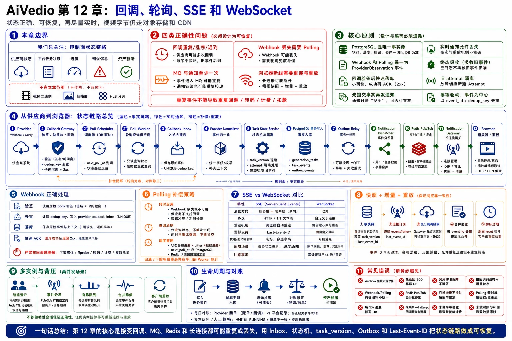

# 第 12 章：回调、轮询、SSE 和 WebSocket



> 图注：本章全文重点总结图，围绕控制面状态边界、Webhook/Polling 统一收敛、状态事实链路、SSE 与 WebSocket 取舍、快照增量重放、多实例背压和常见错误展开。

> **本章主题：第三方异步任务状态如何安全、可靠、实时地传递到浏览器。**
>
> 本章讨论的是**控制面状态链路**：供应商任务状态、平台任务状态、进度、错误和资产就绪事件。视频二进制、缩略图和 HLS 分片仍然通过对象存储与 CDN 传输，绝不通过 Webhook、SSE 或 WebSocket 中转。

---

## 12.1 本章要解决的业务问题

AI 视频生成通常需要几十秒到数分钟。平台向供应商提交任务后，供应商可能通过 Webhook 主动回调，也可能只提供查询接口。平台还要把状态变化及时传给浏览器，让用户看到“排队中、生成中、回源中、转码中、可播放、失败或取消”等阶段。

这条链路表面上只是“接收状态并推送前端”，实际包含四类正确性问题：

1. **供应商事件并不可靠有序**
   - 同一回调可能重复发送。
   - 回调可能乱序、迟到，甚至在任务已经取消或重试后才到达。
   - 平台已成功落库，但响应供应商时网络超时，供应商会再次重试。
   - 回调可能完全丢失，只能靠轮询补偿。

2. **平台内部也不是 exactly-once**
   - RocketMQ 通常按至少一次语义使用，同一状态事件可能被重复消费。
   - Notification Gateway 重启、Redis Pub/Sub 丢消息、浏览器断网都会造成实时事件缺口。
   - 因此不能把“消息只发一次”当作正确性前提。

3. **浏览器需要实时性，也需要可恢复性**
   - 只依赖实时推送，断线期间的事件会丢失。
   - 只依赖定时查询，延迟高且会制造大量无效请求。
   - 正确方式是“**权威快照 + 可重放增量事件 + 最佳努力实时通知**”。

4. **状态更新会触发后续业务**
   - 供应商成功后可能触发输出回源。
   - 平台资产就绪后可能触发计费结算、通知和前端展示。
   - 重复事件不能造成重复回源、重复转码或重复计费。

本章最终要建立一条清晰主线：

> **Webhook 和 Polling 只负责产生“供应商观测”；Task State Service 负责把观测收敛为唯一合法状态；PostgreSQL 保存事实；Outbox 与 RocketMQ 可靠传播状态变化；Redis Pub/Sub 只加速在线通知；SSE 或 WebSocket 把事件推给浏览器；浏览器始终能够通过快照和游标恢复。**

---

## 12.2 核心设计原则

### 原则一：PostgreSQL 是任务状态的唯一事实源

任务当前状态、当前供应商尝试、任务版本、终态和审计事件都应持久化到 PostgreSQL。Redis 中的在线连接、短期订阅关系和即时通知只是加速层，不能成为任务是否成功的判断依据。

### 原则二：回调和轮询必须进入同一条状态收敛逻辑

Webhook 与 Polling 只是两种数据来源。二者都要先归一化为统一的 `ProviderObservation`，再调用同一个状态迁移函数。不能分别维护两套判断逻辑，否则同一供应商状态可能在回调路径被接受、在轮询路径却被拒绝。

### 原则三：回调必须“验证后快速、持久落地”，再异步处理

Callback Gateway 只做以下工作：

- 限制请求体大小。
- 使用原始请求体校验签名。
- 校验时间戳、事件标识和必要字段。
- 生成幂等键。
- 将回调写入 `provider_callback_inbox`。
- 在持久化成功后尽快返回 `2xx`。

它不应在请求线程中下载视频、调用 ffprobe、执行转码、结算费用或等待其他服务。

### 原则四：任何状态变化都必须“先提交事实，再发通知”

正确顺序是：

```text
更新任务状态 + 写 task_events + 写 outbox_events
                    │
                    └── 同一个 PostgreSQL 事务
事务提交后，再由 Outbox Relay 发送 RocketMQ
```

不能先推送浏览器再写数据库，否则用户可能看到一个最终没有提交成功的状态。

### 原则五：实时通知允许丢，事实与重放不能丢

Redis Pub/Sub、SSE 和 WebSocket 都可能断开，因此它们只承担低延迟传输。断线恢复依赖 PostgreSQL 中的快照和事件游标，而不是依赖 Redis 保存完整历史。

### 原则六：用两个序号解决两类问题

- `task_version`：同一个任务聚合内的单调版本，用于状态覆盖、乐观并发控制和前端防回退。
- `event_id`：项目或租户事件流中的单调游标，用于 `Last-Event-ID`、断线重放和跨任务排序。

供应商自己的 `sequence` 或 `updated_at` 只能作为辅助信息，不能代替平台版本。

### 原则七：终态必须具有吸收性，重试尝试必须隔离

一个任务可能经历多个 `task_attempt`。旧尝试的迟到回调不能覆盖当前尝试。对同一尝试，`READY`、`FAILED`、`CANCELED` 等终态原则上不再被普通进度事件覆盖；出现相互矛盾的终态时，应进入对账或人工复核，而不是直接“最后写入者获胜”。

### 原则八：查询超时绝不能触发重新生成

Polling 是只读查询。查询超时、网络断开或收到 5xx 时只能重试查询，不能再次调用生成提交接口。否则会产生重复视频和重复成本。是否重提生成任务必须由独立、可审计的补偿流程决定。

---

## 12.3 详细架构与组件职责

### 12.3.1 总体架构

```text
                              ┌─────────────────────────────┐
                              │      第三方 AI 供应商       │
                              │ Webhook / Query Task Status │
                              └──────────────┬──────────────┘
                                             │
                  Webhook                    │                    Polling
                                             │
                 ┌───────────────────────────┴──────────────────────────┐
                 │                                                      │
                 ▼                                                      ▼
       ┌──────────────────┐                                  ┌──────────────────┐
       │ Callback Gateway │                                  │ Poll Scheduler   │
       │ 验签、防重放、限流 │                                  │ 到期扫描、配额控制 │
       └────────┬─────────┘                                  └────────┬─────────┘
                │                                                      │
                ▼                                                      ▼
       ┌──────────────────┐                                  ┌──────────────────┐
       │ Callback Inbox   │                                  │ Poll Worker      │
       │ PostgreSQL       │                                  │ Provider Query   │
       └────────┬─────────┘                                  └────────┬─────────┘
                │                                                      │
                └──────────────────────┬───────────────────────────────┘
                                       ▼
                             ┌──────────────────────┐
                             │ Provider Observation │
                             │ 统一状态与错误归一化    │
                             └──────────┬───────────┘
                                        ▼
                             ┌──────────────────────┐
                             │ Task State Service   │
                             │ 状态机、版本、尝试隔离  │
                             └──────────┬───────────┘
                                        │ PostgreSQL 事务
                    ┌───────────────────┼─────────────────────┐
                    ▼                   ▼                     ▼
             generation_tasks      task_events          outbox_events
                    └───────────────────┬─────────────────────┘
                                        ▼
                                ┌───────────────┐
                                │ Outbox Relay  │
                                └───────┬───────┘
                                        ▼
                                  ┌──────────┐
                                  │RocketMQ  │
                                  └────┬─────┘
                                       ▼
                            ┌──────────────────────┐
                            │Notification Dispatcher│
                            └──────────┬───────────┘
                                       ▼
                               ┌──────────────┐
                               │Redis Pub/Sub │
                               │即时广播加速层  │
                               └──────┬───────┘
                                      ▼
                         ┌────────────────────────┐
                         │Notification Gateways N │
                         │SSE / WebSocket / 心跳    │
                         └───────────┬────────────┘
                                     ▼
                                  Browser
                           快照 + 增量 + 断线重放
```

### 12.3.2 组件职责

| 组件 | 核心职责 | 不应承担的职责 |
|---|---|---|
| Callback Gateway | 验签、防重放初检、请求限流、快速持久化 | 状态机判断、媒体下载、计费、转码 |
| Callback Inbox Processor | 解析回调、映射任务、错误分类、生成统一观测 | 直接向浏览器发消息 |
| Poll Scheduler | 找出需要查询的任务、控制查询节奏和租约 | 重新提交生成任务 |
| Poll Worker | 调用固定供应商查询接口、处理 429/5xx/超时 | 根据单次超时判定任务失败 |
| Provider Normalizer | 将不同供应商状态和错误码归一化 | 修改数据库状态 |
| Task State Service | 唯一状态迁移入口、尝试隔离、版本控制 | 依赖 Redis 作为事实源 |
| PostgreSQL | 保存任务快照、事件、回调 Inbox、Outbox | 高频连接在线状态、媒体文件 |
| RocketMQ | 可靠异步传播状态变化、解耦下游 | 提供天然 exactly-once |
| Notification Dispatcher | 消费领域事件、生成公开通知、路由在线节点 | 保存任务最终状态 |
| Redis Pub/Sub | 将已提交事件快速送到在线 Gateway | 保存历史、断线重放、判断任务成功 |
| Notification Gateway | 鉴权、订阅、心跳、慢客户端隔离、SSE/WS 输出 | 重新计算业务状态 |
| Browser | 展示快照、应用增量、记录游标、重连 | 仅凭本地事件判断最终事实 |

### 12.3.3 控制面和媒体数据面边界

本章链路中只传输小型 JSON 事件，例如：

```json
{
  "task_id": "tsk_01J...",
  "task_version": 18,
  "status": "processing_media",
  "stage": "transcoding",
  "progress": 82,
  "asset_id": null
}
```

当资产可播放时，通知中传递 `asset_id`、媒体元数据或一个需要再次鉴权获取的播放入口。视频文件本身由对象存储和 CDN 提供，避免长连接网关被大文件带宽拖垮。

---

## 12.4 文字版时序图

下面的时序同时覆盖回调主路径、轮询补偿和浏览器通知：

```text
1. Provider -> Callback Gateway:
   发送任务状态回调，携带 provider_event_id、provider_task_id、时间戳和签名。

2. Callback Gateway:
   读取受限长度的原始 body，按供应商规则校验签名、时间窗和必要字段。

3. Callback Gateway -> PostgreSQL:
   INSERT provider_callback_inbox，使用 dedup_key 唯一约束防重。
   同一短事务中可写 callback.received Outbox，随后立即提交。

4. Callback Gateway -> Provider:
   持久化成功或已存在重复记录时返回 204；数据库不可用时返回 5xx，促使供应商重试。

5. Callback Processor -> PostgreSQL:
   领取 pending Inbox 记录，解析并映射到 task_attempt。

6. Callback Processor -> Task State Service:
   提交统一 ProviderObservation。

7. Task State Service -> PostgreSQL:
   校验当前 attempt、供应商序号、允许的状态迁移和终态规则；
   在一个事务中更新 generation_tasks、插入 task_events、插入 outbox_events。

8. Outbox Relay -> RocketMQ:
   至少一次发送 task.status.changed。发送结果不确定时允许重发。

9. Notification Dispatcher -> Redis Pub/Sub:
   消费 MQ 事件，按在线节点或订阅分片发布已脱敏的通知。

10. Redis Pub/Sub -> Notification Gateway:
    在线节点收到事件，放入对应连接的有界发送队列。

11. Notification Gateway -> Browser:
    以 SSE event 或 WebSocket frame 发送 event_id、task_version 和公开状态。

12. Browser:
    只应用 task_version 更大的事件，保存最后 event_id，并更新界面。

13. 若回调未到达：
    Poll Scheduler 到期领取任务，Poll Worker 调用 Provider Query API。

14. Provider Query API -> Poll Worker:
    返回状态；Poll Worker 生成与回调相同格式的 ProviderObservation，进入步骤 7。

15. 若浏览器断线：
    浏览器重新获取任务快照或带 Last-Event-ID 重连；Gateway 从 task_events 重放缺失事件，
    再切换到 Redis 实时流。若游标已过期，则发送 reset，要求客户端重新取快照。
```

这里最重要的三个提交点是：

- **回调只有在 Inbox 持久化后才返回成功。**
- **任务状态只有在 PostgreSQL 事务提交后才可以对外通知。**
- **浏览器收到事件不等于事件首次发生，客户端必须支持重复和重放。**

---

## 12.5 关键数据结构、数据库表和消息字段

### 12.5.1 统一供应商观测

回调和轮询最终都转成同一内部对象：

```go
type ProviderObservation struct {
    Provider           string
    ProviderEventID    string
    DedupKey            string
    ProviderTaskID     string
    ClientRequestID     string
    AttemptID           string
    ProviderSequence    *int64
    ProviderOccurredAt  *time.Time
    ReceivedAt          time.Time

    NormalizedStatus    string // queued/running/succeeded/failed/canceled
    Stage               string
    Progress            *int16
    ErrorClass          string
    ErrorCode           string
    OutputRefs          []string

    Source               string // webhook/poll/reconcile
    PayloadHash          string
    TraceID              string
}
```

`ProviderSequence` 不是所有供应商都提供，因此平台还必须依赖当前尝试、合法状态迁移和本地 `task_version` 保证正确性。

### 12.5.2 回调 Inbox

```sql
CREATE TABLE provider_callback_inbox (
    id                    BIGINT GENERATED ALWAYS AS IDENTITY PRIMARY KEY,
    provider              TEXT        NOT NULL,
    dedup_key             TEXT        NOT NULL,
    provider_event_id     TEXT,
    provider_task_id      TEXT,
    client_request_id     TEXT,
    provider_occurred_at  TIMESTAMPTZ,
    received_at           TIMESTAMPTZ NOT NULL DEFAULT now(),
    signature_key_version TEXT,
    payload_hash          BYTEA       NOT NULL,
    payload               JSONB,
    process_status        TEXT        NOT NULL DEFAULT 'pending',
    retry_count           INTEGER     NOT NULL DEFAULT 0,
    next_retry_at         TIMESTAMPTZ,
    last_error_code       TEXT,
    processed_at          TIMESTAMPTZ,
    CONSTRAINT uq_provider_callback_dedup UNIQUE (provider, dedup_key)
);

CREATE INDEX idx_callback_inbox_pending
ON provider_callback_inbox (next_retry_at, id)
WHERE process_status IN ('pending', 'retry');
```

设计说明：

- 优先使用供应商稳定的 `provider_event_id` 构造 `dedup_key`。
- 若供应商没有事件 ID，可组合 `provider_task_id + event_type + provider_updated_at + payload_hash`，但这只是退化方案。
- 即使退化去重未命中，后面的状态版本和状态机仍要保证业务幂等。
- 原始 payload 可能包含临时 URL 或敏感信息，应按最小化原则保存、脱敏、加密并设置较短保留期。

### 12.5.3 任务快照与尝试

```sql
CREATE TABLE generation_tasks (
    id                    UUID PRIMARY KEY,
    tenant_id             UUID        NOT NULL,
    project_id            UUID        NOT NULL,
    user_id               UUID        NOT NULL,
    status                TEXT        NOT NULL,
    stage                 TEXT        NOT NULL,
    progress              SMALLINT,
    version               BIGINT      NOT NULL DEFAULT 0,
    last_event_id         BIGINT,
    current_attempt_id    UUID,
    terminal_at           TIMESTAMPTZ,
    updated_at            TIMESTAMPTZ NOT NULL DEFAULT now()
);

CREATE TABLE task_attempts (
    id                    UUID PRIMARY KEY,
    task_id               UUID        NOT NULL REFERENCES generation_tasks(id),
    attempt_no            INTEGER     NOT NULL,
    provider              TEXT        NOT NULL,
    model                 TEXT        NOT NULL,
    client_request_id     TEXT        NOT NULL,
    provider_task_id      TEXT,
    status                TEXT        NOT NULL,
    last_provider_seq     BIGINT,
    last_provider_at      TIMESTAMPTZ,
    next_poll_at          TIMESTAMPTZ,
    poll_failures         INTEGER     NOT NULL DEFAULT 0,
    poll_lease_until      TIMESTAMPTZ,
    created_at            TIMESTAMPTZ NOT NULL DEFAULT now(),
    updated_at            TIMESTAMPTZ NOT NULL DEFAULT now(),
    CONSTRAINT uq_task_attempt_no UNIQUE (task_id, attempt_no),
    CONSTRAINT uq_provider_task UNIQUE (provider, provider_task_id),
    CONSTRAINT uq_client_request UNIQUE (provider, client_request_id)
);
```

`client_request_id` 在调用供应商前就创建，并传给支持幂等或 metadata 的供应商。这样即使供应商回调早于提交响应，平台仍有机会映射到本地尝试。

### 12.5.4 任务事件与 Outbox

```sql
CREATE TABLE task_events (
    event_id              BIGINT GENERATED ALWAYS AS IDENTITY PRIMARY KEY,
    tenant_id             UUID        NOT NULL,
    project_id            UUID        NOT NULL,
    task_id               UUID        NOT NULL,
    attempt_id            UUID,
    task_version          BIGINT      NOT NULL,
    event_type            TEXT        NOT NULL,
    public_payload        JSONB       NOT NULL,
    source                TEXT        NOT NULL,
    occurred_at           TIMESTAMPTZ,
    created_at            TIMESTAMPTZ NOT NULL DEFAULT now(),
    CONSTRAINT uq_task_version UNIQUE (task_id, task_version)
);

CREATE INDEX idx_task_events_project_cursor
ON task_events (tenant_id, project_id, event_id);

CREATE TABLE outbox_events (
    id                    BIGINT GENERATED ALWAYS AS IDENTITY PRIMARY KEY,
    aggregate_type        TEXT        NOT NULL,
    aggregate_id          UUID        NOT NULL,
    aggregate_version     BIGINT      NOT NULL,
    event_type            TEXT        NOT NULL,
    payload               JSONB       NOT NULL,
    publish_status        TEXT        NOT NULL DEFAULT 'pending',
    retry_count           INTEGER     NOT NULL DEFAULT 0,
    next_retry_at         TIMESTAMPTZ,
    created_at            TIMESTAMPTZ NOT NULL DEFAULT now(),
    published_at          TIMESTAMPTZ,
    CONSTRAINT uq_outbox_aggregate_version
      UNIQUE (aggregate_type, aggregate_id, aggregate_version, event_type)
);
```

`task_events.public_payload` 只保存浏览器可见字段。供应商原始错误、内部路由原因和临时下载令牌不应直接进入公开事件。

### 12.5.5 RocketMQ 事件

```json
{
  "event_id": 9823417,
  "event_type": "task.status.changed",
  "aggregate_id": "tsk_01J...",
  "aggregate_version": 18,
  "tenant_id": "ten_01J...",
  "project_id": "prj_01J...",
  "user_id": "usr_01J...",
  "status": "processing_media",
  "stage": "transcoding",
  "progress": 82,
  "occurred_at": "2026-06-24T03:10:15.127Z",
  "trace_id": "trc_01J..."
}
```

建议：

- Message Key 使用 `task_id`，便于排障和检索。
- 分区键可使用 `task_id`，尽量让同一任务事件局部有序。
- 即使局部有序，消费者仍要按 `aggregate_version` 去重和防回退。
- MQ 重投不能造成重复计费，计费账本需有独立业务唯一键。

### 12.5.6 SSE 事件格式

```text
id: 9823417
event: task.status
data: {"task_id":"tsk_01J...","task_version":18,"status":"processing_media","stage":"transcoding","progress":82}
retry: 3000

```

心跳使用 SSE 注释，不制造业务事件：

```text
: ping 1719198625

```

### 12.5.7 WebSocket 消息格式

```json
{
  "type": "task.status",
  "event_id": 9823417,
  "task_id": "tsk_01J...",
  "task_version": 18,
  "payload": {
    "status": "processing_media",
    "stage": "transcoding",
    "progress": 82
  }
}
```

WebSocket 若允许客户端发送订阅、取消或协作指令，还应增加 `request_id`，并对会改变业务状态的命令执行服务端幂等。

---

## 12.6 正常流程

### 12.6.1 Webhook 主流程

1. 供应商向平台回调域名发送事件。
2. Callback Gateway 使用 `io.LimitReader` 或等价机制限制请求体，读取**原始字节**。
3. 根据供应商配置选择验签器，验证签名、时间戳、密钥版本和事件字段。
4. 计算 `dedup_key`，在短事务中插入 Callback Inbox。
5. 插入成功后返回 `204 No Content`；若唯一约束冲突，说明是重复事件，同样返回 `204`。
6. Callback Processor 异步领取 Inbox 记录，完成供应商字段归一化。
7. Task State Service 锁定或 CAS 更新对应任务，应用合法状态迁移。
8. 同一事务中写 `task_events` 和 `outbox_events`。
9. Outbox Relay 将状态事件发送 RocketMQ。
10. Notification Dispatcher 将公开事件发布到在线 Gateway。
11. 浏览器应用版本更大的事件。
12. 若状态变为 `provider_succeeded`，由另外的消费组触发输出回源；只有平台资产发布成功后才进入 `ready`。

### 12.6.2 Polling 补偿流程

以下情况需要轮询：

- 供应商不支持 Webhook。
- Webhook 长时间未到。
- 回调内容不完整，需要查询最终状态。
- 平台曾经短时不可用，需要补偿。
- 收到相互矛盾的终态，需要对账。

Polling 流程：

1. Scheduler 从 PostgreSQL 领取 `next_poll_at <= now()` 且非终态的尝试。
2. 领取时写短租约，避免多个实例同时查询同一任务。
3. 先通过 Redis 或本地限流器检查供应商、模型和租户查询额度。
4. Poll Worker 使用固定供应商基础地址和受控参数调用 Query API。
5. 将响应归一化为 `ProviderObservation`。
6. 调用与 Webhook 完全相同的状态迁移函数。
7. 根据结果更新 `next_poll_at`、失败次数和下一次退避时间。
8. 终态后停止常规轮询；必要时保留低频账单或输出对账任务。

### 12.6.3 浏览器首次连接与重连

推荐的浏览器流程是：

1. `GET /projects/{project_id}/tasks/{task_id}` 获取权威快照，同时得到 `last_event_id` 和 `task_version`。
2. 建立 `/projects/{project_id}/events?after={last_event_id}` SSE 连接。
3. Gateway 先注册实时订阅并暂存新到事件，再从 PostgreSQL 查询 `event_id > after` 的历史事件。
4. Gateway 合并、排序、去重后切换为纯实时推送，避免“查询历史与订阅实时之间”的窗口丢事件。
5. 浏览器只接受：
   - `event_id` 大于当前游标；
   - 同一任务的 `task_version` 大于本地版本。
6. 连接断开后，EventSource 自动携带 `Last-Event-ID` 重连；客户端还应加入指数退避和随机抖动，避免网关恢复时形成重连风暴。
7. 若事件已超过保留期，Gateway 返回 `event: reset`，浏览器重新获取快照。

---

## 12.7 异常流程和竞态条件

### 12.7.1 重复回调

**场景：** 平台已成功写入 Inbox，但向供应商返回 `204` 时连接断开，供应商再次发送同一事件。

**处理：** `UNIQUE(provider, dedup_key)` 使第二次插入变成冲突；Gateway 将其视为已接收并返回 `204`。后续状态迁移还需用 `task_version` 和当前状态再次兜底。

**重复生成或计费风险：** 回调重试只重新投递同一观测，不调用生成提交接口；结算账本使用唯一业务键，因此不能重复扣费。

### 12.7.2 乱序回调

**场景：** `running(70%)` 先到，随后收到较早的 `queued`。

**处理：**

- 若有供应商序号，拒绝 `sequence <= last_provider_seq` 的事件。
- 若无序号，依据允许迁移和当前状态拒绝回退。
- 进度只在同一尝试、同一阶段内单调增加；跨阶段优先展示阶段，不强行拼接不可信百分比。

不能简单按照 `provider_occurred_at` 排序，因为供应商时钟可能漂移，多个服务也可能生成不同时间戳。

### 12.7.3 迟到回调来自旧尝试

**场景：** 第一次供应商尝试超时后平台创建了第二次尝试，第一尝试随后返回成功。

**处理：** 回调必须先定位 `attempt_id`。若不是 `generation_tasks.current_attempt_id`，只记录审计并进入成本对账，不覆盖当前任务。是否采用旧尝试结果是显式业务决策，不能由“谁最后到”决定。

### 12.7.4 回调早于提交响应落库

**场景：** 供应商很快完成并回调，但平台还没有拿到或写入 `provider_task_id`。

**处理：**

- 调用供应商前先创建 `task_attempt` 和 `client_request_id`。
- 将 `client_request_id` 作为供应商幂等键或 metadata 传入。
- 回调优先按该关联字段匹配。
- 暂时无法映射的回调写入 Inbox 的 `orphan/retry` 状态，延迟重试并触发告警，不能直接丢弃。

### 12.7.5 回调与轮询同时更新

**场景：** Poll Worker 查询到 `running`，同时 Webhook 收到 `succeeded`。

**处理：** 两者调用同一个状态迁移服务。通过行锁或带版本条件的 CAS，只允许一个事务先提交；另一个事务重新读取最新版本并判断其观测是否仍有价值。`succeeded` 提交后，迟到的 `running` 会被状态机拒绝。

### 12.7.6 取消与完成竞态

**场景：** 用户点击取消的同时供应商已经完成。

**处理：** 至少区分：

```text
CANCEL_REQUESTED  用户要求取消，但供应商尚未确认
CANCELED          供应商或平台确认取消成功
PROVIDER_SUCCEEDED 供应商已完成，但平台资产尚未发布
READY             平台资产可用
```

取消请求不能立即把任务改成 `CANCELED`。若成功回调先被接受，平台继续回源或按产品规则丢弃结果；若供应商先确认取消，则后到的普通进度被忽略。出现矛盾终态时进入 reconciliation，不做无条件覆盖。

### 12.7.7 矛盾终态

**场景：** 同一尝试先收到 `failed`，后收到 `succeeded`。

**处理：**

- 若供应商文档明确终态可修正，则引入 `provider_revision` 或专门的纠正事件。
- 若没有该语义，首个合法终态保持吸收性，后续矛盾事件写审计并触发低频查询或人工处理。
- 不使用“最后写入者获胜”，否则重放旧消息也可能篡改结果。

### 12.7.8 Polling 查询超时

**场景：** 供应商已经返回状态，但本地在读取响应前超时。

**处理：** 这是只读查询结果不确定，下一轮继续查询即可。绝不能重新调用生成提交接口，也不能因为一次超时就把任务标记为失败。若连续失败超过阈值，可将平台状态标记为 `provider_status_unknown` 并降低查询频率、触发告警。

### 12.7.9 MQ 重复投递

**场景：** Outbox Relay 发送成功，但确认丢失，于是再次发送。

**处理：** Notification Dispatcher 按 `event_id` 或 `(task_id, task_version)` 去重。即使重复推到浏览器，浏览器也只应用更大的版本。下游回源、计费等消费者必须使用自己的 Inbox 或业务唯一键，不能依赖通知消费者的去重结果。

### 12.7.10 Redis Pub/Sub 丢消息

**场景：** Gateway 重启或网络抖动期间错过实时事件。

**处理：** Redis 只负责“现在在线时尽快到达”。浏览器重连后按 `Last-Event-ID` 从 PostgreSQL 重放。若用户始终在线但 Redis 短暂中断，可由前端低频快照查询或网关恢复后的游标校验发现缺口。

### 12.7.11 浏览器慢或停止读取

**场景：** 某个标签页被挂起，发送队列不断积压。

**处理：** 每个连接使用有界队列。普通进度事件可以按任务合并，只保留最新版本；状态切换和终态不应静默丢弃。若队列仍满，主动关闭连接，让客户端按游标重连，不能让一个慢客户端阻塞整个 Gateway。

### 12.7.12 事件重放与实时订阅之间出现窗口

**场景：** Gateway 先查询历史，再订阅 Redis；两步之间发生的新事件会丢失。

**处理：** 先建立实时订阅并缓存，再查询历史；完成重放后按 `event_id` 合并去重并进入实时模式。也可以重复执行一次补差查询。关键是不把两个独立动作假设成原子操作。

---

## 12.8 幂等、一致性、重试和补偿设计

### 12.8.1 四层幂等

#### 第一层：HTTP 回调 Inbox 幂等

```text
(provider, dedup_key) UNIQUE
```

解决供应商重复发送和平台响应丢失。

#### 第二层：任务状态迁移幂等

所有观测通过统一状态函数处理，核心条件包括：

- 观测属于当前或明确允许处理的 `attempt_id`。
- 供应商序号没有倒退。
- 新状态是当前状态的合法后继。
- 同一状态、阶段和有效进度没有实际变化时，不制造新事件。
- 更新时使用当前 `version` 或行锁，成功后 `version + 1`。

伪代码：

```go
func ApplyObservation(ctx context.Context, o ProviderObservation) error {
    return db.WithTx(ctx, func(tx Tx) error {
        attempt := tx.GetAttemptForUpdate(o.AttemptID)
        task := tx.GetTaskForUpdate(attempt.TaskID)

        if task.CurrentAttemptID != attempt.ID {
            return tx.RecordIgnoredObservation(o, "stale_attempt")
        }
        if IsStaleProviderSequence(attempt, o) {
            return tx.RecordIgnoredObservation(o, "stale_sequence")
        }

        next, changed, err := StateMachine.Apply(task, attempt, o)
        if err != nil {
            return tx.RecordConflict(o, err)
        }
        if !changed {
            return tx.MarkObservationProcessed(o.DedupKey)
        }

        next.Version = task.Version + 1
        eventID := tx.InsertTaskEvent(next.PublicEvent())
        next.LastEventID = eventID
        tx.UpdateTask(next)
        tx.UpdateAttemptFromObservation(attempt, o)
        tx.InsertOutbox(next.DomainEvent(eventID))
        return tx.MarkObservationProcessed(o.DedupKey)
    })
}
```

#### 第三层：MQ 消费幂等

消费端维护 `inbox_dedup`，或让业务写入本身带唯一约束。例如输出回源任务可使用：

```text
UNIQUE(task_id, attempt_id, operation_type)
```

这样重复消费 `provider_succeeded` 只能创建一个回源任务。

#### 第四层：浏览器幂等

浏览器同时检查 `event_id` 和 `task_version`。重复事件只更新时间游标，不重复弹窗、不重复执行业务动作。

### 12.8.2 一致性边界

本章的一致性边界可以概括为：

```text
强一致：
- generation_tasks 当前状态
- task_events 审计事件
- outbox_events 待发布事件
- 计费账本唯一业务条目

最终一致：
- RocketMQ 中的事件可见性
- Redis 在线通知
- SSE / WebSocket 到达浏览器
- 浏览器界面状态
```

因此即使通知暂时失败，查询任务 API 仍能返回正确状态。

### 12.8.3 Polling 指数退避

可采用带抖动的状态感知退避：

```text
interval(n) = min(cap, base × 2^n) × random(0.8, 1.2)
```

示例策略：

| 状态 | 建议查询节奏 | 原因 |
|---|---:|---|
| 提交后短暂窗口 | 2～5 秒 | 快速发现任务是否被受理 |
| 供应商排队 | 10～30 秒 | 排队状态变化慢，减少无效请求 |
| 供应商运行中 | 5～15 秒 | 用户更关注进度，但仍受配额限制 |
| 连续 429 | 遵循 `Retry-After` 并扩大退避 | 保护供应商配额 |
| 连续 5xx/网络失败 | 指数退避，设置最大间隔 | 避免故障放大 |
| 超过预期最大时长 | 低频查询 + 告警 + 对账 | 不立即判失败 |
| 终态 | 停止常规查询 | 防止无效成本 |

真实参数必须根据供应商限制、任务 P95 时长和用户体验压测确定，不能机械照搬。

### 12.8.4 错误分类

| 错误 | 是否重试 | 处理 |
|---|---|---|
| 网络超时、连接重置 | 是 | 带抖动退避；查询重试不重提生成 |
| HTTP 429 | 是 | 遵循 `Retry-After`，降低该供应商并发 |
| HTTP 5xx | 是 | 退避、熔断、告警 |
| HTTP 404，提交后很短时间 | 有条件 | 可能是最终一致，设置宽限期 |
| HTTP 404，长期存在 | 否/对账 | 检查 provider_task_id、提交不确定状态 |
| HTTP 401/403 | 不做热重试 | 熔断该凭据并告警 |
| 响应格式错误 | 有限重试 | 保存样本、隔离供应商适配器 |
| 明确业务失败 | 否 | 归一化失败并进入补偿或退款规则 |

### 12.8.5 补偿任务

至少需要三类定期补偿：

1. **Callback Inbox 扫描**：发现长时间处于 `pending/retry` 的记录，重新处理或送入死信审查。
2. **在途任务对账**：查询超过预期时长但未终结的任务，重新向供应商查询，而不是重新生成。
3. **通知游标校验**：发现浏览器或 Gateway 游标缺口时，从 `task_events` 重放或发送 `reset`。

### 12.8.6 对重复计费的防护

状态链路自身不应直接执行“扣一次钱”这种非幂等动作。推荐：

```text
credit_ledger unique_business_key:
(task_id, attempt_id, ledger_type)
```

例如 `reserve`、`settle`、`refund` 各自只能有一条有效业务记录。Webhook、Polling、MQ 或 SSE 的任何重试都不会绕过账本唯一约束。

---

## 12.9 SSE 和 WebSocket 的选择

### 12.9.1 对比

| 维度 | SSE | WebSocket |
|---|---|---|
| 通信方向 | 服务端到客户端单向 | 全双工 |
| 浏览器 API | EventSource 简单 | 需要自行管理协议 |
| 自动重连 | 原生支持 | 需要客户端实现 |
| 断点续传 | 原生 `Last-Event-ID` 语义 | 需要自定义 cursor/ack |
| 数据格式 | 文本事件 | 文本或二进制帧 |
| 代理兼容性 | 基于 HTTP，通常更容易 | 需要 Upgrade 支持 |
| 心跳 | 注释行即可 | Ping/Pong 或业务心跳 |
| 鉴权 | Cookie 最方便；原生 EventSource 不易加自定义头 | 握手可带 Cookie，子协议或短期令牌 |
| 服务端复杂度 | 较低 | 较高，需要读写协程、帧限制、背压 |
| 适用场景 | 任务状态、通知、日志尾流 | 协作编辑、双向控制、信令、实时交互 |

### 12.9.2 本项目建议

对于“生成任务状态推送”，优先选择 SSE：

- 数据主要是服务器单向发送。
- `Last-Event-ID` 与断线恢复天然匹配。
- 浏览器仍可用普通 REST API 发起取消、重试或编辑命令。
- 运维和协议复杂度更低。

以下情况再使用 WebSocket：

- 多人同时编辑时间轴，需要 presence、光标、操作广播和冲突协调。
- 浏览器需要高频双向控制。
- WebRTC signaling 与其他双向实时消息希望复用连接。
- 已有成熟统一的长连接基础设施，并且团队能承担其背压、鉴权和恢复复杂度。

不要因为“WebSocket 更实时”就默认选它。SSE 与 WebSocket 的网络延迟通常都足以承载秒级或亚秒级任务状态，决定因素是通信模型和工程复杂度。

### 12.9.3 Go 实现注意点

SSE 响应至少需要：

```text
Content-Type: text/event-stream
Cache-Control: no-cache, no-transform
Connection: keep-alive
X-Accel-Buffering: no        # 使用 Nginx 时常见
```

并在每个事件后调用 `Flush`。还要注意：

- 不要给 SSE 连接设置过短的全局 `WriteTimeout`。
- 通过心跳和单次写入 deadline 发现死连接。
- 负载均衡器空闲超时必须大于心跳间隔。
- 每个连接只保留小型有界缓冲，避免 GC 和内存失控。

WebSocket 则应保证：

- 一个连接只有一个串行写路径，避免并发写帧。
- 设置最大消息尺寸和读写 deadline。
- 校验 `Origin`，防止跨站 WebSocket 劫持。
- 实现 Ping/Pong、重连、恢复游标和慢客户端踢除。

---

## 12.10 快照、增量事件和多实例 Notification Gateway

### 12.10.1 为什么必须是“快照 + 增量”

只传增量会有三个问题：

- 客户端首次打开时不知道当前状态。
- 断线期间可能错过事件。
- 事件保留期有限，不能无限重放。

只查询快照则缺少实时体验。因此每次快照都返回：

```json
{
  "task": {
    "id": "tsk_01J...",
    "status": "running",
    "task_version": 17,
    "last_event_id": 9823411
  }
}
```

随后从 `last_event_id` 继续接收事件。

### 12.10.2 无缝切换算法

Gateway 的推荐算法：

1. 鉴权并确认用户有权访问项目。
2. 在本节点注册订阅，开始把 Redis 实时事件写入临时小缓冲。
3. 查询 `task_events WHERE event_id > cursor`。
4. 将历史事件与缓冲事件按 `event_id` 合并、去重。
5. 发送完缺口后切换到实时模式。
6. 若缓冲溢出，关闭连接并要求客户端重连，而不是静默漏事件。

### 12.10.3 多实例路由

Notification Gateway 是无状态服务，但每个 TCP 连接必然驻留在某个实例。常见方案有两种：

#### 方案 A：所有 Gateway 都订阅广播

Dispatcher 将事件广播到所有 Gateway，各节点只投递给本地连接。

- 优点：简单，不需要在线节点索引。
- 缺点：实例越多，Redis 网络放大越明显。
- 适合：连接量和事件量中等的阶段。

#### 方案 B：按在线节点定向发布

Gateway 将 `user_id/project_id -> node_id` 的在线映射以 TTL 形式登记到 Redis。Dispatcher 只向相关节点频道发布。

- 优点：降低无效广播。
- 缺点：在线映射可能短暂过期或残留，逻辑更复杂。
- 正确性保障：即使路由漏发，客户端仍可从 PostgreSQL 重放。

更大规模下还可以对用户或租户做一致性哈希分片，使连接和事件路由落到同一 Gateway 分区，但这会增加负载均衡和扩缩容复杂度。

### 12.10.4 不依赖粘性会话保证正确性

长连接建立后本来就固定在一个后端节点。断线重连可以落到任何实例，因为游标和任务状态不保存在节点本地。粘性会话可用于减少缓存抖动，但不能成为恢复正确性的前提。

---

## 12.11 性能瓶颈和容量估算方法

### 12.11.1 在途任务与状态事件量

假设：

- 任务到达速率 `λ = 60 个/秒`。
- 平均供应商生成时长 `W = 120 秒`。

根据 Little’s Law：

```text
在途任务 L = λ × W = 60 × 120 = 7,200
```

若每个任务平均产生 6 个有意义状态事件：

```text
平均事件写入速率 = 60 × 6 = 360 events/s
```

按峰值 3 倍准备，则需要评估约 `1,080 events/s` 的数据库事件写入、Outbox 发布和通知处理能力。

不要把供应商每 1% 的进度都写入 PostgreSQL。若某供应商每秒回调一次进度，7,200 个在途任务可能产生数千次写入。可以采用：

- 同一任务进度至少变化 5% 才落库。
- 同一阶段每 1～2 秒最多落库一次。
- 终态和阶段切换永不合并。
- 只保存公开展示所需的进度，不把每次轮询结果都制造成事件。

### 12.11.2 Polling QPS

若所有 7,200 个在途任务平均每 15 秒查询一次：

```text
Polling QPS = 7,200 / 15 = 480 QPS
```

若供应商只允许 200 QPS，就必须：

- 依赖 Webhook 降低轮询覆盖率。
- 按状态拉长查询间隔。
- 对请求加抖动，避免整点脉冲。
- 在租户、供应商、模型和全局层做多级限流。
- 优先查询接近完成或用户正在查看的任务，但不能让低优先级任务永久饥饿。

### 12.11.3 长连接数量

假设同时在线 SSE 连接 `C = 100,000`，心跳间隔 `H = 25 秒`：

```text
心跳发送速率 = C / H = 4,000 次/秒
```

若每次心跳连同协议开销按约 100～200 字节估算，纯心跳有效负载约为 0.4～0.8 MB/s；实际带宽还要考虑 TLS、TCP、代理和包头。

连接内存不能凭经验拍脑袋。若压测得到每连接平均占用 30 KiB：

```text
100,000 × 30 KiB ≈ 2.86 GiB
```

这只是连接相关内存，不包含 Go runtime、路由表、缓冲、TLS 和业务缓存。若部署 8 个实例，平均每实例约 12,500 个连接，仍要为重连倾斜、节点故障和滚动发布留余量。

### 12.11.4 通知带宽

粗略公式：

```text
通知出口带宽
≈ 事件速率 × 平均 fanout × 平均事件大小
+ 心跳速率 × 心跳大小
```

例如峰值 1,080 events/s、平均 fanout 1.3、事件 500 字节：

```text
1,080 × 1.3 × 500 ≈ 702,000 bytes/s
```

业务事件带宽并不大，真正的风险通常是连接数、TLS、心跳、重连风暴和慢客户端，而不是 JSON 本身。

### 12.11.5 主要瓶颈

1. **PostgreSQL 热行与写放大**
   - 同一任务频繁更新 `progress` 会产生大量 MVCC 版本。
   - 应合并进度、缩短事务、合理设置 autovacuum，并对 `task_events` 按时间分区。

2. **回调入口突发**
   - 某供应商批量完成时会瞬间回调。
   - Gateway 应只做轻量验签和 Inbox 写入，通过有界连接池与限流保护数据库。

3. **Redis 广播放大**
   - 所有事件广播给全部 Gateway 时，实例数会线性放大网络流量。
   - 达到阈值后切换到节点定向路由或分片。

4. **Gateway 文件描述符与内存**
   - 提高 `ulimit` 不是完整方案，还要测量每连接内存、TLS 成本和 GC。

5. **重连风暴**
   - 节点重启或网络恢复时，大量客户端同时重连。
   - 客户端需指数退避加随机抖动，网关需连接建立限流。

6. **慢客户端背压**
   - 必须使用每连接有界队列、事件合并和主动断开，不能创建无限 goroutine 或无限 channel。

7. **代理缓冲和空闲超时**
   - Nginx、Ingress、CDN 或 LB 若缓冲 SSE 或提前关闭空闲连接，会造成“服务端已写但客户端长时间看不到”。
   - 需要端到端验证 Flush、缓冲配置和心跳。

### 12.11.6 压测指标

至少测量：

- Webhook P50/P95/P99 落库延迟。
- 回调验签失败率、重复率、乱序率。
- Polling QPS、429 比例、单供应商配额利用率。
- 状态从 PostgreSQL 提交到浏览器到达的端到端延迟。
- SSE/WS 活跃连接数、每连接内存、心跳写失败率。
- 每个 Gateway 的发送队列长度和慢连接断开数。
- Redis Pub/Sub 发布延迟和丢失后的重放次数。
- `task_events`、Outbox 积压和 RocketMQ 消费延迟。

---

## 12.12 高可用和降级方式

| 故障 | 正确行为 | 降级结果 |
|---|---|---|
| Callback Gateway 单实例故障 | 负载均衡转发到其他实例 | 无业务影响或供应商重试 |
| PostgreSQL 不可用 | 回调返回 5xx，不提前 2xx；供应商重试 | 实时状态延迟，Polling 后续补偿 |
| RocketMQ 不可用 | 任务状态事务仍提交，Outbox 保留待发 | 浏览器实时通知延迟，但查询正确 |
| Redis Pub/Sub 不可用 | 不影响任务事实；Gateway 退化为重放/低频查询 | 实时性下降，不丢最终状态 |
| Notification Gateway 故障 | 客户端重连到其他实例并携带游标 | 短暂断线后恢复 |
| 供应商 Webhook 故障 | 启动或提高 Polling 补偿比例 | 查询成本和延迟上升 |
| 供应商 Query API 故障 | 退避、熔断、保持 unknown 状态 | 不盲目失败、不重新生成 |
| 单个 Gateway 慢客户端过多 | 关闭慢连接并让客户端重放 | 个别用户短时重连 |
| 事件保留期已过 | 返回 reset，客户端重新取快照 | 丢失细粒度历史，但当前状态正确 |

### 12.12.1 Callback Gateway

- 无状态、多可用区部署。
- 独立域名和负载均衡，避免与大文件接口竞争连接池。
- 数据库连接池设上限，入口过载时返回可重试错误而不是拖垮整库。
- 不在内存中保存尚未持久化的唯一回调副本。

### 12.12.2 Polling Service

- 多实例通过 PostgreSQL `FOR UPDATE SKIP LOCKED`、租约字段或 RocketMQ 延迟任务协同。
- Redis ZSET 可作为到期任务加速索引，但 PostgreSQL 中必须保留 `next_poll_at`，以便 Redis 丢失后重建。
- Redis 故障时采用较保守的本地限流，宁可降低查询速度，也不要冲垮供应商。

### 12.12.3 Notification Gateway

- 多实例部署，连接状态只保存在本地，订阅映射可在 Redis 中使用 TTL。
- 节点下线时不要求迁移 TCP 连接，客户端自动重连并重放。
- 发布时先从负载均衡摘流，再停止接收新连接，给现有连接一个有限排空窗口；最终关闭并让客户端恢复。

### 12.12.4 前端降级

SSE 或 WebSocket 连续失败时，前端可以临时退化为低频快照轮询，例如 10～30 秒一次，并显示“实时更新暂时中断”。恢复长连接后立即用游标补差。该轮询只查询平台任务 API，不直接查询供应商。

---

## 12.13 安全风险与防护

### 12.13.1 Webhook 签名

- 必须对**原始请求体**验证，不能先反序列化再重新编码，因为字段顺序和空白变化会导致签名语义改变。
- 使用供应商规定的 HMAC 或非对称签名算法。
- 比较摘要时使用常量时间比较。
- 校验签名时间戳并限制允许时钟偏差，例如几分钟级窗口；具体值按供应商能力设置。
- 使用 `provider_event_id` 或 nonce 做持久化防重放。
- 密钥轮换期间同时支持当前和上一版本，并记录命中的密钥版本。
- IP 白名单只能作为辅助，因为供应商出口 IP 可能变化，且 IP 并不能替代消息签名。

### 12.13.2 回调入口防护

- 强制 HTTPS。
- 限制请求体大小、Content-Type、Header 数量和读取超时。
- 对供应商和源地址限流，防止伪造流量耗尽数据库连接。
- 未知 `provider_task_id` 不得直接关联到客户端提交的任意 `task_id`。
- 回调 payload 和日志中可能包含临时下载 URL，应脱敏，避免泄漏到日志平台。
- 对反复验签失败的来源告警，但不要在响应中泄露验签细节。

### 12.13.3 SSE 与 WebSocket 鉴权

- 连接建立时验证登录态、租户和项目权限。
- 每条事件都按服务端订阅上下文路由，不能仅依赖客户端传来的 `task_id`。
- 使用 Cookie 鉴权时校验 `Origin`、SameSite 和 CSRF 相关策略。
- 原生 EventSource 不方便加自定义 Authorization Header，优先使用安全的同站 HttpOnly Cookie，或使用短期、一次性流令牌；不要把长期令牌放在 URL 查询参数中。
- WebSocket 必须校验 `Origin`，设置帧大小限制，防止跨站连接和内存攻击。
- 用户退出、权限撤销或租户封禁后，应能关闭现有连接或让短期令牌尽快过期。

### 12.13.4 信息最小化

浏览器不需要看到：

- 供应商密钥、组织 ID。
- 供应商原始响应全文。
- 内部成本、路由评分和其他租户信息。
- 带长期权限的输出 URL。
- 详细堆栈和内部网络地址。

公开错误应映射为稳定的产品错误码，同时保留 `trace_id` 便于客服和研发定位。

### 12.13.5 拒绝服务风险

- 限制每个用户、设备和租户的并发长连接数。
- 对连接建立、订阅变更和重连做速率限制。
- 使用有界队列，防止慢客户端把内存耗尽。
- 心跳不能过于频繁，否则攻击者只需建立大量空闲连接就能制造高 CPU 和带宽开销。

---

## 12.14 常见错误设计及其后果

### 错误一：在 Webhook 请求中执行完整业务

**做法：** 收到回调后同步下载输出、ffprobe、转码和计费，全部完成后才返回。

**后果：** 请求超时导致供应商不断重试；相同任务被重复处理；入口线程和连接池被长任务占满。

**正确方式：** 验签并持久化 Inbox 后快速返回，重业务异步执行。

### 错误二：先返回 200，再异步写数据库

**后果：** 进程在返回后崩溃，供应商认为已成功投递，平台却永久丢失回调。

### 错误三：只用 IP 白名单，不做消息签名

**后果：** 无法证明消息内容未被篡改，也无法可靠防重放；代理和云网络变化还可能造成误拒绝。

### 错误四：按回调到达时间覆盖状态

**后果：** 迟到的 `queued` 可把 `succeeded` 覆盖回排队，旧尝试可覆盖新尝试。

### 错误五：Webhook 和 Polling 各写一套状态逻辑

**后果：** 两条路径对同一状态判断不一致，竞态难以复现，终态可能来回切换。

### 错误六：把 Redis Pub/Sub 当作事件历史

**后果：** Gateway 重启或订阅中断时消息永久丢失，浏览器无法恢复。

### 错误七：SSE 只推增量，不提供快照和游标

**后果：** 首次打开、断线重连和多标签页状态都不可确定。

### 错误八：所有场景都使用 WebSocket

**后果：** 增加协议、鉴权、心跳、恢复和背压复杂度，却没有获得实际业务收益。

### 错误九：Polling 超时就重新提交生成

**后果：** 供应商可能已经成功，平台却创建第二个任务，造成重复视频、重复账单和状态冲突。

### 错误十：每次进度变化都写数据库并推送

**后果：** PostgreSQL 热行、MVCC 膨胀、MQ 积压和浏览器频繁重绘，用户体验反而变差。

### 错误十一：为每个 SSE 连接使用无界 channel

**后果：** 一个休眠标签页即可持续积累消息，最终导致 Gateway OOM。

### 错误十二：直接向浏览器推送供应商原始错误和 URL

**后果：** 泄漏内部实现、临时凭据或敏感信息，且前端被绑定到具体供应商协议。

### 错误十三：认为 RocketMQ 能天然消除重复

**后果：** 在发送确认丢失、消费重试和人工重放时产生重复回源、重复通知或重复计费。

### 错误十四：把供应商 `succeeded` 直接映射成平台 `ready`

**后果：** 用户收到完成通知后却无法播放，因为输出还未回源、校验、转码和发布。

---

## 12.15 面试官可能追问的 10 个问题与资深回答

### 问题 1：Webhook 如何验签并防止重放？

**资深回答：**

我会按供应商规则对原始 body 做 HMAC 或非对称验签，不能对反序列化后的对象验签。除签名外还要校验时间戳窗口、事件 ID 或 nonce。验签通过后，将 `(provider, dedup_key)` 写入 PostgreSQL 唯一约束，持久化成功才返回 2xx。时间窗防止旧请求长期复用，唯一约束处理窗口内重复。IP 白名单只做辅助，不替代签名。密钥轮换期间同时接受当前和上一版本，并记录命中的 key version。

### 问题 2：数据库已经提交，但 Callback Gateway 返回响应时超时怎么办？

**资深回答：**

供应商会重试，这是预期行为。第二次请求命中 Inbox 唯一约束后直接返回 2xx。状态处理层还会用 attempt、provider sequence 和 task version 再做一次业务幂等，所以“提交成功、响应丢失”不会造成重复状态迁移、重复回源或重复计费。这也是为什么不能追求网络层 exactly-once，而要构建端到端幂等。

### 问题 3：重复、乱序和迟到回调怎么处理？

**资深回答：**

重复由回调 dedup key、任务版本和下游业务唯一键多层处理。乱序优先使用供应商 sequence；没有 sequence 时依赖合法状态迁移、终态吸收和本地版本。迟到事件必须先判断 attempt，旧 attempt 只做审计和成本对账，不能覆盖当前 attempt。相互矛盾的终态进入 reconciliation，而不是最后写入者获胜。

### 问题 4：Webhook 和 Polling 同时更新同一任务会不会冲突？

**资深回答：**

两者不直接写状态，而是都生成统一的 ProviderObservation，调用同一个 Task State Service。该服务在 PostgreSQL 事务中锁定任务或使用 version CAS。一个事务先提交后，另一个重新读取最新状态；如果观测已经过期就标记为 ignored。这样并发只影响谁先提交，不影响状态机规则。

### 问题 5：为什么任务状态更推荐 SSE，而不是 WebSocket？

**资深回答：**

状态推送主要是服务器单向到浏览器，SSE 的 EventSource、自动重连和 Last-Event-ID 正好匹配，取消或重试仍走 REST。WebSocket 适合双向高频交互、协作编辑或信令，但需要自建心跳、恢复游标、读写并发和背压控制。二者延迟都足够，选择依据是通信模型和运维复杂度，而不是把 WebSocket 当成“更高级”。

### 问题 6：SSE 断线重连如何保证不丢事件？

**资深回答：**

任务快照返回 `last_event_id`，SSE 每条事件带 `id`。重连时浏览器携带 Last-Event-ID，Gateway 从 PostgreSQL 的 task_events 查询更大游标并重放。为避免“历史查询和实时订阅之间”的窗口，Gateway 先订阅实时流并缓存，再查询历史，最后合并去重。游标超过保留期时发送 reset，让客户端重新拉快照。Redis Pub/Sub 不承担重放。

### 问题 7：多实例 Notification Gateway 如何把消息送到正确连接？

**资深回答：**

中等规模可以把公开事件广播给所有 Gateway，由各节点只投递本地连接。规模上来后，Gateway 用 TTL 将用户或项目的在线 node_id 登记在 Redis，Dispatcher 定向发布到节点频道。在线映射只是加速层，漏发时客户端仍能从 PostgreSQL 按游标重放，所以不需要用复杂的分布式事务维护连接注册。

### 问题 8：Redis 故障时系统还能工作吗？

**资深回答：**

能，但实时性下降。PostgreSQL 仍保存任务快照和事件，RocketMQ/Outbox 仍保存待传播事件。Redis Pub/Sub 中断时在线推送可能暂时缺失，前端可以退化为低频查询；Redis 恢复后客户端按 Last-Event-ID 补齐。Polling 的到期时间也保存在 PostgreSQL，Redis ZSET 只能是加速索引，丢失后可重建。

### 问题 9：Polling 间隔怎么定，如何避免把供应商打挂？

**资深回答：**

我会按任务状态、供应商配额和历史完成分布设置状态感知退避，并加入 jitter。排队阶段拉长，运行阶段适度缩短，429 遵循 Retry-After，5xx 和网络失败指数退避。调度层还要有平台、租户、供应商和模型四级限流。查询超时只重试查询，绝不重提生成。参数通过观测 P95 完成时长、无效查询率和 429 比例持续调整。

### 问题 10：如何支撑十万条长连接并处理慢客户端？

**资深回答：**

先通过压测得到每连接真实内存、TLS 和心跳成本，再按节点故障余量拆分实例。每个连接使用有界发送队列，普通进度按 task_id 合并，终态和阶段切换保留；队列持续满时关闭连接，让客户端按游标重放。客户端重连必须指数退避加 jitter。运维上还要校准文件描述符、负载均衡空闲超时、代理缓冲、Go GC 和滚动发布排空策略。

---

## 12.16 三分钟口述稿

我们平台里的 AI 视频生成是长耗时异步任务，所以第三方状态到浏览器不是一条简单的 Webhook 转发链路。我把它拆成三层：供应商观测层、权威状态层和实时通知层。

供应商观测层同时支持 Webhook 和 Polling。Webhook 到达后，Callback Gateway 只做原始 body 验签、时间窗校验、防重放和快速落库。我们先把事件写入 PostgreSQL 的 Callback Inbox，成功后才返回 2xx；如果数据库提交成功但响应丢失，供应商重试会命中唯一约束，不会重复处理。Callback 入口不下载视频、不转码，也不直接计费。Webhook 丢失时由 Polling 补偿，轮询采用带 jitter 的指数退避并受供应商配额控制。查询超时只重试查询，绝不重新提交生成，否则可能重复生成和重复计费。

Webhook 和 Polling 最终都会转换成统一的 ProviderObservation，进入同一个 Task State Service。这个服务检查当前 attempt、供应商序号、合法状态迁移和终态规则，再在一个 PostgreSQL 事务中更新 generation_tasks、插入 task_events 和 outbox_events。这样 PostgreSQL 是唯一事实源，回调乱序、旧 attempt 迟到、取消与完成竞态都由同一状态机处理。供应商 succeeded 只表示模型完成，平台还要回源和转码，资产真正发布后才能变成 ready。

事务提交后，Outbox Relay 把状态事件至少一次发送到 RocketMQ。Notification Dispatcher 再通过 Redis Pub/Sub 把事件快速送到在线 Gateway。Redis 只负责即时通知，不保存任务真相，也不承担历史重放。浏览器侧优先使用 SSE，因为状态主要是服务端单向推送，SSE 原生支持自动重连和 Last-Event-ID；需要协作编辑或双向高频交互时才使用 WebSocket。

浏览器先获取带 task_version 和 last_event_id 的权威快照，再接收增量事件。断线后按游标从 PostgreSQL 重放，游标过期就重新取快照。每个 Gateway 连接有有界队列，慢客户端会被断开并重连，不能拖垮整个节点。最终我们接受网络和 MQ 至少一次，但通过 Inbox 唯一约束、任务版本、业务唯一键和客户端游标实现端到端幂等与可恢复。

---

## 12.17 十分钟深入讲解提纲

### 第 0～1 分钟：定义问题和边界

- AI 视频是长任务，状态来源可能是回调，也可能只能查询。
- 目标不是“消息尽量实时”，而是“状态正确、可恢复，再尽量实时”。
- 明确控制面与媒体数据面：这里只传状态 JSON，视频走对象存储和 CDN。

### 第 1～2 分钟：整体架构

- Callback Gateway、Callback Inbox、Polling Service。
- Provider Observation 归一化。
- Task State Service 是唯一状态迁移入口。
- PostgreSQL 事务写任务、事件和 Outbox。
- RocketMQ 解耦下游，Redis Pub/Sub 加速在线通知。
- Notification Gateway 使用 SSE 或 WebSocket 推送浏览器。

### 第 2～3 分钟：Webhook 正确性

- 原始 body 验签、时间戳窗口、事件 ID 防重放。
- 验证后快速持久化，成功落库后才 2xx。
- “数据库提交成功但响应超时”由唯一约束处理。
- 不在回调线程下载媒体、转码或计费。

### 第 3～4 分钟：回调、轮询统一收敛

- 两条路径都生成 ProviderObservation。
- 当前 attempt 隔离旧尝试。
- provider sequence、允许迁移、终态吸收和 task_version。
- 回调与轮询并发时使用行锁或 version CAS。
- 矛盾终态进入对账，不做最后写入者获胜。

### 第 4～5 分钟：Polling 设计

- Webhook 缺失、供应商不支持回调、冲突对账时启用。
- 状态感知的指数退避和 jitter。
- 429 遵循 Retry-After，5xx 熔断，401 不热重试。
- 查询超时只重试查询，不重新提交生成。
- PostgreSQL 保存 next_poll_at，Redis 仅做加速。

### 第 5～6 分钟：事务、MQ 和业务幂等

- 同一事务写 generation_tasks、task_events、outbox_events。
- Outbox Relay 允许至少一次发送。
- 消费端按 event_id 或业务唯一键去重。
- 回源任务使用 `(task_id, attempt_id, operation_type)` 唯一键。
- 计费账本使用 `(task_id, attempt_id, ledger_type)` 唯一键。

### 第 6～7 分钟：SSE 与 WebSocket 选择

- 任务状态以单向传输为主，优先 SSE。
- SSE 原生重连和 Last-Event-ID，控制命令继续走 REST。
- WebSocket 用于协作编辑、信令和双向高频交互。
- Go 侧处理 Flush、心跳、代理缓冲、写超时和有界队列。

### 第 7～8 分钟：快照、增量和多实例

- 快照返回 task_version 与 last_event_id。
- Gateway 先订阅实时、再读取历史，合并去重，消除切换窗口。
- Redis Pub/Sub 丢消息后从 PostgreSQL 重放。
- 多实例可先广播，规模上来后按 node_id 定向路由。
- 不依赖粘性会话保证正确性。

### 第 8～9 分钟：容量与背压

- 用 Little’s Law 估算在途任务。
- `Polling QPS = 在途任务 / 平均查询间隔`。
- `心跳速率 = 活跃连接数 / 心跳间隔`。
- 重点关注数据库进度写放大、连接内存、TLS、重连风暴和慢客户端。
- 进度合并、每连接有界队列、队列满则断开并重放。

### 第 9～10 分钟：高可用、安全和结论

- PostgreSQL 故障时回调返回 5xx，依赖供应商重试和 Polling 补偿。
- RocketMQ 故障由 Outbox 恢复；Redis 故障只影响实时性。
- SSE/WS 做鉴权、Origin 校验、连接限流和信息最小化。
- 总结：PostgreSQL 管事实，RocketMQ 管可靠传播，Redis 管即时在线通知，SSE/WS 管浏览器连接；所有链路按至少一次设计，通过版本、唯一约束和游标实现幂等与恢复。

---

## 12.18 本章结论

面试中可以用下面五句话收束本章：

1. **Webhook 和 Polling 不是两套状态系统，而是同一个状态机的两种观测来源。**
2. **回调必须在验签并持久落库后快速返回，不能在入口执行媒体重任务。**
3. **PostgreSQL 保存事实和可重放事件，RocketMQ 负责可靠传播，Redis Pub/Sub 只负责即时通知。**
4. **任务状态优先使用 SSE；只有需要真正双向、高频交互时才引入 WebSocket。**
5. **不追求网络层 exactly-once，而是通过 Inbox、task_version、业务唯一键和 Last-Event-ID 实现端到端幂等与可恢复。**
