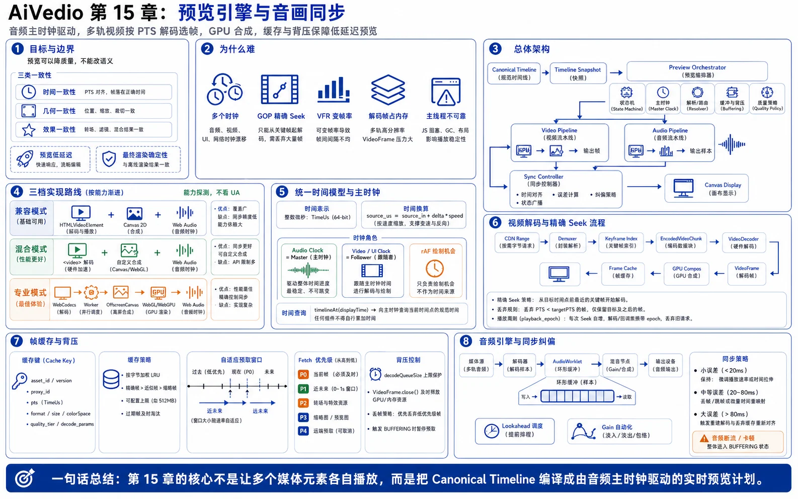

# 第 15 章：预览引擎与音画同步



> 图注：本章全文重点总结图，围绕预览语义边界、多时钟问题、音频主时钟、rAF 定位、WebCodecs 解码、精确 Seek、帧缓存背压、Web Audio 混音和音画同步纠偏展开。

上一章定义了浏览器非线性编辑器的核心数据模型：`Asset`、`Track`、`Clip`、`Effect`、`Transition`、关键帧和整数时间。本章继续回答一个更难的问题：

> 当时间轴上同时存在多路视频、音频、字幕、贴图、转场和变速片段时，浏览器怎样在用户点击播放、拖动播放头或逐帧查看时，低延迟地给出可信预览，并让声音和画面长期保持同步？

预览引擎不是简单地放置几个 `<video>` 标签。它本质上是一个运行在浏览器里的小型实时媒体系统，需要同时处理：

- 时间轴求值。
- 容器解析与媒体解码。
- GOP、关键帧和精确 Seek。
- 多轨视频合成。
- 多轨音频混音。
- 音频主时钟与视频调度。
- 变帧率素材。
- 网络预取、帧缓存和背压。
- Worker、GPU 和主线程资源隔离。
- 浏览器兼容、降级和资源释放。

本章只讨论**交互式预览**。最终导出仍由下一章的 Timeline Compiler、Render DAG 和服务端渲染系统负责。

---

## 15.1 先明确预览引擎的目标和边界

预览和最终渲染使用同一份时间轴语义，但优化目标不同。

| 维度 | 交互式预览 | 最终渲染 |
|---|---|---|
| 第一目标 | 低延迟、可交互 | 确定性、完整质量 |
| 输入素材 | 优先使用代理素材 | 使用原始素材 |
| 允许丢帧 | 过载时允许丢视频帧 | 不允许静默丢失输出帧 |
| 音频策略 | 优先保持连续，必要时整体缓冲 | 离线精确混音 |
| 特效质量 | 可按能力矩阵降级 | 按 Render Manifest 固定实现 |
| 失败方式 | 降级、暂停、重试、提示 | 任务失败、重试、断点续渲 |
| 时间要求 | 首帧和 Seek 延迟优先 | 总吞吐和成本优先 |

因此不能要求预览引擎在任何设备上实时重现所有 4K 特效，也不能因为预览允许降级，就让它与最终导出的裁剪、关键帧、转场时长或字体布局产生不同语义。

推荐定义三类一致性：

1. **时间一致性**：同一个 `timeline_us` 必须解析出相同的活动 Clip、源时间和参数值。
2. **几何一致性**：位置、缩放、旋转、锚点、裁剪、透明度和图层顺序必须一致。
3. **效果一致性**：效果可有质量档位，但曲线、参数范围和版本必须一致；不支持的效果必须显式标记为“近似预览”或“预览不可用”。

一句话概括：

> **预览可以降质量，不能改语义。**

---

## 15.2 为什么浏览器多轨预览很难

### 15.2.1 浏览器里同时存在多个时钟

常见时钟包括：

- `Date.now()`：日历时间，可能受系统时钟调整影响。
- `performance.now()`：单调高精度时钟，适合计算经过时间。
- `requestAnimationFrame()` 的时间戳：跟随浏览器绘制节奏。
- `HTMLMediaElement.currentTime`：某个媒体元素自己的播放位置。
- `AudioContext.currentTime`：Web Audio 渲染图的音频时间。
- 媒体 PTS/DTS：容器和编解码器中的展示、解码时间戳。
- 项目时间轴时间：用户看到的 `timeline_us`。

如果每个视频元素和音频元素各自推进自己的 `currentTime`，数十秒后就可能出现漂移。主线程卡顿还会让 `setInterval()` 和 `requestAnimationFrame()` 延迟，但音频硬件仍然继续播放。

因此系统必须指定一个**主时钟**，其他模块只能跟随它，不能各自推导“现在播放到哪里”。

### 15.2.2 视频不能从任意帧直接开始解码

大多数压缩视频包含 GOP。目标帧可能依赖前面的 I/P/B 帧，因此精确 Seek 通常需要：

1. 找到目标时间之前最近的关键帧。
2. 从该关键帧开始读取压缩样本。
3. 按解码顺序送入解码器。
4. 丢弃目标时间之前的输出帧。
5. 选择覆盖目标 PTS 的帧进行展示。

长 GOP 素材的拖动定位会非常慢，这也是代理视频必须采用更短 GOP 的原因之一。

### 15.2.3 帧率不一定恒定

手机录屏、会议录制和某些 AI 输出可能是 VFR。不能用：

```text
frame_index = floor(time_seconds * fps)
```

来选择帧。

正确做法是基于每一帧的 PTS 和 duration：

```text
frame.pts <= target_time < frame.pts + frame.duration
```

当 duration 缺失时，可使用下一帧 PTS 推导当前帧的展示区间。

### 15.2.4 解码后的帧非常占内存

一张 1920×1080 RGBA 帧约占：

```text
1920 × 1080 × 4 ≈ 7.9 MiB
```

一张 3840×2160 RGBA 帧约占 31.6 MiB。仅缓存 30 张 4K RGBA 帧，理论像素数据就接近 1 GiB，还没有计算解码器、GPU 纹理、音频 PCM 和 JavaScript 对象开销。

因此帧缓存必须按**字节预算**管理，而不是按“最多缓存 100 帧”管理。

### 15.2.5 主线程不可靠

主线程还要承担：

- React/Vue 渲染。
- 时间轴拖动。
- 鼠标和键盘事件。
- 自动保存。
- 字幕编辑。
- 网络回调。

WebCodecs 规范明确建议实时媒体流水线尽可能运行在 Worker 中；`VideoFrame` 还持有底层媒体资源，使用完应立即 `close()`，不能等待垃圾回收。([W3C WebCodecs][1])

---

## 15.3 总体架构

推荐把预览引擎拆成以下模块：

```text
Editor State / Canonical Timeline
              │
              ▼
      Timeline Snapshot Builder
              │
              ▼
       Preview Orchestrator
       ├── Playback State Machine
       ├── Master Clock
       ├── Timeline Resolver
       ├── Buffering Controller
       └── Capability / Quality Policy
              │
      ┌───────┴────────┐
      ▼                ▼
Video Pipeline      Audio Pipeline
├── Demuxer         ├── Audio Demux/Decode
├── Keyframe Index  ├── Clip Scheduler
├── Decode Workers  ├── Track Gain / Pan
├── Frame Cache     ├── Effects / Fades
├── Frame Selector  ├── Master Bus
└── GPU Compositor  └── AudioWorklet / Destination
      │                │
      └───────┬────────┘
              ▼
        Sync Controller
              │
              ▼
      Canvas / Display Surface

Supporting modules:
- Range Fetch Scheduler
- Proxy Manifest Client
- Resource Budget Manager
- Telemetry Collector
- Error / Fallback Manager
```

核心约束是：

> `Preview Orchestrator` 是唯一可以改变播放状态和时间锚点的模块；解码器、音频节点和渲染器只能执行带有 `playback_epoch` 的命令。

`playback_epoch` 用于解决 Seek、暂停、切换项目和异步解码之间的竞态。例如用户先 Seek 到 10 秒，又立即 Seek 到 20 秒，10 秒请求晚到的帧必须被丢弃，不能覆盖 20 秒的画面。

```text
if result.epoch != current_epoch:
    release(result)
    ignore(result)
```

---

## 15.4 三档实现路线

浏览器能力和项目复杂度差异很大，不应只实现一条路径。

### 15.4.1 兼容模式：HTMLVideoElement + Canvas + Web Audio

适合：

- 单视频轨或少量叠加。
- 简单裁剪、缩放和字幕。
- MVP 或低端设备降级。

实现方式：

- 使用 `<video>` 完成容器解析、网络缓冲和解码。
- 视频静音后绘制到 Canvas。
- 音频统一接入 Web Audio。
- 使用 `requestVideoFrameCallback()` 感知新视频帧。

优点是开发成本低，浏览器替应用处理大量媒体细节。缺点是多元素精确同步、任意逐帧 Seek、缓存控制和复杂变速能力有限。

`requestVideoFrameCallback()` 在新视频帧提交给合成器时回调，并提供 `mediaTime`、`expectedDisplayTime`、`presentedFrames` 等元数据。但它属于尽力而为机制，主线程繁忙时可能晚一个 VSync 或跳过回调，因此不能把它当作绝对主时钟。([WICG rVFC][3])

### 15.4.2 混合模式：HTMLVideoElement 解码 + 自定义合成与音频时钟

适合大多数在线编辑器：

- `<video>` 负责兼容性较强的媒体解码。
- Canvas/WebGL 负责多轨合成。
- Web Audio 作为主时钟和混音系统。
- 应用维护自己的时间轴、预加载和漂移修正。

这是工程上性价比较高的默认方案。

### 15.4.3 专业模式：WebCodecs + Worker + OffscreenCanvas + WebGL/WebGPU

适合：

- 精确帧选择。
- 多视频轨。
- 高频拖动和逐帧编辑。
- 自定义特效、遮罩、LUT 和转场。
- 对缓存、解码队列和资源释放有严格控制。

WebCodecs 直接暴露 `VideoDecoder`、`AudioDecoder`、`VideoFrame` 和 `AudioData`，但它主要提供编解码接口，不替应用完成完整的 MP4/WebM 容器调度。因此应用仍需要 JS/WASM Demuxer，或由服务端提供切片和样本索引。WebCodecs 的时间戳和 duration 使用微秒，能与本项目的整数微秒时间模型自然对齐。([W3C WebCodecs][1])

OffscreenCanvas 可以把绘制上下文转移到 Worker，Canvas 规范允许其使用 2D、WebGL、WebGL2 或 WebGPU 上下文。([WHATWG Canvas][4])

### 15.4.4 能力选择不能依赖 UA 字符串

启动编辑器时应执行能力探测：

```ts
interface PreviewCapabilities {
  webCodecs: boolean;
  offscreenCanvas: boolean;
  webgl2: boolean;
  webgpu: boolean;
  videoFrameCallback: boolean;
  audioWorklet: boolean;
}

async function detectCapabilities(): Promise<PreviewCapabilities> {
  return {
    webCodecs:
      "VideoDecoder" in globalThis &&
      typeof VideoDecoder.isConfigSupported === "function",
    offscreenCanvas: "OffscreenCanvas" in globalThis,
    webgl2: !!document.createElement("canvas").getContext("webgl2"),
    webgpu: "gpu" in navigator,
    videoFrameCallback:
      "requestVideoFrameCallback" in HTMLVideoElement.prototype,
    audioWorklet:
      "AudioWorkletNode" in globalThis,
  };
}
```

还应通过 `VideoDecoder.isConfigSupported()` 和 `navigator.mediaCapabilities.decodingInfo()` 检查具体 codec、profile、分辨率和帧率，而不是只判断 API 是否存在。Media Capabilities 返回 `supported`、`smooth` 和 `powerEfficient`，可用于选择代理清晰度和解码路径。([W3C Media Capabilities][5])

---

## 15.5 统一时间模型

### 15.5.1 所有业务时间继续使用整数微秒

```ts
type TimeUs = bigint;

interface Rational {
  num: bigint;
  den: bigint;
}
```

不要在时间轴模型中持续累加浮点秒。只在调用浏览器 API 时临时转换：

```ts
function usToSeconds(us: bigint): number {
  return Number(us) / 1_000_000;
}
```

### 15.5.2 时间轴时间到源媒体时间的映射

正向播放 Clip：

```text
source_us = source_in_us
          + (timeline_us - clip_start_us) × speed
```

使用有理数速度：

```text
source_us = source_in_us
          + floor(
              (timeline_us - clip_start_us)
              × speed_num / speed_den
            )
```

反向播放：

```text
source_us = source_out_us
          - (timeline_us - clip_start_us) × abs(speed)
```

映射函数还要处理：

- Clip 裁剪区间。
- 循环播放。
- Freeze Frame。
- 时间重映射关键帧。
- 速度曲线。
- 转场重叠区间。

### 15.5.3 不用帧编号代替时间

即使项目设置为 30 fps，源素材也可能是 23.976 fps、25 fps 或 VFR。项目帧率只是预览和最终输出的采样网格，不是源素材的事实时间轴。

逐帧前进时可以让项目播放头增加一个输出帧周期：

```text
frame_step_us = 1_000_000 × fps_den / fps_num
```

随后仍然通过 PTS 选择每个源 Clip 应展示的帧。

---

## 15.6 为什么应选择音频作为主时钟

人耳对音频爆音、断裂和节奏抖动非常敏感。音频硬件按固定采样率持续消费数据，而视频天然允许在过载时丢帧或重复一帧。因此播放期间通常采用：

```text
Audio Clock = Master
Video       = Follower
UI Playhead = Follower
```

Web Audio 的 `currentTime` 随音频渲染图推进，所有音频调度时间都使用这一坐标系。规范还提供 `getOutputTimestamp()`，将音频输出位置映射到 `performance.now()` 的时间轴；`outputLatency` 可表示缓冲区到实际输出设备之间的估计延迟。([W3C Web Audio][2])

### 15.6.1 播放锚点

开始播放时记录：

```text
anchor_timeline_us
anchor_audio_context_time
anchor_output_performance_time
playback_rate
playback_epoch
```

假设音频计划在 `context_start` 开始，使用 `getOutputTimestamp()` 将它换算为预计实际输出的 `performanceTime`：

```ts
function contextTimeToPerformanceMs(
  ctx: AudioContext,
  contextTime: number,
): number {
  const ts = ctx.getOutputTimestamp?.();

  if (ts && ts.contextTime > 0 && ts.performanceTime > 0) {
    return ts.performanceTime + (contextTime - ts.contextTime) * 1000;
  }

  // 兼容回退。outputLatency 是估计值，因此只能作为近似。
  return (
    performance.now() +
    Math.max(0, contextTime - ctx.currentTime) * 1000 +
    (ctx.outputLatency || 0) * 1000
  );
}
```

随后对预计展示时刻 `display_perf_ms` 求项目时间：

```text
timeline_us = anchor_timeline_us
            + (display_perf_ms - anchor_output_perf_ms)
              × 1000
              × playback_rate
```

### 15.6.2 没有音频时

如果当前区间完全没有可听音频，可回退到 `performance.now()` 作为主时钟。High Resolution Time 规范定义它基于单调时钟，不受系统日历时间调整影响。([W3C High Resolution Time][8])

一旦后续区间出现音频，不要无缝地让两个时钟各自继续；应在安全边界重新建立播放锚点。

### 15.6.3 暂停和拖动时没有“运行时钟”

暂停、单帧查看和拖动时，播放头是一个显式值：

```text
playhead_us = requested_timeline_us
```

此时不能让 `AudioContext.currentTime` 暗中继续改变项目播放头。恢复播放时重新创建锚点。

---

## 15.7 `requestAnimationFrame()` 的正确定位

`requestAnimationFrame()` 是**获得一次绘制机会**，不是媒体时钟。

错误写法：

```ts
let playhead = 0;
function tick() {
  playhead += 1 / 60;
  render(playhead);
  requestAnimationFrame(tick);
}
```

问题包括：

- 显示器可能是 60 Hz、90 Hz、120 Hz 或可变刷新率。
- 回调可能因主线程繁忙而延迟。
- 后台标签页可能被节流或冻结。
- 音频仍可能继续推进。

正确写法：

```ts
function tick(rafNowMs: number) {
  const predictedDisplayMs = rafNowMs + displayLeadEstimator.nextVsyncMs();
  const timelineUs = masterClock.timelineAt(predictedDisplayMs);

  const scene = timelineResolver.resolve(timelineUs);
  decodeScheduler.ensureWindow(scene, timelineUs);
  const layers = frameSelector.select(scene, timelineUs);
  compositor.render(layers, timelineUs);

  requestAnimationFrame(tick);
}
```

要点是：

> 每次绘制都重新向主时钟询问“预计屏幕显示这一帧时，项目应该处于什么时间”，而不是累计上一帧的误差。

---

## 15.8 播放状态机

建议显式维护状态机：

```text
IDLE
  └── load ──► PRIMING
PRIMING
  ├── ready ─► PAUSED
  └── error ─► ERROR
PAUSED
  ├── play ──► PRIMING_PLAY
  ├── seek ──► SEEKING
  └── close ─► IDLE
PRIMING_PLAY
  ├── ready ─► PLAYING
  ├── cancel ─► PAUSED
  └── error ─► ERROR
PLAYING
  ├── pause ─► PAUSED
  ├── seek ──► SEEKING
  ├── underrun ─► BUFFERING
  └── end ───► ENDED
SEEKING
  ├── resolved + playIntent ─► PRIMING_PLAY
  ├── resolved + pausedIntent ─► PAUSED
  └── error ─► ERROR
BUFFERING
  ├── rebuffered ─► PLAYING
  ├── seek ───────► SEEKING
  └── error ──────► ERROR
```

每次以下操作都增加 `playback_epoch`：

- Seek。
- 切换项目版本。
- 修改影响当前帧的时间轴。
- 改变播放方向。
- 切换代理清晰度。
- 重建音频图。

所有异步结果携带 epoch：

```ts
interface EpochResult<T> {
  epoch: number;
  value: T;
}
```

这比试图取消所有已经进入浏览器解码器的工作更可靠。

---

## 15.9 视频解码流水线

### 15.9.1 WebCodecs 路线需要 Demuxer

典型流程：

```text
Signed CDN URL / Range Request
           │
           ▼
        Demuxer
        ├── init/config
        ├── sample table
        ├── PTS/DTS
        ├── keyframe flag
        └── byte range
           │
           ▼
  EncodedVideoChunk
           │
           ▼
      VideoDecoder
           │
           ▼
        VideoFrame
           │
           ▼
 Frame Cache / GPU Compositor
```

Demuxer 必须保留：

- codec configuration record。
- 解码顺序。
- PTS。
- duration。
- 关键帧标记。
- 旋转、像素宽高比和色彩信息。

向解码器喂入时按容器样本所需的解码顺序，展示选择则依据输出帧 PTS。WebCodecs 要求视频解码输出按展示顺序交付。

### 15.9.2 精确 Seek 算法

```text
Input: asset_id, target_source_us, epoch

1. 查询 keyframe_index，找到 K：
   K.pts <= target_source_us 且 K 最接近目标。
2. 取消该资产旧 epoch 的 fetch/decode 结果。
3. reset 或重建 VideoDecoder。
4. 从 K 对应的字节范围开始取样本。
5. 从关键帧开始依次 decode。
6. 对每个输出 VideoFrame：
   - 若 epoch 过期，立即 close。
   - 若 frame_end <= target，释放。
   - 若 frame 覆盖 target，保留为目标帧。
7. 再解码少量前向帧，建立播放预热窗口。
8. 将目标帧交给 compositor。
```

伪代码：

```ts
async function decodeFrameAt(
  asset: AssetManifest,
  targetUs: bigint,
  epoch: number,
): Promise<VideoFrame> {
  const keyframe = asset.video.index.floorKeyframe(targetUs);
  const session = await decoderPool.open(asset, epoch);

  for await (const sample of demuxer.readFrom(keyframe.byteOffset)) {
    if (epoch !== currentPlaybackEpoch()) {
      throw new DOMException("stale seek", "AbortError");
    }

    session.decode(sample.toEncodedVideoChunk());

    for (const frame of session.drainAvailableFrames()) {
      const start = BigInt(frame.timestamp);
      const end = start + inferFrameDurationUs(frame, session);

      if (end <= targetUs) {
        frame.close();
        continue;
      }

      if (start <= targetUs) {
        return frame;
      }

      // 素材时间戳有缺口时，按项目语义决定保持上一帧还是透明。
      frame.close();
      throw new Error("no frame covers target timestamp");
    }
  }

  throw new Error("target frame not found");
}
```

生产代码不能只调用 `flush()` 等待全部数据再显示，否则 Seek 延迟会被无谓放大。应通过输出回调增量接收帧，并对队列做上限控制。

### 15.9.3 连续播放时的帧选择

在音频主时钟给出 `target_us` 后：

1. 删除明显早于目标的旧帧。
2. 选择 PTS 不晚于目标、且展示区间覆盖目标的最新帧。
3. 若下一帧还未到，短时间重复当前帧。
4. 若解码严重落后，丢弃过期帧并从最近关键帧重新追赶。
5. 绝不能为了“补完所有帧”而排队播放过期画面。

```text
Audio must stay real-time.
Video may drop stale frames.
```

### 15.9.4 VFR 处理

VFR 的关键规则：

- 缓存键使用 PTS，不使用 frame index。
- duration 优先来自容器或 `VideoFrame.duration`。
- duration 缺失时用下一帧 PTS 差值推导。
- 最后一帧 duration 使用容器轨道结束时间或显式边界。
- 检测重复 PTS、倒退 PTS 和异常大间隔。
- 代理素材若被转为 CFR，Manifest 必须声明它与规范化源时间轴的映射方式。

### 15.9.5 反向播放

常规视频编解码器不擅长反向增量解码。可选方案：

1. 从关键帧向前解码一个 GOP，把帧放入内存后逆序展示。
2. 服务端生成反向代理素材。
3. 对长反向片段提前离线生成预览代理。
4. 低端设备只提供降低分辨率或降低帧率的反向预览。

不能简单把 `playbackRate` 设为负数并假设所有视频解码路径都支持。

---

## 15.10 帧缓存与解码背压

### 15.10.1 缓存键

```text
FrameCacheKey =
  asset_id
  + asset_version
  + proxy_variant
  + pts_us
  + decode_format
  + display_size_bucket
```

不要只使用 `asset_id + frame_index`。

### 15.10.2 按字节加权的 LRU

每个缓存项记录：

```ts
interface CachedFrame {
  frame: VideoFrame;
  byteEstimate: number;
  ptsUs: bigint;
  durationUs: bigint;
  lastAccessTick: number;
  pinCount: number;
}
```

淘汰顺序：

1. 非当前播放窗口。
2. 非转场依赖帧。
3. 距离播放头最远。
4. 最近最少访问。

淘汰时立即调用：

```ts
cached.frame.close();
```

WebCodecs 的底层资源可能占用 CPU/GPU 内存和硬件解码句柄；规范明确要求尽快释放。([W3C WebCodecs][1])

### 15.10.3 自适应预取窗口

不要固定“永远预取后 10 秒”。推荐根据以下因素动态计算：

- 当前播放速度。
- 网络吞吐和 Range 请求延迟。
- 解码耗时。
- 活动视频轨数量。
- 即将到来的转场。
- 内存预算。
- 播放方向。

例如正常正向播放可以使用：

```text
behind_window = 100～300 ms
forward_window = 800～2500 ms
```

这些只是初始工程参数，应由设备性能和实际遥测调整。

转场前需要同时预热出片和入片；Clip 边界前应提前准备下一段 codec config、关键帧范围和首批帧。

### 15.10.4 Fetch 优先级

```text
P0：当前播放头所需的精确帧和音频
P1：未来约 0.5 秒连续播放窗口
P2：即将发生的转场另一侧素材
P3：播放头附近的缩略图和波形细节
P4：远端预测预取
```

Seek 后必须取消或降级旧位置的低优先级请求，避免网络带宽继续服务已经过期的播放窗口。

### 15.10.5 解码队列上限

利用 `decodeQueueSize`、帧缓存字节数和输出速度做背压：

```text
if decode_queue_too_large:
    stop feeding chunks
if frame_cache_over_budget:
    evict unpinned frames
if compositor_is_late:
    reduce preview quality or active decode window
```

不要把整段视频的所有压缩样本一次性送入 `VideoDecoder`。

---

## 15.11 音频引擎

### 15.11.1 音频图

推荐结构：

```text
Clip Source
   │
   ├── Clip Gain / Fade / Mute
   ├── Clip Effects
   ▼
Track Gain / Pan / Track Effects
   │
   ▼
Group Bus（可选）
   │
   ▼
Master Compressor / Limiter / Master Gain
   │
   ▼
AudioDestinationNode
```

Web Audio 以 `AudioNode` 路由图为核心，参数自动化可以按 `AudioContext.currentTime` 精确调度。([W3C Web Audio][2])

### 15.11.2 两类音频播放方式

#### 方式 A：AudioBufferSourceNode 分段调度

适合：

- 短音频。
- 已解码 PCM。
- 需要精确起停、淡入淡出和多轨混音。

注意 `AudioBufferSourceNode.start()` 只能调用一次。每次 Seek、重新播放或重新调度都必须创建新节点。([W3C Web Audio][2])

#### 方式 B：WebCodecs AudioDecoder + AudioWorklet 环形缓冲

适合：

- 长音频。
- 大量轨道。
- 需要流式解码。
- 需要自定义时间伸缩、响度或采样级处理。

```text
AudioDecoder
    │ AudioData / PCM chunks
    ▼
Shared / Message Ring Buffer
    │
    ▼
AudioWorkletProcessor
    │
    ▼
Track / Master Audio Graph
```

AudioWorklet 在音频渲染线程上同步处理自定义节点，比在主线程用定时器推送 PCM 稳定。([W3C Web Audio][2])

如果使用 `SharedArrayBuffer` 降低复制成本，需要正确配置跨源隔离，并确保 CDN 媒体、Worker 和 WASM 资源满足 CORS/CORP 要求。

### 15.11.3 音频调度采用 Lookahead

主线程或 Worker 定期补充未来一小段音频事件：

```text
scheduler_tick = 20～50 ms
lookahead      = 150～300 ms
```

这些值是初始参数，不是标准要求。

Lookahead 太短，主线程短暂卡顿就会产生 underrun；太长，用户 Seek 后已排队的旧音频难以及时撤销。

推荐使用“播放世代 + 主增益淡出”处理重调度：

1. 新建 epoch。
2. 旧 Master Gain 在极短时间内平滑降到 0，避免 click。
3. 停止并释放旧 SourceNode。
4. 为新位置创建节点和自动化事件。
5. 新 Master Gain 从 0 平滑进入。

### 15.11.4 淡入淡出不要靠高频 JavaScript 赋值

错误：

```ts
setInterval(() => {
  gain.gain.value += 0.01;
}, 10);
```

正确：

```ts
const now = audioContext.currentTime;
gain.gain.cancelScheduledValues(now);
gain.gain.setValueAtTime(gain.gain.value, now);
gain.gain.linearRampToValueAtTime(targetGain, now + durationSec);
```

### 15.11.5 变速和保留音调

直接改变 `playbackRate` 通常会同时改变速度和音调。若产品要求“变速不变调”，需要：

- AudioWorklet/WASM 中实现 WSOLA、phase vocoder 等时间伸缩算法。
- 或由服务端生成变速音频代理。
- 或明确限定支持的速度范围和预览质量。

时间伸缩会引入算法延迟，必须纳入音画同步补偿。

### 15.11.6 采样率和声道

建议代理音频统一为明确的采样率和声道布局，例如 48 kHz 立体声，但 Manifest 仍应记录真实值。浏览器可能执行重采样，专业模式应把重采样延迟和输出帧数纳入时钟模型。

---

## 15.12 音画同步算法

### 15.12.1 定义误差

```text
video_error_us = selected_video_pts_us - target_timeline_mapped_source_us
```

从用户体验角度，更重要的是：

```text
presentation_error_us =
  actual_video_display_time
  - corresponding_audio_output_time
```

由于浏览器无法总是直接给出最终像素真正亮起的时刻，通常使用：

- `AudioContext.getOutputTimestamp()`。
- `requestAnimationFrame()` 预计展示时刻。
- `requestVideoFrameCallback().expectedDisplayTime`。
- GPU 提交耗时与历史 VSync 间隔。

构建近似估计。

### 15.12.2 分级纠偏

以下阈值应通过产品和设备测试校准，不能当成行业标准。示例策略：

```text
|error| <= soft_threshold
    正常播放，不做抖动式纠偏

video slightly ahead
    暂时保持上一帧

video slightly behind
    丢弃过期视频帧，选择最新可用帧

|error| >= hard_threshold
    重置该视频解码会话，从关键帧重新追赶

persistent audio underrun
    整体进入 BUFFERING，重新建立音频和视频锚点
```

核心原则：

- 不通过反复改变项目播放头修正误差。
- 不让多个轨道分别暂停和继续。
- 视频过载时优先丢弃视频帧。
- 音频发生实质性断流时，整体暂停并重新 Prime。

### 15.12.3 HTMLVideoElement 跟随模式

若某些轨道由 `<video>` 播放：

- 所有元素应静音，避免多个独立音频时钟。
- 音频由统一 Web Audio 图输出。
- 小误差可短暂调整 follower 的 `playbackRate`。
- 大误差直接设置 `currentTime` 并等待 Seek 完成。
- 调整必须设置上限，不能让用户明显感受到速度波动。

单视频、单音轨场景可以让一个媒体元素自己维护音画同步；一旦进入多轨混音，就应回到统一主时钟。

### 15.12.4 `requestVideoFrameCallback()` 的使用方式

适合：

- 知道 `<video>` 何时产生新帧。
- 将视频帧绘制到 Canvas。
- 监控 `presentedFrames` 跳变。
- 使用 `mediaTime` 检查帧位置。
- 使用 `expectedDisplayTime` 估算是否晚一拍。

不适合：

- 作为整个项目时间轴的唯一时钟。
- 假设每个源视频帧必然产生一次回调。
- 在主线程严重卡顿时保证逐帧处理。

### 15.12.5 后台标签页

页面进入 `hidden` 后，浏览器可能节流绘制和定时器。推荐策略：

- 编辑器预览自动暂停。
- 记录用户的 `playIntent`。
- 取消高成本视频预解码。
- 保留最小状态，不继续扩大缓存。
- 页面恢复可见后重新 Prime，而不是假设旧 rAF 序列连续。

---

## 15.13 Seek、Scrub 和逐帧操作

### 15.13.1 普通 Seek

完整流程：

```text
1. playback_epoch++
2. 记录用户最终意图：暂停或继续播放
3. 快速淡出并停止旧音频图
4. 取消旧位置的低优先级 Fetch
5. Resolver 计算目标时间的活动 Clip
6. 为每个可见视频 Clip 找关键帧并解码目标帧
7. 合成目标静态画面
8. 准备目标时间附近的音频和未来视频窗口
9. 建立新主时钟锚点
10. 若 playIntent=true，则进入 PLAYING
```

### 15.13.2 高频拖动

拖动过程中每个 pointermove 都做完整精确 Seek 会产生请求风暴。推荐两阶段策略：

#### 粗略阶段

- 合并事件，只保留最新位置。
- 优先使用缩略图精灵图、低分辨率全 I 帧代理或已缓存帧。
- 限制解码并发。
- 不启动完整音频图。

#### 停稳阶段

- debounce 很短时间后执行精确 Seek。
- 解码覆盖目标 PTS 的准确帧。
- 刷新高质量预览。
- 预热目标位置附近窗口。

### 15.13.3 音频 Scrub

专业编辑器可在拖动时播放播放头附近几十毫秒的音频颗粒，但要：

- 限制触发频率。
- 使用短淡入淡出避免 click。
- 不让多个颗粒无限叠加。
- 用户快速拖动时自动静音或降低密度。

### 15.13.4 逐帧前进和后退

- 项目播放头按项目帧率网格前进或后退。
- 每个源 Clip 仍按其 PTS 选择帧。
- VFR 素材不能假设“上一帧 = 当前时间减 1/fps”。
- 若产品提供“按源帧步进”，则必须依赖样本索引查找相邻 PTS。

---

## 15.14 Canvas、OffscreenCanvas、WebGL 和 WebGPU

### 15.14.1 Canvas 2D

适合：

- 少量图层。
- 简单 `drawImage`。
- 基础文字、贴图和裁剪。
- 兼容模式。

缺点：

- 多轨和高分辨率时 CPU/GPU 数据路径不易控制。
- 复杂滤镜和转场性能有限。
- 大量状态切换和像素读回代价高。

### 15.14.2 WebGL/WebGPU 合成

典型 GPU 流水线：

```text
VideoFrame / ImageBitmap
        │
        ▼
   Texture / External Texture
        │
        ├── transform matrix
        ├── crop / mask
        ├── opacity / blend
        ├── LUT / color adjustment
        ├── transition shader
        └── text / overlay texture
        │
        ▼
      Framebuffer
        │
        ▼
      Canvas Surface
```

WebGL 2 基于 OpenGL ES 3.0 风格接口；WebGPU 更贴近现代 GPU 管线，适合复杂批处理和未来计算型效果，但必须保留 WebGL/Canvas 降级路径。([Khronos WebGL 2][7])([W3C WebGPU][6])

### 15.14.3 Worker 划分

推荐：

```text
Main Thread
├── UI
├── editor commands
├── timeline state
└── lightweight orchestration

Decode Worker Pool
├── range fetch
├── demux
├── VideoDecoder / AudioDecoder
└── cache admission

Render Worker
├── OffscreenCanvas
├── WebGL/WebGPU context
├── frame composition
└── compositor telemetry

Audio Rendering Thread
└── AudioWorkletProcessor
```

不要创建“每个 Clip 一个 Worker”。Worker、解码器和 GPU 上下文都应由有界池管理。

### 15.14.4 避免主线程和 Worker 之间的复制风暴

- `VideoFrame` 可转移时使用 transferable。
- 同一帧只交给一个明确所有者。
- 跨线程协议记录所有权变化。
- 不需要 CPU 像素时不要调用 `copyTo()`。
- 避免先转 RGBA 再上传 GPU，优先使用浏览器可直接采样的媒体源路径。

### 15.14.5 色彩、旋转和显示尺寸

必须区分：

- coded width/height。
- visible rectangle。
- display width/height。
- 像素宽高比。
- rotation/flip 元数据。
- color primaries、transfer、matrix 和 full/limited range。

旋转元数据只能应用一次。代理素材若已把旋转烘焙进像素，就必须在 Manifest 中标记为 normalized，避免前端再旋转一次。

为了降低跨浏览器差异，普通 SDR 编辑可把代理规范化为明确的 BT.709/sRGB 工作空间。HDR 预览应作为单独能力档位，不能默认所有显示链路都正确支持。

---

## 15.15 代理视频不是“随便压小一点”

预览代理需要为编辑行为设计。

### 15.15.1 推荐属性

- 浏览器兼容性好的 codec/profile。
- 720p 或 1080p 多档代理。
- 更短 GOP。
- 可选低分辨率全 I 帧 Scrub 代理。
- 明确时间戳和 duration。
- 统一旋转处理。
- 统一 SDR 色彩空间。
- 音频采样率和声道布局规范化。
- 保留与原始素材时间轴的稳定映射。

短 GOP 能降低 Seek 解码放大，但会提高码率和存储成本。因此可生成两类代理：

```text
playback_proxy：短 GOP、较高压缩效率，用于连续播放
scrub_proxy：更低分辨率、极短 GOP 或全 I 帧，用于快速拖动
```

### 15.15.2 代理 Manifest

```json
{
  "asset_id": "ast_123",
  "asset_version": 7,
  "checksum": "sha256:...",
  "duration_us": 125400000,
  "normalized_rotation": true,
  "video": {
    "codec": "avc1.4d401f",
    "width": 1280,
    "height": 720,
    "vfr": false,
    "time_base": { "num": 1, "den": 1000000 },
    "color_space": "bt709",
    "init_segment_url": "https://cdn.example/...",
    "sample_index_url": "https://cdn.example/...",
    "keyframe_index_url": "https://cdn.example/..."
  },
  "audio": {
    "codec": "mp4a.40.2",
    "sample_rate": 48000,
    "channels": 2,
    "sample_index_url": "https://cdn.example/..."
  },
  "variants": [
    { "name": "playback-720p", "bitrate": 1800000 },
    { "name": "scrub-360p-intra", "bitrate": 2400000 }
  ],
  "thumbnail_sprite_url": "https://cdn.example/...",
  "waveform_url": "https://cdn.example/..."
}
```

Manifest 必须不可变或带版本号。签名 URL 可以刷新，但 `asset_version`、checksum 和样本索引不能在同一会话中悄悄变化。

---

## 15.16 Go 后端需要为预览引擎提供什么

浏览器专业预览的性能，部分取决于后端是否提供了可高效随机访问的媒体资产。

### 15.16.1 接口建议

```http
GET /v1/projects/{project_id}/preview-manifest?revision=42
GET /v1/assets/{asset_id}/preview-manifest?version=7
POST /v1/assets/{asset_id}/refresh-preview-urls
```

响应中提供：

- 项目 revision。
- 资产 checksum。
- 代理档位。
- codec config。
- duration。
- 关键帧索引。
- 样本或分片索引。
- 波形和缩略图地址。
- 字体、LUT 和效果版本。
- 签名 URL 过期时间。

### 15.16.2 媒体字节不要经 Go API 中转

Go 服务负责鉴权和生成短期访问凭据，浏览器通过 CDN/Object Storage Range Request 获取媒体。这样避免：

- Go 连接长期占用。
- 双倍带宽。
- 额外内存复制。
- API 节点成为媒体吞吐瓶颈。

### 15.16.3 CDN 和 CORS

浏览器将跨源视频绘制到 Canvas 或通过 Fetch 交给 Demuxer 时，需要正确 CORS。应确保：

- CDN 返回允许编辑器源站的 `Access-Control-Allow-Origin`。
- `<video crossOrigin="anonymous">` 在设置 `src` 之前配置。
- Range 请求、预检和签名参数被 CDN 正确处理。
- 使用跨源隔离时，资源同时满足 COEP/CORP/CORS 约束。

否则 Canvas 可能变为非 origin-clean，像素读回、截图或后续处理会被阻止。Canvas 规范定义了 origin-clean 安全模型。([WHATWG Canvas][4])

### 15.16.4 索引生成

媒体处理 Worker 在入库阶段生成：

```text
media metadata
keyframe index
sample index / segment map
proxy variants
thumbnail sprite
waveform peaks
color / rotation normalization metadata
```

预览请求不能临时启动 FFmpeg 扫描整个原始文件来找关键帧。

---

## 15.17 资源生命周期

### 15.17.1 需要显式释放的资源

- `VideoFrame.close()`。
- `AudioData.close()`。
- `VideoDecoder.close()` / `reset()`。
- `AudioDecoder.close()` / `reset()`。
- `AudioBufferSourceNode.stop()` 后断开连接。
- `URL.revokeObjectURL()`。
- WebGL texture、buffer、framebuffer、program。
- WebGPU buffer、texture 和相关资源。
- AbortController 管理的 Fetch。
- Worker。
- 定时器、rAF、rVFC 回调。

### 15.17.2 所有权模型

建议规定：

```text
Decoder output callback owns VideoFrame
    ↓ transfer
FrameCache owns VideoFrame
    ↓ pin
Compositor borrows VideoFrame
    ↓ render done
FrameCache unpins VideoFrame
    ↓ eviction
FrameCache closes VideoFrame
```

任何异常分支都必须能走到释放路径。

### 15.17.3 解码器池

硬件解码会占用稀缺句柄。应设置：

- 全局最大视频解码器数。
- 单项目最大活动解码器数。
- 单轨预热上限。
- 空闲超时。
- 高分辨率和低分辨率不同权重。

不可见轨道、完全被上层不透明画面遮挡的轨道和静态 Freeze Frame，不应继续持续解码。

### 15.17.4 GPU Context Lost

WebGL/WebGPU 上下文可能因驱动、内存压力或系统切换而丢失。处理流程：

1. 停止提交新帧。
2. 保持项目播放状态，但必要时进入 BUFFERING。
3. 释放或标记失效的 GPU 资源。
4. 重建上下文和管线。
5. 从 Frame Cache 或解码器重新上传当前窗口。
6. 超过重试上限则降级到 Canvas 2D 或低质量模式。

---

## 15.18 质量自适应和过载策略

预览引擎必须有明确降级顺序：

```text
1. 缩短远端预取窗口
2. 降低非焦点轨道代理分辨率
3. 降低预览输出分辨率
4. 跳过高成本非关键效果
5. 降低视频展示帧率
6. 暂停不可见轨道解码
7. 切换 WebGPU → WebGL → Canvas 2D
8. 仍无法维持音频连续时，整体进入 BUFFERING
```

不应优先降低：

- 时间轴语义。
- Clip 边界。
- 音频节奏。
- 字幕时间。
- 转场实际起止时间。

每个效果应声明预览支持级别：

```ts
type PreviewSupport =
  | "exact"
  | "approximate"
  | "disabled-low-power"
  | "render-only";
```

---

## 15.19 可观测性

预览问题只在某些设备、浏览器、素材和时间轴组合下出现，因此必须具备客户端遥测。

### 15.19.1 核心指标

```text
preview_startup_ms
seek_to_first_frame_ms
seek_to_stable_frame_ms
buffering_count
buffering_duration_ms
audio_underrun_count
video_late_frame_count
video_dropped_frame_count
av_drift_ms
rAF_interval_ms
compositor_cpu_ms
compositor_gpu_ms
decode_queue_size
frame_cache_bytes
frame_cache_hit_ratio
range_fetch_latency_ms
range_fetch_cancel_count
decoder_reset_count
gpu_context_lost_count
quality_downgrade_count
```

### 15.19.2 不要逐帧打日志

逐帧日志会放大性能问题。推荐：

- 内存环形诊断缓冲。
- 每几秒聚合一次分位数。
- 发生异常时上传最近若干秒摘要。
- 通过采样控制遥测成本。

### 15.19.3 关联字段

```text
editor_session_id
project_id
project_revision
asset_id
asset_version
playback_epoch
preview_engine
browser_family
capability_tier
proxy_variant
```

不要上传用户原始提示词、字幕正文或媒体内容作为普通性能日志。

---

## 15.20 测试策略

### 15.20.1 媒体夹具

至少准备：

- CFR 24/25/30/60 fps。
- 23.976、29.97 等有理帧率。
- VFR。
- 长 GOP。
- 含 B 帧。
- 无音频视频。
- 纯音频。
- 44.1 kHz 和 48 kHz。
- 单声道、立体声和多声道。
- 旋转元数据。
- 非方形像素。
- HDR/SDR。
- 损坏尾部或异常时间戳。
- 超短 Clip 和跨 Clip 转场。

### 15.20.2 可注入时钟

不要让所有测试依赖真实 `performance.now()`。为 Clock、Scheduler 和 Resolver 注入测试时钟：

```ts
interface MonotonicClock {
  nowMs(): number;
}
```

这样可以确定性测试：

- 暂停后时间不推进。
- 2x 播放映射。
- Seek 后旧 epoch 结果被丢弃。
- 长时间播放不累积浮点误差。
- 音频输出延迟变化后的重锚定。

### 15.20.3 Golden Frame

对固定时间点：

1. 解析活动 Clip。
2. 选择源帧。
3. 执行变换和合成。
4. 与 Golden Image 做容差比较。

GPU 和浏览器色彩路径存在微小差异，因此比较应使用合理容差，并把几何错误与色彩误差分开。

### 15.20.4 音画同步测试片

生成包含规律闪光和同步 click 的测试素材：

```text
每 1 秒：
- 画面出现白色方块
- 音频产生短脉冲
```

通过浏览器遥测、录屏回放或外部测量验证漂移和 Seek 后重新同步能力。

### 15.20.5 压力和竞态测试

重点覆盖：

- 快速连续 Seek 100 次。
- 播放中修改当前 Clip。
- 切换代理档位。
- CDN Range 请求延迟和失败。
- 解码器报错。
- 页面隐藏再恢复。
- GPU Context Lost。
- 内存预算持续触发淘汰。
- 8～16 路活动视频轨。
- 音频 Worklet 短暂供给不足。

---

## 15.21 常见错误与正确处理

| 错误做法 | 后果 | 正确处理 |
|---|---|---|
| 用 rAF 次数累计播放时间 | 刷新率和卡顿导致漂移 | 每帧读取主时钟 |
| 多个 `<video>` 各自输出音频 | 多时钟长期漂移 | 统一 Web Audio 主时钟和混音 |
| 用 `time * fps` 选择 VFR 帧 | 选错帧、卡顿 | 使用 PTS 和 duration |
| 每次拖动都完整精确 Seek | 请求和解码风暴 | 粗略 Scrub + 停稳后精确 Seek |
| 从目标时间直接喂解码器 | 非关键帧无法独立解码 | 回退最近关键帧顺序解码 |
| 缓存固定帧数 | 4K 素材瞬间打满内存 | 按字节和资源权重预算 |
| 等垃圾回收释放 VideoFrame | 解码停滞、GPU 内存高 | 显式 `close()` |
| 所有帧都从 Worker 转为 RGBA | 复制和上传成本过高 | 尽量保留 VideoFrame/GPU 路径 |
| 代理视频 GOP 仍很长 | Seek 慢 | 编辑友好型短 GOP 代理 |
| 音频 underrun 时只暂停视频 | 音画关系彻底失效 | 整体 BUFFERING 并重新锚定 |
| URL 刷新后资产版本也变化 | 同一时间轴帧不稳定 | URL 可变，Manifest/Checksum 不变 |
| Canvas 跨源配置缺失 | Canvas 被污染 | CDN CORS + 正确 crossOrigin |
| 预览效果默默省略 | 用户误判最终结果 | 显式效果支持矩阵和提示 |

---

## 15.22 面试高频追问

### 问题一：为什么不能用 `requestAnimationFrame()` 当播放时钟？

参考回答：

> rAF 只表示浏览器给了我一次绘制机会，它受显示刷新率、主线程负载和页面可见性影响。音频硬件可能在 rAF 延迟时继续播放，所以我把 Web Audio 输出时钟作为主时钟，每次 rAF 都根据预计展示时刻重新计算项目时间，避免累计漂移。

### 问题二：为什么音频做主时钟？

参考回答：

> 音频按固定采样率持续输出，人耳对断裂和节奏抖动更敏感；视频可以在过载时丢帧或重复帧。因此音频保持连续，视频根据音频时间选择最新有效帧。音频真正 underrun 时则整体进入 Buffering，重新建立锚点。

### 问题三：WebCodecs 和 `<video>` 怎样选？

参考回答：

> `<video>` 兼容性和容器处理成本低，适合简单或降级模式；WebCodecs 适合精确帧选择、多轨、Worker 解码和自定义缓存，但需要自己处理 Demux、样本索引、GOP Seek、背压和资源释放。生产系统通常有兼容、混合和专业三档，而不是只押一条路径。

### 问题四：精确 Seek 为什么要回退关键帧？

参考回答：

> 目标帧通常依赖前面的参考帧，不能独立解码。我通过服务端生成的关键帧索引找到目标之前最近的关键帧，从那里开始按解码顺序喂样本，丢弃目标前输出，直到拿到 PTS 覆盖目标时间的帧。

### 问题五：怎样处理 VFR？

参考回答：

> 不根据 fps 计算 frame index，所有选择都基于 PTS 和 duration。duration 缺失时用下一帧 PTS 推导。项目输出帧率只是采样网格，源素材事实仍是时间戳序列。

### 问题六：为什么预览一定需要代理视频？

参考回答：

> 原始素材可能是 4K/8K、高码率、H.265、长 GOP、HDR 或带旋转元数据，不适合多轨浏览器实时编辑。代理素材通过分辨率、短 GOP、统一色彩和音频格式降低 Seek、解码和合成成本，最终导出再替换回原始素材。

### 问题七：如何避免快速 Seek 的旧帧覆盖新帧？

参考回答：

> 每次 Seek 增加 playback_epoch，所有 Fetch、Demux、Decode 和 Render 结果都携带 epoch。晚到结果如果 epoch 不等于当前值，立即释放并忽略。这样不依赖底层 API 是否能完全取消已提交工作。

### 问题八：如何控制内存？

参考回答：

> 按字节预算而不是帧数做加权 LRU，区分 CPU 帧、GPU 纹理和解码器句柄；只缓存播放头附近窗口，转场帧可暂时 pin；淘汰时显式 close VideoFrame，并限制解码队列和活动解码器数。

### 问题九：如何保证预览和最终导出一致？

参考回答：

> 两端共享 Canonical Timeline 语义、时间映射、关键帧插值、转场曲线、字体和效果版本。预览可以使用代理和低质量 shader，但不能改变时间和几何语义；每个效果声明 exact、approximate 或 render-only，最终导出由不可变 Render Manifest 固定版本。

---

## 15.23 本章总结

一个可靠的浏览器预览引擎，应遵守以下原则：

1. **项目时间使用整数微秒和有理数，不累计浮点帧时间。**
2. **播放时以音频输出时钟为主，视频和 UI 都是 follower。**
3. **rAF 是绘制机会，不是媒体时钟。**
4. **视频按 PTS 和 duration 选择，VFR 不能用 fps 推帧号。**
5. **精确 Seek 从最近关键帧开始解码。**
6. **WebCodecs 路线必须自行处理 Demux、索引、背压和资源释放。**
7. **帧缓存按字节预算管理，VideoFrame 用完立即 close。**
8. **拖动使用粗略预览，停稳后再做精确 Seek。**
9. **代理素材要为编辑设计：短 GOP、多档分辨率、明确时间映射。**
10. **过载时先降视频质量和帧率，不能让音频和时间轴语义漂移。**
11. **所有异步媒体操作使用 playback_epoch 防止迟到结果污染当前画面。**
12. **预览可降质量，但必须与最终渲染共享同一套时间和几何语义。**

面试中可以用一句话收束：

> **我们的预览引擎不是让多个媒体元素各自播放，而是把 Canonical Timeline 编译成一个由音频主时钟驱动的实时执行计划：音频按采样调度，视频按 PTS 解码与选帧，GPU 按显示时刻合成，网络、解码和缓存都受有界背压控制。**

[1]: https://www.w3.org/TR/webcodecs/ "WebCodecs"
[2]: https://www.w3.org/TR/webaudio-1.1/ "Web Audio API 1.1"
[3]: https://wicg.github.io/video-rvfc/ "HTMLVideoElement.requestVideoFrameCallback()"
[4]: https://html.spec.whatwg.org/multipage/canvas.html "HTML Standard: Canvas and OffscreenCanvas"
[5]: https://www.w3.org/TR/media-capabilities/ "Media Capabilities"
[6]: https://www.w3.org/TR/webgpu/ "WebGPU"
[7]: https://registry.khronos.org/webgl/specs/latest/2.0/ "WebGL 2.0 Specification"
[8]: https://www.w3.org/TR/hr-time-3/ "High Resolution Time"
