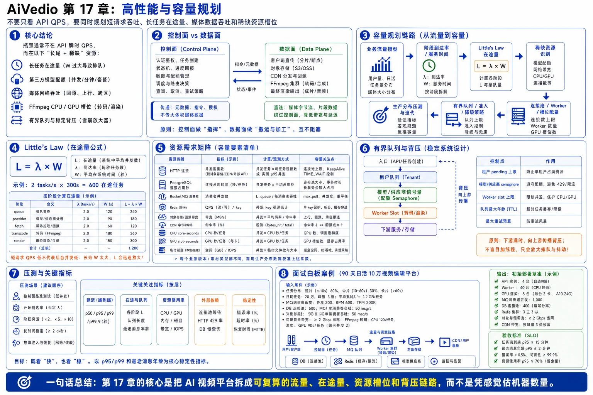

# 第 17 章：高性能与容量规划



> 图注：本章全文重点总结图，围绕控制面与数据面拆分、业务流量模型、Little's Law、资源需求矩阵、有界队列、背压传播、压测指标和容量验收标准展开。

> **本章核心结论：**AI 视频平台的性能瓶颈通常不在 API 的瞬时 QPS，而在长任务的在途量、第三方模型配额、媒体网络吞吐、FFmpeg CPU/GPU 槽位，以及系统在过载时能否形成有界排队和稳定背压。
>
> 容量规划不是“机器配置估算”，而是一条可以复算的工程链路：
>
> ```text
> 业务流量模型
>    ↓
> 各阶段到达率与服务时间
>    ↓
> Little's Law 计算在途量
>    ↓
> 找出最稀缺资源和最大稳定吞吐
>    ↓
> 配置连接池、消费者、Worker 与并发槽位
>    ↓
> 设置有界队列、准入和降级策略
>    ↓
> 用贴近生产分布的压测验证 p95/p99、积压和恢复能力
> ```

---

## 17.0 本章目标

学完本章后，应能够：

1. 区分 AI 视频平台的**控制面**与**数据面**，避免让业务 API 承担媒体传输和计算密集型工作。
2. 使用 Little’s Law 从任务到达率和耗时估算平均在途任务数。
3. 分别计算 HTTP、PostgreSQL、RocketMQ、Redis、对象存储、CPU、GPU 和临时磁盘的容量需求。
4. 判断系统的真正瓶颈，而不是看到 CPU 不高就误判系统仍有余量。
5. 为每个阶段建立有界队列、并发槽位、最大等待时间和背压策略。
6. 设计不会被平均值欺骗的性能测试，正确解释 p50、p95 和 p99。
7. 完成一套可在面试中白板推导的 AI 视频系统容量计算。

面试中要先给出一句判断：

> **AI 视频平台要同时规划三类容量：短请求吞吐、长任务在途量、媒体数据吞吐。三者单位不同，不能只用一个 QPS 指标描述。**

---

## 17.1 先区分控制面与数据面

### 17.1.1 控制面

控制面处理的是小数据、短事务和状态决策，例如：

- 身份认证和权限检查。
- 创建生成任务。
- 参数校验和内容审核结果写入。
- 额度预占、结算和退款。
- 任务状态机迁移。
- 调度、路由和并发准入。
- 查询任务快照。
- 回调验签与事件归一化。
- 生成预签名 URL。

控制面的典型资源是：

- Go goroutine。
- HTTP 连接。
- PostgreSQL 连接和事务。
- Redis 操作。
- RocketMQ 消费线程。

控制面通常追求低延迟、强一致边界和快速失败。

### 17.1.2 数据面

数据面处理的是大文件、长连接和计算密集型工作，例如：

- 浏览器直传参考视频。
- 从供应商回源生成结果。
- 对象存储读写。
- FFmpeg 探测、转码、切片和缩略图生成。
- CDN 分发。
- 最终渲染。
- WebRTC 或其他实时媒体流。

数据面的典型资源是：

- 网络带宽。
- 对象存储吞吐。
- CPU core-seconds。
- GPU 编解码或计算槽位。
- 内存。
- 本地临时磁盘容量与 IOPS。

### 17.1.3 为什么必须分离

| 维度 | 控制面 | 数据面 |
|---|---|---|
| 单次数据量 | KB 级为主 | MB～GB 级 |
| 执行时间 | 毫秒～秒 | 秒～小时 |
| 主要目标 | 正确性、低延迟 | 吞吐、资源隔离、可恢复 |
| 扩缩容依据 | RPS、连接池等待、事务延迟 | Mbps/Gbps、CPU/GPU 槽位、临时盘 |
| 失败处理 | 快速返回、幂等重试 | 断点续传、阶段重试、清理中间产物 |
| 适合的进程模型 | 无状态 API 与轻量 Worker | 专用媒体 Worker 与资源池 |

如果让 Go API 代理所有上传和下载，会出现以下问题：

1. API 实例同时占用入站和出站带宽。
2. 大量慢连接占用文件描述符和内存缓冲区。
3. 自动扩容只看到 API 网络高，却无法识别真正的对象存储或客户端带宽问题。
4. 一个大文件传输故障可能影响任务创建、登录和查询等控制面接口。
5. 应用发布或实例重启会中断媒体传输。

因此，本项目坚持：

> **控制面传元数据和授权，数据面尽量在浏览器、供应商、对象存储与 CDN 之间直连。**

---

## 17.2 建立工作负载画像，而不是先猜机器数量

容量规划的第一步不是问“要几台 16 核机器”，而是定义工作负载向量。

### 17.2.1 必须采集的输入

| 类别 | 指标 | 说明 |
|---|---|---|
| 请求 | 峰值 API RPS | 登录、任务创建、查询、编辑器保存分别统计 |
| 任务 | 峰值任务到达率 `λ_task` | 每秒新建多少生成或渲染任务 |
| 耗时 | 各任务类型 p50/p95/p99 | 不能只记录平均生成耗时 |
| 在途 | 各阶段活动任务数 | queued、dispatching、running、fetching、transcoding 分开 |
| 文件 | 输入、输出和中间文件大小分布 | 至少记录 p50、p95、最大值 |
| 媒体 | 时长、分辨率、帧率、编码格式 | 决定 FFmpeg 资源需求 |
| 调用 | 每个供应商的请求率和活动任务配额 | 请求速率与活动并发是两种限制 |
| 数据库 | 每类请求的 SQL 数量与连接占用时间 | 不只是 SQL QPS |
| 缓存 | 每类业务的 Redis 命令数、Lua 耗时、key 分布 | 用于识别热 key 与大 key |
| 网络 | 上传、回源、转码读写、CDN 回源带宽 | 需要区分峰值和日均 |
| 可靠性 | 重试率、重复回调率、失败率 | 重试会放大真实负载 |

### 17.2.2 任务类型必须分层

不能把所有任务都当作“平均任务”。建议至少分为：

- 文生短视频。
- 图生短视频。
- 高清或高帧率视频。
- 视频延长。
- 超分辨率或补帧。
- 轻量媒体后处理。
- 多轨时间轴最终渲染。

对第 `k` 类任务记录：

```text
λ_k       峰值到达率
W_k       平均或指定分位服务时间
S_in,k    平均输入大小
S_out,k   平均输出大小
D_cpu,k   每任务 CPU core-seconds
D_gpu,k   每任务 GPU slot-seconds
D_net,k   每任务网络字节数
D_disk,k  每任务临时磁盘峰值
```

系统的“平均任务”只能用于第一轮估算，最终部署必须检查每个能力池是否单独满足约束。例如，4K 任务只能路由到少数供应商时，即使总供应商并发足够，4K 专用配额仍可能先耗尽。

### 17.2.3 容量规划的正确顺序

```text
1. 业务峰值与任务分布
2. 各阶段服务时间
3. 在途量与最大稳定吞吐
4. 稀缺资源约束
5. 连接池和 Worker 并发
6. 队列深度与恢复时间
7. 冗余和故障场景
8. 压测与生产校准
```

错误顺序是：

```text
先买机器 → 再压测 → 发现供应商配额才是瓶颈 → 机器空闲但队列仍积压
```

---

## 17.3 使用 Little’s Law 估算在途任务

Little’s Law 的基本形式是：

```text
L = λ × W
```

其中：

- `L`：系统中的平均在途任务数。
- `λ`：平均到达率或稳定吞吐率，单位为任务/秒。
- `W`：任务在系统中的平均停留时间，单位为秒。

### 17.3.1 最简单的计算

假设高峰期每秒创建 2 个任务，平均从创建到生成完成需要 300 秒：

```text
L = 2 × 300 = 600
```

这意味着即使 API 只有 2 RPS，系统平均也会存在约 600 个在途生成任务。

这正是 AI 视频平台与普通 CRUD 系统的差异：

> **短请求 QPS 很低，不代表后台并发低。**

### 17.3.2 对每个阶段分别计算

不要只对端到端链路计算一次。应分别计算：

```text
L_queue       = λ × W_queue
L_dispatch    = λ × W_dispatch
L_provider    = λ × W_provider
L_fetch       = λ × W_fetch
L_transcode   = λ × W_transcode
L_render      = λ_render × W_render
```

例如：

| 阶段 | 到达率 | 平均停留时间 | 平均在途量 |
|---|---:|---:|---:|
| 调度等待 | 3/s | 10 s | 30 |
| 供应商运行 | 3/s | 240 s | 720 |
| 输出回源 | 3/s | 8 s | 24 |
| 媒体处理 | 3/s | 12 s | 36 |

端到端在途量约为：

```text
30 + 720 + 24 + 36 = 810
```

供应商运行阶段明显是主要在途量来源。

### 17.3.3 多类型任务的计算

对于多类任务：

```text
L_total = Σ(λ_k × W_k)
```

不要先求一个失真的平均耗时再忽略能力约束。更安全的方式是：

1. 分类型计算在途量。
2. 分供应商或资源池计算可承载并发。
3. 最后再汇总展示。

### 17.3.4 稳定系统的必要条件

如果系统的长期到达率大于最大处理率：

```text
λ_arrival > μ_capacity
```

那么队列会持续增长，任何“增加队列长度”的做法都只是在推迟事故。

积压增长速度为：

```text
backlog_growth = λ_arrival - μ_capacity
```

例如到达率为 2/s，供应商最多只能稳定完成 1.4/s：

```text
每秒增加 0.6 个任务
每分钟增加 36 个任务
每小时增加 2160 个任务
```

这种情况下必须做准入、扩容、路由、降级或降低流量，而不是继续调大 MQ 保留量。

### 17.3.5 Little’s Law 的使用边界

Little’s Law 适合长期稳定平均值，不直接替代以下分析：

- 瞬时突发。
- 服务时间长尾。
- 供应商限流阶跃变化。
- 任务重试带来的放大流量。
- 不同任务类型不能共享资源的约束。
- 队列优先级导致的等待差异。

因此容量规划通常采用：

```text
平均在途量 + 峰值系数 + 长尾保护 + 故障冗余
```

但“加 30%”或“保持 70% 利用率”都只能是某个场景的工程假设，不能当作普适定律。最终值必须由压测、供应商 SLA 和故障恢复目标校准。

---

## 17.4 用资源需求矩阵找出真正瓶颈

### 17.4.1 单资源吞吐上限

如果某资源共有 `C_i` 个容量单位，每个任务平均消耗 `D_i` 个“资源单位秒”，那么理论吞吐上限近似为：

```text
μ_i = C_i / D_i
```

示例：

- 集群有 64 个 CPU 核。
- 每个轻量后处理任务平均消耗 8 core-seconds。

理论上限：

```text
64 / 8 = 8 tasks/s
```

如果只希望稳态使用 65% CPU：

```text
μ_target = 64 × 0.65 / 8 = 5.2 tasks/s
```

### 17.4.2 混合任务约束

对资源 `i`，多类任务应满足：

```text
Σ(λ_k × D_i,k) ≤ U_target,i × C_i
```

其中：

- `D_i,k`：第 `k` 类任务对资源 `i` 的需求。
- `U_target,i`：该资源的目标稳态利用率。
- `C_i`：资源总容量。

一类任务可能同时消耗：

- HTTP 连接秒。
- PostgreSQL 连接秒。
- Redis 操作数。
- 网络字节数。
- CPU core-seconds。
- GPU slot-seconds。
- 临时磁盘 GB-seconds。

系统最大稳定吞吐由最先饱和的约束决定：

```text
μ_system = min(μ_http, μ_db, μ_mq, μ_provider, μ_network, μ_cpu, μ_gpu, μ_disk)
```

### 17.4.3 为什么 CPU 低也可能已经过载

以下任何一个指标饱和，系统都可能无法继续提升吞吐：

- 供应商活动任务配额耗尽。
- HTTP 每主机连接数达到上限。
- PostgreSQL 连接池等待时间升高。
- RocketMQ 队列分配限制消费并行度。
- Redis 单个热 key 或慢 Lua 阻塞。
- 回源网络达到带宽上限。
- GPU 编码会话或显存达到上限。
- FFmpeg 临时盘写满。
- 下游拒绝率升高导致重试风暴。

因此生产看板必须同时展示**吞吐、等待、错误和饱和度**。

---

## 17.5 Go HTTP 连接池设计

Go 的 `http.Transport` 管理连接复用、空闲连接和每主机连接上限。应为长期运行的客户端复用 `http.Client`，而不是每个请求创建一个新客户端。[1]

### 17.5.1 连接池容量公式

对某供应商：

```text
C_http ≈ λ_http × W_http × burst_factor
```

注意 `W_http` 是 HTTP 请求占用连接的时间，不是模型生成时间。

第三方异步生成通常是：

```text
提交 HTTP 请求 0.5～数秒
→ 返回 provider_job_id
→ 模型运行数分钟
```

模型运行期间不应一直占用提交连接。

### 17.5.2 客户端配置示例

```go
package provider

import (
    "net"
    "net/http"
    "time"
)

func NewHTTPClient() *http.Client {
    dialer := &net.Dialer{
        Timeout:   5 * time.Second,
        KeepAlive: 30 * time.Second,
    }

    transport := &http.Transport{
        Proxy:                 http.ProxyFromEnvironment,
        DialContext:           dialer.DialContext,
        ForceAttemptHTTP2:     true,
        MaxIdleConns:          256,
        MaxIdleConnsPerHost:   32,
        MaxConnsPerHost:       48,
        IdleConnTimeout:       90 * time.Second,
        TLSHandshakeTimeout:   5 * time.Second,
        ResponseHeaderTimeout: 20 * time.Second,
        ExpectContinueTimeout: 1 * time.Second,
    }

    return &http.Client{
        Transport: transport,
        // 大文件下载通常使用 request context 单独控制超时，
        // 不宜把所有调用统一限制为一个过短的 Client.Timeout。
    }
}
```

这些值只是示例，必须按供应商延迟、请求率和配额实测。`MaxConnsPerHost` 达到上限后，新连接尝试会等待可用连接，因此它既是资源保护，也可能成为排队点。[1]

### 17.5.3 必须做到的细节

1. 每个供应商复用一个或少量长期客户端。
2. 始终关闭响应体；对于需要连接复用的小响应，应完整消费响应体。[2]
3. 提交、轮询和大文件下载可使用不同 Transport 和并发池。
4. 每个请求使用 `context` 设置业务截止时间。
5. 不在数据库事务中调用供应商 HTTP。
6. 对 429、5xx、连接超时分别统计，不把它们全部归为“调用失败”。
7. 记录 DNS、建连、TLS、首字节和下载耗时，避免只记录总耗时。
8. 重试必须受总预算、幂等语义和“对方可能已受理”状态约束。

### 17.5.4 HTTP 侧关键指标

```text
provider_http_inflight
provider_http_wait_seconds
provider_http_duration_seconds
provider_http_errors_total{class}
provider_http_reused_connection_ratio
provider_http_response_bytes
provider_http_429_total
provider_http_timeout_total{phase}
```

如果 `provider_http_inflight` 长期接近 `MaxConnsPerHost`，同时等待时间升高，说明需要判断：

- 本地连接池太小。
- 供应商响应变慢。
- 请求没有及时关闭响应体。
- 重试放大了请求数。
- 下游配额已饱和，不应继续扩连接。

---

## 17.6 PostgreSQL 连接池不是越大越好

Go 的 `sql.DB` 本身就是并发安全的连接池。`SetMaxOpenConns` 达到上限后，新的数据库操作会等待连接；可通过 `DB.Stats()` 观察池状态。[3]

PostgreSQL 同时活动连接受 `max_connections` 等配置约束，并需要为管理、复制、迁移和故障处置保留连接。官方文档也提示，连接过多可能增加资源压力，很多场景更适合降低数据库连接数并使用外部连接池。[4][5]

### 17.6.1 先做全局连接预算

错误做法：

```text
每个 Pod 设置 MaxOpenConns = 50
20 个 Pod
理论最大连接 = 1000
```

即使平时只使用其中一小部分，滚动发布、流量突发或慢查询也可能让所有实例同时扩到上限。

正确做法：

```text
数据库可供业务使用的连接预算
÷
所有服务和副本
=
每个实例的连接上限
```

连接预算应包括：

```text
API 服务
Scheduler
Callback Worker
Billing Worker
Media 元数据 Worker
后台任务
迁移工具
只读查询
监控与运维保留
故障切换保留
```

### 17.6.2 用“连接占用秒”估算

```text
C_db,avg = Σ(λ_j × W_db,j)
```

其中 `W_db,j` 是第 `j` 类请求实际持有数据库连接的时间。

示例：

- 400 次查询/秒。
- 每次平均持有连接 10 ms。

平均连接需求：

```text
400 × 0.010 = 4 connections
```

实际池大小还要覆盖突发、长尾查询和事务，但这个计算能说明：

> **数据库 QPS 很高，不代表需要数百个连接；连接持有时间才是关键变量。**

### 17.6.3 Go 配置示例

```go
package dbpool

import (
    "database/sql"
    "time"
)

func Configure(db *sql.DB) {
    db.SetMaxOpenConns(8)
    db.SetMaxIdleConns(8)
    db.SetConnMaxIdleTime(5 * time.Minute)
    db.SetConnMaxLifetime(30 * time.Minute)
}
```

生产值必须基于**整个集群的连接预算**，不能只看单 Pod 压测。

### 17.6.4 连接池关键指标

直接导出 `DB.Stats()`：

```text
db_pool_open_connections
db_pool_in_use_connections
db_pool_idle_connections
db_pool_wait_count_total
db_pool_wait_duration_seconds_total
db_pool_max_idle_closed_total
db_pool_max_lifetime_closed_total
```

重点判断：

- `InUse` 是否长期接近上限。
- `WaitCount` 是否持续增长。
- 单位时间 `WaitDuration` 是否上升。
- 数据库查询本身是否变慢。
- 是否存在长事务、锁等待或连接泄漏。

### 17.6.5 数据库性能原则

1. 事务只包围必须原子完成的 SQL。
2. 不在事务中等待 HTTP、MQ、对象存储或 FFmpeg。
3. 列表接口使用稳定分页和合适索引。
4. 进度高频刷新不逐次写 PostgreSQL。
5. 批量状态更新尽量批处理，但不能牺牲状态机正确性。
6. 使用语句超时和上下文取消，防止慢查询长期占连接。
7. 连接池耗尽时优先定位慢查询和锁，而不是立刻扩大池。
8. 把 API、后台报表和离线任务的连接预算隔离。

---

## 17.7 RocketMQ 消费并发与积压恢复

RocketMQ 的消费者并发可通过消费者实例数和消费线程数提升；具体并行度还受消费者类型、负载均衡方式、队列分配和下游容量限制。[6][7][8]

### 17.7.1 消费线程不是越多越好

理论消费能力可近似为：

```text
μ_consume ≈ instances × threads_per_instance / W_handler
```

但真实吞吐仍受以下最小值限制：

```text
MQ 可分配并行度
下游数据库能力
供应商提交速率
供应商活动任务配额
输出回源网络
FFmpeg Worker 槽位
```

如果下游只能处理 20 个任务，却把消费线程调到 500，会造成：

- 大量消息同时占用内存。
- 数据库和 Redis 瞬时尖峰。
- 下游 429 或超时增加。
- 重试消息进一步放大流量。
- 消费成功率下降，积压反而恶化。

### 17.7.2 按阶段拆消费者组

建议拆分：

```text
generation.dispatch
provider.callback.normalized
output.fetch
media.probe
media.transcode
thumbnail.generate
render.execute
billing.settle
```

每个阶段使用独立的：

- Topic 或明确标签。
- Consumer Group。
- 并发上限。
- 重试策略。
- DLQ。
- SLO。
- Worker 资源池。

这样 FFmpeg 变慢不会直接拖垮回调验签和计费结算。

### 17.7.3 消息确认边界

不能在以下任一时刻盲目确认消息：

- 只把任务放入无持久化的内存 channel 后。
- 尚未完成幂等检查时。
- 尚未把关键外部标识写入事实库时。

安全边界取决于阶段。例如供应商提交消息应在以下条件成立后确认：

```text
1. 已确认任务仍处于允许提交的状态
2. 已完成幂等检查
3. 已获得供应商受理结果或进入“结果未知、待对账”状态
4. provider_job_id / attempt 状态已持久化
```

长达数分钟的供应商运行不应一直占用 MQ 消费线程。

### 17.7.4 积压恢复时间

如果恢复后的消费能力大于新到达率：

```text
T_drain = backlog / (μ_recovery - λ_arrival)
```

示例：

- 积压 10,800 个任务。
- 正常新流量 6/s。
- 恢复后允许处理 8/s。

```text
T_drain = 10800 / (8 - 6)
        = 5400 s
        = 90 min
```

这说明“恢复后消费速度比正常流量快一点”可能仍需很久才能清空积压。

### 17.7.5 MQ 关键指标

```text
mq_ready_messages
mq_inflight_messages
mq_oldest_message_age_seconds
mq_consume_rate
mq_retry_rate
mq_dlq_rate
mq_handler_duration_seconds
mq_handler_error_total{class}
```

比“消息数量”更有业务意义的是：

> **最老消息等待了多久。**

100 万条可在 5 分钟内处理完的轻消息，可能不严重；1 万条已等待 2 小时的付费生成任务则非常严重。

---

## 17.8 Redis 热 key、慢命令与容量判断

Redis 在本系统中主要承担：

- 租户和用户限流。
- 短期配额计数。
- 并发槽位加速。
- 幂等短缓存。
- 任务状态快照缓存。
- SSE/WebSocket 通知加速。
- 调度器短期健康状态。

### 17.8.1 总 QPS 不是唯一指标

即使总 QPS 不高，也可能因以下原因出现高延迟：

- 所有请求集中到一个全局计数 key。
- Lua 脚本扫描过多成员。
- 大 Hash、List、Set 或 ZSet 操作耗时。
- `KEYS` 或其他高复杂度命令阻塞。
- AOF、持久化、内存回收或宿主机抖动。
- 客户端连接池排队。
- Cluster 中 key 分布不均。

Redis 官方建议使用 Slow Log、Latency Monitor 和客户端延迟工具定位延迟来源；基准测试也应使用与真实业务相同的命令组合、并发和 pipeline 长度，而不是只看默认 `redis-benchmark` 数字。[9][10]

### 17.8.2 常见热 key

```text
global:provider:slots
 tenant:{tenant_id}:pending
 model:{model_id}:quota
 task:{task_id}:progress
 project:{project_id}:presence
```

其中全局 provider slot 最危险，因为所有调度器都会修改它。

### 17.8.3 缓解策略

1. **按供应商、区域、模型和优先级拆分槽位。**
2. **使用本地租约批量领取槽位。**调度器一次领取少量短租约，减少每个任务都打全局 key。
3. **分层准入。**先做进程内或节点级限制，再访问 Redis 的全局限制。
4. **将非强一致计数分片。**统计类计数可以分桶后汇总。
5. **精确配额仍以事实库或可对账机制兜底。**不能为了分片破坏余额和业务正确性。
6. **避免在单个 Lua 中执行不受限循环。**
7. **给缓存 value 设置大小和 TTL 上限。**
8. **热点读取可使用短 TTL 本地缓存，但必须接受短暂陈旧。**

### 17.8.4 Redis 容量公式

```text
ops_total = Σ(request_rate_j × redis_ops_per_request_j)
```

然后按真实命令组合测试：

```text
INCR / EXPIRE
Lua 限流脚本
ZADD / ZPOPMIN
HGETALL 或 HMGET
Pub/Sub 或 Stream
pipeline 长度
value 大小
```

目标不是追求一个夸张峰值，而是在目标负载下保证：

- 命令 p99 满足要求。
- 无持续 slowlog。
- 无异常 eviction。
- CPU 和网络有恢复余量。
- 单分片负载分布可接受。

---

## 17.9 对象存储、回源网络与 CDN

### 17.9.1 大文件必须走直传

客户端应通过预签名 URL 直接上传对象存储。大文件使用分片上传，失败时只重传失败分片，而不是重新上传整个对象。[11]

后端只接收：

```text
asset_id
object_key
checksum
size
content_type
upload_session_id
```

### 17.9.2 回源带宽计算

假设完成率为 `λ_complete`，平均输出大小为 `S_out`：

```text
B_fetch = λ_complete × S_out
```

例如：

```text
6 tasks/s × 48.8 MB/task = 292.8 MB/s
```

换算为比特率约为：

```text
292.8 × 8 = 2342.4 Mb/s ≈ 2.34 Gbps
```

这只是原始结果回源。若还生成代理视频、缩略图、波形和多个清晰度，应继续计算读写放大。

### 17.9.3 日存储增长

```text
storage_per_day = λ_daily_avg × 86400 × S_out × amplification
```

其中 `amplification` 包含：

- 代理视频。
- HLS/CMAF 切片。
- 缩略图。
- 波形。
- 中间产物保留。
- 多清晰度版本。

必须区分：

- 峰值带宽使用峰值完成率。
- 日存储增长使用日均完成率。

不能拿峰值流量乘 24 小时，除非业务确实全天保持峰值。

### 17.9.4 CDN 容量

播放边缘带宽近似为：

```text
B_edge = concurrent_viewers × avg_bitrate
```

源站带宽近似为：

```text
B_origin ≈ B_edge × (1 - byte_hit_ratio)
```

必须关注**字节命中率**，因为小缩略图和大视频对请求命中率的贡献不同。

CDN 缓存命中能够降低源站负载和用户延迟；缓存 key、TTL、查询参数、Cookie 和签名方式会直接影响命中率。[12][13]

### 17.9.5 常见 CDN 性能坑

1. 每次播放生成完全不同、不可复用的对象路径。
2. 把鉴权 token 放入缓存 key，导致每个用户都 miss。
3. TTL 过短，边缘持续回源。
4. 不支持 Range，用户 seek 时重复下载大对象。
5. 生成完成后频繁覆盖同一 key，缓存版本混乱。
6. 原始视频和代理视频不分层，编辑器直接拉 4K 原片。
7. CDN 签名有效期短于长视频播放时间。
8. 回源失败没有 Origin Shield、重试或多源策略。

---

## 17.10 FFmpeg CPU/GPU 槽位模型

FFmpeg 能处理多输入、多输出和 filter graph；实际资源需求由编解码器、分辨率、帧率、滤镜、字幕、缩放、转场和硬件加速路径共同决定。[14][15]

### 17.10.1 不要用“Worker 数量”代替资源模型

同一个 Worker 可能运行：

- 8 个轻量 remux。
- 4 个 1080p 转码。
- 1 个复杂 4K 多轨渲染。

因此应定义**任务权重**或资源档位：

| 档位 | 示例 | CPU 权重 | GPU 权重 | 临时盘 |
|---|---|---:|---:|---:|
| S | ffprobe、remux、单张缩略图 | 1 | 0 | 小 |
| M | 1080p 转码、代理视频 | 2 | 1 | 中 |
| L | 多轨合成、字幕、转场 | 4 | 2 | 大 |
| XL | 4K、多层滤镜、长视频 | 8 | 4 | 很大 |

权重必须来自基准测试，而不是凭经验固定。

### 17.10.2 CPU core-seconds

如果一个任务在运行期间平均使用 2 个 CPU 核，持续 5 秒：

```text
D_cpu = 2 × 5 = 10 core-seconds
```

峰值到达率为 4/s：

```text
CPU demand = 4 × 10 = 40 cores
```

如果目标稳态使用率为 65%：

```text
required_cores = 40 / 0.65 ≈ 61.5 cores
```

### 17.10.3 Real-Time Factor

媒体任务常用 Real-Time Factor：

```text
RTF = processing_time / media_duration
```

例如 60 秒视频处理 30 秒：

```text
RTF = 30 / 60 = 0.5
```

也可用 `speed = media_duration / processing_time` 表示，即 `2.0x`。

但是容量规划不能只看 RTF，还要记录：

- 同时使用多少 CPU 核。
- 是否占 GPU 会话。
- 显存峰值。
- 输入输出带宽。
- 中间文件大小。
- 不同素材编码带来的长尾。

### 17.10.4 GPU 槽位

```text
L_gpu = λ_gpu × W_gpu
```

若每个任务占一个 GPU 槽位：

- 到达率 1.2/s。
- 平均 GPU 处理 18 秒。

```text
L_gpu = 1.2 × 18 = 21.6 slots
```

若目标利用率为 70%：

```text
required_slots = 21.6 / 0.70 ≈ 31 slots
```

“一个 GPU 有多少槽位”必须通过目标 codec、分辨率和 filter graph 实测。编码会话数、显存、显存带宽、PCIe 传输和滤镜是否能留在 GPU 上都可能成为限制。

### 17.10.5 本地加权槽位示例

以下代码用于说明**进程内有界并发**。它不提供跨节点公平性，生产中还需要全局调度和租约。

```go
package slots

import (
    "context"
    "errors"
)

var ErrInvalidWeight = errors.New("invalid slot weight")

type Pool struct {
    tokens chan struct{}
}

func New(capacity int) *Pool {
    if capacity <= 0 {
        panic("capacity must be positive")
    }

    p := &Pool{tokens: make(chan struct{}, capacity)}
    for i := 0; i < capacity; i++ {
        p.tokens <- struct{}{}
    }
    return p
}

func (p *Pool) Capacity() int {
    return cap(p.tokens)
}

func (p *Pool) Acquire(ctx context.Context, weight int) error {
    if weight <= 0 || weight > cap(p.tokens) {
        return ErrInvalidWeight
    }

    acquired := 0
    for acquired < weight {
        select {
        case <-ctx.Done():
            p.Release(acquired)
            return ctx.Err()
        case <-p.tokens:
            acquired++
        }
    }
    return nil
}

func (p *Pool) Release(weight int) {
    for i := 0; i < weight; i++ {
        p.tokens <- struct{}{}
    }
}
```

注意：简单 token 池可能让大权重任务发生饥饿。生产调度器应结合：

- FIFO 或公平队列。
- 租户权重。
- aging。
- 最大等待时间。
- 小任务和大任务分池。

### 17.10.6 临时磁盘也是硬容量

FFmpeg 常会产生：

- 下载中的临时文件。
- 解复用中间文件。
- 音频临时文件。
- 分片渲染结果。
- concat 清单。
- 字幕和字体缓存。
- 失败任务残留。

容量近似：

```text
D_temp_cluster = concurrent_jobs × temp_bytes_p95 × safety_factor
```

同时还要检查：

- 顺序读写带宽。
- 随机 IOPS。
- inode。
- 单目录文件数。
- 容器 ephemeral storage 配额。
- 清理任务是否可靠。

临时盘达到 100% 往往不是“单个任务失败”，而会让同节点所有任务连锁失败。

---

## 17.11 有界队列与背压

### 17.11.1 系统中每个队列都必须有边界

包括：

- HTTP 等待队列。
- PostgreSQL 连接等待队列。
- MQ backlog。
- Consumer 内部缓冲。
- Provider dispatch 队列。
- Output fetch 队列。
- FFmpeg Worker 队列。
- GPU 槽位等待队列。
- SSE 推送缓冲。

如果某个队列没有显式上限，最终上限通常会变成：

- 内存。
- 文件描述符。
- 数据库连接。
- 磁盘。
- 用户耐心。

### 17.11.2 分层准入

```text
第 1 层：API 网关租户速率限制
第 2 层：用户/租户 pending 任务上限
第 3 层：全局队列最大深度和最老等待时间
第 4 层：模型/供应商活动并发配额
第 5 层：输出回源网络槽位
第 6 层：FFmpeg CPU/GPU 槽位
第 7 层：预算和成本上限
```

每一层都回答三个问题：

1. 最大允许多少在途量？
2. 超过后是排队、拒绝还是降级？
3. 用户能否看到准确的等待状态？

### 17.11.3 过载时的动作

| 过载位置 | 首选动作 | 不应做的事 |
|---|---|---|
| 单租户超限 | 429、Retry-After、升级套餐提示 | 影响其他租户 |
| 全局任务队列过深 | 暂停低优先级准入、返回可解释错误 | 无限制接受任务 |
| 供应商 429 | 降低该供应商并发、路由其他供应商 | 立即高频重试 |
| 回源带宽饱和 | 限制 fetch 槽位、延迟派发 | 启动更多下载 goroutine |
| FFmpeg 饱和 | 有界排队、拆分资源池 | API 进程内直接执行 |
| PostgreSQL 池耗尽 | 快速失败非关键查询、定位慢 SQL | 盲目扩大连接池 |
| Redis 延迟升高 | 降低非关键缓存访问、移除慢脚本 | 继续叠加重试 |

### 17.11.4 有界内存队列示例

```go
package queue

import "errors"

var ErrBackpressure = errors.New("worker queue is full")

type Queue[T any] struct {
    ch chan T
}

func NewQueue[T any](size int) *Queue[T] {
    return &Queue[T]{ch: make(chan T, size)}
}

func (q *Queue[T]) TryPush(v T) error {
    select {
    case q.ch <- v:
        return nil
    default:
        return ErrBackpressure
    }
}
```

重要限制：

> **内存队列不是事实源。**

当 `TryPush` 失败时，任务应仍保存在 PostgreSQL/MQ 中，并由上游延迟重试或保持未确认，而不是直接丢弃。

### 17.11.5 背压必须向上游传播

```text
GPU 饱和
→ Render Scheduler 减少领取
→ render.execute backlog 增长
→ oldest age 达到阈值
→ 暂停低优先级最终渲染准入
→ API 返回明确的繁忙状态或延长预计等待时间
```

若只在最下游排队，上游仍无限接收，最终一定会形成雪崩。

---

## 17.12 性能测试模型

### 17.12.1 不要直接烧真实供应商预算

建立 Provider Emulator，可配置：

- 提交延迟分布。
- 运行耗时分布。
- 429、5xx 和连接超时比例。
- “已受理但本地超时”。
- 回调延迟。
- 重复回调。
- 回调乱序。
- 输出 URL 有效期。
- 输出文件大小。
- 下载限速和中途断开。

这样可以低成本验证：

- 调度吞吐。
- 幂等。
- 连接池。
- 积压恢复。
- 回源网络。
- 重试风暴。
- 状态机竞态。

### 17.12.2 五类测试缺一不可

#### 1. 控制面基准测试

目标：测任务创建、查询和状态迁移。

关注：

```text
RPS
p50/p95/p99
错误率
DB pool wait
Redis latency
goroutine
GC
RSS
```

#### 2. 开环到达率测试

按照预定时间表持续产生请求，不等待上一个请求完成后才发送下一个请求。

目的：观察系统在真实到达率下是否积压，避免慢系统因为客户端发送速度自动下降而“看起来很稳定”。

#### 3. 阶跃和突发测试

```text
1× 基线 → 1.5× → 2× → 3×
```

观察：

- 从何时开始排队。
- 哪个资源先饱和。
- 是否能快速拒绝。
- 流量下降后是否自动恢复。

#### 4. 长时间稳定性测试

至少覆盖：

- 连接泄漏。
- goroutine 泄漏。
- 临时文件泄漏。
- 内存缓慢增长。
- Redis key 未过期。
- 消费位点或重试状态异常。

#### 5. 故障恢复测试

主动注入：

- 供应商 30 分钟不可用。
- PostgreSQL 慢查询。
- Redis 延迟。
- MQ 重复投递。
- 对象存储下载中断。
- FFmpeg 进程被杀。
- 单节点临时盘写满。

验证系统是否满足积压恢复时间和数据一致性要求。

### 17.12.3 压测流量必须符合生产分布

不能全部使用一个 1 KB 请求和固定 200 ms 响应。应混合：

- 不同租户。
- 不同模型。
- 不同任务耗时。
- 不同文件大小。
- 成功、429、5xx 和超时。
- 正常回调、重复回调和漏回调。
- 小文件和 p95 大文件。
- 冷缓存和热缓存。

### 17.12.4 性能测试通过标准

每次压测至少输出：

```text
目标到达率
实际完成率
各阶段在途量
队列深度
最老消息年龄
p50/p95/p99
错误率及分类
连接池等待
CPU/GPU/网络/磁盘利用率
积压清空时间
压测结束后的资源是否回落
```

只给出“峰值 5000 QPS”没有意义。

---

## 17.13 正确解释 p50、p95 和 p99

Prometheus 将分位数定义为观测值排序后的相应位置；Histogram 可在聚合后使用 `histogram_quantile()` 估算分位数。[16][17]

### 17.13.1 分位数含义

假设某接口 p99 为 800 ms：

> 在统计窗口内，大约 99% 的观测值不高于 800 ms，约 1% 更慢。

它不表示：

- 固定某 1% 用户永远慢。
- 最慢请求只需要 800 ms。
- 每 100 个请求严格只有 1 个超过 800 ms。

### 17.13.2 平均值为什么不够

以下延迟：

```text
90 个请求：100 ms
9 个请求：500 ms
1 个请求：10 s
```

平均值会被长尾影响，但又无法描述用户分布；只看平均值也可能掩盖少量极慢请求。

应至少同时看：

```text
p50：典型体验
p95：多数用户体验边界
p99：长尾和容量风险
max：异常样本线索，不适合作为唯一 SLO
```

### 17.13.3 端到端 p99 不能由阶段 p99 相加

不能简单计算：

```text
API p99 + MQ p99 + Provider p99 + Fetch p99 + Transcode p99
```

因为各阶段慢请求不一定发生在同一个任务上，且阶段可能并行。正确做法是：

1. 直接测量端到端任务时间。
2. 通过 trace 查看关键路径。
3. 同时保留各阶段直方图用于定位。

### 17.13.4 Histogram bucket 设计

Bucket 应围绕业务阈值设计。例如 API 延迟：

```text
10ms, 25ms, 50ms, 100ms, 200ms, 500ms, 1s, 2s, 5s
```

生成任务耗时可能是：

```text
30s, 60s, 120s, 180s, 300s, 600s, 900s, 1800s
```

不要用同一套 bucket 同时描述毫秒 API 和分钟级长任务。

---

## 17.14 完整容量计算案例

下面给出一套面试中可直接白板推导的案例。所有数值都是**场景假设**，用于展示方法，不是通用推荐配置。

### 17.14.1 业务假设

#### 生成流量

```text
日均任务到达率：1.5 tasks/s
峰值任务到达率：6 tasks/s
峰值持续时间：30～60 min
```

#### 任务分布

| 类型 | 占比 | 峰值到达率 | 平均供应商耗时 | 平均输出大小 |
|---|---:|---:|---:|---:|
| A：普通短视频 | 70% | 4.2/s | 180 s | 24 MB |
| B：高清视频 | 25% | 1.5/s | 420 s | 80 MB |
| C：高规格任务 | 5% | 0.3/s | 900 s | 240 MB |

### 17.14.2 供应商活动并发

分别计算：

```text
L_A = 4.2 × 180 = 756
L_B = 1.5 × 420 = 630
L_C = 0.3 × 900 = 270
```

总平均活动任务：

```text
L_provider = 756 + 630 + 270 = 1656
```

加 30% 场景保护量：

```text
1656 × 1.30 = 2152.8
```

规划总活动配额至少约 2200，但还要检查能力池：

```text
A/B 需求：(756 + 630) × 1.30 = 1801.8
C 需求：270 × 1.30 = 351
```

假设供应商配额：

| 能力池 | 可用活动并发 |
|---|---:|
| Provider P1，支持 A/B | 1400 |
| Provider P2，支持 A/B | 800 |
| Provider P3，支持 C | 400 |
| 合计 | 2600 |

结论：

```text
A/B 可用 2200 > 1802
C 可用 400 > 351
总可用 2600 > 2153
```

该配置可以承载场景峰值，但调度器仍要保留租户公平性和供应商故障冗余。

#### 单供应商故障检查

若 P1 故障，A/B 只剩 800 个活动并发：

```text
A/B 稳态需求 = 1386
```

明显无法无损承载。因此系统必须定义：

- 降低新任务准入。
- 将部分任务降级到其他模型。
- 延长预计等待时间。
- 为高级用户保留部分容量。

“正常总配额足够”不等于高可用。

### 17.14.3 供应商加权平均耗时

```text
W_avg = 0.70 × 180
      + 0.25 × 420
      + 0.05 × 900
      = 276 s
```

验证：

```text
6 × 276 = 1656
```

与分类型计算一致。

### 17.14.4 供应商故障后的积压恢复

假设所有供应商提交暂停 30 分钟：

```text
backlog = 6 × 30 × 60 = 10800 tasks
```

恢复后若允许 8 tasks/s 的提交速度，新流量仍为 6 tasks/s：

```text
net_drain = 8 - 6 = 2 tasks/s
T_drain = 10800 / 2 = 5400 s = 90 min
```

恢复期活动并发近似：

```text
8 × 276 = 2208
```

占总活动配额：

```text
2208 / 2600 ≈ 84.9%
```

这是一种可解释的恢复策略：用更高利用率换取 90 分钟清空积压，但不直接打满全部配额。

### 17.14.5 HTTP 连接池

假设供应商提交 HTTP 平均占用连接 1.2 秒：

```text
C_submit,avg = 6 × 1.2 = 7.2 connections
```

考虑 4 倍瞬时突发：

```text
7.2 × 4 = 28.8
```

因此可先配置：

```text
每个主要供应商 MaxConnsPerHost 32～48
```

然后通过以下指标校准：

- 连接等待。
- 429。
- 提交响应 p99。
- 连接复用率。
- TLS 握手率。

不能因为有 1656 个供应商运行任务，就配置 1656 个提交连接；异步任务运行阶段并不占用 HTTP 提交连接。

### 17.14.6 PostgreSQL 连接预算

假设峰值期间：

| 操作 | 速率 | 平均连接占用 | 平均连接需求 |
|---|---:|---:|---:|
| 创建任务事务 | 6/s | 25 ms | 0.15 |
| 生命周期状态事务 | 30/s | 15 ms | 0.45 |
| 计费结算事务 | 6/s | 20 ms | 0.12 |
| 任务/项目读取 | 350/s | 8 ms | 2.80 |
| 重连快照读取 | 50/s | 10 ms | 0.50 |
| 合计 | — | — | 4.02 |

平均只需要约 4 个同时活动连接，但需要覆盖突发、p99 慢查询和后台任务。

假设 PostgreSQL 为业务提供 120 个总连接槽位，分配：

```text
API：8 pods × 6 = 48
Scheduler：2 pods × 4 = 8
Workers：4 pods × 4 = 16
Billing/Callback：2 pods × 4 = 8
应用合计：80
迁移、监控、维护、故障保留：40
```

该预算比“所有 Pod 各开 50 个连接”更可控。

压测验收：

```text
正常峰值 db pool wait p99 接近 0
数据库故意变慢时，WaitCount 可见增长但系统能有界退化
事务中不存在外部 HTTP 或 FFmpeg
```

### 17.14.7 RocketMQ 并发

生成提交处理器平均耗时为：

```text
DB 状态检查和更新 50 ms
供应商提交 HTTP 1.2 s
总计约 1.25 s
```

峰值 6/s：

```text
L_dispatch = 6 × 1.25 = 7.5
```

初始可设置 16～24 个消费并发，但真正派发仍经过：

- 每供应商请求速率限制。
- 每供应商活动并发限制。
- 租户公平调度。

输出回源消费者不能按 MQ 能力无限扩并发，而要按网络和本地磁盘槽位限制。

### 17.14.8 Redis 操作量

假设：

```text
API 网关限流：600 req/s × 2 ops = 1200 ops/s
任务生命周期：6 tasks/s × 12 ops = 72 ops/s
调度和槽位：6 tasks/s × 10 ops = 60 ops/s
通知与在线状态：300 ops/s
```

合计：

```text
1632 ops/s
```

按 5 倍突发准备测试：

```text
约 8160 ops/s
```

但验收必须使用真实 Lua、value 大小和 key 分布。若 70% 操作集中在一个 key，集群总 QPS 看起来仍很低，但该 key 可能成为串行热点。

### 17.14.9 回源和存储

加权平均输出大小：

```text
S_avg = 0.70 × 24
      + 0.25 × 80
      + 0.05 × 240
      = 48.8 MB
```

峰值回源：

```text
6 × 48.8 = 292.8 MB/s ≈ 2.34 Gbps
```

假设代理视频、缩略图和其他衍生产物造成 1.25 倍写入放大：

```text
292.8 × 1.25 = 366 MB/s ≈ 2.93 Gbps
```

日均逻辑存储增长：

```text
1.5 × 86400 × 48.8 MB
= 6,324,480 MB
≈ 6.32 TB/day
```

加入 1.25 倍衍生数据：

```text
6.32 × 1.25 ≈ 7.90 TB/day
```

保留 30 天的热数据约为：

```text
7.90 × 30 ≈ 237 TB
```

因此必须建立生命周期策略，而不是无限保留所有中间产物。

#### CDN

假设高峰 20,000 个并发播放，平均码率 3 Mbps：

```text
B_edge = 20000 × 3 Mbps = 60 Gbps
```

假设字节命中率 92%：

```text
B_origin ≈ 60 × 8% = 4.8 Gbps
```

这说明播放流量必须通过 CDN；Go API 不应成为视频代理。

### 17.14.10 FFmpeg CPU 容量

假设三类任务的轻量后处理 CPU 需求：

| 类型 | 占比 | CPU core-seconds/task |
|---|---:|---:|
| A | 70% | 4 |
| B | 25% | 12 |
| C | 5% | 50 |

加权平均：

```text
D_cpu = 0.70 × 4
      + 0.25 × 12
      + 0.05 × 50
      = 8.3 core-seconds/task
```

峰值 CPU 需求：

```text
6 × 8.3 = 49.8 cores
```

目标稳态 CPU 使用率 65%：

```text
required_cores = 49.8 / 0.65 ≈ 76.6 cores
```

初始可规划 5 台 16 核媒体 Worker，共 80 核，满足本场景的正常容量；若要求任意单节点故障后仍承载峰值，则至少需要再增加一台作为 N+1 冗余。最终数量仍需通过真实 codec 和滤镜压测修正。

### 17.14.11 GPU 容量

假设 20% 的任务需要 GPU 后处理：

```text
λ_gpu = 6 × 20% = 1.2 tasks/s
W_gpu = 18 s
L_gpu = 1.2 × 18 = 21.6 slots
```

目标利用率 70%：

```text
required_gpu_slots = 21.6 / 0.70 ≈ 31 slots
```

若一张 GPU 在目标任务混合下经压测只能稳定提供 4 个槽位：

```text
ceil(31 / 4) = 8 GPUs
```

8 张 GPU 满足正常容量；若要求单 GPU 节点故障后仍保持该峰值能力，应按拓扑增加 N+1 冗余。必须强调：这里的“4 槽位/GPU”是测试结果，不是显卡的固定属性。

### 17.14.12 初始部署草案

| 资源 | 初始容量 | 主要扩容信号 |
|---|---:|---|
| API | 8 pods | API p95、CPU、连接数、错误率 |
| Scheduler | 2～3 pods | dispatch wait、provider slot 利用率 |
| PostgreSQL 应用连接 | 80 | pool wait、锁等待、查询 p99 |
| Dispatch Consumer | 16～24 并发 | oldest age、提交 p99、429 |
| Media CPU | 80 cores | CPU core-seconds、queue age |
| GPU | 约 31 测试槽位 | GPU queue age、显存、处理 p99 |
| 回源网络 | ≥3 Gbps 有效吞吐并留冗余 | fetch p99、网络利用率 |
| 热对象存储 | 约 237 TB/30 天场景量 | 日增长、生命周期删除延迟 |
| CDN | 60 Gbps 场景边缘流量 | byte hit ratio、origin Mbps |

### 17.14.13 场景验收标准

```text
1. 峰值 6 tasks/s 持续 60 分钟，任务准入无无界增长。
2. provider 活动并发不超过各能力池上限。
3. API 创建任务 p95 ≤ 250 ms，p99 ≤ 500 ms。
4. 正常峰值 PostgreSQL pool wait p99 接近 0。
5. MQ oldest age 在稳态下低于 120 s。
6. 回源失败重试不会使网络并发失控。
7. FFmpeg 队列有界，CPU/GPU 利用率下降后能够自动清空。
8. 模拟 30 分钟供应商故障后，积压在约 90 分钟内清空。
9. 压测结束后 goroutine、连接、临时文件和 RSS 回落。
10. 全链路无重复计费和非法状态迁移。
```

---

## 17.15 生产性能排障顺序

### 17.15.1 先判断是流量、等待还是服务变慢

```text
到达率是否上升？
完成率是否下降？
队列是否增长？
最老任务是否变老？
哪个资源饱和？
下游错误是否导致重试放大？
```

### 17.15.2 症状矩阵

| 症状 | 可能原因 | 证据 | 第一动作 |
|---|---|---|---|
| API p99 上升，CPU 低 | DB/HTTP 连接池等待 | pool wait、trace span | 限流并定位等待点 |
| MQ 积压，Consumer CPU 低 | 下游槽位满或队列并行度受限 | provider/gpu slots、queue allocation | 检查下游，不盲目加线程 |
| Redis p99 上升 | 热 key、慢 Lua、持久化抖动 | slowlog、latency monitor、单 key 流量 | 降低慢命令并拆热点 |
| Provider 429 上升 | 配额或请求速率过高 | per-provider inflight、submit rate | 降并发、退避、路由 |
| Fetch 队列增长 | 网络或对象存储变慢 | Mbps、TTFB、下载 p99 | 限制并发、检查源站 |
| FFmpeg 任务超时 | CPU/GPU/磁盘饱和或素材长尾 | core-seconds、GPU、disk I/O | 分池、降低并发、隔离异常素材 |
| 数据库连接耗尽 | 慢 SQL、锁、长事务 | pg_stat_activity、pool wait | 取消异常查询、保护关键路径 |
| CDN 源站带宽暴涨 | 命中率下降或缓存 key 变化 | byte hit ratio、miss path | 回滚缓存策略、延长 TTL |

### 17.15.3 排障时不要先重启

重启可能暂时清除：

- 连接泄漏。
- 内存积压。
- 临时文件。
- 卡住的 Worker。

但也可能：

- 丢失现场证据。
- 触发消息重新投递。
- 造成供应商重复提交。
- 让所有实例同时重建连接，引发二次冲击。

正确顺序是：

```text
止损 → 保存指标与 trace → 降低准入 → 隔离故障资源池 → 再决定重启或扩容
```

---

## 17.16 面试口述模板

### 17.16.1 两分钟回答

> 我不会只用 API QPS 规划 AI 视频平台，因为任务创建是短请求，而模型生成、回源和渲染是长耗时阶段。首先我会按任务类型统计峰值到达率、服务时间和文件大小，再用 Little’s Law 分别计算调度等待、供应商运行、回源和 FFmpeg 阶段的在途量。每个资源池再用资源需求公式计算最大稳定吞吐，例如供应商用活动任务配额，数据库用连接占用秒，媒体处理用 CPU core-seconds 和 GPU slot-seconds，回源用每秒输出字节数。系统中所有队列和并发都必须有界，Consumer 并发不能超过下游槽位，过载时通过租户 pending 上限、队列最大年龄、供应商 semaphore 和 Worker slot 将背压传回 API。最后我会使用可配置的供应商模拟器做开环、阶跃、长稳和故障恢复测试，验收 p95/p99、最老消息年龄、连接池等待、积压清空时间以及资源是否在测试后回落。

### 17.16.2 高频追问

#### 1. 为什么不能只看 QPS？

因为任务创建可能只有几 RPS，但每个任务运行几分钟，活动并发可能达到数千；同时媒体回源按 Gbps 计量，FFmpeg 按 CPU/GPU 槽位计量。

#### 2. Little’s Law 在这里怎样用？

对每个阶段计算 `L = λ × W`。例如 6 tasks/s、供应商平均 276 秒，则平均约 1656 个活动任务。

#### 3. 为什么连接池不能开很大？

连接数是数据库资源，不是 goroutine 数。所有 Pod 的池上限会叠加；过大的池会把排队从应用转移到数据库，并放大内存、锁和上下文切换压力。

#### 4. MQ 积压时为什么不直接增加消费线程？

先判断瓶颈是否在下游。如果供应商配额、网络或 GPU 已满，加线程只会制造更多等待、429 和重试。

#### 5. 如何估算积压恢复时间？

`T = backlog / (恢复处理率 - 新到达率)`，前提是恢复处理率大于新到达率。

#### 6. Redis 总 QPS 很低为什么仍会慢？

可能存在热 key、慢 Lua、大 key 或单分片倾斜。Redis 的关键是单命令复杂度和流量分布，而不只是集群总 QPS。

#### 7. FFmpeg 为什么要用槽位而不是 goroutine？

不同任务对 CPU、GPU、内存和磁盘的需求差异很大。goroutine 很轻，但它启动的 FFmpeg 进程可能消耗多个核和大量临时盘。

#### 8. p99 可以把各阶段 p99 相加吗？

不可以。慢样本不一定属于同一任务，而且阶段可能并行。应直接测端到端分位数，并用 trace 定位关键路径。

#### 9. 怎样做不烧钱的长任务压测？

使用 Provider Emulator 模拟延迟、429、回调、重复、乱序和输出下载；媒体阶段使用可重复的测试素材和真实 FFmpeg 命令。

#### 10. 你如何证明系统过载时仍稳定？

通过有界队列、最大等待年龄、准入拒绝、下游 semaphore、重试预算和故障恢复压测，证明资源不会无限增长且流量下降后能够恢复。

---

## 17.17 实验与练习

### 练习 1：手算在途量

业务峰值改为 10 tasks/s，任务分布为：

```text
60%：120 s
30%：300 s
10%：1200 s
```

完成：

1. 分类型计算活动并发。
2. 计算加权平均服务时间。
3. 校验两种方法结果是否一致。
4. 加 25% 场景保护后需要多少供应商配额。
5. 若最长任务只能使用一个配额为 900 的供应商，判断是否满足。

### 练习 2：数据库连接预算

给定：

```text
API 12 pods
Scheduler 3 pods
Worker 8 pods
PostgreSQL 业务连接预算 180
运维和故障保留 40
```

设计每类服务的 `MaxOpenConns`，并解释为什么不能平均分配。

### 练习 3：积压恢复

供应商故障 45 分钟，流量 5 tasks/s。恢复后最多允许 7 tasks/s。

计算：

- 积压量。
- 净清空速度。
- 清空时间。
- 若希望 60 分钟内清空，需要恢复处理率多少。

### 练习 4：Redis 热 key

设计一个多供应商、多模型的并发槽位 key 方案，要求：

- 不使用单一全局 key。
- 支持租约过期回收。
- 支持对账修正。
- 能够观察每个能力池的利用率。

### 练习 5：Go 有界 Worker

实现：

- 固定长度任务队列。
- 加权槽位。
- 上下文取消。
- 超时后释放槽位。
- panic 后仍释放槽位。
- 指标：等待时间、执行时间、拒绝数。

### 练习 6：压测方案

为以下故障设计测试步骤和通过标准：

```text
Provider 连续返回 429 10 分钟
输出下载带宽下降到正常值的 30%
Redis p99 从 1 ms 上升到 50 ms
FFmpeg Worker 有一半节点临时盘写满
```

---

## 17.18 工程验收清单

### 流量模型

- [ ] 已记录日均和峰值任务到达率。
- [ ] 已按模型、分辨率、时长和任务类型拆分。
- [ ] 已记录服务时间和文件大小分布，而非只有平均值。
- [ ] 已将重试和重复事件计入负载放大。

### 在途量与配额

- [ ] 已对每个阶段计算 `L = λ × W`。
- [ ] 已检查各供应商能力池，不只检查总并发。
- [ ] 已验证单供应商故障后的剩余容量。
- [ ] 已定义 backlog 最大深度和最大年龄。

### Go 与连接池

- [ ] HTTP Client 和 Transport 被长期复用。
- [ ] 响应体总会关闭。
- [ ] 提交、轮询和大文件下载具有独立超时与并发限制。
- [ ] PostgreSQL 连接池按全局预算分配。
- [ ] 已导出 HTTP 和 DB pool 等待指标。
- [ ] 数据库事务中没有外部网络调用。

### MQ 与 Redis

- [ ] 不同资源阶段使用独立消费者组。
- [ ] Consumer 并发受下游槽位约束。
- [ ] 消息确认边界不会丢失关键状态。
- [ ] 已监控队列最老消息年龄。
- [ ] 已排查 Redis 热 key、大 key 和慢 Lua。
- [ ] Redis 压测使用真实命令组合和 key 分布。

### 媒体数据面

- [ ] 浏览器通过预签名 URL 直传。
- [ ] 大文件支持分片上传和失败分片重试。
- [ ] 第三方临时输出会及时回源。
- [ ] 已计算峰值回源 Gbps。
- [ ] 已计算日存储增长和生命周期成本。
- [ ] CDN 缓存 key 不会因用户 token 失去复用。

### FFmpeg

- [ ] 已按任务类型测量 core-seconds 和 slot-seconds。
- [ ] CPU 和 GPU 任务有独立资源池或明确权重。
- [ ] 队列、进程数和临时盘都有上限。
- [ ] FFmpeg 失败、超时和进程被杀后会清理资源。
- [ ] 异常大素材不会挤占全部槽位。

### 压测与 SLO

- [ ] 已执行开环、阶跃、突发、长稳和故障恢复测试。
- [ ] 已记录 p50/p95/p99，而非只有平均值。
- [ ] 已验证积压清空时间。
- [ ] 已验证压测结束后资源回落。
- [ ] 已验证过载时能快速拒绝或有界排队。
- [ ] 已验证性能故障不会破坏幂等、状态机和计费正确性。

---

## 17.19 本章总结

本章最重要的不是记住某个连接池数字，而是掌握一套可复算的方法：

```text
1. 用业务峰值定义到达率。
2. 用服务时间分布定义任务停留时间。
3. 用 Little’s Law 计算各阶段在途量。
4. 用资源需求矩阵计算 HTTP、DB、MQ、Redis、网络、CPU、GPU 和磁盘需求。
5. 用最小容量约束识别系统瓶颈。
6. 用有界队列、准入和背压保证过载稳定。
7. 用 p95/p99、最老消息年龄和积压恢复时间验收。
8. 用生产指标持续校准模型，而不是一次估算后永久不变。
```

面试收尾可以强调：

> **高性能不是让每个组件都跑到极限，而是在目标流量下让关键路径低延迟、长任务有界排队、稀缺资源公平使用，并在依赖退化后仍能计算出多久恢复。**

---

## 参考资料

1. Go `net/http` package and `Transport`: <https://pkg.go.dev/net/http>
2. Go HTTP response body and connection reuse source documentation: <https://go.dev/src/net/http/response.go>
3. Go, *Managing connections*: <https://go.dev/doc/database/manage-connections>
4. PostgreSQL, *Connections and Authentication*: <https://www.postgresql.org/docs/current/runtime-config-connection.html>
5. PostgreSQL, *Managing Kernel Resources*: <https://www.postgresql.org/docs/current/kernel-resources.html>
6. Apache RocketMQ, *Basic Best Practices*: <https://rocketmq.apache.org/docs/bestPractice/01bestpractice/>
7. Apache RocketMQ, *Consumer Types*: <https://rocketmq.apache.org/docs/featureBehavior/06consumertype/>
8. Apache RocketMQ, *Consumer Load Balancing*: <https://rocketmq.apache.org/docs/featureBehavior/08consumerloadbalance/>
9. Redis, *Diagnosing latency issues*: <https://redis.io/docs/latest/operate/oss_and_stack/management/optimization/latency/>
10. Redis, *Benchmark*: <https://redis.io/docs/latest/operate/oss_and_stack/management/optimization/benchmarks/>
11. Amazon S3, *Multipart upload overview*: <https://docs.aws.amazon.com/AmazonS3/latest/userguide/mpuoverview.html>
12. Amazon CloudFront, *Understand the cache key*: <https://docs.aws.amazon.com/AmazonCloudFront/latest/DeveloperGuide/understanding-the-cache-key.html>
13. Amazon CloudFront, *CloudFront metrics*: <https://docs.aws.amazon.com/AmazonCloudFront/latest/DeveloperGuide/viewing-cloudfront-metrics.html>
14. FFmpeg Documentation: <https://ffmpeg.org/ffmpeg.html>
15. FFmpeg Filters Documentation: <https://ffmpeg.org/ffmpeg-filters.html>
16. Prometheus, *Histograms and summaries*: <https://prometheus.io/docs/practices/histograms/>
17. Prometheus, *Metric types*: <https://prometheus.io/docs/concepts/metric_types/>
