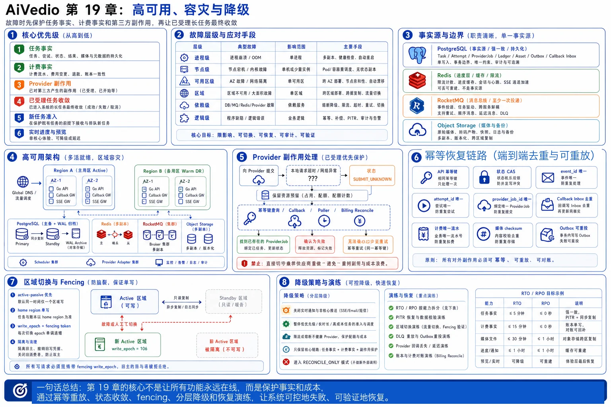

# 第 19 章：高可用、容灾与降级



> 图注：本章全文重点总结图，围绕故障层级、事实源边界、高可用架构、Provider 副作用、幂等恢复链路、区域切换与 Fencing、RTO/RPO、分层降级和灾备演练展开。

> 本章主题：依赖故障、节点故障、可用区故障和区域级故障下，AI 视频生成与在线剪辑平台应该怎样继续服务、保护数据并完成恢复。

AI 视频平台的高可用不能只理解为“Go 服务多起几个副本”。这个系统同时具有分钟级长任务、第三方不可控调用、真实生成成本、临时输出 URL、大文件回源和多阶段媒体处理等特征。一次故障可能不会立即表现为 API 5xx，却可能在数小时后演化成任务永久卡住、同一视频重复生成、额度重复结算或第三方结果过期。

因此，本章采用以下总原则：

> **优先保护任务事实、计费事实和第三方副作用；其次保证已受理任务最终收敛；再次保证新任务准入；最后才是实时进度、预览和非核心体验。**

---

## 19.1 本章要解决的业务问题

### 19.1.1 高可用的真正目标

平台需要在以下故障中保持可控：

1. 单个 Go 进程、Pod 或虚拟机退出。
2. 一个可用区整体不可达。
3. PostgreSQL 主库、Redis 主节点或 RocketMQ Broker 故障。
4. 第三方视频供应商持续返回 429、5xx，或者完全不可用。
5. Callback Gateway 故障，供应商回调无法进入平台。
6. 对象存储、CDN、媒体处理 Worker 或 GPU 集群故障。
7. 主区域发生大面积网络、计算或存储故障。
8. 误删除、错误发布、数据污染或勒索软件等逻辑灾难。

系统至少要回答五个问题：

- 已经向用户返回成功的任务是否仍然存在？
- 已经提交给供应商的任务是否会被重复提交？
- 已经发生的费用是否能够正确结算或补偿？
- 未完成任务能否由其他节点、其他可用区或灾备区域接管？
- 故障期间应该关闭哪些能力，保留哪些能力？

### 19.1.2 需要区分的故障层级

| 故障层级 | 典型故障 | 主要手段 |
| --- | --- | --- |
| 进程级 | panic、OOM、发布失败 | 多副本、健康检查、优雅关闭、幂等接管 |
| 节点级 | 宿主机故障、磁盘故障 | 跨节点调度、持久化外置、Worker 租约 |
| 可用区级 | AZ 网络或电力故障 | 跨 AZ 部署、容量冗余、数据库同步或准同步副本 |
| 区域级 | Region 大面积不可用 | 跨区域复制、流量切换、写入 fencing、灾备运行手册 |
| 依赖级 | Provider、Redis、MQ、对象存储故障 | 熔断、回源、Outbox、轮询补偿、排队与降级 |
| 逻辑级 | 错误 SQL、误删除、错误结算 | 不可变账本、PITR、审计、隔离恢复环境 |

### 19.1.3 高可用不等于零错误

高可用系统仍然会出现短暂失败。目标不是让所有请求在任何故障下都成功，而是：

- 错误可检测。
- 影响范围可限制。
- 已确认数据不静默丢失。
- 重试不会放大成重复生成和重复计费。
- 系统能够在明确的 RTO、RPO 内恢复。
- 降级行为对用户和运维人员可解释。

---

## 19.2 核心设计原则

### 原则一：PostgreSQL 保存事实，其他组件保存加速状态或传递状态

以下内容必须以 PostgreSQL 或同等级持久化事实源为准：

- 任务是否创建成功。
- 当前任务状态和状态版本。
- 第三方调用 attempt 与 provider job 的绑定关系。
- 额度预占、结算、释放和退款流水。
- 资产归属、校验和与最终对象地址。
- Outbox、Callback Inbox 和补偿任务记录。

Redis 丢失限流计数、进度缓存或 SSE 通知游标时，用户体验可以下降，但任务和余额不能因此改变。RocketMQ 消息重复或短暂不可用时，数据库中的任务和 Outbox 仍然能够恢复投递。

### 原则二：按“至少一次”设计恢复链路

节点接管、MQ 重投、回调重放和灾备恢复都可能导致同一操作再次执行。系统不能依赖“只调用一次”，而应通过以下机制实现业务上的一次效果：

- API 幂等键。
- 数据库唯一约束。
- 状态版本 CAS。
- `event_id`、`attempt_id`、`provider_job_id` 唯一性。
- Callback Inbox 去重。
- 计费唯一业务流水。
- 媒体对象 checksum 与确定性对象键。

### 原则三：第三方副作用必须单独治理

调用供应商生成接口会产生真实成本，且最危险的情况是：

```text
供应商已经受理
→ 本地在读取响应前超时或进程崩溃
→ 本地不知道是否成功
```

此时不能直接切换供应商或重新提交。任务必须进入 `SUBMIT_UNKNOWN`，通过供应商幂等键、查询接口、回调、账单或人工对账确认后，才能决定继续等待、绑定已有任务或重新生成。

### 原则四：控制面与媒体数据面分离

控制面包括任务、状态、计费、调度和元数据；数据面包括上传、回源、转码、代理视频、HLS 和最终渲染。

- 控制面故障时，应阻止产生不可记录的新成本。
- 媒体数据面故障时，可以暂停回源或渲染，但不能把已经生成成功的任务误判为失败。
- 大文件始终通过对象存储和 CDN，不通过 Go API 进行跨区域搬运。

### 原则五：先隔离，再重试

故障发生后，应先通过熔断、限流、暂停消费和关闭准入限制爆炸半径，再进行重试。多层无界重试会导致：

```text
客户端重试 × 网关重试 × 服务重试 × MQ 重试 × Provider Adapter 重试
```

最终形成重试风暴，并把短暂依赖故障放大成全系统雪崩。

### 原则六：RTO 和 RPO 必须按业务能力定义

- **RTO（Recovery Time Objective）**：从故障发生到业务能力恢复所允许的最长时间。
- **RPO（Recovery Point Objective）**：恢复后最多允许丢失多长时间范围内的数据。

实时进度和核心账本不能使用同一个目标。进度缓存可以重建，账本则应追求更严格的 RPO。

### 原则七：备份不等于可恢复

PITR、跨区副本和对象复制只有在定期恢复演练后才有意义。恢复演练必须验证：

- 备份是否完整。
- WAL 是否连续。
- 密钥是否可用。
- 应用 schema 和配置是否匹配。
- 恢复耗时是否满足目标。
- 恢复后能否完成任务与计费对账。

---

## 19.3 详细架构和组件职责

### 19.3.1 推荐总体架构

```text
                         Global DNS / Traffic Manager
                                      │
                      ┌───────────────┴───────────────┐
                      │                               │
                Region A                         Region B
              Active Region                    DR / Warm Region
                      │                               │
        ┌─────────────┼─────────────┐     ┌───────────┼───────────┐
        │             │             │     │           │           │
   Go API 多副本  Callback GW   SSE GW   Go API   Callback GW   Poller
   跨 AZ 部署      多副本        多副本    预部署       预部署       预部署
        │             │             │     │           │           │
        └─────────────┴──────┬──────┘     └───────────┴─────┬─────┘
                              │                              │
                       PostgreSQL Primary             Cross-region Standby
                       + AZ Standby                    + WAL Archive Restore
                              │                              │
                 ┌────────────┼────────────┐       ┌─────────┼─────────┐
                 │            │            │       │         │         │
              Redis       RocketMQ     Object     Redis   RocketMQ   Object
           Sentinel/     多 Broker      Storage   DR      DR/Standby Storage
            Cluster      多副本          多 AZ                        Replica
                 │            │            │
                 └────────────┴──────┬─────┘
                                    │
                       Provider Adapters / Schedulers
                                    │
                 ┌──────────────────┼──────────────────┐
                 │                  │                  │
             Provider A         Provider B         自建模型
```

### 19.3.2 Go 服务

Go 服务采用无状态多副本，跨可用区部署。实例本地只能保存可丢失的短期数据，例如连接池、只读缓存和临时缓冲，不保存任务事实。

关键要求：

- `readiness` 表示当前实例能否接收对应类型的新流量。
- `liveness` 只判断进程是否失去自我恢复能力，不应因为远程 Redis 或 Provider 故障而反复重启。
- 优雅关闭时，先从负载均衡摘除，再停止拉取新消息，等待正在处理的安全步骤完成或释放租约。
- 所有后台 Worker 使用有期限租约或数据库抢占，进程退出后任务可被其他实例接管。
- 配置、密钥和 Provider 路由不依赖本地手工文件。

### 19.3.3 PostgreSQL

PostgreSQL 是任务和计费事实源。推荐按故障层级设计：

- 同区域内设置主库与跨 AZ 热备。
- 根据业务对延迟和 RPO 的要求选择同步、准同步或异步复制。
- 持续归档 WAL，并定期制作 base backup。
- WAL 归档位置不能只存在于主库所在节点。
- 灾备区域保留异步物理副本，或保留可恢复的备份与 WAL。
- 定期在隔离环境执行 PITR，验证实际恢复时间。

PostgreSQL 的热备可以持续应用 WAL；连续归档与 base backup 可用于恢复到指定时间点。需要注意，PITR 主要解决逻辑损坏和历史恢复，不替代在线主备切换。[1][2]

数据库不可用期间的业务策略：

- 停止创建新的付费生成任务。
- 不直接绕过数据库调用供应商。
- 已在供应商执行中的任务由 Callback Inbox、临时持久队列或后续轮询补偿收敛。
- 只读查询可以在确认数据时效后切只读副本，但余额、任务终态等不能依赖陈旧副本做写决策。

### 19.3.4 Redis Sentinel 与 Redis Cluster

选择方式：

| 方案 | 适用情况 | 主要特点 |
| --- | --- | --- |
| Sentinel | 单个或少量逻辑实例，容量可由单主承担 | 主从切换、监控、客户端发现 |
| Cluster | 数据量或吞吐需要分片 | 哈希槽分片、分片内主从切换 |

Redis Sentinel 为非 Cluster 部署提供故障检测和主从切换；Redis Cluster 同时解决分片和一定范围内的可用性。但二者底层复制通常是异步的，网络分区和故障切换窗口内可能丢失最近写入，因此 Redis 不应承载核心任务与余额事实。[3][4]

Redis 故障时：

- 状态查询回源 PostgreSQL。
- SSE/WebSocket 通知退化为客户端轮询。
- 全局分布式限流退化为保守的实例级限流，或暂停高成本任务准入。
- Provider 并发计数通过数据库中的实际在途任务重新校准。
- 不因缓存 miss 触发大量并发回源，应使用本地短 TTL、请求合并和限速保护数据库。

### 19.3.5 RocketMQ

RocketMQ 部署应包含：

- 多 NameServer。
- Broker 多副本，跨故障域放置。
- 生产者和消费者多实例。
- 消息积压、最老消息年龄、重试次数和 DLQ 告警。
- Outbox 作为 MQ 暂时不可用时的可靠投递缓冲。

RocketMQ 在消费失败后会按策略重投，超过最大重试次数的消息进入死信队列；DLQ 只是隔离区，不会自动修复业务，需要重放工具和人工处置流程。[5]

即使使用多副本或基于 Raft 的 DLedger 部署，应用仍然应按至少一次投递设计，不能把 MQ 当作业务 exactly-once 保证。[6]

MQ 故障时禁止执行的做法：

```text
RocketMQ 不可用
→ API 为了“保证可用”直接同步调用 Provider
```

这种旁路会破坏调度、限流、计费和幂等边界。正确行为是继续写入任务与 Outbox；当 Outbox 超过安全水位时，逐步停止新任务准入。

### 19.3.6 对象存储与 CDN

对象存储负责：

- 用户原始素材。
- 第三方输出回源文件。
- 代理视频、缩略图、波形和切片。
- 最终渲染成品。
- 数据库 base backup、WAL 或灾备清单。

生产环境应使用跨设备、跨可用区冗余的存储类别；对于区域级容灾，再配置跨区域复制或独立备份。对象存储的多 AZ 能力解决区域内硬件或可用区故障，但跨区域复制通常存在延迟，不能默认视为 RPO 为零。[7]

对象存储异常时：

- 暂停新的大文件上传和最终渲染。
- 已生成的 Provider 输出按 URL 到期时间排序抢救。
- 必要时回源到备用区域桶，并记录 `storage_region`，恢复后再异步归并。
- 不把 Worker 本地临时盘当作长期灾备介质。

### 19.3.7 Provider Adapter、Callback Gateway 与 Poller

Provider Adapter 负责供应商协议差异，但不独自决定业务终态。

Callback Gateway 应做到：

1. 验证签名、时间戳和防重放字段。
2. 将原始回调持久化到 `callback_inbox` 或可靠消息后再返回 2xx。
3. 以 `provider + provider_job_id + event_type/event_id` 去重。
4. 通过状态版本 CAS 更新任务。
5. 无法写入主事实源时，将回调保存在灾备 Inbox，待数据库恢复后重放。

Poller 是回调的补偿机制，不是临时脚本：

- 每个 Provider Job 保存 `next_poll_at`。
- 使用指数退避与随机抖动。
- 回调和轮询可以同时到达，必须由状态机和幂等约束消除竞态。
- 对长时间无更新任务执行定期对账扫描。

### 19.3.8 区域级模式：active-passive 与 active-active

| 模式 | 优点 | 风险与成本 | 适合本系统的建议 |
| --- | --- | --- | --- |
| Active-Passive | 写路径简单、冲突少、计费易保证 | 灾备资源闲置，切换存在 RTO | 适合作为第一阶段区域容灾方案 |
| Active-Active 读写 | 区域故障切换快，全球延迟低 | 双写冲突、账本冲突、重复生成、Provider 回调路由复杂 | 不建议直接对同一任务或同一账本多主写入 |
| Active-Active 入口 + 单归属写 | 两地都接流量，每个租户/任务只有一个 home region | 需要路由、迁移和 fencing | 推荐的演进方案 |

推荐策略：

> **入口和只读能力可以 active-active；任务、账本和 Provider 副作用采用 home region 单写。区域切换时通过 write epoch/fencing token 明确新写入所有权。**

---

## 19.4 文字版时序图

### 19.4.1 正常流程

```text
Client
→ Global Gateway：提交生成请求，携带 Idempotency-Key
→ Generation Service：校验、费用估算、额度预占
→ PostgreSQL：同一事务写 generation_task + credit_ledger + outbox_event
→ Client：返回 task_id 和 QUEUED
→ Outbox Relay：发布 TaskCreated 到 RocketMQ
→ Scheduler：获取租户、模型、Provider 并发槽位
→ Provider Adapter：创建 task_attempt，调用 Provider
→ PostgreSQL：记录 provider_job_id，任务进入 SUBMITTED/RUNNING
→ Provider：异步生成
→ Callback Gateway：验签并持久化 callback_inbox
→ Task State Service：CAS 更新任务为 PROVIDER_SUCCEEDED
→ Output Fetch Worker：下载临时输出，校验并写入对象存储
→ Media Worker：转码、缩略图、代理视频、审核
→ PostgreSQL：任务进入 SUCCEEDED，结算额度
→ SSE Gateway：通知前端刷新任务快照
```

### 19.4.2 Callback Gateway 故障

```text
Provider：回调失败或回调无法到达
→ Provider 按自身策略重试
→ Poller：扫描 next_poll_at 到期的 provider_job
→ Provider Query API：查询任务状态
→ Poller：将查询结果作为标准化事件写入 callback_inbox
→ Task State Service：按同一状态机和幂等规则更新任务
→ Callback Gateway 恢复后：迟到回调被 Inbox 唯一键去重
```

### 19.4.3 PostgreSQL 主库故障

```text
监控：发现主库不可用或复制异常
→ Admission Control：切换 RECONCILE_ONLY，停止新付费任务
→ Go 服务：已有连接失败，取消无界数据库重试
→ Failover Manager：确认主库故障并选择健康副本
→ Fencing：隔离旧主，防止旧主恢复后继续写入
→ Standby：提升为新主
→ Service Discovery：刷新数据库端点
→ Go 服务：重建连接池
→ Outbox Relay：继续投递未发布事件
→ Reconciler：扫描非终态任务、未知提交和未处理回调
→ 业务恢复：逐步从 RECONCILE_ONLY 切回 NORMAL
```

### 19.4.4 主区域故障切换

```text
Incident Commander：宣布 Region A 不可用
→ Global Control：将新任务准入设为关闭
→ Fencing Store：提升 write_epoch，Region A 旧 epoch 失效
→ Region B：确认数据库复制位置和允许的 RPO
→ Region B：提升跨区域 PostgreSQL 副本
→ Region B：启用 RocketMQ、Redis、Callback、Poller 和 Worker
→ Global DNS/Traffic Manager：流量切换到 Region B
→ Reconciler：恢复 Outbox、Callback Inbox、Provider Job 和额度流水
→ Provider Adapter：查询所有 SUBMIT_UNKNOWN 与长期 RUNNING 任务
→ Object Reconciler：核对跨区复制缺口和临时输出 URL
→ 验证：创建测试任务、完成回源与计费后逐步开放流量
```

---

## 19.5 关键数据结构、数据库表和消息字段

### 19.5.1 Generation Task

```sql
CREATE TABLE generation_task (
    task_id            UUID PRIMARY KEY,
    tenant_id          UUID NOT NULL,
    project_id         UUID NOT NULL,
    home_region        TEXT NOT NULL,
    write_epoch        BIGINT NOT NULL,
    status             TEXT NOT NULL,
    status_version     BIGINT NOT NULL DEFAULT 0,
    active_attempt_id  UUID,
    idempotency_key    TEXT NOT NULL,
    reserved_amount    NUMERIC(18, 6) NOT NULL,
    created_at         TIMESTAMPTZ NOT NULL,
    updated_at         TIMESTAMPTZ NOT NULL,
    terminal_at        TIMESTAMPTZ,
    UNIQUE (tenant_id, idempotency_key)
);
```

关键字段：

- `home_region`：正常情况下该任务的写入归属区域。灾备提升后可在首次合法写入时惰性迁移。
- `write_epoch`：最后一次合法写入使用的 fencing token，不应被旧 epoch 覆盖。
- `status_version`：状态 CAS，防止回调、轮询和取消互相覆盖。
- `active_attempt_id`：当前生效的供应商调用 attempt。

状态更新不能只比较任务行中的旧 epoch，还要校验当前区域拥有写入权。示例：

```sql
WITH fence AS (
    SELECT active_region, write_epoch
    FROM region_write_fence
    WHERE resource_scope = $resource_scope
)
UPDATE generation_task AS t
SET status = $new_status,
    status_version = t.status_version + 1,
    home_region = f.active_region,
    write_epoch = f.write_epoch,
    updated_at = now()
FROM fence AS f
WHERE t.task_id = $task_id
  AND t.status_version = $expected_version
  AND f.active_region = $current_region
  AND f.write_epoch = $current_epoch
  AND t.write_epoch <= f.write_epoch;
```

这里允许灾备区域在新 epoch 下惰性接管旧任务，但不允许旧 worker 覆盖新 epoch。数据库内的 epoch 校验仍不能替代对旧主的基础设施隔离。

### 19.5.2 Task Attempt 与 Provider Job

```sql
CREATE TABLE task_attempt (
    attempt_id              UUID PRIMARY KEY,
    task_id                 UUID NOT NULL REFERENCES generation_task(task_id),
    attempt_no              INT NOT NULL,
    provider                TEXT NOT NULL,
    provider_model          TEXT NOT NULL,
    provider_idempotency_key TEXT,
    provider_job_id         TEXT,
    submit_state            TEXT NOT NULL,
    submit_started_at       TIMESTAMPTZ,
    submit_finished_at      TIMESTAMPTZ,
    unknown_since           TIMESTAMPTZ,
    next_poll_at            TIMESTAMPTZ,
    last_polled_at          TIMESTAMPTZ,
    output_deadline_at      TIMESTAMPTZ,
    created_at              TIMESTAMPTZ NOT NULL,
    UNIQUE (task_id, attempt_no),
    UNIQUE (provider, provider_idempotency_key),
    UNIQUE (provider, provider_job_id)
);
```

`submit_state` 建议包含：

```text
PREPARED
SUBMITTING
SUBMITTED
SUBMIT_UNKNOWN
REJECTED
RUNNING
SUCCEEDED
FAILED
CANCELLED
```

### 19.5.3 Outbox Event

```sql
CREATE TABLE outbox_event (
    event_id          UUID PRIMARY KEY,
    aggregate_type    TEXT NOT NULL,
    aggregate_id      UUID NOT NULL,
    event_type        TEXT NOT NULL,
    payload           JSONB NOT NULL,
    schema_version    INT NOT NULL,
    home_region       TEXT NOT NULL,
    write_epoch       BIGINT NOT NULL,
    created_at        TIMESTAMPTZ NOT NULL,
    published_at      TIMESTAMPTZ,
    publish_attempts  INT NOT NULL DEFAULT 0,
    next_retry_at     TIMESTAMPTZ
);
```

MQ 消息至少包含：

```json
{
  "event_id": "uuid",
  "event_type": "GenerationTaskCreated",
  "schema_version": 3,
  "task_id": "uuid",
  "attempt_id": "uuid-or-null",
  "tenant_id": "uuid",
  "home_region": "region-a",
  "write_epoch": 42,
  "trace_id": "trace-id",
  "occurred_at": "2026-06-24T12:00:00Z"
}
```

消息中的 `write_epoch` 用于标记事件产生时的所有权，不能让旧区域消费者据此直接执行副作用。灾备消费者收到旧 epoch 的事实事件时，应重新读取当前 fence 和任务快照，在新 epoch 下完成合法认领或生成新的命令事件，而不是无条件执行或无条件丢弃。

### 19.5.4 Callback Inbox

```sql
CREATE TABLE callback_inbox (
    inbox_id          UUID PRIMARY KEY,
    provider          TEXT NOT NULL,
    provider_job_id   TEXT NOT NULL,
    provider_event_id TEXT,
    dedupe_key        TEXT NOT NULL,
    event_type        TEXT NOT NULL,
    payload           JSONB NOT NULL,
    signature_valid   BOOLEAN NOT NULL,
    received_region   TEXT NOT NULL,
    received_at       TIMESTAMPTZ NOT NULL,
    processed_at      TIMESTAMPTZ,
    process_error     TEXT,
    UNIQUE (provider, dedupe_key)
);
```

`dedupe_key` 优先使用稳定的 `provider_event_id`；供应商不提供事件 ID 时，可以由以下组合规范化后计算：

```text
provider + provider_job_id + normalized_status + provider_updated_at + payload_hash
```

### 19.5.5 区域写入租约与系统模式

```sql
CREATE TABLE region_write_fence (
    resource_scope  TEXT PRIMARY KEY,
    active_region   TEXT NOT NULL,
    write_epoch     BIGINT NOT NULL,
    mode            TEXT NOT NULL,
    updated_at      TIMESTAMPTZ NOT NULL
);
```

`mode` 可取：

```text
NORMAL
DEGRADED_NOTIFY
DEGRADED_PROVIDER
QUEUE_ONLY
RECONCILE_ONLY
READ_ONLY
MAINTENANCE
```

所有可能产生外部成本或修改账本的操作，都必须校验当前 `active_region + write_epoch`。该表用于应用层 fencing；区域灾备时还必须隔离旧数据库主节点、撤销旧区域写凭据并关闭旧消费者。仅依赖 DNS 切换或仅依赖数据库内一张表，都不能完整防止旧区域恢复后继续写入。

### 19.5.6 恢复扫描索引

建议为以下扫描建立部分索引：

```sql
CREATE INDEX idx_task_non_terminal_updated
ON generation_task (status, updated_at)
WHERE terminal_at IS NULL;

CREATE INDEX idx_attempt_poll_due
ON task_attempt (next_poll_at)
WHERE submit_state IN ('SUBMITTED', 'RUNNING', 'SUBMIT_UNKNOWN');

CREATE INDEX idx_outbox_unpublished
ON outbox_event (next_retry_at, created_at)
WHERE published_at IS NULL;

CREATE INDEX idx_callback_unprocessed
ON callback_inbox (received_at)
WHERE processed_at IS NULL;
```

---

## 19.6 正常流程

### 19.6.1 任务接入

1. API Gateway 完成身份认证、租户限流和请求体限制。
2. Generation Service 校验项目、素材、模型参数和内容策略。
3. 读取当前系统模式和区域 `write_epoch`。
4. 在同一 PostgreSQL 事务内：
   - 幂等创建任务。
   - 预占额度。
   - 写入 Outbox。
5. 事务提交后立即返回 `task_id`，不等待 MQ 或 Provider。

### 19.6.2 调度与供应商提交

1. Outbox Relay 将任务事件投递到 RocketMQ。
2. Scheduler 根据租户公平、Provider 配额、健康度和成本选择路由。
3. 创建 `task_attempt`，状态为 `PREPARED`。
4. 获取 Provider 并发槽位。
5. 将 attempt 更新为 `SUBMITTING` 后调用供应商。
6. 成功获得 `provider_job_id` 后写入数据库，进入 `SUBMITTED`。
7. 若请求结果未知，则进入 `SUBMIT_UNKNOWN`，禁止立即重提。

### 19.6.3 回调、轮询和状态收敛

1. Provider 回调首先落 Callback Inbox。
2. Inbox Processor 标准化供应商状态。
3. 使用 `status_version` 和允许迁移表执行 CAS。
4. 回调缺失时，Poller 根据 `next_poll_at` 补偿查询。
5. 定时 Reconciler 扫描长期无更新任务，防止单一机制失效。

### 19.6.4 输出回源与媒体处理

1. Provider 成功后，任务先进入 `PROVIDER_SUCCEEDED`，而不是直接 `SUCCEEDED`。
2. Output Fetch Worker 下载临时 URL，校验响应类型、大小与 checksum。
3. 写入平台对象存储，记录对象版本、区域和校验和。
4. Media Worker 生成代理视频、缩略图、波形和播放切片。
5. 完成输出审核后，任务进入业务终态并结算额度。

---

## 19.7 异常流程和竞态条件

### 19.7.1 Go 节点在数据库提交前崩溃

- 事务回滚。
- 客户端使用相同 `Idempotency-Key` 重试。
- 不会产生任务、Outbox 和额度预占的半成品。

### 19.7.2 数据库已提交，但响应未返回

- 客户端可能认为创建失败并重试。
- 唯一约束返回原任务结果。
- 不创建第二个任务，不重复预占额度。

### 19.7.3 Provider 已受理，但本地超时

这是最关键的竞态。

正确处理：

```text
SUBMITTING
→ 请求超时或连接断开
→ SUBMIT_UNKNOWN
→ 使用 provider idempotency key 查询
→ 等待回调
→ 查询供应商任务列表或账单
→ 确认不存在后才允许新 attempt
```

错误处理：立即切换另一个供应商。后果是两个视频同时生成、成本翻倍，且任何一个迟到回调都可能覆盖另一个结果。

### 19.7.4 Callback 与 Poller 同时到达

可能出现：

```text
Poller 读到 RUNNING
Callback 同时报告 SUCCEEDED
```

若 Poller 后写入，不能把任务从 `SUCCEEDED` 回退到 `RUNNING`。解决方式：

- 明确单向状态迁移。
- 使用 `status_version` CAS。
- 终态不可回退。
- 原始事件保留在 Inbox 供审计。

### 19.7.5 用户取消与 Provider 成功竞态

取消不是简单把状态改成 `CANCELLED`：

- 如果 Provider 尚未受理，可安全取消并释放预占。
- 如果 Provider 正在运行，发送取消请求但结果可能未知。
- 如果 Provider 已成功，仍可能产生费用，需要先回源结果，再按产品规则决定是否展示和收费。
- `CANCEL_REQUESTED` 与 `PROVIDER_SUCCEEDED` 的冲突由状态机处理，不能由最后写入者获胜。

### 19.7.6 Redis 主从切换导致计数回退

Provider 并发计数或租户令牌可能丢失。恢复步骤：

1. 暂停或收紧新任务准入。
2. 从 PostgreSQL 中统计 `SUBMITTING/SUBMITTED/RUNNING` 的实际在途任务。
3. 重建 Redis 计数。
4. 以较低速率恢复调度。

不能因为 Redis 中 semaphore 变小就立即补满，否则可能突破供应商真实并发限制。

### 19.7.7 RocketMQ 大面积积压

- 降低或暂停非核心 Topic 消费。
- 优先处理 Callback、计费和输出回源事件。
- 新任务进入 `QUEUE_ONLY` 或直接限流。
- 评估 Provider 配额和 Worker 容量，不能只增加消费者并发。
- 对过期消息先检查数据库当前状态，终态任务消息直接幂等丢弃。

### 19.7.8 Callback Gateway 故障

- Provider 可能持续重试回调。
- Poller 提高覆盖率，但要加随机抖动，防止同一时间扫描全部任务。
- 恢复后重放灾备 Inbox。
- 通过 `callback_lag` 和 `poll_fallback_ratio` 告警。

### 19.7.9 对象存储不可用且输出 URL 即将过期

按 `output_deadline_at` 排序：

1. 尝试写入备用区域桶。
2. 对可重新签发 URL 的 Provider 请求刷新下载地址。
3. 对不可刷新且高价值结果，使用受控临时缓冲后尽快落备用存储。
4. 全程记录 checksum、来源 URL、下载时间和目标对象。
5. 恢复后将资产复制回主区域并更新元数据。

### 19.7.10 区域切换中的双主风险

只切 DNS 不足以完成灾备。旧区域可能只是网络隔离，稍后恢复并继续消费消息、调用 Provider、写数据库。

必须使用：

- 数据库层旧主隔离。
- `write_epoch` fencing。
- MQ 消费者区域开关。
- Provider Adapter 提交开关。
- 计费写入区域校验。

任何携带旧 epoch 的写操作都应被拒绝。

---

## 19.8 幂等、一致性、重试和补偿设计

### 19.8.1 五层幂等边界

| 层级 | 幂等键或约束 | 防止的问题 |
| --- | --- | --- |
| API | `tenant_id + Idempotency-Key` | 用户重复点击或网络重试重复建任务 |
| Outbox/MQ | `event_id` | 重复发布、重复消费 |
| Provider | `attempt_id` 或供应商幂等键 | 重复生成和重复收费 |
| Callback | `provider_event_id` 或 payload hash | 回调重放和乱序 |
| Billing | `business_key` | 重复预占、结算、退款 |

### 19.8.2 状态一致性

任务状态必须满足：

- 迁移方向明确。
- 终态不可回退。
- 每次迁移记录来源事件和版本。
- Provider 状态、平台状态和媒体状态分层，不把“供应商生成成功”等同于“平台可播放成功”。

示例：

```text
QUEUED
→ DISPATCHING
→ SUBMITTING
→ SUBMITTED
→ RUNNING
→ PROVIDER_SUCCEEDED
→ FETCHING_OUTPUT
→ PROCESSING_MEDIA
→ SUCCEEDED
```

异常分支：

```text
SUBMITTING → SUBMIT_UNKNOWN
RUNNING → CANCEL_REQUESTED
FETCHING_OUTPUT → OUTPUT_AT_RISK
任意非终态 → MANUAL_REVIEW
```

### 19.8.3 重试分类

| 场景 | 是否自动重试 | 说明 |
| --- | --- | --- |
| 数据库事务在提交前失败 | 可以 | 使用相同幂等键重新执行 |
| MQ 发布失败 | 可以 | Outbox 控制退避，不丢事实 |
| MQ 消费失败 | 可以 | 消费逻辑必须幂等，超过阈值进入 DLQ |
| Provider 明确返回 429/5xx 且确认未受理 | 可以 | 指数退避、熔断、受重试预算限制 |
| Provider 调用超时，结果未知 | 不直接重提 | 先进入 `SUBMIT_UNKNOWN` 并对账 |
| Callback 处理失败 | 可以 | Inbox 已持久化，可重复处理 |
| 输出下载中断 | 可以 | 支持 Range 时断点续传，否则重新下载并校验 |
| 内容审核拒绝 | 通常不自动重试 | 属于业务失败，避免重复触发风控 |

### 19.8.4 补偿任务

需要长期运行的 Reconciler：

- `OutboxReconciler`：重发未发布事件。
- `ProviderReconciler`：处理 `SUBMIT_UNKNOWN` 和长期 `RUNNING`。
- `CallbackReplayer`：重放未处理 Inbox。
- `OutputReconciler`：抢救即将过期的输出。
- `BillingReconciler`：检查预占未结算、重复扣费和供应商账单差异。
- `AssetReconciler`：校验数据库对象记录与实际对象是否一致。

补偿不是把状态强行改成成功，而是重新获取证据并让状态机收敛。

---

## 19.9 性能瓶颈和容量估算方法

高可用容量规划必须按“失去一个故障域后仍能服务”计算，而不是按正常平均负载计算。

### 19.9.1 可用区冗余

假设三个可用区容量相同，每个容量为 `C`，要求失去一个可用区后仍承载峰值 `P`：

```text
2C ≥ P
```

因此正常情况下总容量为 `3C`，峰值利用率上限约为：

```text
P / 3C ≤ 2/3
```

考虑发布、抖动和重试流量后，实际应保留更多余量。对于无法快速横向扩展的 GPU Worker、数据库连接和 Provider 并发槽位，应单独计算。

### 19.9.2 故障后积压清空时间

设：

- 故障期间积压 `B` 条任务。
- 恢复后实际消费能力 `μ` 条/秒。
- 新任务到达率 `λ` 条/秒。

只有 `μ > λ` 时积压才能下降：

```text
T_drain = B / (μ - λ)
```

例如积压 180,000 条回调事件，恢复后处理能力 1,200 条/秒，新事件仍以 300 条/秒到达：

```text
T_drain = 180000 / (1200 - 300) = 200 秒
```

如果只看消费者 QPS 而忽略新流量，恢复时间会被严重低估。

### 19.9.3 Polling 补偿容量

设活跃 Provider Job 数为 `N`，平均轮询间隔为 `I` 秒：

```text
Polling QPS ≈ N / I
```

若 60,000 个任务平均每 30 秒查询一次：

```text
60000 / 30 = 2000 QPS
```

这可能超过供应商查询配额。应采用：

- 不同状态不同间隔。
- 指数退避。
- 随机抖动。
- 回调健康时降低轮询频率。
- 按 Provider 配额设置全局查询令牌桶。

### 19.9.4 PostgreSQL 容灾容量

需要监控：

- WAL 生成速率。
- `write_lag`、`flush_lag`、`replay_lag`。
- 复制槽积压。
- WAL 归档失败次数。
- 故障切换后的连接重建速率。
- Outbox 和恢复扫描对主库的额外负载。

跨区域带宽至少要覆盖高峰 WAL 速率和对象复制流量，并为恢复追赶保留余量。

### 19.9.5 数据库连接风暴

新主提升后，大量 Go 实例会同时重连。应：

- 使用指数退避和抖动。
- 控制每实例连接池上限。
- 分批恢复消费者。
- 先恢复回调、计费和状态收敛，再恢复普通查询。
- 避免健康检查本身持续创建新连接。

### 19.9.6 完整容量示例

假设：

```text
峰值新建任务：120 QPS
平均生成时间：180 秒
Provider 总并发：12,000
Callback 峰值：2,500 QPS
媒体回源平均文件：80 MB
成功任务：90 QPS
```

在途生成任务约为：

```text
120 × 180 = 21,600
```

但 Provider 配额只有 12,000，因此系统必须排队，不能依赖水平扩容突破外部配额。

成功任务回源带宽约为：

```text
90 × 80 MB = 7,200 MB/s
```

即约 57.6 Gbps，必须通过对象存储、分布式 Fetch Worker 和带宽配额规划，不能由少量 Go API 中转。

若要求失去一个可用区后维持完整回源能力，剩余可用区的网络、临时盘、对象存储请求额度和 Worker 数都要满足该带宽目标。

---

## 19.10 高可用、故障矩阵与降级方式

### 19.10.1 故障矩阵

| 故障 | 检测信号 | 立即行为 | 用户可见影响 | 恢复与补偿 |
| --- | --- | --- | --- | --- |
| 单个 Go 实例退出 | 实例健康检查、请求中断 | 负载切到其他副本 | 少量请求重试 | 幂等键恢复，Worker 租约到期后接管 |
| 单 AZ 故障 | 节点和网络同时失联 | 摘除该 AZ，限制扩容抖动 | 可能短暂延迟 | 剩余 AZ 承载，重建副本 |
| PostgreSQL 主库故障 | 连接失败、复制监控 | 停止新付费任务，执行故障切换 | 创建任务暂不可用 | 提升副本、重放 Outbox、全量对账 |
| Redis 故障 | 延迟、连接错误、主从切换 | 回源 DB，保守本地限流 | 实时进度退化 | 重建缓存和并发计数 |
| RocketMQ 故障 | 发布失败、Broker 不可用 | Outbox 堆积，逐步关闭准入 | 新任务排队变长 | MQ 恢复后限速追赶 |
| MQ 大积压 | backlog、oldest age | 优先核心 Topic，暂停低优任务 | 排队时间增加 | 扩容前先确认下游容量，处理 DLQ |
| 单 Provider 故障 | 5xx、429、超时上升 | 熔断，不再分配新任务 | 部分模型延迟或不可用 | 兼容任务切其他 Provider；已提交任务继续对账 |
| 全部 Provider 故障 | 多路错误率升高 | `QUEUE_ONLY` 或暂停新任务 | 只可查看历史任务 | 保留任务，恢复后公平调度 |
| Callback Gateway 故障 | 回调量骤降、lag 上升 | 启用轮询补偿 | 状态更新变慢 | 重放 Inbox，迟到回调去重 |
| 对象存储故障 | PUT/GET 错误率 | 暂停上传/渲染，抢救临期输出 | 文件暂不可用 | 写备用桶，恢复后归并 |
| CDN 故障 | 命中率下降、5xx | 切备用域名或受限回源 | 播放变慢 | 避免全量回源压垮对象存储 |
| Media Worker 故障 | 心跳、失败率、临时盘 | 暂停拉取，任务租约释放 | 预览/导出延迟 | 其他 Worker 接管，清理孤儿临时文件 |
| 主区域故障 | 多组件同时失效 | fencing、切灾备区域 | 数分钟至数十分钟降级 | 提升副本、流量切换、全链路对账 |
| 误删除/逻辑污染 | 审计告警、数据异常 | 冻结写入、保留证据 | 部分能力只读 | 隔离环境 PITR，差异回放和账本核对 |

### 19.10.2 降级优先级

建议按以下顺序退让：

1. **关闭非关键实时体验**：SSE 高频进度、在线协作光标、实时缩略图刷新。
2. **降低媒体成本**：暂停 4K、长时长、复杂特效和低优先级导出。
3. **限制不健康 Provider**：熔断特定模型或供应商，不影响其他路线。
4. **暂停低优先级新任务**：免费用户、批量任务或可延迟任务先排队。
5. **进入 `QUEUE_ONLY`**：只创建可可靠持久化的任务，不立即调用 Provider。
6. **进入 `RECONCILE_ONLY`**：停止所有新成本，只处理已受理任务、回调、回源和计费。
7. **进入 `READ_ONLY`**：仅允许查看已有项目和资产。
8. **进入 `MAINTENANCE`**：事实源也无法安全读取时，明确停止服务。

核心顺序是：

```text
保账本和任务事实
> 保已提交任务收敛
> 保新任务排队
> 保实时体验
```

### 19.10.3 推荐 RTO/RPO 示例

以下是面试中的示例目标，实际值要由业务成本、基础设施能力和预算共同确定：

| 能力 | 同区域 AZ 故障 RTO/RPO | 区域级灾难 RTO/RPO |
| --- | --- | --- |
| 任务与计费写入 | RTO 1～5 分钟；目标 RPO 0 或接近 0 | RTO 15～30 分钟；异步跨区时 RPO 可能为数分钟 |
| 已提交任务状态收敛 | RTO 5 分钟；RPO 0，事件可重放 | RTO 30～60 分钟；依赖 Provider 查询补偿 |
| 实时进度推送 | RTO 10 分钟；允许丢失瞬时通知 | RTO 60 分钟；客户端轮询兜底 |
| 媒体上传与回源 | RTO 10～30 分钟 | RTO 30～120 分钟；受跨区对象复制影响 |
| 历史项目只读 | RTO 5～15 分钟 | RTO 15～30 分钟 |
| 最终渲染 | RTO 30 分钟 | RTO 1～4 小时，可排队恢复 |

不能简单承诺“全系统 RPO 0”。跨区域同步写会显著增加延迟，并可能在跨区网络故障时降低可用性，需要按账本、任务、缓存和媒体分别权衡。

---

## 19.11 安全风险

### 19.11.1 灾备系统不能成为低安全等级后门

灾备区域常年低流量，容易出现补丁落后、证书过期和权限过宽。应保证：

- 主备区域使用同等安全基线。
- 密钥由密钥管理系统分区域托管，并定期验证可解密性。
- Provider API Key 不写入镜像或普通配置文件。
- 灾备数据库、备份桶和 WAL 归档使用最小权限与加密。
- Break-glass 权限有审批、短期有效期和完整审计。

### 19.11.2 回调重放和伪造

故障恢复时往往会批量重放回调。必须校验：

- 签名。
- 时间戳窗口。
- nonce 或事件 ID。
- Provider Job 与租户/任务绑定关系。
- 允许的状态迁移。

不能因为“这是恢复流量”就跳过验签。

### 19.11.3 跨区域数据合规

素材、提示词、人脸和生成视频可能受数据驻留要求限制。跨区复制前需要明确：

- 哪些租户允许跨区域备份。
- 哪些资产只能保留在指定地域。
- Provider 是否会在其他地区处理数据。
- 删除请求如何传播到备份和副本。

### 19.11.4 备份防篡改

为了应对误删除和勒索软件：

- 备份账号与生产写账号隔离。
- 重要备份使用对象锁定、版本控制或不可变保留策略。
- 删除备份需要双人审批。
- 恢复验证在隔离网络完成，避免污染生产。

### 19.11.5 灾备切换审计

每次切换至少记录：

```text
incident_id
operator
old_region
new_region
old_epoch
new_epoch
replication_position
accepted_rpo
traffic_switch_time
first_successful_write_time
reconciliation_result
```

---

## 19.12 常见错误设计及其后果

| 错误设计 | 后果 | 正确方向 |
| --- | --- | --- |
| 认为 Go 多副本就是高可用 | 数据库、MQ 或 Provider 故障时仍整体不可用 | 按依赖和故障域做端到端设计 |
| 所有副本部署在同一 AZ | AZ 故障时同时消失 | 跨 AZ 放置并预留剩余容量 |
| Redis 保存任务唯一状态 | 主从切换可能丢状态，无法审计 | PostgreSQL 作为事实源 |
| MQ 不可用时直接调用 Provider | 绕过调度、计费和幂等，产生重复成本 | 写 Outbox，超过水位后关闭准入 |
| Provider 超时后立即换供应商 | 两边都可能成功，重复生成和收费 | `SUBMIT_UNKNOWN` + 查询与对账 |
| 只依赖回调，不做轮询 | 回调丢失后任务永久卡住 | Callback + Poller + Reconciler |
| 只依赖轮询，不接回调 | 查询配额和延迟成本过高 | 回调优先，轮询补偿 |
| 把 DLQ 当作自动修复 | 消息长期堆积，无人处理 | 告警、分类、重放和修复工具 |
| 只做备份，不做恢复演练 | 真正事故时发现 WAL、密钥或脚本不可用 | 定期隔离恢复并测量 RTO |
| Active-Active 无写入归属 | 同一任务双写、账本冲突、重复调用 Provider | home region + write epoch + fencing |
| 只切 DNS，不隔离旧主 | 网络恢复后出现双主 | 数据库、消费者和业务写入多层 fencing |
| 每一层都自动重试 | 重试风暴压垮依赖 | 统一重试预算和责任层 |
| Readiness 依赖所有远程组件 | 单个依赖故障导致全部实例被摘除 | 按接口能力设计 readiness 和降级 |
| 对象存储故障时落 Worker 本地盘 | 节点退出后结果丢失 | 备用对象存储和受控短期缓冲 |
| 灾备环境长期不发布 | 切换时版本、schema 和配置不兼容 | 主备持续同版本、定期演练 |

---

## 19.13 面试官可能追问的 10 个问题

1. PostgreSQL 主库突然不可用时，为什么要暂停新付费任务？
2. Redis 故障后，怎样避免 Provider 并发计数失真导致超限？
3. 调用 Provider 超时，怎样判断是否可以重试？
4. Callback Gateway 故障时，任务如何最终完成？
5. RocketMQ 故障后，为什么不能直接同步调用 Provider？
6. 这个系统为什么更适合先做 active-passive，而不是直接 active-active？
7. 区域切换时怎样防止旧区域恢复后继续写入？
8. RTO 和 RPO 应怎样按业务能力拆分？
9. DLQ 中的消息应该怎样处理，能否直接全部重放？
10. 怎样证明灾备方案真的有效，而不是文档上有效？

---

## 19.14 每个追问的资深回答

### 问题 1：PostgreSQL 主库突然不可用时，为什么要暂停新付费任务？

因为 PostgreSQL 保存任务、额度预占、Provider attempt 和 Outbox 的事实。如果绕过数据库继续调用 Provider，就可能产生无法归属、无法计费、无法取消和无法对账的外部成本。正确做法是先进入 `RECONCILE_ONLY`，保留回调和补偿入口，完成主备切换后再逐步开放准入。已有任务的 Provider 状态可以通过 Inbox、轮询和后续对账恢复，但新成本不能在事实源不可写时继续产生。

### 问题 2：Redis 故障后，怎样避免 Provider 并发计数失真导致超限？

Redis semaphore 只是快速准入层，不是实际在途任务事实。切换期间先将调度并发降低或暂停，再从 PostgreSQL 统计 `SUBMITTING/SUBMITTED/RUNNING` attempt，按 Provider、模型和账号重建计数。恢复后使用缓慢爬坡，而不是瞬间补满。必要时再向 Provider 查询实际运行任务，修正数据库与供应商之间的差异。

### 问题 3：调用 Provider 超时，怎样判断是否可以重试？

先区分“明确未受理”和“结果未知”。连接建立前失败、供应商明确返回未受理错误，通常可以按重试预算重试；请求体可能已经到达供应商但本地未收到响应时，必须进入 `SUBMIT_UNKNOWN`。优先使用供应商幂等键查询，之后等待回调、查询任务列表或账单。只有确认不存在已有 Provider Job 后，才创建新的 attempt。不能把 HTTP 超时等价为业务失败。

### 问题 4：Callback Gateway 故障时，任务如何最终完成？

回调不是唯一事实来源。平台保留 Poller，根据 `next_poll_at` 查询 Provider；还要有 Reconciler 扫描长期无更新任务。Callback Gateway 恢复后，迟到或重复回调先进入 Inbox，再通过唯一键和状态版本去重。这样回调提供低延迟，轮询提供可靠补偿，定时对账处理极端遗漏。

### 问题 5：RocketMQ 故障后，为什么不能直接同步调用 Provider？

因为 MQ 前面不仅是传输层，还承载了异步解耦、削峰、租户公平、Provider 并发控制和重试边界。同步旁路会让 API 实例直接制造外部成本，并绕过调度和幂等。正确做法是同一事务写任务和 Outbox，MQ 恢复后继续投递；Outbox 超过水位时进入 `QUEUE_ONLY` 或停止准入，而不是破坏架构边界。

### 问题 6：这个系统为什么更适合先做 active-passive，而不是直接 active-active？

因为任务状态和计费账本需要单调一致，Provider 调用又具有不可逆成本。真正的多区域多写必须解决数据库冲突、全局幂等、回调路由、双重调度和重复生成，复杂度远高于普通读业务。第一阶段更适合主区域单写、灾备区域热备。后续可以演进为全局 active-active 入口，但每个租户或任务仍有唯一 home region，区域切换通过 epoch 迁移写入所有权。

### 问题 7：区域切换时怎样防止旧区域恢复后继续写入？

使用多层 fencing，而不是只切 DNS。首先隔离旧数据库主节点；其次提升全局 `write_epoch`，所有生成、计费和状态写入都必须携带当前 epoch；再次关闭旧区域 MQ 消费和 Provider 提交开关。旧区域恢复后携带旧 epoch 的写入会被数据库拒绝。这样即使存在网络分区，也不会产生两个合法写主。

### 问题 8：RTO 和 RPO 应怎样按业务能力拆分？

账本、任务事实、实时进度和媒体资产的价值不同。账本和已确认任务应有最严格的 RPO；Redis 进度缓存允许丢失并重建；最终渲染可以延迟数小时。还要区分 AZ 故障与区域灾难：同区域同步副本可能接近 RPO 0，跨区异步复制通常只能承诺分钟级 RPO。目标必须与复制模式、带宽、成本和故障类型一致。

### 问题 9：DLQ 中的消息应该怎样处理，能否直接全部重放？

不能直接全量重放。先按错误分类：代码缺陷、毒消息、依赖故障、数据缺失或任务已经终态。修复后，重放工具需要读取数据库当前事实并再次做幂等校验；按租户和事件类型限速；记录操作人、批次和结果。对于已经终态或 schema 不兼容的消息，应标记处理而不是再次执行副作用。

### 问题 10：怎样证明灾备方案真的有效，而不是文档上有效？

通过持续演练和可测指标证明。至少包括单实例退出、单 AZ 隔离、数据库主备切换、Redis 故障、MQ 积压、Callback 丢失、Provider 全故障、对象存储故障、区域流量切换和隔离环境 PITR。每次演练记录实际 RTO、实际 RPO、丢失或重复任务数量、账本差异和人工步骤，并把失败项转成工程改进，而不是只更新文档。

---

## 19.15 三分钟口述稿

> 我们这个 AI 视频平台的高可用目标，不只是让 API 不报错，而是故障期间不丢任务事实、不重复调用供应商、不重复计费，并让已经受理的长任务最终收敛。
>
> 架构上，Go 服务全部无状态、多副本、跨可用区部署。PostgreSQL 是任务、资产和计费的事实源，使用同区域主备、WAL 归档和 PITR；数据库不可写时，我们会停止创建新的付费任务，避免产生无法记录的外部成本。Redis 只承担限流、并发槽位、进度和通知加速，Sentinel 或 Cluster 切换期间允许体验降级，但任务和余额不能依赖 Redis。RocketMQ 使用多副本，消费按至少一次设计，MQ 暂时不可用时由 Outbox 缓冲，不能绕过 MQ 直接同步调用 Provider。
>
> 第三方供应商是最特殊的故障边界。调用超时不代表供应商失败，因为可能已经受理。我们会把 attempt 标为 `SUBMIT_UNKNOWN`，通过供应商幂等键、回调、查询和账单对账确认，不能直接切换供应商，否则会产生重复视频和双倍成本。Callback Gateway 也不是单点，所有回调先落 Inbox，再更新状态；回调缺失时由 Poller 和 Reconciler 补偿。
>
> 区域级容灾第一阶段采用 active-passive。灾备切换不仅切 DNS，还要隔离旧主、提升 write epoch，并关闭旧区域消费者和 Provider 提交通道，防止网络分区形成双主。恢复后按 Outbox、Callback Inbox、未知 Provider attempt、临期输出和计费流水逐项对账。
>
> 降级顺序是先关闭实时通知和高成本功能，再暂停低优任务，必要时进入 `RECONCILE_ONLY`，只处理已有任务和计费，不再制造新成本。我们按能力分别定义 RTO/RPO，并通过数据库切换、区域演练和 PITR 恢复定期验证，不能把“有备份”等同于“能恢复”。

---

## 19.16 十分钟深入讲解提纲

### 第 1 分钟：定义问题

- AI 视频是长耗时、高成本、强异步任务。
- API 可用不等于任务可恢复。
- 三条底线：不丢事实、不重复副作用、可对账。

### 第 2 分钟：故障域

- 进程、节点、AZ、Region、Provider、逻辑错误。
- 高可用、容灾和备份分别解决不同问题。

### 第 3 分钟：组件边界

- PostgreSQL：事实源、主备、WAL、PITR。
- Redis：加速和准入，可丢可重建。
- RocketMQ：至少一次异步传递，Outbox 兜底。
- 对象存储：媒体数据面，多 AZ 与跨区复制。

### 第 4 分钟：Go 服务和 Worker 接管

- 无状态多副本。
- readiness/liveness 分离。
- 优雅关闭。
- 有期限租约和幂等接管。

### 第 5 分钟：Provider 故障

- 熔断和路由。
- 429 与重试预算。
- `SUBMIT_UNKNOWN`。
- 已提交任务不能未经确认切换供应商。

### 第 6 分钟：Callback 与 Polling

- Inbox 持久化后返回 2xx。
- Callback 优先、Poller 补偿、Reconciler 兜底。
- 状态版本和终态不可回退。

### 第 7 分钟：区域容灾

- Active-passive 起步。
- Active-active 入口、home region 单写作为演进。
- write epoch、数据库隔离和消费者开关共同 fencing。

### 第 8 分钟：RTO/RPO 与容量

- 按任务、账本、通知、媒体、渲染分层。
- AZ 丢失后的容量冗余。
- 积压清空公式和 Polling QPS。
- 跨区 WAL 与对象复制带宽。

### 第 9 分钟：降级和故障矩阵

- 关闭实时体验。
- 限制高成本任务。
- `QUEUE_ONLY`。
- `RECONCILE_ONLY`。
- `READ_ONLY`。

### 第 10 分钟：恢复验证

- 主备切换演练。
- Callback 丢失和 Provider 故障演练。
- 区域切换演练。
- 隔离环境 PITR。
- 记录实际 RTO/RPO 和账本差异。

---

## 19.17 灾难演练与恢复运行手册

### 19.17.1 演练层级

| 演练类型 | 内容 | 建议频率 |
| --- | --- | --- |
| 桌面推演 | 按运行手册逐步讨论角色、权限和决策 | 每月或每季度 |
| 组件演练 | Go 实例、Redis、Broker、Worker 故障 | 持续或每月 |
| 数据库切换 | 主备提升、连接重建、Outbox 恢复 | 每季度 |
| Provider 演练 | 注入 429、5xx、超时和回调丢失 | 每季度 |
| AZ 演练 | 隔离一个可用区，验证容量和调度 | 每半年 |
| 区域演练 | 主区域停写、灾备提升、全链路验证 | 每半年或每年 |
| PITR 演练 | 从 base backup + WAL 恢复到指定时间点 | 每季度 |

### 19.17.2 区域切换运行手册

1. 宣布事故级别并指定 Incident Commander。
2. 将新任务准入切换为 `RECONCILE_ONLY`。
3. 记录当前数据库复制位置、MQ 水位和对象复制延迟。
4. 隔离旧主数据库与旧区域写入凭据。
5. 提升 `write_epoch`，使旧区域 token 失效。
6. 提升灾备 PostgreSQL 副本。
7. 启动灾备 MQ 消费、Callback、Poller、Outbox Relay 和核心 Worker。
8. 切换全局流量，但先仅开放内部探针和少量租户。
9. 验证任务创建、Provider 提交、回调、输出回源和计费结算。
10. 扫描以下恢复集合：
    - 未发布 Outbox。
    - 未处理 Callback Inbox。
    - `SUBMIT_UNKNOWN` attempt。
    - 长期 `RUNNING` Provider Job。
    - 即将过期的输出 URL。
    - 未结算或未释放的额度预占。
11. 逐步开放新任务，并监控错误率、复制追赶和队列年龄。
12. 事故结束后生成数据差异、实际 RTO/RPO 和改进项报告。

### 19.17.3 回切原则

不要在主区域刚恢复时立即回切。应先：

- 验证基础设施稳定。
- 重新建立反向复制。
- 确认新主的所有写入已同步。
- 制定新的 fencing epoch。
- 在低峰期执行受控切换。

区域切换和回切都属于高风险变更，不能把“恢复原状”当作自动动作。

---

## 本章总结

高可用设计的成熟度，不取决于部署了多少副本，而取决于系统能否明确回答：

1. 哪些数据是事实，哪些数据可以重建？
2. 故障时是否会继续制造无法记录的外部成本？
3. 重试是否可能导致重复生成和重复计费？
4. 谁拥有当前写入权，怎样防止双主？
5. 已受理任务通过什么机制最终收敛？
6. 降级顺序是否优先保护任务、账本和用户资产？
7. RTO/RPO 是否经过实际演练验证？

面试中可以用一句话收束：

> **我们的高可用方案不是追求所有功能始终在线，而是在故障边界内保护事实和成本，通过幂等重放、状态收敛、fencing、分层降级和定期恢复演练，让系统可控地失败、可验证地恢复。**

---

## 参考资料

[1]: https://www.postgresql.org/docs/current/warm-standby.html "PostgreSQL: Log-Shipping Standby Servers"
[2]: https://www.postgresql.org/docs/current/continuous-archiving.html "PostgreSQL: Continuous Archiving and Point-in-Time Recovery"
[3]: https://redis.io/docs/latest/operate/oss_and_stack/management/sentinel/ "Redis Sentinel"
[4]: https://redis.io/docs/latest/operate/oss_and_stack/reference/cluster-spec/ "Redis Cluster Specification"
[5]: https://rocketmq.apache.org/docs/featureBehavior/10consumerretrypolicy/ "Apache RocketMQ Consumption Retry"
[6]: https://rocketmq.apache.org/docs/4.x/bestPractice/02dledger/ "Apache RocketMQ DLedger"
[7]: https://docs.aws.amazon.com/AmazonS3/latest/userguide/DataDurability.html "Amazon S3 Data Protection"
