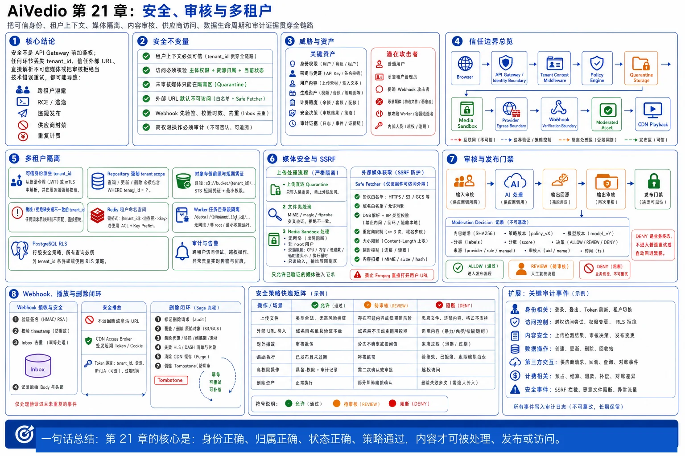

# 第 21 章：安全、审核与多租户



> 图注：本章全文重点总结图，围绕可信租户上下文、多租户隔离、Quarantine、Media Sandbox、SSRF 防护、输入输出双审核、Webhook 验签、短期播放凭证、删除闭环和审计证据展开。

> **本章结论：**AI 视频平台的安全不是在 API Gateway 前加一层鉴权，而是把“可信身份、租户上下文、媒体隔离、内容审核、供应商访问、数据生命周期和审计证据”贯穿任务全链路。任何一个环节丢失 `tenant_id`、错误信任外部 URL、直接解析不可信媒体，或把审核失败当成普通技术错误重试，都可能演变为跨租户泄露、远程代码执行、违规内容发布、供应商账号封禁或重复计费。

---

## 21.1 本章要解决的业务问题

AI 视频系统同时具备以下高风险特征：

1. **输入和输出都是不可信媒体。**用户可以上传图片、音频、视频、字幕和字体；供应商也会返回临时视频地址。任何解析器、转码器、缩略图程序或字体渲染库都可能成为攻击面。
2. **系统会主动访问外部网络。**参考素材 URL、供应商输出 URL、自定义回调地址和网页导入功能，都可能被利用实施 SSRF、DNS rebinding、内网探测或云元数据窃取。
3. **一次请求可能产生真实成本。**攻击者不一定要窃取数据，只要绕过限流并批量触发高成本生成，就能造成经济型拒绝服务。
4. **平台天然是多租户。**数据库、Redis、RocketMQ、对象存储、CDN、Worker 和供应商账号通常被多个客户共享，任何遗漏的租户约束都可能造成横向越权。
5. **内容本身存在安全与合规风险。**提示词、参考人脸、生成结果、音频和字幕可能涉及敏感内容、冒用肖像、侵权素材、未授权仿冒或其他平台禁止内容。
6. **数据会跨越多个系统。**原始上传、代理视频、关键帧、波形、审核样本、供应商副本、CDN 缓存和备份都可能保存同一份内容，删除一个数据库记录并不等于完成删除。
7. **异步链路存在长时间竞态。**租户可能在任务执行期间被禁用，素材可能在审核后被投诉下架，删除请求可能与渲染、回源或 CDN 分发并发发生。

本章要建立以下安全不变量：

```text
1. 未经过验证的租户上下文不能进入业务层。
2. 任何资源访问都必须同时验证“主体权限 + 资源归属 + 当前状态”。
3. 未完成安全扫描和审核的媒体只能位于隔离区，不能公开播放或进入生成链路。
4. 不可信媒体解析必须与控制面隔离，且默认无网络、无特权、有限资源。
5. 外部回调必须先验签、校验时效并去重，再改变任务状态。
6. 外部 URL 默认不可访问；确需访问时必须经过专用安全回源组件。
7. 审核拒绝是业务终态，不允许无条件自动重试。
8. PostgreSQL 保存安全事实；Redis 只能缓存，RocketMQ 只能传递，不能成为授权事实源。
9. 数据删除必须覆盖派生物、缓存、供应商副本和备份恢复后的再删除。
10. 所有高权限操作必须留下可归属、可查询、难篡改的审计记录。
```

---

## 21.2 威胁模型与安全边界

### 21.2.1 需要保护的核心资产

| 资产 | 典型内容 | 主要风险 |
|---|---|---|
| 身份与权限 | 用户会话、服务身份、管理员权限、租户成员关系 | 账号接管、权限提升、租户冒充 |
| 密钥 | 供应商 API Key、Webhook Secret、数据库密码、对象存储签名凭据 | 泄露后批量调用、数据外泄、伪造回调 |
| 用户内容 | 提示词、参考图、参考视频、字幕、音频 | 隐私泄露、侵权、敏感内容扩散 |
| 生成资产 | 供应商临时结果、平台成品、代理视频、缩略图 | 未授权播放、跨租户访问、违规发布 |
| 计费与额度 | 预占、结算、退款、供应商成本 | 经济型 DoS、盗刷额度、重复计费 |
| 安全决策 | 审核结果、租户策略、封禁状态、删除状态 | 被绕过、被覆盖、版本不一致 |
| 审计证据 | 谁在何时访问或修改了什么 | 无法追责、事故调查失真 |

### 21.2.2 攻击者模型

需要同时考虑：

- 未登录互联网攻击者。
- 已登录普通用户。
- 恶意租户管理员。
- 被盗账号或被盗 API Token。
- 供应商回调被伪造、重放或篡改。
- 恶意媒体文件和恶意外部 URL。
- 被攻陷的 Worker、第三方 SDK 或供应链依赖。
- 具有部分内部权限的运营、客服或开发人员。
- 误配置、程序缺陷和错误的数据修复脚本。

### 21.2.3 主要信任边界

```text
Internet / Browser
        │
        ▼
API Gateway / Identity Boundary
        │
        ▼
Control Plane Services ──────── PostgreSQL / Redis / RocketMQ
        │
        ├──────────────► Secret Manager / KMS
        │
        ├──────────────► Object Storage Signing Service
        │
        ▼
Quarantine & Media Sandbox Boundary
        │
        ▼
Provider Egress Boundary ─────► Third-party AI Providers
        ▲                              │
        │                              ▼
Webhook Verification Boundary ◄──── Callback / Polling
        │
        ▼
Moderated Asset Boundary ─────► CDN / Browser Playback
```

每跨越一次边界，都不能默认继承上一层的信任。MQ 中带有 `tenant_id` 不代表该字段可信；消费者必须根据任务事实重新校验。对象路径包含租户前缀也不代表调用者有权访问；签名服务必须先查询资源归属和状态。

---

## 21.3 核心设计原则

### 21.3.1 默认拒绝，而不是默认共享

- 新租户、新角色、新资源和新接口默认没有权限。
- 数据库启用 RLS 后，如果缺少策略应表现为不可见，而不是全表可见。
- 对象存储 Bucket 默认私有，不将对象 ACL 作为主要授权机制。
- Worker 默认无出网权限，只有专用回源组件可以访问有限外部地址。
- 审核服务不可用时，新内容不能直接绕过审核进入公开状态。

### 21.3.2 租户上下文必须由可信身份派生

`tenant_id` 可以出现在 URL、Header 或请求体中用于路由，但不能作为授权依据。真正的租户上下文必须来自已验证的登录会话、JWT Claim、API Key 归属或服务身份，并验证该主体当前仍属于该租户。

OWASP 将跨租户泄露、租户冒充、IDOR、缓存污染和 noisy neighbor 都列为多租户系统的核心风险；其建议同样强调尽早建立租户上下文，并将其传播到数据库、缓存、文件存储和审计链路。[1]

### 21.3.3 应用层校验与基础设施隔离叠加

不能把安全寄托在单一控制上：

```text
API 授权
+ Repository 强制 tenant scope
+ PostgreSQL RLS
+ Redis 租户命名空间
+ MQ 消息租户校验
+ 对象存储租户前缀与临时凭据
+ Worker 任务级隔离
+ 审计与告警
```

这不是重复建设，而是防止某一层遗漏后直接造成跨租户事故。

### 21.3.4 控制面与不可信媒体数据面隔离

Go API 服务只处理元数据、权限、任务和签名，不直接解析大型媒体。媒体下载、探测、转码、抽帧和审核运行在受限 Worker 中，防止解析器漏洞影响数据库凭据、供应商密钥或控制面网络。

### 21.3.5 审核决策必须可版本化、可解释、可追溯

同一内容在不同日期、不同租户策略或不同审核模型下可能得到不同结果。因此不能只在资产表上放一个布尔值 `is_safe`，而应记录：

- 内容哈希。
- 审核策略版本。
- 审核引擎及模型版本。
- 分类得分或规则命中。
- 最终决策。
- 决策来源：机器、人工、供应商。
- 操作者和时间。
- 申诉与复核关系。

### 21.3.6 密钥不进入业务数据库和日志

业务数据库只保存 `secret_ref`、版本和作用域，不保存可直接使用的明文密钥。服务按需从 Secret Manager 获取，并尽量使用短期凭据。密钥需要分环境、分供应商、分权限和可轮换；访问密钥本身也需要审计。OWASP 的密钥管理指南强调集中存储、轮换、审计和最小化共享密钥。[12]

### 21.3.7 安全失败与业务失败分开建模

```text
SECURITY_DENIED      明确违反策略，终态，不自动重试
SECURITY_REVIEW      需要人工复核，暂停业务链路
SECURITY_UNAVAILABLE 审核基础设施暂时不可用，可技术重试
TECHNICAL_FAILED     普通技术错误，按幂等策略重试
```

如果把所有失败都归为 `FAILED`，重试系统就可能反复提交违规提示词、反复触发供应商审核、增加成本甚至导致供应商账号被暂停。

---

## 21.4 详细架构与组件职责

### 21.4.1 安全架构总览

```text
Client
  │
  ▼
API Gateway
  ├── TLS / WAF / Body Limit
  ├── Authentication
  ├── Request Rate Limit
  └── Request ID
  │
  ▼
Tenant Context Middleware
  ├── 从已验证身份派生 tenant_id
  ├── 校验成员关系和租户状态
  └── 注入 Go context
  │
  ├──────────────► Authorization / Policy Engine
  │                 ├── RBAC + ABAC
  │                 ├── Tenant Policy
  │                 └── Resource State
  │
  ├──────────────► Upload Signing Service
  │                 └── 只签发 quarantine 前缀
  │
  ▼
PostgreSQL Transaction
  ├── asset / task / policy facts
  ├── moderation decision
  ├── audit outbox
  └── security event outbox
  │
  ▼
RocketMQ
  │
  ├──► Media Security Worker
  │      ├── MIME / magic / ffprobe
  │      ├── malware / parser sandbox
  │      ├── keyframe / audio extraction
  │      └── no-network sandbox
  │
  ├──► Moderation Orchestrator
  │      ├── text moderation
  │      ├── image/video/audio moderation
  │      ├── policy aggregation
  │      └── human review queue
  │
  ├──► Provider Adapter
  │      ├── Credential Broker
  │      ├── tenant/provider quota
  │      └── outbound allowlist
  │
  └──► Data Lifecycle Worker
         ├── revoke
         ├── delete derivatives
         ├── provider deletion
         └── tombstone reconciliation

Third-party Provider
  │
  ▼
Webhook Gateway
  ├── raw-body HMAC verification
  ├── timestamp / replay protection
  ├── delivery deduplication
  └── durable inbox
  │
  ▼
Task State Service
  │
  ▼
Safe Output Fetcher
  ├── provider-domain allowlist
  ├── DNS/IP validation
  ├── redirect revalidation
  ├── size/time limits
  └── quarantine storage
  │
  ▼
Output Moderation
  │
  ▼
Clean Object Storage ──► CDN Access Broker ──► Client
```

### 21.4.2 组件职责与边界

| 组件 | 核心职责 | 明确禁止 |
|---|---|---|
| API Gateway | TLS、基础限流、请求大小、身份入口 | 不以 Header 中的 `tenant_id` 直接授权 |
| Tenant Middleware | 建立可信租户上下文 | 不读取未验证 Token Claim |
| Policy Engine | RBAC、ABAC、租户策略和资源状态决策 | 不直接保存媒体或密钥 |
| Upload Signing Service | 为授权用户签发短期上传凭证 | 不允许客户端指定任意 Bucket/Key |
| Quarantine Storage | 保存未验证媒体 | 不通过 CDN 公开，不被普通播放接口读取 |
| Media Security Worker | 探测、扫描、抽帧、转码前验证 | 不运行在 API 主机，不持有生产数据库高权限 |
| Moderation Orchestrator | 聚合输入、输出、供应商和人工审核 | 不把单一模型分数等同于最终策略 |
| Credential Broker | 按服务和供应商提供受控密钥 | 不把供应商 Key 下发浏览器或写入 MQ |
| Webhook Gateway | 验签、防重放、持久化原始事件摘要 | 不在验签前解析并执行业务副作用 |
| Safe Output Fetcher | 安全回源供应商临时 URL | 不接受任意协议、任意内网地址或无限响应 |
| CDN Access Broker | 基于 ACL 和资产状态签发播放凭证 | 不把对象存储永久地址返回客户端 |
| Audit Service | 高价值行为审计和检索 | 不记录明文密钥、完整签名 URL或无必要的原始内容 |
| Lifecycle Service | 保留、删除、法律保留、租户下线 | 不只删除主表而忽略派生物和缓存 |

### 21.4.3 PostgreSQL、Redis、RocketMQ 和对象存储的安全边界

```text
PostgreSQL：
- 保存租户、成员、权限、安全状态、审核决策、删除状态和审计索引。
- 是“是否允许访问”的事实源。

Redis：
- 缓存租户状态、权限版本、限流计数、短期 nonce 和撤销标记。
- 缓存失效时必须回 PostgreSQL，不可因 Redis 丢数据而默认授权。

RocketMQ：
- 传递安全扫描、审核、删除和审计事件。
- 消息是至少一次，消费者必须去重并重新验证任务与租户归属。

对象存储：
- 保存隔离、通过、阻断和待删除媒体。
- 对象路径不是授权本身；访问必须通过 IAM、短期凭证或签名服务。
```

---

## 21.5 文字版时序图

### 21.5.1 从上传到安全发布

```text
1. Client → API Gateway：请求上传参考视频。
2. API Gateway → Auth Service：验证身份。
3. Tenant Middleware：从验证后的身份中得到 tenant_id，校验租户 ACTIVE。
4. Upload Service → PostgreSQL：创建 asset，状态为 UPLOAD_PENDING，写审计 Outbox。
5. Upload Service → Object Storage：生成仅允许写入 quarantine/{tenant}/{asset}/ 的短期上传凭证。
6. Client → Object Storage：直接上传。
7. Object Storage Event → Upload Finalizer：通知上传完成。
8. Upload Finalizer → PostgreSQL：用 asset_id、tenant_id 和 object_key 校验后，将状态改为 QUARANTINED；重复事件幂等。
9. Upload Finalizer → RocketMQ：发送 ASSET_SECURITY_SCAN_REQUESTED。
10. Media Security Worker：在无网络沙箱中下载或挂载隔离对象，检查大小、magic、容器、流数量、时长、分辨率和异常结构。
11. Worker → PostgreSQL：写 scan_result；若异常则标记 BLOCKED，不进入下一步。
12. Worker → Moderation Orchestrator：提交提示词、关键帧、音频转写和必要元数据。
13. Moderation Orchestrator → Policy Engine：结合平台策略、租户策略和地区策略输出 ALLOW、DENY 或 REVIEW。
14. 若 ALLOW：Asset Service 将对象复制或重写到 clean 前缀，状态改为 READY。
15. Client → Generation API：提交生成请求，只引用 asset_id。
16. Generation Service：再次验证资产 tenant_id、READY 状态、审核版本和租户额度。
17. Generation Service → Provider Adapter：发送请求，供应商密钥由 Credential Broker 提供。
18. Provider → Webhook Gateway：发送完成回调。
19. Webhook Gateway：读取原始 Body，验签、校验时间戳、去重并写 durable inbox，随后快速返回 2xx。
20. Task State Service：校验 provider_job_id 与本地 task/tenant/provider account 绑定，再做 CAS 状态迁移。
21. Safe Output Fetcher：仅通过受控出口回源供应商 URL，写入 output quarantine。
22. Output Moderation：对输出视频、音频和关键帧复审。
23. 若 ALLOW：资产进入 clean storage；若 DENY：进入 blocked 状态并按计费策略结算或补偿。
24. Client → Playback API：请求播放。
25. Playback API：校验 tenant ACL、资产 READY、未删除、未封禁，签发短期 CDN Token/Cookie。
26. 所有关键动作通过审计 Outbox 异步写入安全审计系统。
```

### 21.5.2 删除与租户下线

```text
1. 用户或租户管理员发起删除。
2. API 校验权限并创建 deletion_request，写入不可逆 tombstone。
3. 立即撤销新播放凭证，标记资产 DELETION_PENDING，并阻止新任务引用。
4. 取消尚未提交供应商的任务；对已提交任务进入取消/回收协调流程。
5. Lifecycle Worker 删除原始对象、代理文件、缩略图、关键帧、波形、转码结果和缓存。
6. 调用供应商删除接口或按合同记录“无法主动删除、等待供应商保留期到期”。
7. 清除 Redis 缓存、搜索索引、向量索引和 CDN 缓存。
8. PostgreSQL 保留最小化 tombstone 与审计记录，业务内容列清空或加密销毁。
9. 备份按既定周期自然过期；系统从备份恢复后，必须重放 tombstone，再次执行删除。
10. 所有目标完成后状态变为 DELETED；失败目标持续重试并告警。
```

---

## 21.6 关键数据结构、数据库表与消息字段

### 21.6.1 租户和成员关系

```sql
CREATE TABLE tenants (
    tenant_id           uuid PRIMARY KEY,
    name                text NOT NULL,
    status              text NOT NULL,
    security_tier       text NOT NULL,
    policy_version      bigint NOT NULL,
    data_region         text,
    retention_class     text NOT NULL,
    created_at          timestamptz NOT NULL,
    disabled_at         timestamptz
);

CREATE TABLE tenant_memberships (
    tenant_id           uuid NOT NULL REFERENCES tenants(tenant_id),
    user_id             uuid NOT NULL,
    role                text NOT NULL,
    status              text NOT NULL,
    permission_version  bigint NOT NULL,
    created_at          timestamptz NOT NULL,
    PRIMARY KEY (tenant_id, user_id)
);
```

租户状态必须参与每次高价值操作：

```text
ACTIVE       可正常使用
SUSPENDED    禁止新任务，保留受控读取或按策略全部禁止
OFFBOARDING  禁止写入，执行导出与删除
DELETED      只保留最小化 tombstone
```

### 21.6.2 资产表

```sql
CREATE TABLE assets (
    tenant_id               uuid NOT NULL,
    asset_id                uuid NOT NULL,
    owner_user_id           uuid NOT NULL,
    project_id              uuid,
    asset_type              text NOT NULL,
    object_zone             text NOT NULL, -- QUARANTINE/CLEAN/BLOCKED/DELETING
    object_key              text NOT NULL,
    original_filename_hash  text,
    content_sha256          text,
    media_type_detected     text,
    byte_size               bigint,
    duration_ms             bigint,
    scan_status             text NOT NULL,
    moderation_status       text NOT NULL,
    moderation_policy_ver   bigint,
    access_status           text NOT NULL,
    retention_until         timestamptz,
    legal_hold              boolean NOT NULL DEFAULT false,
    version                 bigint NOT NULL DEFAULT 0,
    created_at              timestamptz NOT NULL,
    deleted_at              timestamptz,
    PRIMARY KEY (tenant_id, asset_id),
    UNIQUE (tenant_id, object_key)
);

CREATE INDEX idx_assets_tenant_project
    ON assets (tenant_id, project_id, created_at DESC)
    WHERE deleted_at IS NULL;
```

所有业务外键尽量带上 `tenant_id`，例如：

```sql
FOREIGN KEY (tenant_id, asset_id)
REFERENCES assets (tenant_id, asset_id)
```

这样即使代码错误地把 A 租户任务关联到 B 租户资产，数据库也能拒绝。

### 21.6.3 PostgreSQL RLS

```sql
ALTER TABLE assets ENABLE ROW LEVEL SECURITY;
ALTER TABLE assets FORCE ROW LEVEL SECURITY;

CREATE POLICY assets_tenant_isolation ON assets
USING (
    tenant_id = current_setting('app.tenant_id', true)::uuid
)
WITH CHECK (
    tenant_id = current_setting('app.tenant_id', true)::uuid
);
```

应用数据库账号必须满足：

- 不是表 Owner。
- 不是 Superuser。
- 没有 `BYPASSRLS`。
- 只拥有所需表和操作权限。

PostgreSQL 文档明确指出，Superuser、`BYPASSRLS` 角色以及通常情况下的表 Owner 可以绕过 RLS；需要 `FORCE ROW LEVEL SECURITY` 并正确设计运行账号。[2]

使用连接池时，租户变量必须是**事务级**而不是长期 Session 级：

```go
func WithTenantTx(ctx context.Context, db *sql.DB, tenantID uuid.UUID,
    fn func(*sql.Tx) error) error {

    tx, err := db.BeginTx(ctx, nil)
    if err != nil {
        return err
    }
    defer tx.Rollback()

    if _, err = tx.ExecContext(
        ctx,
        `SELECT set_config('app.tenant_id', $1, true)`,
        tenantID.String(),
    ); err != nil {
        return err
    }

    if err = fn(tx); err != nil {
        return err
    }
    return tx.Commit()
}
```

第三个参数为 `true` 表示 transaction-local，事务结束后自动恢复，避免连接回池后把上一个租户上下文带给下一个请求。

### 21.6.4 审核决策表

```sql
CREATE TABLE moderation_decisions (
    decision_id          uuid PRIMARY KEY,
    tenant_id            uuid NOT NULL,
    subject_type         text NOT NULL, -- PROMPT/ASSET/OUTPUT/AUDIO/SUBTITLE
    subject_id           uuid NOT NULL,
    content_sha256       text NOT NULL,
    policy_version       bigint NOT NULL,
    engine               text NOT NULL,
    engine_version       text,
    decision             text NOT NULL, -- ALLOW/DENY/REVIEW/ERROR
    categories           jsonb NOT NULL,
    reason_code          text,
    source               text NOT NULL, -- MACHINE/HUMAN/PROVIDER
    parent_decision_id   uuid,
    reviewer_id          uuid,
    created_at           timestamptz NOT NULL,
    UNIQUE (
        tenant_id,
        subject_type,
        subject_id,
        content_sha256,
        policy_version,
        engine,
        engine_version
    )
);
```

原始决策不覆盖。人工复核、策略升级或申诉产生新记录，并用 `parent_decision_id` 形成决策链。

### 21.6.5 Webhook Inbox

```sql
CREATE TABLE webhook_deliveries (
    provider              text NOT NULL,
    provider_account_id   text NOT NULL,
    delivery_id           text NOT NULL,
    received_at           timestamptz NOT NULL,
    signed_at             timestamptz,
    payload_sha256        text NOT NULL,
    signature_version     text,
    verification_status   text NOT NULL,
    processing_status     text NOT NULL,
    attempt_count         integer NOT NULL DEFAULT 0,
    last_error_code       text,
    processed_at          timestamptz,
    PRIMARY KEY (provider, provider_account_id, delivery_id)
);
```

如果供应商没有稳定的 `delivery_id`，可用受控组合键：

```text
provider + provider_account_id + provider_job_id + event_type + payload_sha256
```

但不能只用 Body Hash，因为供应商可能合法地重复发送内容相同但语义不同的事件。

### 21.6.6 审计表

```sql
CREATE TABLE audit_events (
    audit_id              uuid PRIMARY KEY,
    tenant_id             uuid,
    actor_type            text NOT NULL,
    actor_id              text NOT NULL,
    effective_actor_id    text,
    action                text NOT NULL,
    resource_type         text,
    resource_id           text,
    result                text NOT NULL,
    reason_code           text,
    request_id            text,
    trace_id              text,
    source_ip_hash        text,
    user_agent_hash       text,
    permission_version    bigint,
    policy_version        bigint,
    metadata_redacted     jsonb NOT NULL,
    created_at            timestamptz NOT NULL
);
```

审计日志和普通应用日志不同：

- 审计回答“谁以什么权限做了什么”。
- 普通日志回答“程序为什么报错或变慢”。
- 两者都不能记录明文密钥、完整 Authorization Header、完整签名 URL 或无必要的原始提示词。

OWASP 日志指南强调外部来源的日志字段本身也应视为不可信，并建议记录验证失败、认证行为和关键安全事件，同时限制日志权限和敏感信息暴露。[13]

### 21.6.7 删除请求和 Tombstone

```sql
CREATE TABLE deletion_requests (
    deletion_id          uuid PRIMARY KEY,
    tenant_id            uuid NOT NULL,
    subject_type         text NOT NULL,
    subject_id           uuid NOT NULL,
    requested_by         uuid NOT NULL,
    reason_code          text NOT NULL,
    legal_hold_snapshot  boolean NOT NULL,
    status               text NOT NULL,
    target_manifest      jsonb NOT NULL,
    completed_targets    jsonb NOT NULL,
    retry_count          integer NOT NULL DEFAULT 0,
    created_at           timestamptz NOT NULL,
    completed_at         timestamptz,
    UNIQUE (tenant_id, subject_type, subject_id)
);
```

`target_manifest` 至少列出：

```text
PostgreSQL content rows
quarantine object
clean object
blocked object
proxy video
thumbnail
keyframes
waveform
subtitle render cache
search/vector index
Redis cache
CDN cache
provider job/output
analytics copy
backup tombstone
```

### 21.6.8 MQ 消息信封

```json
{
  "event_id": "uuid",
  "event_type": "ASSET_SECURITY_SCAN_REQUESTED",
  "schema_version": 2,
  "tenant_id": "uuid",
  "subject_type": "ASSET",
  "subject_id": "uuid",
  "task_id": "uuid-or-null",
  "policy_version": 104,
  "content_sha256": "hex",
  "occurred_at": "RFC3339",
  "trace_id": "string",
  "attempt": 1
}
```

消息中不放：

- 用户 JWT。
- 供应商 API Key。
- 永久对象地址。
- 完整提示词或完整媒体元数据。
- 可直接播放的长效签名 URL。

消费者拿到事件后必须查询 PostgreSQL，确认：租户仍有效、对象仍属于该租户、当前状态允许处理、事件版本未过期。

### 21.6.9 Redis Key 规范

```text
sec:tenant:{tenant_id}:status
sec:tenant:{tenant_id}:policy:{version}
rate:tenant:{tenant_id}:generation:{window}
nonce:webhook:{provider}:{delivery_id}
revoke:asset:{tenant_id}:{asset_id}
quota:tenant:{tenant_id}:storage
```

缓存 Value 中也可以带 `tenant_id` 和 `version` 做二次校验。禁止使用：

```text
asset:{asset_id}
user:{user_id}:permission
project:{project_id}
```

因为这些 Key 在多租户场景下容易碰撞或被错误复用。

---
## 21.7 正常流程

### 21.7.1 安全上传流程

#### 第一步：申请上传凭证

客户端只提交：

```text
filename
expected_size
expected_media_type
checksum（可选但推荐）
project_id
```

后端完成：

1. 验证用户身份、租户成员关系和项目权限。
2. 检查租户存储配额、单文件大小、文件数量和上传速率。
3. 生成平台控制的 `asset_id` 与对象 Key。
4. 创建 `UPLOAD_PENDING` 资产记录。
5. 签发只能写入指定 Key、指定大小范围、指定 Content-Type 条件的短期上传凭证。
6. 对象只能写入 `quarantine` 区域。

预签名 URL 本质上是 Bearer Credential，拿到 URL 的人通常可以在有效期内执行其允许的操作。因此需要短有效期、最小权限、日志脱敏和 Bucket Policy 护栏。AWS 文档也说明预签名 URL 的有效期受签名凭据生命周期约束，并可通过策略限制签名年龄。[10]

#### 第二步：上传完成确认

不要仅相信客户端的“上传完成”回调。应以对象存储事件或后端 `HEAD` 校验为准，并检查：

- 对象 Key 与资产记录一致。
- Size 在允许范围。
- ETag/checksum 与请求一致或重新计算。
- 上传者没有覆盖其他租户对象。
- 同一资产是否已完成 Finalize。

随后通过 CAS 更新：

```sql
UPDATE assets
SET scan_status = 'PENDING',
    object_zone = 'QUARANTINE',
    version = version + 1
WHERE tenant_id = $1
  AND asset_id = $2
  AND scan_status = 'UPLOAD_PENDING'
  AND version = $3;
```

#### 第三步：安全扫描和媒体探测

检查项至少包括：

- 扩展名、声明 MIME、magic number 和实际容器是否一致。
- 总大小、码率、时长、分辨率、帧率、流数量、附件数量。
- 是否存在异常多 Track、超长 metadata、嵌套 Playlist、字幕或字体附件。
- 是否存在损坏容器、解析超时、解码异常、极端压缩比或资源消耗异常。
- 是否命中恶意文件或已知威胁规则。
- 是否包含平台不支持的协议引用或外部资源。

OWASP 文件上传指南明确建议采用扩展名允许列表、实际文件类型检测、应用生成文件名、大小限制、隔离存储、扫描或沙箱，以及保持解析库更新；仅信任浏览器传来的 `Content-Type` 不足以保证安全。[4]

### 21.7.2 输入审核流程

输入审核不是只检查提示词，而是一个组合决策：

```text
Prompt Text
+ Negative Prompt
+ Reference Image/Video
+ Extracted OCR
+ Audio Transcript
+ Face/Identity Signals
+ Tenant Policy
+ Platform Policy
+ Provider Policy
= Input Moderation Decision
```

推荐状态机：

```text
PENDING
  ├──► ALLOWED
  ├──► DENIED
  ├──► REVIEW_REQUIRED
  └──► TEMPORARY_ERROR
```

处理规则：

- `ALLOWED`：记录策略版本和内容哈希，允许进入额度预占和供应商调用。
- `DENIED`：释放预占或不进行预占，返回稳定的业务错误码，不自动改写提示词后重试。
- `REVIEW_REQUIRED`：进入人工审核队列，任务不提交供应商。
- `TEMPORARY_ERROR`：技术重试同一个审核请求，不触发生成。

平台预审核不能替代供应商审核。供应商仍可能基于自己的策略拒绝请求。以 Runway API 为例，其文档说明文本和图像都会参与审核，审核后任务状态为 `FAILED`，而且过多被审核请求可能导致账号暂停；其当前文档还说明被审核生成可能产生与成功生成相同的 Credit 成本。[14] 因此系统需要在供应商调用之前尽量拦截明显违规内容，并将供应商审核结果建模为不可盲目重试的业务失败。

### 21.7.3 供应商调用和密钥使用流程

1. Scheduler 根据租户、模型、地区和供应商能力选择 Adapter。
2. Adapter 用 `provider_credential_ref` 请求 Credential Broker。
3. Credential Broker 校验服务身份、环境、供应商、用途和租户限制。
4. 返回短期凭据；若供应商只支持长期 API Key，则在进程内短暂使用，不落盘、不写日志。
5. Adapter 为第三方请求生成稳定 `provider_request_key`。
6. 请求日志只保留脱敏字段、Body Hash、模型、时长和费用估算。
7. 调用完成后尽快清理内存中的密钥副本。

密钥轮换采用“双版本窗口”：

```text
active_version = v2
previous_version = v1
rotation_deadline = T
```

新请求只用 v2；Webhook 验签在过渡期可接受 v2 和 v1；到期后禁用 v1，并确认没有仍依赖旧版本的长任务。

### 21.7.4 回调处理流程

推荐处理顺序：

```text
读取原始 Body
→ 检查 Body 大小
→ 读取签名与时间戳 Header
→ 根据 provider/account 找到 Webhook Secret
→ 校验时间窗口
→ 对原始 Body 做 HMAC 验证
→ 常量时间比较
→ 检查 delivery_id 是否已处理
→ 写入 durable inbox
→ 返回 2xx
→ 异步解析与业务处理
```

GitHub 官方文档建议在进一步处理前验证 Webhook 签名；Stripe 的 Webhook 文档则使用签名中的时间戳来降低重放风险。[8][9]

业务处理时再校验：

- `provider_job_id` 是否属于本地任务。
- 该任务使用的 `provider_account_id` 是否与回调入口一致。
- 回调模型和任务模型是否一致。
- 当前状态是否允许迁移。
- 回调是否比已处理事件旧。
- 输出 URL 是否来自该供应商允许的域名或 Token 化接口。

### 21.7.5 输出回源与输出审核

供应商回调中返回的 URL 不直接给客户端。正确流程：

1. 将 URL 当作不可信输入。
2. Safe Fetcher 校验协议、域名、解析 IP、端口和重定向。
3. 使用受限网络出口下载到输出隔离区。
4. 限制连接时间、总时间、响应大小、重定向次数和解压后大小。
5. 计算内容哈希并执行媒体探测。
6. 对关键帧、视频片段、音频转写和元数据进行输出审核。
7. 审核通过后才复制到 clean 区，并生成平台资产记录。
8. 审核拒绝则隔离、不可播放，并按账务规则决定平台吸收成本、用户结算或退款。

输出审核不能简单复用输入审核结果。生成模型可能输出输入中没有直接出现的内容，后处理、字幕、配音或编辑也可能引入新的风险。

### 21.7.6 授权播放流程

播放接口接收 `asset_id`，而不是对象 Key：

```text
Client → Playback API: GET /assets/{asset_id}/playback-token
```

服务端依次验证：

1. 当前登录主体属于租户。
2. 该主体对项目和资产有 `read` 权限。
3. 资产属于当前租户。
4. 资产状态为 `READY`。
5. 资产未被删除、封禁、投诉冻结或置于法律保留下的受限状态。
6. 租户未被禁用。
7. 生成短期 CDN Token 或 Signed Cookie。

对于 HLS/CMAF，不建议为每一个分片单独调用业务服务签名。可使用短期 Signed Cookie、CDN Token 或受控 Origin Access，实现一个播放会话访问同一资产前缀，同时保持较短续期周期。

### 21.7.7 人工审核与申诉流程

人工审核控制台本身属于高权限系统：

- Reviewer 只能访问被分配的 Case。
- 默认展示最低必要信息，必要时逐步解锁原始内容。
- 每次查看原始媒体都记录审计。
- 不能通过复制永久 URL 绕过权限。
- 决策需要理由码和策略版本。
- 高风险类别可要求双人复核。
- 申诉产生新 Case，不覆盖初次决策。
- Reviewer 不应看到不相关的租户账单、密钥或成员信息。

---

## 21.8 重点安全设计

### 21.8.1 API Key 与 Secret 管理

#### 正确做法

```text
Secret Manager / KMS
  ├── provider/runway/prod/v2
  ├── provider/veo/prod/v4
  ├── webhook/runway/account-a/v3
  └── cdn/signing/prod/v7
```

业务库保存：

```text
credential_ref
credential_version
provider_account_id
scope
status
last_rotated_at
```

工程要求：

- 开发、测试、生产使用不同密钥。
- 不同供应商、不同账号、不同权限拆分密钥。
- 最小化谁能读取 Secret，不让所有服务共享同一权限。
- Go 服务使用工作负载身份访问 Secret Manager，而不是把主凭据写入环境变量镜像。
- 在日志、错误、Trace、Crash Dump 和 Profiling 中统一脱敏。
- 建立密钥访问异常告警，例如短时间大量读取或非预期服务读取。
- 轮换需要测试、灰度、回滚和旧版本回收。
- 泄露时应支持一键禁用供应商路由、撤销旧 Key 和限制成本。

#### 常见误区

- “密钥放环境变量就安全了。”环境变量只是注入方式，仍可能出现在进程信息、Dump、调试页面或部署配置中。
- “密钥加密存数据库即可。”如果应用拥有长期解密能力且无访问审计，数据库泄露或应用被攻陷后仍可能直接解密。
- “所有 Provider 共用一个 Key 方便管理。”这会扩大爆炸半径，也无法按服务、租户或环境追责。

### 21.8.2 Webhook 防伪造和防重放

#### 签名方案

推荐抽象：

```text
signed_payload = timestamp + "." + raw_body
signature = HMAC-SHA256(secret, signed_payload)
```

必须使用原始字节而不是重新序列化后的 JSON。JSON 字段顺序、空格和 Unicode 归一化变化都可能导致签名不一致。

Go 伪代码：

```go
func VerifyWebhook(rawBody []byte, ts string, gotSig string, secret []byte) error {
    signed := append([]byte(ts+"."), rawBody...)

    mac := hmac.New(sha256.New, secret)
    _, _ = mac.Write(signed)
    expected := mac.Sum(nil)

    got, err := hex.DecodeString(gotSig)
    if err != nil || !hmac.Equal(expected, got) {
        return ErrInvalidSignature
    }
    return nil
}
```

还需叠加：

- 时间戳允许窗口，例如 5 分钟，但应按供应商时钟和网络情况配置。
- `delivery_id` 唯一约束。
- 当前密钥与上一版本密钥的轮换窗口。
- 入口 Body 大小限制和速率限制。
- IP Allowlist 只作为辅助，不替代签名。
- 供应商支持时使用 mTLS。
- 验签失败、过期、重复和未知账号分别记录安全指标。

#### 为什么先写 Inbox 再处理

如果在 HTTP 回调线程中完成数据库状态迁移、下载结果和审核，任一步骤超时都会导致供应商重试。正确方式是：

```text
验签成功
→ Inbox 持久化成功
→ 立即 2xx
→ 异步处理
```

重复回调命中唯一约束后仍可返回 2xx，避免对方持续重试。

### 21.8.3 上传文件攻击与媒体炸弹

#### 攻击面

- 伪造扩展名与 MIME。
- 利用解析器漏洞触发 RCE、越界读写或崩溃。
- 超大分辨率、极端帧数、异常 Track 数导致 CPU/内存耗尽。
- 小文件解码后膨胀为巨大数据。
- 恶意字幕、字体、封面、附件和 metadata。
- 特殊 Playlist 或协议引用诱导程序访问网络。
- 文件名路径穿越或覆盖其他文件。
- 临时磁盘填满。

#### 防御链

```text
入口大小限制
→ 隔离区
→ magic/MIME/扩展名交叉验证
→ 受限 ffprobe
→ 解析时间与资源预算
→ 安全扫描
→ 媒体规范化转码
→ 内容审核
→ clean 区
```

“规范化转码”可以减少后续直接处理复杂原始容器的次数，但它不是万能消毒。转码本身也要在沙箱中执行，而且原始文件不能因此被视为安全。

### 21.8.4 FFmpeg/ffprobe 沙箱

建议使用独立容器、Sandbox Runtime 或 MicroVM，配置：

```text
运行身份：非 root、不可 sudo
根文件系统：只读
工作目录：每任务独立、大小受限
网络：默认关闭
Linux capability：全部删除，按需最小添加
syscall：seccomp allowlist
文件系统：只挂载当前输入和输出目录
进程数：pids limit
CPU：cgroup quota
内存：hard limit + OOM 隔离
临时盘：quota
执行时间：hard timeout
输出大小：hard limit
日志：截断并脱敏
镜像：固定版本、及时安全更新、SBOM 与漏洞扫描
```

命令构造原则：

- 使用 `exec.CommandContext` 参数数组，不通过 `/bin/sh -c` 拼接用户输入。
- 输入、输出文件名由系统生成。
- 用户参数先编译为受限内部表示，再映射为 FFmpeg 参数。
- 不允许用户直接提交 filtergraph、协议 URL 或任意 encoder option。
- 对本地文件显式限制协议，例如仅允许 `file,pipe`。
- 必须设置解析和执行超时。
- 输出文件必须写入任务级目录，完成后原子移动。

FFmpeg 文档说明其协议默认支持范围很广，并提供 `protocol_whitelist` 以及构建时禁用协议的能力；因此处理不可信文件时应显式缩小协议面，而不是依赖默认配置。[6] FFmpeg 也持续发布解析相关安全修复，沙箱不能替代及时升级和漏洞响应。[7]

### 21.8.5 SSRF、DNS Rebinding 与安全回源

#### 最佳策略：不接受任意 URL

优先级从高到低：

```text
1. 只接受平台 asset_id
2. 只接受对象存储受控 URI
3. 只允许供应商固定域名或 API 下载接口
4. 经过受控导入服务访问有限外部 URL
5. 绝不让 FFmpeg 直接打开用户提供的任意 URL
```

#### 必须支持外部 URL 时

Safe Fetcher 至少完成：

1. 只允许 `https`，确有需要时才允许 `http`。
2. 禁止 `file://`、`gopher://`、`ftp://`、`smb://`、`data://` 等协议。
3. 禁止 URL 中携带用户名、密码和非必要自定义端口。
4. 使用标准 URL Parser 解析一次并规范化，拒绝歧义编码。
5. DNS 解析后拒绝回环、私网、链路本地、组播、保留地址和云元数据地址，IPv4/IPv6 都检查。
6. 将连接固定到已验证 IP，TLS SNI 和 Host 保留原域名。
7. 每次重定向重新执行完整校验，限制重定向次数。
8. 防止 DNS rebinding：不能只在第一次校验域名，实际连接时必须使用已校验解析结果或受控代理。
9. 使用独立 Egress Proxy/Firewall，只允许必要目标。
10. 限制响应头大小、内容长度、下载字节数、总时长和空闲超时。
11. 不把内部 Cookie、Authorization Header 或云凭据带给外部地址。
12. 下载后先进入隔离区，再由无网络 Worker 解析。

OWASP SSRF 指南强调，攻击不限于 HTTP，也可能借助 `file`、FTP、SMB 等协议；其建议在应用层进行严格允许列表或地址验证，并在网络层限制可达目标。[5]

### 21.8.6 签名 URL、Signed Cookie 与 CDN

#### 上传签名

上传签名应绑定：

```text
tenant_id 对应的固定 object_key
允许的方法：PUT/POST
最大大小
Content-Type 条件
Checksum 条件（能力允许时）
短 TTL
quarantine 前缀
```

#### 下载/播放签名

播放签名应在签发前完成资源授权，不允许客户端直接提交对象 Key。Token 中可包含：

```json
{
  "tenant_id": "uuid",
  "asset_id": "uuid",
  "asset_version": 17,
  "path_prefix": "/media/opaque-id/",
  "exp": 1780000000,
  "session_id": "uuid"
}
```

注意：签名 URL 通常在有效期内可重复使用，并不天然是一次性 Token。需要真正一次性下载时，应增加服务端消费状态或通过受控下载网关实现。

#### 撤销

- 短 TTL 是第一道撤销机制。
- 高风险下架应同时写 Redis 撤销标记、更新 PostgreSQL 状态、执行 CDN Invalidation，并阻止刷新 Token。
- 对象存储源站应只允许 CDN 或受控服务访问，不能通过泄露的永久源站 URL 绕过。
- 日志和 Trace 中必须删除 Query Signature，因为完整签名 URL 等价于临时凭证。

### 21.8.7 多租户隔离模型

常见模型：

| 模型 | 隔离性 | 成本 | 运维复杂度 | 适用场景 |
|---|---:|---:|---:|---|
| 共享表 + `tenant_id` | 中 | 低 | 低 | 大量普通租户 |
| 独立 Schema | 较高 | 中 | 中高 | 中型企业客户 |
| 独立数据库 | 高 | 高 | 高 | 强隔离或受监管客户 |
| 独立账号/集群 | 最高 | 很高 | 很高 | 特殊高安全客户 |
| Hybrid | 可分级 | 可控 | 高 | 按客户等级提供隔离层级 |

选择时不能只看数据库，还要同时定义：

- Redis 是共享实例、逻辑 DB 还是独立集群。
- RocketMQ 是共享 Topic、独立 Consumer Group 还是独立集群。
- 对象存储是共享 Bucket 前缀、Access Point、独立 Bucket 还是独立账号。
- Worker 是共享池、租户专用池还是任务级 MicroVM。
- KMS Key 是共享、租户级还是客户管理密钥。
- 供应商账号和模型配额是否共享。

AWS 的多租户对象存储参考方案展示了使用临时 STS 凭据限制单一租户数据访问的思路。[11] 在具体云平台上，可将其映射为 Access Point、临时角色或租户专属密钥，而不是让应用持有一个可以访问整个 Bucket 的长期主密钥。

#### 租户上下文传播规则

```text
HTTP：来自已验证身份，写入 Go context
SQL：事务内 set_config，RLS 二次约束
Redis：Key 和 Value 都带 tenant scope
MQ：Envelope 带 tenant_id，消费者回库校验
Object Storage：系统生成 tenant prefix，IAM 再约束
Trace/Log：带 tenant_id 的不可逆或受控标识
Provider：记录 provider account 与 tenant routing
```

#### 管理员与客服访问

平台管理员不能使用“超级账号随便查全库”作为日常方案。建议：

- 日常后台同样走授权策略。
- 敏感租户需要审批或 Just-In-Time Elevation。
- Break-glass 账号默认禁用，启用需要强认证和告警。
- 客服代操作要记录 `actor_id` 与 `effective_actor_id`。
- 管理员查询尽量使用只读视图和字段脱敏。
- 原始媒体访问要单独授权并记录原因。

### 21.8.8 输入与输出双重审核

#### 审核层次

```text
L0：参数规则和明显禁止词
L1：文本、图片、音频快速模型
L2：视频关键帧、场景变化帧、OCR、ASR
L3：高风险内容更密集采样或全量分析
L4：人工审核
L5：投诉、申诉和事后复核
```

视频抽样是成本和时延的折中，不应声称“抽几帧就能证明整段视频安全”。高风险类别、长视频、场景切换密集内容或模型低置信度结果需要提高采样密度，必要时执行全量分析。

#### 策略聚合

```text
platform_decision
provider_precheck_decision
tenant_policy_decision
regional_policy_decision
rights_decision
human_review_decision
```

聚合规则通常采用“最严格结果优先”，但应明确例外：

```text
DENY > REVIEW > ALLOW
ERROR 不等于 ALLOW
```

如果某一必选审核引擎返回 `ERROR`，系统进入 `TEMPORARY_ERROR` 或 `REVIEW_REQUIRED`，不能把其他引擎的 `ALLOW` 当作整体通过。

#### 用户错误信息

客户端应收到稳定、可行动但不过度暴露检测细节的错误：

```json
{
  "code": "CONTENT_POLICY_RESTRICTED",
  "category": "IDENTITY_OR_RIGHTS_REVIEW",
  "appealable": true,
  "request_id": "..."
}
```

不应返回内部阈值、模型完整分数或可用于规避检测的规则细节。

### 21.8.9 人脸、肖像与版权风险

技术系统不能自动证明用户拥有肖像权或版权，但可以建立可审计的权利声明与风险控制：

```text
rights_basis
consent_attestation
consent_evidence_asset_id
subject_type
public_figure_signal
commercial_use
license_source
license_expiry
territory
review_status
```

建议策略：

- 对高风险人脸仿冒、敏感人物、未成年人或私密场景使用更严格审核与人工复核。
- 用户上传权利声明不等于平台已经验证，应明确标记“用户声明”与“人工验证”。
- 维护授权素材库和许可到期时间。
- 支持权利人投诉、资产冻结、证据保全、下架和申诉。
- 对外不承诺自动人脸识别或版权模型具有绝对准确性。
- 对导出内容可按产品策略增加水印、来源标记或可验证的生成记录。
- 具体允许范围、保留期限和用户告知应由所在地区法律、合同和平台政策共同确定。

### 21.8.10 提示词、日志和供应商响应脱敏

日志字段分级：

| 数据 | 默认日志策略 |
|---|---|
| API Key、Webhook Secret、Authorization | 永不记录 |
| 完整签名 URL | 永不记录，最多记录域名和 URL Hash |
| 原始提示词 | 默认不记录；排障需受控采样和加密 |
| 参考媒体 URL | 记录 asset_id，不记录外部凭证参数 |
| 供应商完整响应 | 结构化白名单字段，不记录未知原文 |
| 用户邮箱、IP | 最小化、Hash 或 Tokenize |
| 审核分类 | 可记录理由码、策略版本，不记录不必要内容 |
| FFmpeg stderr | 长度限制、路径和 URL 脱敏 |

“仅在 Debug 环境记录”也不可靠，因为生产排障经常临时提升日志级别。脱敏应在日志 SDK 或结构化字段层统一执行，而不是依赖开发者记得不打印。

### 21.8.11 数据保留、删除和租户退出

#### 数据分类

```text
C0：公开内容
C1：普通业务内容
C2：敏感用户内容
C3：人脸、生物特征或高敏参考素材
C4：密钥与认证材料
```

每一类定义：

- 默认保留期。
- 是否允许供应商处理。
- 是否允许跨区。
- 是否允许用于模型改进。
- 是否允许进入人工审核。
- 日志保留期。
- 删除和加密销毁方式。

#### 删除不是单事务

删除是 Saga：

```text
MARK_DELETION_PENDING
→ REVOKE_ACCESS
→ STOP_NEW_JOBS
→ CANCEL_OR_RECLAIM_INFLIGHT
→ DELETE_OBJECTS
→ DELETE_DERIVATIVES
→ PURGE_CACHES
→ REQUEST_PROVIDER_DELETE
→ MINIMIZE_DATABASE_ROWS
→ VERIFY
→ COMPLETE
```

对于备份，通常无法在每个不可变备份中即时定位并删除单条对象，因此需要：

- 明确保留窗口。
- 备份恢复后重放删除 Tombstone。
- 禁止从旧备份恢复后直接对外服务。
- 对极高敏数据可采用每资产或每租户密钥，删除密钥实现加密销毁，但仍要考虑元数据和副本。

#### 法律保留与删除竞态

`legal_hold=true` 时，普通删除不能物理移除证据，但应立即停止公开访问。解除法律保留后再继续删除。法律保留必须由受控角色设置，并记录原因、审批人和到期复核时间。

### 21.8.12 审计与安全监控

应审计：

- 登录、令牌签发、MFA 变化和 API Key 创建。
- 租户成员、角色和策略变化。
- 资产查看、下载、分享、删除和恢复。
- 管理员原始媒体访问。
- 审核决策、复核、申诉和策略版本变化。
- 供应商密钥读取、轮换和禁用。
- Webhook 验签失败、重复和异常来源。
- RLS/授权拒绝和跨租户 ID 探测。
- 数据导出、租户下线和删除失败。
- Break-glass 使用。

审计系统需要：

- Append-only 写入路径。
- 与业务库分离的只写账号或 Outbox。
- 严格查询权限。
- 时间同步。
- 完整性校验或 WORM 存储选项。
- 不允许用户内容通过换行、控制字符或 JSON 注入伪造日志结构。
- 告警去重和风险聚合。

### 21.8.13 供应商数据使用策略

建立供应商能力和数据治理矩阵：

| 字段 | 示例含义 |
|---|---|
| data_used_for_training | 是否可能用于模型训练或改进 |
| input_retention | 输入保留方式与期限 |
| output_retention | 输出和临时 URL 保留方式 |
| deletion_api | 是否支持主动删除 |
| region | 数据处理和存储地区 |
| subprocessors | 关键分包商信息 |
| encryption | 传输与静态加密能力 |
| moderation_policy | 供应商审核范围 |
| enterprise_opt_out | 企业数据使用退出能力 |
| incident_notice | 安全事件通知约定 |
| audit_artifacts | 可提供的安全或合规材料 |

路由器不能只根据成本和成功率选供应商，还要考虑：

```text
tenant.data_region
asset.data_classification
tenant.provider_allowlist
training_opt_out_requirement
deletion_requirement
model_capability
```

合同或政策变化时应更新矩阵版本，并评估正在运行的任务和历史数据，而不是只影响新租户。

---
## 21.9 异常流程与竞态条件

安全系统中的竞态通常比普通业务错误更危险，因为“晚到的成功”可能重新公开已经被删除或封禁的内容。

### 21.9.1 回调重复、乱序和伪造

#### 场景

```text
Provider 先发送 SUCCEEDED
网络延迟后又到达 RUNNING
或者同一 SUCCEEDED 重复发送多次
```

#### 处理

- Webhook Inbox 用唯一键去重。
- 任务状态迁移使用版本号或允许迁移表。
- `SUCCEEDED → RUNNING` 不允许。
- 重复 `SUCCEEDED` 返回成功，但不重复回源、不重复结算。
- 验签失败事件不进入业务队列，只进入安全告警。
- 回调中的 `tenant_id` 即使存在也不可信，租户关系以本地 `provider_job_id` 映射为准。

### 21.9.2 租户在任务运行期间被暂停

#### 场景

任务已经提交供应商，随后因欠费、滥用或安全事件暂停租户。

#### 处理策略

```text
新任务：立即拒绝
排队任务：取消并释放预占
已提交供应商：尽力取消；无法取消则继续回收结果但不公开
已生成结果：进入隔离区，不签发播放凭证
已有播放 Token：写撤销标记并执行 CDN 下架
计费：根据供应商实际成本和平台策略结算或补偿
```

关键点是“暂停租户”不能只改登录状态；Scheduler、Worker、签名服务和 CDN 刷新接口都要查询租户安全状态或其版本化缓存。

### 21.9.3 删除请求与生成完成并发

可能顺序：

```text
T1 用户请求删除资产
T2 Lifecycle 标记 DELETION_PENDING
T3 供应商回调 SUCCEEDED
T4 Output Fetcher 下载结果
```

正确行为：

- `DELETION_PENDING` 是高优先级状态。
- 回调仍可入 Inbox，便于对账和确认供应商成本。
- Task State Service 不能把任务恢复为可发布状态。
- 如果结果必须下载才能向供应商发起删除或保全账务证据，应下载到短期隔离区，完成清理后删除。
- 不创建可播放资产，不发送“生成完成可查看”通知。
- 删除 Saga 将新出现的派生物加入 `target_manifest`。

### 21.9.4 审核通过后内容发生变化

如果对象可以被覆盖，攻击者可能先上传安全文件通过审核，再覆盖同一个 Key。防御方式：

- 对象 Key 不可复用。
- 启用对象版本或写后不可覆盖策略。
- 审核结果绑定 `content_sha256` 和 object version。
- 后续使用前再次核对哈希或 immutable version。
- 上传签名只允许创建指定新 Key，不允许覆盖已有对象。

### 21.9.5 策略版本升级与在途任务

策略从 v103 升级到 v104 时，需要明确：

```text
新任务：必须使用 v104
排队未提交任务：按风险决定重新审核
已提交供应商任务：结果回源后按 v104 做输出审核
已发布资产：是否批量复审由政策变更等级决定
```

不要直接修改历史审核记录。应创建新的决策并保留旧决策，以便解释某资产为何在某个时间点被允许。

### 21.9.6 人工审核并发

两个 Reviewer 同时打开 Case：

```sql
UPDATE moderation_cases
SET assigned_to = $reviewer,
    status = 'IN_REVIEW',
    version = version + 1
WHERE case_id = $case
  AND status = 'PENDING'
  AND version = $old_version;
```

只有一个更新成功。提交决策时再次用版本号 CAS。第二个 Reviewer 的旧页面必须提示已被处理，不能覆盖第一份结果。

### 21.9.7 Webhook Secret 轮换竞态

长任务可能由旧密钥版本创建，完成时新密钥已生效。处理方式：

- 回调入口按 `provider_account_id` 查询 active 和 previous 两个 Secret 版本。
- 在明确截止时间内均可验签。
- 记录实际命中的 Secret 版本。
- 到期前检查仍在运行的旧版本任务数量。
- 泄露事件下可以立即废弃旧密钥，但要准备通过 Polling 补偿无法验签的回调。

### 21.9.8 输出 URL 在回源前失效

处理顺序：

1. 优先调度 Output Fetch，不让审核和通知阻塞下载。
2. 记录 URL 过期时间但不把完整 URL写日志。
3. 下载失败先查询供应商任务状态或刷新下载 URL。
4. 若供应商支持重新签发 URL，使用同一 `provider_job_id` 获取，不重新生成视频。
5. 无法恢复时进入人工对账；不能简单重试生成，否则可能重复成本。

### 21.9.9 Safe Fetcher 校验后发生 DNS Rebinding

如果应用校验域名解析结果后，又让普通 HTTP Client 重新解析，就存在窗口。应使用自定义 Dialer 连接到已经验证的 IP，或通过受控 Egress Proxy 统一解析和阻断。每次 Redirect 都重新校验，且连接复用不能跨越不同安全上下文。

### 21.9.10 RLS 与连接池上下文泄漏

错误方式：

```sql
SET app.tenant_id = 'tenant-a';
```

连接回池后，下一个请求可能继续看到 tenant-a。正确方式是在事务中使用 `set_config(..., true)` 或 `SET LOCAL`，并确保业务查询全部在该事务中完成。还要对没有租户上下文的查询做默认拒绝测试。

### 21.9.11 已签发播放 Token 后资产被封禁

完全即时撤销通常成本很高，因此需要分层：

- Token TTL 尽量短。
- 高风险事件写 Redis Revocation Key，CDN Edge 或 Token 验证层检查。
- 执行 CDN Invalidation。
- Origin 再次验证资产版本，防止旧 Token 访问新版本。
- 对非常敏感内容使用更短 Token 和在线授权；普通内容使用较长 Token 换取可用性。

### 21.9.12 法律保留与普通删除并发

设置法律保留和删除都使用资源版本号：

```text
若 legal_hold 在删除标记前生效：停止物理删除，只撤销访问。
若部分对象已删除后才设置 legal_hold：记录已删除范围，不伪造“完整保全”。
```

此类操作必须进入高优先级审计和人工复核。

### 21.9.13 审核服务超时但供应商已被调用

这是架构错误信号。正常设计中输入审核应发生在供应商调用之前，并在数据库中保存通过决策。若由于异步错误出现“审核未知但已调用”：

- 立即停止发布。
- 不自动重复调用供应商。
- 等待审核补偿或进入人工审核。
- 若最终拒绝，隔离输出并按成本规则处理。
- 追踪是哪个状态或事务边界允许越过审核门禁。

### 21.9.14 媒体扫描 Worker 崩溃

- 任务租约超时后可被其他 Worker 获取。
- 扫描结果以内容哈希和策略版本做幂等。
- 临时目录有任务级标识，重试前清理残留。
- 对反复导致 Worker 崩溃的同一哈希进入 `SUSPICIOUS`，停止自动重试并隔离样本。
- 同一恶意文件不能无限拖垮整个 Worker 池。

### 21.9.15 Redis 中租户状态缓存过期或丢失

Redis Miss 必须回 PostgreSQL；不能把 Miss 解释为 ACTIVE。租户封禁时更新 PostgreSQL 后发送失效事件，并允许关键服务在短时间内直接查库。高风险“封禁/撤销”可使用短 TTL 和负缓存，降低旧值窗口。

---

## 21.10 幂等、一致性、重试与补偿设计

### 21.10.1 幂等键矩阵

| 操作 | 幂等业务键 | 重复时行为 |
|---|---|---|
| 创建上传资产 | `tenant_id + client_idempotency_key` | 返回同一 asset |
| 上传 Finalize | `tenant_id + asset_id + object_version` | 已完成则直接成功 |
| 安全扫描 | `content_sha256 + scanner_version + policy_version` | 复用决策或确认已有结果 |
| 审核 | `subject + hash + policy_version + engine_version` | 返回已有 decision |
| Webhook 接收 | `provider + account + delivery_id` | 返回 2xx，不重复处理 |
| Provider 提交 | `provider_request_key` | 查询已存在任务，避免重复生成 |
| 输出回源 | `provider_job_id + output_index + content_version` | 已有校验对象则不重复下载 |
| 计费结算 | `task_id + ledger_type + settlement_version` | 唯一流水拒绝重复 |
| 删除 | `tenant + subject_type + subject_id` | 返回现有删除请求并继续未完成目标 |
| CDN 下架 | `asset_id + asset_version + revoke_reason` | 重复执行无副作用 |

### 21.10.2 一致性分层

#### 必须强一致或事务一致

- 租户成员关系和状态变更。
- 资源归属。
- 审核门禁状态。
- 额度预占与任务创建。
- Webhook Inbox 去重。
- 删除 Tombstone。
- 计费账本。

#### 可以最终一致

- Redis 权限缓存。
- 搜索索引。
- CDN 失效。
- 缩略图和代理视频删除。
- 审计日志远端归档。
- 供应商删除确认。

最终一致不等于无边界。每个异步目标必须有：

```text
目标状态
重试次数
下一次重试时间
最后错误
最大允许延迟
告警阈值
人工修复入口
```

### 21.10.3 重试分类

#### 可以自动重试

- 审核服务 5xx、网络超时，但请求有稳定幂等键。
- 对象存储临时错误。
- MQ 消费暂时失败。
- CDN Invalidation 暂时失败。
- Webhook 业务处理临时数据库错误。

#### 需要先查询再重试

- Provider 提交超时。
- Provider 取消超时。
- Provider 删除请求超时。
- 输出回源完成但本地确认超时。
- Secret 轮换后回调验证异常。

#### 不应自动重试

- `CONTENT_POLICY_DENIED`。
- 明确的无权限或租户封禁。
- 不支持的媒体格式。
- 内容哈希命中恶意样本。
- 权利证明不足且策略要求人工复核。
- Webhook 验签失败。

### 21.10.4 “供应商已成功、本地超时”

提交请求时必须传稳定的 `provider_request_key`。若 HTTP 超时：

```text
不要立即再次 POST
→ 将本地状态置为 SUBMIT_UNKNOWN
→ 使用 provider_request_key 或 provider_job 查询接口对账
→ 找到任务则绑定 provider_job_id
→ 确认不存在后才允许重试提交
```

如果供应商不支持幂等键或按客户端请求键查询，应降低自动重试强度，使用更长超时、连接状态观测和人工对账。重复生成不仅浪费成本，还可能产生两份内容并造成审核、删除和账务混乱。

### 21.10.5 补偿动作

| 原动作 | 失败或后续拒绝 | 补偿 |
|---|---|---|
| 额度预占 | 输入审核拒绝 | RELEASE |
| Provider 已生成 | 输出审核拒绝 | 隔离、删除、按政策 SETTLE/REFUND/COMPENSATE |
| 已签发播放 Token | 资产下架 | 撤销、CDN 失效、阻止续签 |
| 已写 clean storage | DB 提交失败 | 用 Orphan Scanner 回收未绑定对象 |
| DB 标记删除 | 对象删除失败 | 保持 DELETION_PENDING，持续重试 |
| 租户下线 | 某供应商不支持删除 | 记录合同保留期和待验证目标 |
| 审核误判 | 申诉通过 | 新决策、恢复访问、保留原审计链 |

### 21.10.6 Outbox 与安全事件

租户封禁、资产下架、审核通过和删除请求等事件应与业务状态在同一 PostgreSQL 事务写入 Outbox。Relay 至少一次投递，消费者幂等处理。这样避免：

```text
数据库已封禁资产
但 CDN 撤销消息没有发送
```

或：

```text
审核已经通过
但生成队列事件丢失
```

RocketMQ 不保证业务 exactly-once；一次效果依赖唯一约束、状态版本和幂等消费者。

---

## 21.11 性能瓶颈与容量估算

安全链路的瓶颈通常不是鉴权 SQL，而是媒体扫描、视频解码、审核模型和数据删除。

### 21.11.1 工作量模型

定义：

```text
N_task       每日生成任务数
S_input      平均输入媒体大小
S_output     平均输出媒体大小
R_peak       峰值/平均倍率
T_worker     单 Worker 实测有效处理吞吐
H            安全冗余系数
D_decision   每任务审核决策数
D_audit      每任务审计事件数
```

媒体吞吐：

```text
average_scan_bytes_per_sec
= N_task × (S_input + S_output) / 86400

required_workers
= average_scan_bytes_per_sec × R_peak × H / T_worker
```

### 21.11.2 示例容量计算

假设：

```text
100,000 个任务/天
平均输入 80 MiB
平均输出 120 MiB
峰值倍率 3
单 Worker 实测有效吞吐 35 MiB/s
冗余系数 1.3
```

则：

```text
输入量约 7.63 TiB/天
输出量约 11.44 TiB/天
合计平均扫描吞吐约 231 MiB/s

Worker ≈ 231 × 3 × 1.3 / 35 ≈ 26 个
```

这是按字节吞吐的粗估。真实容量必须按编码格式、分辨率、抽帧策略、音频转写和审核模型分别压测。AV1、H.265、高帧率和损坏文件的 CPU 成本可能远高于普通 H.264。

### 21.11.3 审核调用容量

假设每任务产生：

```text
2 次输入审核
3 次输出审核
1 次权利/身份策略检查
2 次补充或复核事件
= 8 个决策
```

每天约 800,000 个决策，平均约 9.3 次/秒。若峰值 10 倍，需要至少支持约 93 次/秒，并预留人工复核积压。应关注：

- 审核 P50/P95/P99。
- Provider 429 和并发限制。
- `oldest_pending_moderation_age`。
- 每类内容的 `REVIEW_REQUIRED` 比例。
- 单租户和全局审核预算。

### 21.11.4 数据库与索引

高频查询：

```sql
-- 当前租户资产列表
(tenant_id, project_id, created_at DESC)

-- 待扫描资产
(scan_status, created_at)
WHERE scan_status = 'PENDING'

-- 待处理 Webhook
(processing_status, received_at)
WHERE processing_status = 'PENDING'

-- 删除重试
(status, next_retry_at)
WHERE status IN ('PENDING', 'PARTIAL_FAILED')

-- 审核决策复用
(tenant_id, subject_type, subject_id, content_sha256,
 policy_version, engine, engine_version)
```

审计表和 Webhook Inbox 可按时间分区，避免无限增长影响主业务索引。高基数 `tenant_id` 应放在复合索引前部，确保 RLS 下的查询能够快速缩小范围。

### 21.11.5 Redis 与授权缓存

可缓存：

```text
tenant status + policy_version
membership permission_version
rate limit counters
asset revoke marker
webhook nonce
```

不可缓存为唯一事实：

```text
“用户永远是管理员”
“资产永久可访问”
“租户永久 ACTIVE”
```

权限缓存要带版本号。成员角色变化时增加 `permission_version` 并发送失效事件。紧急封禁使用短 TTL、主动失效和数据库回源三层手段。

### 21.11.6 签名服务与 CDN

不要让每个 HLS Segment 都请求 Go 服务。容量上应区分：

```text
播放会话 Token QPS
CDN Segment QPS
Origin 回源带宽
Token 刷新 QPS
撤销检查 QPS
```

Go 服务只承担会话级授权和短期刷新；媒体分片由 CDN 承担。

### 21.11.7 删除容量

删除会产生大量小对象操作。估算：

```text
objects_per_asset
= original + proxy + thumbnails + keyframes + waveform + HLS segments + renders
```

一个视频可能对应数百个 HLS Segment，因此应保存 Render/Asset Manifest，按前缀批量删除，不要临时遍历整个 Bucket。删除 Worker 需要独立并发和速率限制，避免抢占生成与回源带宽。

### 21.11.8 经济型 DoS 控制

限流维度：

```text
IP
user_id
tenant_id
API key
model
duration/resolution
provider account
storage bytes
in-flight tasks
moderation failures
```

高成本模型不能只按 HTTP QPS 限流。更合适的是加权 Token：

```text
cost_weight = model_weight × duration × resolution_factor × retry_risk
```

租户额度、并发槽位和日预算共同决定准入。OWASP API Security 将不受限制的资源消耗列为关键 API 风险，尤其适用于会消耗带宽、CPU、存储或按次付费第三方服务的接口。[15]

### 21.11.9 关键安全指标与 SLO

建议指标：

```text
security_authz_denied_total{reason}
cross_tenant_probe_total
webhook_signature_failed_total{provider}
webhook_replay_total{provider}
quarantine_oldest_age_seconds
media_scan_timeout_rate
media_parser_crash_rate
moderation_denied_rate{category,tenant}
moderation_review_backlog
provider_moderation_failed_rate
ssrf_blocked_total{reason}
signed_url_issued_total{asset_class}
asset_revocation_propagation_seconds
deletion_oldest_age_seconds
delete_target_failure_total{target}
secret_access_anomaly_total
break_glass_usage_total
```

示例 SLO：

- 普通素材安全扫描 P95 在约定时间内完成。
- Webhook 验签与 Inbox 落库 P99 小于回调超时预算。
- 高风险资产撤销在目标窗口内传播到 CDN。
- 删除请求在合同规定的目标时间内完成，失败目标可见且可重试。
- 跨租户访问是安全不变量，不应以“允许少量错误率”表达。

---

## 21.12 高可用与降级方式

安全依赖故障时，不能统一选择“Fail Open”或“Fail Closed”，应按动作风险设计。

### 21.12.1 降级矩阵

| 故障 | 新写入/生成 | 已审核内容读取 | 正确降级 |
|---|---|---|---|
| Auth Service 不可用 | 拒绝 | 已有短会话可按风险继续 | 不接受未验证身份 |
| Tenant Policy Service 不可用 | 拒绝高风险写入 | 使用短期已签名策略快照 | 快照过期后关闭 |
| PostgreSQL 不可用 | 拒绝关键操作 | CDN 已签 Token 可短时继续 | 不用 Redis 猜授权事实 |
| Redis 不可用 | 回库、降低吞吐 | 可继续 | 关闭依赖 Redis 的宽松缓存逻辑 |
| RocketMQ 不可用 | Outbox 积压 | 已完成内容可读 | 不丢事件，不绕过扫描 |
| Media Scanner 不可用 | 上传停在隔离区 | 已通过内容可读 | 不把未扫描内容标 READY |
| Moderation Engine 不可用 | 排队或切换备用引擎 | 已通过内容可读 | 不默认 ALLOW |
| Secret Manager 不可用 | 暂停新 Provider 调用 | 不影响已有 CDN 播放 | 不回退到代码内硬编码 Key |
| Webhook Gateway 不可用 | 依靠 Provider 重试和 Polling | 不影响读取 | 恢复后消费 Inbox |
| Object Storage 不可用 | 暂停上传/回源 | CDN Cache 可能短时可用 | 不将临时 Provider URL暴露给用户 |
| CDN 控制面不可用 | 可停止新发布 | 已有缓存按 Token 运行 | 高风险撤销时关闭 Origin 或路由 |
| Provider 不可用 | 切换或排队 | 已有内容可读 | 路由切换前检查数据政策与能力 |

### 21.12.2 审核服务高可用

- 至少两个审核执行通道：主引擎和备用引擎，或机器审核与人工兜底。
- 策略聚合服务无状态多副本。
- 审核请求先持久化，再发送 MQ。
- 超时进入 `TEMPORARY_ERROR`，按内容哈希幂等重试。
- 某引擎异常放行率或拒绝率突变时自动熔断。
- 不同类别可以不同降级：普通风格风险可排队，高风险身份内容直接要求人工复核。

### 21.12.3 Webhook Gateway 高可用

- 多副本、无状态验签。
- Secret 通过本地短缓存减少 KMS 压力，但缓存有版本和短 TTL。
- 验签通过后写 PostgreSQL Inbox；Inbox 写失败则返回非 2xx 让供应商重试。
- Provider 支持 Polling 时，定时扫描长时间无回调任务。
- 原始 Body 只在必要期限内加密保存，普通场景可只保存 Hash 和白名单字段。

### 21.12.4 数据库与 RLS 高可用

- 主备与 PITR。
- 故障切换后自动验证 RLS、Role 和 `FORCE RLS` 配置没有丢失。
- 迁移脚本建立安全门禁测试：新表若含 `tenant_id` 但未配置策略，CI 阶段失败。
- Read Replica 用于审计查询时也必须遵守租户和管理员权限。
- 恢复演练要验证 Tombstone 重放和已删除内容不会重新出现。

### 21.12.5 多区域与数据驻留

多区域不能简单复制全部租户数据：

- 租户有 `data_region` 和允许的 Provider Region。
- 原始媒体、审核样本和日志按分类决定是否跨区复制。
- KMS Key 和 Secret 复制遵循最小化原则。
- 灾备区域是否允许处理高敏内容要提前定义。
- 全局路由不能因为主区故障把受限租户自动切到不允许的地区。

### 21.12.6 紧急 Kill Switch

至少支持：

```text
禁用某租户
禁用某用户或 API Key
禁用某 Provider Account
禁用某模型
禁用某媒体格式/Codec
禁用外部 URL 导入
禁用某审核策略版本
全局停止新生成
阻止某资产继续签发播放 Token
```

Kill Switch 的配置必须可审计、可回滚、带生效版本，并通过独立通道传播到 Scheduler、Provider Adapter、Playback Service 和 Worker。

---

## 21.13 安全风险清单

| 风险 | 典型攻击 | 主要控制 | 监控信号 |
|---|---|---|---|
| BOLA/IDOR | 修改 `asset_id` 读取他人视频 | 可信租户上下文、资源归属校验、RLS | 大量 404/403、跨租户 ID 探测 |
| Tenant Context Injection | 伪造 `X-Tenant-ID` | 从 Token 派生、忽略不可信 Header | Header 与 Claim 不一致 |
| 缓存串租户 | Cache Key 缺少 tenant | Key Namespace、Value 二次校验 | tenant mismatch、异常命中 |
| MQ 串租户 | 消息 tenant 被篡改或代码误发 | 回库校验、复合外键、消费者幂等 | 消息与任务租户不一致 |
| 对象存储泄露 | 猜测 Key、公开 Bucket | 私有 Bucket、短签名、IAM 前缀 | 非 CDN Origin 访问 |
| Webhook 伪造 | 构造成功回调 | HMAC、时效、去重、Job 绑定 | 验签失败、未知 job |
| Webhook 重放 | 重发合法回调 | timestamp、delivery_id 唯一约束 | replay 指标 |
| SSRF | URL 指向内网或 metadata | Allowlist、IP 校验、Egress Proxy | 私网地址命中、异常端口 |
| Parser RCE | 恶意视频利用 FFmpeg 漏洞 | 沙箱、无网络、最小构建、升级 | Worker crash、seccomp deny |
| Media Bomb | 极端分辨率/帧数耗尽资源 | cgroup、超时、大小和流限制 | OOM、超时、临时盘增长 |
| 内容违规 | 输入/输出敏感内容 | 双重审核、人工复核、投诉下架 | deny rate、申诉率 |
| 权利滥用 | 冒用人脸、侵权素材 | 权利声明、风险分级、审计 | 高风险身份请求激增 |
| 密钥泄露 | Key 出现在前端或日志 | Secret Manager、脱敏、轮换 | 异常调用和 Secret 读取 |
| 经济型 DoS | 批量高成本生成 | 加权配额、预算、并发槽位 | 成本/成功突增 |
| 删除不完整 | 派生物或备份仍存在 | Manifest、Tombstone、恢复重放 | 删除目标长期失败 |
| 内部滥用 | 管理员浏览用户视频 | JIT、最小权限、原始访问审计 | 非工单访问、异常批量下载 |

---

## 21.14 常见错误设计及其后果

### 错误 1：信任客户端传来的 `tenant_id`

**后果：**攻击者修改 Header 或请求体即可查询其他租户资源。

**正确做法：**租户上下文从已验证身份和成员关系派生，客户端字段只用于校验一致性。

### 错误 2：所有表都有 `tenant_id`，所以已经隔离

**后果：**某个 SQL 漏写 `WHERE tenant_id = ?` 就可能全表泄露。

**正确做法：**Repository 强制租户作用域、复合外键、RLS、权限测试共同约束。

### 错误 3：只依赖 PostgreSQL RLS

**后果：**表 Owner、Superuser 或 `BYPASSRLS` 账号可绕过；对象存储、Redis、MQ 仍可能串租户。

**正确做法：**RLS 是数据库纵深防御，不是全系统唯一授权机制。

### 错误 4：上传后直接放最终 Bucket

**后果：**扫描前内容可能被 CDN 公开，恶意文件也可能被其他服务消费。

**正确做法：**隔离区与 clean 区分离，状态通过后才复制或提升。

### 错误 5：只检查扩展名和 `Content-Type`

**后果：**攻击者可以轻易伪造，解析器仍会处理恶意内容。

**正确做法：**magic、容器探测、资源预算、沙箱和扫描组合使用。

### 错误 6：在 API 服务上直接运行 FFmpeg

**后果：**解析器漏洞可接触数据库凭据、内网和供应商密钥；CPU 或磁盘耗尽会拖垮控制面。

**正确做法：**独立 Worker、无网络、非 root、资源限制和任务级目录。

### 错误 7：让 FFmpeg 直接打开用户 URL

**后果：**SSRF、协议滥用、内网探测、凭据泄露。

**正确做法：**专用 Safe Fetcher 回源到隔离区，FFmpeg 只处理本地受控文件。

### 错误 8：Webhook 只看来源 IP

**后果：**IP 可能变化、被代理或被伪造；无法证明 Body 未被篡改，也不能防重放。

**正确做法：**HMAC/mTLS、时间戳、Delivery ID、Job 绑定，IP 仅辅助。

### 错误 9：先解析 JSON 和处理业务，再验签

**后果：**伪造请求可消耗解析资源或触发副作用；重新序列化也可能破坏签名验证。

**正确做法：**对原始 Body 先验签，再持久化和解析。

### 错误 10：将供应商输出 URL 直接返回客户端

**后果：**临时 URL 过期、越过平台审核、暴露供应商信息，无法统一撤销和审计。

**正确做法：**回源到自己的对象存储，输出复审后通过 CDN 分发。

### 错误 11：只做输入审核

**后果：**模型输出或编辑后结果可能包含新的风险内容。

**正确做法：**输入审核和输出审核分别记录，发布前必须通过输出审核。

### 错误 12：审核失败进入通用重试队列

**后果：**重复违规调用、重复计费、供应商账号风险增加。

**正确做法：**策略拒绝是终态；只有基础设施临时错误才技术重试。

### 错误 13：签名 URL 设为数天并写入日志

**后果：**日志查看者可直接访问内容，泄露窗口很长。

**正确做法：**短 TTL、最小操作、日志脱敏、CDN 会话 Token。

### 错误 14：删除数据库记录就算完成删除

**后果：**对象、缩略图、CDN、供应商副本和备份仍保留。

**正确做法：**删除 Saga、目标 Manifest、Tombstone 和恢复后再删除。

### 错误 15：管理员后台默认可以看全部原始内容

**后果：**内部滥用和账号被盗后的爆炸半径极大。

**正确做法：**JIT、工单绑定、逐步解锁、字段脱敏和每次查看审计。

### 错误 16：Redis 是权限真相

**后果：**缓存丢失、过期或旧值可能造成错误授权。

**正确做法：**PostgreSQL 是事实源，Redis 只保存带版本的短期缓存。

---
## 21.15 面试官可能追问的 10 个问题与资深回答

### 追问 1：你会选择共享表、独立 Schema 还是独立数据库？

**资深回答：**

我不会把多租户隔离简化成一个数据库选型，而会先按客户风险等级定义隔离档位。大量普通租户可以使用共享表，但所有业务表必须带 `tenant_id`，Repository 强制作用域，PostgreSQL 使用 RLS 作为纵深防御，复合外键防止跨租户关联。对高安全或强合同要求客户，可以升级到独立 Schema、独立数据库，甚至独立账号和 Worker 池。

真正要讲清楚的是“隔离面”不止数据库。Redis Key、RocketMQ 消息、对象存储前缀、KMS Key、Worker 临时目录、供应商账号和资源配额都要有同等级的隔离设计。比如数据库独立了，但所有租户仍共享一个可访问整个 Bucket 的主密钥，整体隔离仍然不足。

我倾向采用 Hybrid：控制面统一管理租户元数据和路由，数据面根据 `security_tier` 将租户路由到不同数据库、Bucket、KMS Key 和 Worker Pool。这样在成本和隔离之间可分级，而不是对所有客户支付最高隔离成本。

### 追问 2：已经使用 PostgreSQL RLS，为什么应用层还要写 `tenant_id` 条件？

**资深回答：**

RLS 很重要，但不能替代应用授权。第一，RLS 只保护 PostgreSQL，保护不了 Redis、MQ、对象存储和供应商资源。第二，表 Owner、Superuser 和 `BYPASSRLS` 角色可能绕过策略；应用运行账号必须与表 Owner 分离，并启用 `FORCE ROW LEVEL SECURITY`。[2] 第三，RLS 只能判断行可见性，不能完整表达项目角色、资产状态、分享范围、版权冻结等业务授权。

因此我做三层：API/Policy Engine 判断主体是否有操作权限；Repository 自动加 `tenant_id` 和资源状态；数据库 RLS 防止 SQL 漏条件。OWASP API Security 把对象级授权缺失列为首要 API 风险之一，UUID 也不能替代授权，因为对象标识即使难猜，也可能从日志、分享链接或前端状态中泄露。[3]

连接池还有一个容易踩的坑：不能用长期 Session 变量保存租户上下文。我会在事务内用 `set_config(..., true)` 设置 transaction-local 变量，事务结束自动清除，并在测试中验证“无租户上下文默认看不到任何行”。

### 追问 3：第三方 Webhook 怎么防伪造、重放和重复消费？

**资深回答：**

入口先读取原始 Body，检查大小，然后使用供应商约定的 HMAC 或公钥签名验证。签名内容应包含时间戳和原始 Body，比较使用常量时间函数。时间戳必须在允许窗口内，防止攻击者重放旧请求；`delivery_id` 在 Inbox 表中做唯一约束。GitHub 和 Stripe 的官方 Webhook 指南都分别强调签名验证和带时间戳的重放防护。[8][9]

验签成功后我不会在 HTTP 线程里做完整业务处理，而是先写 durable inbox，成功后快速返回 2xx，再异步消费。这样供应商重试只会命中唯一约束，不会重复回源、重复结算。

业务消费还要做第二层校验：`provider_job_id` 必须能映射到本地任务；该任务使用的 Provider Account 必须和回调入口一致；当前状态必须允许迁移。回调中即使带 `tenant_id` 也不能信任。本地任务映射才是租户事实。

### 追问 4：用户可以提供外部参考视频 URL，你如何防 SSRF？

**资深回答：**

我的首选不是“把 URL 校验写得更复杂”，而是改变产品接口：优先只接受 `asset_id`，让客户端先把素材上传到平台。对供应商输出也优先使用固定下载 API 或域名 Allowlist。

确实必须导入任意 URL 时，使用独立 Safe Fetcher：只允许 HTTP/HTTPS，禁止 `file`、FTP、SMB、Gopher 等协议；标准化 URL；解析 DNS 后拒绝私网、回环、链路本地、保留和云元数据地址；实际连接固定到已验证 IP；每次 Redirect 重新校验；限制端口、重定向、响应大小和超时；服务本身运行在只允许有限出网的网络区域。OWASP SSRF 指南也强调协议范围、应用层验证和网络层出口限制需要叠加。[5]

最关键的一点是避免“校验时解析一次，连接时 HTTP Client 再解析一次”，否则存在 DNS Rebinding 窗口。下载结果进入隔离区，后续 FFmpeg 无网络地处理，而不是直接把用户 URL 传给 FFmpeg。

### 追问 5：如何安全地处理用户上传的视频？

**资深回答：**

上传后先进入私有隔离区，不能被 CDN 播放。后端交叉验证扩展名、声明 MIME、magic number 和实际容器，再检查大小、时长、分辨率、流数量、附件、异常 metadata 和解析资源消耗。仅检查后缀或浏览器 `Content-Type` 不够。[4]

ffprobe/FFmpeg 运行在独立无网络沙箱：非 root、只读根文件系统、最小 capability、seccomp、CPU/内存/PID/临时盘配额、每任务目录和硬超时。命令通过参数数组构造，不能拼 Shell；用户不能直接传 filtergraph 或任意 codec 参数。FFmpeg 支持大量协议且默认面较广，因此我会显式设置协议 Allowlist，必要时使用最小化构建。[6]

还要有恶意样本熔断：同一内容哈希如果连续导致 Worker 崩溃或超时，不应无限重试，而应标记 `SUSPICIOUS`，隔离并进入安全分析。沙箱是减少爆炸半径，持续升级和漏洞响应仍然必要。[7]

### 追问 6：为什么既做输入审核，又做输出审核？审核失败能不能重试？

**资深回答：**

输入审核主要防止明显违规请求进入高成本供应商，也降低供应商账号被限制的风险；输出审核是发布门禁，因为生成结果可能出现输入中没有直接表达的内容，剪辑、字幕和音频也可能引入新风险。两次审核的 Subject、内容哈希、策略版本和决策必须分别保存。

审核结果至少分 `ALLOW`、`DENY`、`REVIEW`、`TEMPORARY_ERROR`。`DENY` 是业务终态，不能放进普通重试队列；`TEMPORARY_ERROR` 才能在稳定幂等键下重试同一个审核请求。供应商自身审核失败也不能盲目重新生成。某些供应商会对被审核请求收费，并可能因过多违规请求暂停账号，因此平台要在调用前预筛，并把费用处理写进计费规则。[14]

如果策略版本升级，新任务使用新版本；在途任务是否重审按风险等级决定；输出发布时至少使用当前适用的输出策略。历史决策不覆盖，而是形成版本链，保证可追溯。

### 追问 7：签名 URL 已经鉴权了，为什么还要短 TTL 和 CDN 撤销？

**资深回答：**

签名 URL 是 Bearer Credential。签发时完成了授权，不代表之后资产不会被删除、投诉冻结或租户不会被封禁。拿到 URL 的任何人通常都能在有效期内使用，所以 TTL 越长，撤销窗口越大。完整签名 URL 还可能通过浏览器历史、Referer、日志或工单泄露。

我的做法是：业务接口根据 `asset_id` 查询 ACL 和资产状态，签发短期 CDN Token 或 Signed Cookie；对象存储源站只允许 CDN/服务访问；敏感下架时同时禁止续签、写撤销标记、执行 CDN Invalidation，并让 Token 绑定资产版本。AWS 也将预签名 URL 视为受有效期和签名凭据约束的访问能力，并提供限制签名年龄的策略机制。[10]

HLS 场景不应让每个分片都回 Go 服务鉴权，而是使用会话级 Token/Cookie。对普通内容和高敏内容可以设置不同的 TTL 与在线撤销强度，这是可用性和即时撤销之间的取舍。

### 追问 8：用户要求删除数据，你如何证明删除完整？

**资深回答：**

我把删除设计为 Saga，而不是一个 `DELETE FROM assets`。先创建不可逆 Tombstone，立即撤销访问并阻止新任务引用，然后根据 Asset Manifest 删除原始对象、代理、缩略图、关键帧、波形、HLS 分片、渲染缓存、Redis、搜索/向量索引、CDN 和供应商副本。每个目标都有状态、重试次数和最后错误。

对于在途任务，回调仍可入 Inbox 用于对账，但结果不能发布；新产生的派生物要动态加入删除 Manifest。供应商不支持主动删除时，记录合同保留期和验证日期，不能虚假标记“已删除”。

备份是最容易忽略的部分。通常不可变备份不会即时修改，因此需要有明确备份保留窗口，并保证任何恢复流程在对外服务前重放 Tombstone。对高敏数据可使用独立数据密钥并通过销毁密钥降低残留可读性，但仍需处理元数据和其他副本。

### 追问 9：多供应商路由时，安全和数据治理如何参与决策？

**资深回答：**

路由不能只看成功率、速度和价格。我会维护 Provider Governance Matrix，包含处理地区、输入输出保留、是否用于训练、是否支持企业退出、删除 API、子处理方、审核政策、加密和事件通知能力。租户也有 `data_region`、数据分类、Provider Allowlist、训练退出和删除要求。

路由条件变成：

```text
能力满足
AND 地区允许
AND 数据使用政策满足
AND 删除要求满足
AND 租户允许
AND 成本/成功率最优
```

供应商密钥由 Credential Broker 管理，分环境和账号，业务数据库只保存引用。高安全租户可以使用独立 Provider Account 或独立 Key，以减少账单和数据混淆。政策或合同更新要版本化，并评估在途任务和历史数据，而不是只影响下一次请求。

### 追问 10：审核服务宕机、误判率升高或人工队列积压时怎么降级？

**资深回答：**

我不会统一 Fail Open。新内容发布属于高风险写路径，审核不可用时应排队、切备用引擎或进入人工复核；已审核通过的历史内容可以按短期策略快照继续读取。任何 `ERROR` 都不能自动解释为 `ALLOW`。

系统监控各类别拒绝率、复核率、申诉改判率、模型分数分布和租户基线。如果某审核引擎的拒绝率或放行率突变，自动熔断并切备用。人工队列按风险和等待时间调度，高风险身份内容优先；低风险内容也不能无限等待，应有明确用户状态和取消路径。

误判通过申诉产生新的 Decision，不覆盖原记录。若申诉通过，恢复访问并补偿用户，但保留原始决策、策略版本和操作者，便于分析模型偏差。若供应商已经产生费用，账务按实际成本和平台责任决定退款或平台吸收，不能让技术状态和财务状态互相覆盖。

---

## 21.16 三分钟口述稿

> 我在这个 AI 视频平台里把安全分成四条主线：租户隔离、媒体安全、内容审核和数据生命周期。
>
> 第一，租户隔离不是只在表里加一个 `tenant_id`。请求进入后，租户上下文必须从已验证身份和成员关系派生，不能信任客户端传来的 Header。应用层做 RBAC 和资源归属校验，Repository 强制租户条件，PostgreSQL 再用 RLS 做纵深防御。应用账号不能是表 Owner 或 `BYPASSRLS`，连接池里使用事务级 tenant context。Redis Key、RocketMQ 消息、对象存储路径和 Worker 目录也全部带租户作用域。
>
> 第二，所有上传和供应商输出都先进入隔离区。Go API 不直接解析视频，ffprobe 和 FFmpeg 在无网络、非 root、有限 CPU、内存、进程数和临时盘的 Sandbox Worker 中运行。我们不让 FFmpeg 打开用户提供的 URL；外部回源由专用 Safe Fetcher 完成，校验协议、域名、解析 IP、重定向和响应大小，防止 SSRF 和 DNS Rebinding。
>
> 第三，内容审核分输入和输出两道门。输入审核在额度预占和 Provider 调用前完成，输出回源后再次审核，只有通过后才能进入 clean storage 和 CDN。审核结果记录内容哈希、策略版本、引擎版本和决策来源。`DENY` 是业务终态，不能像 5xx 一样自动重试；只有审核服务临时故障才能用稳定幂等键重试。
>
> 第四，Webhook 先对原始 Body 做签名和时间戳验证，用 delivery ID 去重，写入 Inbox 后快速返回，再异步处理。播放不返回供应商临时 URL，而是校验资产 ACL 后签发短期 CDN Token。删除采用 Saga，覆盖原始对象、代理、缩略图、缓存、供应商副本和备份 Tombstone。
>
> 整体边界是 PostgreSQL 保存安全事实，Redis 只做短期缓存和撤销加速，RocketMQ 负责至少一次异步传递，对象存储分隔离区和 clean 区。这样即使某一层代码漏掉条件，也不会直接演变成跨租户泄露或违规内容发布。

---

## 21.17 十分钟深入讲解提纲

### 第 0～1 分钟：业务风险与安全不变量

- 输入、输出都是不可信媒体。
- 平台主动访问外部 URL，存在 SSRF。
- 单请求有真实成本，存在经济型 DoS。
- 多租户共享数据库、缓存、MQ、存储和 Worker。
- 安全不变量：可信 tenant context、隔离区、双审核、Webhook 验签、删除闭环。

### 第 1～2.5 分钟：租户身份与授权

- AuthN、Tenant Context、RBAC/ABAC 的职责。
- 不信任 `X-Tenant-ID`。
- 应用 Repository + 复合外键 + PostgreSQL RLS。
- RLS 的 Owner/`BYPASSRLS` 风险。
- 连接池使用 transaction-local tenant context。
- Redis、MQ、对象存储的租户命名空间。

### 第 2.5～4 分钟：上传与媒体沙箱

- 预签名上传只写 quarantine。
- MIME、magic、容器和资源预算交叉验证。
- FFmpeg 独立 Sandbox：无网络、非 root、只读 FS、cgroup、seccomp、超时。
- 参数数组构造，禁止 Shell 拼接和用户 filtergraph。
- 可疑内容哈希熔断，防止恶意样本反复打崩 Worker。

### 第 4～5 分钟：SSRF 与外部回源

- 优先只接受 asset_id。
- Safe Fetcher 协议 Allowlist、域名/IP 验证、Redirect 重验。
- IPv4/IPv6 私网和 metadata 阻断。
- DNS Rebinding 防护与固定解析结果。
- Egress Proxy、响应大小和时间限制。

### 第 5～6.5 分钟：输入/输出审核

- Prompt、参考媒体、OCR、ASR 和人脸风险组合决策。
- `ALLOW/DENY/REVIEW/TEMPORARY_ERROR`。
- 决策绑定内容哈希、策略版本和引擎版本。
- 输出审核是发布门禁。
- 审核拒绝不自动重试，供应商审核成本单独处理。
- 人工复核和申诉形成新决策链。

### 第 6.5～7.5 分钟：Provider 密钥与 Webhook

- Secret Manager、Credential Broker、分环境和轮换。
- 原始 Body HMAC、时间戳、防重放、Delivery ID。
- Inbox 落库后快速 2xx。
- `provider_job_id` 与本地 task/tenant/account 重新绑定校验。

### 第 7.5～8.5 分钟：播放授权与撤销

- 不返回供应商临时 URL。
- 回源到平台对象存储并复审。
- Playback API 根据 asset_id 检查 ACL 和状态。
- 短期 CDN Token/Signed Cookie。
- 封禁时阻止续签、撤销标记、CDN Invalidation 和资产版本绑定。

### 第 8.5～9.5 分钟：删除与审计

- 删除 Saga 和 Target Manifest。
- 处理在途任务、新派生物、Provider 副本和 CDN。
- 备份恢复后重放 Tombstone。
- 普通日志与安全审计分离。
- 管理员原始媒体访问使用 JIT 和审计。

### 第 9.5～10 分钟：高可用与总结

- 新内容审核不可用时 Fail Closed 或排队，历史已审核读取可有限降级。
- Redis 故障回 PostgreSQL，不能猜授权。
- MQ 故障靠 Outbox，不绕过扫描。
- Kill Switch 覆盖租户、用户、Provider、模型、格式和全局生成。
- 总结：安全事实在 PostgreSQL，媒体在隔离数据面，所有异步动作可去重、可补偿、可审计。

---

## 21.18 上线检查清单

### 身份与租户

- [ ] 租户上下文来自已验证身份，而不是客户端 Header。
- [ ] 所有租户业务表包含 `tenant_id`，关键关系使用复合外键。
- [ ] RLS 已启用并 `FORCE`，应用账号不是 Owner/Superuser/`BYPASSRLS`。
- [ ] 连接池使用事务级租户上下文，并有串租户自动化测试。
- [ ] Redis、MQ、对象存储和审计字段均携带租户作用域。

### 上传与媒体

- [ ] 上传只能进入 quarantine 前缀。
- [ ] 上传签名绑定 Key、方法、大小、类型、Checksum 和短 TTL。
- [ ] 不信任文件名、后缀和浏览器 MIME。
- [ ] ffprobe/FFmpeg 在无网络、非 root、有限资源的沙箱中运行。
- [ ] 用户输入不经过 Shell 拼接，不允许任意 URL、filtergraph 和 codec 参数。
- [ ] 解析器镜像固定版本并纳入漏洞响应流程。

### SSRF 与网络

- [ ] 优先以 asset_id 替代外部 URL。
- [ ] Safe Fetcher 限制协议、端口、域名、IP、Redirect、大小和时间。
- [ ] 检查 IPv4/IPv6 私网、回环、链路本地和 metadata 地址。
- [ ] 防止 DNS Rebinding，Worker 默认无出网。
- [ ] Provider 和对象存储访问通过最小化 Egress Policy。

### 审核

- [ ] 输入和输出分别审核。
- [ ] 决策绑定内容哈希、策略版本和引擎版本。
- [ ] `DENY` 不进入技术重试队列。
- [ ] `ERROR` 不默认视为 `ALLOW`。
- [ ] 人工审核、申诉和复核均生成新记录。
- [ ] 审核失败的计费和供应商账号风险有明确策略。

### Webhook 与密钥

- [ ] 对原始 Body 验签，使用常量时间比较。
- [ ] 校验时间戳、防重放并对 Delivery ID 去重。
- [ ] 验签后先写 Inbox，再异步处理。
- [ ] Provider Job 与本地 Task、Tenant、Provider Account 重新绑定验证。
- [ ] 密钥位于 Secret Manager，分环境、分账号、可轮换、可审计。
- [ ] 日志和 Trace 不包含 Secret、Authorization 或完整签名 URL。

### 播放与存储

- [ ] 不向客户端暴露供应商永久或临时结果地址。
- [ ] 资产通过输出审核后才能进入 clean 区。
- [ ] 播放凭证在签发前检查 ACL、资产状态和租户状态。
- [ ] CDN Token 短期有效，并有撤销和 Invalidation 机制。
- [ ] Origin 不可被公网绕过 CDN 直接访问。

### 删除与审计

- [ ] 删除使用 Tombstone 和 Target Manifest。
- [ ] 覆盖原始对象、派生物、缓存、索引、CDN 和供应商副本。
- [ ] 备份恢复流程会重放 Tombstone。
- [ ] 法律保留只阻止物理删除，不继续公开访问。
- [ ] 高权限和原始媒体访问使用 JIT、理由码和审计。
- [ ] 审计系统与普通日志分离，字段最小化且防日志注入。

---

## 21.19 本章总结

面试中应强调：

1. **多租户安全的本质是全链路租户上下文，而不是给数据库表加一个字段。**
2. **RLS 是纵深防御，不是唯一授权系统；应用账号、连接池和其他存储层仍需正确隔离。**
3. **不可信媒体必须先隔离，再在无网络沙箱中解析。**
4. **SSRF 的最佳防御是减少任意 URL 能力，其次才是复杂的 URL 校验。**
5. **Webhook 先验签、防重放和落 Inbox，再异步处理。**
6. **输入审核减少违规调用，输出审核决定能否发布。**
7. **审核拒绝不是 5xx，不允许无条件重试。**
8. **签名 URL 是临时凭证，不是永久授权，也不天然一次性。**
9. **删除是覆盖所有副本和派生物的 Saga，备份恢复后还要重放 Tombstone。**
10. **安全设计必须同时考虑数据泄露、内容滥用、供应商账号风险和经济型 DoS。**

一句话口述：

> **我把安全事实放在 PostgreSQL，把未验证媒体关在隔离数据面，把所有外部输入视为不可信，并通过租户上下文、双重审核、Webhook 验签、受控回源、短期播放凭证和删除闭环，保证内容只有在“身份正确、归属正确、状态正确、策略通过”四个条件同时满足时才可被处理或访问。**

---

## 参考资料

[1]: https://cheatsheetseries.owasp.org/cheatsheets/Multi_Tenant_Security_Cheat_Sheet.html "OWASP Multi-Tenant Application Security Cheat Sheet"
[2]: https://www.postgresql.org/docs/current/ddl-rowsecurity.html "PostgreSQL Row Security Policies"
[3]: https://owasp.org/API-Security/editions/2023/en/0xa1-broken-object-level-authorization/ "OWASP API1:2023 Broken Object Level Authorization"
[4]: https://cheatsheetseries.owasp.org/cheatsheets/File_Upload_Cheat_Sheet.html "OWASP File Upload Cheat Sheet"
[5]: https://cheatsheetseries.owasp.org/cheatsheets/Server_Side_Request_Forgery_Prevention_Cheat_Sheet.html "OWASP SSRF Prevention Cheat Sheet"
[6]: https://ffmpeg.org/ffmpeg-protocols.html "FFmpeg Protocols Documentation"
[7]: https://ffmpeg.org/security.html "FFmpeg Security"
[8]: https://docs.github.com/en/webhooks/using-webhooks/validating-webhook-deliveries "GitHub: Validating webhook deliveries"
[9]: https://docs.stripe.com/webhooks "Stripe Webhooks"
[10]: https://docs.aws.amazon.com/AmazonS3/latest/userguide/using-presigned-url.html "Amazon S3: Download and upload objects with presigned URLs"
[11]: https://docs.aws.amazon.com/prescriptive-guidance/latest/patterns/implement-saas-tenant-isolation-for-amazon-s3-by-using-an-aws-lambda-token-vending-machine.html "AWS: Implement SaaS tenant isolation for Amazon S3"
[12]: https://cheatsheetseries.owasp.org/cheatsheets/Secrets_Management_Cheat_Sheet.html "OWASP Secrets Management Cheat Sheet"
[13]: https://cheatsheetseries.owasp.org/cheatsheets/Logging_Cheat_Sheet.html "OWASP Logging Cheat Sheet"
[14]: https://docs.dev.runwayml.com/api-details/moderation/ "Runway API Content Moderation System"
[15]: https://owasp.org/API-Security/editions/2023/en/0xa4-unrestricted-resource-consumption/ "OWASP API4:2023 Unrestricted Resource Consumption"
