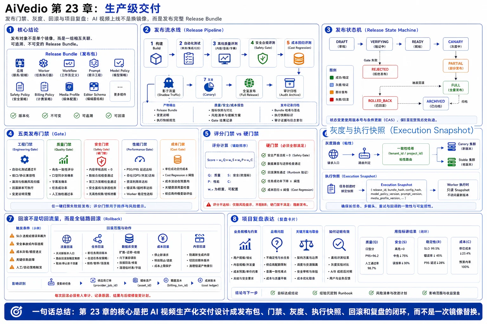
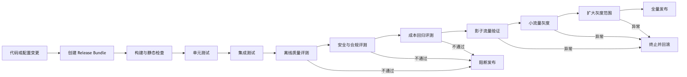
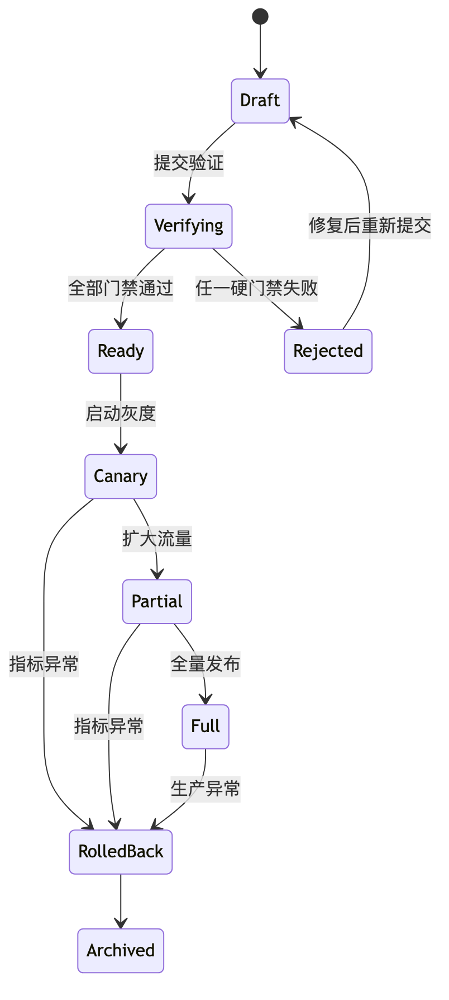
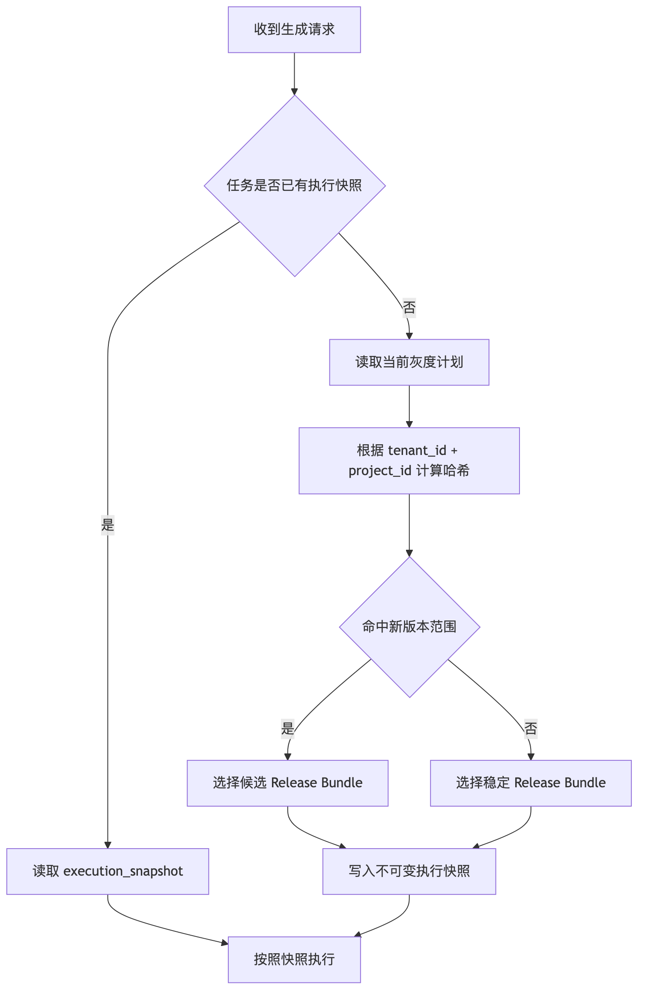

# 第23章：生产级交付——发布门禁、灰度、回滚与项目复盘



> 图注：本章全文重点总结图，围绕 Release Bundle、发布流水线、发布状态机、工程/质量/安全/性能/成本门禁、灰度粘性路由、执行快照、全链路回滚和项目复盘表达展开。

前面的章节已经解决了模型接入、任务编排、媒体处理、在线编辑、可观测性、成本核算等问题。但一个系统“能够运行”，并不等于它“能够安全上线”。

AI 视频平台的一次发布，往往同时包含：

* Go 服务代码；
* 工作流 DAG；
* 模型及供应商路由策略；
* Prompt 模板；
* 角色一致性参数；
* 安全审核策略；
* FFmpeg 转码配置；
* 计费与额度规则；
* 前端编辑器协议；
* 数据库表结构。

传统 Web 服务发布失败，通常表现为接口报错；AI 视频平台发布失败，则可能表现为画面质量下降、人物身份漂移、成本突然上涨、生成内容违规，甚至同一个项目中的不同镜头使用了不同版本的生成策略。

因此，AI 视频平台必须把“发布”设计成一套完整的工程系统，而不是一次简单的镜像替换。

---

## 23.1 AI 视频平台究竟在发布什么

在普通后端系统中，发布对象通常是一个镜像版本：

```text
video-api:v1.8.2
```

但对 AI 视频平台来说，仅记录服务镜像远远不够。

一次视频生成任务的最终结果，可能同时受到以下版本影响：

| 版本对象      | 示例                   | 主要影响        |
| --------- | -------------------- | ----------- |
| 应用版本      | `video-api:v1.8.2`   | 接口、状态机、业务逻辑 |
| 工作流版本     | `workflow:v12`       | 镜头生成和媒体处理步骤 |
| Prompt 集合 | `prompt-set:v37`     | 模型指令和生成质量   |
| 模型策略      | `model-policy:v21`   | 模型选择、降级和路由  |
| 安全策略      | `safety-policy:v9`   | 审核、拦截和人工复核  |
| 计费策略      | `billing-policy:v14` | 预占、结算和退款    |
| 媒体配置      | `media-profile:v8`   | 编码、码率和分辨率   |
| 前端协议      | `editor-schema:v6`   | 时间线和项目数据结构  |

如果只回滚应用镜像，却没有回滚 Prompt、工作流和路由策略，平台表面上完成了回滚，实际执行结果仍可能继续异常。

因此，本章引入一个核心概念：

> **发布包 Release Bundle：一次生产变更涉及的全部版本及其依赖关系的不可变快照。**

一个发布包可以表示为：

```json
{
  "release_id": "rel_20260625_001",
  "app_version": "video-api:v1.8.2",
  "worker_version": "video-worker:v2.4.1",
  "workflow_version": "workflow:v12",
  "prompt_set_version": "prompt-set:v37",
  "model_policy_version": "model-policy:v21",
  "safety_policy_version": "safety-policy:v9",
  "billing_policy_version": "billing-policy:v14",
  "media_profile_version": "media-profile:v8",
  "editor_schema_version": "editor-schema:v6"
}
```

发布包创建后不得直接修改。任何字段发生变化，都必须创建新的发布包。

---

## 23.2 发布系统总体架构

完整发布过程不应直接从代码仓库进入生产环境，而应依次经过构建、自动化测试、离线评测、影子流量、灰度发布和全量发布。



发布控制面主要负责：

1. 管理发布包；
2. 执行发布门禁；
3. 配置灰度范围；
4. 控制流量版本；
5. 监控发布指标；
6. 触发自动熔断；
7. 执行回滚；
8. 保存完整审计记录。

执行面则根据发布控制面下发的版本快照运行任务。

两者必须分离。业务 Worker 不应自行决定“使用最新版本”，而应严格按照任务创建时绑定的执行快照运行。

---

## 23.3 发布状态机

一个发布包可以采用如下状态机：



建议状态语义如下：

| 状态            | 含义             |
| ------------- | -------------- |
| `DRAFT`       | 发布包仍在编辑        |
| `VERIFYING`   | 正在执行测试和评测      |
| `READY`       | 所有门禁通过，可以灰度    |
| `CANARY`      | 正在小流量验证        |
| `PARTIAL`     | 正在扩大灰度比例       |
| `FULL`        | 已成为默认生产版本      |
| `REJECTED`    | 门禁失败           |
| `ROLLED_BACK` | 已停止接收新流量       |
| `ARCHIVED`    | 已归档，仅用于审计和历史任务 |

状态变更必须通过条件更新或版本号实现并发控制，避免两个发布操作同时修改同一个发布包。

---

## 23.4 发布门禁设计

发布门禁不能只检查接口是否返回 `200`。AI 视频平台至少需要五类门禁。

### 23.4.1 工程门禁

工程门禁检查系统是否满足基本的软件工程要求：

* 单元测试通过；
* 集成测试通过；
* 数据库变更可以前向和后向兼容；
* API 协议没有非兼容变更；
* 镜像不存在高危漏洞；
* 配置项完整；
* 回滚脚本存在；
* Worker 能够读取新旧两种任务结构。

### 23.4.2 质量门禁

质量门禁检查生成结果是否发生退化。

常见评测维度包括：

* 文本指令遵循度；
* 角色身份一致性；
* 镜头间时序一致性；
* 动作自然度；
* 画面清晰度；
* 口型和音频同步；
* 字幕准确率；
* 视频是否可正常播放；
* 人工偏好胜率；
* 最终任务成功率。

仅依赖单一图像相似度指标是不够的。比如新版本可能提高画面清晰度，却降低角色一致性。

平台应维护一套固定的黄金评测集：

```text
黄金评测集
├── 单人角色镜头
├── 多人交互镜头
├── 长镜头
├── 快速动作镜头
├── 复杂运镜
├── 中英文字幕
├── 对话和口型同步
├── 不同画幅
├── 敏感内容边界案例
└── 历史线上失败案例
```

历史故障样本必须持续加入回归集。否则，同一种事故可能在后续版本中反复出现。

### 23.4.3 安全门禁

安全门禁属于硬门禁，不能被综合评分抵消。

例如，新版本虽然质量提高了 5%，但高风险内容漏检率增加，此版本仍不能进入生产环境。

应检查：

* 输入内容审核；
* 输出关键帧审核；
* 全视频抽帧或时序审核；
* 音频和字幕审核；
* 未成年人、暴力、色情等风险；
* 人脸和公众人物风险；
* 水印与来源标识；
* 审核服务失败时的默认策略。

对于高风险结果，默认策略应当是阻断或进入人工复核，而不是直接放行。

### 23.4.4 性能门禁

需要对比新旧版本的：

* 请求提交延迟；
* 排队等待时间；
* 首帧生成时间；
* 单镜头生成时间；
* 整体视频完成时间；
* CPU、GPU 和内存使用率；
* Worker 并发度；
* 外部供应商超时率；
* 媒体转码吞吐量。

性能门禁应使用相同输入和近似负载进行对比，避免因为样本难度不同而得出错误结论。

### 23.4.5 成本门禁

对于 AI 视频平台，质量提升并不意味着版本可以上线。

假设新版本的生成成功率从 86% 提高到 89%，但单位成功视频成本上涨了 70%，那么该版本可能并不具备商业可行性。

推荐使用“单位成功交付成本”：

[
C_{success} =
\frac{
C_{model}+C_{gpu}+C_{storage}+C_{traffic}+C_{review}
}{
N_{successful\ deliveries}
}
]

这里不能简单除以任务数量，因为失败任务同样产生了模型和计算成本。

成本门禁应同时观察：

* 单位成功镜头成本；
* 单位成功视频成本；
* 单位视频分钟成本；
* 重试成本占比；
* 供应商成本偏差；
* 存储和下载流量成本；
* 人工审核成本；
* 退款和补偿金额。

---

## 23.5 评分门禁与硬门禁

可以为质量、稳定性、性能和成本建立综合评分：

[
Score =
w_qQ + w_sS + w_pP + w_cC
]

其中：

* (Q)：质量得分；
* (S)：稳定性得分；
* (P)：性能得分；
* (C)：成本得分；
* (w)：各维度权重。

但综合评分只能用于辅助排序，不能代替硬门禁。

例如：

```text
允许发布 =
    综合评分 >= 85
    AND 安全严重违规数 = 0
    AND 数据兼容性检查通过
    AND 回滚演练通过
    AND 任务成功率下降不超过阈值
```

这是因为综合评分存在“相互补偿”问题：极高的画质分数可能掩盖安全性或稳定性的严重退化。

---

## 23.6 Go 实现：发布包和门禁结果

```go
package release

import (
	"context"
	"errors"
	"fmt"
	"time"
)

type Status string

const (
	StatusDraft      Status = "DRAFT"
	StatusVerifying  Status = "VERIFYING"
	StatusReady      Status = "READY"
	StatusCanary     Status = "CANARY"
	StatusPartial    Status = "PARTIAL"
	StatusFull       Status = "FULL"
	StatusRejected   Status = "REJECTED"
	StatusRolledBack Status = "ROLLED_BACK"
	StatusArchived   Status = "ARCHIVED"
)

type Bundle struct {
	ID                  string
	AppVersion          string
	WorkerVersion       string
	WorkflowVersion     string
	PromptSetVersion    string
	ModelPolicyVersion  string
	SafetyPolicyVersion string
	BillingPolicyVersion string
	MediaProfileVersion string
	Status              Status
	Version             int64
	CreatedBy           string
	CreatedAt           time.Time
}

type GateResult struct {
	GateName  string
	Passed    bool
	HardGate  bool
	Score     float64
	Threshold float64
	Reason    string
}

type Gate interface {
	Name() string
	Evaluate(ctx context.Context, bundle Bundle) (GateResult, error)
}

type Service struct {
	gates []Gate
}

func NewService(gates ...Gate) *Service {
	return &Service{gates: gates}
}

func (s *Service) Verify(
	ctx context.Context,
	bundle Bundle,
) ([]GateResult, error) {
	if bundle.Status != StatusDraft {
		return nil, fmt.Errorf(
			"bundle status must be DRAFT, got %s",
			bundle.Status,
		)
	}

	results := make([]GateResult, 0, len(s.gates))

	for _, gate := range s.gates {
		result, err := gate.Evaluate(ctx, bundle)
		if err != nil {
			return results, fmt.Errorf(
				"evaluate gate %s: %w",
				gate.Name(),
				err,
			)
		}

		results = append(results, result)

		if result.HardGate && !result.Passed {
			return results, errors.New(
				"hard release gate rejected bundle: " +
					result.GateName,
			)
		}
	}

	return results, nil
}
```

门禁执行结果必须持久化，不能只存在于 CI 日志中。否则后续无法回答：

* 为什么这个版本被允许上线？
* 当时使用了哪一套评测数据？
* 谁批准了发布？
* 哪个门禁发生过人工豁免？
* 该版本和上一个版本的差异是什么？

---

## 23.7 灰度流量不能按请求随机分配

普通无状态接口可以把 5% 请求随机路由到新版本，但 AI 视频项目不能简单地按请求随机。

假设一个项目包含 20 个镜头，如果每个镜头独立随机选择版本，就可能出现：

* 镜头1使用旧 Prompt；
* 镜头2使用新 Prompt；
* 镜头3使用旧模型；
* 镜头4使用新角色一致性策略。

最终得到的视频会出现明显的风格和人物差异。

因此，灰度路由必须具有粘性。推荐的路由键是：

```text
tenant_id + project_id
```

当整个项目需要固定版本时，可以进一步使用：

```text
tenant_id + project_id + release_generation
```

路由流程如下：



一个简单的一致性路由实现如下：

```go
package rollout

import (
	"fmt"
	"hash/fnv"
)

type Plan struct {
	StableReleaseID    string
	CandidateReleaseID string
	Percentage         uint32 // 0-100
}

func SelectRelease(
	tenantID string,
	projectID string,
	plan Plan,
) (string, error) {
	if plan.Percentage > 100 {
		return "", fmt.Errorf(
			"invalid rollout percentage: %d",
			plan.Percentage,
		)
	}

	key := tenantID + ":" + projectID

	h := fnv.New32a()
	_, _ = h.Write([]byte(key))

	bucket := h.Sum32() % 100

	if bucket < plan.Percentage {
		return plan.CandidateReleaseID, nil
	}

	return plan.StableReleaseID, nil
}
```

该实现能保证同一个项目在灰度比例不变时稳定命中同一版本。

不过，当灰度比例从 5% 扩大到 20% 时，一部分项目会被重新映射。因此任务一旦创建，就必须把选择结果保存到执行快照中，不能在后续步骤重新计算。

---

## 23.8 执行快照：保证长任务的一致性

AI 视频任务可能运行数分钟甚至更长。在任务执行期间，生产环境可能已经发生多次发布。

因此，Worker 不能在每个步骤中读取“当前最新版本”，而必须使用任务创建时生成的执行快照。

```json
{
  "task_id": "task_90127",
  "release_id": "rel_20260625_001",
  "workflow_version": "workflow:v12",
  "prompt_set_version": "prompt-set:v37",
  "model_policy_version": "model-policy:v21",
  "safety_policy_version": "safety-policy:v9",
  "billing_policy_version": "billing-policy:v14",
  "media_profile_version": "media-profile:v8",
  "created_at": "2026-06-25T10:00:00Z"
}
```

执行快照具有三个作用：

1. **保证任务内部一致性**：所有镜头使用同一版本集合；
2. **支持问题复现**：可以重新构造当时的执行环境；
3. **支持成本审计**：明确任务使用的计费和供应商策略。

即使某个版本已经回滚，历史任务仍可能继续按照旧快照执行。平台需要明确回滚策略：

* 只阻止旧版本接收新任务；
* 允许正在执行的任务完成；
* 暂停旧版本任务，等待人工决策；
* 强制终止并重新创建任务。

默认情况下，不建议直接把执行中的任务切换到新版本，因为工作流结构和中间产物可能不兼容。

---

## 23.9 回滚不是把流量切回去

AI 视频平台的回滚至少包含五个层面。

### 23.9.1 流量回滚

停止将新项目路由到候选发布包，将默认版本切回稳定版本。

### 23.9.2 任务回滚

识别候选版本已经创建的任务，并按照任务状态分类：

| 任务状态    | 建议处理           |
| ------- | -------------- |
| 尚未执行    | 取消并重新创建        |
| 已调用外部模型 | 等待结果或进入未知结果处理  |
| 已生成部分镜头 | 保留产物，等待人工决策    |
| 正在转码    | 通常允许完成         |
| 已完成未交付  | 重新执行质量和安全审核    |
| 已交付     | 标记受影响范围并决定是否补偿 |

### 23.9.3 数据回滚

数据库变更必须遵守“扩展—迁移—收缩”原则：

1. 先增加新字段或新表；
2. 新旧版本同时兼容；
3. 完成历史数据迁移；
4. 确认旧版本不再使用；
5. 最后删除旧字段。

生产发布中不应同时执行“上线新代码”和“删除旧字段”。

### 23.9.4 成本回滚

即使任务失败或被取消，外部模型调用也可能已经产生费用。

回滚后必须处理：

* 未知结果的供应商订单；
* 重复调用产生的成本；
* 用户额度预占；
* 已结算但未交付的账单；
* 退款或平台补偿；
* 孤儿媒体文件；
* 存储和网络费用。

### 23.9.5 内容回滚

如果新版本产生了违规或严重质量异常的视频，仅切换流量是不够的，还必须定位已经生成、已经交付或已经公开分享的内容。

因此发布系统需要记录：

```text
release_id
    -> task_id
        -> project_id
            -> asset_id
                -> delivery_id
```

只有具备完整版本血缘，平台才能快速确定事故影响面。

---

## 23.10 自动停止灰度

灰度发布期间，应持续对比候选版本与稳定版本。

可以定义如下停止条件：

```text
任意条件满足则停止灰度：

1. 严重安全违规数 > 0
2. 任务成功率下降超过阈值
3. P95 完成时间显著增加
4. 单位成功视频成本超过预算
5. 供应商超时率持续升高
6. 音画同步失败率异常
7. 用户主动取消率明显上升
8. 人工质量评分显著下降
```

关键问题是：不能只对比绝对指标，还要考虑样本难度。

例如，候选版本可能恰好接收到更多长视频任务，导致平均完成时间更高。因此应按照以下维度分桶比较：

* 视频时长；
* 分辨率；
* 镜头数量；
* 模型类型；
* 租户等级；
* 是否使用角色参考图；
* 是否包含口型同步；
* 是否启用高清增强；
* 供应商和区域。

平台应优先比较同一分桶中的稳定版本与候选版本，而不是只比较全局平均值。

---

## 23.11 核心数据表

### 23.11.1 发布包表

```sql
CREATE TABLE release_bundle (
    id                      VARCHAR(64) PRIMARY KEY,
    app_version             VARCHAR(128) NOT NULL,
    worker_version          VARCHAR(128) NOT NULL,
    workflow_version        VARCHAR(128) NOT NULL,
    prompt_set_version      VARCHAR(128) NOT NULL,
    model_policy_version    VARCHAR(128) NOT NULL,
    safety_policy_version   VARCHAR(128) NOT NULL,
    billing_policy_version  VARCHAR(128) NOT NULL,
    media_profile_version   VARCHAR(128) NOT NULL,
    status                  VARCHAR(32) NOT NULL,
    bundle_hash             VARCHAR(128) NOT NULL,
    version                 BIGINT NOT NULL DEFAULT 0,
    created_by              VARCHAR(64) NOT NULL,
    created_at              TIMESTAMP NOT NULL,
    updated_at              TIMESTAMP NOT NULL
);
```

### 23.11.2 门禁结果表

```sql
CREATE TABLE release_gate_result (
    id              BIGINT PRIMARY KEY AUTO_INCREMENT,
    release_id      VARCHAR(64) NOT NULL,
    gate_name       VARCHAR(128) NOT NULL,
    dataset_version VARCHAR(128),
    passed          BOOLEAN NOT NULL,
    hard_gate       BOOLEAN NOT NULL,
    score           DECIMAL(10, 4),
    threshold_value DECIMAL(10, 4),
    result_detail   JSON NOT NULL,
    created_at      TIMESTAMP NOT NULL,
    INDEX idx_release_gate (release_id, gate_name)
);
```

### 23.11.3 灰度计划表

```sql
CREATE TABLE rollout_plan (
    id                    VARCHAR(64) PRIMARY KEY,
    stable_release_id     VARCHAR(64) NOT NULL,
    candidate_release_id  VARCHAR(64) NOT NULL,
    rollout_percentage    INT NOT NULL,
    status                VARCHAR(32) NOT NULL,
    scope_config          JSON NOT NULL,
    stop_conditions       JSON NOT NULL,
    started_at            TIMESTAMP NULL,
    completed_at          TIMESTAMP NULL,
    created_by            VARCHAR(64) NOT NULL,
    created_at            TIMESTAMP NOT NULL
);
```

### 23.11.4 任务执行快照表

```sql
CREATE TABLE execution_snapshot (
    task_id                 VARCHAR(64) PRIMARY KEY,
    release_id              VARCHAR(64) NOT NULL,
    workflow_version        VARCHAR(128) NOT NULL,
    prompt_set_version      VARCHAR(128) NOT NULL,
    model_policy_version    VARCHAR(128) NOT NULL,
    safety_policy_version   VARCHAR(128) NOT NULL,
    billing_policy_version  VARCHAR(128) NOT NULL,
    media_profile_version   VARCHAR(128) NOT NULL,
    snapshot_data           JSON NOT NULL,
    created_at              TIMESTAMP NOT NULL,
    INDEX idx_snapshot_release (release_id)
);
```

---

## 23.12 五类生产事故演练

发布流程是否可靠，不能只看文档，还必须通过演练验证。

### 演练一：Prompt 更新导致角色漂移

**故障现象：**

新 Prompt 提高了动作幅度，但破坏了角色面部稳定性。

**检测方式：**

* 角色一致性评分下降；
* 人工评测胜率下降；
* 用户重新生成率上升；
* 同一项目镜头间的人脸特征差异增大。

**处置方式：**

1. 停止候选版本接收新项目；
2. 保留问题样本；
3. 查找受影响的任务和资产；
4. 回滚 Prompt 集合；
5. 对未交付任务重新生成；
6. 将事故样本加入黄金评测集。

### 演练二：供应商超时引发重复扣费

**故障现象：**

平台调用供应商后本地超时，重试又创建了第二个供应商任务。

**检测方式：**

* 同一幂等键存在多个供应商订单；
* 供应商成本上涨但成功任务数未增加；
* 未知结果任务数量升高。

**处置方式：**

* 暂停自动重试；
* 查询供应商订单真实状态；
* 对重复结果进行去重；
* 修正成本账本；
* 释放或退回用户额度；
* 将调用改为幂等提交或提交后查询。

### 演练三：安全策略版本错误

**故障现象：**

某类高风险视频未被新审核规则拦截。

**处置优先级：**

1. 立即停止灰度；
2. 禁止问题版本继续交付；
3. 查找该版本生成的全部资产；
4. 对历史资产重新审核；
5. 撤销公开链接或分享权限；
6. 进入安全事故复盘。

安全事故不能等到普通发布会议再处理。

### 演练四：媒体配置导致音画不同步

**故障现象：**

新的 FFmpeg 参数导致部分可变帧率视频音画错位。

**检测方式：**

* 音视频轨道时长偏差；
* 时间戳单调性检查失败；
* 用户导出后重新生成率升高；
* 播放器兼容性测试失败。

**处置方式：**

* 回滚媒体配置；
* 保留原始中间文件；
* 对受影响成品重新封装；
* 不必重新调用昂贵的生成模型。

### 演练五：计费规则发布错误

**故障现象：**

高清增强费用被漏算，或者同一任务被重复结算。

**处置方式：**

* 冻结问题计费规则；
* 切回上一版本；
* 根据执行快照重放计费计算；
* 生成差异账单；
* 少扣时由平台决定是否补扣；
* 多扣时自动退款；
* 对账结果进入审计记录。

计费策略同样属于发布包的一部分，不能脱离业务版本独立漂移。

---

## 23.13 上线前检查清单

### 发布内容

* [ ] 发布包中的所有版本已经固定；
* [ ] 发布包哈希已生成；
* [ ] 变更内容和影响范围已记录；
* [ ] 数据库变更支持新旧版本共存；
* [ ] 配置和密钥已在目标环境验证。

### 质量和安全

* [ ] 黄金评测集全部执行；
* [ ] 历史事故样本已经回归；
* [ ] 人工质量评测完成；
* [ ] 安全硬门禁通过；
* [ ] 审核服务异常时的降级策略已验证。

### 稳定性

* [ ] 压测结果满足容量要求；
* [ ] 外部供应商限流策略已验证；
* [ ] 重试不会突破并发和成本预算；
* [ ] 消息积压告警已配置；
* [ ] Worker 优雅退出经过验证。

### 灰度和回滚

* [ ] 灰度路由键已经确定；
* [ ] 同一项目能够稳定命中同一版本；
* [ ] 自动停止条件已经配置；
* [ ] 回滚操作已经演练；
* [ ] 旧版本镜像和配置仍然可用；
* [ ] 执行中任务的处理策略已经确定。

### 账务和成本

* [ ] 成本门禁通过；
* [ ] 供应商价格配置已核对；
* [ ] 预占、结算和退款流程已验证；
* [ ] 发布版本可追溯到成本账本；
* [ ] 回滚后的差异对账脚本可执行。

### 运维和责任

* [ ] 发布负责人明确；
* [ ] 值班人员已知晓变更；
* [ ] 监控面板已准备；
* [ ] 故障 Runbook 已更新；
* [ ] 关键操作保留审计日志。

---

## 23.14 项目复盘应该讲什么

完成系统后，项目复盘不能只罗列使用了哪些技术。

低质量表达通常是：

> 我们使用 Go、MySQL、Redis、Kafka、Kubernetes 和多个 AI 模型搭建了一个视频生成平台。

这只能说明技术栈，无法证明设计能力。

更好的项目表达应围绕四个问题展开。

### 1. 业务规模和约束是什么

需要说明：

* 用户提交的是单镜头还是完整项目；
* 一次任务包含多少异步步骤；
* 外部模型调用是否昂贵；
* 任务通常运行多长时间；
* 用户是否可以取消、重试和重新编辑；
* 平台如何定义成功交付；
* 安全和成本是否属于核心约束。

### 2. 最困难的问题是什么

AI 视频平台的核心难点通常不是 CRUD，而是：

* 长任务状态一致性；
* 外部供应商未知结果；
* 多镜头角色一致性；
* 模型、Prompt 和工作流的联合版本管理；
* 高成本任务的重试边界；
* 媒体处理链路的可恢复性；
* 发布后质量退化难以及时发现。

### 3. 关键方案为什么这样选

不要只讲“用了消息队列”，而要讲清楚：

* 为什么同步调用不合适；
* 为什么任务必须绑定执行快照；
* 为什么灰度要按项目而不是按请求；
* 为什么回滚不能直接修改执行中的任务；
* 为什么成本要按成功交付计算；
* 为什么安全指标必须设置为硬门禁。

### 4. 如何证明方案有效

可以从以下方面说明：

* 任务成功率；
* 重试次数；
* 平均和 P95 完成时间；
* 单位成功视频成本；
* 角色一致性评分；
* 发布失败恢复时间；
* 重复结算率；
* 未知结果任务数量；
* 灰度阶段发现的问题数量。

没有真实数字时，不应虚构，可以使用实际项目数据或区间。

---

## 23.15 三分钟面试口述稿

> 我参与设计了一个 AI 视频生成平台。这个系统和普通内容平台最大的区别，是一次视频生成会跨越脚本拆解、分镜生成、模型调用、角色一致性处理、音频处理、媒体合成、安全审核和交付等多个异步阶段，而且每一步都会产生计算成本和中间资产。
>
> 我们首先把整个生成过程建模成可恢复的任务状态机，每个步骤通过幂等键、租约和事件驱动执行。对于外部模型调用，本地超时不直接认定为失败，而是进入未知结果状态，再通过供应商任务号查询真实结果，避免盲目重试造成重复成本。
>
> 在版本管理方面，我们没有只记录应用镜像，而是把应用、工作流、Prompt、模型路由、安全策略、计费规则和媒体配置组成不可变的发布包。每个任务创建时都会绑定执行快照，因此即使平台中途发布新版本，同一个项目的所有镜头仍然使用一致的配置。
>
> 发布时我们先执行离线质量、安全、性能和成本门禁，再进行按租户和项目维度的粘性灰度。之所以不按请求随机灰度，是因为同一个项目中的不同镜头如果命中不同版本，会造成角色和画面风格不一致。
>
> 灰度期间，我们持续对比稳定版本和候选版本的任务成功率、完成时间、角色一致性、用户重生成率和单位成功视频成本。出现安全违规、明显质量下降或成本突破预算时，系统会自动停止灰度。
>
> 回滚也不只是切换流量。我们会根据执行快照识别受影响的任务、资产、供应商订单和账务记录，对未执行任务重新创建，对未知结果进行查询，对已交付内容重新审核，并通过对账任务处理额度和成本差异。
>
> 这个项目让我最深的体会是，AI 应用的生产化不能只关注模型效果，还必须把质量、安全、稳定性和成本纳入同一个工程闭环。

---

## 23.16 面试深挖题

### 1. 为什么发布包必须不可变？

因为历史任务、问题复现、成本审计和安全追踪都依赖精确版本。直接修改旧发布包会破坏历史事实。

### 2. 为什么不能让 Worker 每次读取最新 Prompt？

长任务可能跨越多次发布，动态读取会导致同一个视频中的不同镜头使用不同策略。

### 3. 为什么灰度不能按请求随机？

AI 视频项目具有上下文和风格一致性要求。随机路由会让同一项目内部混用新旧版本。

### 4. 已回滚版本的执行中任务怎么办？

默认保留原执行快照，根据风险决定继续、暂停或重建。不能直接把任务切换到结构可能不兼容的新版本。

### 5. 如何评价新模型是否值得上线？

同时比较质量、成功率、延迟、安全性和单位成功交付成本，而不是只比较单次生成价格或画面评分。

### 6. 为什么安全指标必须是硬门禁？

综合评分允许不同维度互相补偿，但严重安全风险不能被画质或性能提升抵消。

### 7. 数据库应该如何支持应用回滚？

采用扩展—迁移—收缩策略，让新旧版本在灰度期间同时兼容数据结构。

### 8. 外部模型调用超时后为什么不能立即重试？

本地超时不代表供应商任务未创建。直接重试可能造成重复生成和重复成本。

### 9. 如何确定一次发布影响了哪些用户？

通过 `release_id → task_id → project_id → asset_id → delivery_id` 的完整版本血缘查询。

### 10. 为什么要使用单位成功交付成本？

失败和重试同样消耗资源。只计算单次调用价格无法反映平台真正的商业成本。

### 11. 发布门禁失败能否人工跳过？

可以为非硬门禁设计受控豁免，但必须记录审批人、原因、有效期和风险。安全、数据兼容性等硬门禁原则上不允许跳过。

### 12. 如何避免灰度样本不公平？

按照时长、分辨率、镜头数量、模型、功能和供应商等维度分桶，在相近任务之间比较稳定版本和候选版本。

---

## 23.17 本章小结

本章完成了 AI 视频平台从“功能可用”到“生产可交付”的最后一段闭环。

核心结论包括：

1. 发布对象不是单个镜像，而是应用、工作流、Prompt、模型策略、安全策略、计费规则和媒体配置组成的不可变发布包。
2. 每个任务必须在创建时绑定执行快照，保证长任务和多镜头项目的版本一致性。
3. 发布门禁必须同时覆盖工程质量、生成质量、安全、性能和成本。
4. 灰度应按租户或项目进行粘性路由，不能按单次请求随机分配。
5. 回滚不仅包括流量切换，还要处理执行中任务、供应商订单、媒体资产、用户额度和成本账本。
6. AI 视频平台的真正交付标准，不是某一次视频能够生成，而是系统能够持续、稳定、安全且成本可控地生成视频。
