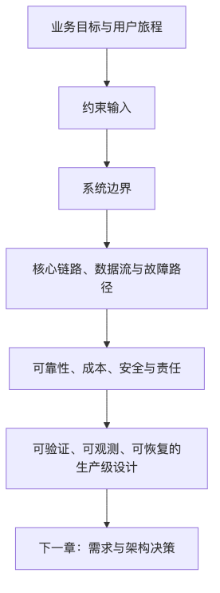

# 第一篇：系统设计的基本坐标

这一篇的任务不是教读者背几种架构图，也不是把缓存、消息队列、分库分表这些词重新排列组合。它要先建立一套共同语言：**系统设计到底在设计什么，约束从哪里来，系统边界如何划定，一个设计上线后如何被验证、负责、观测、恢复和演进。**

现代互联网系统越来越像一座运行中的城市。用户看到的是一个按钮、一条消息、一次支付、一次问答；工程师面对的却是客户端、网关、服务、数据库、缓存、消息队列、第三方 API、云服务、配置系统、证书、DNS、AI 模型和运营后台共同组成的复杂协作网络。系统设计不是让每个组件都完美，而是在明知组件会失败的前提下，安排它们以可控的方式失败、恢复和演进。

---

# 第 1 章：现代互联网系统设计导论

## 本章的问题链

先看原始问题：很多人第一次学系统设计时，会把它当成一场技术选型考试：Redis、Kafka、微服务、Kubernetes 看起来像一串必须背下来的答案。真正的问题是，如果还没有说清业务目标、可靠性边界、成本约束和演进压力，任何组件选择都只是局部猜测。

为了解决这个问题，本章先把系统设计还原成约束管理：从用户旅程、数据流、控制流、故障传播、观测、恢复、成本和责任边界去看系统，而不是从工具清单去看系统。

但这不是终点：建立这套坐标以后，新的问题马上出现：约束不是凭感觉写出来的，下一步必须把模糊需求转成能被评审、取舍和复盘的架构决策。

所以本章会按“问题 -> 机制 -> 新问题”的顺序展开：先把眼前的工程压力说清楚，再看对应机制解决了什么，最后讨论它留下的边界和下一步。



## 1. 本章解决什么问题

很多工程师第一次接触 system design 时，会把它理解成一种“技术选型考试”：
“要不要用 Redis？”
“要不要上 Kafka？”
“数据库怎么分库分表？”
“微服务怎么拆？”
“是不是应该放到 Kubernetes 上？”

这些问题并不是不重要，但它们都不是起点。真正的起点是：**我们要解决什么业务问题？系统要承受什么约束？哪些失败可以接受，哪些失败不能接受？这个系统未来如何变化？谁来维护它？花多少钱是合理的？**

现代互联网系统设计，本质上是用不可靠的人、代码、机器、网络、云服务、第三方依赖和 AI 模型，构造一个在现实约束下足够可靠、可演进、可治理、可观测、成本可控的系统。

所谓“足够可靠”，不是绝不失败。那是神话，不是工程。工程里的可靠，是指系统在预期故障范围内仍然能提供核心价值；在超出预期时，能快速发现、隔离、降级、恢复，并把事故经验转化成下一轮设计改进。

本章要建立三个基本判断：

第一，**系统设计不是技术堆叠，而是约束管理。**

第二，**系统不是由组件组成的，而是由用户旅程、数据流、控制流和故障传播路径组成的。**

第三，**一个设计如果不能回答“为什么要做、怎么证明可行、坏了怎么办、谁负责、成本多少、如何演进”，它还不是生产级设计。**

## 2. 什么是现代互联网系统设计

现代互联网系统设计，是在业务目标、用户体验、工程复杂度、成本、安全、可靠性、合规和组织能力之间做长期取舍的过程。

它的对象不只是后端服务，也包括：

* 用户使用的客户端；
* 流量进入系统的 DNS、CDN、WAF、API Gateway；
* 服务之间的同步与异步通信；
* 数据库、缓存、搜索、对象存储、向量数据库；
* 任务调度、消息队列、事件流；
* 可观测性、发布系统、配置系统；
* 安全、权限、审计、风控；
* 云服务、第三方 API、支付通道、短信通道；
* AI 模型、Prompt、RAG 检索、工具调用和人工审核流程；
* 团队分工、值班机制、事故响应和架构决策记录。

从表面看，一个“提交订单”请求可能只是浏览器调用一个 `/orders` API。真实生产系统里，它可能经过如下路径：

```text
用户
  |
  | 点击“提交订单”
  v
客户端 App / Web / 小程序
  |
  | HTTPS 请求、Token、设备信息、埋点
  v
DNS / CDN / WAF / API Gateway
  |
  | 鉴权、限流、路由、灰度、Header 透传
  v
订单服务
  |
  | 校验商品、价格、优惠、库存、地址、风控
  +------------------+------------------+------------------+
  |                  |                  |                  |
  v                  v                  v                  v
库存服务           支付服务           优惠券服务          风控服务
  |                  |                  |                  |
  v                  v                  v                  v
数据库 / 缓存     第三方支付通道     营销系统           模型/规则引擎
  |
  | 订单状态变更
  v
消息队列 / 事件流
  |
  +---------> 发货系统
  +---------> 通知系统
  +---------> 数据仓库
  +---------> 客服后台
  +---------> 风控回放
```

这里的每一条线都可能变慢、失败、重复执行、返回不一致结果，甚至在压力下把问题放大。真正的系统设计不是画出这些框，而是回答：

* 哪些调用必须同步完成？
* 哪些动作可以异步完成？
* 哪些失败应该阻止下单？
* 哪些失败只需要补偿？
* 用户看到什么状态？
* 数据库写成功但消息发送失败怎么办？
* 支付成功但订单状态没更新怎么办？
* 库存扣减失败但优惠券已锁定怎么办？
* 第三方支付超时，是失败、成功，还是未知？
* 系统如何知道哪里坏了？
* 值班工程师如何恢复？
* 业务方如何理解损失范围？

这就是现代系统设计的日常。

## 3. 为什么系统设计不是“技术选型题”

技术选型题通常会问：“用 A 还是 B？”
架构设计真正要问的是：“在当前约束下，用 A 或 B 会带来哪些长期后果？”

同样是消息队列，在不同系统里意义完全不同。

对一个创业早期的订单系统来说，引入 Kafka 可能只是为了“看起来可扩展”，结果团队没有人会运维，消息积压没人发现，消费幂等没做好，事故时甚至不知道该重放还是跳过。

对一个成熟电商平台来说，事件流可能是订单、履约、营销、风控、数据分析之间的核心解耦机制。没有事件流，任何订单状态变化都会变成同步调用风暴，发版和故障隔离都很困难。

所以问题不是“Kafka 好不好”，而是：

* 这个业务是否需要异步解耦？
* 是否允许最终一致？
* 消费者能否处理重复和乱序？
* 消息积压如何发现？
* 事件版本如何演进？
* 生产事故时谁能处理？
* 团队是否有能力维护这套基础设施？
* 成本是否低于它减少的复杂度？

微服务、Kubernetes、Serverless、AI 模型也是一样。它们都不是架构荣誉勋章，而是带有代价的工具。一个成熟架构师关心的不是“有没有用先进技术”，而是“引入它之后，系统的失败模式、成本模型和责任边界发生了什么变化”。

## 4. 系统从用户请求到返回结果的参与者

一个请求从用户点击按钮开始，到页面展示结果结束，中间参与者远比多数人想象的多。

### 4.1 用户与客户端

用户不是稳定输入源。用户会重复点击、刷新页面、断网重试、切换设备、回退页面、扫码支付后关闭 App。客户端也不可靠：版本碎片化、弱网、缓存过期、系统权限限制、浏览器兼容、时钟不准、Token 过期，都可能改变请求行为。

因此，现代系统设计不能只从服务端开始。客户端需要参与幂等、降级、灰度、埋点、安全和体验设计。

### 4.2 入口层

DNS、CDN、WAF、API Gateway、负载均衡器是用户请求进入系统前的第一组关键组件。它们决定了：

* 用户能否解析到正确地址；
* 静态资源是否就近访问；
* 恶意流量是否被拦截；
* TLS 证书是否有效；
* 请求是否被正确路由；
* 限流和鉴权是否在入口处生效；
* 灰度流量是否进入正确版本。

很多全站事故不是业务服务写错了，而是 DNS 配错、证书过期、CDN 缓存污染、网关规则误发布。

### 4.3 服务层

服务层处理业务规则。它往往不只是一个服务，而是一组服务：用户、订单、商品、库存、支付、优惠、风控、通知、搜索、推荐、AI 网关等。服务之间的关系会决定系统复杂度。

同步调用链太长，尾延迟会累积；异步链路太多，状态追踪和一致性会变难；共享数据库看似简单，但会破坏边界；服务粒度太细，部署和排障成本会上升。

### 4.4 数据层

数据层包括关系数据库、NoSQL、缓存、搜索索引、对象存储、数据仓库、向量数据库等。数据层设计决定了系统能否回答这些问题：

* 数据如何写入？
* 如何读取？
* 如何保证一致性？
* 如何扩展？
* 如何备份和恢复？
* 如何删除？
* 如何审计？
* 如何支持多租户隔离？
* 如何应对热点和历史数据膨胀？

数据库不是系统最后的“保险箱”。错误的数据模型、错误的索引、错误的分片键，会在业务增长后变成最难偿还的债。

### 4.5 异步任务与后台系统

很多用户动作并不需要在请求内完成。例如发送通知、生成发票、更新搜索索引、同步数据仓库、训练推荐特征、调用低优先级 AI 分析等，都可以异步化。

但异步不是免费的。它带来重复、乱序、积压、重放、死信、最终一致性和排查困难。一个生产级异步系统必须设计消息模型、消费幂等、重试策略、死信处理、人工修复和审计链路。

### 4.6 第三方依赖与云服务

现代系统越来越依赖外部能力：支付、短信、地图、OCR、风控、邮件、云数据库、对象存储、CDN、模型 API。第三方依赖的问题在于：你不能控制它们的发布、容量、故障和响应时间，却要对用户体验负责。

因此，第三方依赖必须被设计成“不可信但可用”的组件：有超时、有重试、有熔断、有降级、有替代通道、有成本上限、有审计和对账。

### 4.7 AI 模型

AI 模型带来了新的不可靠性。传统函数通常是确定性的：相同输入大概率得到相同输出。大模型则可能因为模型版本、上下文、采样参数、检索结果、Prompt、工具状态变化而产生不同输出。

在 AI 原生系统里，模型不是“聪明一点的 API”，而是概率性组件。系统设计要回答：

* 结果不确定怎么办？
* 幻觉如何降低？
* 高风险输出是否需要人工审核？
* 模型供应商不可用怎么办？
* Token 成本如何控制？
* 用户数据是否会泄露？
* 模型调用失败时业务如何降级？
* AI 生成内容如何审计和追责？

## 5. 现代系统的不可靠来源为什么变多了

早期系统的不可靠来源主要是代码 Bug、机器故障、数据库压力和网络异常。现代系统的不可靠来源明显扩展了。

### 5.1 人

人会误操作、误发布、误删数据、误配权限、误判告警。越是复杂系统，越不能依赖“大家小心一点”。好的系统设计应该把人的错误纳入故障模型：审批、灰度、回滚、权限最小化、变更审计、自动校验、Runbook，都是对人不可靠性的工程回应。

### 5.2 代码

代码会有 Bug。更麻烦的是，Bug 不只来自业务代码，还来自依赖包、SDK、生成代码、AI 生成代码、基础镜像和运行时。代码问题也不一定在发布后立刻暴露，可能只在某个租户、某个地区、某种流量形态、某个缓存状态下出现。

### 5.3 机器与资源

机器会宕机，磁盘会满，CPU 会打满，内存会泄漏，容器会被驱逐，线程池会耗尽，连接池会打满。云环境降低了硬件管理成本，但没有消除资源约束。资源只是从“买机器”变成了“申请、调度、限额、账单和弹性”。

### 5.4 网络

网络不是透明管道。它会抖动、分区、丢包、延迟升高、DNS 解析失败、TLS 握手失败、跨地域链路不稳定。分布式系统最危险的地方之一，是调用方无法轻易区分“下游失败”“请求丢失”“响应丢失”“下游成功但返回超时”。

### 5.5 配置、证书和 DNS

很多严重事故来自非代码变更。配置错误、Feature Flag 打错人群、证书过期、DNS TTL 设置不合理、路由规则误删，都可能造成比代码 Bug 更大的影响。配置也是生产系统的一部分，也需要评审、灰度、回滚和审计。

### 5.6 供应链

现代系统依赖大量第三方库、容器镜像、构建插件、CI/CD 工具、SaaS 平台。供应链问题可能在开发阶段引入，在构建阶段放大，在生产阶段爆炸。系统设计要关注的不只是运行时架构，还包括代码如何进入生产。

### 5.7 AI 模型与数据

AI 系统新增了模型不可控、训练数据污染、检索数据过期、Prompt Injection、工具越权、输出不稳定、成本攻击等问题。这些问题不是靠“Prompt 写好一点”就能解决，而要进入权限、审计、评测、沙箱和人工审核机制。

## 6. 系统设计的输入和输出

一个系统设计不是从空白架构图开始的。它应该有明确输入，也应该产出可评审、可执行、可追踪的输出。

### 6.1 输入：设计之前必须知道什么

设计输入至少包括：

| 输入类型   | 需要回答的问题                            |
| ------ | ---------------------------------- |
| 业务目标   | 为什么要做？成功如何衡量？收入、留存、效率、合规还是成本优化？    |
| 用户与场景  | 谁在使用？高频路径是什么？失败后用户能否接受？            |
| 功能性需求  | 系统必须做哪些动作？哪些是第一版必须有，哪些可以延后？        |
| 非功能性需求 | 延迟、吞吐、可用性、耐久性、一致性、安全、合规、成本目标是什么？   |
| 用户规模   | 当前 DAU、MAU、租户数、QPS、数据量是多少？增长预期是什么？ |
| 数据特征   | 数据模型、读写比例、热点、生命周期、删除要求、审计要求是什么？    |
| 依赖约束   | 依赖哪些内部服务、第三方 API、云服务、模型供应商？        |
| 团队约束   | 团队人数、经验、值班能力、平台能力、运维能力如何？          |
| 时间约束   | 什么时候上线？是否需要迁移旧系统？是否有活动峰值？          |
| 成本边界   | 每月预算、单请求成本、单租户成本、云资源上限是多少？         |

如果这些输入模糊，架构图画得越漂亮，风险越大。因为你优化的可能不是问题本身，而是想象中的问题。

### 6.2 输出：设计完成后应该留下什么

系统设计的输出不应该只有一张图。生产级设计至少应该产出：

| 输出物        | 目的                         |
| ---------- | -------------------------- |
| 架构图        | 描述系统上下文、核心组件、依赖和部署关系       |
| 核心链路说明     | 描述读路径、写路径、异步路径、控制路径、故障路径   |
| 数据模型       | 描述核心实体、关系、索引、生命周期、隔离方式     |
| API / 事件契约 | 描述服务之间如何交互、版本如何演进、错误如何表达   |
| 容量估算       | 估算 QPS、存储、带宽、峰值、增长和成本      |
| 故障模型       | 描述哪些组件会失败、失败如何传播、如何隔离      |
| 降级方案       | 描述核心链路、非核心链路、可降级链路         |
| 可观测性方案     | 描述日志、指标、Trace、业务监控、告警和排障入口 |
| 安全与权限设计    | 描述身份、鉴权、授权、审计、数据保护         |
| 发布与回滚方案    | 描述灰度、兼容、回滚、数据变更和配置变更       |
| 演进路线       | 描述第一版、增长期、成熟期分别怎么做         |
| ADR        | 记录关键决策、上下文、替代方案和后果         |

其中 ADR，即 Architecture Decision Record，是记录架构决策的轻量文档。Michael Nygard 在 2011 年的文章中推广了这种做法，强调把对系统结构、非功能特性、依赖、接口或构建技术有长期影响的决策记录下来，并说明上下文、决策和后果；Martin Fowler 也强调 ADR 应该短小、聚焦单个决策，并在决策被替代时保留历史记录而不是直接改写旧结论。([Cognitect.com][1])

## 7. 功能性需求与非功能性需求

功能性需求描述系统“做什么”。例如：

* 用户可以创建订单；
* 用户可以支付订单；
* 商家可以发货；
* 客服可以查询订单；
* 系统可以向用户发送通知；
* 企业用户可以上传文档并进行 RAG 问答。

非功能性需求描述系统“以什么质量做”。例如：

* 99.9% 的订单创建请求在 300ms 内返回；
* 订单数据持久化后不能丢失；
* 支付状态最终必须与支付通道对账一致；
* 企业租户之间的数据不能互相访问；
* 单次问答成本不能超过某个金额；
* 第三方模型不可用时必须降级到基础回答或人工工单；
* 系统要支持三个月后从单区域演进到多区域灾备。

很多失败的架构不是因为功能没实现，而是非功能性需求没有被显式设计。一个订单系统“能下单”很容易；在大促峰值、支付超时、库存热点、优惠券异常、消息积压、客服介入、对账不平时仍然可控，才是系统设计。

## 8. 核心链路、非核心链路与降级链路

系统设计必须区分不同链路的重要性。

### 8.1 核心链路

核心链路是用户价值闭环中不能轻易失败的路径。例如电商系统中的创建订单、支付、扣减库存；企业 RAG 系统中的权限校验、知识检索、回答生成和引用展示。

核心链路应该被优先保障：容量、监控、限流、降级、值班、故障演练都要围绕它展开。

### 8.2 非核心链路

非核心链路失败不会立刻破坏主要业务价值。例如订单后的营销推荐、积分异步发放、运营报表刷新、非关键通知、用户行为画像更新。这些链路可以异步化、延迟处理，甚至在压力下暂停。

### 8.3 可降级链路

可降级链路介于核心和非核心之间。它对体验有帮助，但失败时可以提供较弱能力。例如：

* 商品详情页推荐服务失败时展示热销榜；
* 搜索个性化失败时使用默认排序；
* AI 客服失败时转人工工单；
* 实时库存压力过高时切换为库存保护策略；
* 风控模型超时时使用规则引擎兜底。

降级不是事故中临时写 if-else，而是设计阶段就要明确的备用路径。

## 9. 关键权衡：没有免费午餐

系统设计中最常见的权衡包括：

### 9.1 延迟与一致性

强一致通常意味着更多同步协调，可能增加延迟和可用性风险。最终一致能提高可用性和解耦程度，但会让用户看到短暂不一致状态，也要求补偿、对账和状态解释。

### 9.2 可用性与成本

99.9% 和 99.99% 看起来只差一个 9，工程代价可能完全不同。以 30 天月份计算，99.9% 约等于每月最多 43.2 分钟不可用，99.99% 约等于每月最多 4.32 分钟不可用。更高可用性通常意味着多副本、自动故障转移、演练、值班、容量冗余和更复杂的依赖治理。Google SRE 的材料也明确提醒，追求 100% 可用性既不现实，也常常会牺牲创新速度或导致过度保守和昂贵的方案。([Google SRE][2])

### 9.3 吞吐与复杂度

为了支撑高吞吐，可以引入缓存、队列、分片、批处理、异步化。但这些机制会增加一致性、排障、回放和治理难度。吞吐优化不是越早越好，过早引入会让团队把时间花在维护复杂性上，而不是验证业务。

### 9.4 成本与体验

更低延迟、更高可用、更大上下文窗口、更强模型、更长日志保留、更高 Trace 采样率，都会增加成本。现代架构设计必须把成本当成一等约束。一个系统不只是“能跑”，还要“以业务价值允许的成本运行”。

### 9.5 自建与托管

自建基础设施可控性更强，但需要专业团队承担运维、升级、安全和事故责任。托管服务降低运维负担，但可能带来供应商锁定、成本不透明、能力边界和故障不可控。选择不是信仰问题，而是能力与风险匹配问题。

## 10. 典型失败模式

### 10.1 只画正常路径，不画失败路径

很多设计文档只有“用户请求 -> 服务 -> 数据库 -> 返回成功”。这不是系统设计，只是愿望流程图。生产系统必须画出失败路径：超时、重试、重复提交、部分成功、下游不可用、数据不一致、消息积压、回滚失败。

### 10.2 非功能性需求缺失

“系统要支持高并发”“要高可用”“要低延迟”都不是可执行需求。可执行需求必须有数值、场景和测量方法。例如“订单创建接口在大促峰值 3000 QPS 下，99% 请求 500ms 内返回，错误率低于 0.1%，库存服务不可用时禁止超卖并返回可理解状态”。

### 10.3 第三方依赖被当成内部函数

第三方 API 最危险的误用方式是把它当成稳定、快速、可无限调用的本地函数。实际情况是它可能限流、超时、返回未知状态、变更错误码、区域故障、账单暴涨。系统必须为第三方依赖设计隔离层、超时、熔断、降级、替代供应商和对账。

### 10.4 成本没有进入设计

不少系统上线时功能正确，但账单失控：日志量比业务数据大十倍，Trace 高基数标签炸裂，AI Token 成本随用户增长线性甚至超线性上升，跨区域流量费用远高于计算费用。成本不是上线后的优化项，而是架构输入。

### 10.5 责任边界不清

“这个系统坏了谁负责？”如果没有答案，事故时就会变成群聊考古。服务 owner、依赖 owner、值班机制、告警归属、Runbook、升级路径，都应该在设计阶段明确。

## 11. 生产实践：系统设计要回答的三个问题

本书会反复使用三个问题：

### 11.1 为什么要做？

这个问题用于抵抗技术冲动。每引入一个组件，都要说明它解决什么约束，不引入会怎样。不要因为“大家都这么做”而上微服务、消息队列、Kubernetes 或 AI Agent。

### 11.2 怎么证明可行？

证明可行不只是“我觉得可以”。它包括容量估算、原型验证、压测、故障演练、成本估算、安全评审、兼容性验证和迁移方案。可行性应该覆盖正常路径和失败路径。

### 11.3 坏了怎么办？

坏了怎么办，是生产级设计的分水岭。它要求你说明：

* 如何发现？
* 谁会收到告警？
* 如何判断影响范围？
* 如何止血？
* 如何降级？
* 如何回滚？
* 如何修复数据？
* 如何对用户解释？
* 如何复盘并防止再次发生？

## 12. 案例分析：一个“看起来简单”的登录系统

假设我们要做一个 SaaS 系统登录功能。小系统里，登录看起来只是用户名密码校验：

```text
用户输入账号密码 -> 后端查数据库 -> 返回 Token
```

但生产系统要考虑：

```text
用户
 |
 v
Web / App
 |
 v
CDN / WAF / API Gateway
 |
 v
认证服务
 |
 +--> 用户数据库
 |
 +--> MFA 服务
 |
 +--> 风控服务
 |
 +--> Session / Token 存储
 |
 +--> 审计日志
 |
 +--> 通知服务
 |
 v
返回登录状态
```

关键问题包括：

* 密码错误多少次触发限流？
* 登录接口是否容易被撞库？
* MFA 服务不可用时怎么办？
* 企业 SSO 供应商超时时怎么办？
* Token 泄露后如何撤销？
* 权限变更后缓存多久失效？
* 审计日志写失败是否影响登录？
* 管理员登录是否需要更严格策略？
* 多租户用户是否可能跨租户登录？
* 登录成功埋点失败是否阻塞主流程？
* AI 风控模型超时是否允许降级到规则引擎？

这个案例说明：所谓现代系统设计，就是把看似简单的功能放回真实世界。

## 13. 设计 Checklist

* 是否明确了业务目标和成功指标？
* 是否区分了功能性需求与非功能性需求？
* 是否明确用户规模、增长预期、峰值和容量模型？
* 是否识别了核心链路、非核心链路和可降级链路？
* 是否画出了请求链路、数据链路、控制链路、异步链路和故障链路？
* 是否明确延迟、吞吐、可用性、耐久性、一致性和成本目标？
* 是否识别第三方依赖、云服务依赖和 AI 模型依赖？
* 是否说明每个关键依赖的超时、重试、降级、熔断和替代方案？
* 是否有数据模型、接口契约、事件契约和版本演进策略？
* 是否有容量估算、成本估算和压测计划？
* 是否有可观测性方案：日志、指标、Trace、业务监控、告警？
* 是否有发布、灰度、回滚和配置变更策略？
* 是否明确 owner、值班机制、Runbook 和事故升级路径？
* 是否记录关键架构决策及其后果？
* 是否说明第一版、增长期、成熟期的演进路线？

## 14. 本章小结

现代互联网系统设计不是为了追求最先进的技术形态，而是为了构造一个能长期演进的系统。它要在业务目标、用户体验、可靠性、安全、成本、组织能力和未来变化之间做取舍。

真正的设计不是“用了什么组件”，而是能否回答：

* 为什么这个系统需要这样设计？
* 它解决了什么约束？
* 它引入了什么代价？
* 它坏了会怎样？
* 如何发现和恢复？
* 谁负责？
* 如何随着业务增长演进？

本书后续章节会逐步展开每个技术主题，但第一章要先确立一个底层原则：**系统设计不是画框，而是管理现实世界的不确定性。**

## 15. 本章最重要的 5 个判断

1. **系统设计的目标不是先进，而是可长期演进。**

2. **技术选型只是结果，约束识别才是起点。**

3. **核心链路、非核心链路和降级链路必须分开设计。**

4. **任何不能回答“坏了怎么办”的设计，都还没有进入生产级。**

5. **现代系统的不可靠来源包括人、代码、机器、网络、云服务、第三方、配置、供应链和 AI 模型；设计必须承认并管理这些不可靠性。**

---

[1]: https://www.cognitect.com/blog/2011/11/15/documenting-architecture-decisions "

    Documenting Architecture Decisions

  "
[2]: https://sre.google/sre-book/service-level-objectives/ "Google SRE - Defining slo: service level objective meaning"
[3]: https://docs.aws.amazon.com/wellarchitected/latest/reliability-pillar/plan-for-disaster-recovery-dr.html "Plan for Disaster Recovery (DR) - Reliability Pillar"
[4]: https://docs.aws.amazon.com/wellarchitected/latest/reliability-pillar/rel_planning_for_recovery_disaster_recovery.html "REL13-BP02 Use defined recovery strategies to meet the recovery objectives - Reliability Pillar"
[5]: https://c4model.com/ "Home | C4 model"
