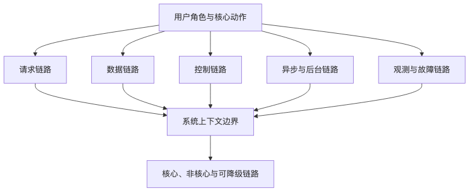

# 第 3 章：从用户旅程看系统边界

## 本章的问题链

先看原始问题：很多系统边界是从组件图里画出来的：前端、后端、数据库、缓存，看上去很整齐，却经常漏掉用户等待、异步任务、第三方回调、运营后台、埋点和告警。真正故障发生时，遗漏的部分往往才是事故入口。

为了解决这个问题，本章从用户旅程出发，把一次业务动作拆成数据流、控制流、异步链路、后台链路、观测链路和人工操作链路，再由这些链路反推系统边界。

但这不是终点：边界画清楚以后，系统还会继续长大。新的问题是：当一个边界里的能力越来越多，应该继续保持单体，还是开始做模块化和架构形态演进。

所以本章会按“问题 -> 机制 -> 新问题”的顺序展开：先把眼前的工程压力说清楚，再看对应机制解决了什么，最后讨论它留下的边界和下一步。



## 1. 本章解决什么问题

很多系统设计从组件开始：前端、网关、服务、数据库、缓存、消息队列。这样画图很快，但容易错过真正重要的东西：用户到底想完成什么动作？这个动作跨过哪些边界？哪些路径必须可靠？哪些路径可以异步？哪些路径可以降级？哪些路径失败后用户会感知？哪些失败只影响后台？

系统边界应该先从用户旅程出发，而不是从技术组件出发。

所谓用户旅程，不只是产品经理画的体验流程。对系统设计来说，用户旅程是把业务动作映射到请求链路、数据链路、控制链路、异步链路、第三方依赖链路、观测链路和故障链路的起点。

本章要讲清楚：

* 如何从用户动作识别系统边界；
* 如何拆分客户端、入口层、服务层、数据层、异步任务、第三方依赖和运营后台；
* 如何识别读路径、写路径、控制路径、后台路径；
* 如何识别核心链路、非核心链路、可降级链路；
* 如何用系统上下文图描述边界；
* 如何在电商下单和企业 RAG 问答两个案例中应用这些方法。

## 2. 为什么不能先从技术组件出发

从组件出发的设计经常长这样：

```text
Client -> API Gateway -> Service -> DB -> Cache -> MQ
```

这张图没有错，但它信息量太低。它没有告诉我们：

* 用户是谁；
* 用户要完成什么；
* 哪些请求是读，哪些是写；
* 哪些操作改变资金、库存、权限或状态；
* 哪些调用失败可以重试；
* 哪些结果可以缓存；
* 哪些数据必须同步返回；
* 哪些事件可以延迟；
* 哪些后台操作会影响线上用户；
* 哪些第三方依赖会拖垮主链路；
* 出错后用户看到什么。

更危险的是，组件图容易制造一种错觉：只要组件完整，系统就完整。但真实系统不是组件集合，而是链路集合。

例如“下单”不是一个 API，而是一段用户旅程：

1. 用户浏览商品；
2. 选择规格；
3. 查看价格和库存；
4. 进入结算页；
5. 选择地址和优惠；
6. 提交订单；
7. 支付；
8. 查看订单状态；
9. 等待发货；
10. 申请售后。

其中每一步都有不同可靠性要求。商品推荐失败可以降级，价格计算错误不能接受；通知失败可以补发，支付状态错误不能接受；发票生成可以异步，库存超卖可能造成实际损失。

所以我们要先看用户旅程，再决定系统边界。

## 3. 核心概念

### 3.1 用户旅程

用户旅程描述用户为了完成某个目标，与系统发生的一系列交互。系统设计关注的不是页面流程本身，而是每个交互背后的状态变化和依赖。

一个用户旅程至少要回答：

* 用户是谁？
* 用户目标是什么？
* 用户动作有哪些？
* 每个动作是否改变状态？
* 用户对延迟和失败的容忍度如何？
* 哪些动作涉及资金、权限、隐私或合规？
* 哪些结果必须立即展示？
* 哪些结果可以稍后完成？

### 3.2 请求链路

请求链路描述一次同步请求经过哪些组件。它通常包括客户端、DNS、CDN、网关、服务、数据库、缓存、第三方 API。请求链路直接影响用户感知延迟和成功率。

### 3.3 数据链路

数据链路描述数据如何写入、读取、复制、索引、归档和删除。例如订单数据从订单库写入后，可能同步到搜索索引、数据仓库、客服系统和风控系统。数据链路影响一致性、可追溯性、隐私删除和审计。

### 3.4 控制链路

控制链路描述系统如何被配置和治理。例如 Feature Flag、灰度规则、限流配置、风控规则、模型路由、权限策略、运营后台操作。控制链路往往不是高 QPS，但一旦出错影响巨大。

### 3.5 异步链路

异步链路描述用户请求之外的后台处理，如消息消费、任务调度、通知、报表、搜索索引更新、特征计算。异步链路不一定影响用户即时体验，但会影响最终一致性和业务完整性。

### 3.6 管理后台链路

管理后台是系统里最容易被低估的高危入口。客服改订单、运营配置活动、财务处理退款、管理员变更权限，都可能影响核心数据。后台链路要有权限、审批、审计、回滚和风控。

### 3.7 第三方依赖链路

第三方依赖链路包括支付、短信、邮件、地图、物流、OCR、模型 API、企业 SSO 等。它们需要超时、限流、熔断、降级、替代供应商和对账。

### 3.8 观测链路

观测链路描述日志、指标、Trace、事件、审计如何从系统中流出，进入监控、告警和分析平台。没有观测链路，系统就像没有仪表盘的飞机。

### 3.9 故障链路

故障链路描述失败如何传播。例如库存服务慢导致订单服务线程池打满，订单服务超时导致客户端重试，重试导致网关压力升高，最终拖垮更多服务。系统设计必须画出故障传播路径，而不是只画成功路径。

### 3.10 系统上下文图与 C4 Model

系统上下文图用于描述目标系统与用户、外部系统之间的边界。C4 Model 是一种常用的软件架构可视化方法，它用层次化抽象描述软件系统、容器、组件和代码，并提供系统上下文、容器、组件、代码等不同层次的图；它的官方说明也强调 C4 与具体画图符号和工具无关。([C4 model][5])

在本书里，我们不会把 C4 当成建模工具教程，而是借用它的思想：**先画清楚系统和外部世界的关系，再逐步放大内部结构。**

## 4. 从用户旅程拆系统边界的方法

可以按下面步骤拆：

### 4.1 写出用户目标

不要先写“调用订单接口”，而要写“用户希望成功购买商品并确认支付状态”。

### 4.2 列出用户动作

例如：

* 打开商品页；
* 加入购物车；
* 进入结算页；
* 选择优惠；
* 提交订单；
* 完成支付；
* 查看订单状态。

### 4.3 标注动作类型

每个动作标注：

* 读操作；
* 写操作；
* 状态转换；
* 资金相关；
* 权限相关；
* 可缓存；
* 可异步；
* 可降级；
* 需要审计。

### 4.4 识别参与者

包括：

* 客户端；
* 入口层；
* 业务服务；
* 数据库；
* 缓存；
* 消息队列；
* 第三方；
* 后台系统；
* 观测系统；
* 人工处理角色。

### 4.5 标注强可靠链路

强可靠链路不是所有链路，而是业务损失最大的链路。例如支付、扣库存、权限过滤、数据持久化。

### 4.6 标注可异步链路

例如通知、积分、搜索索引、报表、模型分析、运营数据同步。

### 4.7 标注可降级链路

例如推荐、个性化排序、AI 摘要、非核心校验、低优先级数据同步。

### 4.8 标注最容易误判的地方

比如：

* 把支付超时当失败；
* 把消息发送成功当业务完成；
* 把缓存命中率当用户体验；
* 把后台操作当低风险；
* 把 AI 回答当确定事实；
* 把第三方 API 当内部稳定依赖。

## 5. 案例一：电商下单系统

### 5.1 用户是谁

主要用户包括：

* C 端买家：浏览商品、提交订单、支付、查看状态；
* 商家/仓库：处理订单、发货；
* 客服：查询订单、处理异常；
* 财务：对账、退款；
* 运营：配置活动、优惠、库存策略；
* 风控团队：处理高风险订单。

### 5.2 核心动作是什么

电商下单的核心动作不是“创建一条订单记录”，而是：**用户以某个价格、使用某些优惠、占用或扣减某些库存，并进入可支付或已支付状态。**

核心动作包括：

* 校验用户身份；
* 校验商品状态；
* 计算价格；
* 校验优惠；
* 校验库存；
* 创建订单；
* 锁定或扣减库存；
* 发起支付；
* 处理支付结果；
* 推进订单状态；
* 对账和异常修复。

### 5.3 系统上下文 ASCII 图

```text
                         +----------------+
                         |  运营后台       |
                         | 活动/优惠/库存  |
                         +--------+-------+
                                  |
                                  v
+---------+       +---------------+----------------+
|  买家    | ----> |  客户端 Web/App/小程序          |
+---------+       +---------------+----------------+
                                  |
                                  v
                         +--------+-------+
                         | DNS/CDN/WAF    |
                         | API Gateway    |
                         +--------+-------+
                                  |
                                  v
                         +--------+-------+
                         |  订单服务       |
                         +---+----+---+---+
                             |    |   |
             +---------------+    |   +----------------+
             |                    |                    |
             v                    v                    v
        +----+----+          +----+----+          +----+----+
        | 商品服务 |          | 库存服务 |          | 优惠服务 |
        +----+----+          +----+----+          +----+----+
             |                    |                    |
             v                    v                    v
        商品库/缓存          库存库/缓存          优惠库/规则

                             |
                             v
                        +----+----+
                        | 支付服务 |
                        +----+----+
                             |
                             v
                        第三方支付通道

                             |
                             v
                        +----+----+
                        | 订单数据库|
                        +----+----+
                             |
                             v
                        +----+----+
                        | 消息队列 |
                        +----+----+
                       /     |     \
                      v      v      v
                  通知系统  履约系统  数据/风控/客服
```

### 5.4 请求链路

提交订单的同步请求链路可能是：

```text
客户端
 -> API Gateway
 -> 订单服务
 -> 商品服务/缓存
 -> 优惠服务
 -> 库存服务
 -> 订单数据库
 -> 返回待支付订单
```

支付链路可能是：

```text
客户端
 -> 支付服务
 -> 第三方支付
 -> 支付结果页

第三方支付
 -> 支付回调接口
 -> 支付服务
 -> 订单服务
 -> 订单状态更新
 -> 消息队列
```

这里要特别注意：支付结果页和支付回调不是同一条可靠链路。用户页面跳转成功不等于支付最终成功；第三方回调可能重复、延迟、乱序；支付状态最终要靠查询和对账确认。

### 5.5 数据链路

订单创建后，数据会流向多个地方：

```text
订单数据库
  |
  +--> 订单事件
        |
        +--> 履约系统
        +--> 通知系统
        +--> 客服系统
        +--> 搜索索引
        +--> 数据仓库
        +--> 风控回放
```

订单主库是事实来源，搜索索引、报表、客服视图都可能有延迟。设计时必须告诉业务方：哪些页面读主库，哪些页面读索引，延迟多少是可接受的。

### 5.6 哪些链路必须强可靠

必须强可靠的链路包括：

* 订单创建持久化；
* 订单状态机变更；
* 库存扣减或锁定；
* 支付结果处理；
* 支付对账；
* 退款状态；
* 后台高危操作审计。

这些链路出错会直接造成资金损失、库存损失、履约错误或用户信任损失。

### 5.7 哪些链路可以异步

可以异步的链路包括：

* 订单通知；
* 积分发放；
* 优惠使用后的营销分析；
* 搜索索引更新；
* 数据仓库同步；
* 推荐特征更新；
* 发票生成，视业务要求而定；
* 客服辅助视图更新。

异步不代表不重要，而是不需要阻塞用户主链路。它们仍然需要重试、死信、补偿和审计。

### 5.8 哪些链路可以降级

可以降级的链路包括：

* 推荐服务失败时展示默认推荐；
* 优惠试算超时时不展示个性化优惠，但不能错算已承诺价格；
* 风控模型超时时使用规则兜底或进入人工审核；
* 通知服务失败时订单仍可创建，后续补发；
* 搜索索引延迟时订单详情页读主库；
* 活动页库存展示可降级为“库存紧张”，但提交订单时必须精确校验。

### 5.9 最容易被误判的地方

第一，**支付超时不是支付失败。** 调用支付通道超时后，系统处于未知状态，必须查询或等待回调，不能简单取消订单。

第二，**订单创建成功不代表下游都完成。** 通知、履约、积分、报表可能还在异步处理中。用户界面要表达状态，而不是假装所有事情已经完成。

第三，**库存显示不等于库存承诺。** 商品页库存可以缓存，提交订单时必须重新校验或扣减。

第四，**后台不是低风险系统。** 客服改订单、运营改活动、仓库改发货状态，都可能改变核心数据，必须审计和权限控制。

第五，**消息队列不是一致性魔法。** 数据库写成功、消息发送失败，或者消息发送成功、数据库事务回滚，都可能造成不一致，需要 Outbox、事务消息或补偿机制。

## 6. 案例二：企业 RAG 问答系统

### 6.1 用户是谁

企业 RAG 系统的用户包括：

* 企业员工：查询内部知识；
* 管理员：管理知识库、权限、连接器；
* 安全/合规人员：审计访问和数据泄露风险；
* 内容管理员：维护文档质量；
* IT 管理员：配置身份集成和租户策略；
* 业务系统：通过 API 调用问答能力。

### 6.2 核心动作是什么

企业 RAG 的核心动作不是“把问题发给大模型”，而是：**在用户权限范围内，从可信知识源检索相关内容，组织上下文，让模型生成有依据、可追溯、可治理的回答。**

核心动作包括：

* 用户认证；
* 租户识别；
* 权限校验；
* 查询改写；
* 检索；
* 权限过滤；
* 重排；
* 上下文组织；
* 模型调用；
* 引用生成；
* 安全检查；
* 反馈记录；
* 审计。

### 6.3 系统上下文 ASCII 图

```text
+-------------+             +-------------------+
| 企业员工     | ----------> | Web / Chat Client |
+-------------+             +---------+---------+
                                      |
                                      v
                              +-------+-------+
                              | API Gateway   |
                              | Auth / Rate   |
                              +-------+-------+
                                      |
                                      v
                              +-------+-------+
                              | RAG 应用服务   |
                              +---+---+---+---+
                                  |   |   |
             +--------------------+   |   +-------------------+
             |                        |                       |
             v                        v                       v
      +------+-------+        +-------+------+          +-----+------+
      | 权限服务      |        | 检索服务      |          | Model GW   |
      | Tenant/RBAC  |        | Hybrid/Rerank |          | LLM/Rerank |
      +------+-------+        +-------+------+          +-----+------+
             |                        |                       |
             v                        v                       v
      身份源/目录服务          向量库/搜索索引              模型供应商
      SSO/LDAP/IdP            文档库/元数据                开源/托管模型

                                      |
                                      v
                              +-------+------+
                              | 审计/观测/反馈 |
                              +-------+------+
                                      |
                                      v
                              评测集 / 标注 / 质量分析


+-------------+             +-------------------+
| 管理员       | ----------> | 知识库管理后台     |
+-------------+             +---------+---------+
                                      |
                                      v
                         文档采集/解析/切分/Embedding/索引
                                      |
                                      v
                         权限同步/增量更新/删除传播
```

### 6.4 请求链路

一次问答请求可能经过：

```text
用户输入问题
 -> 客户端
 -> API Gateway
 -> 身份认证
 -> RAG 应用服务
 -> 查询改写
 -> 检索服务
 -> 权限过滤
 -> Reranker
 -> Context Packing
 -> Model Gateway
 -> LLM
 -> 安全检查
 -> 引用拼接
 -> 返回答案
 -> 记录 Trace、Token、引用、反馈
```

这条链路里，模型调用只是其中一步。真正影响企业可用性的，往往是权限、检索、数据更新和审计。

### 6.5 数据链路

企业 RAG 的数据链路通常比请求链路更复杂：

```text
企业文档源
  |
  +--> 连接器采集
        |
        v
     文档解析
        |
        v
     清洗/切分
        |
        v
     元数据提取
        |
        +--> 权限元数据
        +--> 文档版本
        +--> 过期时间
        |
        v
     Embedding
        |
        v
     向量库 + 搜索索引
        |
        v
     检索服务
```

同时还要处理：

* 文档更新；
* 文档删除；
* 权限变更；
* 用户离职；
* 租户删除；
* 索引重建；
* Embedding 模型升级；
* 旧版本引用失效；
* 审计数据保留。

### 6.6 哪些链路必须强可靠

企业 RAG 中必须强可靠的不是“答案一定完美”，而是安全边界：

* 用户身份认证；
* 租户隔离；
* 权限感知检索；
* 敏感数据过滤；
* 审计日志；
* 高风险工具调用拦截；
* 文档删除和权限撤销传播；
* 管理后台权限控制。

回答质量可以通过评测和迭代改进，但权限泄露通常是严重事故。

### 6.7 哪些链路可以异步

可以异步的链路包括：

* 文档采集；
* 文档解析；
* Embedding 生成；
* 索引构建；
* 反馈分析；
* 评测集更新；
* 质量报表；
* 用户行为分析；
* 离线重排模型训练。

但异步更新必须处理“数据过期”和“权限过期”。例如用户被移出某个项目组后，系统不能继续因为旧索引而让他检索到项目文档。

### 6.8 哪些链路可以降级

RAG 系统可以设计多种降级：

* Reranker 超时时使用初始检索结果；
* 向量检索不可用时使用关键词检索；
* 高级模型不可用时切换到低成本模型；
* 模型供应商不可用时切换备用供应商；
* 文档引用不足时返回“未找到可靠依据”，而不是编造答案；
* 实时连接器不可用时提示知识库更新时间；
* 高风险问题转人工或要求用户确认。

### 6.9 最容易被误判的地方

第一，**RAG 不是把文档塞进向量数据库。** 真正难的是权限、文档质量、Chunking、元数据、更新删除、评测和引用。

第二，**检索到内容不等于用户有权看到。** 权限过滤必须在检索链路中被强制执行，不能只在 UI 上隐藏。

第三，**模型回答不等于事实。** 企业 RAG 必须尽量提供引用、来源和置信边界，高风险场景需要人工审核。

第四，**Prompt 不是安全边界。** 不能依赖“请不要泄露敏感信息”这类提示来保护数据。

第五，**Token 成本是架构约束。** 检索结果太多、上下文太长、模型选择过强，都会让成本失控。

## 7. 读路径、写路径、控制路径、后台路径

无论电商下单还是 RAG 问答，都可以用四类路径拆解。

### 7.1 读路径

读路径服务用户查询，例如商品详情、订单详情、知识问答检索。读路径通常关注延迟、缓存、索引、权限过滤和降级。

### 7.2 写路径

写路径改变系统状态，例如创建订单、支付回调、上传文档、修改权限。写路径关注一致性、幂等、事务、审计和补偿。

### 7.3 控制路径

控制路径改变系统行为，例如限流配置、活动配置、模型路由、Feature Flag、权限策略。控制路径低频但高风险，需要审批、灰度和回滚。

### 7.4 后台路径

后台路径包括运营、客服、财务、管理员操作。后台路径常被认为“不影响用户”，但它可能直接修改核心数据。越是成熟系统，越要把后台当成生产系统的一等入口。

## 8. 常见架构方案

### 8.1 按技术层划边界

例如前端、后端、数据库、缓存。这种方式适合初步说明系统结构，但不适合作为服务拆分和责任划分依据，因为它不能表达业务能力。

### 8.2 按业务能力划边界

例如订单、库存、支付、优惠、履约、知识库、权限、模型网关。它更适合长期演进，因为边界接近业务变化和团队责任。

### 8.3 按用户旅程划核心链路

例如“用户提交订单”“用户完成支付”“员工发起问答”。这种方式最适合识别可靠性优先级。

### 8.4 按数据所有权划边界

谁拥有订单状态？谁拥有支付状态？谁拥有文档权限？谁拥有模型调用记录？数据所有权不清，会导致共享数据库、跨服务随意写数据、审计困难。

### 8.5 按故障隔离划边界

高风险依赖应该隔离。例如第三方支付、模型供应商、通知系统、推荐系统，不应该直接拖垮核心链路。

## 9. 关键权衡

### 9.1 用户旅程完整性 vs 服务自治

从用户旅程看系统，容易发现端到端问题；从服务自治看系统，容易明确 owner 和边界。两者都需要。只看用户旅程，会让所有问题都堆到一个团队；只看服务自治，会没人负责端到端体验。

### 9.2 同步简单性 vs 异步弹性

同步调用更容易理解，但会放大下游故障。异步解耦更有弹性，但会带来最终一致性、状态追踪和补偿问题。

### 9.3 强边界 vs 快速迭代

边界越强，长期治理越好，短期改动可能更慢。早期系统可以允许一定灵活性，但必须知道哪些边界从第一天就不能错，例如租户隔离、支付状态、订单状态机、权限过滤。

### 9.4 用户体验 vs 成本

RAG 系统可以把更多文档塞进上下文，提升回答概率，但 Token 成本和延迟会上升。电商系统可以每个页面都实时查库存，但会增加库存系统压力。体验提升必须与成本和可靠性一起评估。

## 10. 典型失败模式

### 10.1 把组件边界当系统边界

系统边界不是“这里有一个服务”，而是“这里有一类责任、一种数据所有权、一组失败模式”。服务拆出来但共享数据库、共享配置、共享发布节奏，本质上仍然没有边界。

### 10.2 忽略控制链路

很多事故来自配置，而不是代码。活动规则配置错误、模型路由配置错误、权限策略配置错误、网关规则配置错误，都可能造成大范围影响。

### 10.3 后台绕过业务规则

后台为了“方便运营”直接改数据库，短期省事，长期会破坏状态机和审计。一旦出现异常订单，没人知道是用户操作、系统补偿还是人工修改导致。

### 10.4 观测链路事后补

如果设计时没有 Trace ID、业务事件、审计日志和关键指标，事故发生后很难补救。观测链路必须从用户旅程开始设计。

### 10.5 RAG 权限后置

企业 RAG 中，如果先检索再在展示层过滤，可能已经把无权内容送进模型上下文。模型输出可能泄露信息。权限必须进入检索和上下文构造链路。

## 11. 生产实践

### 11.1 用“链路表”补充架构图

每个核心用户旅程都应该有一张链路表：

| 链路         | 类型   | 是否核心 | 可否异步 |  可否降级 | 失败处理         |
| ---------- | ---- | ---: | ---: | ----: | ------------ |
| 创建订单       | 写路径  |    是 |    否 | 部分可降级 | 幂等、库存保护、错误提示 |
| 订单通知       | 异步路径 |    否 |    是 |     是 | 重试、死信、补发     |
| 支付回调       | 写路径  |    是 |    否 |     否 | 幂等、查询、对账     |
| 推荐展示       | 读路径  |    否 |    是 |     是 | 默认推荐         |
| RAG 权限过滤   | 读路径  |    是 |    否 |     否 | 拒绝返回、审计      |
| RAG Rerank | 读路径  |    否 |    否 |     是 | 使用初始召回       |

### 11.2 系统上下文图先于组件图

设计评审时先问：

* 系统服务谁？
* 和哪些外部系统交互？
* 哪些人能通过后台改变系统？
* 哪些第三方依赖在核心链路？
* 哪些数据离开系统边界？
* 哪些失败会影响用户？

组件图可以晚一点画。上下文错了，组件再精细也没用。

### 11.3 每条核心链路都要有 owner

端到端链路常常跨多个团队。必须明确谁负责链路 SLO，谁负责每个服务，事故时谁协调。没有 owner 的链路不会自然可靠。

### 11.4 把故障链路画出来

例如：

```text
支付通道变慢
  -> 支付服务线程池占满
  -> 订单服务等待支付结果超时
  -> 客户端重试
  -> 网关 QPS 上升
  -> 订单服务连接池耗尽
  -> 下单整体失败率上升
```

有了故障链路，才能设计超时、熔断、排队、限流和降级。

## 12. 设计 Checklist

* 是否从用户旅程开始，而不是从组件开始？
* 是否列出了所有用户角色，包括后台、客服、运营、财务、管理员？
* 是否识别了核心动作，而不是只识别 API？
* 是否画出系统上下文图？
* 是否标注外部系统和第三方依赖？
* 是否拆分请求链路、数据链路、控制链路、异步链路、后台链路、观测链路和故障链路？
* 是否区分读路径、写路径、控制路径和后台路径？
* 是否识别核心链路、非核心链路和可降级链路？
* 是否明确哪些链路必须强可靠？
* 是否明确哪些链路可以异步？
* 是否明确哪些链路可以降级？
* 是否识别最容易被误判的地方？
* 是否为后台操作设计权限、审批和审计？
* 是否为第三方依赖设计超时、熔断、降级和替代路径？
* 是否为 AI/RAG 链路设计权限过滤、引用、评测和人工审核？
* 是否从第一版就考虑观测链路？
* 是否为端到端用户旅程定义 owner 和 SLO？

## 13. 本章小结

系统边界不是从技术组件自然长出来的，而是从用户旅程、数据所有权、责任边界和故障隔离中推导出来的。先画组件，容易得到一张看似完整但无法指导生产的图；先看用户旅程，才能知道哪些链路真正重要。

电商下单系统告诉我们：支付、库存、订单状态和对账是强可靠链路，通知、报表、推荐可以异步或降级。企业 RAG 系统告诉我们：模型不是唯一核心，权限、检索、引用、审计和数据更新同样决定系统是否可靠。

现代系统设计要习惯同时看多条链路：请求如何流动，数据如何流动，配置如何生效，后台如何改变状态，故障如何传播，观测如何帮助恢复。只有这样，架构图才会从“框和线”变成真正的工程地图。

## 14. 本章最重要的 5 个判断

1. **系统边界应该先从用户旅程推导，而不是先从技术组件推导。**

2. **一个业务动作通常同时包含请求链路、数据链路、控制链路、异步链路、后台链路、第三方链路、观测链路和故障链路。**

3. **核心链路必须强可靠，非核心链路应尽量异步，可降级链路要提前设计备用路径。**

4. **后台、配置和权限系统不是边角料，它们往往是生产事故和安全事故的高发入口。**

5. **AI/RAG 系统的边界不能停在模型调用；权限、数据更新、引用、评测、审计和成本同样是系统边界的一部分。**

[1]: https://www.cognitect.com/blog/2011/11/15/documenting-architecture-decisions "

    Documenting Architecture Decisions

  "
[2]: https://sre.google/sre-book/service-level-objectives/ "Google SRE - Defining slo: service level objective meaning"
[3]: https://docs.aws.amazon.com/wellarchitected/latest/reliability-pillar/plan-for-disaster-recovery-dr.html "Plan for Disaster Recovery (DR) - Reliability Pillar"
[4]: https://docs.aws.amazon.com/wellarchitected/latest/reliability-pillar/rel_planning_for_recovery_disaster_recovery.html "REL13-BP02 Use defined recovery strategies to meet the recovery objectives - Reliability Pillar"
[5]: https://c4model.com/ "Home | C4 model"

[1]: https://www.cognitect.com/blog/2011/11/15/documenting-architecture-decisions "

    Documenting Architecture Decisions

  "
[2]: https://sre.google/sre-book/service-level-objectives/ "Google SRE - Defining slo: service level objective meaning"
[3]: https://docs.aws.amazon.com/wellarchitected/latest/reliability-pillar/plan-for-disaster-recovery-dr.html "Plan for Disaster Recovery (DR) - Reliability Pillar"
[4]: https://docs.aws.amazon.com/wellarchitected/latest/reliability-pillar/rel_planning_for_recovery_disaster_recovery.html "REL13-BP02 Use defined recovery strategies to meet the recovery objectives - Reliability Pillar"
[5]: https://c4model.com/ "Home | C4 model"
