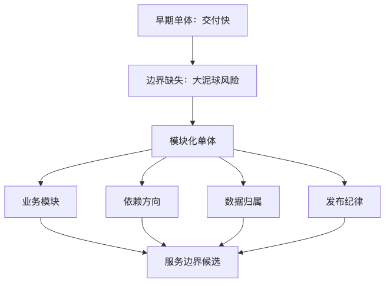

# 第二篇：架构形态的演进

本篇讨论的不是“架构从低级到高级的升级路线”，而是系统在不同业务阶段、团队规模、故障模型和成本约束下，如何选择合适的组织方式。

很多架构事故并不是因为技术太旧，而是因为团队把架构形态当成信仰：创业早期就拆十几个微服务，结果每个接口都要联调；业务已经全球化了，却还把所有写入塞在一个区域；没有平台团队，却强行自建 Kubernetes；日请求量不大，却先上服务网格、分布式事务和全链路多活。架构演进真正要回答的问题是：

**现在的系统边界、部署方式、数据所有权和团队责任，还能不能支撑下一阶段的变化？**

本篇包含四章：

* 第 4 章：从单体到模块化单体
* 第 5 章：SOA、微服务与服务边界
* 第 6 章：云原生、Serverless 与后微服务时代
* 第 7 章：边缘、全球化与多区域架构

---

# 第 4 章：从单体到模块化单体

## 本章的问题链

先看原始问题：早期系统最重要的是快：一个代码库、一个数据库、一次部署，能让团队迅速验证业务。但如果所有业务能力都没有边界，单体很快会变成谁也不敢改、谁也说不清责任的“大泥球”。

为了解决这个问题，本章把单体继续往前推进一步：用模块化单体划分业务模块、依赖方向、数据归属和发布纪律，在保留单体简单性的同时，先把内部边界立起来。

但这不是终点：当模块之间的变化节奏、团队责任、容量需求和故障边界开始明显分化，新的问题就变成：这些边界是否需要从代码边界升级为服务边界。

所以本章会按“问题 -> 机制 -> 新问题”的顺序展开：先把眼前的工程压力说清楚，再看对应机制解决了什么，最后讨论它留下的边界和下一步。



## 1. 本章解决什么问题

单体系统常常被误解。很多工程师一听到“单体”，脑子里浮现的是一个巨大的代码仓库、几十万行互相引用的业务逻辑、一个所有人都能随便改的数据库、发布一次要全公司屏住呼吸。这个印象不完全错，但错在把“单体部署”与“混乱边界”混为一谈。

**单体不是原罪，坏的边界才是。**

本章要解决的问题是：在系统还没有复杂到必须分布式化之前，如何用单体的低运维复杂度换取快速交付，同时避免单体变成不可维护的泥球；当系统确实需要拆分时，又如何让单体天然具备拆分条件，而不是在混乱中硬切。

单体系统的核心特征是：多个业务能力在同一个进程、同一个部署单元中运行。它可以是糟糕的，也可以是优秀的。糟糕单体的问题不在于“没有微服务”，而在于：

* 业务模块之间没有清晰边界；
* 数据表谁都可以读写；
* 依赖关系没有方向；
* 发布和回滚没有安全机制；
* 测试只能靠全量回归；
* 可观测性只能看到“应用慢了”，看不到“哪个模块慢了”。

优秀的模块化单体则不同。它仍然是一个部署单元，但内部像一个治理良好的城市：道路、行政区、水电系统、消防系统都有边界和规则。未来是否拆成微服务，不是靠口号决定，而是靠模块边界、数据边界、团队边界和故障边界是否已经自然形成。

## 2. 小系统里为什么单体很合理

小系统最稀缺的资源不是机器，而是人的注意力。一个三五人的团队，如果产品方向还在试错，最重要的是快速验证业务假设：用户是否愿意下单，商家是否愿意入驻，客服是否能承接流程，财务是否能闭环。

在这个阶段，单体有天然优势。

第一，开发路径短。一次本地启动就能跑通主要流程，不需要同时启动十几个服务，不需要准备复杂的测试环境，也不需要在本地模拟服务发现、消息队列、链路追踪和熔断规则。

第二，事务边界简单。很多业务动作还可以依赖本地事务完成，例如创建订单、写订单明细、扣减预占库存、记录操作日志。虽然未来可能需要异步化，但早期用本地事务能减少大量一致性成本。

第三，部署和调试简单。一个制品、一个进程、一套日志、一套配置。出了问题，排查路径短，团队对系统有完整心智模型。

第四，组织沟通成本低。所有人都知道关键代码在哪里，业务上下文容易共享。与其花大量时间设计远程接口，不如先把业务流程跑通。

所以，早期单体并不落后。它是一种**用部署简单性换取业务探索速度**的架构选择。

真正的问题通常出现在增长之后。系统越做越大，单体如果不治理，就会从“一个部署单元”退化成“一个没有边界的公共垃圾场”。

## 3. 大系统里单体如何变成故障、成本和组织问题

单体变坏通常不是一夜之间发生的，而是每个需求“顺手改一下”累积出来的。

### 3.1 性能问题

单体早期性能瓶颈通常不在代码，而在数据库、缓存、外部依赖和某些热点路径。随着业务增长，问题开始变得微妙：

* 首页查询拖慢订单接口；
* 报表 SQL 抢占主库资源；
* 一个模块创建大量线程池，影响整个进程；
* 某个慢第三方 API 占满连接池；
* 一个全局缓存失效导致所有模块同时打数据库。

因为所有模块在同一个进程中，一个模块的资源滥用可能拖垮整个系统。单体的故障隔离天然弱于服务化系统。

### 3.2 协作问题

当团队从 5 人变成 50 人，单体最大的痛点往往不是 QPS，而是协作。所有团队都在同一个代码仓库里改同一套模型、同一批工具类、同一个数据库。常见现象包括：

* 公共类被不断塞入新字段；
* “临时逻辑”被多个模块复用；
* 模块 A 为了赶需求直接改模块 B 的表；
* 一个团队的改动导致另一个团队测试失败；
* 代码 Review 变成形式，因为没有人真正理解全局影响。

这时，单体的边界不清会直接转化为组织摩擦。

### 3.3 发布问题

单体发布粒度粗。一行优惠券逻辑的修改，也可能需要发布整个应用。随着模块增多，发布风险上升：

* 回归范围扩大；
* 发布窗口变长；
* 回滚可能影响无关模块；
* 数据库变更难以和代码发布解耦；
* 多个团队排队等发布。

如果没有灰度、Feature Flag、自动化测试和可观测性，单体发布会变成高压活动。

### 3.4 架构债问题

最危险的是，坏单体会阻断未来演进。表面看只是代码乱，实际是未来每一次拆分、迁移、扩容都要支付利息。因为没人知道：

* 某张表到底属于哪个业务；
* 某个字段是否被其他模块依赖；
* 某段逻辑是否能独立发布；
* 某个功能是否能降级；
* 某个模块出了问题由谁负责。

所以，单体可怕的不是“一个进程”，而是**边界不可见、责任不可追踪、变化不可控制**。

## 4. 核心概念

### 4.1 传统单体

传统单体通常采用一个应用、一个数据库、一个部署包。它可能有 MVC、Service、DAO 等分层，但分层不等于模块化。很多传统单体的问题是：技术层分得很清楚，业务边界却完全模糊。

典型目录可能是：

```text
src/
  controller/
  service/
  dao/
  model/
  util/
```

这种结构的问题在于，订单、库存、支付、营销、用户都混在同一层里。随着业务膨胀，`service` 目录会变成巨大的业务杂货铺。

### 4.2 分层架构

分层架构把系统分成表现层、应用层、领域层、基础设施层。它的价值是控制依赖方向，避免业务逻辑散落在 Controller、ORM Hook、消息消费器和定时任务里。

一个常见分层是：

```text
interfaces     接口层：HTTP、RPC、消息入口
application    应用层：编排用例、事务边界、权限校验
domain         领域层：业务规则、领域对象、领域服务
infrastructure 基础设施层：数据库、缓存、第三方 API、消息队列
```

分层解决的是“代码职责”问题，但不自动解决“业务模块边界”问题。一个优秀单体通常需要同时做分层和模块化。

### 4.3 模块化单体

模块化单体是在一个部署单元内，把业务能力切成明确模块。每个模块拥有自己的领域模型、应用服务、数据访问逻辑和内部 API。模块之间不能随意访问彼此内部实现，只能通过明确接口协作。

例如：

```text
modules/
  catalog/
    api/
    application/
    domain/
    infrastructure/
  order/
    api/
    application/
    domain/
    infrastructure/
  inventory/
  payment/
  promotion/
```

模块化单体的关键不是目录好看，而是边界可执行：

* 编译期依赖受限制；
* 模块内部类不允许被外部直接引用；
* 数据表有归属；
* 跨模块调用走内部 API 或领域事件；
* 跨模块变更需要契约测试；
* 可观测性按模块打标签。

### 4.4 六边形架构

六边形架构，也常被称为 Ports and Adapters，强调业务核心不依赖外部技术。业务核心通过端口定义自己需要什么，数据库、消息队列、HTTP、第三方服务只是适配器。

它解决的问题是：不要让框架、数据库、RPC 协议绑架业务模型。

例如订单模块不应该直接把“调用某支付 SDK”写进领域对象，而应该定义 `PaymentPort`，由基础设施层实现。

```text
             HTTP Adapter
                 |
                 v
        +------------------+
        |   Order UseCase  |
        |                  |
        | Domain Model     |
        +------------------+
          ^       ^      ^
          |       |      |
     DB Adapter  MQ   Payment Adapter
```

### 4.5 Clean Architecture

Clean Architecture 强调依赖方向向内：外层依赖内层，内层不知道外层。业务规则位于中心，框架、数据库、UI、外部服务都在外圈。

这对长期演进很重要。因为框架会变、数据库会变、入口协议会变，但核心业务规则应该相对稳定。一个订单是否能取消、库存是否允许超卖、优惠券是否可叠加，不应该散落在 Web Controller 或数据库触发器里。

### 4.6 代码边界与部署边界

这是本章最重要的区分。

代码边界回答：“哪些代码属于同一个业务能力？谁可以调用谁？谁拥有哪些数据？”

部署边界回答：“哪些代码必须一起上线？哪些代码可以独立扩容、独立回滚、独立隔离故障？”

模块化单体的特点是：**代码边界已经清楚，但部署边界仍然合并**。微服务的特点是：**代码边界、部署边界、运行时边界、团队责任边界通常同时拆开**。

过早微服务的错误就在于：代码边界都没搞清楚，就先拆部署边界。结果只是把一个混乱单体拆成一组通过网络通信的混乱服务。

## 5. 常见架构方案

### 5.1 朴素单体

适合产品探索期、小团队、低复杂度系统。优点是快，代价是必须尽早建立最低限度的边界纪律。朴素单体可以接受，但“随便写”不可接受。

### 5.2 分层单体

适合业务开始稳定、团队开始分工的阶段。它能减少 Controller 胖逻辑、SQL 到处飞、第三方调用散落的问题。但如果只按技术层组织，不按业务模块组织，后期仍然会变成大泥球。

### 5.3 模块化单体

适合多数中早期互联网业务。它保留单体部署简单性，又提前建立业务边界。对于 10 到 50 人左右的研发团队，模块化单体经常比微服务更务实。

### 5.4 插件式单体

某些平台型产品会把能力做成插件，例如支付渠道、工作流节点、报表组件、规则引擎扩展。插件式单体适合扩展点稳定、需要外部团队接入的场景。但插件系统会引入版本兼容、沙箱、安全和生命周期管理成本，不应为普通业务 CRUD 过度设计。

### 5.5 单体核心 + 异步外围

这是很常见的演进形态。核心交易仍在单体内完成，非核心链路通过消息或任务异步化，例如发送通知、同步搜索索引、生成报表、推荐特征更新。

这种方案可以在不拆主系统的情况下，先把重任务、慢任务和失败可重试任务移出核心请求路径。

```text
用户请求
   |
   v
+----------------------+
|  模块化单体           |
|  order / inventory   |
|  payment / promotion |
+----------+-----------+
           |
        Outbox
           |
           v
+----------------------+
| 消息队列 / 任务系统    |
+----------+-----------+
           |
   +-------+--------+
   |       |        |
通知服务  搜索索引  报表任务
```

## 6. 关键权衡

### 6.1 单体的收益

单体的最大收益是低分布式复杂度。没有网络调用，就没有远程调用超时、重试风暴、部分失败、服务发现、链路追踪采样、跨服务事务和多服务部署编排。

这对业务早期非常宝贵。很多系统不是死于单体，而是死于在还没有复杂业务之前就引入了复杂基础设施。

### 6.2 单体的代价

单体的代价是故障隔离弱、发布粒度粗、资源隔离弱、团队自治弱。当不同模块的变化节奏、可用性目标、数据合规要求明显分化时，继续单体会让系统越来越难演进。

### 6.3 模块化单体的核心取舍

模块化单体的取舍是：接受一个部署单元，但严格治理内部边界。它不像微服务那样提供运行时隔离，却能显著降低组织和代码复杂度。

如果团队做不到模块边界治理，微服务也救不了；如果团队能做好模块边界治理，很多时候并不急着上微服务。

### 6.4 数据库边界最难

代码边界容易画，数据库边界最难守。很多单体变坏，就是因为所有模块共享数据库，任何模块都可以 Join 任意表、Update 任意字段。

模块化单体不一定要一开始拆成多个数据库，但至少要定义：

* 表归属哪个模块；
* 外部模块是否允许直接读；
* 是否允许直接写，通常不允许；
* 跨模块查询走 API、读模型还是报表库；
* 迁移脚本归哪个模块；
* 字段废弃如何通知消费者。

数据库边界守不住，未来服务拆分会非常痛苦。

## 7. 典型失败模式

### 7.1 “分层清楚，但业务混乱”

目录里有 Controller、Service、DAO，但订单逻辑散落在用户服务、优惠券服务、库存 DAO 和支付回调里。看起来分层，实际没有业务边界。

### 7.2 “公共模块吞噬一切”

`common`、`util`、`shared` 目录不断变大，最后所有模块都依赖它。公共模块一变，全系统回归。优秀的模块化单体会限制公共模块，只允许放真正稳定、无业务含义的基础能力。

### 7.3 “内部 API 只是形式”

模块之间表面调用接口，实际还共享数据库、共享领域对象、共享枚举、共享事务。这样的接口没有隔离价值。

### 7.4 “单体发布没有安全机制”

没有灰度、没有回滚、没有 Feature Flag、没有数据库兼容发布，只要发布失败就全站受影响。

### 7.5 “为了拆而拆”

团队听说微服务先进，就把单体按 Controller 或数据库表拆成服务。结果业务事务被拆碎，接口聊天化，联调成本暴涨，故障定位更难。

## 8. 生产实践

### 8.1 模块依赖治理

模块依赖需要规则，而不是口头约定。可以用构建工具、静态扫描、代码所有权规则来约束。例如：

* `order` 可以依赖 `inventory.api`，不能依赖 `inventory.infrastructure`；
* 领域对象不跨模块复用；
* 外部模块只能使用公开 DTO；
* 禁止跨模块直接访问 Repository；
* 新增跨模块依赖必须评审。

### 8.2 模块级测试

模块化单体至少需要四类测试：

* 领域单元测试：验证核心业务规则；
* 应用用例测试：验证事务边界、权限、状态流转；
* 模块契约测试：验证内部 API 兼容；
* 关键链路端到端测试：验证下单、支付、退款等主流程。

不要把所有质量保障都压在端到端测试上。端到端测试慢、脆弱、定位困难。

### 8.3 模块级可观测性

单体也要做可观测性，而且要按模块维度观察。日志、指标、Trace 里应该能看出：

* 请求经过了哪些模块；
* 每个模块耗时多少；
* 哪个模块抛错；
* 哪个模块访问数据库最慢；
* 哪个模块调用第三方失败；
* 哪个模块触发了降级。

可以在单体内部建立轻量 Span：

```text
HTTP POST /orders
  ├─ order.create
  ├─ promotion.apply
  ├─ inventory.reserve
  ├─ payment.prepare
  └─ outbox.append
```

这样即使没有服务拆分，也能获得接近分布式链路追踪的诊断能力。

### 8.4 单体灰度、回滚和发布

单体也可以做灰度。常见方式包括：

* 按用户、租户、地区、设备版本做 Feature Flag；
* 新逻辑旁路执行，只记录结果差异；
* 数据库字段先加后用，先写双字段再切读；
* 发布后只打开少量流量；
* 出问题先关开关，而不是立刻回滚；
* 回滚前确认数据库变更是否兼容。

单体发布风险高，所以更需要“变化开关”和“兼容窗口”。

## 9. 案例：电商模块化单体

假设一个电商平台处于增长早期，有商品、购物车、订单、库存、支付、优惠券、物流等能力。团队 20 人，日订单 5 万，业务还在快速变化。此时直接微服务化未必划算，可以先做模块化单体。

```text
                 +----------------+
                 | Web / App / BFF |
                 +--------+-------+
                          |
                          v
+--------------------------------------------------+
|                 Commerce Monolith                |
|                                                  |
|  +----------+  +---------+  +----------------+   |
|  | Catalog  |  | Cart    |  | Promotion      |   |
|  +----------+  +---------+  +----------------+   |
|                                                  |
|  +----------+  +---------+  +----------------+   |
|  | Order    |->|Inventory|->| Payment Adapter |  |
|  +----------+  +---------+  +----------------+   |
|        |                                         |
|        v                                         |
|     Outbox                                       |
+--------+-----------------------------------------+
         |
         v
+-------------------+        +------------------+
| Message Broker    |------->| Search / Notify  |
+-------------------+        +------------------+

数据库：
  catalog_*     归 Catalog 模块
  order_*       归 Order 模块
  inventory_*   归 Inventory 模块
  promotion_*   归 Promotion 模块
```

这里要特别注意：虽然只有一个数据库实例，但表必须有归属。订单模块不能随便改库存表，只能通过库存模块 API 预占库存。促销模块可以提供价格计算接口，但不能直接写订单金额。支付适配器可以调用第三方支付，但支付结果回调要回到订单模块的状态机中处理。

### 糟糕单体与优秀模块化单体对比

| 维度   | 糟糕单体                        | 优秀模块化单体               |
| ---- | --------------------------- | --------------------- |
| 代码组织 | 按 Controller、Service、DAO 堆放 | 按业务模块组织，模块内再分层        |
| 数据访问 | 任意模块读写任意表                   | 表有归属，跨模块写入走 API       |
| 公共代码 | `common` 无限制膨胀              | 公共能力最小化，业务模型不共享       |
| 发布   | 全量发布，无灰度                    | Feature Flag、兼容发布、可回滚 |
| 测试   | 依赖人工回归                      | 模块测试、契约测试、核心链路测试      |
| 可观测性 | 只有应用级指标                     | 按模块、用例、依赖观察           |
| 拆分能力 | 拆分前要考古                      | 模块天然可成为候选服务           |

## 10. 从模块化单体演进到微服务的路线图

第一阶段：整理边界。先按业务能力重组代码，定义模块 API 和数据归属，禁止跨模块直接写表。

第二阶段：建立模块契约。为模块 API 增加契约测试和兼容规则，明确 DTO、错误码、事件格式。

第三阶段：异步化非核心链路。通过 Outbox Pattern 把通知、索引、报表、风控特征等移出主事务路径。

第四阶段：识别拆分候选。优先拆变化频率高、资源需求特殊、故障影响大、团队独立负责、数据边界清楚的模块。

第五阶段：旁路新服务。新服务先只读或旁路校验，和单体结果对比。

第六阶段：切写路径。通过灰度流量逐步让新服务接管写入，保留回滚方案。

第七阶段：清理旧路径。删除单体中的旧实现，关闭双写和兼容代码，完成责任迁移。

这个路线的重点是：**服务拆分是模块边界成熟后的结果，不是边界治理的替代品。**

## 11. 本章小结

单体系统在产品探索期和中小规模阶段通常是合理选择。它的问题不在于部署单元大，而在于边界、数据、责任和发布治理是否缺失。模块化单体是一种非常务实的中间形态：用一个部署单元降低运维复杂度，用清晰模块边界降低长期演进成本。

真正优秀的单体，不是永远不拆，而是拆分时有路可走。

## 12. 设计 Checklist

* 是否按业务能力划分模块，而不是只按技术层划分？
* 每个模块是否有明确 owner？
* 每张表是否有归属模块？
* 是否禁止跨模块直接写数据库？
* 模块之间是否通过内部 API、领域事件或明确读模型协作？
* 是否有模块级测试和契约测试？
* 是否能按模块观察耗时、错误、依赖失败？
* 单体是否支持灰度、Feature Flag 和快速回滚？
* 数据库变更是否支持兼容发布？
* 哪些模块未来可能拆成服务，拆分阻碍是什么？

## 13. 常见误区

* 误区一：单体一定落后。实际上，边界清楚的单体常常比混乱微服务更可靠。
* 误区二：分层就是模块化。分层解决技术职责，模块化解决业务边界。
* 误区三：共享数据库没问题。共享实例可以，数据所有权不能共享。
* 误区四：微服务能解决代码混乱。代码边界混乱时，拆服务只会把混乱网络化。
* 误区五：单体不能灰度。单体同样可以通过 Feature Flag、兼容发布和流量控制降低风险。

## 14. 本章最重要的 5 个判断

1. 单体不是原罪，坏边界才是。
2. 模块化单体是很多团队迈向复杂架构前最值得补的一课。
3. 数据库边界比代码目录更能反映真实架构边界。
4. 过早微服务往往是在没有解决边界问题前，先引入分布式问题。
5. 好的单体不是永远不拆，而是让未来拆分变得可控。

---

[1]: https://www.cncf.io/about/who-we-are/ "Who We Are | CNCF"
[2]: https://kubernetes.io/ "Kubernetes"
[3]: https://kubernetes.io/docs/concepts/overview/working-with-objects/ "Objects In Kubernetes"
[4]: https://www.envoyproxy.io/ "Envoy proxy - home"
[5]: https://aws.amazon.com/serverless/ "Serverless Computing – Amazon Web Services"
[6]: https://github.com/cncf/wg-serverless "cncf/wg-serverless"
[7]: https://opengitops.dev/ "OpenGitOps: Home"
[8]: https://developer.hashicorp.com/terraform "Terraform"
[9]: https://www.cncf.io/blog/2023/04/11/announcing-a-white-paper-on-platforms-for-cloud-native-computing/ "Announcing a white paper on Platforms for Cloud Native ..."
[10]: https://developers.cloudflare.com/cache/ "Cloudflare Cache (CDN) docs"
[11]: https://developers.cloudflare.com/cache/concepts/default-cache-behavior/ "Default Cache Behavior"
[12]: https://developers.cloudflare.com/workers/ "Overview · Cloudflare Workers docs"
[13]: https://learn.microsoft.com/en-us/azure/reliability/availability-zones-overview "What are Azure Availability Zones?"
[14]: https://docs.aws.amazon.com/wellarchitected/latest/reliability-pillar/rel_withstand_component_failures_failover2good.html "REL11-BP02 Fail over to healthy resources - Reliability Pillar"
[15]: https://docs.aws.amazon.com/Route53/latest/DeveloperGuide/routing-policy-geo.html "Geolocation routing"
[16]: https://learn.microsoft.com/en-us/azure/well-architected/design-guides/disaster-recovery "Develop a disaster recovery plan for multi-region ..."
[17]: https://developers.cloudflare.com/cache/how-to/purge-cache/ "Purge cache · Cloudflare Cache (CDN) docs"
[18]: https://docs.aws.amazon.com/wellarchitected/latest/reliability-pillar/rel_planning_for_recovery_disaster_recovery.html "REL13-BP02 Use defined recovery strategies to meet the ..."
