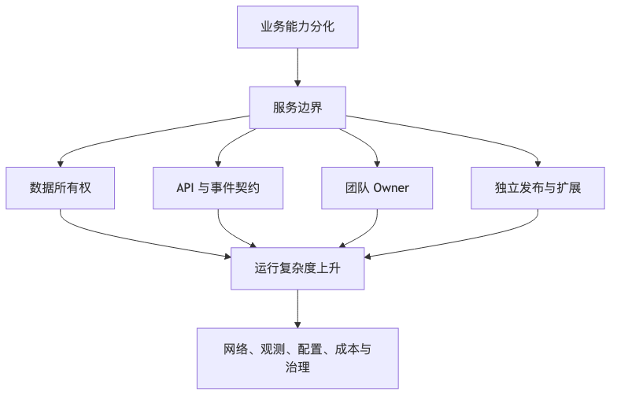

# 第 5 章：SOA、微服务与服务边界

## 本章的问题链

先看原始问题：当多个业务能力被绑在同一个代码库、同一个数据库和同一次发布里，团队会互相等待，局部故障会拖住整体，某个模块的容量压力也会影响别的模块。单体内部边界不一定足够。

为了解决这个问题，SOA 和微服务把系统按业务能力、数据所有权、团队责任和运行边界拆成服务，让不同能力可以独立演进、独立扩展、独立承担风险。

但这不是终点：服务一多，复杂度会从代码内部转移到网络、发布、观测、配置、成本和组织协作上。新的问题是：如何让大量服务在生产环境里可运行、可治理、可恢复。

所以本章会按“问题 -> 机制 -> 新问题”的顺序展开：先把眼前的工程压力说清楚，再看对应机制解决了什么，最后讨论它留下的边界和下一步。



## 1. 本章解决什么问题

微服务最容易被误解为“把代码拆小”。这是一种危险的简化。

真正的微服务不是代码颗粒度问题，而是把业务能力、数据所有权、变更节奏和团队责任重新组织。一个服务如果没有独立的数据边界、没有清晰业务能力、不能独立发布、没有明确 owner，只是把原来单体中的类换成远程调用，那它不是微服务，而是“远程模块”。

本章要解决的问题是：什么时候应该服务化，服务边界如何划分，服务太粗或太细会带来什么问题，如何识别伪微服务，以及如何从单体或模块化单体迁移到服务化架构。

## 2. 从 SOA 到微服务

SOA，Service-Oriented Architecture，面向服务架构，早于今天流行的微服务。它强调通过服务暴露业务能力，系统之间通过契约协作。在很多企业系统里，SOA 常常和 ESB、集中式治理、复杂 XML 协议、统一服务总线绑定在一起。

SOA 解决了系统集成问题，但很多实现走向了中心化：所有服务都要接入一个大总线，所有转换、编排、治理都集中在中间层。这样可以统一管控，却也可能让总线成为性能瓶颈、组织瓶颈和变更瓶颈。

微服务试图把自治推到更前面。每个服务围绕一个业务能力构建，拥有自己的数据，能够独立部署，由一个团队负责运行。它更强调去中心化治理、自动化交付、可观测性和团队自治。

但微服务并不意味着没有治理。没有治理的微服务会变成另一种混乱：接口随意变、错误码不统一、日志不关联、配置散落、版本不可控、调用链过长、线上问题没人负责。

## 3. 核心概念

### 3.1 微服务

一个生产意义上的微服务通常具备以下特征：

* 围绕业务能力，而不是技术层；
* 独立部署；
* 拥有清晰数据所有权；
* 有稳定 API 或事件契约；
* 有自己的运行时指标、日志、Trace；
* 有明确团队负责开发和 On-call；
* 故障可隔离，至少不会轻易拖垮全站；
* 可以独立演进，但遵守平台治理规则。

注意，“独立部署”不代表每次都必须独立发布；“服务自治”也不代表每个团队随便选语言、数据库、网关、日志格式和监控系统。自治如果没有平台约束，最终会把组织拖进运维沼泽。

### 3.2 宏服务

宏服务是介于单体和微服务之间的服务形态。它比模块化单体更独立，有单独进程和部署边界，但内部可能包含多个紧密相关的业务模块。

例如“交易服务”内部包含订单、购物车、优惠计算、库存预占，而支付、物流、会员是独立服务。宏服务适合团队还没有能力维护几十个小服务，但确实需要把大系统拆成几个独立部署域的阶段。

宏服务不是失败，它经常是务实选择。

### 3.3 服务自治

服务自治包括四个层面：

* 业务自治：服务负责一个清楚业务能力；
* 数据自治：服务拥有自己的数据读写边界；
* 发布自治：服务可以独立发布和回滚；
* 运维自治：服务团队对可用性、告警、容量和事故负责。

如果只做了发布自治，却没有数据自治和运维自治，微服务收益会非常有限。

### 3.4 服务边界

服务边界不是类边界，也不是表边界，而是业务变化边界。一个好的服务边界通常满足：

* 边界内高内聚，边界外低耦合；
* 边界内事务多，边界外协作少；
* 边界内模型语言一致；
* 边界内由同一团队负责；
* 边界内数据生命周期相近；
* 边界内扩缩容和可用性目标相近。

### 3.5 数据所有权

数据所有权是微服务能否成立的分水岭。服务拥有数据，不只是拥有表结构，还包括：

* 谁可以写；
* 谁定义字段语义；
* 谁负责迁移；
* 谁负责数据质量；
* 谁负责对外提供查询能力；
* 谁负责数据删除和合规；
* 谁负责数据修复和对账。

共享数据库通常是微服务失败信号，因为它让服务边界绕过 API 被数据库耦合。即使早期因为迁移困难暂时共享实例，也应该禁止跨服务直接写表，并逐步收敛到清晰的数据所有权。

### 3.6 康威定律与团队拓扑

系统结构会受到组织沟通结构影响。一个按前端、后端、数据库、测试、运维横向分工的组织，很难自然产出端到端自治服务。微服务要求团队对业务能力负责，而不是只负责技术层。

这也是为什么“按技术层拆服务”经常失败。用户服务、订单服务、库存服务是业务能力；Controller 服务、DAO 服务、缓存服务不是业务能力，而是把单体分层硬搬到网络上。

## 4. 服务间通信与治理

### 4.1 同步通信

同步通信包括 HTTP、RPC、gRPC 等。它适合需要即时结果的场景，例如查询库存、创建支付单、校验优惠券。同步通信的代价是调用链会直接影响用户请求延迟和可用性。

同步调用必须设计：

* 超时；
* 重试；
* 幂等；
* 熔断；
* 限流；
* 降级；
* Deadline 传递；
* 错误语义；
* Trace 传播。

否则，一个慢下游会把整个上游拖慢。

### 4.2 异步通信

异步通信包括消息队列、事件流、任务队列。它适合非立即完成、可重试、可最终一致的场景，例如发送通知、同步搜索索引、生成账单、更新推荐特征。

异步通信降低耦合，但带来重复、乱序、积压、回放、死信、事件版本和排查困难。异步不是“更简单”，而是把同步路径上的复杂度转移到了数据流和运维上。

### 4.3 服务发现

服务拆分后，调用方需要知道目标服务在哪里。服务发现可以由注册中心、Kubernetes Service、服务网格、云负载均衡或 DNS 实现。服务发现不只是“找到 IP”，还涉及健康检查、权重、区域、版本、灰度和故障摘除。

### 4.4 配置治理

微服务的配置数量会爆炸。每个服务都有数据库连接、第三方地址、超时、开关、限流阈值、灰度规则。配置治理需要解决：

* 配置来源是否可信；
* 配置变更是否审计；
* 配置是否支持灰度；
* 配置错误如何回滚；
* 敏感配置如何加密；
* 默认值是否安全。

配置事故在微服务系统里非常常见，因为配置变更往往绕过代码发布流程。

### 4.5 契约治理

服务之间靠契约协作。契约包括 API Schema、字段语义、错误码、事件格式、幂等规则、版本兼容规则。

没有契约治理的微服务会出现：

* 字段被删除导致消费者失败；
* 错误码含义不稳定；
* 事件结构随意变化；
* 调用方依赖未公开字段；
* API 文档与实现不一致。

契约治理要进入 CI/CD，而不是只停留在文档。

### 4.6 版本治理

版本治理最难的部分是兼容窗口。一个接口升级后，不能假设所有调用方同时升级。服务端需要在一段时间内支持旧字段、旧语义、旧事件版本。删除字段通常比增加字段危险，因为你不知道还有哪些消费者依赖它。

## 5. 如何判断模块是否应该拆成服务

可以从以下问题判断。

第一，变化节奏是否不同？如果订单模块每天改，库存模块一个月改一次，强行同部署会互相影响。

第二，扩缩容需求是否不同？如果商品详情读流量巨大，而订单写流量相对低，拆分读路径可能有价值。

第三，可用性目标是否不同？支付、订单、登录、推荐的可用性目标不同，故障隔离策略也不同。

第四，数据所有权是否清楚？如果一个模块拥有清楚的数据模型和生命周期，更适合拆。

第五，团队责任是否独立？如果没有团队愿意为服务 On-call，就不要轻易拆。

第六，调用关系是否简单？如果拆出来后每个请求都要同步调用五六个服务，边界可能切错了。

第七，事务边界是否可以接受最终一致？如果业务强依赖单事务，拆分会显著增加复杂度。

## 6. 按业务能力拆分 vs 按技术层拆分

按业务能力拆分：

```text
订单服务
库存服务
支付服务
优惠券服务
物流服务
```

按技术层拆分：

```text
API 服务
业务逻辑服务
数据库访问服务
缓存服务
```

后者看似清楚，实际很危险。它把一次业务动作拆成多个网络跳转，却没有形成业务自治。所有需求仍然要跨多个服务修改，所有故障仍然跨层传播。

好的服务边界应该让一个团队能端到端交付一个业务能力，而不是让每个需求都穿过一串技术部门。

## 7. 服务太粗与太细

### 7.1 服务太粗

服务太粗会变成分布式单体。它可能有独立进程，但内部仍然包含过多业务能力，发布、扩容、故障隔离不够细。常见问题：

* 一个服务包含多个团队代码；
* 数据模型巨大；
* 接口过多；
* 发布仍然高风险；
* 故障影响面大。

服务太粗不一定要立刻拆。可以先在服务内部模块化，等边界清楚后再拆。

### 7.2 服务太细

服务太细会制造接口爆炸。常见问题：

* 一个用户请求跨十几个服务；
* 网络延迟累积；
* 调试困难；
* 分布式事务变多；
* 本地开发环境复杂；
* 测试环境不稳定；
* 服务数量超过平台能力。

很多团队失败不是因为微服务不够细，而是太早太细。

## 8. 案例：订单、库存、支付、优惠券、物流服务拆分

假设电商系统从模块化单体演进。核心链路是创建订单：

```text
用户
 |
 v
API Gateway
 |
 v
+-------------+       +--------------+
| Order       |-----> | Promotion    |
| Service     |       | Service      |
+------+------+       +--------------+
       |
       v
+-------------+       +--------------+
| Inventory   |       | Payment      |
| Service     |       | Service      |
+------+------+       +------+-------+
       |                     |
       v                     v
+-------------+       +--------------+
| Logistics   |       | Third-party  |
| Service     |       | Payment API  |
+-------------+       +--------------+
```

### 8.1 订单服务

订单服务负责订单生命周期：创建、确认、取消、支付中、已支付、发货、完成、退款中、关闭。它拥有订单主表、订单明细、订单状态机、订单操作日志。

订单服务不应该直接修改库存表，也不应该直接访问支付渠道表。它通过库存服务预占库存，通过支付服务创建支付单。

### 8.2 库存服务

库存服务负责可售库存、预占库存、库存释放和库存对账。库存服务的核心难点是并发写入和热点商品。它需要提供幂等的预占接口：

```text
POST /inventory/reservations
Idempotency-Key: order_id
```

库存预占失败时，订单不能创建成功；库存预占成功但后续支付失败时，需要释放库存。这里可以用 Saga 或业务补偿，而不是强行分布式事务。

### 8.3 支付服务

支付服务负责支付单、渠道路由、回调验签、支付状态同步、对账。支付服务通常是高风险边界，因为它连接第三方支付通道，涉及资金和合规。它应尽量减少对上游暴露渠道细节。

### 8.4 优惠券服务

优惠券服务负责优惠资格、优惠计算、券核销和回滚。注意优惠计算和券核销是两件事：下单前可以计算，订单确认时才核销或冻结。否则用户反复试单会消耗优惠资源。

### 8.5 物流服务

物流服务通常可以在支付完成后异步创建履约单。它不应阻塞订单支付成功响应。物流异常可以进入后台补偿流程。

### 8.6 一条更稳的下单链路

```text
1. Order 创建订单草稿
2. Promotion 计算优惠并冻结权益
3. Inventory 预占库存
4. Order 确认订单，写 Outbox
5. Payment 创建支付单
6. 用户支付
7. Payment 接收回调，验签，更新支付状态
8. Payment 发布 PaymentSucceeded 事件
9. Order 消费事件，更新订单为已支付
10. Logistics 异步创建履约任务
```

这条链路里，强一致只放在必要位置。物流、通知、积分、推荐特征都异步化。

## 9. 微服务拆分评估表

| 评估维度  | 问题         | 拆分信号                    |
| ----- | ---------- | ----------------------- |
| 业务边界  | 是否有清晰业务能力？ | 是一个稳定业务概念，而非技术层         |
| 数据所有权 | 数据是否能明确归属？ | 表、字段、生命周期有 owner        |
| 变化节奏  | 是否经常独立变化？  | 发布频率明显不同                |
| 可用性   | 是否需要独立降级？  | 故障影响范围需要隔离              |
| 扩展性   | 是否有独立扩容需求？ | 资源模型不同，例如 CPU 密集或 IO 密集 |
| 团队责任  | 是否有团队负责？   | 有明确开发和 On-call owner    |
| 事务边界  | 是否能接受最终一致？ | 可以补偿、对账、幂等              |
| 调用复杂度 | 拆分后调用是否可控？ | 不会让主链路变成长链路             |
| 平台能力  | 是否具备治理能力？  | 有发布、监控、日志、配置、服务发现能力     |
| 迁移成本  | 是否能灰度迁移？   | 支持旁路、双读、回滚              |

## 10. 伪微服务识别

伪微服务通常有这些特征：

* 多个服务共享一个数据库，并且互相写表；
* 每次发布需要多个服务同时上线；
* 服务之间循环调用；
* 一个业务请求跨十几个服务，只是为了完成简单事务；
* 没有服务 owner；
* 出事故时没人知道哪个服务负责；
* API 只是把原来函数参数搬到了 JSON；
* 服务拆得很多，但团队仍然按技术层组织；
* 没有统一日志、Trace、指标和告警；
* 本地开发比生产还难。

伪微服务最危险的地方是：它拥有微服务的复杂度，却没有微服务的收益。

## 11. 微服务失败案例：一次复盘式描述

某内容平台在业务早期就按“用户、账号、内容、评论、点赞、推荐、搜索、审核、通知、积分、任务、风控”等拆成 30 多个服务。团队只有 12 名后端工程师，没有平台团队。

上线初期看起来很现代，但问题很快出现。

首先，本地开发困难。一个简单评论功能，需要启动用户、内容、评论、风控、通知、积分等服务。开发者经常 mock 下游，结果联调才发现契约不一致。

其次，测试环境不稳定。某个下游服务升级字段，评论服务测试失败；推荐服务消费旧事件，数据不一致；通知服务积压导致端到端测试超时。

再次，服务共享数据库。为了赶进度，多个服务直接读内容库。内容表加字段后，搜索和审核同时出问题。大家以为拆了服务，实际数据耦合仍然存在。

最后，事故定位困难。线上评论发布慢，Trace 不完整，只能从日志里 grep。最后发现是风控服务第三方 API 慢，评论服务重试放大流量，用户服务也被拖慢。

这次事故的根因不是“微服务技术不成熟”，而是边界和平台能力不成熟。正确路线应该是：先模块化单体，抽出高成本异步链路，建立契约、观测、发布能力，再拆边界清楚的服务。

## 12. 服务边界设计 Checklist

* 服务是否对应稳定业务能力？
* 服务是否有明确 owner？
* 数据是否归服务所有？
* 是否禁止其他服务直接写入本服务数据？
* API 是否有版本和兼容策略？
* 错误码和错误语义是否清晰？
* 是否定义同步调用超时、重试、幂等？
* 是否定义事件格式、事件版本和消费幂等？
* 是否有独立发布和回滚能力？
* 是否有服务级 SLI、SLO、告警？
* 是否有容量模型和限流策略？
* 是否有降级方案？
* 是否能在本地和测试环境稳定运行？
* 是否有迁移期间的双读、旁路、回滚方案？

## 13. 本章小结

微服务不是把代码拆小，而是把业务能力、数据所有权、变更节奏和团队责任重新组织。服务边界应该来自业务变化边界，而不是目录结构、数据库表或团队偏好。

微服务能带来自治、独立发布、故障隔离和弹性扩展，但它也引入同步调用、异步一致性、契约治理、观测复杂度、测试复杂度和部署复杂度。没有平台能力和组织能力，微服务会迅速失控。

## 14. 常见误区

* 误区一：服务越小越好。服务太细会制造调用链和运维复杂度。
* 误区二：拆了服务就是微服务。没有数据所有权和独立责任，只是远程模块。
* 误区三：共享数据库能省事。短期省事，长期会破坏边界。
* 误区四：微服务能提升所有系统性能。很多时候网络调用反而增加延迟。
* 误区五：有 Kubernetes 就有微服务治理。运行平台不等于架构治理。

## 15. 本章最重要的 5 个判断

1. 微服务首先是业务、数据和团队责任边界，不是代码颗粒度。
2. 共享数据库通常意味着服务边界没有真正成立。
3. 服务拆分要看变化节奏、数据所有权、可用性目标和团队能力。
4. 服务太粗会变成分布式单体，服务太细会变成调用灾难。
5. 没有契约、观测、发布和 On-call 能力，就不要急着扩大微服务规模。

---

[1]: https://www.cncf.io/about/who-we-are/ "Who We Are | CNCF"
[2]: https://kubernetes.io/ "Kubernetes"
[3]: https://kubernetes.io/docs/concepts/overview/working-with-objects/ "Objects In Kubernetes"
[4]: https://www.envoyproxy.io/ "Envoy proxy - home"
[5]: https://aws.amazon.com/serverless/ "Serverless Computing – Amazon Web Services"
[6]: https://github.com/cncf/wg-serverless "cncf/wg-serverless"
[7]: https://opengitops.dev/ "OpenGitOps: Home"
[8]: https://developer.hashicorp.com/terraform "Terraform"
[9]: https://www.cncf.io/blog/2023/04/11/announcing-a-white-paper-on-platforms-for-cloud-native-computing/ "Announcing a white paper on Platforms for Cloud Native ..."
[10]: https://developers.cloudflare.com/cache/ "Cloudflare Cache (CDN) docs"
[11]: https://developers.cloudflare.com/cache/concepts/default-cache-behavior/ "Default Cache Behavior"
[12]: https://developers.cloudflare.com/workers/ "Overview · Cloudflare Workers docs"
[13]: https://learn.microsoft.com/en-us/azure/reliability/availability-zones-overview "What are Azure Availability Zones?"
[14]: https://docs.aws.amazon.com/wellarchitected/latest/reliability-pillar/rel_withstand_component_failures_failover2good.html "REL11-BP02 Fail over to healthy resources - Reliability Pillar"
[15]: https://docs.aws.amazon.com/Route53/latest/DeveloperGuide/routing-policy-geo.html "Geolocation routing"
[16]: https://learn.microsoft.com/en-us/azure/well-architected/design-guides/disaster-recovery "Develop a disaster recovery plan for multi-region ..."
[17]: https://developers.cloudflare.com/cache/how-to/purge-cache/ "Purge cache · Cloudflare Cache (CDN) docs"
[18]: https://docs.aws.amazon.com/wellarchitected/latest/reliability-pillar/rel_planning_for_recovery_disaster_recovery.html "REL13-BP02 Use defined recovery strategies to meet the ..."
