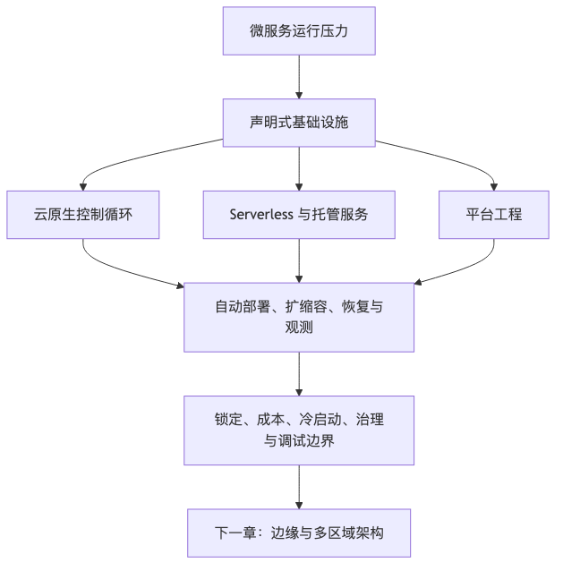

# 第 6 章：云原生、Serverless 与后微服务时代

## 本章的问题链

先看原始问题：微服务解决了业务拆分，却把另一类问题推到台前：服务如何部署、如何扩缩容、如何被发现、如何观测、如何控制成本、如何在失败时恢复。团队拆得越细，运行复杂度越容易失控。

为了解决这个问题，云原生、Serverless、托管服务和平台工程把运行能力逐步声明式化、自动化和平台化，让业务团队少维护底层机器，多表达自己的运行意图。

但这不是终点：平台能力降低了运行门槛，也带来新的边界：云厂商锁定、成本归因、冷启动、治理复杂度、调试难度和平台自身的可靠性，都必须重新被设计。再往前走，当系统要服务全球用户并承受区域级故障时，运行边界还会从单个 Region 推向边缘和多区域架构。

所以本章会按“问题 -> 机制 -> 新问题”的顺序展开：先把眼前的工程压力说清楚，再看对应机制解决了什么，最后讨论它留下的边界和下一步。



## 1. 本章解决什么问题

上一章我们讨论了 SOA、微服务与服务边界。微服务解决的核心问题，不是“把代码拆小”，而是让不同业务能力拥有独立的变更节奏、数据所有权和团队责任。

但是，微服务拆出来以后，新的问题马上出现：

* 服务数量变多了，谁负责部署？
* 每个服务都要扩容、回滚、灰度，谁来做？
* 服务之间调用链变长，如何观测？
* 每个团队都自己写发布脚本、监控脚本、限流逻辑，会不会变成新的重复建设？
* 机器利用率、云账单、容量规划，谁来管？
* 服务越来越多以后，研发到底是在写业务，还是在伺候基础设施？

这就是云原生、Serverless 和平台工程出现的背景。

云原生不是“把应用部署到 Kubernetes 上”，Serverless 也不是“真的没有服务器”。它们共同指向一个更大的变化：

> 现代架构的核心，不再只是如何拆服务，而是如何用自动化、声明式系统、弹性基础设施和平台能力，降低系统变化的成本。

微服务解决的是“业务复杂度如何拆开”。
云原生解决的是“拆开以后如何持续运行”。
Serverless 解决的是“部分场景下能不能把运行责任进一步交给平台”。
平台工程解决的是“不要让每个业务团队重复理解所有底层复杂度”。

这就是所谓“后微服务时代”的真正含义：
不是微服务过时了，而是系统设计的重心从“服务拆分”进一步扩展到“平台化运行、自动化治理、成本控制和开发者体验”。

---

## 2. 这个问题在小系统里为什么不明显

在小系统里，基础设施问题通常不明显。

一个创业项目早期可能只有：

* 一个后端应用；
* 一个数据库；
* 一个 Redis；
* 一个对象存储；
* 一个简单的 CI/CD；
* 少量定时任务；
* 几台云主机或者一个 PaaS 平台。

此时，部署可能就是：

```text
git pull
npm install / mvn package / docker build
systemctl restart
```

或者更现代一点：

```text
push 代码
CI 构建镜像
手工点一下发布
```

这套方式在小规模下完全可以工作。甚至，它比一开始就引入 Kubernetes、Service Mesh、GitOps、复杂 IaC 更正确。

因为早期系统真正稀缺的不是“基础设施先进性”，而是：

* 产品是否有人用；
* 需求是否稳定；
* 团队是否能快速试错；
* 核心链路是否足够简单；
* 成本是否可控。

如果只有 3 个服务、5 个研发、每天几百个请求，却先搭一套复杂的 Kubernetes 多集群、服务网格、全链路 GitOps、跨云灾备，往往不是先进，而是过度设计。

小系统里，很多问题可以靠人肉解决：

* 服务挂了，开发者 SSH 上去看日志；
* 流量上来了，手工加机器；
* 发布失败了，手工回滚；
* 配置错了，群里喊一声；
* 数据库慢了，临时加索引；
* 队列堆积了，重启消费者。

这些操作并不优雅，但在规模很小时，它们的总成本可能低于建设完整平台的成本。

真正的问题在于：
当系统规模增长以后，人肉运维会变成系统性风险。

---

## 3. 它在大规模互联网系统里如何变成故障、成本或组织问题

当服务数量从 5 个变成 50 个、500 个，基础设施问题会从“麻烦”变成“架构问题”。

### 3.1 部署问题变成稳定性问题

如果每个团队都有自己的部署脚本、发布习惯和回滚方式，那么发布本身就会成为事故来源。

常见情况包括：

* 某个服务发布时忘记带环境变量；
* 某个服务依赖的配置没有同步；
* 某个服务镜像版本不可追溯；
* 某个团队使用手工变更，线上状态和 Git 仓库不一致；
* 某个服务扩容后没有正确注册到网关；
* 某个服务回滚代码后，数据库 schema 已经不可逆变更。

在大系统里，发布不只是“把代码放上去”，而是一条完整控制链路：

```text
代码提交
  ↓
构建
  ↓
测试
  ↓
镜像/制品生成
  ↓
安全扫描
  ↓
配置渲染
  ↓
部署
  ↓
灰度
  ↓
观测
  ↓
自动/人工决策
  ↓
继续放量或回滚
```

任何一个环节没有标准化，都会导致发布风险扩大。

### 3.2 扩容问题变成成本问题

传统扩容方式通常是预估峰值，然后提前买机器。

这会产生两类浪费：

第一类是过度预留。
为了应对一天中 1 小时的峰值，系统可能需要准备 24 小时的资源。

第二类是扩容不及时。
当流量突然增长时，人工扩容来不及，系统开始超时、排队、雪崩。

云原生和 Serverless 的一个重要价值，就是把容量从“静态购买”变成“动态调度”。

但弹性并不等于便宜。
弹性只是把成本模型从“固定成本”变成“按使用量和调度效率计费”。如果没有资源 request/limit、自动扩缩容策略、预算告警、流量治理和成本归因，云原生系统一样可能烧钱，只是烧钱方式更隐蔽。

### 3.3 观测问题变成协作问题

单体系统里，请求路径短，日志集中，问题通常能在一个进程里定位。

微服务和云原生系统里，一个用户请求可能经过：

```text
客户端
  ↓
CDN / WAF / API Gateway
  ↓
Ingress
  ↓
Service A
  ↓
Service B
  ↓
Service C
  ↓
Redis
  ↓
数据库
  ↓
消息队列
  ↓
异步消费者
  ↓
第三方 API
```

此时，故障定位不再是“看某个服务日志”，而是要回答：

* 请求卡在哪一跳？
* 是调用方慢，还是被调用方慢？
* 是网络问题、DNS 问题、TLS 问题，还是连接池问题？
* 是数据库慢，还是队列积压？
* 是服务本身错误，还是依赖超时？
* 是本次发布引入，还是容量不足？
* 是一个租户异常，还是全局异常？

所以云原生不是只需要部署系统，还必须配套可观测性系统：日志、指标、Trace、事件、审计、告警、SLO 和成本数据。

### 3.4 基础设施问题变成组织问题

大系统里最危险的现象之一，是每个业务团队都被迫成为半个基础设施团队。

比如每个团队都要自己研究：

* Kubernetes YAML 怎么写；
* HPA 如何配置；
* Ingress 怎么配；
* 服务发现怎么接；
* 灰度发布怎么做；
* 日志怎么采；
* 指标怎么暴露；
* Trace 怎么接；
* Secret 怎么管理；
* 云数据库怎么申请；
* 消息队列怎么创建；
* 权限怎么开；
* 成本怎么归因。

这会导致两个结果：

第一，业务团队的认知负担极高。
开发者不再只是写业务，而是被迫学习大量平台细节。

第二，组织内重复造轮子。
每个团队都有自己的模板、脚本、规范和事故经验，最后全公司出现几十套半成品平台能力。

这就是平台工程的背景：
把通用的基础设施能力沉淀为内部平台，让业务团队通过标准化、自助化、可审计的方式使用，而不是每次从零理解底层复杂度。

---

## 4. 云原生的核心概念

### 4.1 云原生不是 Kubernetes，而是一组工程原则

很多人把云原生等同于 Kubernetes，这是一个常见误解。

Kubernetes 是云原生体系中的重要基础设施，但云原生的核心不是某个工具，而是一组设计原则：

* 应用应该可以弹性伸缩；
* 基础设施应该自动化管理；
* 系统状态应该声明式描述；
* 变更应该可追溯、可回滚、可审计；
* 服务应该松耦合；
* 故障应该被自动检测和自动恢复；
* 运维工作应该尽量减少重复人工操作；
* 系统应该具备可观测性；
* 架构应该支持频繁、可预测、低风险的变更。

可以把云原生理解成这样一句话：

> 云原生是用平台化和自动化的方式，让复杂分布式系统可以持续、安全、低成本地变化。

### 4.2 容器：把运行环境打包成可迁移单位

容器解决的核心问题是环境一致性。

传统部署里，应用依赖机器环境：

```text
这台机器装了什么系统？
Java 版本是什么？
Node 版本是什么？
本地库有没有？
配置文件在哪里？
启动命令是什么？
日志写到哪里？
```

容器把应用和运行依赖打包在一起，使应用变成一个更标准化的交付单位。

但容器不是银弹。
容器解决的是“运行环境一致性”，不是“系统架构合理性”。一个糟糕的单体放进容器里，仍然是糟糕单体；一个边界混乱的微服务放进容器里，也不会自动变好。

容器真正的价值，是为后续的自动调度、弹性伸缩、灰度发布和不可变部署提供基础。

### 4.3 Kubernetes：面向期望状态的控制系统

Kubernetes 的核心不是“跑容器”，而是“控制循环”。

你告诉 Kubernetes：

```text
我希望这个服务有 5 个副本
我希望它使用这个镜像版本
我希望它暴露这个端口
我希望它通过这个探针判断健康
我希望它最多使用这些资源
```

这就是期望状态。

Kubernetes 的控制器会不断观察现实状态，并尝试把现实状态拉回期望状态：

```text
期望状态：5 个 Pod
现实状态：3 个 Pod
动作：创建 2 个 Pod

期望状态：镜像版本 v2
现实状态：部分 Pod 仍是 v1
动作：滚动更新

期望状态：Pod 健康
现实状态：探针失败
动作：重启或替换 Pod
```

所以 Kubernetes 更像一个“分布式系统操作系统的控制平面”，而不是简单的部署工具。

它的价值包括：

* 自动调度；
* 副本管理；
* 服务发现；
* 滚动发布；
* 健康检查；
* 自动恢复；
* 配置和密钥管理；
* 资源隔离；
* 弹性伸缩；
* 扩展 API；
* 生态集成。

但 Kubernetes 的代价也很明显：

* 学习曲线高；
* 运维复杂；
* 网络、存储、权限、监控都需要体系化设计；
* YAML 容易膨胀；
* 多租户隔离并不简单；
* 集群升级、插件兼容、安全基线都需要长期维护；
* 如果团队没有平台能力，Kubernetes 会把复杂度暴露给每个业务团队。

因此，Kubernetes 适合的是“有足够服务规模、发布频率、弹性需求和平台团队能力”的组织，而不是所有团队的默认选项。

### 4.4 不可变基础设施：不要修机器，替换机器

传统运维喜欢“登录机器修问题”。

不可变基础设施的思路相反：

> 不要在运行中的机器上手工修改状态，而是通过镜像、声明式配置和自动化流程重新创建环境。

这带来几个好处：

* 环境可复现；
* 变更可审计；
* 回滚更简单；
* 减少雪花服务器；
* 降低“这台机器和别的机器不一样”的风险。

但是不可变基础设施并不意味着没有状态。
数据库、对象存储、消息队列、缓存、搜索引擎都可能有状态。真正的关键是：计算层尽量无状态化，状态层用更明确的持久化、备份、恢复和迁移机制管理。

### 4.5 声明式 API：描述结果，而不是手写过程

命令式操作是：

```text
创建一台机器
安装依赖
复制文件
启动服务
检查端口
失败后重试
```

声明式操作是：

```text
我希望系统最终处于这个状态
```

声明式系统的优点是：

* 更容易审计；
* 更容易自动恢复；
* 更容易做差异比较；
* 更容易做 GitOps；
* 更容易让控制器持续修正漂移。

Kubernetes、Terraform、GitOps 的共同点，都是把系统状态变成可描述、可版本化、可审查的对象。

### 4.6 服务网格：把服务间通信能力下沉到基础设施

微服务系统里，每个服务都需要处理一些共同问题：

* 超时；
* 重试；
* 熔断；
* 限流；
* 负载均衡；
* mTLS；
* 流量镜像；
* 灰度路由；
* 调用指标；
* Trace 传播。

如果这些能力都写在业务代码里，会导致重复建设和语言栈绑定。

服务网格的思路是，把服务间通信治理能力从业务代码中下沉到基础设施层。常见形态是 sidecar 或节点级代理，由控制平面统一下发策略。

但服务网格也有代价：

* 增加网络跳数；
* 增加调试复杂度；
* 增加资源消耗；
* 增加平台团队运维负担；
* 出问题时可能影响面很大；
* 对小团队来说，收益可能不如成本。

服务网格适合服务规模较大、语言栈复杂、安全和流量治理要求较高的组织。
如果只是十几个服务，先把 SDK、网关、基础可观测性做好，通常比直接上服务网格更务实。

### 4.7 托管服务：把非核心能力交给云厂商

托管服务包括：

* 云数据库；
* 托管 Redis；
* 托管 Kafka / Pulsar / Pub/Sub；
* 对象存储；
* 云搜索；
* API Gateway；
* 云监控；
* 云日志；
* 云密钥管理；
* 云 WAF；
* 云函数；
* 托管 Kubernetes。

托管服务的价值是减少自建成本。
很多团队并不需要自己维护数据库高可用、备份、补丁、主从切换、存储扩容和故障恢复。

但托管服务也有代价：

* 价格可能高；
* 深度定制能力有限；
* 迁移成本高；
* 容易被云厂商锁定；
* 故障时可控性较弱；
* 部分指标和内部机制不透明；
* 合规和数据主权需要额外评估。

所以托管服务不是“越多越好”，而是要看这项能力是否属于你的核心竞争力。

对于大多数业务系统：

* 数据库高可用通常不值得从零自建；
* 对象存储通常优先选择云厂商；
* 基础消息队列可以优先托管；
* 特别核心、特别大规模、特别强定制的中间件，才考虑自建。

一句话：

> 能力不是核心竞争力时，优先买；能力决定核心竞争力时，才认真考虑自建。

---

## 5. Serverless：把运行责任进一步交给平台

Serverless 的意思不是没有服务器，而是使用者不再直接管理服务器。

Serverless 通常包括两类：

* FaaS：Function as a Service，例如云函数；
* BaaS：Backend as a Service，例如认证、数据库、对象存储、消息、推送等后端能力。

Serverless 的核心特点是：

* 细粒度部署；
* 按请求或事件触发；
* 自动扩缩容；
* 不需要管理服务器；
* 按使用量计费；
* 平台负责运行时调度。

### 5.1 Serverless 适合什么场景

Serverless 特别适合以下场景：

* 图片处理；
* 视频转码的小任务编排；
* 文件上传后的异步处理；
* Webhook 处理；
* 定时任务；
* 低频后台任务；
* 数据清洗；
* 消息队列消费者；
* 轻量 API；
* 内部自动化；
* 峰谷明显、流量不可预测的任务。

例如图片处理系统：

```text
用户上传图片
  ↓
对象存储产生事件
  ↓
触发云函数
  ↓
生成缩略图 / 水印 / 格式转换
  ↓
写回对象存储
  ↓
更新数据库状态
  ↓
通知业务系统
```

这个场景天然适合 Serverless，因为它事件驱动、任务短小、峰谷明显，而且不值得为了偶发处理长期维护一组服务器。

### 5.2 Serverless 的优势

Serverless 的优势很明显：

第一，弹性好。
流量来了自动扩，流量没了自动缩。

第二，运维少。
不用管理机器、系统补丁、运行时调度和基础扩容。

第三，按量计费。
低频任务成本可能非常低。

第四，交付快。
业务团队可以更快把事件处理逻辑上线。

第五，天然适合事件驱动。
对象存储、消息队列、数据库变更、API 请求都可以触发函数。

### 5.3 Serverless 的代价

Serverless 的代价同样明显。

#### 5.3.1 冷启动

函数长时间不调用后，平台可能需要重新准备运行环境。
这会带来额外延迟，尤其是 Java、.NET、大依赖包、VPC 内访问、模型推理等场景。

冷启动不一定不可接受。
如果是后台异步处理，冷启动可能没关系；如果是用户同步请求，冷启动就可能影响体验。

#### 5.3.2 可观测性困难

Serverless 的运行实例短暂、动态、不可登录。
传统“上机器看日志”的方式失效了。

你必须提前设计：

* 结构化日志；
* Trace ID；
* 指标；
* 错误采样；
* 死信队列；
* 重试次数；
* 事件 ID；
* 幂等键；
* 成本标签。

否则函数失败时，你只知道“有东西坏了”，但很难知道哪个事件、哪次调用、哪个依赖出了问题。

#### 5.3.3 调试困难

本地环境和云端运行环境可能不一致。
事件格式、权限、网络、环境变量、依赖版本、超时限制，都可能导致“本地正常，线上失败”。

#### 5.3.4 厂商锁定

Serverless 深度依赖云厂商事件模型、权限系统、日志系统、对象存储、队列和 API Gateway。

如果你大量使用某云厂商的函数、事件、数据库触发器和权限模型，未来迁移成本会很高。

#### 5.3.5 成本失控

Serverless 按量计费，但不代表一定便宜。

典型成本事故包括：

* 错误重试导致函数无限触发；
* 队列积压后突然大量消费；
* 递归事件触发，例如函数写对象存储，又触发自己；
* 单次函数内存配置过高；
* 外部 API 慢导致函数运行时间变长；
* 没有预算告警；
* 没有租户级成本归因。

Serverless 的成本治理必须和事件治理、重试治理、幂等治理一起设计。

---

## 6. 后微服务时代的架构趋势

后微服务时代不是否定微服务，而是承认一个现实：

> 服务拆分只是第一步，真正长期困难的是运行、治理、观测、安全、成本和演进。

几个趋势会越来越重要。

### 6.1 从服务优先，到平台优先

过去很多团队的架构演进路径是：

```text
先拆微服务
再补注册中心
再补网关
再补监控
再补发布平台
再补配置中心
再补权限
再补成本治理
```

结果是每个能力都像补丁。

后微服务时代更合理的方式是先建设平台底座：

```text
标准应用模板
  ↓
标准构建流程
  ↓
标准部署模型
  ↓
标准配置和密钥管理
  ↓
标准观测接入
  ↓
标准灰度和回滚
  ↓
标准资源申请
  ↓
标准安全基线
  ↓
标准成本标签
```

业务团队不应该每次从零搭基础设施，而应该走一条“铺好的路”。

平台工程里常说的 golden path，本质就是：

> 为大多数业务场景提供一条默认正确、低摩擦、可审计、可维护的工程路径。

### 6.2 从机器运维，到控制面治理

过去运维关心机器：

* CPU；
* 内存；
* 磁盘；
* 进程；
* 端口；
* 系统日志。

云原生时代更关心控制对象：

* Deployment；
* Service；
* Ingress；
* ConfigMap；
* Secret；
* HPA；
* Policy；
* Gateway；
* Queue；
* Database；
* Function；
* Topic；
* Bucket。

系统设计也从“如何操作机器”变成“如何设计控制面”。

控制面设计要回答：

* 谁可以创建资源？
* 谁可以修改配置？
* 谁可以发布生产？
* 谁可以扩容？
* 谁可以访问 Secret？
* 谁可以跨租户访问数据？
* 谁可以回滚？
* 谁负责审批？
* 变更如何审计？
* 漂移如何发现？
* 策略如何自动执行？

### 6.3 从自建中间件，到托管服务组合

后微服务时代的另一个趋势是：越来越多系统由托管服务组合而成。

一个现代业务系统可能是：

```text
前端：CDN + 静态托管
入口：API Gateway + WAF
计算：Kubernetes / Serverless / PaaS
数据：云数据库 + 对象存储
异步：托管消息队列
安全：IAM + KMS + Secret Manager
观测：云监控 + OpenTelemetry
交付：CI/CD + GitOps
```

这意味着架构师不再只是设计服务之间的关系，还要设计云服务之间的关系。

这也带来新问题：

* 云服务之间的权限边界；
* 事件触发链路；
* 跨服务审计；
* 成本归因；
* 云厂商故障降级；
* 数据迁移能力；
* 多云或混合云策略；
* 合规和数据主权。

### 6.4 从“部署成功”，到“持续验证”

以前发布的目标是“部署成功”。

现在发布的目标应该是“部署后持续验证系统仍然满足目标”。

发布后要持续观察：

* 错误率是否上升；
* P95/P99 延迟是否变差；
* 核心业务指标是否下降；
* 队列是否积压；
* 数据库慢查询是否增加；
* 下游依赖是否被打爆；
* 资源使用是否异常；
* 成本是否异常；
* 特定租户是否受影响。

这也是为什么灰度发布、金丝雀发布、自动回滚和 SLO 变得重要。

---

## 7. 常见架构方案

### 7.1 Kubernetes 上的容器化微服务

这是最典型的云原生方案。

```text
                   ┌──────────────┐
                   │   Git Repo   │
                   └──────┬───────┘
                          │
                          ▼
                   ┌──────────────┐
                   │ CI Build     │
                   │ Test/Scan    │
                   └──────┬───────┘
                          │
                          ▼
                   ┌──────────────┐
                   │ Image Repo   │
                   └──────┬───────┘
                          │
                          ▼
┌─────────────┐    ┌──────────────┐
│ GitOps Repo │───▶│ CD / GitOps  │
└─────────────┘    └──────┬───────┘
                          │
                          ▼
                 ┌──────────────────┐
                 │ Kubernetes Cluster│
                 └──────┬───────────┘
                        │
        ┌───────────────┼────────────────┐
        ▼               ▼                ▼
  ┌──────────┐    ┌──────────┐     ┌──────────┐
  │ Service A│    │ Service B│     │ Service C│
  └────┬─────┘    └────┬─────┘     └────┬─────┘
       │               │                │
       ▼               ▼                ▼
  ┌──────────┐    ┌──────────┐     ┌──────────┐
  │ Database │    │  Redis   │     │  Queue   │
  └──────────┘    └──────────┘     └──────────┘
```

适合场景：

* 服务数量较多；
* 发布频繁；
* 多团队协作；
* 需要统一部署平台；
* 有弹性伸缩需求；
* 有平台团队；
* 需要混合云或多环境一致性。

不适合场景：

* 服务数量很少；
* 团队没有 Kubernetes 运维能力；
* 业务仍在快速探索；
* 系统状态复杂但平台能力薄弱；
* 成本敏感但缺乏 FinOps 能力。

### 7.2 托管服务优先的云架构

这类架构不追求“所有东西都跑在 K8s 上”，而是优先使用云厂商托管能力。

```text
客户端
  ↓
CDN / WAF
  ↓
API Gateway
  ↓
容器服务 / PaaS / 云函数
  ↓
托管数据库
  ↓
对象存储
  ↓
托管消息队列
  ↓
云监控 / 云日志 / 云告警
```

适合场景：

* 团队规模较小；
* 希望减少运维；
* 业务交付速度优先；
* 标准能力多于深度定制；
* 对云厂商绑定可接受。

风险：

* 成本可能随规模上涨；
* 迁移难度高；
* 排障依赖云厂商；
* 多云一致性差；
* 深度定制能力有限。

### 7.3 事件驱动 Serverless 架构

```text
用户/系统事件
   ↓
API Gateway / Object Storage / Queue / Scheduler
   ↓
Function
   ↓
Database / Object Storage / Third-party API
   ↓
Event Bus
   ↓
More Functions / Consumers
```

适合场景：

* 事件驱动；
* 峰谷明显；
* 任务短小；
* 异步处理；
* 业务链路可拆成独立函数；
* 不希望长期维护服务器。

不适合场景：

* 长连接；
* 强状态会话；
* 超低延迟同步请求；
* 大量复杂本地依赖；
* 需要深度控制运行环境；
* 需要跨云可迁移性；
* 复杂事务链路。

### 7.4 混合形态：主链路容器化，边缘任务 Serverless

生产系统里最常见的不是纯 Kubernetes 或纯 Serverless，而是混合形态。

例如电商系统：

* 核心交易链路跑在 Kubernetes 或 PaaS；
* 图片处理用 Serverless；
* 定时对账用 Serverless；
* 搜索索引更新走消息队列；
* 数据库使用托管服务；
* 对象存储使用云厂商；
* 入口使用 CDN + WAF + API Gateway；
* 平台交付使用 GitOps + IaC。

这类架构更符合现实：

> 核心稳定链路需要可控性，边缘弹性任务需要低运维成本。

---

## 8. 关键权衡

### 8.1 Kubernetes 适合什么团队，不适合什么团队

| 判断维度  | 更适合 Kubernetes   | 不适合 Kubernetes |
| ----- | ---------------- | -------------- |
| 服务规模  | 服务多，团队多，发布频繁     | 服务少，架构简单       |
| 平台能力  | 有 SRE / 平台团队     | 没有人长期维护        |
| 弹性需求  | 流量变化明显，需要自动调度    | 流量稳定，手工扩容足够    |
| 标准化需求 | 多团队需要统一发布和治理     | 单团队快速试错        |
| 可移植性  | 有混合云、多云、私有化需求    | 完全绑定单云也可接受     |
| 复杂度承受 | 能建设观测、安全、网络、存储体系 | 只想简单上线         |

一个务实判断：

> 如果 Kubernetes 让业务团队更快、更稳、更可控，它就是平台；如果 Kubernetes 让每个业务开发都被迫研究 YAML、网络和权限，它就是新的复杂度中心。

### 8.2 Serverless 适合什么，不适合什么

| 判断维度 | 适合 Serverless | 不适合 Serverless |
| ---- | ------------- | -------------- |
| 触发方式 | 事件驱动、定时、异步    | 长连接、复杂会话       |
| 流量模式 | 峰谷明显、不可预测     | 长期高稳定流量        |
| 任务时长 | 短任务           | 长任务、重计算        |
| 延迟要求 | 可接受冷启动或可预热    | 极低延迟同步链路       |
| 运行环境 | 依赖简单          | 依赖复杂、系统库多      |
| 可迁移性 | 接受云绑定         | 强跨云要求          |
| 运维目标 | 减少服务器管理       | 需要深度控制底层       |

### 8.3 托管服务优先还是自建优先

| 问题      | 倾向托管服务     | 倾向自建        |
| ------- | ---------- | ----------- |
| 是否核心竞争力 | 不是核心能力     | 是核心能力       |
| 团队能力    | 缺少专职运维专家   | 有成熟平台团队     |
| 规模      | 中小规模       | 超大规模且成本敏感   |
| 定制需求    | 标准功能足够     | 需要深度定制      |
| 合规要求    | 云厂商满足要求    | 需要完全控制数据和环境 |
| 故障控制    | 可接受云厂商 SLA | 需要自定义故障恢复策略 |
| 迁移要求    | 接受绑定       | 必须可迁移       |

### 8.4 GitOps 和 IaC 的边界

IaC 解决的是“基础设施如何用代码描述和创建”。

例如：

* VPC；
* 子网；
* 安全组；
* 数据库；
* 对象存储；
* IAM；
* Kubernetes 集群；
* 消息队列。

GitOps 更强调“系统期望状态存放在 Git 中，并由自动化控制器持续拉取和对齐”。

可以简单理解：

```text
IaC：把基础设施创建出来
GitOps：让运行状态持续与 Git 中声明保持一致
```

二者不是替代关系，而是互补关系。

---

## 9. 典型失败模式

### 9.1 把云原生等同于 Kubernetes

最常见失败模式是：

```text
我们要云原生
= 我们要 Kubernetes
= 所有服务都上 K8s
= 所有团队都写 YAML
= 所有问题都交给业务团队自己解决
```

这不是云原生，这是把复杂度直接转嫁给研发。

真正的云原生应该是：

```text
业务团队只关心应用意图
平台负责构建、部署、扩缩容、观测、安全、回滚和成本治理
```

### 9.2 YAML 地狱

Kubernetes 的声明式配置很强大，但如果没有抽象，会变成 YAML 地狱。

一个简单服务可能需要：

* Deployment；
* Service；
* Ingress；
* HPA；
* ConfigMap；
* Secret；
* ServiceAccount；
* Role；
* RoleBinding；
* PodDisruptionBudget；
* NetworkPolicy；
* ServiceMonitor；
* VirtualService；
* DestinationRule。

如果每个业务团队都手写这些配置，结果必然是：

* 重复；
* 不一致；
* 难审查；
* 难升级；
* 难排障；
* 安全策略遗漏。

解决办法不是禁止 YAML，而是提供平台抽象：

```yaml
service:
  name: order-service
  image: order-service:v1.2.3
  replicas:
    min: 3
    max: 20
  resources:
    cpu: 500m
    memory: 1Gi
  exposure:
    type: internal
  observability:
    tracing: true
    metrics: true
  rollout:
    strategy: canary
```

业务团队声明意图，平台生成底层资源。

### 9.3 只做部署平台，不做观测平台

很多团队把云原生建设理解成“能发布到 K8s”。

但生产系统真正需要的是：

* 发布前能检查；
* 发布中能灰度；
* 发布后能观察；
* 出问题能定位；
* 影响面能判断；
* 必要时能回滚；
* 成本异常能发现；
* 安全问题能审计。

没有观测的自动化部署，只会让事故扩散得更快。

### 9.4 自动扩容基于错误指标

自动扩容不是打开 HPA 就结束了。

如果服务瓶颈是数据库连接池，而你只看 CPU，扩容可能没有意义。
如果服务瓶颈是下游 API，扩容反而会把下游打爆。
如果服务是 Node.js，CPU 不一定能准确反映事件循环排队。
如果服务是队列消费者，应该看队列积压、消费速率和处理延迟。
如果服务是搜索系统，应该看查询延迟、线程池、缓存命中率和段合并压力。

扩容指标必须来自业务链路，而不是只来自机器资源。

### 9.5 Serverless 递归触发

一个经典事故是：

```text
对象存储上传文件
  ↓
触发函数
  ↓
函数生成新文件并写回同一个 Bucket
  ↓
再次触发函数
  ↓
无限循环
```

如果没有事件过滤、前缀隔离、幂等保护、最大重试和预算告警，Serverless 可以在很短时间内制造大量账单和任务堆积。

### 9.6 托管服务失控

托管服务让系统上线更快，但也可能让架构变得不可迁移。

典型问题：

* 使用了云厂商特有事件格式；
* 使用了特有数据库扩展；
* 使用了特有 IAM 策略；
* 使用了特有消息协议；
* 备份无法跨云恢复；
* 监控数据无法完整导出；
* 成本模型不透明。

不是说不能用厂商能力，而是关键链路要清楚知道绑定在哪里，以及未来迁移代价是什么。

---

## 10. 生产实践

### 10.1 先定义平台边界

平台团队不应该承诺“什么都管”。

应该先定义平台边界：

平台负责：

* 应用模板；
* 构建流水线；
* 镜像仓库；
* 部署流程；
* 灰度发布；
* 回滚；
* 基础观测；
* Secret 管理；
* 资源配额；
* 权限模型；
* 成本标签；
* 安全基线；
* 常见中间件申请。

业务团队负责：

* 业务代码；
* API 契约；
* 数据模型；
* 容量预估；
* SLO 定义；
* 业务告警；
* 降级策略；
* 数据一致性；
* 依赖治理。

边界不清楚，平台团队会变成救火队；业务团队会把所有问题都甩给平台。

### 10.2 建设 Golden Path，而不是建设工具超市

平台不是把几十个工具摆给开发者：

```text
你可以选 Jenkins，也可以选 GitHub Actions
你可以选 Argo，也可以选 Flux
你可以选 Helm，也可以选 Kustomize
你可以选 Prometheus，也可以选云监控
你可以选 Istio，也可以选 Linkerd
```

这会让业务团队更迷茫。

平台应该提供默认路径：

```text
普通 Web 服务：走标准服务模板
异步消费者：走标准消费者模板
定时任务：走标准 Job 模板
静态站点：走标准前端托管模板
图片处理：走标准 Serverless 模板
内部工具：走标准轻量应用模板
```

不是不能自定义，而是默认路径要足够好。
80% 的业务应该不需要理解底层细节。

### 10.3 每个服务都必须有运行契约

服务上线前，至少要声明：

* 服务名称；
* 负责人；
* 代码仓库；
* 运行环境；
* 依赖服务；
* 数据库依赖；
* 队列依赖；
* 是否核心链路；
* SLO；
* 资源 request/limit；
* 扩缩容策略；
* 健康检查；
* 灰度策略；
* 回滚方式；
* 告警接收人；
* 成本归属；
* 数据等级；
* 权限范围。

这份运行契约比“是否用了 K8s”更重要。

### 10.4 资源治理必须前置

云原生系统里，资源不是无限的。

必须治理：

* CPU request/limit；
* 内存 request/limit；
* 存储配额；
* Namespace 配额；
* 队列长度；
* 函数并发；
* 数据库连接数；
* API Gateway 限流；
* 租户级配额；
* 成本预算；
* 日志采样；
* Trace 采样。

没有资源治理，弹性系统会变成互相抢资源的系统。

### 10.5 观测要从第一天接入

每个服务至少应该具备：

* 结构化日志；
* Trace ID；
* RED 指标：Rate、Errors、Duration；
* USE 指标：Utilization、Saturation、Errors；
* 业务指标；
* 依赖调用指标；
* 队列积压指标；
* 数据库指标；
* 发布版本标签；
* 租户标签；
* 成本标签。

尤其在云原生和 Serverless 系统里，没有观测就没有控制。

---

## 11. 案例一：传统微服务系统迁移到云原生平台

### 11.1 背景

某电商公司有一套传统微服务系统：

* 40 个 Java 服务；
* 部署在云主机上；
* 使用 Nginx 做入口；
* 服务注册依赖自建注册中心；
* Jenkins 构建；
* Ansible 发布；
* MySQL、Redis、Kafka 部分自建；
* 日志分散；
* 发布依赖人工群通知；
* 扩容主要靠人工加机器。

问题包括：

* 发布耗时长；
* 回滚不稳定；
* 环境不一致；
* 服务容量难评估；
* 机器利用率低；
* 事故定位慢；
* 新服务接入成本高；
* 每个团队都有自己的脚本。

### 11.2 迁移目标

迁移目标不是“上 Kubernetes”，而是：

* 标准化服务交付；
* 降低发布风险；
* 提升资源利用率；
* 改善可观测性；
* 统一配置和密钥管理；
* 支持灰度发布；
* 建立成本归因；
* 为后续多区域和弹性扩展做准备。

### 11.3 目标架构

```text
开发者
  ↓
Git Repository
  ↓
CI Pipeline
  - 单元测试
  - 契约测试
  - 镜像构建
  - 安全扫描
  ↓
Image Registry
  ↓
GitOps Repository
  ↓
CD Controller
  ↓
Kubernetes Platform
  ├─ Ingress / Gateway
  ├─ Workloads
  ├─ Config / Secret
  ├─ HPA
  ├─ Observability Agent
  ├─ Policy Controller
  └─ Service Mesh optional
  ↓
托管数据库 / Redis / Kafka / Object Storage
  ↓
日志 / 指标 / Trace / 告警 / 成本平台
```

### 11.4 迁移路线

第一阶段：容器化，但不急着改架构。
先把服务运行环境标准化，构建镜像，统一启动命令、健康检查、日志输出。

第二阶段：非核心服务先迁移。
不要第一个迁移订单、支付、库存这类核心链路。先迁移后台服务、查询服务、内部工具。

第三阶段：建设标准模板。
沉淀 Web 服务、消费者、定时任务三类模板，避免每个团队自己写 Kubernetes 配置。

第四阶段：接入观测。
所有迁移服务必须接入日志、指标、Trace、告警和发布版本标签。

第五阶段：引入灰度和自动回滚。
发布不再是一次性全量替换，而是小流量验证。

第六阶段：迁移核心链路。
当平台能力稳定后，再迁移订单、支付、库存等核心链路。

第七阶段：成本治理。
按团队、服务、环境、租户打标签，建立资源利用率和账单看板。

### 11.5 迁移中的关键原则

* 不要边迁移边重写业务；
* 不要一次性迁移所有服务；
* 不要把 Kubernetes 细节暴露给所有开发者；
* 不要在没有观测的情况下迁移核心链路；
* 不要把自建中间件全部原样搬进集群；
* 不要为了“云原生纯度”牺牲稳定性。

---

## 12. 案例二：Serverless 图片处理系统

### 12.1 需求

设计一个图片处理系统：

* 用户上传原图；
* 系统生成多种尺寸缩略图；
* 添加水印；
* 提取图片元信息；
* 对敏感内容做检测；
* 处理完成后通知业务系统；
* 支持高峰期大量上传；
* 低峰期尽量不产生固定成本。

### 12.2 架构设计

```text
客户端
  ↓
业务服务申请上传凭证
  ↓
对象存储 Original Bucket
  ↓
ObjectCreated Event
  ↓
Event Bus / Queue
  ↓
Image Processing Function
  ├─ 校验文件类型
  ├─ 读取原图
  ├─ 生成缩略图
  ├─ 添加水印
  ├─ 提取元数据
  ├─ 调用内容安全服务
  └─ 写入结果 Bucket
  ↓
数据库更新处理状态
  ↓
通知业务系统
```

### 12.3 为什么适合 Serverless

这个系统有几个特点：

* 上传事件驱动；
* 图片处理任务相对独立；
* 峰谷明显；
* 不需要长期运行进程；
* 可接受异步完成；
* 单个任务失败可以重试；
* 处理结果可以通过状态机追踪。

因此 Serverless 可以减少大量运维工作。

### 12.4 关键设计点

第一，原图 Bucket 和结果 Bucket 分离。
避免函数写回同一个路径后再次触发自己。

第二，事件必须有幂等键。
同一个对象事件可能重复投递，函数必须能识别重复处理。

第三，必须有死信队列。
处理失败超过重试次数后，把事件写入 DLQ，等待人工或自动补偿。

第四，必须限制并发。
如果瞬间大量上传，函数无限扩容可能打爆数据库、内容安全 API 或对象存储请求额度。

第五，必须记录处理状态。
图片状态至少包括：

```text
UPLOADED
PROCESSING
PROCESSED
FAILED
RETRYING
NEED_MANUAL_REVIEW
```

第六，必须设计成本保护。
包括函数并发上限、预算告警、单租户配额、日志采样和异常重试熔断。

### 12.5 失败模式

常见失败包括：

* 重复事件导致重复生成图片；
* 函数递归触发；
* 内容安全 API 超时导致队列堆积；
* 大图片导致函数内存不足；
* 单个租户批量上传拖垮全局处理能力；
* 失败事件没有 DLQ，问题被静默吞掉；
* 没有状态表，业务侧不知道图片到底处理到哪一步；
* 日志缺少 object key 和 event id，无法排查。

---

## 13. Build vs Buy 决策表

| 能力            | 优先 Buy / 托管 | 考虑 Build / 自建   |
| ------------- | ----------- | --------------- |
| Kubernetes 集群 | 中小团队用托管 K8s | 有多云、私有化、深度定制需求  |
| 数据库           | 普通业务优先云数据库  | 超大规模、特殊内核、强成本优化 |
| Redis         | 优先托管        | 极致成本或特殊模块需求     |
| Kafka / MQ    | 优先托管或云消息    | 超大吞吐、强协议控制、深度调优 |
| 对象存储          | 优先云对象存储     | 极少数私有化或合规特殊场景   |
| API Gateway   | 优先云网关或成熟网关  | 复杂多租户、强定制入口治理   |
| CI/CD         | 优先成熟工具      | 有复杂合规和内部平台要求    |
| 监控日志          | 优先托管或成熟开源组合 | 超大规模成本优化        |
| Service Mesh  | 谨慎引入成熟方案    | 不建议自研通用 Mesh    |
| Serverless    | 优先云厂商能力     | 强跨云或特殊运行时需求     |
| 平台门户          | 常常需要自建整合层   | 简单团队可先不用        |

一个判断标准：

> 基础能力可以买，业务差异化能力要掌握；通用能力可托管，核心瓶颈要可控。

---

## 14. 云原生系统设计 Checklist

### 14.1 业务与架构

* 这个系统为什么需要云原生？
* 是为了弹性、发布、资源利用率、平台统一，还是为了赶潮流？
* 当前服务数量和团队规模是否足够支撑平台复杂度？
* 哪些服务是核心链路？
* 哪些服务可以先迁移？
* 哪些服务不适合迁移？
* 哪些能力应该托管？
* 哪些能力必须自建？

### 14.2 部署与发布

* 是否有统一 CI/CD？
* 镜像是否可追溯？
* 配置是否版本化？
* Secret 是否安全管理？
* 是否支持灰度发布？
* 是否支持快速回滚？
* 是否有发布审计？
* 是否能关联发布版本与线上指标？

### 14.3 运行与弹性

* 是否设置 resource request/limit？
* 是否有 HPA 或其他扩缩容策略？
* 扩容指标是否合理？
* 是否有队列积压保护？
* 是否有数据库连接数保护？
* 是否有租户级限流？
* 是否有容量压测数据？
* 是否定义了降级策略？

### 14.4 可观测性

* 是否有结构化日志？
* 是否有指标？
* 是否有分布式 Trace？
* 是否有业务指标？
* 是否有 SLO？
* 告警是否能定位到负责人？
* 是否能按版本、租户、区域、环境筛选？
* 是否有成本看板？

### 14.5 安全与治理

* 是否有最小权限模型？
* Secret 是否避免明文进入镜像和 Git？
* 是否有镜像扫描？
* 是否有依赖漏洞扫描？
* 是否有网络隔离？
* 是否有策略准入控制？
* 是否有审计日志？
* 是否满足合规要求？

### 14.6 Serverless 专项

* 是否接受冷启动？
* 是否设计幂等？
* 是否有最大重试次数？
* 是否有死信队列？
* 是否限制并发？
* 是否有事件过滤？
* 是否避免递归触发？
* 是否有成本预算和告警？
* 是否评估厂商锁定？

---

## 15. 常见误区

### 误区一：云原生就是 Kubernetes

Kubernetes 是工具，不是目标。
目标是提升系统的弹性、自动化、可观测性、可管理性和变更效率。

### 误区二：Serverless 一定更便宜

低频、峰谷明显、异步事件驱动任务，Serverless 往往便宜。
长期高频、稳定负载、重计算任务，Serverless 未必便宜。

### 误区三：托管服务一定更省心

托管服务减少了运维，但没有消除架构责任。
权限、成本、迁移、合规、故障降级仍然需要设计。

### 误区四：平台工程就是做内部工具

平台工程不是工具堆砌，而是把组织内重复、易错、高风险的工程路径标准化、自助化和可审计化。

### 误区五：服务网格越早上越好

服务网格适合复杂服务治理场景。
如果组织还没有基本的服务边界、监控、发布和故障处理能力，过早引入服务网格只会增加调试复杂度。

---

## 16. 本章小结

云原生、Serverless 和平台工程共同代表了后微服务时代的系统设计方向。

微服务让业务能力拆开，但拆开以后，系统需要更强的平台能力来支撑运行。云原生通过容器、声明式 API、不可变基础设施、自动化控制循环和可观测性，让复杂系统能够更频繁、更可控地变化。Serverless 则在部分事件驱动场景中，把服务器管理、扩缩容和运行调度进一步交给平台。平台工程则把这些能力包装成业务团队可用的内部产品，降低开发者认知负担。

但这些技术都不是免费的。

Kubernetes 带来统一调度，也带来平台复杂度。
Serverless 带来弹性和免运维，也带来冷启动、调试困难、可观测性挑战和厂商锁定。
托管服务带来交付速度，也带来成本、迁移和可控性问题。
平台工程带来标准化，也要求组织长期投入和产品化思维。

因此，本章最重要的观点是：

> 云原生的目标不是追求技术栈先进，而是让系统在变化中保持可靠、可控、可观测和可承受成本。

---

## 17. 这一章最重要的 5 个判断

1. **云原生不是 Kubernetes，而是自动化、声明式、弹性、可观测和平台化的系统设计方法。**

2. **Kubernetes 适合有一定服务规模、发布复杂度和平台团队能力的组织；小团队过早引入 Kubernetes，可能只是把复杂度提前。**

3. **Serverless 适合事件驱动、短任务、峰谷明显、异步处理场景；不适合所有核心同步链路。**

4. **托管服务优先不是偷懒，而是工程取舍；但每一次 Buy 都要知道自己绑定了什么。**

5. **后微服务时代的核心竞争力，不是服务拆得多细，而是平台能否让业务团队低成本、安全、可观测地持续交付。**
