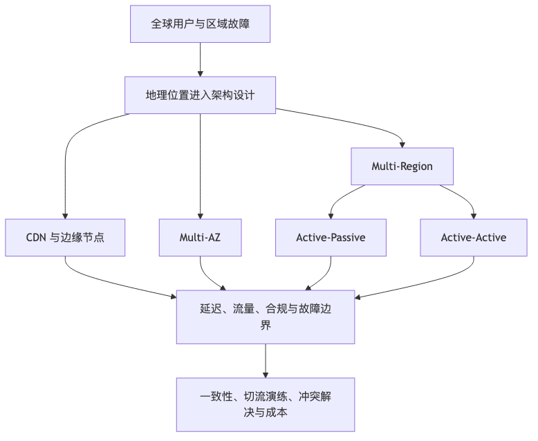

# 第 7 章：边缘、全球化与多区域架构

在前几章里，我们讨论了单体、模块化单体、微服务、云原生和 Serverless。这些架构形态大多默认系统运行在“一个逻辑中心”里：一个主要机房、一个云 Region、一个 Kubernetes 集群，或者一个主数据库所在的区域。

但现代互联网系统越来越少有这样的好运气。

一个内容平台可能同时服务日本、东南亚、欧洲和北美用户；一个 SaaS 产品可能要满足欧盟客户的数据保护要求、中国客户的数据出境要求、美国客户的低延迟要求；一个电商系统可能在大促期间不能因为某个云 Region 故障而全站停摆；一个 AI 应用可能既要把模型推理放到用户附近，又不能把敏感数据随意跨境传输。

这时，系统设计不再只是“服务怎么拆、数据库怎么选、消息队列怎么用”，而是多了一个关键维度：**地理位置**。

地理位置会改变延迟、可用性、成本、合规、数据一致性、故障边界和组织责任。它让系统设计从“如何在一个地方可靠运行”，变成“如何在多个地方有控制地运行”。

云厂商通常把基础设施分为 Region 和 Availability Zone。以 AWS 为例，Region 被设计为彼此隔离，资源也不会自动跨 Region 复制；Availability Zone 则是一个 Region 内的多个隔离位置。([AWS 文档][1]) Azure 也将可用区描述为一个 Region 内物理分离的数据中心组，具有独立的电力、冷却和网络基础设施，但同时也明确指出，可用区不能防止整个 Region 级别的故障。([Microsoft Learn][2]) 这正是本章要讨论的核心：**多 AZ 解决的是单 Region 内部故障，多 Region 解决的是区域级故障、全球访问和合规边界；二者不能混为一谈。**

---

## 本章的问题链

先看原始问题：一个系统在单区域里跑得很好，不代表它能服务全球用户。距离会带来延迟，区域故障会带来中断，数据跨境会带来合规风险，单中心假设一旦破裂，原来的架构边界就不够用了。

为了解决这个问题，本章把地理位置纳入架构设计：用 CDN、边缘节点、Multi-AZ、Multi-Region、Active-Passive 和 Active-Active，重新设计流量、数据、容灾和合规边界。

但这不是终点：系统铺到多个区域以后，新的问题会更硬：数据一致性、冲突解决、切流演练、脑裂防护、成本控制和区域责任，都不能再靠“多部署一份”解决。

所以本章会按“问题 -> 机制 -> 新问题”的顺序展开：先把眼前的工程压力说清楚，再看对应机制解决了什么，最后讨论它留下的边界和下一步。



## 7.1 本章解决什么问题

本章要回答四类问题。

第一，**如何让远距离用户访问得更快**。
当用户离源站很远时，光速、运营商网络、跨境链路、TLS 握手、DNS 解析、服务调用链路都会叠加成明显延迟。CDN、边缘缓存、边缘计算、全球负载均衡，本质上都是在回答同一个问题：哪些东西可以放到离用户更近的地方？

第二，**如何让系统在区域故障下继续服务**。
单 AZ 故障、多 AZ 故障、Region 故障、云厂商控制面故障、DNS 故障、证书故障、第三方支付区域故障，都可能让系统不可用。多区域架构不是“多买几台机器”，而是要重新设计流量调度、数据复制、故障切换和恢复流程。

第三，**如何处理跨区域数据一致性**。
请求可以就近处理，静态资源可以就近缓存，但订单、支付、账户余额、库存、权限、风控决策不能随便复制、随便覆盖。全球化系统里最难的通常不是计算，而是数据：谁是数据所有者？哪里可以写？复制延迟能接受吗？冲突怎么解决？出现脑裂怎么办？

第四，**如何满足数据主权、跨境合规和区域隔离要求**。
欧盟 GDPR 对欧洲经济区外的个人数据传输有专门限制，要求数据离开 EEA 时仍具备相应保护机制，例如充分性决定、标准合同条款、约束性公司规则等。([欧洲数据保护委员会][3]) 中国《个人信息保护法》也设置了个人信息跨境提供规则，国家网信办还陆续出台了数据出境安全评估、个人信息出境标准合同、促进和规范数据跨境流动等制度路径。([国家版权局][4]) 对架构师来说，这意味着“把所有数据复制到全球所有 Region”往往不是能力强，而是风险大。

一句话总结：**本章讨论的是如何在延迟、可用性、一致性、合规和成本之间，为全球化系统设计可控的地理边界。**

---

## 7.2 这个问题在小系统里为什么不明显

一个早期系统通常有这些特点：

* 用户集中在一个国家或一个城市；
* 流量规模不大；
* 故障恢复可以依赖人工；
* 数据类型简单；
* 合规边界模糊；
* 第三方依赖少；
* 对可用性的承诺不高。

在这个阶段，一个单 Region + 多 AZ 的架构通常已经足够。应用服务部署在多个可用区，数据库使用云厂商提供的高可用版本，静态资源放 CDN，备份定期落对象存储，事故时人工恢复。这样的系统不优雅，但很务实。

问题在于，系统增长不会提前通知架构。

某一天，海外用户开始增长，客服收到“页面很慢”的反馈；某一天，大客户要求数据不能离开指定司法辖区；某一天，云厂商某个 Region 出现故障，业务发现所谓“高可用数据库”只是在单 Region 内高可用；某一天，CDN 缓存了错误版本的配置，全球用户看到错误价格；某一天，跨境链路抖动导致支付回调延迟，订单状态大量卡住。

这些问题在小系统里不是不存在，而是被规模、用户分布和业务容忍度掩盖了。

小系统常见的隐含假设是：

```text
所有用户离系统都不远；
所有请求都可以回到中心机房处理；
所有数据都可以放在一个主库里；
所有故障都可以人工处理；
所有第三方服务在所有地区都一样可用；
所有国家和地区对数据的要求都差不多。
```

全球化之后，这些假设会逐个破产。

---

## 7.3 大规模系统里它如何变成故障、成本或组织问题

### 1. 延迟变成转化率问题

延迟不是纯技术指标。页面慢会影响注册、搜索、下单、支付、客服体验。对于内容、游戏、实时协作、金融交易、AI 对话这类系统，跨洲访问可能直接让产品不可用。

CDN 可以把图片、视频、网页、脚本等内容缓存到离用户更近的边缘节点。Cloudflare 的缓存文档也说明，CDN 会在地理分布的数据中心保存常访问内容，从而降低源站负载并改善性能；静态内容通常默认可缓存，动态 HTML 则需要通过规则显式配置缓存策略。([Cloudflare Docs][5])

但 CDN 不是魔法。它适合缓存可复用内容，不适合盲目缓存强个性化、强一致、强权限相关的数据。把用户订单页缓存到边缘节点，听起来很快，事故发生时也会很刺激。

### 2. 区域故障变成业务连续性问题

单 Region 高可用不等于全球高可用。一个 Region 内多 AZ 能抵抗单可用区级别故障，但无法天然抵抗整个 Region 的网络、控制面、依赖服务、监管或自然灾害风险。

AWS Well-Architected Reliability Pillar 强调，RTO 和 RPO 是灾难恢复目标，应基于业务需要设定，同时需要考虑工作负载位置、数据位置、故障概率和恢复成本。([AWS 文档][6]) 这句话背后的工程含义是：不要先问“要不要多活”，而要先问“这个业务最多能停多久、最多能丢多少数据、愿意为此付多少钱”。

### 3. 数据复制变成一致性问题

跨区域复制有成本，也有时间差。距离越远，延迟越高；同步复制越强，用户写入越慢；异步复制越快返回，故障时越可能丢失最近的数据。

Google Cloud 文档在介绍多区域服务时也明确指出，多区域服务会在可用性、性能、资源效率之间优化，但通常需要在延迟或一致性模型之间做权衡。([Google Cloud Documentation][7])

这就是全球化系统的铁律之一：**你可以把计算推到边缘，但不能假装数据一致性没有代价。**

### 4. 合规变成架构边界问题

数据主权不是法务部门写在合同里的抽象名词，而是架构里的边界条件。

例如：

* 欧盟用户个人数据是否可以复制到美国？
* 中国境内收集的个人信息是否可以传给境外分析系统？
* 企业客户要求日志、审计、文件、模型输入都留在某个区域内，系统是否做得到？
* 运维人员跨境访问生产数据，是否也构成跨境处理？
* 备份、监控、日志、工单、客服系统是否偷偷复制了敏感数据？

很多团队只检查主数据库，却忘了对象存储、搜索索引、日志平台、BI 数仓、告警系统、客服系统、模型训练数据集。这些“旁路数据”常常比主链路更容易违规。

### 5. 多区域变成组织协作问题

多区域系统要求团队具备更成熟的工程能力：

* 基础设施团队要管理多 Region 网络、账号、权限、配额；
* SRE 要设计跨区域监控、告警、演练和故障切换；
* 业务团队要理解哪些能力可以降级；
* 数据团队要处理跨区域复制、脱敏、汇总和血缘；
* 安全与法务要参与数据分类和出境评估；
* 客服与运营要理解区域性故障对用户沟通的影响。

如果组织能力还停留在“出事群里喊人”，多活架构只会把事故从一个地方扩大到多个地方。

---

## 7.4 核心概念

### 7.4.1 CDN、边缘缓存与边缘计算

**CDN** 的核心思想是把内容缓存在离用户更近的节点上。它最适合：

* 图片、视频、字体、CSS、JavaScript；
* 可公开访问的静态页面；
* 变化频率低的配置；
* 可按版本号访问的资源；
* 可接受短时间陈旧的数据。

**边缘缓存** 比传统静态资源 CDN 更进一步，它可能缓存完整 HTML、API 响应、个性化程度较低的页面片段。但越靠近业务数据，缓存失效和权限隔离就越复杂。

**边缘计算** 则是在边缘节点执行部分逻辑，例如：

* A/B 实验分流；
* 地理位置路由；
* Bot 判断；
* Header 改写；
* 图片裁剪；
* 轻量鉴权；
* 静态页面渲染；
* AI 小模型推理或预处理。

边缘计算的诱惑在于低延迟，风险在于复杂度扩散。不要把边缘节点变成另一个难以观测、难以测试、难以回滚的业务后端。

一个比较稳妥的原则是：

```text
边缘适合做靠近入口、无状态、低风险、可快速回滚的逻辑；
核心交易、强一致写入、复杂权限判断，仍应回到受控的区域服务处理。
```

---

### 7.4.2 Multi-AZ 与 Multi-Region

**Multi-AZ** 是在同一个 Region 内跨多个可用区部署。它主要解决：

* 单机故障；
* 单机房故障；
* 局部电力、网络、硬件故障；
* 单 AZ 维护或容量问题。

**Multi-Region** 是跨多个地理区域部署。它主要解决：

* 整个 Region 不可用；
* 大范围网络问题；
* 用户分布带来的高延迟；
* 数据主权和合规隔离；
* 云厂商区域级服务故障；
* 第三方服务区域不可用。

Multi-AZ 通常是生产系统的基本功；Multi-Region 则是业务连续性、全球化和合规共同推动的结果。前者多数团队应该尽早做，后者不应该轻率做。

---

### 7.4.3 Active-Passive 与 Active-Active

**Active-Passive** 指一个主区域承载主要流量，备用区域平时不承载或只承载少量验证流量。故障时，把流量切到备用区域。

它的优点是：

* 架构相对简单；
* 数据写入路径清晰；
* 冲突少；
* 成本低于全量多活。

缺点是：

* 切换流程复杂；
* 平时不承载真实流量的备用区域容易“生锈”；
* RTO 通常比多活长；
* 切换时容易遇到配额、配置、数据延迟、依赖不可用等问题。

**Active-Active** 指多个区域同时承载真实流量。它的优点是：

* 用户可以就近访问；
* 某个区域故障时理论上可以更快转移；
* 资源利用率更高；
* 对全球业务更自然。

缺点是：

* 数据一致性复杂；
* 冲突处理复杂；
* 流量调度复杂；
* 故障半径可能扩大；
* 成本和运维要求高；
* 对团队工程纪律要求极高。

不要因为“多活”听起来高级就盲目追求。很多系统真正需要的是**可演练的热备**，而不是全局多写多活。

---

### 7.4.4 单元化架构

单元化架构，也可以理解为 Cell-based Architecture，是把系统按用户、租户、地域、业务线或数据分片拆成多个相对独立的单元。每个单元有自己的服务、数据库、缓存、队列和故障边界。

例如，一个全球 SaaS 可以按客户所在区域划分：

```text
EU Cell      -> 服务欧盟客户，数据留在 EU
US Cell      -> 服务美国客户，数据留在 US
APAC Cell    -> 服务亚太客户，数据留在 APAC
Global Plane -> 只保存低敏元数据、路由配置、计费汇总
```

单元化的目标不是“复制很多套系统”，而是限制故障传播：

* 一个区域数据库故障，不影响所有客户；
* 一个租户流量暴涨，不拖垮全局；
* 一个区域合规要求变化，不迫使全系统重构；
* 一个单元发布失败，可以只回滚该单元。

单元化的代价也很直接：

* 资源利用率下降；
* 发布和配置管理复杂；
* 跨单元查询困难；
* 全局报表需要异步汇总；
* 运维工具必须支持多单元视角。

---

### 7.4.5 DNS 调度与全球负载均衡

全球流量调度常见方式包括：

* DNS 解析调度；
* Anycast；
* 全球负载均衡；
* CDN 边缘路由；
* 客户端内置区域选择；
* 服务端重定向。

DNS 调度简单、通用，但切换速度受 TTL、递归 DNS 缓存、客户端缓存影响。AWS Route 53 支持健康检查和 DNS Failover，可以在多个资源执行同一功能时，根据健康状态只返回健康资源。([AWS 文档][8]) 但这并不意味着 DNS Failover 就能做到秒级无损切换。生产环境必须把 TTL、客户端连接复用、缓存污染、健康检查误判都纳入演练。

全球负载均衡通常提供更丰富的能力，例如基于延迟、地域、权重、容量、健康状态调度。Google Cloud 的全球外部应用负载均衡可以把 HTTP/HTTPS 流量分配到多个后端实例和多个区域，并通过单一全局 IP 简化 DNS 设置。([Google Cloud][9])

---

### 7.4.6 RTO 与 RPO

**RTO，Recovery Time Objective，恢复时间目标**，指系统中断后最多可以多久恢复。

**RPO，Recovery Point Objective，恢复点目标**，指最多可以丢失多长时间窗口内的数据。

例如：

```text
RTO = 30 分钟
RPO = 5 分钟
```

这意味着系统最多允许 30 分钟恢复，最多允许丢失最近 5 分钟的数据。

不同业务对象应该有不同目标：

| 业务对象  | RTO |   RPO | 说明        |
| ----- | --: | ----: | --------- |
| 商品图片  | 数小时 |   数小时 | 可重新生成或回源  |
| 搜索索引  | 数小时 |   数小时 | 可从主数据重建   |
| 用户会话  | 分钟级 |    可丢 | 用户重新登录可接受 |
| 订单主数据 | 分钟级 | 秒级或近零 | 丢单风险高     |
| 支付流水  | 分钟级 |    近零 | 必须可对账     |
| 埋点日志  | 小时级 |   分钟级 | 可接受少量延迟   |
| 风控黑名单 | 分钟级 |   分钟级 | 影响安全与损失   |

灾备设计最大的误区，是给全系统设一个统一 RTO/RPO。真正成熟的设计会按业务对象分层，而不是一刀切。

---

## 7.5 为什么全球化系统不能简单复制单区域架构

单区域架构通常长这样：

```text
用户
  |
DNS / CDN
  |
入口网关
  |
业务服务
  |
数据库 / 缓存 / 队列
  |
离线分析 / 运营后台
```

如果只是把它复制到三个 Region，很容易得到一个看似豪华、实际危险的系统：

```text
用户
  |
全球 DNS
  |
+----------------+----------------+----------------+
| Region A       | Region B       | Region C       |
| 网关            | 网关            | 网关            |
| 服务            | 服务            | 服务            |
| 数据库          | 数据库          | 数据库          |
| 队列            | 队列            | 队列            |
+----------------+----------------+----------------+
          \          |          /
           \     数据同步     /
            \      ?        /
```

问题藏在问号里。

* 三个数据库都能写吗？
* 同一个用户在不同区域写入，谁覆盖谁？
* 支付回调到了 Region B，订单创建在 Region A，如何关联？
* 库存只剩一件，两个区域同时下单，谁成功？
* 一个区域网络分区后继续接单，恢复后如何合并？
* GDPR 用户数据是否被复制到非 EEA 区域？
* 某个区域证书过期，全球 DNS 是否会继续导流？
* 运维后台是否能跨区域修改所有数据？

单区域架构的隐藏前提是“中心化事实源”。全球化系统的挑战，是多个区域都想成为事实发生地。架构师必须明确：**哪些数据可以多地读，哪些数据可以多地写，哪些数据只能单地写，哪些数据根本不能跨境。**

---

## 7.6 延迟、一致性、合规之间的三角关系

全球化系统里有一个很实用的三角模型：

```text
             低延迟
              /\
             /  \
            /    \
           /      \
          /        \
   强一致 ---------- 合规隔离
```

你通常很难同时把三件事做到极致。

### 低延迟

要低延迟，就希望请求在离用户最近的区域处理。读请求可以靠缓存、复制、边缘节点解决；写请求则麻烦得多。写入如果还要同步到远端主库，延迟就会上升。

### 强一致

要强一致，就希望所有写入进入同一个共识系统，或者至少经过严格协调。跨洲强一致意味着更高写入延迟、更复杂的协议和更高故障敏感度。

### 合规隔离

要合规隔离，就不能随意复制数据。某些个人数据、行业数据、政府数据、企业客户数据必须留在指定区域。这样一来，全局统一数据库、全局日志、全局搜索都会受限。

所以真实设计通常是分层的：

* 静态内容：全球缓存；
* 公开商品信息：多区域复制；
* 用户偏好：区域内写，多区域异步同步；
* 订单与支付：明确主写区域，严格对账；
* 敏感个人信息：区域内存储，跨境只传脱敏或聚合结果；
* 全局分析：异步汇总，延迟可接受；
* 运维访问：按区域授权，审计留痕。

---

## 7.7 常见架构方案

### 方案一：单 Region + Multi-AZ

适合大多数早期和中型系统。

```text
用户
  |
CDN
  |
Region A
  |
+---------------------------+
| AZ1   AZ2   AZ3           |
| App   App   App           |
| Cache Cache Cache         |
| DB Primary / Standby      |
+---------------------------+
```

优点：

* 成本可控；
* 架构简单；
* 数据一致性容易处理；
* 云托管服务支持好。

缺点：

* Region 故障时不可用；
* 远距离用户延迟高；
* 数据主权能力有限。

适合：

* 用户集中在单一地区；
* 业务还没有明确全球化要求；
* RTO 可以接受小时级；
* RPO 可以通过备份和日志恢复满足。

---

### 方案二：CDN / 边缘加速 + 单源站

这是很多内容型、营销型、电商展示型系统的第一步全球化。

```text
全球用户
  |
DNS
  |
CDN / Edge Cache
  |
源站 Region A
  |
业务服务 + 数据库
```

优点：

* 成本低；
* 对源站改造小；
* 静态资源和可缓存页面性能提升明显；
* 可降低源站压力。

缺点：

* 动态请求仍然回源；
* 缓存失效复杂；
* 源站 Region 故障仍会影响核心功能；
* 权限相关页面不能随便缓存。

适合：

* 内容展示；
* 图片和视频分发；
* 商品详情页；
* 文档站；
* 下载站；
* 新闻资讯。

---

### 方案三：Active-Passive 灾备

```text
             +-------------------+
用户 -> DNS ->| Primary Region A  |
             | App + DB Primary  |
             +-------------------+
                      |
                 异步复制
                      |
             +-------------------+
             | Standby Region B  |
             | App + DB Replica  |
             +-------------------+
```

优点：

* 相比多活简单；
* 故障时有备用区域；
* 数据写入路径清晰；
* 成本可以通过冷备、温备、热备分级控制。

缺点：

* 切换需要演练；
* 备用区域可能配置漂移；
* 异步复制会带来 RPO；
* 回切比切过去更难。

适合：

* 核心系统需要区域级灾备；
* 全球低延迟不是首要目标；
* 团队还没有能力驾驭多写多活；
* RTO/RPO 有明确但不极端的要求。

---

### 方案四：多区域读，本地写或中心写

```text
用户
  |
全球负载均衡
  |
+---------------+       +---------------+
| Region A      |       | Region B      |
| Read Replica  |       | Read Replica  |
| Local Cache   |       | Local Cache   |
+---------------+       +---------------+
          \              /
           \            /
            +----------+
            | Write    |
            | Region   |
            +----------+
```

这种方案常见于读多写少系统。读请求就近访问，写请求回到主写区域。

优点：

* 读性能好；
* 写一致性简单；
* 冲突少；
* 比全多活容易治理。

缺点：

* 写入延迟对远端用户不友好；
* 主写区域仍是关键点；
* 复制延迟影响读后写体验；
* 用户刚修改资料，另一个区域可能暂时看不到。

适合：

* 内容管理；
* 用户资料；
* 商品目录；
* 企业配置；
* 读多写少业务。

---

### 方案五：区域内自治，多区域异步协同

```text
             Global Routing / Control Plane
                        |
    +-------------------+-------------------+
    |                   |                   |
+--------+          +--------+          +--------+
| EU Cell|          | US Cell|          | APAC   |
| App    |          | App    |          | App    |
| DB     |          | DB     |          | DB     |
| Queue  |          | Queue  |          | Queue  |
+--------+          +--------+          +--------+
    |                   |                   |
    +--------- Async Events / Aggregation --+
```

每个区域独立服务本区域用户，数据尽量不跨区域写。全局层只保存路由、租户归属、产品配置、计费摘要、审计摘要等低敏或聚合数据。

优点：

* 故障隔离好；
* 合规边界清晰；
* 用户就近访问；
* 区域团队可以自治。

缺点：

* 全局查询困难；
* 跨区域协作复杂；
* 数据汇总有延迟；
* 产品能力需要适配区域差异。

适合：

* 多区域 SaaS；
* 企业客户数据隔离；
* 金融、医疗、政企等高合规业务；
* 用户天然按地域分布的业务。

---

### 方案六：全局 Active-Active 多写

```text
全球用户
  |
全球负载均衡
  |
+------------+     +------------+     +------------+
| Region A   |<--->| Region B   |<--->| Region C   |
| App + DB   |     | App + DB   |     | App + DB   |
+------------+     +------------+     +------------+
       \               |               /
        \          Conflict           /
         \        Resolution         /
```

这是最难的方案。它要求系统能处理多地写入、多地复制、冲突解决、顺序问题、幂等问题、脑裂问题和合规边界。

适合它的场景其实没有想象中多。典型适用条件是：

* 用户全球分布，写入延迟极其敏感；
* 业务对象可以天然分区；
* 冲突可自动解决；
* 团队有成熟的分布式系统和 SRE 能力；
* 成本不是首要约束。

大多数团队在选择全局多写之前，都应该先问一句：**能不能按用户、租户、区域做单元化，让每个业务对象只有一个主写区域？**

---

## 7.8 多区域架构选择表

| 架构形态                | 适用场景           | 可用性收益 | 一致性复杂度 | 成本 | 主要风险         |
| ------------------- | -------------- | ----: | -----: | -: | ------------ |
| 单 Region + Multi-AZ | 用户集中、早中期业务     |     中 |      低 |  低 | Region 故障不可用 |
| CDN + 单源站           | 内容展示、静态资源、商品详情 |     中 |    低到中 |  低 | 缓存陈旧、源站单点    |
| Active-Passive 冷备   | 低频灾备、成本敏感      |     中 |      低 |  低 | 恢复慢、环境漂移     |
| Active-Passive 温备   | 核心业务灾备         |     高 |      中 |  中 | 切换演练不足       |
| Active-Passive 热备   | 高可用核心业务        |     高 |      中 |  高 | 双写误用、回切困难    |
| 多区域读 + 单区域写         | 读多写少、全球展示      |     高 |      中 |  中 | 远端写延迟、复制滞后   |
| 区域自治 + 异步汇总         | SaaS、合规隔离、多租户  |     高 |      中 | 中高 | 全局查询困难       |
| 全局 Active-Active 多写 | 超低延迟写入、强全球业务   |    很高 |     很高 | 很高 | 冲突、脑裂、故障扩散   |
| 单元化架构               | 大规模多租户、区域隔离    |    很高 |     中高 | 中高 | 平台治理复杂       |

选择时不要只看“可用性收益”。架构不是越复杂越可靠。没有演练、没有观测、没有自动化、没有清晰数据边界的多区域系统，往往比单 Region 系统更脆弱。

---

## 7.9 典型失败模式

### 1. DNS 切换慢于预期

团队以为 TTL 设置为 60 秒，故障切换就能 60 秒完成。现实是客户端、本地 DNS、运营商递归 DNS、浏览器、移动端 SDK 都可能缓存结果。更麻烦的是，长连接、HTTP/2、gRPC 连接池可能继续连向旧区域。

应对方式：

* 不要只依赖 DNS；
* 客户端和 SDK 支持连接失败后的快速重连；
* 入口层支持主动摘除故障区域；
* 定期演练真实客户端切换；
* 监控按地区、运营商、客户端版本拆分。

### 2. CDN 缓存了错误内容

常见事故包括：

* 缓存了带用户信息的页面；
* 缓存了错误价格；
* 缓存了灰度配置；
* 缓存了 500 错误；
* 清缓存只清了一个路径，漏了带参数版本；
* 多层缓存失效顺序错误。

应对方式：

* 私有数据默认不可缓存；
* 强制区分 public cache 与 private cache；
* 资源文件使用内容哈希命名；
* 动态页面缓存必须有清晰规则；
* 给缓存命中率、回源率、异常状态码建立监控；
* 发布系统集成缓存预热和失效。

### 3. 异步复制导致读后写不一致

用户刚修改头像，刷新后又看到旧头像；用户刚下单，另一个区域查不到订单；运营后台修改价格，边缘缓存仍显示旧价格。

应对方式：

* 对用户写后读请求路由到主写区域；
* 使用版本号或更新时间判断新旧；
* 对关键状态显示“处理中”；
* 对强一致场景避免跨区域异步读；
* 明确 UI 可接受的陈旧窗口。

### 4. 多活脑裂

区域之间网络分区，但每个区域都以为自己应该继续处理写入。恢复后，订单、库存、余额、权益出现冲突。

应对方式：

* 每类业务对象明确主写归属；
* 使用租户、用户、订单号做路由分区；
* 对不可合并对象避免多地写；
* 冲突检测和补偿流程产品化；
* 故障时宁可局部降级，也不要无约束双写。

### 5. 备用区域不可用

灾备演练时才发现：

* 配额不够；
* 镜像版本过旧；
* 密钥没同步；
* 数据库账号缺失；
* 第三方回调白名单没配；
* 支付通道不支持备用区域；
* 证书只在主区域配置；
* 监控和告警没覆盖备用区域。

应对方式：

* 备用区域持续承载少量真实流量；
* 所有基础设施用 IaC 管理；
* 定期从零重建环境；
* 灾备演练纳入季度工程节奏；
* 把第三方依赖也纳入演练，而不是只演练自家服务。

### 6. 全球控制面成为单点

很多多区域系统的数据面是多活的，控制面却是单点：

* 配置中心在单 Region；
* IAM 在单 Region；
* 发布系统在单 Region；
* Feature Flag 在单 Region；
* 证书管理在单 Region；
* 全局路由控制台在单 Region。

当控制面故障时，已有流量也许还能跑，但无法扩容、无法回滚、无法切流、无法发版。多区域系统必须区分数据面和控制面，并为关键控制操作设计离线或降级能力。

---

## 7.10 生产实践

### 1. 先做区域依赖盘点

在设计多区域之前，先画三张表。

**第一张：流量路径表**

| 路径 | 是否全球访问 | 是否可缓存 | 是否强一致 | 是否可降级 |
| -- | ------ | ----- | ----- | ----- |
| 首页 | 是      | 是     | 否     | 是     |
| 登录 | 是      | 否     | 中     | 部分    |
| 下单 | 是      | 否     | 是     | 否     |
| 支付 | 是      | 否     | 是     | 否     |
| 推荐 | 是      | 是     | 否     | 是     |
| 埋点 | 是      | 批量    | 否     | 是     |

**第二张：数据驻留表**

| 数据    | 数据所有区域 | 可否跨境  | 跨境形态         | 保存期限 |
| ----- | ------ | ----- | ------------ | ---- |
| 用户手机号 | 用户所在区域 | 通常受限  | 脱敏 / 加密 / 不传 | 按法规  |
| 订单主数据 | 下单区域   | 受限    | 汇总 / 对账      | 长期   |
| 商品目录  | 全局     | 可以    | 全量复制         | 长期   |
| 日志    | 产生区域   | 视内容而定 | 脱敏后汇总        | 分级   |
| 支付流水  | 支付区域   | 高度受限  | 对账摘要         | 长期   |

**第三张：第三方依赖表**

| 依赖   | 区域可用性    | 是否有备用 | 故障影响    | 切换方式  |
| ---- | -------- | ----- | ------- | ----- |
| 支付 A | US/EU    | 有     | 无法收款    | 按区域路由 |
| 短信 B | APAC     | 有     | 登录受影响   | 降级到邮件 |
| 地图 C | 全球       | 无     | 地址选择受影响 | 手工输入  |
| 风控 D | 单 Region | 有     | 支付风险上升  | 降级策略  |

没有这三张表，多区域设计很容易只覆盖计算资源，漏掉真正的业务故障点。

---

### 2. 明确数据写入归属

每个核心业务对象都应该有写入归属：

```text
用户资料：按用户注册区域归属
订单：按下单区域归属
库存：按仓库区域归属
支付：按支付通道区域归属
企业租户数据：按合同约定区域归属
全局商品：中心主写，多区域复制
```

如果一个对象允许多区域写，就必须回答：

* 冲突如何发现？
* 冲突如何解决？
* 谁有最终决定权？
* 是否允许用户看到临时不一致？
* 是否有人工仲裁后台？
* 是否有审计记录？

没有冲突策略的多写，就是定时炸弹。

---

### 3. 把降级设计成产品能力

全球系统不应该只有“正常”和“全挂”两种状态。它应该有分层降级：

* 推荐不可用：展示热门榜；
* 搜索不可用：展示分类导航；
* 优惠券不可用：允许后补权益；
* 风控不可用：提高人工审核比例；
* 支付通道不可用：切换备用支付或延迟支付；
* 评论不可用：隐藏评论区；
* 数据分析不可用：本地缓冲，延迟上报。

降级不是事故当天写 if-else，而是产品、架构、运营共同定义的能力。

---

### 4. 灾备演练要演“业务结果”

很多团队的灾备演练只验证机器能不能启动、数据库能不能连通、DNS 能不能切换。这是不够的。

真正的演练应该验证业务结果：

* 用户能否登录？
* 能否创建订单？
* 支付回调能否正确处理？
* 库存是否会超卖？
* 订单状态是否能对账？
* 客服后台能否查询？
* 运维能否回滚？
* 监控是否能看到备用区域指标？
* 告警是否按正确责任人通知？
* 故障结束后能否安全回切？

灾备不是基础设施项目，而是业务连续性项目。

---

### 5. 观测必须按区域拆分

全局平均指标会掩盖区域故障。

你需要按以下维度拆分：

* 国家 / 地区；
* 运营商；
* DNS 解析结果；
* CDN 节点；
* Region；
* AZ；
* 客户端版本；
* API；
* 租户；
* 第三方通道；
* 数据复制延迟；
* 缓存命中率；
* 回源状态码；
* 跨区域流量成本。

一个全球系统如果只看全局 P95 延迟，很可能欧洲用户已经慢到不可用，但亚洲用户把平均值“救”回来了。

---

## 7.11 案例一：全球内容分发平台

假设我们要设计一个全球内容分发平台，支持视频、图片、文档和文章分发。用户遍布全球，内容创作者主要在几个重点区域上传内容。

### 目标

* 用户就近访问内容；
* 热门内容低延迟；
* 源站成本可控；
* 上传链路可靠；
* 内容审核可异步；
* 区域故障时已发布内容尽量可访问；
* 用户隐私数据按区域存储。

### 架构图

```text
全球用户
  |
  | 1. DNS / 全球流量调度
  v
+---------------------+
| CDN / Edge Cache    |
| - 静态资源缓存       |
| - 热门内容缓存       |
| - 简单鉴权前置       |
+---------------------+
          |
          | 回源
          v
+-----------------------------+
| Regional Origin Cluster     |
| - 内容元数据 API             |
| - 鉴权服务                  |
| - 下载签名                  |
| - 内容访问策略              |
+-----------------------------+
          |
          +------------------+
          |                  |
          v                  v
+----------------+    +-------------------+
| Object Storage |    | Metadata Database |
| 多区域复制       |    | 区域主写 / 复制     |
+----------------+    +-------------------+
          |
          v
+-----------------------------+
| Async Pipeline              |
| - 转码                      |
| - 内容审核                  |
| - 缩略图生成                |
| - 搜索索引                  |
| - 推荐特征                  |
+-----------------------------+
```

### 核心链路

下载链路应该尽量走 CDN：

```text
用户 -> DNS -> CDN 边缘节点 -> 命中缓存 -> 返回内容
```

未命中时：

```text
用户 -> CDN -> 区域源站 -> 对象存储 -> CDN 回填 -> 用户
```

上传链路则不同：

```text
创作者 -> 就近上传入口 -> 临时对象存储 -> 完整性校验
       -> 内容元数据写入 -> 异步转码 / 审核 / 分发
```

### 哪些必须强可靠

* 内容上传确认；
* 原始文件保存；
* 内容元数据；
* 访问权限；
* 付费内容授权；
* 删除和下架指令。

### 哪些可以异步

* 转码；
* 缩略图；
* 推荐特征；
* 搜索索引；
* 热点缓存预热；
* 播放统计；
* 创作者分析报表。

### 哪些可以降级

* 推荐不可用时展示热门内容；
* 搜索不可用时展示分类；
* 评论不可用时隐藏评论；
* 统计延迟时展示上次计算结果；
* 转码排队时先提供原始清晰度或提示处理中。

### 最容易误判的点

第一，**以为 CDN 命中率越高越好**。
如果缓存了不该缓存的授权内容，命中率越高，事故越大。

第二，**以为内容删除只要删数据库**。
删除和下架必须传播到 CDN、对象存储、搜索索引、推荐系统和缓存层。尤其是合规删除请求，必须有可审计的删除链路。

第三，**以为对象存储多区域复制等于业务多活**。
文件复制只是数据层的一部分。元数据、权限、签名、审核状态、索引和播放策略也要同步，否则内容存在但不可用。

---

## 7.12 案例二：跨区域电商下单系统

现在设计一个跨区域电商系统。用户在亚洲、欧洲、北美都有，商品目录全球共享，但库存按仓库区域管理，支付通道按地区接入，订单必须可靠。

### 设计目标

* 用户浏览商品低延迟；
* 下单不能丢；
* 支付状态可对账；
* 库存不能严重超卖；
* 区域故障时其他区域继续服务；
* 欧盟用户个人数据不随意复制到非授权区域；
* 推荐、营销、埋点可以降级。

### 架构图

```text
全球用户
  |
Global DNS / Load Balancer
  |
+----------------------+    +----------------------+    +----------------------+
| APAC Region          |    | EU Region            |    | US Region            |
|                      |    |                      |    |                      |
| API Gateway          |    | API Gateway          |    | API Gateway          |
| Product Read Cache   |    | Product Read Cache   |    | Product Read Cache   |
| Cart Service         |    | Cart Service         |    | Cart Service         |
| Order Service        |    | Order Service        |    | Order Service        |
| Local Order DB       |    | Local Order DB       |    | Local Order DB       |
| Payment Adapter      |    | Payment Adapter      |    | Payment Adapter      |
| Outbox / Event Bus   |    | Outbox / Event Bus   |    | Outbox / Event Bus   |
+----------+-----------+    +----------+-----------+    +----------+-----------+
           |                           |                           |
           +------------- Async Global Event Backbone -------------+
                                       |
                              +----------------+
                              | Global Systems |
                              | - 商品主数据    |
                              | - 财务对账      |
                              | - 风控模型      |
                              | - 数据分析      |
                              +----------------+
```

### 商品浏览

商品目录适合中心主写、多区域复制。价格和库存展示要谨慎：

* 商品标题、图片、详情：可全球缓存；
* 基础价格：可区域复制，但要有版本号；
* 促销价：缓存时间更短，发布要可回滚；
* 库存：展示可近似，提交订单时必须实时校验。

### 购物车

购物车可以区域内存储。跨区域访问时有两种选择：

* 用户固定到归属区域；
* 使用异步同步，让购物车最终一致。

购物车不是财务凭证，允许一定程度的最终一致。但下单不是。

### 下单

下单要明确订单归属区域。常见策略：

```text
订单归属区域 = 用户当前服务区域
库存归属区域 = 仓库所在区域
支付归属区域 = 支付通道所在区域
```

下单流程：

```text
1. 用户提交订单
2. Order Service 生成全局唯一订单号
3. 写入本区域 Order DB，状态 = CREATED
4. 调用库存服务预占库存
5. 调用区域支付通道
6. 支付回调进入同一区域或通过全局回调路由转发
7. Order Service 更新状态 = PAID
8. Outbox 发布订单事件
9. 异步同步到财务、物流、数仓、客服系统
```

### 库存

库存最危险。三种常见方案：

| 方案      | 说明            | 优点     | 缺点        |
| ------- | ------------- | ------ | --------- |
| 单区域库存主写 | 所有库存扣减回到库存主区域 | 强一致简单  | 远端延迟高     |
| 按仓库区域主写 | 每个仓库库存由所在区域管理 | 符合现实业务 | 跨仓调拨复杂    |
| 预分配库存池  | 给不同区域分配可售库存额度 | 延迟低    | 利用率下降，需调拨 |

大多数跨区域电商更适合“按仓库区域主写 + 区域库存池”。不要为了追求全球低延迟，把同一个 SKU 的同一份库存开放给多个区域无协调扣减。

### 支付

支付必须有区域化设计：

* 不同地区支付方式不同；
* 第三方支付通道可用性不同；
* 回调入口需要区域路由；
* 支付流水必须可对账；
* 回调重复、乱序、延迟是常态；
* 支付成功但订单更新失败必须有补偿任务。

支付链路不应依赖单一 Region 的全局配置中心。否则一个配置中心故障可能导致所有地区无法收款。

### 可降级能力

跨区域电商的降级策略可以是：

* 推荐失败：展示热销商品；
* 搜索失败：展示类目导航；
* 优惠券失败：先下单后补偿；
* 库存服务慢：限制提交频率或提示稍后重试；
* 支付通道失败：切换备用通道；
* 物流报价失败：展示预计区间；
* 数据分析失败：本地缓存埋点，稍后上传。

但有些能力不能降级成“假成功”：

* 订单创建；
* 支付确认；
* 库存扣减；
* 退款；
* 用户权益发放。

这些链路宁可明确失败，也不要返回虚假的成功。

---

## 7.13 灾备设计 Checklist

### 业务目标

* [ ] 是否按业务对象定义 RTO/RPO？
* [ ] 是否明确哪些链路必须恢复，哪些可以降级？
* [ ] 是否定义事故期间的用户体验？
* [ ] 是否定义客服、运营、财务的应急流程？
* [ ] 是否明确谁有权触发区域切换？

### 架构边界

* [ ] 是否区分 Multi-AZ 与 Multi-Region？
* [ ] 是否识别所有 Region 级依赖？
* [ ] 是否识别全局控制面单点？
* [ ] 是否识别 DNS、证书、配置、IAM、镜像仓库、CI/CD 的故障影响？
* [ ] 是否识别第三方服务的区域可用性？

### 数据

* [ ] 是否定义每类数据的主写区域？
* [ ] 是否定义复制方式：同步、异步、备份、快照、事件？
* [ ] 是否监控复制延迟？
* [ ] 是否测试过从备份恢复？
* [ ] 是否定义冲突处理策略？
* [ ] 是否验证跨境数据合规？
* [ ] 是否覆盖日志、搜索、缓存、数仓、客服系统里的敏感数据？

### 流量切换

* [ ] 是否设置合理 DNS TTL？
* [ ] 是否支持健康检查？
* [ ] 是否支持手动强制切流？
* [ ] 是否演练过客户端长连接切换？
* [ ] 是否能按国家、地区、运营商、租户切流？
* [ ] 是否能灰度切到备用区域？

### 备用区域

* [ ] 备用区域是否有足够配额？
* [ ] 镜像、密钥、证书、配置是否同步？
* [ ] 数据库账号、权限、网络策略是否一致？
* [ ] 第三方回调白名单是否配置？
* [ ] 监控告警是否覆盖备用区域？
* [ ] 是否持续承载少量真实流量防止环境漂移？

### 演练与恢复

* [ ] 是否定期做区域故障演练？
* [ ] 是否演练过只读降级？
* [ ] 是否演练过支付通道故障？
* [ ] 是否演练过 CDN 错误缓存？
* [ ] 是否演练过证书过期？
* [ ] 是否演练过回切？
* [ ] 是否有事故复盘和架构改进闭环？

---

## 7.14 常见误区

### 误区一：上了 CDN 就是全球化架构

CDN 解决的是内容分发和部分入口加速，不解决订单一致性、支付可靠性、数据主权、区域灾备和第三方依赖问题。

### 误区二：Multi-AZ 等于 Multi-Region

Multi-AZ 主要抵抗单 Region 内的局部故障。整个 Region 不可用时，Multi-AZ 不能天然救场。

### 误区三：多活就是最高级架构

多活不是奖杯，是债务。只有当业务收益大于一致性、成本、运维和合规代价时，多活才值得做。

### 误区四：备用区域平时不用也没关系

平时不用的备用区域，事故时大概率不可用。灾备环境必须持续验证，最好承载少量真实流量。

### 误区五：数据复制越多越安全

数据复制越多，泄露面、合规面、删除难度和一致性风险也越大。安全不是复制更多，而是复制得更有边界。

### 误区六：全球统一数据库最简单

对应用开发来说可能简单，对延迟、合规、故障隔离和成本来说可能很昂贵。全球化系统应该先划分数据归属，再谈数据库形态。

### 误区七：灾备是 SRE 的事情

灾备涉及产品体验、订单状态、支付对账、客服流程、运营公告、法务合规和财务结算。它是业务连续性问题，不只是基础设施问题。

---

## 7.15 本章小结

边缘、全球化和多区域架构的核心，不是把系统部署到更多地方，而是重新定义系统的地理边界。

CDN 和边缘计算可以显著改善访问延迟，但它们适合处理缓存、入口治理和轻量逻辑，不适合承载复杂交易核心。Multi-AZ 是生产系统的基础能力，Multi-Region 则用于区域级灾备、全球访问和合规隔离。Active-Passive 更简单、更适合作为多数团队的第一步区域灾备；Active-Active 能带来更低延迟和更高可用性，但也引入数据冲突、脑裂、成本和治理复杂度。

全球化系统最难的是数据。你必须明确每类数据的主写区域、复制方式、合规边界和冲突策略。延迟、一致性、合规之间存在现实张力，不能靠口号消除，只能靠分层设计、业务取舍和持续演练管理。

真正可靠的多区域系统，不是架构图上画了几个 Region，而是：

```text
知道什么会坏；
知道坏了怎么切；
知道切过去是否真的能服务；
知道数据最多丢多少；
知道如何对账和回切；
知道哪些数据不能跨境；
知道谁负责做决定。
```

---

## 7.16 设计 Checklist

* [ ] 用户是否已经跨国家、跨大洲分布？
* [ ] 当前主要延迟来自网络距离、源站处理，还是第三方依赖？
* [ ] 哪些内容可以缓存到 CDN？
* [ ] 哪些 API 可以边缘缓存？
* [ ] 哪些逻辑可以放到边缘计算？
* [ ] 当前架构是否已经做到 Multi-AZ？
* [ ] 是否真的需要 Multi-Region？
* [ ] 每个业务对象是否定义了 RTO/RPO？
* [ ] 每类数据是否定义了主写区域？
* [ ] 是否存在跨区域同步写入？
* [ ] 跨区域复制延迟是否可观测？
* [ ] 是否有冲突解决策略？
* [ ] 是否明确数据主权和跨境边界？
* [ ] 日志、监控、数仓、客服系统是否也满足数据边界？
* [ ] DNS 和全球负载均衡是否支持健康检查和手动切流？
* [ ] CDN 是否有缓存失效、预热和回滚机制？
* [ ] 备用区域是否持续验证？
* [ ] 是否演练过 Region 故障？
* [ ] 是否演练过第三方区域故障？
* [ ] 是否演练过回切？
* [ ] 是否按区域拆分 SLI、SLO、告警和成本？
* [ ] 是否有清晰的事故指挥和决策机制？

---

## 7.17 这一章最重要的 5 个判断

1. **Multi-AZ 是高可用基础，Multi-Region 是业务连续性和全球化能力；二者解决的问题不同。**

2. **全球化系统不能简单复制单区域架构，必须重新设计流量、数据、合规和故障边界。**

3. **低延迟、强一致、合规隔离很难同时做到极致，成熟架构靠分层和取舍，而不是靠口号。**

4. **多数团队应该先做好 CDN、Multi-AZ、可演练的 Active-Passive，再谨慎走向 Active-Active。**

5. **多区域架构的可靠性不取决于画了多少 Region，而取决于是否定义了 RTO/RPO、数据归属、切换流程、降级策略和持续演练。**

[1]: https://docs.aws.amazon.com/AWSEC2/latest/UserGuide/using-regions-availability-zones.html "Regions and Zones - Amazon Elastic Compute Cloud"
[2]: https://learn.microsoft.com/en-us/azure/reliability/availability-zones-overview "What are Azure Availability Zones? | Microsoft Learn"
[3]: https://www.edpb.europa.eu/sme-data-protection-guide/international-data-transfers_en "International data transfers | European Data Protection Board"
[4]: https://www.cac.gov.cn/2021-08/20/c_1631050028355286.htm "中华人民共和国个人信息保护法_中央网络安全和信息化委员会办公室"
[5]: https://developers.cloudflare.com/cache/ "Cloudflare Cache · Cloudflare Cache (CDN) docs"
[6]: https://docs.aws.amazon.com/wellarchitected/latest/reliability-pillar/plan-for-disaster-recovery-dr.html "Plan for Disaster Recovery (DR) - Reliability Pillar"
[7]: https://docs.cloud.google.com/docs/geography-and-regions "Geography and regions  |  Get started  |  Google Cloud Documentation"
[8]: https://docs.aws.amazon.com/Route53/latest/DeveloperGuide/dns-failover.html "Creating Amazon Route 53 health checks"
[9]: https://cloud.google.com/load-balancing "Cloud Load Balancing"
