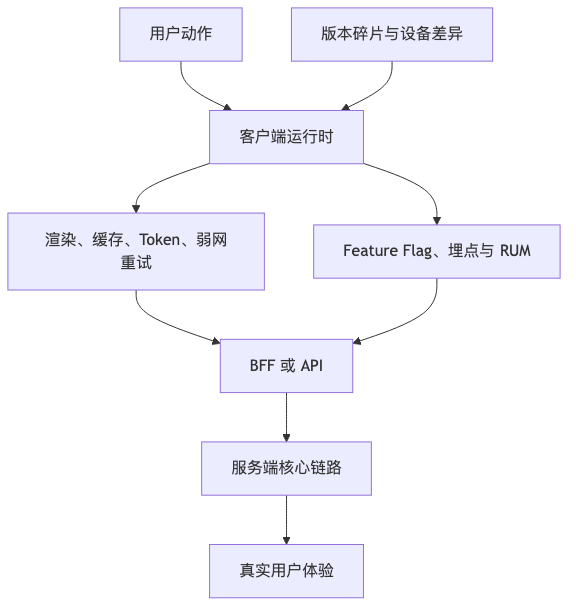

# 第三篇：互联网系统的核心路径

互联网系统的核心路径，不是某一段代码，也不是某一个数据库查询，而是一条从用户动作开始的链路：

```text
用户动作
  ↓
客户端 / 前端
  ↓
DNS / CDN / WAF / API Gateway
  ↓
API 契约
  ↓
同步服务调用
  ↓
数据库 / 缓存 / 第三方服务
  ↓
异步消息 / 事件流 / 后台任务
  ↓
通知、搜索、风控、推荐、审计、数据分析
```

小系统里，请求路径往往很短：浏览器发请求，后端处理，数据库落盘，返回结果。链路短、依赖少、流量低，即使设计粗糙，也不一定马上暴露问题。

大规模系统则不同。请求会穿过客户端缓存、边缘节点、安全设备、网关、多个服务、缓存、数据库、消息队列、第三方 API、异步消费者和数据平台。任何一个环节的延迟、失败、重试、配置错误、证书过期、缓存污染、接口变更，都可能沿链路放大成用户可见故障。

本篇关注五个问题：

1. **请求如何发起？**
2. **请求如何进入系统？**
3. **系统之间如何定义契约？**
4. **同步调用如何避免雪崩？**
5. **异步事件如何可靠流转？**

---

# 第 8 章：客户端、前端与用户体验系统

## 本章的问题链

先看原始问题：很多系统设计只盯着后端服务，却忘了用户真正接触的是客户端。弱网、版本碎片、缓存、权限过期、首屏加载、埋点丢失和灰度开关，都会让一个后端正常的系统在用户眼里不可用。

为了解决这个问题，本章把客户端和前端放回系统边界内，用 BFF、端上缓存、Feature Flag、RUM、Token 管理、兼容策略和体验指标来治理真实用户体验。

但这不是终点：客户端发出的请求并不会直接进入业务服务。新的问题是：请求到达系统核心之前，还要经过 DNS、CDN、WAF、API Gateway 等入口层，这些层同样会决定体验和可靠性。

所以本章会按“问题 -> 机制 -> 新问题”的顺序展开：先把眼前的工程压力说清楚，再看对应机制解决了什么，最后讨论它留下的边界和下一步。



## 1. 本章解决什么问题

很多后端工程师第一次做系统设计时，习惯从“服务端架构图”开始：API 服务、数据库、缓存、消息队列、对象存储。这个视角并不完整。真实的用户体验，从用户点击按钮之前就已经开始了：DNS 解析、资源加载、首屏渲染、登录态恢复、本地缓存读取、埋点采集、风控信号生成、弱网重试、失败提示、灰度开关判断，都可能影响最终体验。

客户端不是“展示层”。现代客户端承担了越来越多系统职责：

* 多端体验一致性。
* 本地缓存和离线能力。
* 弱网下的请求调度。
* Token 生命周期管理。
* Feature Flag 和 A/B 实验。
* 风控信号采集。
* 埋点和真实用户监控。
* 降级页面和兜底交互。
* API 聚合与数据预取。

尤其在移动端、小程序和桌面端场景里，客户端发布节奏慢、版本碎片多、网络环境不稳定、用户设备性能差异大。后端一次接口变更，可能在数月内持续影响老版本客户端。一个没有幂等设计的“提交订单”按钮，在弱网环境下可能被用户连点多次；一个没有兼容窗口的响应字段删除，可能让某个旧 App 版本直接崩溃；一个配置错误的 Feature Flag，可能让客户端把流量打到尚未准备好的后端接口。

因此，现代系统设计必须从用户体验路径开始，而不是只从服务端开始。

---

## 2. 问题背景：小系统里为什么不明显

小系统通常有几个特点：

```text
单一 Web 端
  ↓
同一个后端 API
  ↓
同一个数据库
```

此时很多问题不明显：

* 客户端版本少，接口变更可以同步上线。
* 用户网络环境相对可控，失败后刷新页面即可。
* 缓存层次少，不容易出现多级缓存不一致。
* 灰度范围小，即使出错也容易人工干预。
* 埋点不完整，也不影响基本业务判断。
* 安全模型简单，Token 管理和风控信号不复杂。

但系统增长后，客户端会变成一个复杂生态：

```text
Web
Mobile iOS
Mobile Android
Mini Program
Desktop App
Partner SDK
Open API Client
Internal Admin Console
```

不同客户端有不同发布节奏、运行环境、网络条件和安全风险。后端不能假设“所有调用方都按最新协议访问”。客户端也不能假设“每次请求都能成功、每个响应都可信、每个功能都必须完整可用”。

---

## 3. 大规模系统中的故障、成本和组织问题

客户端复杂度会以几种方式变成生产问题。

第一，**接口兼容性问题会长期存在**。Web 可以快速发布，但移动端 App 可能需要经过应用商店审核，企业桌面端可能依赖客户手动升级，小程序也有平台审核和缓存延迟。后端删除字段、修改枚举语义、改变错误码，都可能影响老版本客户端。

第二，**弱网会放大后端设计缺陷**。用户在地铁、电梯、跨境网络、会议 Wi-Fi 下提交请求时，可能遇到请求超时、响应丢失、重复发送。若服务端缺少幂等键，请求重试可能导致重复下单、重复扣费、重复发券。

第三，**客户端缓存会制造一致性问题**。商品价格、库存、优惠资格、会员权益、风控状态，很多数据不能只靠客户端缓存判断。客户端可以缓存展示数据，但最终决策必须由服务端确认。

第四，**灰度和实验会改变流量形态**。一个只对 1% 用户开放的新入口，可能因为客户端配置错误、实验分桶错误或缓存策略错误，瞬间放大成大面积流量。Feature Flag 降低了发布风险，也引入了配置债务、状态组合爆炸和排查难度。

第五，**埋点不是事后补充，而是反馈链路的一部分**。没有客户端埋点，就很难知道用户是否看到页面、是否点击按钮、是否在弱网中失败、是否因为前端错误而流失。Web Vitals 把 LCP、INP、CLS 作为核心体验指标，并建议用真实用户监控观测用户实际体验；TTFB 和 FCP 也常用于定位服务端响应、渲染阻塞等问题。([web.dev][1])

---

## 4. 核心概念

### 4.1 多端一致性

多端一致性不是要求所有客户端界面完全一样，而是要求核心业务语义一致。例如：

* 订单状态含义一致。
* 价格展示和支付金额一致。
* 权限判断一致。
* 风控拦截结果一致。
* 错误提示可理解。
* 关键操作可追踪。

常见做法是将业务决策放在服务端，客户端只做展示和交互。客户端可以缓存，但不能独自决定“是否允许支付”“是否扣减库存”“是否发放权益”。

### 4.2 BFF：Backend for Frontend

BFF 是为特定前端或客户端场景提供后端适配层的架构模式。它通常解决几个问题：

* 聚合多个后端服务，减少客户端多次请求。
* 针对移动端裁剪字段，减少流量。
* 屏蔽内部服务模型变化。
* 为不同端提供不同数据形态。
* 下沉部分体验逻辑，例如首屏数据拼装。

但 BFF 也会带来代价：

* 可能复制业务逻辑。
* 多端 BFF 容易语义不一致。
* BFF 可能变成“前端团队的后端单体”。
* 内部 API 变更仍需治理。
* 观测链路更长。

BFF 适合“不同客户端体验差异大、后端领域服务较稳定”的场景，不适合把所有业务规则都搬到适配层。

### 4.3 离线缓存与弱网处理

弱网不是简单的“请求失败”。它可能表现为：

* DNS 慢。
* TLS 握手慢。
* 首包慢。
* 上行慢。
* 下行慢。
* 请求已到达服务端，但响应丢失。
* 客户端认为失败，服务端已经成功。
* 用户反复点击按钮。
* App 切后台导致请求中断。

弱网设计要区分**可重试操作**和**不可随意重试操作**。查看商品详情可以重试；提交订单、支付确认、提现申请必须配合幂等键、状态查询和用户提示。

### 4.4 客户端 Feature Flag

客户端 Feature Flag 用于控制功能开关、实验分流、灰度发布和紧急降级。它的价值在于可以把“代码发布”和“功能开放”解耦。

但客户端 Flag 有特殊风险：

* 配置缓存导致关闭不及时。
* 老版本客户端不识别新 Flag。
* 多个 Flag 组合形成未测试状态。
* Flag 判断依赖用户属性，可能触发隐私和合规问题。
* 客户端 Flag 容易被逆向，不能作为安全边界。

### 4.5 客户端埋点与 RUM

客户端埋点至少包括三类：

| 类型   | 关注点    | 例子                  |
| ---- | ------ | ------------------- |
| 行为埋点 | 用户做了什么 | 点击、曝光、搜索、下单         |
| 性能埋点 | 用户体验如何 | 首屏时间、接口耗时、资源加载      |
| 错误埋点 | 哪里失败了  | JS 错误、App 崩溃、API 失败 |

真实用户监控，也就是 RUM，能帮助团队看到真实设备、真实网络、真实地理位置下的体验，而不是只看实验室环境。

### 4.6 客户端安全与 Token 管理

客户端是低信任环境。Token、设备 ID、本地缓存、离线数据、埋点数据，都可能被窃取或篡改。

基本原则：

* 不在客户端保存长期高权限密钥。
* Access Token 生命周期要短。
* Refresh Token 要有轮换和吊销机制。
* 关键操作需要服务端二次校验。
* 客户端风控信号只能作为辅助，不可作为唯一依据。
* 本地缓存敏感信息要最小化。
* 日志和崩溃上报不能携带明文敏感数据。

---

## 5. 典型架构方案

### 5.1 直接 API 模式

```text
Client
  ↓
API Gateway
  ↓
Backend Service
```

适合早期系统。优点是简单、链路短、排查容易。缺点是客户端可能直接感知后端领域模型，后端接口变化会影响多端。

### 5.2 BFF 模式

```text
Web App ─────→ Web BFF ───┐
Mobile App ──→ Mobile BFF ├──→ Domain Services
Mini App ────→ Mini BFF ──┘
```

适合多端体验差异明显的系统。BFF 聚合数据、裁剪字段、处理端侧适配。关键是避免 BFF 承载核心业务决策。

### 5.3 配置中心 + Feature Flag 模式

```text
Client
  ↓ 拉取配置
Feature Flag Service
  ↓
Client 根据配置展示功能、选择接口、触发实验
```

适合灰度和实验。但需要：

* 配置版本。
* 默认值。
* 回滚策略。
* 客户端缓存 TTL。
* 审计日志。
* 灰度范围控制。
* 紧急全局关闭能力。

### 5.4 离线优先模式

```text
Client UI
  ↓
Local Store
  ↓ 同步队列
Sync Engine
  ↓
Backend API
```

适合笔记、表单、协同办公、现场作业等场景。核心难点是冲突解决、重放、幂等、权限变化和删除同步。

---

## 6. 关键权衡

| 设计问题         | 方案 A    | 方案 B    | 权衡                     |
| ------------ | ------- | ------- | ---------------------- |
| 多端接口         | 共用 API  | 各端 BFF  | 共用简单但难适配；BFF 灵活但治理成本高  |
| 缓存策略         | 客户端强缓存  | 每次服务端确认 | 强缓存体验好但一致性弱；实时确认准确但慢   |
| 弱网重试         | 客户端自动重试 | 用户手动重试  | 自动体验好但需幂等；手动安全但体验差     |
| Feature Flag | 客户端判断   | 服务端判断   | 客户端响应快但不安全；服务端安全但多一次请求 |
| 埋点采集         | 全量上报    | 采样上报    | 全量精确但成本高；采样便宜但可能漏小流量问题 |
| 首屏加载         | 多接口并发   | BFF 聚合  | 并发灵活但网络开销大；聚合快但后端耦合上升  |

---

## 7. 失败模式

### 7.1 老版本客户端被后端破坏

后端删除字段或修改枚举语义，老版本客户端未适配，出现崩溃或错误展示。

**改进：**

* 字段只增不破坏。
* 删除字段前观察调用方。
* 服务端保留兼容窗口。
* 客户端容忍未知枚举。
* 用契约测试覆盖老版本请求。

### 7.2 弱网重复提交

用户点击“提交订单”，请求到达服务端，但响应丢失。客户端认为失败并重试，产生重复订单。

**改进：**

* 客户端生成幂等键。
* 服务端按用户、业务类型、幂等键去重。
* 客户端失败后优先查询提交状态。
* 按钮进入 pending 状态。
* 对支付类操作展示明确状态：“正在确认，请勿重复支付”。

### 7.3 Feature Flag 配置污染

错误配置让新功能暴露给所有用户，后端容量不足导致雪崩。

**改进：**

* Flag 变更需要审批和审计。
* 灰度比例上限逐步提升。
* 客户端有默认安全值。
* 后端仍要校验能力开关。
* 关键 Flag 纳入发布看板。

### 7.4 埋点缺失导致无法判断影响

用户反馈“页面打不开”，但团队只有后端 200 成功率，没有客户端失败率、首屏时间、JS 错误、App 崩溃数据。

**改进：**

* 客户端埋点和服务端 Trace ID 打通。
* 关键用户旅程设置漏斗指标。
* 性能指标按版本、地区、网络类型、设备分组。
* 发布前定义护栏指标。

---

## 8. 案例分析一：移动电商首页加载路径

### 8.1 用户是谁

* 普通消费者。
* 新用户、老用户、会员用户。
* 不同地区、不同网络、不同设备性能用户。

### 8.2 核心动作是什么

用户打开 App，希望快速看到首页内容，并能进入商品详情、搜索、购物车和活动页。

### 8.3 请求路径

```text
App 启动
  ↓
读取本地配置 / 本地缓存
  ↓
拉取 Feature Flag / 实验配置
  ↓
请求 Mobile BFF 首页接口
  ↓
BFF 聚合：
  ├─ 用户服务：会员状态
  ├─ 商品服务：推荐商品
  ├─ 营销服务：优惠活动
  ├─ 搜索/推荐：个性化排序
  └─ 风控服务：风险标签
  ↓
返回首页数据
  ↓
客户端渲染首屏
  ↓
曝光埋点 / 性能埋点 / 错误埋点
```

### 8.4 ASCII 架构图

```text
+-------------------+
|   Mobile App      |
| local cache       |
| feature flag      |
| RUM / analytics   |
+---------+---------+
          |
          v
+-------------------+        +--------------------+
|   Mobile BFF      |------->| Feature Flag Svc   |
| aggregation       |        +--------------------+
+----+-------+------+
     |       |
     |       +-----------------> Recommendation Svc
     |
     +-------------------------> Product Svc
     |
     +-------------------------> Promotion Svc
     |
     +-------------------------> User/Profile Svc
     |
     +-------------------------> Risk Svc
```

### 8.5 哪些链路必须强可靠

* 登录态恢复。
* 首页基础框架。
* 商品价格和库存进入交易链路前的服务端确认。
* 活动资格最终校验。
* 风控拦截。

### 8.6 哪些链路可以异步

* 曝光埋点。
* 首页性能上报。
* 推荐点击反馈。
* 非关键配置更新。
* 用户画像更新。

### 8.7 哪些链路可以降级

* 个性化推荐失败时展示热门商品。
* 营销服务失败时隐藏活动位。
* 风控信号采集失败时使用默认保守策略。
* 图片加载失败时展示占位图。
* Feature Flag 拉取失败时使用本地缓存配置。

### 8.8 容易被误判的地方

最容易误判的是把首页当成“一个接口”。首页实际上是用户体验系统：它包含资源加载、配置、缓存、服务聚合、推荐、营销、风控、埋点、降级。首页接口 99.9% 成功，并不等于用户首页体验 99.9% 成功。客户端可能因为 JS 错误、图片阻塞、弱网、设备卡顿而失败，这些问题在后端接口成功率里不可见。

---

## 9. 案例分析二：弱网下提交订单

### 9.1 错误设计

```text
用户点击提交订单
  ↓
客户端 POST /orders
  ↓
请求超时
  ↓
客户端自动重试 POST /orders
  ↓
服务端创建两笔订单
```

问题在于服务端把“收到一次请求”直接等价为“创建一次订单”。在不可靠网络下，客户端无法知道第一次请求是否已经成功。

### 9.2 改进设计

```text
客户端生成 idempotency_key
  ↓
POST /orders with idempotency_key
  ↓
服务端检查：
  - 同一用户
  - 同一业务动作
  - 同一幂等键
  ↓
若已处理，返回原结果
若处理中，返回处理中状态
若未处理，创建订单
  ↓
客户端超时后查询 /orders/status?idempotency_key=...
```

### 9.3 关键实践

* 幂等键由客户端生成，但服务端定义作用域。
* 幂等记录需要 TTL，但不能短于业务重试窗口。
* 请求体摘要应参与校验，避免同一个幂等键对应不同请求。
* 客户端失败后优先查询状态，而不是立即再次提交。
* UI 必须清楚表达“处理中”，避免用户反复点击。
* 支付、发券、扣库存等副作用要有独立幂等保护。

---

## 10. 可观测性与运维

客户端可观测性要把用户旅程串起来：

```text
client_trace_id
  ↓
gateway request_id
  ↓
backend trace_id
  ↓
message correlation_id
  ↓
analytics session_id
```

至少需要观察：

* App 版本。
* 操作系统版本。
* 设备型号。
* 网络类型。
* 地区。
* 页面加载阶段。
* API 成功率和耗时。
* 客户端错误。
* 崩溃率。
* 用户点击路径。
* Feature Flag 状态。
* 实验分组。
* Trace ID。

关键不是“采集所有数据”，而是能回答：

* 影响了哪些用户？
* 哪个版本开始变差？
* 是网络、客户端、网关、后端还是第三方问题？
* 新功能灰度是否导致指标恶化？
* 降级是否生效？

---

## 11. 安全、成本与治理影响

客户端侧设计还会影响安全和成本。

安全方面：

* 客户端不能保存长期敏感密钥。
* Token 刷新失败要避免死循环。
* 本地缓存要最小化敏感数据。
* 客户端参数必须服务端校验。
* Feature Flag 不能作为权限控制。
* 风控信号要防伪造、防重放。

成本方面：

* 首页接口字段过大，会增加带宽和 CDN 成本。
* 埋点全量上报会增加数据管道和存储成本。
* 客户端错误重试会放大后端流量。
* 图片资源未压缩会增加传输成本。
* 多端重复实现 BFF 会增加研发成本。

治理方面：

* 客户端 API 需要版本兼容策略。
* 埋点字段需要数据字典。
* Feature Flag 需要生命周期管理。
* 老版本客户端需要退役策略。
* 多端体验需要统一业务语义。

---

## 12. 设计 Checklist

### 前后端协作 API Checklist

* 是否明确支持哪些客户端和最低版本？
* 是否定义字段兼容策略？
* 是否允许客户端忽略未知字段？
* 枚举新增是否会破坏旧版本？
* 是否有错误码和用户提示映射？
* 写操作是否支持幂等键？
* 弱网超时后客户端应该查询还是重试？
* 是否定义客户端缓存 TTL？
* 服务端是否仍会校验价格、库存、权限、风控？
* 是否能通过 Trace ID 串联客户端和服务端？
* 埋点是否覆盖曝光、点击、失败、性能？
* Feature Flag 是否有默认值、回滚和审计？
* 老版本客户端如何退役？
* 敏感数据是否进入本地缓存、日志、崩溃上报？

---

## 13. 本章小结

客户端、前端和用户体验系统，是现代系统设计的第一段核心路径。它们不是服务端之后的附属层，而是系统可靠性、安全性、可观测性和成本模型的一部分。

好的客户端设计，不是把所有逻辑前移，而是明确哪些判断可以在客户端做，哪些必须由服务端最终确认；哪些数据可以缓存，哪些数据只能展示参考；哪些失败可以自动重试，哪些失败必须查询状态；哪些功能可以灰度，哪些开关不能成为安全边界。

从这一章开始，我们把系统设计的视角从“后端组件图”扩展为“用户旅程链路图”。

---

## 14. 典型失败模式

1. 后端破坏老版本客户端兼容性。
2. 弱网重试导致重复下单或重复扣费。
3. 客户端缓存展示过期价格、库存或权益。
4. Feature Flag 配置错误导致流量突增。
5. 埋点缺失导致无法判断真实用户影响。
6. Token 刷新死循环放大后端压力。
7. BFF 复制业务逻辑导致多端语义不一致。
8. 风控信号被客户端伪造。
9. 老版本客户端长期访问废弃接口。
10. 客户端降级只做了页面兜底，没有后端能力兜底。

---

## 15. 本章最重要的 5 个判断

1. **客户端不是展示层，而是用户体验链路、风险链路和观测链路的起点。**
2. **弱网环境下，写操作必须和幂等、状态查询、用户提示一起设计。**
3. **客户端缓存只能优化体验，不能替代服务端最终决策。**
4. **Feature Flag 降低发布风险，但必须治理生命周期、默认值、审计和组合复杂度。**
5. **没有客户端可观测性，就无法真正知道用户体验是否正常。**

---

[1]: https://web.dev/articles/vitals "Web Vitals  |  Articles  |  web.dev"
[2]: https://www.cloudflare.com/learning/cdn/glossary/anycast-network/ "What is Anycast? How does Anycast Work?"
[3]: https://developers.cloudflare.com/cache/ "Cloudflare Cache (CDN) docs"
[4]: https://developers.cloudflare.com/cache/how-to/purge-cache/ "Purge cache · Cloudflare Cache (CDN) docs"
[5]: https://developers.cloudflare.com/cache/how-to/purge-cache/purge-everything/ "Purge everything - Cache / CDN"
[6]: https://developers.cloudflare.com/waf/ "Overview · Cloudflare Web Application Firewall (WAF) docs"
[7]: https://developers.cloudflare.com/waf/rate-limiting-rules/ "Rate limiting rules · Cloudflare Web Application Firewall ..."
[8]: https://gateway-api.sigs.k8s.io/ "Gateway API - Kubernetes"
[9]: https://gateway-api.sigs.k8s.io/docs/concepts/security/ "Security | Gateway API"
[10]: https://gateway-api.sigs.k8s.io/guides/user-guides/http-routing/ "HTTP routing | Gateway API"
[11]: https://www.envoyproxy.io/docs/envoy/latest/intro/what_is_envoy "What is Envoy — envoy 1.39.0-dev-02aab4 documentation"
[12]: https://datatracker.ietf.org/doc/html/rfc9110 "RFC 9110 - HTTP Semantics"
[13]: https://spec.graphql.org/October2021/ "GraphQL"
[14]: https://grpc.io/ "gRPC"
[15]: https://protobuf.dev/programming-guides/proto3/ "Language Guide (proto 3) | Protocol Buffers Documentation"
[16]: https://spec.openapis.org/oas/v3.2.0.html "OpenAPI Specification v3.2.0"
[17]: https://www.asyncapi.com/docs/reference/specification/v3.0.0 "3.0.0 | AsyncAPI Initiative for event-driven APIs"
[18]: https://grpc.io/docs/guides/deadlines/ "Deadlines | gRPC"
[19]: https://aws.amazon.com/builders-library/timeouts-retries-and-backoff-with-jitter/ "Timeouts, retries and backoff with jitter"
[20]: https://grpc.io/docs/guides/retry/ "Retry | gRPC"
[21]: https://www.rabbitmq.com/ "RabbitMQ: One broker to queue them all | RabbitMQ"
[22]: https://kafka.apache.org/documentation/ "Introduction | Apache Kafka"
[23]: https://pulsar.apache.org/ "Apache Pulsar"
[24]: https://cloud.google.com/pubsub/docs/overview "What is Pub/Sub?  |  Google Cloud Documentation"
[25]: https://cloud.google.com/pubsub/docs/exactly-once-delivery "Exactly-once delivery  |  Pub/Sub  |  Google Cloud Documentation"
[26]: https://cloud.google.com/pubsub/docs/ordering "Order messages  |  Pub/Sub  |  Google Cloud Documentation"
