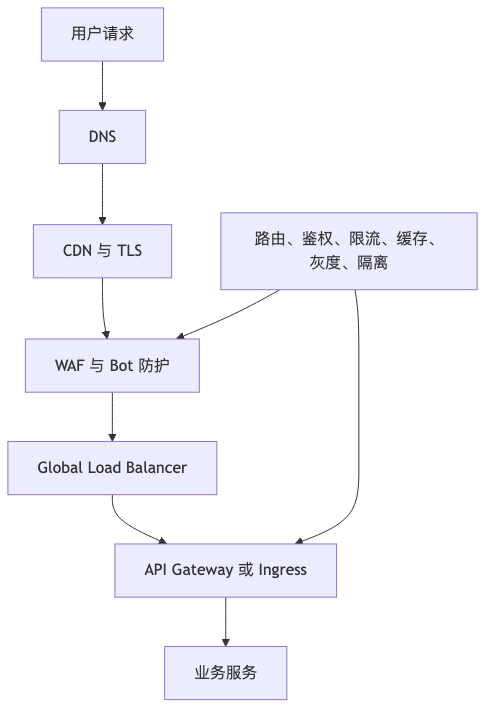

# 第 9 章：入口层：DNS、CDN、WAF、API Gateway

## 本章的问题链

先看原始问题：一次请求还没碰到业务代码，就可能已经被 DNS 解析、TLS、CDN 缓存、WAF 规则、网关路由、限流和鉴权影响。只设计后端服务，等于把系统入口这段高风险链路留给默认配置。

为了解决这个问题，本章把入口层当成独立的架构边界：它负责解析、加速、防护、路由、鉴权、限流、灰度、协议转换和故障隔离。

但这不是终点：入口层只能保护请求进入系统的第一段。新的问题是：请求进入后，不同服务之间如何用稳定、可演进、可兼容的 API 契约协作。

所以本章会按“问题 -> 机制 -> 新问题”的顺序展开：先把眼前的工程压力说清楚，再看对应机制解决了什么，最后讨论它留下的边界和下一步。



## 1. 本章解决什么问题

用户请求进入业务服务之前，通常已经经过多个入口系统：

```text
DNS
  ↓
CDN / Edge
  ↓
TLS
  ↓
WAF / Bot Protection / DDoS Protection
  ↓
Global Load Balancer
  ↓
API Gateway / Ingress
  ↓
Business Service
```

入口层是性能、安全、流量治理和故障隔离的第一道边界。很多全站事故并不是业务服务写坏了，而是 DNS 配置错误、证书过期、CDN 缓存污染、WAF 误杀、网关限流配置错误、Header 丢失、路由规则冲突、回源风暴造成的。

入口层的复杂性在于：它离用户最近，也离业务最远。它处理的是“所有请求”，但往往不理解具体业务语义。设计入口层时，必须清楚它适合承担哪些职责，不适合承担哪些职责。

---

## 2. 问题背景：小系统里为什么不明显

小系统入口通常很简单：

```text
用户
  ↓
域名
  ↓
Nginx
  ↓
Web 服务
```

配置少、规则少、证书少、域名少、租户少、地区少。即使入口配置出错，影响范围也有限。

系统变大后，入口层会扩展为：

* 多域名。
* 多业务线。
* 多租户。
* 多 Region。
* 多 CDN。
* 多套证书。
* 多网关集群。
* 多套鉴权规则。
* 多种客户端。
* 多个第三方回调入口。
* 管理后台入口。
* Open API 入口。
* 内部服务入口。

入口层从“反向代理”变成了“流量控制平面”。它的错误很容易影响全站。

---

## 3. 核心概念

### 3.1 DNS 与智能 DNS

DNS 负责把域名解析为 IP。它看似简单，但对可用性影响极大。

入口层 DNS 设计要考虑：

* TTL 设置。
* 多线路解析。
* 区域调度。
* 故障切换。
* 权威 DNS 高可用。
* 解析记录变更审计。
* 域名过期和劫持风险。
* 第三方 DNS 依赖风险。

DNS 的特殊性在于缓存广泛存在。你修改了一条记录，并不代表所有用户立即生效。TTL 太长会影响故障切换；TTL 太短会增加解析压力，也不保证所有递归解析器严格遵守预期。

### 3.2 Anycast

Anycast 通过让多个地理位置节点宣告同一个 IP，使用户请求被网络路由到较近或较合适的节点。它常用于 CDN、DNS 和 DDoS 防护。Anycast 能提升就近访问和抗流量冲击能力，但它依赖底层网络路由，排障时需要理解 BGP、运营商路径和区域性异常。Cloudflare 对 Anycast 的说明也强调了它在就近路由、网络拥塞和 DDoS 场景中的韧性价值。([Cloudflare][2])

### 3.3 CDN

CDN 的核心作用是把静态或可缓存内容放到靠近用户的边缘节点，降低延迟、减少回源压力。CDN 缓存可以用于图片、CSS、JS、视频、下载包，也可以用于部分 API 响应。

但 CDN 缓存不是简单的“加速”。它直接影响一致性、发布、回滚和安全。Cloudflare 文档中提供了缓存层级、缓存预留、刷新等能力；其缓存刷新文档也说明了可以按单文件、标签、主机名、前缀或全量方式清理缓存。([Cloudflare Docs][3]) ([Cloudflare Docs][4])

全量 Purge 看似方便，但会让新请求大量回源。Cloudflare 对“Purge everything”的说明也提醒，全量清理会清除所有资源，后续请求必须回源，重流量站点可能因此增加源站请求并拖慢站点。([Cloudflare Docs][5])

### 3.4 TLS 与证书管理

TLS 不只是“安全加密”。它还涉及：

* 证书申请。
* 自动续期。
* 私钥保护。
* SNI。
* TLS 版本策略。
* 加密套件。
* mTLS。
* 证书吊销。
* 证书链完整性。
* 多域名证书管理。
* 灰度切换。

证书过期是一类常见但低级的全站事故。大型系统必须把证书作为可观测、可审计、可自动续期的基础设施对象，而不是人工维护的配置文件。

### 3.5 WAF、Bot 防护与 DDoS 防护

WAF 用于防护常见 Web 攻击和异常流量，例如注入、路径扫描、恶意 User-Agent、异常请求速率等。Cloudflare WAF 提供自定义规则、速率限制、托管规则和安全事件分析等能力；其 Rate Limiting 文档也说明可以定义请求达到限制后的动作，用于防止登录爆破、API 滥用等场景。([Cloudflare Docs][6]) ([Cloudflare Docs][7])

但 WAF 和 Bot 防护可能误伤正常用户：

* 海外用户经过代理。
* 企业用户共享出口 IP。
* 移动网络 NAT 造成 IP 聚合。
* 无障碍工具行为像自动化脚本。
* 搜索引擎爬虫被误判。
* 合法合作方调用频率高。

入口层安全策略必须和业务指标联动，不能只看拦截量。

### 3.6 API Gateway 与 Ingress

API Gateway 通常承担：

* 路由。
* 鉴权。
* 限流。
* 请求改写。
* Header 透传。
* 协议转换。
* 灰度路由。
* 多租户隔离。
* 请求日志。
* Trace 注入。
* 基础安全策略。

在 Kubernetes 场景中，Ingress 曾长期承担 HTTP 入口角色；Gateway API 则提供更丰富的角色分离和路由表达能力。Gateway API 官方说明它是 Kubernetes 官方项目，关注 L4/L7 路由，旨在作为下一代 Ingress；它的核心资源包括 GatewayClass、Gateway 和 Routes，并提供跨命名空间引用的授权机制。([Gateway API][8]) ([Gateway API][9])

Gateway API 的 HTTPRoute 可以基于主机名、Header、路径等匹配 HTTP 流量并路由到后端，也支持如基于 Header 的金丝雀路由等模式。([Gateway API][10])

### 3.7 Envoy、Nginx 与云厂商网关

Nginx 常用于反向代理、静态资源、负载均衡和简单网关。Envoy 则是现代服务网格、边缘代理和高性能 L7 流量治理中常见的基础组件。Envoy 官方文档将其描述为 L7 代理和通信总线，支持 HTTP/2、gRPC、服务发现、动态配置、健康检查、负载均衡、重试、熔断、全局限流、流量镜像和追踪等能力。([Envoy Proxy][11])

云厂商 API Gateway 则通常提供托管入口、鉴权、限流、日志、监控、开发者门户、API Key、用量计划等能力。其优势是免运维，代价是平台锁定、扩展边界、调试复杂度和成本模型需要提前评估。

---

## 4. 典型入口层架构

### 4.1 电商系统入口层 ASCII 架构图

```text
                       +----------------------+
                       |      DNS Provider    |
                       | geo / weighted / TTL |
                       +----------+-----------+
                                  |
                                  v
+-----------+        +------------------------+
|  Browser  |------->| CDN / Edge Network     |
|  Mobile   |        | static cache / TLS     |
| Mini App  |        | edge rules / WAF       |
+-----------+        +-----------+------------+
                                  |
                         cache miss / API
                                  |
                                  v
                       +----------------------+
                       | Global LB / Anycast  |
                       +----------+-----------+
                                  |
                                  v
                       +----------------------+
                       | API Gateway / Ingress|
                       | auth / rate limit    |
                       | routing / trace id   |
                       +---+-------------+----+
                           |             |
             +-------------+             +--------------+
             v                                          v
      +--------------+                          +----------------+
      | User Service |                          | Order Service  |
      +--------------+                          +----------------+
             |                                          |
             v                                          v
      +--------------+                          +----------------+
      | Redis / DB   |                          | MQ / DB / Pay  |
      +--------------+                          +----------------+
```

### 4.2 多租户 SaaS 入口隔离

多租户 SaaS 常见入口方式：

```text
tenant-a.example.com
tenant-b.example.com
example.com/t/tenant-a
api.example.com with X-Tenant-ID
```

入口层要解决：

* 租户识别。
* 域名绑定。
* TLS 证书。
* 租户级限流。
* 租户级 WAF 规则。
* Header 防伪造。
* 管理后台隔离。
* 自定义域名回源。
* 租户迁移和灰度。

风险在于：入口层如果错误透传租户上下文，后端可能发生跨租户数据访问。租户 ID 不能只信任客户端 Header，必须由可信入口根据域名、证书、Token、路由规则解析并签名或注入内部上下文。

---

## 5. API Gateway 应该做什么，不应该做什么

### 5.1 应该做

* 统一认证入口。
* 基础授权前置，例如 Token 校验。
* 租户识别和可信上下文注入。
* 请求限流。
* 路由和灰度。
* 协议适配。
* Trace ID 注入。
* 请求大小限制。
* 常见攻击过滤。
* 统一访问日志。
* 熔断和快速失败。
* Header 规范化。
* 外部 API 用量统计。

### 5.2 不应该做

* 不应该承载复杂业务规则。
* 不应该直接访问多个业务数据库。
* 不应该隐藏所有服务错误。
* 不应该把鉴权全部做成网关配置，业务侧完全不校验。
* 不应该成为万能聚合层。
* 不应该把每个业务团队的特殊逻辑都塞进去。
* 不应该把网关当成数据转换中台。

网关的边界是“通用流量治理”和“入口安全”，不是“业务系统本身”。一旦网关承载过多业务逻辑，它会变成全公司最危险的单点复杂系统。

---

## 6. 网关层限流和业务层限流的区别

| 维度   | 网关层限流                  | 业务层限流             |
| ---- | ---------------------- | ----------------- |
| 关注对象 | IP、Token、租户、路径、API Key | 用户、账户、商品、订单、余额、库存 |
| 优点   | 靠前拦截，保护系统              | 理解业务语义，精细         |
| 缺点   | 不理解业务上下文               | 拦截位置较后，成本更高       |
| 适合场景 | 防爬、防爆破、API 配额          | 秒杀、支付、优惠券、提现      |
| 风险   | 误杀正常用户                 | 规则复杂，容易漏保护        |

正确做法通常是组合：

```text
入口层：粗粒度保护
业务层：细粒度保护
数据层：最终一致性和约束保护
```

---

## 7. 关键权衡

### 7.1 CDN 缓存一致性 vs 性能

缓存时间越长，命中率越高，源站压力越低，但内容更新越慢。商品图片、静态 JS、版本化资源适合长缓存；价格、库存、用户权益、购物车数量不适合直接强缓存。

### 7.2 WAF 严格度 vs 用户体验

安全规则越严格，攻击拦截率可能越高，但误杀正常用户概率也上升。入口安全策略不能只以“拦截量”为指标，还要看登录成功率、支付成功率、验证码触发率、客服投诉和转化率。

### 7.3 API Gateway 集中治理 vs 团队自治

集中网关便于统一安全、观测和限流，但容易成为发布瓶颈。多团队、多租户、多业务线场景下，要通过模板、准入规则、自助配置、审计和权限边界来治理，而不是让网关团队人工审批所有变更。

### 7.4 自建网关 vs 托管网关

自建灵活但需要强运维能力；托管省心但可能受限于厂商能力、费用和调试边界。关键问题不是“哪个更先进”，而是团队是否能承担 24 小时入口系统责任。

---

## 8. 复盘式案例：CDN 缓存导致线上事故

### 8.1 背景

某电商活动页使用 CDN 缓存 HTML，以降低源站压力。活动开始前，运营修改了活动规则，前端发布了新版页面，但旧 HTML 仍在部分边缘节点缓存。

### 8.2 事故过程

```text
10:00 活动开始
10:03 用户反馈优惠规则不一致
10:05 后端确认价格接口正常
10:10 前端确认主站 HTML 已发布
10:20 排查发现部分 CDN 节点仍返回旧 HTML
10:25 运维执行全量 Purge
10:27 源站流量突增 8 倍
10:30 源站开始 5xx
10:40 临时扩容 + 回滚部分页面
```

### 8.3 根因

* HTML 被错误设置为长缓存。
* 发布流程未包含 CDN 预热和精准刷新。
* 页面资源没有版本化。
* 全量 Purge 触发回源风暴。
* 活动页缺少灰度验证。
* 源站没有为全量回源做限流和静态兜底。

### 8.4 改进

* HTML 短缓存，静态资源版本化长缓存。
* 使用文件级或标签级精准刷新，避免全量 Purge。
* 发布后按区域抽样验证 CDN 内容。
* 活动前预热关键资源。
* 源站为回源设置保护限流。
* 活动规则由服务端接口返回，不固化在 HTML。
* CDN 配置进入 IaC 和变更审计。

---

## 9. 入口层故障演练清单

入口层故障演练不能只测业务服务重启。至少应覆盖：

* DNS 解析失败。
* DNS 切换延迟。
* 单 CDN 厂商不可用。
* 某区域 CDN 命中异常。
* 证书即将过期。
* TLS 握手失败。
* WAF 规则误杀登录请求。
* Bot 策略误杀搜索引擎。
* API Gateway 配置错误。
* 网关限流阈值过低。
* Header 丢失导致 Trace 中断。
* 回源流量突增。
* 多租户域名解析错误。
* 第三方回调入口异常。
* 管理后台入口被攻击。
* 网关日志采集失败。

每次演练都要验证：

```text
能否发现？
能否定位？
能否切流？
能否回滚？
能否降级？
能否通知用户和业务方？
```

---

## 10. 生产实践

### 10.1 DNS

* 核心域名使用多权威 DNS 或至少有迁移预案。
* TTL 根据切换需求设置，不要盲目极低。
* 域名、证书、解析记录纳入资产管理。
* DNS 变更必须有审批、审计和回滚方案。
* 定期从多地区、多运营商探测解析结果。

### 10.2 CDN

* 静态资源使用内容哈希版本。
* HTML 和 API 响应谨慎缓存。
* 明确 Cache-Control、ETag、Vary 等策略。
* 关键发布流程包含 CDN 刷新和预热。
* 避免活动开始时全量 Purge。
* 监控命中率、回源率、边缘错误率、区域延迟。
* 区分用户态内容和公共内容，避免缓存泄漏。

### 10.3 WAF 与 Bot 防护

* 防护规则先观察再阻断。
* 关键链路规则灰度发布。
* 对企业出口 IP、合作方、搜索引擎做合理识别。
* 拦截日志要能关联业务请求。
* 安全指标和转化指标一起看。
* 高风险动作增加服务端风控，而不是只依赖 WAF。

### 10.4 API Gateway

* 网关配置代码化。
* 路由规则有优先级测试。
* 鉴权、限流、路由、Header 透传要有自动化验证。
* 网关注入 Trace ID。
* 错误响应区分认证失败、限流、上游失败、网关错误。
* 配置变更支持灰度和回滚。
* 多租户入口上下文由可信入口生成。

---

## 11. API Gateway 能力边界 Checklist

* 是否只做入口通用能力，而非复杂业务规则？
* 是否定义认证、租户识别、路由、限流的责任边界？
* 是否保留业务服务的二次权限校验？
* 是否有网关配置审计？
* 是否能按 API、租户、Token、IP 维度限流？
* 是否支持灰度路由和快速回滚？
* 是否透传或生成 Trace ID？
* 是否限制请求体大小？
* 是否规范 Header 透传和覆盖规则？
* 是否支持多版本 API 路由？
* 是否能区分 4xx、5xx、网关错误、上游错误？
* 是否避免网关聚合复杂业务数据？
* 是否有网关过载保护？
* 是否演练过网关实例故障和配置错误？
* 是否有多租户入口隔离策略？

---

## 12. 本章小结

入口层决定了请求进入系统的第一道边界。DNS 决定用户能否找到你，CDN 决定用户能否快速获取内容，WAF 和 Bot 防护决定恶意流量是否被挡在外面，API Gateway 决定流量如何被认证、限流、路由和观测。

入口层的危险在于它影响面极大，却往往被当成“基础设施配置”。成熟系统必须把入口层作为架构的一部分进行设计、评审、变更管理、演练和观测。

---

## 13. 典型失败模式

1. DNS 配置错误导致全站不可达。
2. DNS TTL 过长导致故障切换不生效。
3. 证书过期导致 TLS 握手失败。
4. CDN 缓存旧资源导致发布不一致。
5. 全量 Purge 造成回源风暴。
6. WAF 规则误杀正常用户。
7. Bot 防护误伤企业客户或搜索引擎。
8. 网关限流配置过低导致核心接口不可用。
9. Header 丢失导致鉴权、租户识别或 Trace 中断。
10. 多租户入口解析错误导致越权访问。

---

## 14. 本章最重要的 5 个判断

1. **入口层不是简单代理，而是性能、安全、治理和故障隔离的第一道系统边界。**
2. **DNS、证书、CDN 配置都应该像代码一样被管理、审计和演练。**
3. **CDN 缓存提升性能，但也会影响一致性、发布和回滚。**
4. **API Gateway 适合做通用流量治理，不适合承载复杂业务逻辑。**
5. **入口层安全策略必须同时看安全效果和正常用户体验。**

---

[1]: https://web.dev/articles/vitals "Web Vitals  |  Articles  |  web.dev"
[2]: https://www.cloudflare.com/learning/cdn/glossary/anycast-network/ "What is Anycast? How does Anycast Work?"
[3]: https://developers.cloudflare.com/cache/ "Cloudflare Cache (CDN) docs"
[4]: https://developers.cloudflare.com/cache/how-to/purge-cache/ "Purge cache · Cloudflare Cache (CDN) docs"
[5]: https://developers.cloudflare.com/cache/how-to/purge-cache/purge-everything/ "Purge everything - Cache / CDN"
[6]: https://developers.cloudflare.com/waf/ "Overview · Cloudflare Web Application Firewall (WAF) docs"
[7]: https://developers.cloudflare.com/waf/rate-limiting-rules/ "Rate limiting rules · Cloudflare Web Application Firewall ..."
[8]: https://gateway-api.sigs.k8s.io/ "Gateway API - Kubernetes"
[9]: https://gateway-api.sigs.k8s.io/docs/concepts/security/ "Security | Gateway API"
[10]: https://gateway-api.sigs.k8s.io/guides/user-guides/http-routing/ "HTTP routing | Gateway API"
[11]: https://www.envoyproxy.io/docs/envoy/latest/intro/what_is_envoy "What is Envoy — envoy 1.39.0-dev-02aab4 documentation"
[12]: https://datatracker.ietf.org/doc/html/rfc9110 "RFC 9110 - HTTP Semantics"
[13]: https://spec.graphql.org/October2021/ "GraphQL"
[14]: https://grpc.io/ "gRPC"
[15]: https://protobuf.dev/programming-guides/proto3/ "Language Guide (proto 3) | Protocol Buffers Documentation"
[16]: https://spec.openapis.org/oas/v3.2.0.html "OpenAPI Specification v3.2.0"
[17]: https://www.asyncapi.com/docs/reference/specification/v3.0.0 "3.0.0 | AsyncAPI Initiative for event-driven APIs"
[18]: https://grpc.io/docs/guides/deadlines/ "Deadlines | gRPC"
[19]: https://aws.amazon.com/builders-library/timeouts-retries-and-backoff-with-jitter/ "Timeouts, retries and backoff with jitter"
[20]: https://grpc.io/docs/guides/retry/ "Retry | gRPC"
[21]: https://www.rabbitmq.com/ "RabbitMQ: One broker to queue them all | RabbitMQ"
[22]: https://kafka.apache.org/documentation/ "Introduction | Apache Kafka"
[23]: https://pulsar.apache.org/ "Apache Pulsar"
[24]: https://cloud.google.com/pubsub/docs/overview "What is Pub/Sub?  |  Google Cloud Documentation"
[25]: https://cloud.google.com/pubsub/docs/exactly-once-delivery "Exactly-once delivery  |  Pub/Sub  |  Google Cloud Documentation"
[26]: https://cloud.google.com/pubsub/docs/ordering "Order messages  |  Pub/Sub  |  Google Cloud Documentation"
