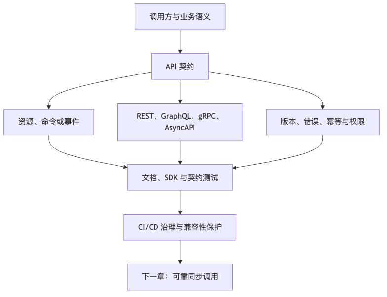

# 第 10 章：API 设计：REST、GraphQL、gRPC 与契约治理

## 本章的问题链

先看原始问题：接口如果只是为了眼前调用写出来，短期能跑，长期会被版本兼容、错误语义、字段膨胀、幂等、权限和调用方依赖拖住。API 会从“连接点”变成“变更阻力”。

为了解决这个问题，本章从 REST、GraphQL、gRPC、OpenAPI、AsyncAPI、版本策略、错误模型和幂等键出发，把 API 当成跨团队、跨系统长期协作的契约来治理。

但这不是终点：契约清楚并不代表调用可靠。新的问题是：同步调用链一旦变长，下游的慢、挂、抖动和重试风暴会怎样传回上游。

所以本章会按“问题 -> 机制 -> 新问题”的顺序展开：先把眼前的工程压力说清楚，再看对应机制解决了什么，最后讨论它留下的边界和下一步。



## 1. 本章解决什么问题

API 是系统之间的契约。它不只是 URL、字段名和状态码，而是多个团队、多个服务、多个客户端之间关于数据、行为、错误、兼容性、安全和演进的约定。

一个 API 一旦被多个调用方使用，就不再只是服务提供方的内部实现。它会进入客户端版本、合作方系统、文档、SDK、监控、测试、审计和合规流程。修改一个字段，可能影响数百万旧客户端；删除一个枚举，可能让合作方系统处理失败；改变错误码，可能让调用方误判重试策略。

好的 API 设计要回答：

* 这个 API 表达的是资源、命令还是事件？
* 谁是调用方？
* 调用方需要什么语义？
* 请求是否幂等？
* 错误是否可诊断？
* 如何分页、排序、过滤？
* 如何演进版本？
* 如何进入 CI/CD？
* 如何保护兼容性？
* 如何观测调用关系？

---

## 2. 小系统里为什么不明显

小系统中，API 调用方少，通常前后端坐在一起。接口变了，前端同步修改即可。错误码粗糙，也能靠人工沟通解决。

大系统中，API 调用方可能包括：

* Web 前端。
* iOS App。
* Android App。
* 小程序。
* 内部服务。
* 合作方系统。
* 数据平台。
* 自动化脚本。
* SDK。
* AI Agent 工具调用。
* 第三方开发者。

这些调用方不可能同时升级。API 一旦发布，就进入长期维护周期。因此 API 设计的核心不是“今天能不能跑”，而是“未来能否演进”。

---

## 3. 核心概念

### 3.1 REST 与资源建模

REST 风格 API 通常围绕资源建模，使用 HTTP 方法表达操作意图：

```text
GET    /orders/{order_id}
POST   /orders
PATCH  /orders/{order_id}
DELETE /orders/{order_id}
```

HTTP 本身是应用层协议，RFC 9110 定义了 HTTP 的核心语义和术语，包括方法、状态码、字段等基础元素。([datatracker.ietf.org][12])

REST 的优势是简单、通用、适合开放 API 和面向资源的系统。它的挑战是复杂查询、批量操作、跨资源聚合和实时订阅表达不够自然。

### 3.2 GraphQL

GraphQL 的核心是客户端声明需要的数据结构，由服务端按 Schema 执行查询。GraphQL 规范强调它是面向客户端需求的查询语言，不绑定特定编程语言或存储系统，并具有层次化、强类型、客户端指定响应和自省等特点。([spec.graphql.org][13])

GraphQL 适合：

* 多端字段需求差异大。
* 前端频繁迭代。
* 需要减少 over-fetching 和 under-fetching。
* 有统一 Schema 治理能力的组织。

GraphQL 的代价：

* 查询复杂度控制困难。
* 缓存比 REST 更复杂。
* N+1 查询风险。
* 权限控制要深入字段级。
* 可观测性和限流不能只按 URL。
* Schema 演进需要治理。

### 3.3 gRPC 与 Protobuf

gRPC 是高性能 RPC 框架，常用 Protocol Buffers 定义服务和消息，支持多语言 Stub、双向流和 HTTP/2 传输。gRPC 官方文档也说明它支持负载均衡、追踪、健康检查、认证等能力。([gRPC][14])

Protobuf 的关键是强类型 Schema 和字段编号。官方 proto3 指南强调字段编号一旦使用不应改变，且不应复用字段编号；gRPC 也能基于 `.proto` 服务定义生成 RPC 代码。([protobuf.dev][15])

gRPC 适合：

* 内部服务间高性能调用。
* 强类型多语言系统。
* 低延迟 RPC。
* 流式传输。
* 明确服务契约的后端系统。

代价：

* 浏览器直接调用不如 HTTP/JSON 自然。
* Debug 门槛比 REST 高。
* Schema 版本治理严格。
* 需要处理 Deadline、重试、负载均衡等 RPC 细节。
* 外部开放生态不如 REST 普遍。

### 3.4 OpenAPI

OpenAPI 是 HTTP API 的机器可读描述规范。OpenAPI Specification 3.2.0 说明，它定义了一种语言无关的标准接口描述方式，使人和计算机无需访问源码、文档或抓包即可理解服务能力，也可用于文档、代码生成和测试等场景。([OpenAPI Initiative Publications][16])

OpenAPI 不会自动保证 API 好，但能让契约进入工具链。

### 3.5 AsyncAPI

AsyncAPI 用于描述消息驱动 API。AsyncAPI 3.0.0 规范说明，它提供协议无关的机器可读描述方式，可覆盖 Kafka、AMQP、MQTT、WebSocket、Google Pub/Sub、Pulsar 等消息通信场景，并描述消息、Channel、协议绑定等结构。([asyncapi.com][17])

REST/OpenAPI 解决同步 HTTP 契约；AsyncAPI 解决异步事件契约。两者在现代系统中经常同时存在。

### 3.6 Schema Registry

Schema Registry 用于集中管理消息或数据 Schema，例如 Avro、Protobuf、JSON Schema。它解决的问题是：

* 事件结构版本管理。
* Producer 和 Consumer 兼容性校验。
* 防止破坏性字段变更。
* 追踪谁在生产和消费某个事件。
* 支持回放和审计。

### 3.7 Consumer-driven Contract Test

消费者驱动契约测试的核心思想是：API 提供方不能只按自己的测试通过，还要验证真实消费者依赖的契约是否仍然满足。它适合多服务、多团队协作，但需要治理测试数据、消费者契约生命周期和 CI 集成。

---

## 4. REST、GraphQL、gRPC 选择表

| 维度   | REST             | GraphQL         | gRPC              |
| ---- | ---------------- | --------------- | ----------------- |
| 主要抽象 | 资源               | Schema + Query  | 服务 + 方法           |
| 常见协议 | HTTP/JSON        | HTTP/JSON       | HTTP/2 + Protobuf |
| 适合场景 | 开放 API、CRUD、资源系统 | 多端聚合、字段差异大      | 内部高性能 RPC         |
| 缓存   | HTTP 缓存友好        | 复杂，需要额外设计       | 通常靠客户端/服务端策略      |
| 调试   | 容易               | 中等              | 相对较难              |
| 类型约束 | 中等               | 强               | 强                 |
| 版本治理 | URL/Header/兼容演进  | Schema 演进       | proto 字段规则        |
| 限流维度 | 路径、用户、Token      | Query 复杂度、字段、用户 | 方法、调用方            |
| 风险   | 资源建模粗糙           | 查询爆炸、N+1        | Deadline、连接、代理复杂  |
| 对外开放 | 很适合              | 适合有生态治理时        | 需评估调用方能力          |

---

## 5. API Versioning 为什么难

很多团队以为版本化就是：

```text
/v1/orders
/v2/orders
```

但真正困难的是：

* 多个版本要并行多久？
* 老版本谁负责维护？
* 数据模型变化如何映射？
* 新旧版本错误语义是否一致？
* 客户端如何迁移？
* 合作方是否有升级 SLA？
* 监控如何按版本拆分？
* 文档、SDK、测试如何同步？
* 废弃版本如何通知和下线？

版本号不能替代兼容性设计。常见原则是：

* 优先做向后兼容演进。
* 增加字段比删除字段安全。
* 新增枚举要考虑旧客户端容忍能力。
* 修改字段语义比新增字段更危险。
* 删除字段前必须观测调用方。
* 外部 API 下线必须有公告、窗口期和迁移指南。

---

## 6. 如何设计幂等接口

幂等不是“多次调用结果完全一样”这么简单。工程上要看副作用。

### 6.1 适合幂等的场景

* 创建订单。
* 提交支付。
* 发放优惠券。
* 提交提现申请。
* 创建工单。
* 发送消息。
* AI Agent 执行工具操作。

### 6.2 幂等键设计

```http
POST /orders
Idempotency-Key: 7f3c1b3e-xxxx

{
  "cart_id": "cart_123",
  "address_id": "addr_456",
  "coupon_id": "coupon_789"
}
```

服务端记录：

```text
user_id
business_type
idempotency_key
request_hash
status: PROCESSING / SUCCESS / FAILED
result_reference
created_at
expires_at
```

### 6.3 注意点

* 幂等作用域必须明确。
* 同一幂等键对应不同请求体应拒绝。
* 处理中状态不能误判为失败。
* 失败是否可重试要按业务定义。
* 幂等记录 TTL 要覆盖客户端重试窗口。
* 幂等结果可能需要脱敏返回。
* 幂等表本身要防热点。

---

## 7. API 错误码应该服务诊断

错误码不是装饰。好的错误响应至少包含：

```json
{
  "error": {
    "code": "ORDER_INVENTORY_NOT_ENOUGH",
    "message": "商品库存不足",
    "request_id": "req_123",
    "retryable": false,
    "details": {
      "sku_id": "sku_456"
    }
  }
}
```

错误语义应区分：

* 参数错误。
* 认证失败。
* 授权失败。
* 资源不存在。
* 状态冲突。
* 限流。
* 幂等冲突。
* 下游超时。
* 第三方失败。
* 系统内部错误。
* 可重试失败。
* 不可重试失败。

调用方最关心的是：**是否应该重试？是否应该提示用户？是否应该降级？是否应该联系人工？**

---

## 8. 订单创建 API 设计过程

### 8.1 业务目标

用户从购物车提交订单，系统创建待支付订单，锁定库存，计算价格，应用优惠，并返回支付参数或待支付状态。

### 8.2 约束

* 不能重复创建订单。
* 价格必须由服务端计算。
* 库存要防超卖。
* 优惠资格要最终校验。
* 支付不能在订单未成功创建前发起。
* 客户端弱网下可恢复。
* API 要支持移动端、小程序和 Web。
* 关键链路可观测。

### 8.3 错误 API 设计

```http
POST /createOrder

{
  "userId": "u1",
  "skuId": "s1",
  "price": 99,
  "couponAmount": 20
}
```

问题：

* 路径是动作名，不表达资源。
* 用户 ID 来自客户端，容易伪造。
* 价格和优惠金额来自客户端，不可信。
* 没有幂等键。
* 不支持购物车多商品。
* 错误语义不明确。
* 无请求 ID。
* 无版本兼容策略。

### 8.4 改进 API

```http
POST /v1/orders
Authorization: Bearer <token>
Idempotency-Key: 2e21f0c8-...

{
  "cart_id": "cart_123",
  "address_id": "addr_456",
  "coupon_ids": ["coupon_1"],
  "client_context": {
    "platform": "ios",
    "app_version": "8.4.1"
  }
}
```

响应：

```json
{
  "order_id": "ord_123",
  "status": "PENDING_PAYMENT",
  "amount": {
    "currency": "CNY",
    "payable": "79.00",
    "original": "99.00"
  },
  "expires_at": "2026-06-06T12:30:00+09:00",
  "payment": {
    "payment_session_id": "pay_sess_456"
  }
}
```

错误示例：

```json
{
  "error": {
    "code": "ORDER_PRICE_CHANGED",
    "message": "商品价格发生变化，请确认后重新提交",
    "request_id": "req_abc",
    "retryable": false
  }
}
```

### 8.5 API 背后的链路

```text
Client
  ↓ POST /v1/orders
API Gateway
  ↓ auth / rate limit / trace
Order Service
  ├─ Cart Service
  ├─ Pricing Service
  ├─ Promotion Service
  ├─ Inventory Service
  └─ Payment Service
  ↓
Order DB
  ↓
OrderCreated Event
```

---

## 9. API 契约如何进入 CI/CD

成熟 API 治理不是靠人工记忆，而是进入交付流水线：

```text
代码变更
  ↓
生成 OpenAPI / proto / AsyncAPI
  ↓
兼容性检查
  ↓
契约测试
  ↓
Mock / SDK / 文档生成
  ↓
消费者测试
  ↓
灰度发布
  ↓
线上契约观测
```

应检查：

* 是否删除字段。
* 是否改变字段类型。
* 是否修改必填字段。
* 是否改变枚举含义。
* 是否新增未文档化错误码。
* 是否改变 HTTP 状态码。
* 是否破坏 proto 字段编号规则。
* 是否破坏事件 Schema。
* 是否影响已知消费者。

---

## 10. 内部 API 和外部 API 的治理差异

| 维度   | 内部 API    | 外部 API              |
| ---- | --------- | ------------------- |
| 调用方  | 公司内部服务    | 合作方、开发者、客户          |
| 变更沟通 | 相对可控      | 需要公告和迁移窗口           |
| 安全   | 服务身份、内部权限 | OAuth/API Key/签名/配额 |
| 文档   | 可结合服务目录   | 必须稳定、完整、可自助         |
| 版本兼容 | 可强制迁移     | 兼容期更长               |
| 可观测性 | 调用图、Trace | 用量、错误、租户、开发者        |
| 失败影响 | 内部系统      | 客户业务和合同责任           |
| 测试   | 契约测试、集成测试 | SDK、沙箱、兼容测试         |

---

## 11. API 兼容性 Checklist

* 是否新增字段而非修改字段语义？
* 新字段是否可选？
* 是否删除了调用方可能依赖的字段？
* 枚举新增是否被旧客户端容忍？
* 错误码变化是否影响调用方重试？
* HTTP 状态码是否仍符合语义？
* 分页默认值和最大值是否明确？
* 排序字段是否稳定？
* 过滤条件是否有索引支撑？
* 批量接口是否有单项错误表达？
* 写接口是否支持幂等键？
* 是否有重放保护？
* 是否有请求签名或 Token 机制？
* API 文档是否和实现一致？
* OpenAPI/proto/AsyncAPI 是否进入 CI？
* 是否有消费者驱动契约测试？
* 是否能按版本观测流量？
* 是否定义弃用和下线策略？

---

## 12. 本章小结

API 是系统之间最重要的边界之一。REST、GraphQL、gRPC 不是谁取代谁，而是分别适合不同通信模型。REST 适合资源和开放生态，GraphQL 适合多端数据需求差异，gRPC 适合内部强类型高性能 RPC。

API 设计的难点不在“路径命名”，而在兼容性、错误语义、幂等、版本演进、安全和契约治理。一个 API 一旦发布，就进入生命周期管理，而不是一次性代码实现。

---

## 13. 典型失败模式

1. 删除字段导致旧客户端崩溃。
2. 修改枚举语义导致调用方误判状态。
3. POST 创建接口无幂等导致重复业务操作。
4. 错误码过于泛化导致调用方错误重试。
5. GraphQL 查询复杂度失控拖垮后端。
6. gRPC 未设置 Deadline 导致调用堆积。
7. OpenAPI 文档和实现不一致。
8. 事件 Schema 直接暴露数据库表结构。
9. 内部 API 当外部 API 开放，缺少安全和版本策略。
10. API 版本长期并存，无下线机制。

---

## 14. 本章最重要的 5 个判断

1. **API 是契约，不是函数调用的网络版本。**
2. **版本号不能替代兼容性设计，兼容性需要进入 CI/CD。**
3. **写接口必须把幂等、错误语义和重试策略一起设计。**
4. **REST、GraphQL、gRPC 的选择取决于调用关系、生态和治理能力。**
5. **API 文档不是交付物的附属品，而是系统契约的一部分。**

---

[1]: https://web.dev/articles/vitals "Web Vitals  |  Articles  |  web.dev"
[2]: https://www.cloudflare.com/learning/cdn/glossary/anycast-network/ "What is Anycast? How does Anycast Work?"
[3]: https://developers.cloudflare.com/cache/ "Cloudflare Cache (CDN) docs"
[4]: https://developers.cloudflare.com/cache/how-to/purge-cache/ "Purge cache · Cloudflare Cache (CDN) docs"
[5]: https://developers.cloudflare.com/cache/how-to/purge-cache/purge-everything/ "Purge everything - Cache / CDN"
[6]: https://developers.cloudflare.com/waf/ "Overview · Cloudflare Web Application Firewall (WAF) docs"
[7]: https://developers.cloudflare.com/waf/rate-limiting-rules/ "Rate limiting rules · Cloudflare Web Application Firewall ..."
[8]: https://gateway-api.sigs.k8s.io/ "Gateway API - Kubernetes"
[9]: https://gateway-api.sigs.k8s.io/docs/concepts/security/ "Security | Gateway API"
[10]: https://gateway-api.sigs.k8s.io/guides/user-guides/http-routing/ "HTTP routing | Gateway API"
[11]: https://www.envoyproxy.io/docs/envoy/latest/intro/what_is_envoy "What is Envoy — envoy 1.39.0-dev-02aab4 documentation"
[12]: https://datatracker.ietf.org/doc/html/rfc9110 "RFC 9110 - HTTP Semantics"
[13]: https://spec.graphql.org/October2021/ "GraphQL"
[14]: https://grpc.io/ "gRPC"
[15]: https://protobuf.dev/programming-guides/proto3/ "Language Guide (proto 3) | Protocol Buffers Documentation"
[16]: https://spec.openapis.org/oas/v3.2.0.html "OpenAPI Specification v3.2.0"
[17]: https://www.asyncapi.com/docs/reference/specification/v3.0.0 "3.0.0 | AsyncAPI Initiative for event-driven APIs"
[18]: https://grpc.io/docs/guides/deadlines/ "Deadlines | gRPC"
[19]: https://aws.amazon.com/builders-library/timeouts-retries-and-backoff-with-jitter/ "Timeouts, retries and backoff with jitter"
[20]: https://grpc.io/docs/guides/retry/ "Retry | gRPC"
[21]: https://www.rabbitmq.com/ "RabbitMQ: One broker to queue them all | RabbitMQ"
[22]: https://kafka.apache.org/documentation/ "Introduction | Apache Kafka"
[23]: https://pulsar.apache.org/ "Apache Pulsar"
[24]: https://cloud.google.com/pubsub/docs/overview "What is Pub/Sub?  |  Google Cloud Documentation"
[25]: https://cloud.google.com/pubsub/docs/exactly-once-delivery "Exactly-once delivery  |  Pub/Sub  |  Google Cloud Documentation"
[26]: https://cloud.google.com/pubsub/docs/ordering "Order messages  |  Pub/Sub  |  Google Cloud Documentation"
