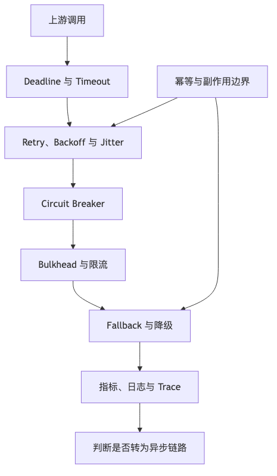

# 第 11 章：同步通信与可靠调用

## 本章的问题链

先看原始问题：同步调用最直观，也最容易把系统变脆：一个接口等待另一个接口，另一个接口再等待第三个接口，下游的慢请求会被上游放大，最终变成级联超时或雪崩。

为了解决这个问题，本章用 timeout、deadline、retry、backoff、jitter、circuit breaker、bulkhead、fallback 和限流，控制同步调用中的等待、重试和故障传播。

但这不是终点：不是所有工作都应该在同步链路里完成。新的问题是：对于不需要立即完成、但必须可靠完成的动作，系统需要转向异步通信和事件驱动。

所以本章会按“问题 -> 机制 -> 新问题”的顺序展开：先把眼前的工程压力说清楚，再看对应机制解决了什么，最后讨论它留下的边界和下一步。



## 1. 本章解决什么问题

同步调用看起来简单：

```text
A 调 B
B 返回
A 继续
```

但在分布式系统里，这条链路充满不确定性：

* 网络可能慢。
* 下游可能过载。
* 请求可能到达但响应丢失。
* 调用方可能超时。
* 被调方可能仍在执行。
* 重试可能导致重复副作用。
* 多层重试可能放大流量。
* 慢调用可能占满线程池。
* 下游故障可能拖垮上游。
* 调用链过长导致尾延迟恶化。

同步通信的核心问题是：**如何在必须等待结果的情况下，把失败限制在可控范围内。**

---

## 2. 小系统里为什么不明显

小系统服务少，调用链短：

```text
Web Service
  ↓
Database
```

即使没有超时、没有重试策略、没有熔断，故障也可能只是请求慢一点。

大系统调用链可能是：

```text
API Gateway
  ↓
Order Service
  ↓
Pricing Service
  ↓
Promotion Service
  ↓
Inventory Service
  ↓
Payment Service
  ↓
Third-party Payment API
```

每一层都可能超时、重试、排队。链路越长，整体成功率和尾延迟越难控制。

---

## 3. 核心概念

### 3.1 Timeout

没有超时的远程调用，是最危险的调用之一。调用方无法无限等待下游。gRPC 官方文档也明确说明，默认情况下 gRPC 不设置 Deadline；客户端应该显式设置符合业务场景的 Deadline。([gRPC][18])

超时不是随便写一个数字。AWS Builders Library 建议基于下游延迟分布、可接受误超时率和网络条件设置超时，并提醒超时过高会拖慢故障恢复，超时过低会导致正常请求被误判失败。([Amazon Web Services, Inc.][19])

### 3.2 Deadline 传递

Timeout 是“这一次调用等多久”；Deadline 是“整个请求最晚什么时候结束”。

```text
Client deadline: 800ms
  ↓
Gateway 消耗 50ms，传给 Order：750ms
  ↓
Order 消耗 200ms，传给 Inventory：550ms
  ↓
Inventory 发现剩余时间不足，快速失败
```

gRPC 支持 Deadline 传播，并会将 Deadline 转换成 Timeout，以避免不同机器时钟不一致带来的问题。([gRPC][18])

### 3.3 Retry

重试能掩盖短暂故障，但也能放大故障。AWS Builders Library 直白地指出，重试是“自私的”：它让单个请求有更高成功概率，却会增加下游负载；如果一个五层调用链每层都重试 3 次，底层数据库压力可能被放大到 243 倍。([Amazon Web Services, Inc.][19])

因此，重试必须满足几个条件：

* 失败是短暂的。
* 请求是幂等的，或有幂等保护。
* 有最大重试次数。
* 有退避。
* 有抖动。
* 有总 Deadline。
* 有限流或重试预算。
* 不在调用链每层盲目重试。

gRPC 支持通过服务配置定义重试策略，包括最大尝试次数、初始和最大退避、退避倍数、可重试状态码等；其文档还提到内置重试不会默认启用具体策略。([gRPC][20])

### 3.4 Exponential Backoff 与 Jitter

指数退避让重试间隔逐渐变长：

```text
100ms → 200ms → 400ms → 800ms
```

Jitter 是在退避时间上加入随机扰动，避免大量客户端同时重试。AWS Builders Library 强调 jitter 可把重试和定时任务分散开，避免同步峰值。([Amazon Web Services, Inc.][19])

### 3.5 Circuit Breaker

熔断器用于在下游持续失败时快速失败，避免调用方继续把请求打到坏掉的依赖上。

状态通常包括：

```text
Closed：正常调用
Open：快速失败
Half-Open：少量探测恢复
```

熔断不是为了“修好”下游，而是为了隔离故障、保护上游资源和给下游恢复时间。

### 3.6 Bulkhead

Bulkhead，舱壁隔离，用来避免一个依赖占满所有资源。例如：

* 支付调用线程池独立。
* 推荐服务连接池独立。
* 第三方 API 调用队列独立。
* 租户资源池隔离。

没有隔离时，一个慢下游可能占满整个服务线程池，让无关功能也不可用。

### 3.7 Rate Limit

限流可以发生在客户端、网关、服务端或下游适配层。服务端限流保护自己，客户端退避保护下游。两者要配合，否则服务端返回 429，客户端立即重试，只会更糟。

### 3.8 Tail Latency

平均延迟经常掩盖问题。用户感知的是一次具体请求，而不是平均值。一个请求链路包含多个依赖时，只要其中一个依赖落到 P99，整个请求就可能变慢。

### 3.9 Head-of-line Blocking

队头阻塞指前面的慢请求阻塞后面的快请求。它可能发生在线程池、连接池、队列、HTTP/1.1 连接复用、消息消费者、数据库连接等待等位置。

---

## 4. 典型同步调用架构

```text
Client
  ↓
API Gateway
  ↓
Order Service
  ├─ Pricing Service
  ├─ Inventory Service
  ├─ Payment Service
  │    ↓
  │ Third-party Payment API
  └─ User Risk Service
```

同步调用适合：

* 用户需要立即知道结果。
* 调用延迟可控。
* 依赖数量有限。
* 副作用需要立刻确认。
* 失败可以清晰反馈。

不适合：

* 长任务。
* 多下游强依赖。
* 第三方慢接口。
* 不需要立即完成的后处理。
* 可最终一致的通知、积分、搜索索引、数据分析。

---

## 5. 如何设置超时时间

超时设置不能只看调用方愿意等多久，还要看整个链路预算。

示例：提交订单希望 1 秒内返回。

```text
总预算：1000ms
Gateway：50ms
Order Service 自身处理：100ms
Pricing：150ms
Promotion：150ms
Inventory：200ms
Risk：150ms
预留缓冲：200ms
```

错误做法：

```text
每个下游统一 timeout = 3s
```

这会导致总耗时不可控。

改进做法：

* 设定端到端 Deadline。
* 每个下游按业务重要性分配预算。
* 下游拿到剩余 Deadline。
* 剩余时间不足时快速失败。
* 非核心依赖设置短超时和降级。
* 外部第三方调用单独隔离。

---

## 6. 什么时候同步改异步

同步调用链路过长时，应考虑异步化。判断标准：

* 用户是否真的需要立即知道结果？
* 下游失败是否能稍后补偿？
* 操作是否可以拆成“受理”和“完成”？
* 是否可以返回处理中状态？
* 是否存在第三方慢调用？
* 是否有明显削峰需求？
* 是否需要提升核心链路可用性？

例如：

| 操作      | 同步还是异步      | 原因              |
| ------- | ----------- | --------------- |
| 创建订单主记录 | 同步          | 用户需要订单号         |
| 发送短信通知  | 异步          | 不影响下单主路径        |
| 更新搜索索引  | 异步          | 最终一致可接受         |
| 扣减库存    | 视业务而定       | 秒杀可能强一致，普通订单可锁定 |
| 支付确认    | 同步受理 + 异步回调 | 第三方结果可能延迟       |
| 发放积分    | 异步          | 可补偿、可对账         |

---

## 7. 案例分析：支付系统同步调用链路

### 7.1 背景

用户提交支付，系统需要创建支付单、调用第三方支付渠道，并返回支付状态。

### 7.2 错误链路

```text
Client
  ↓
Payment Service
  ↓ timeout 10s
Third-party Payment
  ↓
返回失败
  ↓
Client 重试
```

问题：

* 没有总 Deadline。
* 客户端和服务端都可能重试。
* 支付请求无幂等键。
* 第三方响应超时但实际可能成功。
* 下游慢调用占满支付服务线程池。
* 失败后无状态查询和对账。

### 7.3 改进链路

```text
Client
  ↓ pay_id + idempotency_key
Payment API
  ↓
Payment Service
  ├─ 创建支付单：INIT
  ├─ 调用渠道适配器：独立线程池 / 短超时
  ├─ 渠道超时：标记 UNKNOWN
  └─ 返回支付处理中
        ↓
  Payment Callback / Query Job / Reconciliation
        ↓
  更新最终状态
```

### 7.4 ASCII 图

```text
+--------+        +---------------+        +----------------+
| Client |------->| Payment API   |------->| Payment Service|
+--------+        +-------+-------+        +--------+-------+
                          |                         |
                          |                         v
                          |                +----------------+
                          |                | Payment DB     |
                          |                +----------------+
                          |                         |
                          v                         v
                  +---------------+        +----------------+
                  | Idempotency   |        | Channel Adapter|
                  | Store         |        | timeout/bulkhead|
                  +---------------+        +--------+-------+
                                                    |
                                                    v
                                           +----------------+
                                           | Third-party Pay|
                                           +----------------+

Callback / query / reconciliation eventually update final state.
```

### 7.5 关键设计

* 支付请求必须有业务幂等。
* 第三方渠道调用独立线程池和连接池。
* 超时不能直接等价为失败。
* UNKNOWN 状态必须存在。
* 用户侧可以查询支付状态。
* 回调验签和重放保护必须存在。
* 对账是最终防线。
* 渠道异常时可以降级为其他支付方式。

---

## 8. 复盘式案例：重试风暴事故

### 8.1 背景

订单服务调用库存服务。某次大促中，库存服务因为数据库慢查询延迟升高。订单服务设置了 3 次重试，网关也设置了 2 次重试，客户端弱网 SDK 也会重试。

### 8.2 故障传播

```text
库存服务变慢
  ↓
订单服务超时
  ↓
订单服务重试
  ↓
网关认为订单服务失败后重试
  ↓
客户端超时后重试
  ↓
库存服务请求量倍增
  ↓
数据库连接池耗尽
  ↓
库存服务完全不可用
  ↓
订单服务线程池堆满
  ↓
下单全链路雪崩
```

### 8.3 根因

* 多层重试叠加。
* 没有端到端 Deadline。
* 请求没有重试预算。
* 库存服务缺少过载保护。
* 订单服务没有 Bulkhead。
* 慢查询没有提前告警。
* 大促前未演练下游变慢场景。

### 8.4 改进

* 只在链路最合适的一层重试。
* 重试必须指数退避 + jitter。
* 写操作必须幂等。
* 下游返回 429/503 时客户端尊重退避。
* 为库存调用设置独立资源池。
* 增加熔断和降级。
* 慢查询和队列长度进入告警。
* 大促前做故障注入演练。

---

## 9. 可靠调用默认配置建议

这不是绝对最佳实践，而是一个起点。不同系统要按延迟预算和业务损失模型调整。

| 项目         | 建议                           |
| ---------- | ---------------------------- |
| 默认超时       | 所有远程调用必须显式设置                 |
| 总 Deadline | 用户请求必须有端到端 Deadline          |
| 重试次数       | 读请求可少量重试，写请求必须幂等后再重试         |
| 退避         | 指数退避                         |
| Jitter     | 必须启用                         |
| 熔断         | 对高风险下游启用                     |
| Bulkhead   | 第三方、慢依赖、核心资源独立隔离             |
| 限流         | 服务端限流 + 客户端尊重退避              |
| 错误语义       | 明确 retryable / non-retryable |
| Context 取消 | 调用方取消后，下游尽早停止无意义工作           |
| 观测         | 记录下游耗时、错误、超时、重试、熔断状态         |
| 降级         | 非核心依赖必须有降级策略                 |

---

## 10. 可观测性与运维

同步调用可观测性要关注：

* 上游是谁。
* 下游是谁。
* 调用方法。
* 延迟分位数。
* 错误率。
* 超时率。
* 重试次数。
* 熔断状态。
* 限流次数。
* 连接池使用率。
* 线程池队列长度。
* Deadline 剩余时间。
* 上下游 Trace 关联。
* 第三方 API 错误码。

关键看板：

```text
dependency_success_rate
dependency_latency_p50/p95/p99
dependency_timeout_rate
dependency_retry_count
dependency_circuit_open
thread_pool_queue_depth
connection_pool_usage
request_deadline_exceeded
```

---

## 11. 安全、成本与治理影响

同步调用也会影响安全和成本：

* 重试风暴会放大云资源和第三方 API 成本。
* 没有超时会占用线程、连接和内存。
* 第三方 API 慢调用可能拖垮核心服务。
* 鉴权服务不可用可能导致全站不可用。
* 过度同步调用会让团队边界耦合。
* 服务依赖图不清楚会让变更风险变高。
* AI 或外部模型 API 同步调用更需要成本预算、超时和降级。

治理上要维护服务依赖图和调用契约。一个服务新增同步依赖，不只是代码变更，而是可靠性边界变化。

---

## 12. 同步调用设计 Checklist

* 是否必须同步？
* 用户是否需要立即知道结果？
* 是否定义端到端 Deadline？
* 每个下游是否有显式超时？
* 超时时间是否符合链路预算？
* 是否存在多层重试？
* 重试是否有指数退避和 jitter？
* 写操作是否具备幂等保护？
* 下游返回 429/503 时是否尊重退避？
* 是否有熔断？
* 是否有 Bulkhead？
* 是否有服务端限流？
* 是否能快速取消无意义请求？
* 是否记录下游延迟、错误、重试、超时？
* 是否有非核心依赖降级策略？
* 是否能识别调用链过长？
* 第三方依赖是否独立隔离？
* 故障时用户看到什么状态？
* 是否演练过下游慢、失败、半失败？

---

## 13. 本章小结

同步调用的问题不在“能不能调用”，而在“失败时如何停止传播”。没有超时的调用会拖住资源；没有幂等的重试会制造重复副作用；没有退避的重试会制造风暴；没有隔离的慢依赖会拖垮整个服务；没有 Deadline 的长链路会失去控制。

可靠同步调用的核心是：**显式超时、端到端 Deadline、受控重试、幂等保护、熔断隔离、限流退避、可观测性和降级策略。**

---

## 14. 典型失败模式

1. 远程调用无超时，线程池耗尽。
2. 多层重试叠加，流量指数放大。
3. 写请求无幂等，重试产生重复订单或扣款。
4. 下游慢调用拖垮上游。
5. 熔断阈值设置错误，正常波动被误熔断。
6. 客户端不尊重服务端限流，持续重试。
7. Deadline 不传递，底层继续做无意义工作。
8. 连接池被单个依赖占满。
9. 第三方 API 故障导致核心服务不可用。
10. 只看平均延迟，忽略 P99 尾延迟。

---

## 15. 本章最重要的 5 个判断

1. **没有超时的远程调用，就是没有刹车的车。**
2. **重试必须和幂等、退避、jitter、Deadline 一起设计。**
3. **同步调用链越长，尾延迟和故障传播风险越高。**
4. **一个慢下游不能拥有拖垮整个系统的权力。**
5. **判断是否同步，要看用户是否真的需要立即结果。**

---

[1]: https://web.dev/articles/vitals "Web Vitals  |  Articles  |  web.dev"
[2]: https://www.cloudflare.com/learning/cdn/glossary/anycast-network/ "What is Anycast? How does Anycast Work?"
[3]: https://developers.cloudflare.com/cache/ "Cloudflare Cache (CDN) docs"
[4]: https://developers.cloudflare.com/cache/how-to/purge-cache/ "Purge cache · Cloudflare Cache (CDN) docs"
[5]: https://developers.cloudflare.com/cache/how-to/purge-cache/purge-everything/ "Purge everything - Cache / CDN"
[6]: https://developers.cloudflare.com/waf/ "Overview · Cloudflare Web Application Firewall (WAF) docs"
[7]: https://developers.cloudflare.com/waf/rate-limiting-rules/ "Rate limiting rules · Cloudflare Web Application Firewall ..."
[8]: https://gateway-api.sigs.k8s.io/ "Gateway API - Kubernetes"
[9]: https://gateway-api.sigs.k8s.io/docs/concepts/security/ "Security | Gateway API"
[10]: https://gateway-api.sigs.k8s.io/guides/user-guides/http-routing/ "HTTP routing | Gateway API"
[11]: https://www.envoyproxy.io/docs/envoy/latest/intro/what_is_envoy "What is Envoy — envoy 1.39.0-dev-02aab4 documentation"
[12]: https://datatracker.ietf.org/doc/html/rfc9110 "RFC 9110 - HTTP Semantics"
[13]: https://spec.graphql.org/October2021/ "GraphQL"
[14]: https://grpc.io/ "gRPC"
[15]: https://protobuf.dev/programming-guides/proto3/ "Language Guide (proto 3) | Protocol Buffers Documentation"
[16]: https://spec.openapis.org/oas/v3.2.0.html "OpenAPI Specification v3.2.0"
[17]: https://www.asyncapi.com/docs/reference/specification/v3.0.0 "3.0.0 | AsyncAPI Initiative for event-driven APIs"
[18]: https://grpc.io/docs/guides/deadlines/ "Deadlines | gRPC"
[19]: https://aws.amazon.com/builders-library/timeouts-retries-and-backoff-with-jitter/ "Timeouts, retries and backoff with jitter"
[20]: https://grpc.io/docs/guides/retry/ "Retry | gRPC"
[21]: https://www.rabbitmq.com/ "RabbitMQ: One broker to queue them all | RabbitMQ"
[22]: https://kafka.apache.org/documentation/ "Introduction | Apache Kafka"
[23]: https://pulsar.apache.org/ "Apache Pulsar"
[24]: https://cloud.google.com/pubsub/docs/overview "What is Pub/Sub?  |  Google Cloud Documentation"
[25]: https://cloud.google.com/pubsub/docs/exactly-once-delivery "Exactly-once delivery  |  Pub/Sub  |  Google Cloud Documentation"
[26]: https://cloud.google.com/pubsub/docs/ordering "Order messages  |  Pub/Sub  |  Google Cloud Documentation"
