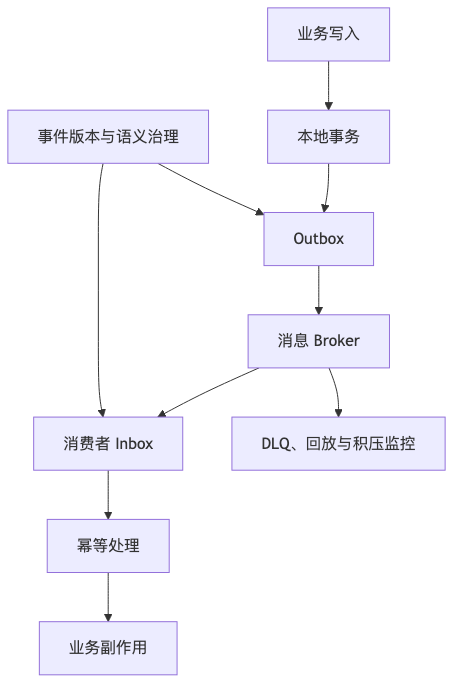

# 第 12 章：异步通信、消息队列与事件驱动

## 本章的问题链

先看原始问题：同步链路过长会慢、脆、耦合高：用户请求要等库存、支付、通知、积分、风控全部完成，任何一个环节慢下来，整个体验都会被拖住。

为了解决这个问题，本章引入消息队列、事件驱动、Outbox、Inbox、DLQ、重放和最终一致，把不需要立即返回的工作从主链路里解耦出来。

但这不是终点：异步不是把问题扔进队列就结束。新的问题是：消息会重复、乱序、积压、丢失或版本不兼容，系统还要面对事件语义和数据质量。

所以本章会按“问题 -> 机制 -> 新问题”的顺序展开：先把眼前的工程压力说清楚，再看对应机制解决了什么，最后讨论它留下的边界和下一步。



## 1. 本章解决什么问题

异步通信是现代互联网系统中最常见的解耦手段。它可以削峰、隔离故障、延迟处理、广播事件、支持最终一致性。

典型链路：

```text
订单创建成功
  ↓
发布 OrderCreated 事件
  ├─ 库存服务扣减或确认
  ├─ 营销服务发券
  ├─ 通知服务发短信
  ├─ 搜索服务更新索引
  ├─ 风控服务更新特征
  ├─ 数据平台消费
  └─ 审计服务记录
```

异步的价值很大，但它不是银弹。它会引入新问题：

* 消息重复。
* 消息乱序。
* 消息丢失。
* 消费积压。
* 最终一致性。
* 回放副作用。
* 事件版本兼容。
* 死信处理。
* 排查困难。
* 生产者和消费者契约不清。
* “消息已发出”与“数据库已提交”不一致。

异步系统的核心问题是：**如何让不同时刻完成的多个系统，最终收敛到正确状态。**

---

## 2. 小系统里为什么不明显

小系统常常在一个事务里做完所有事：

```text
创建订单
扣库存
发优惠券
发短信
写审计
更新搜索
```

流量低时，这样做可以跑。但系统变大后：

* 任一非核心依赖失败都会拖慢下单。
* 短信服务慢会影响订单创建。
* 搜索索引更新失败会回滚交易？
* 大促峰值会直接打爆数据库。
* 后续新增消费者要改主流程。
* 数据分析和风控无法实时获取变化。

异步化后：

```text
核心交易先完成
  ↓
事件驱动后续处理
```

核心链路更短，但一致性和排查难度上升。

---

## 3. 核心概念

### 3.1 消息队列、发布订阅与事件流

消息队列强调生产者发送消息，消费者处理消息。发布订阅强调一个消息被多个订阅者接收。事件流强调消息是可持久化、可回放的有序日志。

不同系统偏重点不同：

* RabbitMQ：传统消息代理、路由灵活、协议丰富。
* Kafka：分区日志、事件流、高吞吐、回放能力强。
* Pulsar：分层架构、Topic/订阅模型、消息和流处理结合。
* 云消息服务：托管、弹性、免运维、与云生态集成。

RabbitMQ 官方定位为成熟可靠的消息和流式代理，并支持 AMQP、MQTT 等多协议。([RabbitMQ][21]) Kafka 文档说明 Topic 会被分区，并分布在 broker 上，这是其扩展和并行消费的基础。([kafka.apache.org][22]) Pulsar 官方介绍其为消息和流一体的平台，并强调分层架构可在不重分配数据的情况下扩展。([Apache Pulsar][23]) Google Cloud Pub/Sub 则把自己定义为异步、可扩展、解耦生产者和消费者的消息服务。([Google Cloud][24])

### 3.2 Topic、Partition、Consumer Group、Offset

以 Kafka 类系统为例：

```text
Topic: order-events
  Partition 0: msg1 msg4 msg7
  Partition 1: msg2 msg5 msg8
  Partition 2: msg3 msg6 msg9

Consumer Group: search-indexer
  consumer-a -> partition 0
  consumer-b -> partition 1
  consumer-c -> partition 2
```

核心点：

* Topic 是逻辑分类。
* Partition 决定并行度和局部顺序。
* Consumer Group 决定一组消费者如何分担消费。
* Offset 表示消费进度。
* 同一 Partition 内通常有顺序，跨 Partition 不保证全局顺序。

### 3.3 At-most-once、At-least-once、Exactly-once

| 语义            | 含义          | 代价          |
| ------------- | ----------- | ----------- |
| At-most-once  | 最多处理一次，可能丢  | 简单，但可靠性弱    |
| At-least-once | 至少处理一次，可能重复 | 常见，需要幂等     |
| Exactly-once  | 看似一次，工程边界严格 | 依赖系统能力和边界条件 |

Exactly-once 在工程上必须谨慎理解。它通常不是“整个业务世界绝对只发生一次”，而是某个消息系统、某个客户端库、某个区域、某个事务边界内提供去重或事务性保证。例如 Google Pub/Sub 文档对 exactly-once delivery 的说明区分了 redelivery 和 duplicate，并强调成功确认后不会重复投递；但它也有区域和客户端使用边界，例如 exactly-once 只在订阅者连接同一区域时保证。([Google Cloud][25]) ([Google Cloud][25])

因此，业务系统仍然要设计幂等消费和对账。

### 3.4 顺序

顺序是局部属性，不是免费全局属性。Google Pub/Sub 的 ordering key 文档也说明，同一 ordering key 的消息按序投递，但不同 key 之间不保证顺序；有序投递还可能增加延迟，热点 key 会受单个订阅者处理速度限制。([Google Cloud][26])

工程判断：

* 是否真的需要顺序？
* 是全局顺序还是同一订单内顺序？
* 顺序 key 如何选择？
* 热 key 是否会拖慢系统？
* 乱序能否通过版本号或状态机处理？

### 3.5 Outbox Pattern

Outbox Pattern 用于解决“数据库提交成功，但消息发送失败”的一致性问题。

基本思路：

```text
同一个本地事务：
  1. 写业务表
  2. 写 outbox 表
事务提交后：
  relay 进程读取 outbox
  发布消息到 MQ
  标记已发送
```

这样可以保证业务状态变化和“待发送事件”一起提交。

### 3.6 Saga

Saga 用于跨服务长事务。它不是数据库回滚，而是一组本地事务和补偿动作。

```text
创建订单
  ↓
锁库存
  ↓
创建支付单
  ↓
发放优惠
```

若支付失败，执行：

```text
取消支付单
释放库存
取消订单
释放优惠占用
```

补偿动作必须是业务动作，不是简单“反向 SQL”。

### 3.7 死信队列

死信队列用于存放多次处理失败的消息。它不是垃圾桶，而是人工修复和审计入口。

死信消息应包含：

* 原消息。
* 失败原因。
* 消费者名称。
* 重试次数。
* 最后错误堆栈。
* Trace ID。
* 业务键。
* 首次失败时间。
* 最后失败时间。
* 修复动作状态。

### 3.8 事件版本

事件不是数据库表变更日志的随手外放。事件是对外契约，需要版本治理。

错误事件：

```json
{
  "id": 123,
  "status": 2,
  "c1": "xxx"
}
```

改进事件：

```json
{
  "event_id": "evt_123",
  "event_type": "OrderCreated",
  "event_version": 2,
  "occurred_at": "2026-06-06T12:00:00+09:00",
  "producer": "order-service",
  "data": {
    "order_id": "ord_123",
    "user_id": "u_456",
    "status": "PENDING_PAYMENT",
    "items": [
      {
        "sku_id": "sku_1",
        "quantity": 1
      }
    ]
  }
}
```

---

## 4. 命令和事件的区别

这是事件驱动系统中最常被混淆的概念。

| 类型      | 含义       | 例子               | 责任           |
| ------- | -------- | ---------------- | ------------ |
| Command | 要求某个系统做事 | ReserveInventory | 接收方决定是否执行    |
| Event   | 某件事已经发生  | OrderCreated     | 事实通知，消费者自行反应 |

错误做法：

```text
Order Service 发布事件：PleaseSendCoupon
```

这其实是命令，不是事件。

更合理：

```text
Order Service 发布事件：OrderCreated
Coupon Service 根据规则决定是否发券
```

事件应表达事实，而不是要求所有消费者执行某个动作。

---

## 5. 事件设计为什么不能暴露数据库表结构

数据库表是内部实现，事件是外部契约。直接把表变更发出去会带来问题：

* 字段名无业务语义。
* 表结构变化破坏消费者。
* 内部状态泄漏。
* 多表事务难表达业务事实。
* 删除字段影响未知消费者。
* 消费者开始依赖内部实现。
* 回放旧事件时语义不清。

事件应该围绕业务事实建模：

```text
OrderCreated
OrderPaid
OrderCancelled
InventoryReserved
PaymentConfirmed
RefundCompleted
```

而不是：

```text
order_table_updated
order_status_column_changed
```

---

## 6. 如何保证消息和数据库状态一致

### 6.1 错误方式：先写库再发消息

```text
写订单成功
  ↓
服务崩溃
  ↓
消息未发出
```

订单存在，但消费者永远不知道。

### 6.2 错误方式：先发消息再写库

```text
消息发出
  ↓
写订单失败
  ↓
消费者看到不存在的订单
```

### 6.3 改进方式：Outbox

```text
本地事务：
  写订单表
  写 outbox 表
  ↓
Relay 读取 outbox
  ↓
发布 MQ
  ↓
消费者幂等处理
```

ASCII 图：

```text
+---------------+
| Order Service |
+-------+-------+
        |
        | local transaction
        v
+-------------------------------+
| Order DB                      |
|  orders table                 |
|  outbox_events table          |
+---------------+---------------+
                |
                | poll / CDC
                v
+---------------+---------------+
| Outbox Relay / CDC Connector  |
+---------------+---------------+
                |
                v
+-------------------------------+
| Message Broker                |
| topic: order-events           |
+---------------+---------------+
                |
     +----------+-----------+-------------+
     v                      v             v
Search Consumer      Notification     Risk Consumer
```

关键点：

* Relay 可重试。
* 消息可能重复。
* 消费者必须幂等。
* Outbox 表要可清理和归档。
* Relay 延迟要监控。
* 消息发布失败要告警。
* 事件 ID 全局唯一。

---

## 7. 如何处理重复和乱序

### 7.1 幂等消费

消费者记录已处理事件：

```text
consumer_name
event_id
processed_at
result
```

处理流程：

```text
收到事件
  ↓
检查 event_id 是否已处理
  ├─ 已处理：跳过
  └─ 未处理：执行业务
        ↓
      记录处理结果
```

注意：

* 幂等记录和业务写入最好在同一事务。
* event_id 必须稳定唯一。
* 如果业务天然幂等，也仍建议记录处理痕迹。
* 幂等表要有保留策略。

### 7.2 乱序处理

例如收到：

```text
OrderPaid
OrderCreated
```

说明事件乱序或消费者回放顺序异常。处理方式：

* 按业务状态机校验。
* 使用版本号。
* 查询当前状态。
* 延迟重试。
* 将非法状态转入待人工检查。
* 设计事件为可重放和可收敛。

状态机示例：

```text
INIT
  ↓
CREATED
  ↓
PAID
  ↓
FULFILLED
  ↓
COMPLETED
```

消费者不应该盲目按事件到达顺序更新状态。

---

## 8. 如何监控消息积压

消息积压不只是“队列变长”。要看：

* Lag。
* 最老未处理消息年龄。
* 消费速率。
* 生产速率。
* 消费失败率。
* 重试次数。
* 死信数量。
* 消费者实例数。
* 单条消息处理耗时。
* 热 Partition。
* 下游数据库耗时。
* 消息大小。
* 反序列化失败。
* Schema 兼容错误。

对于有序消息，热点 key 尤其危险。Pub/Sub 文档也提醒，有序消息的 hot key 会受单个订阅者处理速度限制，并建议监控最老未确认消息年龄等指标。([Google Cloud][26])

---

## 9. 案例分析：订单创建后的事件驱动

### 9.1 目标

订单创建成功后，通知多个系统：

* 通知用户。
* 锁定库存。
* 更新搜索索引。
* 更新推荐特征。
* 记录审计。
* 触发风控。
* 数据平台采集。

### 9.2 架构图

```text
+-------------+
| Client      |
+------+------+
       |
       v
+-------------+
| Order API   |
+------+------+
       |
       v
+-----------------------------+
| Order Service               |
| - create order              |
| - write outbox              |
+------+----------------------+
       |
       v
+-----------------------------+
| Order DB                    |
| orders / outbox_events      |
+------+----------------------+
       |
       v
+-----------------------------+
| Outbox Relay                |
+------+----------------------+
       |
       v
+-----------------------------+
| Message Broker              |
| topic: order-events         |
+--+------+-----+------+------+
   |      |     |      |
   v      v     v      v
Notify Inventory Search Risk/Data
```

### 9.3 哪些同步，哪些异步

| 动作      | 同步/异步  | 原因       |
| ------- | ------ | -------- |
| 创建订单主记录 | 同步     | 用户需要订单号  |
| 价格最终校验  | 同步     | 金额正确性关键  |
| 库存锁定    | 可同步或异步 | 取决于超卖容忍度 |
| 短信通知    | 异步     | 不影响主链路   |
| 搜索索引更新  | 异步     | 最终一致可接受  |
| 风控特征更新  | 异步或准实时 | 取决于风险模型  |
| 审计事件    | 异步但可靠  | 不能丢，允许延迟 |

### 9.4 消费者幂等示例

```text
Notification Consumer:
  event_id = evt_123
  business_key = order_id + notification_type

若已发送：
  skip
否则：
  发送短信
  记录发送结果
```

### 9.5 降级策略

* 通知服务积压：不影响下单，延迟发送。
* 搜索索引积压：用户订单中心查主库，搜索结果延迟。
* 风控消费失败：标记风险特征延迟，必要时收紧高风险操作。
* 数据平台消费失败：保留事件，可回放。

---

## 10. 复盘式案例：消息积压事故

### 10.1 背景

营销服务消费 `OrderCreated` 事件，为符合条件的用户发券。大促期间订单量暴涨，营销消费者处理速度不足，消息积压超过 3 小时。

### 10.2 事故表现

* 用户下单后迟迟收不到优惠券。
* 客服投诉增加。
* 消息队列 Lag 持续增长。
* 消费者 CPU 不高，但数据库连接池耗尽。
* 死信队列开始增长。

### 10.3 根因

* 消费者每条消息都同步查询多个表。
* 优惠规则未缓存。
* 数据库连接池太小。
* 单个消费者串行处理。
* 没有按活动 ID 分片。
* 消息重试无退避。
* 死信队列无人工处理流程。
* 大促前未做峰值压测。

### 10.4 改进

* 优惠规则预加载到缓存。
* 消费者批处理。
* 按活动 ID 和用户 ID 分片。
* 消费失败指数退避。
* 下游数据库独立连接池。
* 死信队列接入工单系统。
* 建立积压时间告警，而不是只看消息数量。
* 大促前做生产影子流量压测。
* 对发券结果做对账补发。

---

## 11. 消息队列选型表

| 选项            | 适合场景              | 优势          | 代价              |
| ------------- | ----------------- | ----------- | --------------- |
| Kafka         | 事件流、高吞吐、回放、日志型数据  | 分区模型成熟，生态强  | 运维复杂，低延迟小消息需调优  |
| Pulsar        | 多租户消息、分层存储、消息 + 流 | 存储计算分离，扩展灵活 | 生态和团队经验需评估      |
| RabbitMQ      | 传统队列、复杂路由、任务分发    | 路由灵活，协议丰富   | 大规模事件流和长保留不一定适合 |
| Cloud Pub/Sub | 云上解耦、托管消息、大规模异步   | 免运维，弹性好     | 云厂商锁定、语义边界需理解   |
| Redis Stream  | 轻量事件流、小规模任务       | 简单、接入快      | 持久化、治理、扩展边界有限   |
| 数据库轮询         | 早期简单异步            | 无额外组件       | 延迟、压力和扩展性差      |

选型不要只看吞吐。还要看：

* 团队运维能力。
* 消息保留时间。
* 是否需要回放。
* 是否需要顺序。
* 是否多租户。
* 是否跨区域。
* 是否需要事务性发布。
* 是否支持 Schema 治理。
* 是否能观测 Lag 和失败。
* 成本模型是否可控。

---

## 12. 事件设计 Checklist

* 事件名是否表达业务事实？
* 是否区分命令和事件？
* 是否有 event_id？
* 是否有 event_type？
* 是否有 event_version？
* 是否有 occurred_at？
* 是否有 producer？
* 是否有 correlation_id / trace_id？
* 是否避免暴露数据库表结构？
* 是否定义 Schema？
* 是否进入 Schema Registry 或契约治理？
* 是否支持向后兼容？
* 消费者是否能忽略未知字段？
* 是否定义重放语义？
* 是否说明事件是否可能重复？
* 是否说明顺序边界？
* 是否有幂等消费设计？
* 是否有死信队列和人工修复流程？
* 是否有消息审计？
* 是否有数据保留和删除策略？
* 是否定义消息大小限制？
* 是否监控 Lag、最老消息年龄、失败率？

---

## 13. 生产实践

### 13.1 生产者实践

* 业务状态和 outbox 同事务写入。
* 消息包含业务键和全局事件 ID。
* 不直接发送数据库内部字段。
* 发送失败可重试。
* 发送状态可观测。
* 事件 Schema 变更前做兼容检查。
* 重要事件可审计、可回放。

### 13.2 消费者实践

* 所有消费者默认按 at-least-once 设计。
* 消费逻辑幂等。
* 下游调用有超时和重试策略。
* 消费失败区分可重试和不可重试。
* 重试有退避和上限。
* 多次失败进入死信队列。
* 死信队列有人工处理流程。
* 消费者处理速度可横向扩展。
* 监控积压时间，而不仅是积压数量。

### 13.3 回放实践

回放不是简单把旧消息重新消费。要回答：

* 回放会不会重复发短信？
* 回放会不会重复发券？
* 回放会不会重复扣库存？
* 回放会不会触发外部 API？
* 回放期间如何区分新旧流量？
* 回放结果如何校验？
* 回放是否需要沙箱模式？
* 回放是否有速率限制？

---

## 14. 安全、成本与治理影响

异步系统会放大治理问题。

安全方面：

* 消息中可能包含敏感数据。
* 多消费者扩大数据访问面。
* Topic 权限需要最小化。
* 消息审计要记录谁生产、谁消费。
* 跨租户事件必须隔离。
* 死信队列不能泄漏敏感信息。
* 回放权限要严格控制。

成本方面：

* 消息保留时间越长，存储成本越高。
* 大消息会增加网络和存储成本。
* 消费者积压会拖高计算资源。
* 全量回放可能冲击下游。
* 事件复制到数据平台会产生额外成本。
* 精细 Trace 和日志也会增加可观测性成本。

治理方面：

* Topic 命名规范。
* 事件 Schema 生命周期。
* Producer/Consumer 关系图。
* 消费者责任人。
* 死信处理 SLA。
* 事件弃用流程。
* 回放审批流程。
* 多租户隔离策略。

---

## 15. 本章小结

异步通信让系统解耦、削峰和容错，但它把问题从“立即成功或失败”变成“最终是否收敛”。这要求系统具备事件建模、幂等消费、Outbox、死信队列、重试退避、积压监控、回放审计和人工修复能力。

事件驱动系统不是把所有调用都改成 MQ。真正的设计问题是：哪些事情必须同步确认，哪些事情可以最终一致；哪些失败可以重试，哪些失败必须人工处理；哪些事件是业务事实，哪些只是内部实现细节。

---

## 16. 典型失败模式

1. 数据库提交成功但消息发送失败。
2. 消息发送成功但数据库事务回滚。
3. 消费者无幂等，重复消息导致重复发券。
4. 消息乱序导致状态倒退。
5. 积压只看数量，不看最老消息年龄。
6. 死信队列无人处理，变成黑洞。
7. 事件直接暴露数据库表结构。
8. Schema 破坏消费者兼容性。
9. 回放旧消息触发真实副作用。
10. 单一热点 key 导致有序消费阻塞。
11. 消费者重试无退避，压垮下游。
12. 消息中携带过多敏感数据。
13. Topic 权限过宽导致数据泄漏。
14. 把 MQ 当分布式事务替代品，却没有补偿和对账。

---

## 17. 本章最重要的 5 个判断

1. **异步不是银弹，它只是把同步失败转化为最终一致性和运维治理问题。**
2. **默认按消息可能重复、乱序、延迟、回放来设计消费者。**
3. **Outbox 解决的是数据库状态和待发送事件的一致性，不会替你解决业务幂等。**
4. **事件应表达业务事实，不能直接暴露数据库表结构。**
5. **死信队列、回放和人工修复流程，是事件驱动系统生产可用的必要部分。**

---

# 第三篇总小结：请求如何流动，失败如何传播，系统如何恢复

第三篇从一个用户请求开始，沿着核心路径展开：

```text
客户端发起请求
  ↓
入口层接收、保护和路由请求
  ↓
API 定义系统契约
  ↓
同步调用完成必须立即确认的事情
  ↓
异步事件完成可延迟、可解耦、可最终一致的事情
```

这一篇最重要的结论不是“应该用 BFF、CDN、GraphQL、gRPC、Kafka”，而是：

* 客户端是系统的一部分。
* 入口层是第一道可靠性和安全边界。
* API 是长期契约。
* 同步调用必须控制失败传播。
* 异步事件必须控制最终一致性。
* 重试、缓存、限流、降级、幂等、观测不是附属功能，而是核心路径设计的一部分。

现代互联网系统的核心路径不是一条“成功路径”，而是一组围绕失败设计的路径：

```text
正常路径：请求成功、数据返回、事件流转
降级路径：非核心依赖失败，核心功能可用
重试路径：短暂失败后安全恢复
补偿路径：局部成功后最终修正
观测路径：发现影响、定位原因、验证恢复
治理路径：契约、配置、权限、成本可控
```

如果一条请求链路只在白板上看起来漂亮，但没有回答“超时怎么办、重复怎么办、缓存错了怎么办、第三方慢了怎么办、老客户端怎么办、事件积压怎么办、谁负责恢复”，它就还不是生产级系统设计。

[1]: https://web.dev/articles/vitals "Web Vitals  |  Articles  |  web.dev"
[2]: https://www.cloudflare.com/learning/cdn/glossary/anycast-network/ "What is Anycast? How does Anycast Work?"
[3]: https://developers.cloudflare.com/cache/ "Cloudflare Cache (CDN) docs"
[4]: https://developers.cloudflare.com/cache/how-to/purge-cache/ "Purge cache · Cloudflare Cache (CDN) docs"
[5]: https://developers.cloudflare.com/cache/how-to/purge-cache/purge-everything/ "Purge everything - Cache / CDN"
[6]: https://developers.cloudflare.com/waf/ "Overview · Cloudflare Web Application Firewall (WAF) docs"
[7]: https://developers.cloudflare.com/waf/rate-limiting-rules/ "Rate limiting rules · Cloudflare Web Application Firewall ..."
[8]: https://gateway-api.sigs.k8s.io/ "Gateway API - Kubernetes"
[9]: https://gateway-api.sigs.k8s.io/docs/concepts/security/ "Security | Gateway API"
[10]: https://gateway-api.sigs.k8s.io/guides/user-guides/http-routing/ "HTTP routing | Gateway API"
[11]: https://www.envoyproxy.io/docs/envoy/latest/intro/what_is_envoy "What is Envoy — envoy 1.39.0-dev-02aab4 documentation"
[12]: https://datatracker.ietf.org/doc/html/rfc9110 "RFC 9110 - HTTP Semantics"
[13]: https://spec.graphql.org/October2021/ "GraphQL"
[14]: https://grpc.io/ "gRPC"
[15]: https://protobuf.dev/programming-guides/proto3/ "Language Guide (proto 3) | Protocol Buffers Documentation"
[16]: https://spec.openapis.org/oas/v3.2.0.html "OpenAPI Specification v3.2.0"
[17]: https://www.asyncapi.com/docs/reference/specification/v3.0.0 "3.0.0 | AsyncAPI Initiative for event-driven APIs"
[18]: https://grpc.io/docs/guides/deadlines/ "Deadlines | gRPC"
[19]: https://aws.amazon.com/builders-library/timeouts-retries-and-backoff-with-jitter/ "Timeouts, retries and backoff with jitter"
[20]: https://grpc.io/docs/guides/retry/ "Retry | gRPC"
[21]: https://www.rabbitmq.com/ "RabbitMQ: One broker to queue them all | RabbitMQ"
[22]: https://kafka.apache.org/documentation/ "Introduction | Apache Kafka"
[23]: https://pulsar.apache.org/ "Apache Pulsar"
[24]: https://cloud.google.com/pubsub/docs/overview "What is Pub/Sub?  |  Google Cloud Documentation"
[25]: https://cloud.google.com/pubsub/docs/exactly-once-delivery "Exactly-once delivery  |  Pub/Sub  |  Google Cloud Documentation"
[26]: https://cloud.google.com/pubsub/docs/ordering "Order messages  |  Pub/Sub  |  Google Cloud Documentation"
