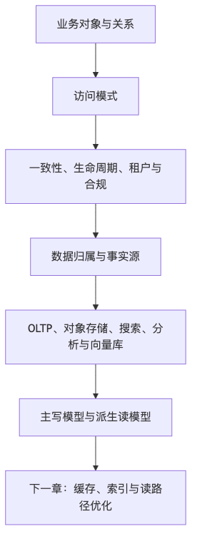

# 第四篇：分布式系统的硬骨头

分布式系统里最难的部分，往往不是“服务拆不拆”“要不要上 Kubernetes”，而是数据。一旦系统进入大规模阶段，数据就不再只是数据库里几张表，而会变成一组长期约束：怎么建模，怎么读，怎么写，怎么缓存，怎么扩展，怎么复制，怎么恢复，怎么保证一致性，怎么让多个节点对“事实”达成共识。

这一篇讨论的不是某个数据库、缓存、搜索引擎或流处理框架的教程，而是现代互联网系统绕不开的六块硬骨头：

* 第 13 章：数据建模与存储系统
* 第 14 章：缓存、索引与读路径优化
* 第 15 章：事务、一致性与分布式数据
* 第 16 章：分库分表、复制与扩展
* 第 17 章：搜索、推荐、Feed 与实时数据
* 第 18 章：分布式协调、共识与时间

---

# 第 13 章：数据建模与存储系统

## 本章的问题链

先看原始问题：很多数据设计从“选 MySQL 还是 MongoDB”开始，结果一开始就跳到了工具。真正决定系统寿命的，是核心对象、关系、访问模式、生命周期、一致性和合规边界有没有先被建模清楚。

为了解决这个问题，本章从业务对象、读写模式、数据归属、生命周期、租户隔离、冷热分层和存储组合出发，让数据库选择服务于模型，而不是让模型迁就数据库。

但这不是终点：模型确定以后，新的压力会落到读路径上：高频查询、热点数据、复杂筛选、排行榜和聚合视图，都会要求缓存、索引和派生读模型。

所以本章会按“问题 -> 机制 -> 新问题”的顺序展开：先把眼前的工程压力说清楚，再看对应机制解决了什么，最后讨论它留下的边界和下一步。



## 1. 本章解决什么问题

很多工程团队第一次做系统设计时，会把“数据系统设计”理解成数据库选型：MySQL 还是 PostgreSQL？MongoDB 还是 Redis？ClickHouse 还是 Elasticsearch？向量数据库要不要单独买一个？这种提问方式很自然，但它跳过了真正的问题。

数据系统设计的核心不是“选哪个数据库”，而是回答：

* 这个系统有哪些核心对象？
* 这些对象如何被创建、修改、查询、删除？
* 哪些查询必须低延迟？
* 哪些数据必须强一致？
* 哪些数据可以延迟同步？
* 哪些数据会变热？
* 哪些数据会变冷？
* 哪些数据要被归档、审计、删除？
* 哪些数据属于租户、用户、组织、地区或合规边界？
* 系统坏了以后，数据如何恢复到可接受状态？

一个小系统可以先把数据“存下来以后再说”。但大系统里，“以后再说”通常会变成以后没人敢改：表越来越大，字段语义没人说得清，老接口依赖历史脏数据，删除一条用户数据要追踪数据库、缓存、搜索索引、对象存储、数据仓库、备份和日志，最后大家发现不是不能删，而是不知道删完之后谁会坏。

现代数据系统往往是多存储并存：OLTP 数据库存交易和状态，OLAP 系统做分析，对象存储放文件和归档，搜索引擎做全文检索，缓存优化读路径，时序数据库存监控和事件，向量数据库或向量索引支持语义检索。比如 OpenSearch 官方文档把普通搜索索引建立在倒排索引上，同时也提供向量搜索能力，用于语义搜索、RAG、推荐等 AI 场景；这说明现代“搜索系统”已经不只是关键词检索，而是多种索引结构的组合。([OpenSearch Documentation][1])

本章要建立一个基本判断：**数据模型是系统的长期骨架。代码可以重构，服务可以迁移，数据库可以扩容，但错误的数据模型会以查询复杂度、一致性漏洞、迁移成本、合规风险和组织摩擦的形式长期存在。**

## 2. 小系统里为什么不明显

小系统有几个天然保护层。数据量小，单表查询还能跑；并发低，锁冲突不明显；团队小，字段含义靠口口相传；业务变化慢，临时字段也能凑合；出问题时，一个人能登录数据库手工修。于是很多坏设计不会立刻暴露。

典型做法是：

```text
users
orders
products
comments
settings
files
events
```

每个表都放在一个数据库里。字段能加就加，JSON 能塞就塞，索引慢了再补，查询复杂了就 JOIN，报表慢了就读主库，历史数据多了就先不管。这个阶段的系统看起来效率很高，因为它把架构复杂度推迟了。

但大规模系统会让所有模糊语义显形：

* `status` 到底是订单状态、支付状态、履约状态，还是 UI 展示状态？
* `deleted_at` 表示用户删除、运营下架、合规删除，还是软删除？
* `tenant_id` 是否存在于所有表？所有查询是否强制带租户条件？
* 金额字段是否带币种、精度、税费、汇率版本？
* 用户信息被复制到订单快照后，隐私删除时要不要一起删？
* 搜索索引里的商品标题是否允许比数据库延迟 5 秒？
* 数据仓库里的行为日志是否能用于风控？是否需要用户授权？

小系统里，数据只是业务的副产品；大系统里，数据本身就是产品、资产、风险和债务。

## 3. 核心概念

### 3.1 OLTP、OLAP 与 HTAP

OLTP，Online Transaction Processing，关注在线交易处理。它服务于下单、支付、库存扣减、账号登录、权限判断等高并发、低延迟、强约束的业务请求。OLTP 系统通常要求写入可靠、事务语义清晰、索引面向点查和小范围查询。

OLAP，Online Analytical Processing，关注分析查询。它服务于报表、经营分析、用户行为分析、风控建模、推荐特征生产等场景。OLAP 通常接受秒级到分钟级延迟，强调扫描大量数据、聚合、分组、复杂查询。ClickHouse 官方将自己定位为面向 OLAP 的列式数据库，适合实时分析报表这类场景；列式存储的优势通常来自只读取查询需要的列、压缩效率高、批量扫描快，但它不适合替代所有事务型写入路径。([ClickHouse][2])

HTAP，Hybrid Transactional and Analytical Processing，试图同时支持事务和分析。它听起来很诱人，但工程上要警惕“一个系统解决所有问题”的幻觉。HTAP 可以降低数据复制链路复杂度，但也可能带来资源隔离、查询治理、成本和运维复杂度问题。一个复杂分析查询拖慢在线交易，往往比多维护一条异步数据链路更危险。

### 3.2 关系数据库仍然重要

关系数据库不是“旧技术”。在大多数互联网核心业务中，关系数据库仍然是事实系统，原因很简单：它提供清晰的数据结构、约束、事务、索引、查询语言和成熟运维体系。订单、支付、账户、权限、租户、合同、账单这些对象，天然需要约束和一致性。

关系数据库的问题通常不是“不够现代”，而是被错误使用：

* 把所有业务都放进一个数据库，不做边界。
* 让所有服务共享同一批表。
* 用复杂 JOIN 支撑高 QPS 在线接口。
* 在主库上跑报表。
* 不做归档和分区，单表无限膨胀。
* 把索引当成万能优化器，不理解写入代价。

关系数据库适合作为核心事实源，但不适合作为所有读路径、分析路径、搜索路径、缓存路径和实时路径的唯一载体。

### 3.3 文档数据库、Key-Value、列式、图、对象、时序、向量

不同存储系统的差异，本质上是数据模型、查询模式和失败模式不同。

文档数据库适合对象结构灵活、读写经常围绕整个文档进行的场景。MongoDB 官方数据建模文档明确强调，可以通过内嵌或引用来建模关系，并应根据应用访问模式优化模型；这正好说明文档数据库也不是“随便塞 JSON”，它仍然需要查询驱动建模。([MongoDB][3])

Key-Value 存储适合通过主键快速读写，常见于缓存、会话、计数、配置、特征、幂等记录。它的强项是简单、快、可水平扩展；代价是查询能力弱，复杂条件查询通常要转移到应用或索引系统。

列式数据库适合分析型扫描和聚合，不适合高频小事务更新。图数据库适合关系密集型查询，比如社交关系、欺诈网络、权限关系、知识图谱。Neo4j 官方文档描述的属性图模型由节点和关系组成，这类模型在“关系本身就是一等对象”的场景里比关系表 JOIN 更自然。([Graph Database & Analytics][4])

对象存储适合文件、图片、视频、日志、归档、备份、数据湖。Amazon S3 文档把对象组织为 bucket 和 object，对象由 key 检索，适合存放大量非结构化或半结构化数据；它的边界是不能像数据库那样做低延迟事务查询。([AWS 文档][5])

时序数据库适合按时间写入和查询的指标、日志、传感器数据、行情数据。它的关键设计是时间分区、保留策略、降采样和压缩。

向量数据库或向量索引适合语义检索、相似度搜索、RAG 召回和推荐候选生成。向量存储真正的难点不是“能不能存 embedding”，而是维度、距离度量、索引构建、过滤条件、更新延迟、权限过滤、召回质量和成本。

### 3.4 热数据、冷数据与数据生命周期

数据不是永远同等重要。刚创建的订单可能被用户、客服、支付、履约系统频繁访问；三年前的订单更多用于审计、售后、合规和分析。用户头像原图可能只在上传后处理一次，之后主要访问缩略图。行为日志前 7 天用于实时分析，半年后只用于离线归档。

数据生命周期至少包括：

```text
创建 -> 活跃访问 -> 低频访问 -> 归档 -> 保留期满 -> 删除/匿名化
```

如果没有生命周期设计，系统会走向两个极端：要么所有历史数据永远留在在线库，导致成本和性能恶化；要么删除策略过于粗暴，影响审计、对账和恢复。

PostgreSQL 官方文档关于连续归档和 PITR 指出，要成功恢复，需要从基础备份开始的一段连续 WAL 归档；这提醒我们，备份恢复不是“有备份文件”这么简单，而是要验证恢复链路的连续性和可执行性。([PostgreSQL][6])

## 4. 典型架构方案

### 4.1 单一关系数据库

这是最常见的第一版架构：

```text
Client
  |
API Service
  |
Relational DB
```

优点是简单、事务边界清晰、开发效率高、可观测性相对容易。适合早期系统、内部系统、低并发 SaaS、业务模型还在探索的产品。

代价是读写压力、报表压力、搜索压力、数据增长都会集中在同一个系统里。它不是不能用，而是要尽早识别哪些访问模式不应该长期留在主库。

### 4.2 事务库 + 缓存 + 搜索索引

```text
             +--> Redis / Local Cache
             |
API Service -+--> Relational DB
             |
             +--> Search Index
```

事务库保存事实，缓存优化高频读，搜索索引服务全文检索和复杂查询。这个架构是互联网系统的常见形态。关键问题是同步：数据库更新后，缓存和索引什么时候更新？失败时谁是事实源？用户是否允许短暂读到旧数据？

### 4.3 事务库 + 事件流 + 分析/搜索/特征系统

```text
OLTP DB
  |
 CDC / Outbox
  |
Event Stream
  +--> Search Index
  +--> OLAP / Lakehouse
  +--> Feature Store
  +--> Audit Store
```

这种形态更适合中大型系统。在线库不直接承担所有读路径，而是通过事件流把事实变化传播给下游。好处是解耦和可扩展，代价是最终一致性、事件版本、回放、幂等和数据质量治理复杂。

### 4.4 多租户 SaaS 数据隔离方案

多租户 SaaS 常见三种模型：

| 模型               | 说明                          | 优点       | 代价               | 适用场景      |
| ---------------- | --------------------------- | -------- | ---------------- | --------- |
| 共享库共享表           | 所有租户在同一库表，通过 `tenant_id` 隔离 | 成本低、运维简单 | 越权风险高、热点租户影响其他租户 | 早期、中小租户   |
| 共享库独立 schema / 表 | 租户隔离更清晰                     | 隔离性较好    | schema 迁移复杂      | 中大型 SaaS  |
| 独立库              | 每个大租户独立数据库                  | 隔离强、定制方便 | 成本高、运维复杂         | 企业大客户、强合规 |

多租户设计最容易犯的错误，是只在业务代码里加 `tenant_id` 条件，而不是把租户上下文作为数据模型、权限模型、索引模型、缓存 key、日志审计和后台工具的共同约束。租户隔离不是一个 WHERE 条件，而是一条跨系统不变量。

## 5. 关键权衡

### 5.1 数据模型服务查询模式，而不是服务想象中的领域纯度

领域模型和数据模型相关，但不是一回事。领域模型关注业务概念，数据模型关注如何可靠、高效、可治理地存取数据。

订单系统里，用户、订单、商品、支付、库存、优惠券、物流都有关系。理论上可以高度范式化，所有信息都通过外键关联。但生产系统往往会在订单里保存商品标题、价格、优惠快照、收货地址快照，因为订单需要表达“下单当时的事实”，不是“当前商品和当前用户资料的状态”。

### 5.2 范式化与反范式化

范式化减少冗余，有利于一致性；反范式化减少读路径复杂度，有利于性能和历史快照。二者没有绝对优劣。

经验判断是：

* 写入频繁、必须保持一致的数据，优先范式化。
* 读取频繁、需要历史快照的数据，可以反范式化。
* 反范式化字段必须标明来源、刷新策略和容忍延迟。
* 任何冗余字段都要回答：如果源字段变了，它是否要跟着变？

### 5.3 NoSQL 的真实优势和真实代价

NoSQL 不是“比 SQL 更高级”。它通常用牺牲通用查询、事务、约束或一致性的一部分，换取特定访问模式下的扩展性、低延迟或灵活结构。

Cassandra 官方文档强调分区键用于把数据分布到节点，且高性能查询通常要提供分区键；这意味着它很适合按 key 访问的大规模写入，但不适合临时复杂查询。([Apache Cassandra][7])

如果团队把 NoSQL 当成“无需建模”，很快会遇到二级索引不可控、跨分区查询昂贵、热点分区、数据修复困难、业务一致性下沉到应用代码等问题。

### 5.4 选型看失败模式，而不是只看性能

数据库选型常见误区是只看 benchmark。更重要的问题是：

* 主节点挂了会怎样？
* 副本延迟会怎样？
* 网络分区时读写策略是什么？
* 备份能否恢复到指定时间点？
* 索引构建会不会阻塞写入？
* 单租户热点会不会拖垮全局？
* 扩容是否需要停机？
* 误删数据如何恢复？
* 云服务区域故障时能否切换？
* 账单超预期时如何限额？

高性能但不可恢复的系统，在核心业务里不算可靠系统。

## 6. 案例分析一：多租户 SaaS 数据模型

假设我们设计一个企业协作 SaaS，核心对象包括组织、用户、项目、文档、评论、权限、审计日志。

第一版容易这样设计：

```text
users(id, name, email)
projects(id, name)
documents(id, project_id, title, body)
comments(id, document_id, user_id, content)
permissions(user_id, project_id, role)
```

看起来没问题，但它缺少租户边界。正确的第一版至少要明确：

```text
tenants(id, name, plan, region, status)

users(id, tenant_id, email, name, status)

projects(id, tenant_id, name, owner_user_id, status)

documents(
  id,
  tenant_id,
  project_id,
  title,
  body_ref,
  version,
  classification,
  created_by,
  updated_at,
  deleted_at
)

comments(id, tenant_id, document_id, user_id, content, created_at)

permissions(
  id,
  tenant_id,
  subject_type,   -- user / group / service_account
  subject_id,
  resource_type,  -- project / document
  resource_id,
  action,
  effect
)

audit_logs(
  id,
  tenant_id,
  actor_type,
  actor_id,
  action,
  resource_type,
  resource_id,
  request_id,
  created_at
)
```

核心原则是：租户边界要进入每张业务表、每个索引、每个缓存 key、每条审计日志。文档正文可以放对象存储，数据库保存 `body_ref`、版本、权限、分类和生命周期状态。搜索索引要带 `tenant_id` 和权限过滤字段。缓存 key 应该类似：

```text
tenant:{tenant_id}:document:{document_id}:metadata
tenant:{tenant_id}:project:{project_id}:members
```

错误设计与改进设计对比：

| 设计点  | 错误设计             | 改进设计                                |
| ---- | ---------------- | ----------------------------------- |
| 租户隔离 | 只在业务代码里判断        | 数据模型、索引、缓存、审计全链路携带 `tenant_id`      |
| 文档正文 | 直接放关系库大字段        | 正文放对象存储，元数据和权限放 OLTP                |
| 权限   | 项目表里放 `owner_id` | 独立权限模型，支持用户、组、服务账号                  |
| 删除   | `deleted=true`   | 区分软删除、合规删除、归档、保留期                   |
| 审计   | 只记操作日志文本         | 结构化审计日志，带 actor/resource/request_id |
| 搜索   | 搜索索引不带租户         | 索引字段带租户和权限过滤条件                      |

## 7. 案例分析二：订单系统数据模型

订单系统最容易被误判为“几张 CRUD 表”。生产级订单系统至少要区分：

* 订单主状态
* 支付状态
* 履约状态
* 售后状态
* 发票状态
* 优惠快照
* 商品快照
* 地址快照
* 金额拆分
* 操作流水
* 事件流水
* 对账记录

一个简化模型：

```text
orders(
  id,
  user_id,
  tenant_id,
  order_no,
  status,
  total_amount,
  currency,
  created_at,
  updated_at
)

order_items(
  id,
  order_id,
  sku_id,
  sku_snapshot_json,
  unit_price,
  quantity,
  discount_amount,
  final_amount
)

order_payments(
  id,
  order_id,
  payment_no,
  channel,
  status,
  amount,
  paid_at
)

order_status_history(
  id,
  order_id,
  from_status,
  to_status,
  reason,
  operator_type,
  operator_id,
  created_at
)

order_events(
  id,
  order_id,
  event_type,
  payload,
  created_at
)
```

订单模型的关键不是表多，而是语义分离。订单状态不能简单等于支付状态。支付成功但库存失败、订单取消但退款未完成、物流已发货但售后进行中，这些都是生产环境常态。

订单还必须保存快照。用户下单时商品名叫“高级会员年卡”，价格 299 元；三个月后商品改名、涨价、下架，不应该改变历史订单含义。快照不是冗余垃圾，而是历史事实的一部分。

## 8. 可观测性与运维

数据系统上线前，至少要设计这些观测指标：

| 类别   | 指标                     |
| ---- | ---------------------- |
| 请求   | QPS、P95/P99 延迟、错误率、慢查询 |
| 连接   | 连接数、连接池等待、事务持续时间       |
| 存储   | 表大小、索引大小、膨胀率、磁盘水位      |
| 查询   | 扫描行数、返回行数、执行计划变化       |
| 复制   | 副本延迟、复制中断、WAL/日志积压     |
| 备份   | 备份成功率、恢复演练耗时、最近可恢复时间点  |
| 生命周期 | 归档进度、删除任务积压、保留期违规      |
| 多租户  | 单租户 QPS、存储、慢查询、成本      |

最重要的是恢复演练。没有恢复演练的备份，只是心理安慰。

## 9. 安全、成本与治理影响

数据系统的安全边界不只在数据库账号。还包括：

* 字段级敏感数据分类。
* 租户隔离。
* 只读账号与写账号分离。
* 后台操作审计。
* 数据导出审批。
* 日志脱敏。
* 备份加密。
* 数据保留与删除策略。
* 跨境和区域化存储约束。

成本方面，数据增长是复利。在线库、索引、缓存、对象存储、备份、日志、数据仓库都会复制同一份业务事实的不同形态。一个 1 TB 的在线数据集，加上副本、索引、备份、CDC、搜索、数仓、冷备，真实成本可能是数倍到十几倍。设计时必须知道“每写入 1 GB 业务数据，会在全链路放大成多少 GB”。

## 10. 数据库选型决策表

| 问题               | 优先考虑                   |
| ---------------- | ---------------------- |
| 核心交易、强约束、事务      | 关系数据库                  |
| 高并发 key 查询、会话、缓存 | Redis / Memcached / KV |
| 灵活文档、对象整体读写      | 文档数据库                  |
| 大规模分析、聚合、报表      | 列式 OLAP / 数据仓库         |
| 全文检索、排序、过滤       | 搜索引擎                   |
| 图片、文件、视频、归档      | 对象存储                   |
| 指标、监控、行情         | 时序数据库                  |
| 关系遍历、图算法         | 图数据库                   |
| 语义检索、相似度召回       | 向量索引 / 向量数据库           |
| 多区域强一致事务         | 分布式 SQL，但要接受复杂度和成本     |

## 11. 设计 Checklist

* 是否明确核心对象和对象生命周期？
* 是否区分 OLTP、OLAP、搜索、缓存、归档路径？
* 是否知道每个字段的语义、来源和更新规则？
* 是否为核心查询设计索引，而不是事后盲目补索引？
* 是否明确哪些数据需要强一致，哪些可以最终一致？
* 是否设计租户、组织、区域、合规边界？
* 是否设计软删除、硬删除、归档和保留期？
* 是否有备份恢复目标：RTO、RPO、恢复演练？
* 是否知道数据增长后的扩展路径？
* 是否有数据质量、审计和血缘记录？

## 12. 典型失败模式

1. **万能数据库失败**：所有查询都压到主库，报表拖垮交易。
2. **无生命周期失败**：历史数据无限增长，归档和删除无人敢动。
3. **租户隔离失败**：某个查询漏掉 `tenant_id`，造成越权。
4. **快照缺失失败**：历史订单随商品信息变更而改变。
5. **NoSQL 滥用失败**：没有查询建模，复杂查询全靠扫。
6. **备份幻觉失败**：有备份但无法按预期恢复。
7. **索引债务失败**：索引越加越多，写入变慢，没人知道哪些可删。

## 13. 本章小结

数据系统设计的起点不是数据库品牌，而是访问模式、生命周期、一致性、扩展方式和失败模式。关系数据库仍然是许多核心业务的事实源，但它不应该承担所有读、搜、算、归档和实时分析任务。NoSQL、搜索、缓存、对象存储、列式数据库、时序数据库、向量索引都有价值，但它们的价值来自适配特定问题，而不是替代建模。

## 14. 本章最重要的 5 个判断

1. 数据模型是长期架构约束，不是实现细节。
2. 数据模型应该服务访问模式，同时保留业务语义。
3. 关系数据库仍然重要，尤其适合核心事实和事务边界。
4. NoSQL 的核心价值是特定访问模式下的扩展性，不是“无需设计”。
5. 数据生命周期、备份恢复、删除合规和租户隔离必须从第一版进入设计。

---

[1]: https://docs.opensearch.org/latest/getting-started/intro/ "Intro to OpenSearch - OpenSearch Documentation"
[2]: https://clickhouse.com/ "ClickHouse: Fast Open-Source OLAP DBMS"
[3]: https://www.mongodb.com/docs/manual/data-modeling/ "Data Modeling in MongoDB - Database Manual"
[4]: https://neo4j.com/docs/getting-started/appendix/graphdb-concepts/ "Graph database concepts - Getting Started"
[5]: https://docs.aws.amazon.com/AmazonS3/latest/userguide/Welcome.html "What is Amazon S3? - Amazon Simple Storage Service"
[6]: https://www.postgresql.org/docs/current/continuous-archiving.html "25.3. Continuous Archiving and Point-in-Time Recovery ..."
[7]: https://cassandra.apache.org/doc/latest/cassandra/developing/data-modeling/intro.html "Introduction | Apache Cassandra Documentation"
[8]: https://developer.mozilla.org/en-US/docs/Web/HTTP/Reference/Headers/Cache-Control "Cache-Control header - HTTP - MDN Web Docs"
[9]: https://memcached.org/ "memcached - a distributed memory object caching system"
[10]: https://redis.io/docs/latest/commands/expire/ "EXPIRE | Docs"
[11]: https://redis.io/docs/latest/commands/info/ "INFO | Docs"
[12]: https://www.postgresql.org/docs/current/transaction-iso.html "PostgreSQL: Documentation: 18: 13.2. Transaction Isolation"
[13]: https://debezium.io/documentation/reference/stable/transformations/outbox-event-router.html "Outbox Event Router :: Debezium Documentation"
[14]: https://www.cockroachlabs.com/docs/stable/transaction-retry-error-reference "Transaction Retry Error Reference"
[15]: https://vitess.io/docs/archive/22.0/reference/features/sharding/ "The Vitess Docs | Sharding"
[16]: https://docs.pingcap.com/tidb/stable/overview "What is TiDB Self-Managed"
[17]: https://debezium.io/documentation/reference/stable/ "Debezium Documentation :: Debezium Documentation"
[18]: https://kafka.apache.org/documentation/ "Introduction | Apache Kafka"
[19]: https://nightlies.apache.org/flink/flink-docs-stable/docs/concepts/time/ "Timely Stream Processing | Apache Flink"
[20]: https://lamport.azurewebsites.net/pubs/time-clocks.pdf "Time, Clocks, and the Ordering of Events in a Distributed System"
[21]: https://etcd.io/docs/v3.6/learning/why/ "etcd versus other key-value stores | etcd"
[22]: https://raft.github.io/raft.pdf "In Search of an Understandable Consensus Algorithm"
[23]: https://etcd.io/docs/v3.6/learning/api_guarantees/ "etcd API guarantees | etcd"
[24]: https://zookeeper.apache.org/ "Apache ZooKeeper"
[25]: https://kubernetes.io/docs/concepts/overview/components/ "Kubernetes Components"
[26]: https://developer.hashicorp.com/consul/docs/concept/consensus "Consensus | Consul"
