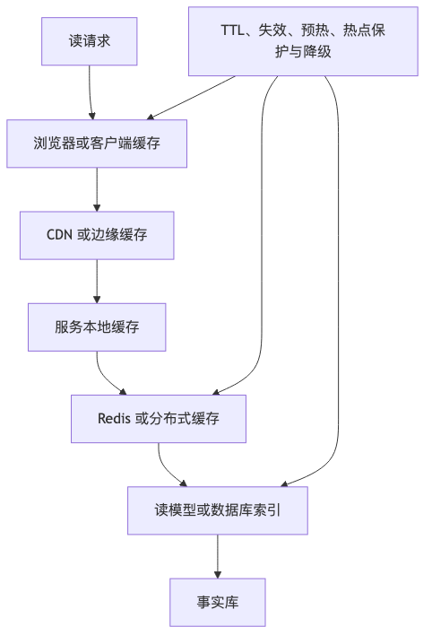

# 第 14 章：缓存、索引与读路径优化

## 本章的问题链

先看原始问题：如果所有读请求都打到在线数据库，系统会很快被延迟、热点和成本压垮。但缓存和索引一旦乱用，又会制造脏读、穿透、雪崩、失效风暴和难以解释的数据不一致。

为了解决这个问题，本章把读路径拆成多级缓存、数据库索引、读模型、热点保护、失效策略和容量治理，用不同机制承接不同类型的读压力。

但这不是终点：读路径变快以后，写路径的问题不会消失。新的问题是：当一次业务写入涉及多个状态、多个服务、多个副本时，事务和一致性要怎么处理。

所以本章会按“问题 -> 机制 -> 新问题”的顺序展开：先把眼前的工程压力说清楚，再看对应机制解决了什么，最后讨论它留下的边界和下一步。



## 1. 本章解决什么问题

互联网系统的大多数用户体验问题，最终都会落到读路径上。首页打不开，商品详情慢，搜索结果不稳定，Feed 刷不出来，排行榜延迟，配置读取抖动，权限判断耗时，这些表面上是“性能问题”，本质上是读路径设计问题。

缓存是最常见的读路径优化工具，但也是事故制造机。很多团队会说“加一层 Redis 就好了”，这句话只说对了一半。缓存确实可以降低延迟、减少数据库压力、吸收热点流量；但缓存也会制造一致性问题、雪崩、击穿、穿透、热 Key、大 Key、内存淘汰、脏读、误删、预热失败和降级复杂度。

本章的核心观点是：**缓存不是一个组件，而是一套读路径设计。索引也不是数据库自动帮你解决的问题，而是读路径和写路径之间的成本交换。**

## 2. 小系统里为什么不明显

小系统里，所有请求直接查数据库也能撑住：

```text
Client -> API -> DB
```

一张商品表几万行，一个索引能解决大多数问题。用户访问量小，热点不明显。缓存偶尔不一致，刷新一下就好了。数据库慢查询出现后，工程师加个索引，问题暂时消失。

大系统里，读路径会发生质变：

* 热点商品一秒几十万次读取。
* 首页接口聚合几十个数据源。
* 搜索需要分词、排序、过滤、召回。
* Feed 需要根据用户关系和推荐结果生成时间线。
* 多级缓存之间存在不同 TTL。
* 同一个数据在浏览器、CDN、网关、本地缓存、Redis、搜索索引、数据库里都有副本。
* 一个缓存 key 失效可能把流量瞬间打回数据库。
* 一个错误的缓存更新策略可能让用户看到过期价格、错误库存或越权数据。

读路径优化的难点不是“快”，而是“在快的同时知道什么时候不可信、如何恢复、如何观测”。

## 3. 核心概念

### 3.1 多级缓存

典型互联网读路径不是一层缓存，而是多层：

```text
Browser Cache
   |
CDN Cache
   |
Gateway Cache
   |
Service Local Cache
   |
Distributed Cache
   |
Database / Search / Object Store
```

浏览器缓存适合静态资源、版本化资源、可公开缓存的接口响应。HTTP 的 `Cache-Control`、`ETag`、`max-age`、`stale-while-revalidate` 等机制可以让客户端或中间缓存控制新鲜度；MDN 文档说明 `stale-while-revalidate` 允许缓存先返回过期响应，并在后台重新验证，从而在可接受陈旧度的场景中隐藏再验证延迟。([MDN Web Docs][8])

CDN 缓存适合静态资源、图片、视频、公开内容、部分匿名 API。网关缓存适合租户配置、公开字典、低变化接口。服务本地缓存适合极高频、低容量、可短暂陈旧的数据。分布式缓存，比如 Redis 或 Memcached，适合跨实例共享的热点读、会话、计数、排行榜、幂等记录等。Memcached 官方将其描述为分布式内存对象缓存系统，用于通过缓存数据库调用、API 调用或页面渲染结果来减轻数据库负载。([memcached.org][9])

### 3.2 缓存模式

常见缓存策略包括：

| 模式            | 读流程                | 写流程           | 适用场景    | 风险        |
| ------------- | ------------------ | ------------- | ------- | --------- |
| Cache Aside   | 应用先读缓存，miss 后读库并回填 | 应用更新库后删除/更新缓存 | 最常见     | 一致性窗口、击穿  |
| Read Through  | 应用读缓存，缓存层负责加载数据    | 写路径另行处理       | 缓存平台能力强 | 缓存层复杂     |
| Write Through | 写缓存同时写后端           | 写入延迟高         | 写后立即读   | 缓存成为写路径依赖 |
| Write Behind  | 先写缓存，异步写库          | 异步落库          | 高吞吐缓冲   | 丢数据和一致性风险 |

生产环境中最常见的是 Cache Aside，因为它简单、边界清晰、应用可控。它的经典写法是：

```text
read(key):
  value = cache.get(key)
  if value exists:
      return value
  value = db.query(key)
  cache.set(key, value, ttl)
  return value

write(key, value):
  db.update(key, value)
  cache.delete(key)
```

注意，写路径通常是“更新数据库后删除缓存”，而不是“更新数据库后更新缓存”。删除缓存让下一次读从事实源加载，能减少部分并发覆盖问题。但它仍然不是强一致方案，只是工程上常用的折中。

### 3.3 TTL、主动失效与被动失效

TTL 是缓存的生命线。没有 TTL 的缓存，迟早变成第二数据库。TTL 太短，命中率低、后端压力高；TTL 太长，陈旧数据风险高。Redis 官方文档说明 `EXPIRE` 可以为 key 设置超时，过期后 key 会被自动删除；Redis 也支持在内存达到限制时按淘汰策略删除 key。([Redis][10])

主动失效是业务变更后显式删除或更新缓存。被动失效是等 TTL 到期。生产系统往往二者结合：重要数据变更主动删除，兜底靠 TTL；不重要数据只靠 TTL；热点数据可能永不过期但通过后台刷新。

### 3.4 缓存穿透、击穿、雪崩

缓存穿透：请求的数据根本不存在，每次都 miss，然后打到数据库。典型例子是恶意请求不存在的商品 ID。解决办法包括空值缓存、布隆过滤器、参数校验、限流。

缓存击穿：某个热点 key 过期，大量请求同时 miss，瞬间打到数据库。解决办法包括互斥加载、singleflight、逻辑过期、后台刷新、热点 key 不设置短 TTL。

缓存雪崩：大量 key 同时过期，或缓存集群故障，导致流量整体打到后端。解决办法包括 TTL 加随机抖动、分批预热、多级缓存、熔断限流、缓存故障降级。

### 3.5 热 Key 与大 Key

热 Key 是访问极高的 key。风险是单个缓存分片、单个 Redis 实例、单个网络链路被打满。解决办法包括本地缓存、key 复制、多副本读取、热点识别、请求合并。

大 Key 是 value 过大或集合元素过多的 key。风险是网络传输慢、序列化慢、阻塞事件循环、迁移困难、删除慢。解决办法包括拆分 key、分页、压缩、异步删除、控制单 key 大小。

## 4. 索引也是读路径设计

缓存解决的是“重复读”的问题，索引解决的是“如何找到数据”的问题。数据库索引、搜索倒排索引、向量索引、排行榜有序集合、Feed Timeline，本质上都是不同形态的读优化结构。

关系数据库索引适合点查、范围查、排序、唯一约束。代价是写入变慢、存储增加、维护复杂。搜索引擎使用倒排索引，把词映射到文档。OpenSearch 文档说明倒排索引会把词映射到包含该词的文档，并使用 BM25 等相关性算法计算排序；这类索引适合全文检索，却不适合作为强一致事务事实源。([OpenSearch Documentation][1])

排行榜通常是预计算读模型，例如 Redis Sorted Set 或专用 OLAP 聚合。Feed Timeline 是面向用户读路径预生成或半预生成的数据结构。搜索索引、排行榜、Feed 都有一个共同特征：它们不是事实源，而是服务读路径的派生数据。

## 5. 典型架构方案：商品详情页多级缓存

商品详情页是缓存设计的经典案例。它读的数据包括商品基础信息、价格、库存、促销、评价、推荐、商家信息、配送信息、用户个性化权益。不同数据的新鲜度要求不同。

```text
            +----------------+
Client ---> | CDN / Edge     |  静态图片、商品详情 HTML 片段
            +--------+-------+
                     |
              +------v-------+
              | API Gateway  |  限流、鉴权、部分公共缓存
              +------+- -----+
                     |
              +------v-------+
              | Product BFF  |
              +---+-----+----+
                  |     |
        +---------+     +------------------+
        |                                  |
+-------v--------+              +----------v----------+
| Local Cache    |              | Redis Cluster       |
| hot product    |              | product/price/promo |
+-------+--------+              +----------+----------+
        |                                  |
        +----------------+-----------------+
                         |
                  +------v------+
                  | OLTP DB     |
                  +-------------+
```

可缓存性分层：

| 数据      | 缓存位置         | TTL    | 失效方式    | 陈旧容忍 |
| ------- | ------------ | ------ | ------- | ---- |
| 商品图片    | CDN          | 长 TTL  | 版本化 URL | 高    |
| 商品标题/描述 | CDN/Redis/本地 | 分钟级    | 商品发布事件  | 中    |
| 价格      | Redis        | 秒级到分钟级 | 价格变更事件  | 低    |
| 库存      | Redis/专用库存服务 | 极短或不缓存 | 库存变更    | 极低   |
| 评价摘要    | Redis/搜索     | 分钟级    | 异步刷新    | 中    |
| 推荐商品    | 推荐缓存         | 分钟级    | 周期刷新    | 高    |
| 用户优惠    | 本地短缓存/Redis  | 秒级     | 权益变更    | 低    |

关键判断是：不要把商品详情页当成一个缓存对象。它应该是多个新鲜度不同的数据片段组合。否则会出现两种坏结果：要么整体 TTL 很短，缓存价值下降；要么整体 TTL 很长，价格和库存错误。

## 6. 错误设计与改进设计

错误设计：

```text
product_detail:{product_id} -> 一个巨大 JSON
TTL = 30 min
```

这个 JSON 包含商品信息、价格、库存、促销、评价、推荐、用户权益。问题很多：

* 任意小字段变化都要刷新整个大对象。
* 库存和推荐的新鲜度被迫一致。
* 大 Key 传输慢。
* 个性化数据污染公共缓存。
* 用户 A 的优惠可能被用户 B 看到。
* 缓存失效时，所有下游同时被打爆。

改进设计：

```text
product:base:{product_id}            TTL 10 min
product:media:{product_id}           TTL 1 day
product:price:{product_id}:{region}  TTL 30s
product:stock:{sku_id}:{region}      TTL 3s / 专用库存服务
product:review_summary:{product_id}  TTL 5 min
user:benefit:{user_id}:{product_id}  TTL 10s
```

BFF 层负责聚合，并在部分数据失败时降级。例如推荐失败不影响主信息展示；评价摘要失败显示“暂无数据”；库存服务失败时禁止下单或展示“库存确认中”；价格失败不能展示过期价格继续支付。

## 7. 关键权衡

### 7.1 命中率不等于用户体验

缓存命中率高，不代表用户体验好。如果命中的是低价值数据，而关键路径仍然慢，命中率再高也没意义。要按接口、用户场景和关键链路看命中率。

更好的指标是：

* 核心页面 P95/P99 延迟。
* 缓存命中对端到端延迟的贡献。
* miss 后回源耗时。
* 热点 key 的单分片 QPS。
* 缓存错误对用户的影响。
* 陈旧数据被用户感知的比例。

### 7.2 本地缓存既快又危险

本地缓存不走网络，极快，适合配置、字典、小规模热点数据。但它有几个危险：

* 多实例不一致。
* 失效通知丢失。
* 内存膨胀。
* 发布后旧缓存仍在。
* 权限和租户数据缓存错误可能导致越权。

本地缓存适合“短 TTL + 小容量 + 可陈旧 + 有版本”的数据。不要把用户权限、价格、库存这类高风险数据长期放本地缓存。

### 7.3 缓存一致性边界

缓存不是数据正确性的来源。缓存只应回答“在可接受陈旧范围内，我能不能更快地读到一个副本”。如果业务不能接受陈旧，就不要把缓存放在决策点上。

例如：

* “商品描述”可以短暂陈旧。
* “订单支付金额”不能从可能陈旧的缓存读。
* “是否有权限下载文件”不能长期缓存，除非带版本和撤销机制。
* “库存是否足够”可以缓存展示，但最终扣减必须走一致性更强的库存路径。

## 8. 热点 Key 事故复盘

某电商平台大促期间，一个明星商品被放到首页。商品详情基础信息使用 Redis 缓存，key 为 `product:{id}`，TTL 10 分钟。活动开始后，缓存刚好过期，几十万请求同时 miss，所有应用实例同时查数据库。数据库连接池被打满，商品服务超时。客户端重试，网关重试，流量进一步放大。几分钟内，商品详情、购物车和下单链路都受到影响。

事故链路：

```text
热点商品缓存过期
  -> 大量请求 miss
  -> 应用并发回源 DB
  -> DB 连接池耗尽
  -> 商品服务超时
  -> 客户端/网关重试
  -> 下游雪崩
```

根因不是“Redis 不够快”，而是热点 key 没有特殊治理。

改进方案：

* 活动商品提前预热。
* 热点 key 逻辑过期，后台单线程刷新。
* 应用层 singleflight，同一 key 同一时刻只有一个回源。
* 本地缓存保留短期旧值，回源失败时返回旧值并打标。
* TTL 加随机抖动，避免批量过期。
* 热点识别后自动复制 key 到多个分片。
* 对 DB 回源设置限流和熔断。
* 缓存 miss 率、回源 QPS、单 key QPS 纳入大盘。

## 9. 可观测性与运维

缓存系统要观察的不只是 Redis CPU。至少包括：

| 维度    | 指标                         |
| ----- | -------------------------- |
| 命中    | hit ratio、miss QPS、按接口命中率  |
| 回源    | 回源 QPS、回源 P99、回源错误率        |
| 热点    | top keys、单 key QPS、单分片 QPS |
| 容量    | 内存使用、碎片率、淘汰次数、key 数量       |
| 大 Key | value 大小、集合长度、慢命令          |
| 一致性   | 缓存版本落后、失效事件延迟              |
| 降级    | 旧值返回次数、空值缓存命中              |
| 成本    | 缓存节点成本、网络流量、跨区访问           |

Redis 的 `INFO` 命令会返回服务器统计信息，适合作为采集缓存实例状态的基础之一；但业务层仍然要补充 key 粒度、接口粒度和回源粒度指标。([Redis][11])

## 10. 安全、成本与治理影响

缓存会放大安全问题。敏感数据进入缓存后，常常绕过数据库审计、加密、访问控制和删除流程。需要特别注意：

* 缓存 key 是否包含租户上下文。
* value 是否包含敏感字段。
* 是否有字段级脱敏。
* 用户权限变化后缓存如何失效。
* 用户删除数据后缓存、搜索索引、CDN 是否同步删除。
* CDN 是否缓存了个性化响应。
* 管理后台是否能查看缓存敏感内容。

成本方面，缓存并不便宜。缓存容量、复制、副本、跨区流量、持久化、备份、高可用都会产生费用。缓存命中率低但容量很大的系统，是典型的“花钱买复杂度”。

## 11. 缓存更新策略对比表

| 策略              | 一致性 | 延迟 | 实现复杂度 | 适合场景       |
| --------------- | --: | -: | ----: | ---------- |
| 更新 DB 后删缓存      |   中 |  低 |     低 | 通用业务缓存     |
| 更新 DB 后更新缓存     | 中偏低 |  低 |     中 | 简单对象，低并发   |
| 先删缓存再更新 DB      |   低 |  低 |     低 | 不推荐，容易脏读   |
| Binlog/CDC 异步失效 |   中 |  中 |    中高 | 多服务共享缓存    |
| 逻辑过期后台刷新        |   中 | 很低 |     中 | 热点数据       |
| 永不过期 + 版本号      | 高可控 | 很低 |     高 | 配置、权限、静态字典 |
| 只靠 TTL          |   低 |  低 |     低 | 可陈旧数据      |

## 12. 设计 Checklist

* 是否明确每个缓存对象的新鲜度要求？
* 是否区分公共缓存、租户缓存、用户个性化缓存？
* 是否为缓存 key 设计命名规范和版本？
* 是否有 TTL、随机抖动和主动失效机制？
* 是否处理穿透、击穿、雪崩？
* 是否识别热 Key 和大 Key？
* 是否有缓存预热和回源限流？
* 缓存失败时是否有降级策略？
* 是否能观测命中率、miss、回源、淘汰、热点？
* 是否避免缓存敏感数据或做好加密脱敏？
* 是否设计缓存与数据库、搜索索引的一致性边界？
* 是否有清理无用 key 和治理大 key 的机制？

## 13. 典型失败模式

1. 缓存 key 缺少租户信息，导致跨租户数据泄漏。
2. CDN 缓存个性化响应，导致用户看到别人数据。
3. 热点 key 过期，瞬间击穿数据库。
4. 大量 key 同时过期，形成雪崩。
5. 本地缓存无版本，权限撤销后仍可访问。
6. 缓存无限 TTL，历史脏数据长期存在。
7. 缓存命中率很高，但关键链路仍然慢。
8. 大 Key 阻塞缓存实例，影响无关业务。
9. 缓存集群故障时无降级，后端被压垮。
10. 把缓存当事实源，导致业务状态错误。

## 14. 本章小结

缓存、索引和读模型都是读路径优化手段。它们通过冗余数据换取低延迟和高吞吐，也因此引入一致性、失效、成本和治理问题。生产级缓存设计必须回答：缓存什么、缓存多久、谁更新、谁失效、失效失败怎么办、读到旧值是否可接受、怎么发现缓存异常。

## 15. 本章最重要的 5 个判断

1. 缓存解决读路径性能，不解决数据正确性。
2. 不同数据片段应该有不同新鲜度，不要把页面整体做成一个大缓存。
3. 热点 key、缓存击穿和缓存雪崩要在设计阶段处理。
4. 本地缓存只适合小容量、短 TTL、可陈旧、有版本的数据。
5. 缓存命中率不是最终目标，用户体验和后端保护才是目标。

---

[1]: https://docs.opensearch.org/latest/getting-started/intro/ "Intro to OpenSearch - OpenSearch Documentation"
[2]: https://clickhouse.com/ "ClickHouse: Fast Open-Source OLAP DBMS"
[3]: https://www.mongodb.com/docs/manual/data-modeling/ "Data Modeling in MongoDB - Database Manual"
[4]: https://neo4j.com/docs/getting-started/appendix/graphdb-concepts/ "Graph database concepts - Getting Started"
[5]: https://docs.aws.amazon.com/AmazonS3/latest/userguide/Welcome.html "What is Amazon S3? - Amazon Simple Storage Service"
[6]: https://www.postgresql.org/docs/current/continuous-archiving.html "25.3. Continuous Archiving and Point-in-Time Recovery ..."
[7]: https://cassandra.apache.org/doc/latest/cassandra/developing/data-modeling/intro.html "Introduction | Apache Cassandra Documentation"
[8]: https://developer.mozilla.org/en-US/docs/Web/HTTP/Reference/Headers/Cache-Control "Cache-Control header - HTTP - MDN Web Docs"
[9]: https://memcached.org/ "memcached - a distributed memory object caching system"
[10]: https://redis.io/docs/latest/commands/expire/ "EXPIRE | Docs"
[11]: https://redis.io/docs/latest/commands/info/ "INFO | Docs"
[12]: https://www.postgresql.org/docs/current/transaction-iso.html "PostgreSQL: Documentation: 18: 13.2. Transaction Isolation"
[13]: https://debezium.io/documentation/reference/stable/transformations/outbox-event-router.html "Outbox Event Router :: Debezium Documentation"
[14]: https://www.cockroachlabs.com/docs/stable/transaction-retry-error-reference "Transaction Retry Error Reference"
[15]: https://vitess.io/docs/archive/22.0/reference/features/sharding/ "The Vitess Docs | Sharding"
[16]: https://docs.pingcap.com/tidb/stable/overview "What is TiDB Self-Managed"
[17]: https://debezium.io/documentation/reference/stable/ "Debezium Documentation :: Debezium Documentation"
[18]: https://kafka.apache.org/documentation/ "Introduction | Apache Kafka"
[19]: https://nightlies.apache.org/flink/flink-docs-stable/docs/concepts/time/ "Timely Stream Processing | Apache Flink"
[20]: https://lamport.azurewebsites.net/pubs/time-clocks.pdf "Time, Clocks, and the Ordering of Events in a Distributed System"
[21]: https://etcd.io/docs/v3.6/learning/why/ "etcd versus other key-value stores | etcd"
[22]: https://raft.github.io/raft.pdf "In Search of an Understandable Consensus Algorithm"
[23]: https://etcd.io/docs/v3.6/learning/api_guarantees/ "etcd API guarantees | etcd"
[24]: https://zookeeper.apache.org/ "Apache ZooKeeper"
[25]: https://kubernetes.io/docs/concepts/overview/components/ "Kubernetes Components"
[26]: https://developer.hashicorp.com/consul/docs/concept/consensus "Consensus | Consul"
