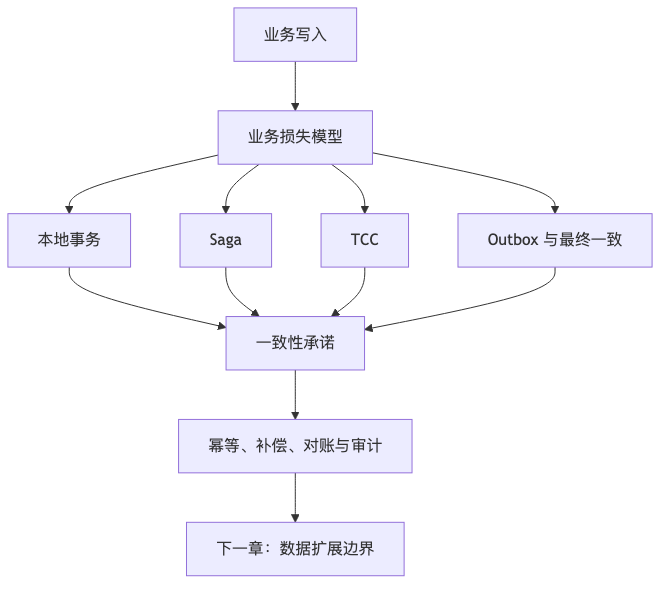

# 第 15 章：事务、一致性与分布式数据

## 本章的问题链

先看原始问题：在单库单表里，本地事务能给人一种“写入一定一致”的安全感。系统一旦拆成多个服务、多个数据库、多个消息链路，这种安全感就会破掉：局部成功、局部失败会变成常态。

为了解决这个问题，本章从本地事务、隔离级别、分布式事务、Saga、TCC、Outbox、幂等和对账出发，按业务损失模型选择合适的一致性策略。

但这不是终点：一致性策略解决的是一次写入如何正确完成。新的问题是：数据量、租户数和访问压力继续增长后，单库单表本身会成为扩展瓶颈。

所以本章会按“问题 -> 机制 -> 新问题”的顺序展开：先把眼前的工程压力说清楚，再看对应机制解决了什么，最后讨论它留下的边界和下一步。



## 1. 本章解决什么问题

一致性是分布式系统里最容易被口号化的概念。有人说“我们要强一致”，有人说“最终一致就行”，有人说“用分布式事务”，有人说“用消息队列解耦”。这些说法都可能对，也都可能错。真正的问题不是一致性越强越好，而是：**业务损失模型要求什么样的一致性？**

订单、支付、库存、积分、优惠券、消息、推荐结果，对一致性的要求完全不同。

* 钱扣错了，是重大事故。
* 库存多卖了，可能可以补偿，也可能不行。
* 优惠券重复使用，可能造成资金损失。
* 积分晚到账几秒，通常可以接受。
* 推荐结果延迟几分钟，多数场景可以接受。
* 消息通知重复发，体验不好但可处理。
* 审计日志丢失，可能是合规事故。

本章讨论如何在本地事务、分布式事务、Saga、TCC、Outbox、Inbox、对账、幂等和最终一致之间做工程选择。

## 2. 小系统里为什么不明显

小系统通常只有一个数据库。订单创建、库存扣减、优惠券核销、支付记录写入都在一个本地事务里：

```text
BEGIN;
INSERT order;
UPDATE stock;
UPDATE coupon;
INSERT payment_record;
COMMIT;
```

只要数据库事务成功，业务状态就一致。问题从拆分开始出现。一旦订单、库存、支付、优惠券属于不同服务、不同数据库、不同团队，事务边界就不再天然存在。

```text
Order Service -> Order DB
Stock Service -> Stock DB
Coupon Service -> Coupon DB
Payment Service -> Payment Provider
```

此时任何一步都可能成功、失败、超时、重复、乱序：

* 订单创建成功，库存扣减失败。
* 库存扣减成功，支付创建超时。
* 支付渠道扣款成功，但回调丢失。
* 优惠券核销成功，订单取消后释放失败。
* 消息发送成功，但数据库事务回滚。
* 数据库提交成功，但消息发送失败。

分布式一致性问题，本质上来自“一个业务动作跨越多个不可靠边界”。

## 3. 核心概念

### 3.1 ACID 与隔离级别

ACID 包括原子性、一致性、隔离性和持久性。它是本地事务的基础，但不同数据库、不同隔离级别的行为并不完全一样。PostgreSQL 文档列出了 Read Committed、Repeatable Read、Serializable 等隔离级别，并说明 Serializable 提供最严格的隔离，但应用需要准备处理序列化失败和重试。([PostgreSQL][12])

隔离级别不是越高越好。更高隔离通常意味着更多冲突检测、重试、锁等待或吞吐下降。生产系统要针对业务不变量选择隔离策略，而不是一律 Serializable。

### 3.2 强一致、最终一致、因果一致、会话一致

强一致通常指读写看起来像在一个顺序系统中发生。最终一致指如果没有新的更新，副本最终会收敛到同一状态。因果一致保证有因果关系的操作顺序被保留。会话一致保证用户在同一会话内能看到自己的写入。

“读己之写”是最常见的用户体验一致性要求。用户刚修改头像，下一次刷新应该看到新头像；但其他用户晚几秒看到旧头像通常可以接受。这个场景不一定需要全局强一致，可以通过会话粘滞、主库读、版本号或读修复解决。

### 3.3 CAP 与 PACELC

CAP 告诉我们，在网络分区时，系统无法同时保证一致性和可用性。PACELC 进一步提醒我们：即使没有分区，也要在延迟和一致性之间权衡。工程上不要把 CAP 当作贴标签游戏。更实际的问题是：

* 分区时允许写入吗？
* 写入是否可能冲突？
* 冲突如何检测和解决？
* 用户是否能接受旧数据？
* 钱、库存、权限等关键状态是否允许旧读？
* 降级时保护的是一致性还是可用性？

### 3.4 2PC、TCC、Saga、补偿

2PC，两阶段提交，通过协调者让多个参与者准备和提交。它能提供较强一致性，但协调者、锁持有、阻塞、超时恢复都带来复杂度。对于高吞吐互联网业务，2PC 通常只适合边界清晰、参与方有限、基础设施成熟的场景。

TCC，Try-Confirm-Cancel，把资源操作拆成预留、确认、取消。适合库存、额度、券等可冻结资源。它要求业务模型支持“预留态”。

Saga 把长事务拆成多个本地事务，每一步有补偿动作。适合订单履约、出行预订、供应链流程等长流程。Saga 的本质不是“失败就回滚”，而是“失败后执行业务上可接受的反向动作”。

补偿事务不是数据库回滚。退款不是撤销扣款，而是新发起一笔退款交易；释放库存不是让历史扣减消失，而是写入一条反向库存流水。

### 3.5 Outbox、Inbox 与 Exactly-once

Outbox 模式解决“数据库提交成功但消息发送失败”的问题。做法是在同一个本地事务里写业务表和 outbox 表，然后由 CDC 或轮询把 outbox 事件发送到消息系统。Debezium 官方文档描述 Outbox Event Router 时明确指出，outbox pattern 用于在多个微服务之间安全可靠地交换数据，避免服务内部数据库状态与其他服务消费事件之间不一致；Debezium 通过捕获 outbox 表变化并转换为事件来实现该模式。([Debezium][13])

Inbox 模式用于消费侧去重。消费者把已处理的消息 ID 记录下来，重复消息到达时直接跳过。Exactly-once 在工程上通常不是“世界上只发生一次”，而是“在指定边界内，通过幂等、事务、去重和提交协议，让结果等价于处理一次”。不要把消息系统宣传里的 exactly-once 当成跨数据库、跨 API、跨第三方的绝对保证。

## 4. 典型架构方案

### 4.1 本地事务优先

只要业务边界允许，本地事务优先。比如订单主表、订单明细、订单状态历史、订单事件 outbox 可以在订单库本地事务内完成：

```text
BEGIN;
INSERT orders;
INSERT order_items;
INSERT order_status_history;
INSERT outbox_events;
COMMIT;
```

然后通过异步事件通知库存、营销、物流、搜索等系统。这个方案避免把所有服务纳入一个分布式事务。

### 4.2 TCC 资源预留

```text
Try:
  freeze stock
  freeze coupon

Confirm:
  deduct frozen stock
  mark coupon used

Cancel:
  release frozen stock
  release coupon
```

适合“资源必须先占住”的业务。TCC 的关键是所有参与方都必须支持预留态、确认幂等、取消幂等和超时清理。

### 4.3 Saga 状态机

```text
Create Order
  -> Reserve Stock
  -> Create Payment
  -> Wait Payment Callback
  -> Confirm Order
  -> Notify Fulfillment
```

失败时：

```text
Reserve Stock failed -> Cancel Order
Payment timeout      -> Cancel Payment Intent -> Release Stock -> Cancel Order
Fulfillment failed   -> Manual Review / Retry / Refund
```

Saga 应该由状态机或工作流系统驱动，而不是散落在多个服务里的回调地狱。每一步要有状态、超时、重试、补偿和人工介入点。

### 4.4 对账兜底

支付系统不能只依赖同步响应和异步回调。必须对账：

```text
Payment Provider Statement
        |
        v
Reconciliation Job
        |
+-------+--------+
|                |
matched       mismatch
|                |
mark ok     repair / manual review
```

对账是金融、支付和订单系统的最后防线。它承认分布式系统一定会出现未知状态，并通过外部事实源和内部记录比对来修复。

## 5. 电商下单一致性案例

下单链路：

```text
Client
  |
Order Service
  |
+-------------------+
| Order DB          |
| orders            |
| order_items       |
| outbox_events     |
+-------------------+
  |
 CDC / Event Publisher
  |
OrderCreated Event
  |
+---------+----------+-------------+
| Stock   | Coupon   | Payment     |
+---------+----------+-------------+
```

设计选择：

1. 订单创建先落本地库，状态为 `PENDING_CONFIRMATION`。
2. 订单库事务内写 outbox 事件。
3. 库存服务消费事件并冻结库存。
4. 优惠券服务消费事件并冻结优惠。
5. 支付服务创建支付单或等待用户支付。
6. 所有必要条件满足后，订单进入 `CONFIRMED`。
7. 任一步失败，进入取消或人工处理流程。

这不是强一致下单，而是状态机驱动的最终一致。用户看到的是“订单处理中”或“支付处理中”。如果业务要求下单瞬间必须确认库存和优惠，则需要把库存冻结和优惠冻结放到下单同步路径里，但支付回调和履约仍然适合异步。

## 6. Saga 示例

```text
Saga: CreateOrderSaga

Step 1: CreateOrder
  action: order.create_pending()
  compensate: order.cancel()

Step 2: ReserveStock
  action: stock.reserve(order_id, items)
  compensate: stock.release(order_id)

Step 3: ReserveCoupon
  action: coupon.reserve(order_id, coupon_id)
  compensate: coupon.release(order_id)

Step 4: CreatePayment
  action: payment.create_intent(order_id, amount)
  compensate: payment.cancel_intent(order_id)

Step 5: ConfirmOrder
  action: order.confirm(order_id)
  compensate: manual_review_required
```

注意最后一步不一定有自动补偿。订单确认后，如果支付已经完成，库存已扣减，物流已开始，补偿就变成退款、退货、人工审核，而不是简单回滚。

## 7. TCC 示例

库存 TCC：

```text
try_reserve(sku_id, qty, biz_id):
  if already_reserved(biz_id): return success
  if available_qty >= qty:
      available_qty -= qty
      frozen_qty += qty
      insert reservation(biz_id, status='TRY')
      return success
  else:
      return insufficient

confirm(biz_id):
  if already_confirmed(biz_id): return success
  reservation = get_reservation(biz_id)
  frozen_qty -= reservation.qty
  sold_qty += reservation.qty
  reservation.status = 'CONFIRMED'

cancel(biz_id):
  if already_cancelled(biz_id): return success
  reservation = get_reservation(biz_id)
  frozen_qty -= reservation.qty
  available_qty += reservation.qty
  reservation.status = 'CANCELLED'
```

TCC 的核心字段不是库存数量，而是 reservation 记录。没有 reservation，幂等、超时释放、人工修复都无从谈起。

## 8. 支付系统对账案例

支付链路至少有三种事实来源：

* 内部支付单。
* 第三方支付渠道流水。
* 银行或清算机构账单。

同步支付响应可能超时，异步回调可能丢失，渠道状态可能延迟。支付系统必须允许 `UNKNOWN` 状态，并通过查询和对账推进状态。

```text
payment_order:
  id
  order_id
  channel
  amount
  status: INIT / PROCESSING / SUCCESS / FAILED / UNKNOWN / REFUNDED
  channel_txn_id
  version
```

对账流程：

1. 拉取渠道账单。
2. 与内部支付单按 channel_txn_id、金额、时间窗口匹配。
3. 匹配成功但内部未成功：补记成功并通知订单。
4. 内部成功但渠道无记录：进入人工审核。
5. 金额不一致：冻结订单，触发风控。
6. 重复成功：触发退款或人工处理。
7. 对账结果写审计日志。

支付系统不能用“接口返回成功”作为唯一事实。真正可靠的是状态机 + 幂等 + 对账 + 审计。

## 9. 一致性模型选择表

| 业务对象  | 建议一致性        | 常见方案         |
| ----- | ------------ | ------------ |
| 支付扣款  | 强一致 / 外部事实对账 | 本地事务、幂等、渠道对账 |
| 账户余额  | 强一致          | 单账户串行化、事务、流水 |
| 库存扣减  | 视业务而定        | 预扣、TCC、库存流水  |
| 优惠券核销 | 较强一致         | 冻结、幂等、唯一约束   |
| 订单状态  | 状态机一致        | 本地事务 + Saga  |
| 积分到账  | 最终一致         | 事件 + 幂等消费    |
| 消息通知  | 至少一次 + 去重    | 消息队列 + Inbox |
| 搜索索引  | 最终一致         | CDC / 异步索引   |
| 推荐结果  | 弱一致          | 批处理 / 实时特征   |
| 审计日志  | 高耐久          | 追加写、WORM、归档  |

## 10. 可观测性与运维

一致性问题最怕“静默错误”。需要观测：

| 指标           | 含义          |
| ------------ | ----------- |
| Saga 卡住数量    | 长流程是否停在中间状态 |
| 补偿失败数        | 失败恢复是否可靠    |
| 幂等冲突数        | 重试和重复消息是否增加 |
| Outbox 积压    | 事件是否及时发布    |
| Inbox 去重命中   | 重复消息比例      |
| 对账差异数        | 内外部事实不一致    |
| UNKNOWN 状态数量 | 第三方调用不确定状态  |
| 状态机非法迁移      | 业务状态是否被错误推进 |
| 事务重试率        | 隔离级别或热点冲突问题 |

CockroachDB 文档强调在 Serializable 隔离下，应用需要处理事务重试错误；这类“重试是协议的一部分”的思路在分布式事务和强隔离系统中非常常见。([cockroachlabs.com][14])

## 11. 安全、成本与治理影响

一致性设计和安全治理强相关。比如权限变更要不要立刻生效？用户被禁用后，缓存和下游系统是否还能继续允许访问？优惠券和余额是否有审计流水？人工补偿是否需要审批？

成本方面，强一致通常更贵。它可能增加锁等待、重试、协调、跨区延迟、运维复杂度和故障恢复成本。最终一致也不免费，它把成本转移到事件、状态机、补偿、对账、排障和人工运营上。

## 12. 分布式事务设计 Checklist

* 是否明确业务损失模型？
* 是否区分核心事实和派生数据？
* 是否优先使用本地事务？
* 是否有状态机，而不是散落的布尔字段？
* 所有外部调用是否有幂等键？
* 是否处理超时后的未知状态？
* 是否有补偿动作，补偿是否幂等？
* 是否有对账机制？
* 是否有 Outbox 防止数据库与消息不一致？
* 消费端是否有 Inbox 或业务幂等？
* 是否有人工修复后台和审计？
* 是否为事务重试、冲突、卡住状态设置告警？
* 是否明确哪些读要读主库或带版本读？

## 13. 典型失败模式

1. 把补偿当数据库回滚，忽略业务语义。
2. 同步链路过长，一个下游慢导致整个下单失败。
3. 没有幂等键，重试造成重复扣款或重复发货。
4. 数据库提交成功，消息发送失败，下游永远不知道。
5. 消费者处理成功但 offset 提交失败，重复消费导致副作用。
6. 支付超时被当失败，但渠道实际扣款成功。
7. Saga 状态机缺少超时处理，订单长期卡住。
8. 强一致滥用导致吞吐下降和锁冲突。
9. 最终一致无对账，错误长期沉默。
10. 人工修复无审计，造成二次事故。

## 14. 本章小结

一致性不是越强越好，而是要匹配业务损失模型。强一致能降低某些业务风险，但会增加延迟、协调和可用性成本；最终一致能提升可用性和扩展性，但要求状态机、幂等、补偿、对账和可观测性。生产级分布式系统不是靠一个“分布式事务框架”解决一致性，而是靠一组业务和技术机制共同约束错误传播。

## 15. 本章最重要的 5 个判断

1. 一致性选择必须从业务损失模型出发。
2. 本地事务是最可靠、最便宜的事务边界，能不分布式就不分布式。
3. Saga 和 TCC 都是业务设计，不是简单框架调用。
4. 幂等、Outbox、Inbox、对账是分布式系统基本功。
5. 支付、库存、余额等核心对象必须允许未知状态，并设计恢复路径。

---

[1]: https://docs.opensearch.org/latest/getting-started/intro/ "Intro to OpenSearch - OpenSearch Documentation"
[2]: https://clickhouse.com/ "ClickHouse: Fast Open-Source OLAP DBMS"
[3]: https://www.mongodb.com/docs/manual/data-modeling/ "Data Modeling in MongoDB - Database Manual"
[4]: https://neo4j.com/docs/getting-started/appendix/graphdb-concepts/ "Graph database concepts - Getting Started"
[5]: https://docs.aws.amazon.com/AmazonS3/latest/userguide/Welcome.html "What is Amazon S3? - Amazon Simple Storage Service"
[6]: https://www.postgresql.org/docs/current/continuous-archiving.html "25.3. Continuous Archiving and Point-in-Time Recovery ..."
[7]: https://cassandra.apache.org/doc/latest/cassandra/developing/data-modeling/intro.html "Introduction | Apache Cassandra Documentation"
[8]: https://developer.mozilla.org/en-US/docs/Web/HTTP/Reference/Headers/Cache-Control "Cache-Control header - HTTP - MDN Web Docs"
[9]: https://memcached.org/ "memcached - a distributed memory object caching system"
[10]: https://redis.io/docs/latest/commands/expire/ "EXPIRE | Docs"
[11]: https://redis.io/docs/latest/commands/info/ "INFO | Docs"
[12]: https://www.postgresql.org/docs/current/transaction-iso.html "PostgreSQL: Documentation: 18: 13.2. Transaction Isolation"
[13]: https://debezium.io/documentation/reference/stable/transformations/outbox-event-router.html "Outbox Event Router :: Debezium Documentation"
[14]: https://www.cockroachlabs.com/docs/stable/transaction-retry-error-reference "Transaction Retry Error Reference"
[15]: https://vitess.io/docs/archive/22.0/reference/features/sharding/ "The Vitess Docs | Sharding"
[16]: https://docs.pingcap.com/tidb/stable/overview "What is TiDB Self-Managed"
[17]: https://debezium.io/documentation/reference/stable/ "Debezium Documentation :: Debezium Documentation"
[18]: https://kafka.apache.org/documentation/ "Introduction | Apache Kafka"
[19]: https://nightlies.apache.org/flink/flink-docs-stable/docs/concepts/time/ "Timely Stream Processing | Apache Flink"
[20]: https://lamport.azurewebsites.net/pubs/time-clocks.pdf "Time, Clocks, and the Ordering of Events in a Distributed System"
[21]: https://etcd.io/docs/v3.6/learning/why/ "etcd versus other key-value stores | etcd"
[22]: https://raft.github.io/raft.pdf "In Search of an Understandable Consensus Algorithm"
[23]: https://etcd.io/docs/v3.6/learning/api_guarantees/ "etcd API guarantees | etcd"
[24]: https://zookeeper.apache.org/ "Apache ZooKeeper"
[25]: https://kubernetes.io/docs/concepts/overview/components/ "Kubernetes Components"
[26]: https://developer.hashicorp.com/consul/docs/concept/consensus "Consensus | Consul"
