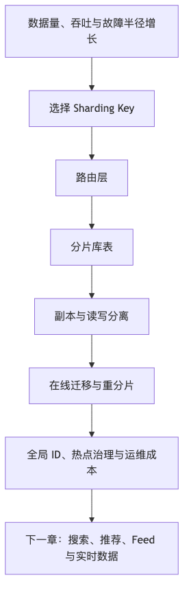

# 第 16 章：分库分表、复制与扩展

## 本章的问题链

先看原始问题：单库单表在早期很省心，但数据量、热点租户、写入吞吐和故障半径增长以后，它会同时变成性能瓶颈、扩容瓶颈和恢复瓶颈。

为了解决这个问题，本章讨论分片键、分库分表、读写分离、复制、全局 ID、在线迁移、重分片和分布式数据库，让数据层具备横向扩展能力。

但这不是终点：数据层扩展以后，业务通常不只需要主库查询。新的问题是：搜索、推荐、Feed 和实时分析会从事实数据中派生出更多读模型。

所以本章会按“问题 -> 机制 -> 新问题”的顺序展开：先把眼前的工程压力说清楚，再看对应机制解决了什么，最后讨论它留下的边界和下一步。



## 1. 本章解决什么问题

系统变大后，单数据库、单表、单主节点都会遇到边界。读 QPS 上升，可以加缓存和只读副本；写 QPS 上升，单主写入成为瓶颈；单表过大，索引维护、DDL、备份、恢复、迁移都会变慢；单租户或单商品变热，会拖垮全局；跨区域访问，延迟和合规又会进入设计。

分库分表不是“数据量大了就切一刀”。它是一组长期约束：

* 按什么键分片？
* 分片后如何查询？
* 如何保证唯一约束？
* 如何处理跨分片事务？
* 如何再分片？
* 如何迁移老数据？
* 如何定位数据在哪个分片？
* 如何处理热点分片？
* 运维团队能否管理这么多库表？
* 未来业务变化后，分片键是否仍然合理？

本章的核心观点是：**分片键是长期架构决策，不是性能参数。**

## 2. 小系统里为什么不明显

早期系统通常是：

```text
App -> Primary DB
          |
       Replica DB
```

读写分离后，读压力可以缓解。业务继续增长，订单表从百万到千万，再到十亿。问题逐渐出现：

* 单表索引膨胀，写入变慢。
* DDL 变得危险。
* 备份恢复时间超过 RTO。
* 主库 CPU、IO、连接数成为瓶颈。
* 只读副本延迟导致用户读不到刚写的数据。
* 大客户、热点商品、热点事件形成局部过载。
* 报表和后台查询扫描大量历史数据。
* 数据迁移窗口越来越小。

很多团队直到“不能再改”才开始分库分表。此时最难的不是把数据切开，而是让已有业务、历史数据、接口、报表、后台、消息、搜索、数仓都适配新路由。

## 3. 核心概念

### 3.1 垂直拆分与水平拆分

垂直拆分是按业务域拆库，比如用户库、订单库、支付库、库存库。它解决业务边界和团队协作问题，也降低单库复杂度。水平拆分是把同一类数据按某个分片键拆到多个库或表，比如按 `user_id` 或 `order_id` 分片。

```text
Vertical Split:
  user_db
  order_db
  payment_db

Horizontal Split:
  order_db_00.orders_00
  order_db_01.orders_01
  ...
```

垂直拆分通常应该先于水平拆分。因为如果业务边界都不清楚，水平切分只会把混乱复制到更多分片里。

### 3.2 Sharding Key

分片键决定数据分布、查询路径、热点风险和未来迁移成本。常见选择包括：

* `user_id`：适合用户维度查询。
* `tenant_id`：适合 SaaS 租户隔离。
* `order_id`：适合订单主键查询。
* `seller_id`：适合商家后台。
* 时间：适合日志、流水、归档。
* 组合键：适合同时处理分布与查询。

一个好的分片键应满足：

* 高基数。
* 分布均匀。
* 查询经常携带。
* 不容易形成热点。
* 长期稳定。
* 能支持扩容或再分片。

最危险的分片键是看起来符合当前查询，但隐藏热点。例如按 `sku_id` 分库存流水，在秒杀商品上会形成单分片热点。

### 3.3 Range、Hash、Directory-based Sharding

Range Sharding 按范围切分，比如用户 ID 1-1000 万在分片 A，1000-2000 万在分片 B。优点是范围查询方便，缺点是容易产生写热点和数据倾斜。

Hash Sharding 对分片键取哈希。优点是分布均匀，缺点是范围查询和再分片复杂。

Directory-based Sharding 通过路由表记录 key 到分片的映射。优点是灵活，适合大租户迁移和热点拆分；缺点是多一次路由查询，路由表本身要高可用。

### 3.4 读写分离与副本延迟

读写分离把读请求导到副本，写请求走主库。它能提升读扩展性，但引入读延迟问题。用户刚写完资料，下一次读副本可能看不到。解决办法包括：

* 写后短时间读主。
* 关键接口读主。
* 根据复制位点等待副本追上。
* 会话级一致性标记。
* 用户体验上展示“处理中”。

读写分离不是免费扩展，它把一致性问题暴露给应用。

### 3.5 再分片与在线迁移

再分片是分库分表最难的部分。Vitess 文档描述 resharding 时提到，它会在旧分片继续服务读写流量时复制、校验并保持新分片数据更新，切换时只需要短暂只读窗口；这类能力说明生产级再分片依赖复制、校验、增量同步、切流和回滚，而不是离线导一次数据就结束。([vitess.io][15])

## 4. 用户表从单表到分片的演进案例

第一阶段，单表：

```text
users(id, email, phone, name, created_at)
```

问题出现：用户过亿，按 `id` 点查还好，但注册写入、索引、备份、后台查询变慢。

第二阶段，垂直拆分：

```text
user_core(id, email, phone, status)
user_profile(user_id, avatar, nickname, gender)
user_security(user_id, password_hash, mfa_config)
```

先减少单表宽度和敏感字段暴露。

第三阶段，按 `user_id` 哈希分片：

```text
shard = hash(user_id) % 64

user_db_00.users_00
user_db_01.users_01
...
```

注册时生成全局 ID，再写入对应分片。按用户查询很快，但按 email 登录需要解决路由问题。可以增加全局索引表：

```text
user_login_index(email_hash, user_id, shard_id)
```

登录流程：

```text
email -> login_index -> user_id/shard_id -> user shard
```

这个全局索引必须保证唯一性。可以把 email 归一化后写入索引，并用唯一约束保护。注册流程要先占用索引，再写用户；失败时清理索引或通过补偿任务修复。

## 5. 订单表分库分表案例

订单有两类核心查询：

* 用户查自己的订单列表。
* 商家查自己店铺订单。
* 客服按订单号查订单。
* 履约按订单状态和时间扫描。

如果按 `user_id` 分片，用户查询很好，但商家后台可能跨分片。如果按 `seller_id` 分片，商家查询好，但用户订单跨多个商家。按 `order_id` 分片，点查好，但用户列表和商家列表都需要索引。

一种常见设计：

```text
orders 按 order_id hash 分片
user_order_index 按 user_id 分片
seller_order_index 按 seller_id 分片
```

写入路径：

```text
Create Order
  |
  +--> orders shard
  +--> user_order_index
  +--> seller_order_index
  +--> outbox_events
```

这引入冗余索引表。它们不是事实源，而是读模型。必须通过本地事务、Outbox、异步修复或对账确保索引表不长期偏离事实。

ASCII 架构：

```text
                 +----------------+
Client --------> | Order Service  |
                 +-------+--------+
                         |
        +----------------+----------------+
        |                                 |
        v                                 v
+---------------+                 +---------------+
| Route Service |                 | ID Generator  |
+-------+-------+                 +-------+-------+
        |                                 |
        v                                 |
+-------+---------------------------------+------+
|                 Sharded Order DB              |
|  orders_00 ... orders_63                      |
|  user_order_index_00 ...                      |
|  seller_order_index_00 ...                    |
+--------------------+--------------------------+
                     |
                     v
              Outbox / CDC / Events
```

## 6. 热点商品秒杀案例

秒杀场景是分片设计的压力测试。假设库存表按 `sku_id` 分片，秒杀商品所有请求都打到同一分片：

```text
stock shard = hash(sku_id) % N
```

结果：

* 单分片写锁冲突。
* 单行库存热点。
* Redis 热 key。
* 消息队列单分区热点。
* 数据库连接池耗尽。

改进思路：

1. 前端和网关限流，避免无效流量进入后端。
2. 活动库存单独建模，不直接打通用库存表。
3. 库存预热到专用库存服务或 Redis 原子计数。
4. 将库存拆成多个库存桶：

```text
stock_bucket(sku_id, bucket_id, available_qty)
bucket_id = hash(user_id) % 100
```

5. 每个用户请求路由到一个库存桶。
6. 最终通过异步汇总和对账修复。
7. 下单成功后再进入订单确认链路。

这种设计牺牲了简单性，换取热点写扩展。它不适合日常普通商品，但适合秒杀这种极端热点。

## 7. 全局 ID 与唯一约束

分片后，自增 ID 失去全局唯一性。常见方案：

| 方案             | 优点       | 代价         |
| -------------- | -------- | ---------- |
| UUID           | 简单、去中心化  | 长、索引局部性差   |
| Snowflake 类 ID | 趋势递增、可解码 | 依赖时钟、机器号治理 |
| 数据库号段          | 简单、趋势递增  | 号段服务可用性    |
| 分布式数据库内置 ID    | 平台化      | 依赖具体系统     |

唯一约束也变复杂。单库唯一索引不能保证全局唯一。email、手机号、订单号、租户域名这类全局唯一对象，需要全局索引、集中注册服务或按唯一字段分片。

## 8. 在线迁移方案

以订单表从单库迁移到分片为例：

```text
阶段 1：准备
  - 建新分片库表
  - 建路由服务
  - 增加双写能力，但默认关闭
  - 增加数据校验工具

阶段 2：历史数据迁移
  - 按主键范围批量复制
  - 控制速度，避免影响主库
  - 记录迁移水位

阶段 3：增量同步
  - 通过 CDC 同步迁移期间变更
  - 校验行数、校验 hash、抽样比对

阶段 4：影子读
  - 线上请求仍读旧库
  - 后台同时读新库比对结果

阶段 5：灰度读
  - 小比例用户读新库
  - 异常回退旧库

阶段 6：切写
  - 新写入走新库
  - 旧库进入只读或继续镜像

阶段 7：收尾
  - 停止旧链路
  - 归档旧库
  - 删除双写代码
```

在线迁移难在“业务不停”。必须可暂停、可回滚、可校验。双写不是安全感来源，而是风险来源：双写期间如果两边不一致，必须有事实源和修复策略。

## 9. 分布式数据库：什么时候该上，什么时候不该上

分布式 SQL 数据库可以提供自动分片、复制、高可用、SQL 接口和分布式事务。TiDB 文档描述其架构分离计算和存储，可在线扩缩计算或存储容量；这类能力很适合希望降低手工分库分表复杂度的团队。([docs.pingcap.com][16])

但分布式数据库不是“无脑替代 MySQL”。需要评估：

* 业务是否真的遇到单机写瓶颈？
* 团队是否能理解分布式事务延迟和重试？
* 热点行和热点索引是否仍然存在？
* 跨区域延迟是否可接受？
* 生态、驱动、运维工具是否成熟？
* 成本是否比手工分片更可控？
* 故障时团队能否排查？

如果系统还在早期，业务边界不清，贸然上分布式数据库可能只是把复杂度藏到黑盒里。

## 10. 可观测性与运维

分片系统需要额外观测：

| 类别 | 指标                 |
| -- | ------------------ |
| 路由 | 路由错误率、未知分片、路由表延迟   |
| 分布 | 分片数据量、QPS、写入量、热点分片 |
| 复制 | 副本延迟、复制中断、日志积压     |
| 查询 | 跨分片查询比例、聚合耗时       |
| 事务 | 跨分片事务数、失败率、重试率     |
| 迁移 | 迁移水位、校验差异、CDC 延迟   |
| ID | ID 生成延迟、时钟回拨、号段耗尽  |
| 容量 | 单分片磁盘水位、连接数、CPU、IO |

分片系统还要有运维工具：按 ID 定位分片、按租户迁移、分片扩容、热点识别、数据校验、批量修复、只读开关、切流开关。

## 11. 安全、成本与治理影响

分片后，权限和审计变复杂。运维人员可能需要访问多个库；后台工具可能跨分片查询；数据导出可能漏分片或重复导出。需要统一的访问入口和审计。

成本方面，分片会带来更多实例、副本、连接、备份、监控、告警和迁移成本。读写分离和副本不是免费容量，副本延迟和故障切换都要治理。

## 12. 分片设计 Checklist

* 是否先做了业务垂直拆分？
* 分片键是否高基数、稳定、常用于查询？
* 是否评估热点风险？
* 是否设计跨分片查询方案？
* 是否设计全局唯一 ID？
* 是否设计全局唯一约束？
* 是否处理读写分离后的读延迟？
* 是否有再分片路线？
* 是否有在线迁移、校验和回滚方案？
* 是否有按分片维度的监控？
* 是否有后台和数据导出适配方案？
* 是否有租户或大客户迁移能力？
* 是否避免让业务代码到处写路由逻辑？

## 13. 典型失败模式

1. 分片键选错，后续所有查询都跨分片。
2. 按时间分片导致最新分片写热点。
3. 按租户分片，大租户拖垮单分片。
4. 全局唯一约束缺失，出现重复账号或订单号。
5. 读写分离导致用户读不到刚写数据。
6. 跨分片事务过多，分片失去意义。
7. 在线迁移无校验，切流后发现数据不一致。
8. 双写失败无修复，长期两边不一致。
9. 连接数随分片数爆炸。
10. 运维工具缺失，事故时找不到数据在哪。

## 14. 本章小结

分库分表是扩展手段，也是长期复杂度来源。它解决单库、单表、单主瓶颈，但会引入路由、跨分片查询、全局约束、在线迁移、热点治理和运维成本。生产级分片设计的关键不是“拆成多少片”，而是选对分片键，控制跨分片操作，并为未来再分片和迁移留路。

## 15. 本章最重要的 5 个判断

1. 分片键是长期架构决策，选错会长期付费。
2. 垂直拆分通常应该先于水平拆分。
3. 读写分离解决读扩展，但引入读一致性问题。
4. 在线迁移必须可校验、可暂停、可回滚。
5. 分布式数据库能降低部分复杂度，但不能消除热点、重试和业务建模问题。

---

[1]: https://docs.opensearch.org/latest/getting-started/intro/ "Intro to OpenSearch - OpenSearch Documentation"
[2]: https://clickhouse.com/ "ClickHouse: Fast Open-Source OLAP DBMS"
[3]: https://www.mongodb.com/docs/manual/data-modeling/ "Data Modeling in MongoDB - Database Manual"
[4]: https://neo4j.com/docs/getting-started/appendix/graphdb-concepts/ "Graph database concepts - Getting Started"
[5]: https://docs.aws.amazon.com/AmazonS3/latest/userguide/Welcome.html "What is Amazon S3? - Amazon Simple Storage Service"
[6]: https://www.postgresql.org/docs/current/continuous-archiving.html "25.3. Continuous Archiving and Point-in-Time Recovery ..."
[7]: https://cassandra.apache.org/doc/latest/cassandra/developing/data-modeling/intro.html "Introduction | Apache Cassandra Documentation"
[8]: https://developer.mozilla.org/en-US/docs/Web/HTTP/Reference/Headers/Cache-Control "Cache-Control header - HTTP - MDN Web Docs"
[9]: https://memcached.org/ "memcached - a distributed memory object caching system"
[10]: https://redis.io/docs/latest/commands/expire/ "EXPIRE | Docs"
[11]: https://redis.io/docs/latest/commands/info/ "INFO | Docs"
[12]: https://www.postgresql.org/docs/current/transaction-iso.html "PostgreSQL: Documentation: 18: 13.2. Transaction Isolation"
[13]: https://debezium.io/documentation/reference/stable/transformations/outbox-event-router.html "Outbox Event Router :: Debezium Documentation"
[14]: https://www.cockroachlabs.com/docs/stable/transaction-retry-error-reference "Transaction Retry Error Reference"
[15]: https://vitess.io/docs/archive/22.0/reference/features/sharding/ "The Vitess Docs | Sharding"
[16]: https://docs.pingcap.com/tidb/stable/overview "What is TiDB Self-Managed"
[17]: https://debezium.io/documentation/reference/stable/ "Debezium Documentation :: Debezium Documentation"
[18]: https://kafka.apache.org/documentation/ "Introduction | Apache Kafka"
[19]: https://nightlies.apache.org/flink/flink-docs-stable/docs/concepts/time/ "Timely Stream Processing | Apache Flink"
[20]: https://lamport.azurewebsites.net/pubs/time-clocks.pdf "Time, Clocks, and the Ordering of Events in a Distributed System"
[21]: https://etcd.io/docs/v3.6/learning/why/ "etcd versus other key-value stores | etcd"
[22]: https://raft.github.io/raft.pdf "In Search of an Understandable Consensus Algorithm"
[23]: https://etcd.io/docs/v3.6/learning/api_guarantees/ "etcd API guarantees | etcd"
[24]: https://zookeeper.apache.org/ "Apache ZooKeeper"
[25]: https://kubernetes.io/docs/concepts/overview/components/ "Kubernetes Components"
[26]: https://developer.hashicorp.com/consul/docs/concept/consensus "Consensus | Consul"
