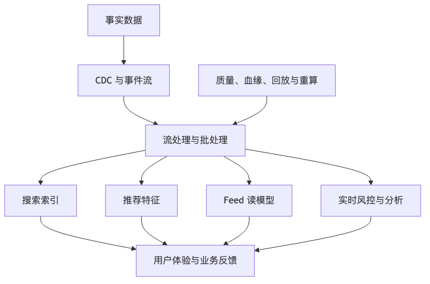

# 第 17 章：搜索、推荐、Feed 与实时数据

## 本章的问题链

先看原始问题：真实产品不只需要按主键查订单、查用户。用户还要搜索内容、看到个性化推荐、刷新 Feed、收到实时通知，业务还要基于实时数据做风控和运营。事实库无法独自承担这些体验。

为了解决这个问题，本章用 CDC、事件流、搜索索引、特征系统、Feed 架构、实时数仓和物化视图，把事实数据加工成面向体验和决策的派生数据。

但这不是终点：派生系统越多，新的问题越明显：谁来保证顺序、谁来协调主从关系、谁来管理锁、配置、选主和全局时间边界。

所以本章会按“问题 -> 机制 -> 新问题”的顺序展开：先把眼前的工程压力说清楚，再看对应机制解决了什么，最后讨论它留下的边界和下一步。



## 1. 本章解决什么问题

现代互联网产品越来越不像简单 CRUD。用户打开 App，不只是读取一条数据库记录，而是进入一个实时数据系统：搜索要理解关键词、过滤条件、排序和个性化；推荐要结合长期画像、实时行为、上下文和实验策略；Feed 要在关注关系、热度、推荐、广告和风控之间动态组合；风控要在毫秒到秒级判断交易风险；运营分析希望几分钟内看到活动效果。

这些系统都依赖实时数据。它们的共同特点是：

* 数据来自多个源。
* 数据会乱序、迟到、重复。
* 结果通常是派生数据，不是事实源。
* 延迟、吞吐、质量和成本之间存在强权衡。
* 错误不一定表现为接口失败，而是“结果变差”。

本章讨论搜索、推荐、Feed、CDC、流处理、特征平台、实时数仓、数据质量、回放和重算。

## 2. 小系统里为什么不明显

小系统里，搜索可以直接 SQL：

```sql
SELECT * FROM products
WHERE title LIKE '%phone%'
ORDER BY created_at DESC
LIMIT 20;
```

推荐可以做“热门商品”，Feed 可以按发布时间倒序，风控可以写几个规则。数据量小、用户少、业务简单，一切都还像 CRUD。

大系统里，问题变了：

* 搜索要分词、纠错、同义词、排序、过滤、权限、个性化。
* Feed 要处理上亿用户、关注关系、内容发布、互动、推荐插入。
* 推荐要同时使用离线特征和实时特征。
* 风控要在支付前判断设备、账号、行为、地理位置、历史模式。
* 数据链路延迟会直接影响业务效果。
* 数据质量问题会变成推荐偏差、误杀、漏召回、广告损失。

此时数据库查询不再是搜索系统，定时脚本不再是实时系统，简单队列也不再足够支撑数据链路治理。

## 3. 核心概念

### 3.1 搜索系统与数据库查询的区别

数据库查询通常围绕结构化字段、事务事实和精确匹配。搜索系统围绕文本、相关性、召回、排序、过滤和用户意图。搜索索引不是数据库索引的简单放大版。OpenSearch 文档说明一个索引会被拆成 shard，并且每个 shard 实际上是一个 Lucene index；副本 shard 既能提供故障备份，也能提升搜索请求处理能力，但 shard 过多会消耗 CPU 和内存。([OpenSearch Documentation][1])

搜索系统关注：

* Query Rewrite：查询改写。
* Analyzer：分词、归一化。
* Inverted Index：倒排索引。
* BM25：关键词相关性。
* Filter：结构化过滤。
* Ranking：排序。
* Personalization：个性化。
* Freshness：新鲜度。
* Recall / Precision：召回和准确。
* Indexing Delay：索引延迟。
* Reindex：重建索引。

搜索事故常常不是“服务挂了”，而是“结果差了”：新商品搜不到、下架商品还出现、违规内容被召回、排序突然偏向低质量内容。

### 3.2 推荐系统：离线与实时结合

推荐系统通常分为召回、粗排、精排、重排：

```text
Candidate Retrieval -> Ranking -> Re-ranking -> Delivery
```

离线特征包括用户长期兴趣、内容标签、历史点击、购买、关注关系。实时特征包括刚浏览、刚点赞、刚加购、刚搜索、当前地理位置、当前设备、当前时间。只靠离线特征，推荐会迟钝；只靠实时特征，推荐会不稳定。

特征平台的价值是让训练和线上服务使用一致的特征定义，避免训练服务偏差。实时特征系统要处理乱序、迟到、重复和过期。

### 3.3 Feed：推、拉、推拉结合

Feed 系统看似只是“按时间线展示内容”，实际很难。

推模式：作者发布内容时，把内容 ID 推到粉丝收件箱。

```text
publish -> fanout -> inbox(user_id)
```

优点是读快，缺点是大 V 发布会造成写放大。

拉模式：用户打开 Feed 时，读取关注作者的内容并合并排序。

```text
open feed -> fetch followees' posts -> merge sort
```

优点是写轻，缺点是读重。

推拉结合：普通作者用推，大 V 用拉，推荐内容另行插入。这是常见折中。

Feed 难在多目标：新鲜度、相关性、多样性、广告、风控、屏蔽、已读、实验、召回成本都要同时考虑。

### 3.4 CDC、事件流与实时处理

CDC，Change Data Capture，把数据库变化转成事件流。Debezium 官方文档说明它会捕获数据库表的行级变化，并以变化事件流形式记录，应用可以按事件发生顺序读取这些变化。([Debezium][17])

典型 CDC 链路：

```text
OLTP DB
  |
  | binlog / WAL / oplog
  v
Debezium / CDC Connector
  |
  v
Kafka Topic
  |
  +--> Search Indexer
  +--> Flink Realtime Job
  +--> Data Lake
  +--> Feature Store
```

Kafka 这类事件流系统通过 topic、partition、consumer group、offset 支撑高吞吐事件处理；官方文档介绍 Kafka topic 会分成 partition，从而让数据分布到多个 broker 上。([Apache Kafka][18])

### 3.5 Event Time、Watermark、迟到数据

实时系统里有两种时间：处理时间和事件时间。Flink 官方文档说明，处理时间是执行机器的系统时间，事件时间是事件发生在生产设备上的时间；事件时间程序需要通过 watermark 表示事件时间进展。watermark 声明某个时间点之前的事件理论上已经到达，用于处理乱序流。([Apache Nightlies][19])

现实中迟到数据不可避免。Flink 文档也指出，在真实环境中某些元素可能任意延迟，watermark 之后仍可能出现更早时间戳的元素，因此流程序需要显式处理 late elements。([Apache Nightlies][19])

这对业务意味着：实时聚合结果不是绝对事实，而是带有延迟窗口和修正机制的结果。

## 4. CDC 数据链路 ASCII 图

```text
              +----------------+
              |  OLTP DB       |
              |  orders/users  |
              +-------+--------+
                      |
                 WAL / Binlog
                      |
              +-------v--------+
              | Debezium CDC   |
              +-------+--------+
                      |
                  Kafka Topics
       +--------------+---------------+
       |              |               |
+------v-----+  +-----v------+  +-----v------+
| Search     |  | Flink Job  |  | Data Lake  |
| Indexer    |  | Features   |  | Warehouse  |
+------+-----+  +-----+------+  +-----+------+
       |              |               |
+------v-----+  +-----v------+  +-----v------+
| OpenSearch |  | Feature    |  | BI / ML    |
|            |  | Store      |  |            |
+------------+  +------------+  +------------+
```

关键控制点：

* CDC 是否能从断点恢复？
* Topic 是否按业务 key 分区？
* Schema 变更如何兼容？
* 下游是否幂等？
* 数据延迟如何观测？
* 错误数据是否能回放？
* 历史数据如何重算？
* 删除事件是否传播到搜索、特征和数仓？

## 5. 电商搜索系统案例

电商搜索的事实源是商品库，但搜索服务不能直接查商品库。搜索索引需要商品标题、类目、品牌、属性、价格、库存、销量、评价、商家、上下架状态、风控标签等数据。

架构：

```text
Product DB ---- CDC ----+
Price Service -- Event -+--> Product Index Builder --> OpenSearch
Stock Service -- Event -+
Review System -- Event -+
Risk System ---- Event -+
```

查询路径：

```text
User Query
  |
Search API
  |
Query Rewrite / Spell Correct / Synonym
  |
Recall from Search Index
  |
Filter: tenant/region/status/stock
  |
Ranking: BM25 + business score + personalization
  |
Result Assembly
```

典型权衡：

* 新商品上架后多久可搜到？
* 下架商品是否必须立即不可搜？
* 价格和库存是否在索引里，还是查询时实时补？
* 搜索结果排序是否可解释？
* 业务干预是否影响用户体验？
* 索引重建期间如何服务查询？

错误设计是把数据库表结构直接映射到搜索文档。改进设计是面向搜索场景构建文档：

```json
{
  "product_id": "...",
  "title": "...",
  "category_path": ["electronics", "phone"],
  "brand": "...",
  "attributes": {...},
  "search_text": "...",
  "region_availability": {...},
  "status": "ONLINE",
  "risk_flags": [],
  "ranking_features": {
    "sales_7d": 1234,
    "rating": 4.8,
    "freshness": 0.9
  },
  "updated_at": "..."
}
```

搜索文档是读模型，不是数据库表镜像。

## 6. 短视频 Feed 系统案例

短视频 Feed 通常同时包含关注 Feed、推荐 Feed 和运营插入。

```text
User opens app
  |
Feed API
  |
+----------------+------------------+
| Follow Feed    | Recommendation   |
| Timeline       | Candidate Pool   |
+-------+--------+---------+--------+
        |                  |
        v                  v
    Merge / Rank / Dedup / Diversity / Policy
        |
        v
    Video Metadata + Playback URL
```

推拉结合：

* 普通作者发布视频时，推到粉丝 inbox。
* 大 V 不全量推，用户打开时从作者 outbox 拉取。
* 推荐候选由推荐系统实时生成。
* 已看、屏蔽、低质、违规、广告频控在重排阶段处理。

核心难点：

* 大 V fanout 写放大。
* 用户长期不活跃，inbox 堆积。
* 新内容冷启动。
* 实时互动特征延迟。
* 重复内容去重。
* 风控下架后全链路移除。
* 实验策略影响排序。
* 推荐结果质量下降但接口无错误。

Feed 系统最容易被误判的地方是：把 Timeline 当数据库表。真正的 Timeline 是派生读模型，随策略变化不断重建。它应该允许过期、回填、重算和降级。

## 7. 实时风控特征系统案例

支付风控需要在用户点击支付后很短时间内判断风险。特征包括：

* 账号注册时间。
* 设备指纹。
* IP 地理位置。
* 最近 5 分钟失败次数。
* 最近 24 小时支付金额。
* 商户风险等级。
* 历史拒付率。
* 行为序列异常。
* 黑名单和白名单。

架构：

```text
Login Events ----+
Payment Events --+--> Kafka --> Flink --> Realtime Feature Store
Device Events ---+
Risk Labels -----+

Payment Request --> Risk Service --> Feature Store + Rules + Model
```

特征系统要处理：

* 事件乱序：支付事件先到，登录事件后到。
* 迟到数据：移动端弱网导致事件延迟。
* 重复事件：客户端重试、服务端重放。
* 窗口计算：5 分钟、1 小时、24 小时。
* 特征过期：老特征不能长期影响风控。
* 回放重算：规则错误后重新计算特征。
* 线上离线一致：训练和推理特征定义一致。

风控的错误结果有业务成本。误杀影响转化，漏放造成资金损失。因此实时特征系统的指标不仅是延迟，还包括特征缺失率、迟到比例、模型输入异常率、规则命中分布变化。

## 8. Lambda、Kappa、实时数仓与湖仓

Lambda 架构把数据分成批处理和流处理两条链路：批处理保证准确性，流处理保证低延迟。代价是两套逻辑容易不一致。

Kappa 架构只保留流处理链路，通过事件日志回放重算。优点是架构统一，代价是事件保留、回放能力、状态管理要求更高。

实时数仓希望把业务事件快速转成可查询的分析表。湖仓把数据湖的低成本和数据仓库的表管理、事务、治理能力结合。不要因为名词新就忽视基本问题：数据质量、血缘、延迟、成本、权限和重算。

## 9. 数据质量、血缘、回放与重算

实时系统最大风险之一是“看起来正常”。任务在跑，延迟正常，但数据错了。常见数据质量问题：

* 上游字段含义变化。
* 枚举新增，下游未处理。
* 时间戳单位从秒变毫秒。
* 重复事件未去重。
* 删除事件未传播。
* Schema 兼容性破坏。
* 迟到数据被丢弃。
* 回放时使用了当前维表，污染历史结果。

数据血缘要回答：这个指标来自哪些源表、哪些事件、哪些任务、哪些版本、哪些规则。回放和重算是实时系统的安全网。没有回放能力，错误数据只能人工补洞。

## 10. 可观测性与运维

实时数据系统至少要观测：

| 类别   | 指标                           |
| ---- | ---------------------------- |
| 延迟   | 端到端延迟、Kafka lag、处理延迟、索引延迟    |
| 吞吐   | 输入 QPS、输出 QPS、背压             |
| 质量   | 空值率、重复率、迟到率、Schema 错误        |
| 状态   | Flink checkpoint 耗时、失败率、状态大小 |
| 搜索   | 索引延迟、查询 P99、无结果率、召回率         |
| 推荐   | CTR、CVR、停留时长、负反馈、实验护栏        |
| Feed | 打开成功率、首屏延迟、重复率、内容多样性         |
| 风控   | 特征缺失率、规则命中分布、误杀/漏放反馈         |
| 成本   | Topic 存储、状态后端、索引大小、计算资源      |

Flink 官方把 state、checkpoint、savepoint、故障恢复等作为状态与容错能力的一部分；这类能力是实时任务可恢复和可重算的基础，而不是高级可选项。([Apache Nightlies][19])

## 11. 安全、成本与治理影响

搜索、推荐和实时数据链路经常复制敏感数据。用户行为、地理位置、设备信息、订单金额、风险标签都可能进入 Kafka、Flink 状态、特征库、搜索索引、数仓和日志。必须做：

* 数据分类。
* 字段脱敏。
* 权限控制。
* 租户隔离。
* 删除传播。
* 访问审计。
* 数据保留期。
* 训练数据授权。

成本方面，实时系统尤其容易失控：Kafka 长保留、Flink 大状态、搜索副本、向量索引、特征存储、数据湖小文件、重复链路都会放大成本。每条实时链路都要回答：业务价值是否值得这个延迟目标？

## 12. 实时数据系统 Checklist

* 是否区分事实源、事件流、派生读模型？
* 事件是否有唯一 ID、版本、时间戳和业务 key？
* 是否处理乱序、迟到、重复？
* 是否定义端到端延迟目标？
* 是否有 Schema 演进和兼容规则？
* 是否有回放和重算能力？
* 是否有数据质量校验？
* 是否有血缘记录？
* 搜索索引是否支持删除和重建？
* 推荐特征是否保证训练和线上一致？
* Feed 是否有降级策略？
* 风控特征是否可解释、可审计？
* 是否评估实时链路成本？

## 13. 典型失败模式

1. 把数据库表结构直接暴露成事件。
2. 搜索索引更新失败，用户搜不到新商品。
3. 删除事件未同步，违规内容仍在搜索或 Feed 出现。
4. Kafka lag 增长但无告警，实时变准实时。
5. Flink checkpoint 失败，任务恢复后重复输出。
6. 迟到数据处理不当，窗口指标错误。
7. 推荐特征线上离线不一致，模型效果下降。
8. Feed 大 V fanout 打爆队列。
9. 风控特征缺失默认放行，造成资损。
10. 没有回放能力，错误指标无法修复。

## 14. 本章小结

搜索、推荐、Feed 和实时数据系统的核心不是某个框架，而是把业务事实转化为可查询、可排序、可重算、可治理的派生数据。实时系统一定会面对乱序、迟到、重复、延迟和质量问题。生产级设计必须同时考虑召回质量、端到端延迟、回放重算、数据治理和成本。

## 15. 本章最重要的 5 个判断

1. 搜索索引、Feed Timeline、推荐特征都是派生读模型，不是事实源。
2. CDC 能降低侵入性，但不能替代事件建模和 Schema 治理。
3. 实时系统必须设计乱序、迟到、重复和回放。
4. 推荐和风控系统的故障常表现为结果变差，而不是接口报错。
5. 数据质量、血缘和重算能力是实时系统的可靠性基础。

---

[1]: https://docs.opensearch.org/latest/getting-started/intro/ "Intro to OpenSearch - OpenSearch Documentation"
[2]: https://clickhouse.com/ "ClickHouse: Fast Open-Source OLAP DBMS"
[3]: https://www.mongodb.com/docs/manual/data-modeling/ "Data Modeling in MongoDB - Database Manual"
[4]: https://neo4j.com/docs/getting-started/appendix/graphdb-concepts/ "Graph database concepts - Getting Started"
[5]: https://docs.aws.amazon.com/AmazonS3/latest/userguide/Welcome.html "What is Amazon S3? - Amazon Simple Storage Service"
[6]: https://www.postgresql.org/docs/current/continuous-archiving.html "25.3. Continuous Archiving and Point-in-Time Recovery ..."
[7]: https://cassandra.apache.org/doc/latest/cassandra/developing/data-modeling/intro.html "Introduction | Apache Cassandra Documentation"
[8]: https://developer.mozilla.org/en-US/docs/Web/HTTP/Reference/Headers/Cache-Control "Cache-Control header - HTTP - MDN Web Docs"
[9]: https://memcached.org/ "memcached - a distributed memory object caching system"
[10]: https://redis.io/docs/latest/commands/expire/ "EXPIRE | Docs"
[11]: https://redis.io/docs/latest/commands/info/ "INFO | Docs"
[12]: https://www.postgresql.org/docs/current/transaction-iso.html "PostgreSQL: Documentation: 18: 13.2. Transaction Isolation"
[13]: https://debezium.io/documentation/reference/stable/transformations/outbox-event-router.html "Outbox Event Router :: Debezium Documentation"
[14]: https://www.cockroachlabs.com/docs/stable/transaction-retry-error-reference "Transaction Retry Error Reference"
[15]: https://vitess.io/docs/archive/22.0/reference/features/sharding/ "The Vitess Docs | Sharding"
[16]: https://docs.pingcap.com/tidb/stable/overview "What is TiDB Self-Managed"
[17]: https://debezium.io/documentation/reference/stable/ "Debezium Documentation :: Debezium Documentation"
[18]: https://kafka.apache.org/documentation/ "Introduction | Apache Kafka"
[19]: https://nightlies.apache.org/flink/flink-docs-stable/docs/concepts/time/ "Timely Stream Processing | Apache Flink"
[20]: https://lamport.azurewebsites.net/pubs/time-clocks.pdf "Time, Clocks, and the Ordering of Events in a Distributed System"
[21]: https://etcd.io/docs/v3.6/learning/why/ "etcd versus other key-value stores | etcd"
[22]: https://raft.github.io/raft.pdf "In Search of an Understandable Consensus Algorithm"
[23]: https://etcd.io/docs/v3.6/learning/api_guarantees/ "etcd API guarantees | etcd"
[24]: https://zookeeper.apache.org/ "Apache ZooKeeper"
[25]: https://kubernetes.io/docs/concepts/overview/components/ "Kubernetes Components"
[26]: https://developer.hashicorp.com/consul/docs/concept/consensus "Consensus | Consul"
