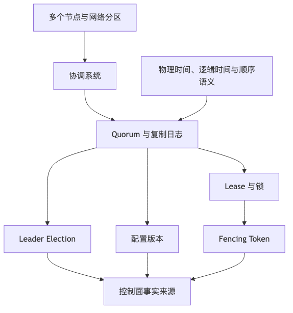

# 第 18 章：分布式协调、共识与时间

## 本章的问题链

先看原始问题：多节点系统总要回答一些控制面问题：谁是主节点，谁拿到了锁，配置以哪个版本为准，任务只能被谁执行，故障时如何避免两个节点都以为自己说了算。

为了解决这个问题，本章从 ZooKeeper、etcd、Consul、Raft、quorum、lease、fencing token 和时间语义出发，解释分布式协调如何给控制面提供可依赖的事实来源。

但这不是终点：协调系统只解决一部分控制问题。新的问题是：当服务规模继续扩大，团队需要一个统一的运行时平台来承载部署、调度、自愈和资源治理。

所以本章会按“问题 -> 机制 -> 新问题”的顺序展开：先把眼前的工程压力说清楚，再看对应机制解决了什么，最后讨论它留下的边界和下一步。



## 1. 本章解决什么问题

分布式系统里，很多问题最后都会变成协调问题：

* 谁是主节点？
* 哪个任务实例应该执行定时任务？
* 配置当前版本是什么？
* 服务实例是否还活着？
* 锁归谁？
* 租约是否过期？
* 当前事件顺序是什么？
* 集群元数据是否一致？
* 网络分区时谁应该继续服务？
* 两个节点同时认为自己是主怎么办？

这些问题看似基础，却非常容易出事故。很多团队遇到并发问题时第一反应是“加个分布式锁”。这句话危险得很。分布式锁不是本地锁的远程版。它涉及网络延迟、客户端暂停、GC、时钟漂移、锁过期、脑裂、重试、幂等和资源侧保护。没有 fencing token 的锁，经常只是在制造错觉。

本章讨论时钟、逻辑时钟、Leader Election、Lease、Fencing Token、Raft、Paxos、Gossip、服务注册、配置中心、元数据系统、ZooKeeper、etcd、Consul 和 Kubernetes 控制面。

## 2. 小系统里为什么不明显

单进程系统里，锁很简单：

```text
mutex.lock()
critical_section()
mutex.unlock()
```

单数据库系统里，可以用行锁、唯一约束、事务隔离解决很多问题。单实例定时任务也不会抢占。配置文件本地读取即可。

多实例之后，问题立刻出现：

```text
Instance A: cron job
Instance B: cron job
Instance C: cron job
```

如果三个实例都执行同一个结算任务，就可能重复扣款、重复发券、重复发通知。于是团队加 Redis 锁：

```text
SET lock job_id NX EX 60
```

这看起来能解决问题，但如果任务执行 90 秒，锁 60 秒过期，另一个实例获得锁，两个实例就会同时执行。即使续约，如果客户端 GC 暂停或网络抖动，也可能在自己以为持锁时，服务端已经撤销锁。

## 3. 核心概念

### 3.1 物理时钟、逻辑时钟、Lamport Clock、Vector Clock

物理时钟是机器上的时间。它会漂移、跳变、被 NTP 调整，不适合直接作为全局顺序依据。用时间戳排序分布式事件，只有在你能接受误差和并发不确定性时才成立。

Lamport 在经典论文《Time, Clocks, and the Ordering of Events in a Distributed System》中讨论了分布式系统中事件的 “happened-before” 偏序关系，并提出逻辑时钟来帮助排序事件；这说明分布式系统里的“先后”不是看墙上时间，而是看因果关系。([lamport.azurewebsites.net][20])

Lamport Clock 能给事件一个逻辑时间，但不能判断并发事件是否真的有因果关系。Vector Clock 可以表示多个节点的版本向量，从而判断某些事件是否并发，但存储和比较成本更高。

### 3.2 Leader Election

Leader Election 用于在多个节点中选出一个主节点执行协调工作，比如调度任务、写元数据、分配分片。Leader Election 的关键不是“谁抢到就是谁”，而是：

* 同一时刻最多一个有效 leader。
* leader 失效后能选出新 leader。
* 旧 leader 恢复后不能继续写坏数据。
* 资源侧能拒绝过期 leader。

最后一点就是 fencing token 的价值。

### 3.3 Lease 与锁

锁表达“我拥有互斥访问权”。Lease 表达“在某个时间窗口内，我被授予某种权利”。Lease 依赖时间，因此天然受时钟和暂停影响。etcd 文档特别指出，lease 的 TTL 是物理时间间隔，服务端和客户端用各自时钟衡量时间，因此可能出现服务端撤销 lease 但客户端仍认为自己拥有 lease 的情况；文档还说明 lease 本身不保证互斥，正确互斥需要版本号校验等机制。([etcd][21])

因此，分布式锁不能只看“锁是否存在”，还要看资源操作是否携带可比较的 fencing token。

### 3.4 Fencing Token

Fencing Token 是单调递增的令牌。每次获得锁或 lease，协调系统返回一个更大的 token。资源服务只接受比已见 token 更新的请求。

```text
A obtains lock, token=10
A pauses
lock expires
B obtains lock, token=11
B writes resource with token=11 -> accepted
A resumes
A writes resource with token=10 -> rejected
```

没有 fencing token，旧持锁者恢复后可能继续写。分布式锁真正保护资源，必须让资源本身参与校验。

### 3.5 共识：Raft 与 Paxos

共识算法解决多个节点在故障和网络延迟下对一系列值达成一致的问题。Raft 论文把共识拆成 leader election、log replication、safety 等部分，目标是提供与 Paxos 等价的复制日志结果，同时更易理解。([Raft][22])

工程上，不需要每个业务工程师证明 Raft，但需要理解它的意义：

* 多数派提交。
* 少数派不能单独决定。
* leader 负责复制日志。
* 网络分区时只有多数派侧能继续提交。
* 节点恢复后按日志追赶。
* 共识系统适合存元数据、配置、锁、选主，不适合存海量业务数据。

etcd 文档说明其 KV API 提供持久性和严格可串行化，操作按 revision 形成总序；同时文档也提醒，线性化读需要经过 Raft 共识过程，低延迟读可以选择 serializable 模式但可能读到相对 quorum 的旧数据。([etcd][23])

### 3.6 Gossip

Gossip 不是强一致共识，而是节点间传播状态的协议。它适合成员发现、健康信息传播、最终一致元数据扩散。优点是可扩展、去中心化；缺点是收敛需要时间，不适合要求线性一致的锁、选主和配置提交。

## 4. 协调系统：ZooKeeper、etcd、Consul、Kubernetes 控制面

ZooKeeper 官方描述它用于维护配置信息、命名、分布式同步和组服务。它在 Hadoop 生态和早期分布式系统中非常常见。([zookeeper.apache.org][24])

etcd 是强一致分布式 KV，常用于 Kubernetes 元数据。Kubernetes 文档把 etcd 描述为保存所有 API server 数据的一致且高可用的 key-value store；这意味着 Kubernetes 控制面本质上也依赖一个可靠元数据系统。([Kubernetes][25])

Consul 同时提供服务发现、健康检查、KV 和多数据中心能力。HashiCorp 文档说明 Consul 使用 Raft 管理分布式数据中心操作。([HashiCorp Developer][26])

选择协调系统要看场景：

| 场景              | 需要什么                         |
| --------------- | ---------------------------- |
| 配置一致发布          | 强一致 KV、版本、watch              |
| 服务发现            | 健康检查、注册、DNS/API              |
| Leader Election | lease、session、watch          |
| 分布式锁            | lease + fencing token + 资源校验 |
| 元数据系统           | 强一致、小数据、低延迟                  |
| 大规模业务数据         | 不应放协调系统                      |
| 节点状态传播          | Gossip 可选                    |

## 5. 案例一：定时任务多实例抢占执行

问题：订单系统有一个“关闭超时未支付订单”的任务。服务部署 10 个实例。不能让 10 个实例都扫描和关闭同一批订单。

错误方案：

```text
每个实例每分钟扫描 orders where status='UNPAID' and expired_at < now()
```

结果：重复关闭、重复释放库存、重复发消息。即使 SQL update 加条件，也会造成大量无效竞争。

改进方案一：数据库分片抢占。

```sql
UPDATE scheduled_tasks
SET owner = ?, version = version + 1, lease_until = ?
WHERE task_name = 'close_unpaid_order'
  AND lease_until < now();
```

任务执行时带 version。每次处理订单要幂等：

```sql
UPDATE orders
SET status='CLOSED'
WHERE id=? AND status='UNPAID';
```

改进方案二：使用协调系统选主 + fencing token。

```text
Instance A -> etcd election -> token=101
A executes job with token=101
Resource DB records last_token
If token < last_token: reject
```

任务还要切片，避免单 leader 扫全表：

```text
shard_id = hash(order_id) % 128
workers process assigned shards
```

正确设计不是只选一个 leader，而是把任务幂等、资源校验、超时恢复、分片处理和观测一起做。

## 6. 案例二：分布式锁错误使用事故

某系统使用 Redis 锁保护“生成月度账单”：

```text
SET billing_lock NX EX 300
generate_bills()
DEL billing_lock
```

账单生成通常 2 分钟，但某月数据量变大，任务运行 8 分钟。5 分钟时锁过期，另一个实例获得锁并开始生成。两个实例同时写账单表。因为账单表没有业务唯一约束，最终生成重复账单。后续支付和发票系统都消费了重复账单事件。

事故根因：

* 锁 TTL 小于任务最长时间。
* 没有续约或续约失败处理。
* 没有 fencing token。
* 资源表没有唯一约束。
* 任务本身不幂等。
* 下游事件没有去重。
* 无人工审核前置。

改进：

```text
billing_period unique key
billing_run(id, period, token, status)
each write carries token
DB rejects stale token
bill(period, customer_id) unique
events carry run_id and event_id
consumer inbox dedupe
```

锁只作为减少竞争的优化，真正的一致性由唯一约束、状态机、token 和幂等保证。

## 7. 案例三：配置中心设计

配置中心看似简单，其实是典型协调系统。

需求：

* 配置按应用、环境、租户、区域隔离。
* 配置变更有版本。
* 灰度发布。
* 客户端 watch。
* 回滚。
* 审计。
* 故障时客户端使用最后可用配置。
* 配置中心不可用不能拖垮业务服务。

架构：

```text
                +------------------+
Admin Portal -> | Config Service   |
                +--------+---------+
                         |
                         v
                  +------+------+
                  | etcd / DB   |
                  +------+------+
                         |
                  watch / poll
                         |
        +----------------+----------------+
        |                                 |
+-------v--------+                +-------v--------+
| App Instance A |                | App Instance B |
| local snapshot |                | local snapshot |
+----------------+                +----------------+
```

设计要点：

* 配置写入强一致存储。
* 每次发布生成版本号。
* 客户端只接受版本递增配置。
* 配置解析失败时拒绝生效。
* 客户端本地保存 last known good。
* 支持按比例、实例、租户灰度。
* 敏感配置走 Secret 系统，不混在普通配置。
* 所有变更有审批和审计。
* 配置中心故障时业务继续使用本地快照。

配置中心最怕“错误配置强一致快速传播”。可靠配置中心不仅要保证一致，还要保证错误可控地进入生产。

## 8. 什么时候需要共识，什么时候不需要

需要共识的场景：

* 集群元数据。
* Leader Election。
* 配置版本提交。
* 分片分配。
* 锁和 lease 元数据。
* 控制面状态。

不需要共识的场景：

* 普通业务幂等写入。
* 可重试消息消费。
* 可补偿长流程。
* 缓存失效。
* 推荐结果生成。
* 日志和指标采集。
* 可最终一致的数据同步。

很多业务问题不应该用共识解决。共识是昂贵的、容量有限的、需要谨慎运维的基础设施。能用幂等、唯一约束、状态机和补偿解决的，就不要把业务高频写压到协调系统。

## 9. 时间戳为什么不能随便用于全局顺序

常见错误：

```text
ORDER BY created_at
```

然后假设这就是全局真实顺序。问题是：

* 不同机器时钟不一致。
* NTP 可能调整时间。
* 请求到达顺序不等于事件发生顺序。
* 数据库写入时间不等于业务发生时间。
* 多区域延迟导致后发生事件先落库。
* 客户端时间不可信。

可接受做法：

* 单数据库内用自增序列或提交日志顺序。
* 单分片内用递增 ID。
* 跨分片用逻辑版本、事件 ID、因果关系。
* 需要全局排序时，使用中心化序列或共识系统，但要接受吞吐和延迟代价。
* 用户界面排序可以用时间戳，但业务不变量不要只依赖时间戳。

## 10. 可观测性与运维

协调系统要重点观察：

| 类别    | 指标                          |
| ----- | --------------------------- |
| 共识    | leader 是否稳定、term 变化、选主次数    |
| 延迟    | 线性化读写 P99、watch 延迟          |
| 容量    | key 数量、数据大小、历史版本、compaction |
| 可用性   | quorum 状态、节点健康、网络分区         |
| lease | 续约失败、过期数量、锁等待               |
| watch | 断开重连、事件积压、丢失恢复              |
| 客户端   | 超时、重试、旧配置使用次数               |
| 备份    | snapshot 成功率、恢复演练           |
| 安全    | 未授权访问、敏感 key、审计日志           |

etcd 文档提醒 watch 事件在健康集群中通常会很快出现，但没有无界延迟上限，异常集群中事件可能永远不出现；这意味着客户端不能把 watch 当成唯一可靠控制流，必须能断线重连并基于 revision 恢复。([etcd][23])

## 11. 安全、成本与治理影响

协调系统往往保存最关键的控制面数据：服务地址、配置、租约、选主状态、集群元数据。一旦被误改或攻击，影响可能超过单个业务数据库。

安全要求：

* 强认证。
* 最小权限。
* 按前缀授权。
* TLS/mTLS。
* 变更审计。
* 备份加密。
* 管理操作审批。
* 禁止业务高频大数据写入。

成本方面，共识系统不适合大容量和高吞吐业务数据。etcd 文档也建议它适合存储元数据或协调分布式应用，如果需要存储超过少量 GB 的数据或完整 SQL 查询，应选择其他数据库。([etcd][21])

## 12. 分布式协调 Checklist

* 是否真的需要分布式协调，还是幂等和唯一约束足够？
* 是否区分锁、lease、leader election？
* 锁是否有 fencing token？
* 资源侧是否校验 token？
* 任务是否幂等？
* 锁过期后旧持有者是否会被拒绝？
* 是否处理客户端暂停、GC、网络抖动？
* 是否有 watch 断线恢复逻辑？
* 是否有配置版本和 last known good？
* 协调系统是否只存小规模元数据？
* 是否有 quorum 监控和备份恢复？
* 是否有权限和审计？
* 是否避免把协调系统放进高频业务写路径？
* 是否有脑裂和网络分区演练？

## 13. 典型失败模式

1. Redis 锁过期，旧持有者继续写。
2. 没有 fencing token，两个 leader 同时操作资源。
3. 定时任务多实例重复执行，造成重复副作用。
4. 配置错误被快速全量发布，导致全站故障。
5. watch 断线后客户端永远停在旧配置。
6. 把大量业务数据写入 etcd/ZooKeeper，拖垮控制面。
7. 用机器时间戳判断全局顺序，出现乱序状态。
8. 网络分区时少数派继续服务，形成脑裂。
9. 协调系统无备份，集群损坏后无法恢复。
10. 锁保护了代码块，但没有保护真正资源。

## 14. 本章小结

分布式协调解决的是多个节点对元数据、主从、锁、配置和顺序达成一致的问题。它是基础设施核心能力，但不是所有并发问题的答案。正确使用协调系统，需要理解 lease、fencing token、watch、quorum、时钟和幂等。生产级系统不能只依赖“抢到锁”，而要让资源侧、状态机和业务幂等共同保证安全。

## 15. 本章最重要的 5 个判断

1. 分布式锁不是本地锁的远程版，必须考虑 lease 过期和旧持有者写入。
2. 没有 fencing token 的锁通常只是一种优化，不是严格互斥保证。
3. 共识系统适合控制面和元数据，不适合承载高频业务数据。
4. 物理时间不能随便作为全局顺序依据。
5. 很多问题用幂等、唯一约束、状态机和补偿比用共识更合适。

---

# 第四篇总结：分布式系统的硬骨头

这一篇讨论的是现代互联网系统最难伪装成熟的部分：数据。服务可以拆，框架可以换，云可以迁，模型可以升级，但数据模型、一致性边界、读路径、分片策略、实时链路和协调机制一旦设计错误，都会以长期成本的形式回到系统里。

这一篇的主线是：

```text
数据模型决定事实如何表达
读路径决定用户如何感知系统
事务和一致性决定错误如何被约束
分片和复制决定系统如何增长
实时数据决定业务如何反馈和智能化
协调和共识决定多个节点如何共同工作
```

最重要的 20 个判断：

1. 数据模型是长期架构约束。
2. 数据模型要服务访问模式，也要保留业务语义。
3. 关系数据库仍然是核心事实源的重要选择。
4. NoSQL 不是免建模，而是更依赖访问模式建模。
5. 数据生命周期必须从第一版进入设计。
6. 缓存解决读路径性能，不解决数据正确性。
7. 不同数据片段应有不同缓存新鲜度。
8. 热 Key、大 Key、缓存击穿和雪崩要提前治理。
9. 一致性选择要匹配业务损失模型。
10. 本地事务是最便宜可靠的事务边界。
11. 幂等、Outbox、Inbox、对账是分布式基本功。
12. 分片键是长期架构决策。
13. 在线迁移必须可校验、可暂停、可回滚。
14. 读写分离会引入读一致性问题。
15. 搜索索引、Feed、推荐特征都是派生读模型。
16. 实时系统必须处理乱序、迟到、重复和回放。
17. 数据质量和血缘是实时系统可靠性的基础。
18. 分布式锁必须结合 fencing token 和资源侧校验。
19. 共识系统适合控制面，不适合海量业务数据。
20. 物理时间不能作为未经验证的全局顺序依据。

[1]: https://docs.opensearch.org/latest/getting-started/intro/ "Intro to OpenSearch - OpenSearch Documentation"
[2]: https://clickhouse.com/ "ClickHouse: Fast Open-Source OLAP DBMS"
[3]: https://www.mongodb.com/docs/manual/data-modeling/ "Data Modeling in MongoDB - Database Manual"
[4]: https://neo4j.com/docs/getting-started/appendix/graphdb-concepts/ "Graph database concepts - Getting Started"
[5]: https://docs.aws.amazon.com/AmazonS3/latest/userguide/Welcome.html "What is Amazon S3? - Amazon Simple Storage Service"
[6]: https://www.postgresql.org/docs/current/continuous-archiving.html "25.3. Continuous Archiving and Point-in-Time Recovery ..."
[7]: https://cassandra.apache.org/doc/latest/cassandra/developing/data-modeling/intro.html "Introduction | Apache Cassandra Documentation"
[8]: https://developer.mozilla.org/en-US/docs/Web/HTTP/Reference/Headers/Cache-Control "Cache-Control header - HTTP - MDN Web Docs"
[9]: https://memcached.org/ "memcached - a distributed memory object caching system"
[10]: https://redis.io/docs/latest/commands/expire/ "EXPIRE | Docs"
[11]: https://redis.io/docs/latest/commands/info/ "INFO | Docs"
[12]: https://www.postgresql.org/docs/current/transaction-iso.html "PostgreSQL: Documentation: 18: 13.2. Transaction Isolation"
[13]: https://debezium.io/documentation/reference/stable/transformations/outbox-event-router.html "Outbox Event Router :: Debezium Documentation"
[14]: https://www.cockroachlabs.com/docs/stable/transaction-retry-error-reference "Transaction Retry Error Reference"
[15]: https://vitess.io/docs/archive/22.0/reference/features/sharding/ "The Vitess Docs | Sharding"
[16]: https://docs.pingcap.com/tidb/stable/overview "What is TiDB Self-Managed"
[17]: https://debezium.io/documentation/reference/stable/ "Debezium Documentation :: Debezium Documentation"
[18]: https://kafka.apache.org/documentation/ "Introduction | Apache Kafka"
[19]: https://nightlies.apache.org/flink/flink-docs-stable/docs/concepts/time/ "Timely Stream Processing | Apache Flink"
[20]: https://lamport.azurewebsites.net/pubs/time-clocks.pdf "Time, Clocks, and the Ordering of Events in a Distributed System"
[21]: https://etcd.io/docs/v3.6/learning/why/ "etcd versus other key-value stores | etcd"
[22]: https://raft.github.io/raft.pdf "In Search of an Understandable Consensus Algorithm"
[23]: https://etcd.io/docs/v3.6/learning/api_guarantees/ "etcd API guarantees | etcd"
[24]: https://zookeeper.apache.org/ "Apache ZooKeeper"
[25]: https://kubernetes.io/docs/concepts/overview/components/ "Kubernetes Components"
[26]: https://developer.hashicorp.com/consul/docs/concept/consensus "Consensus | Consul"
