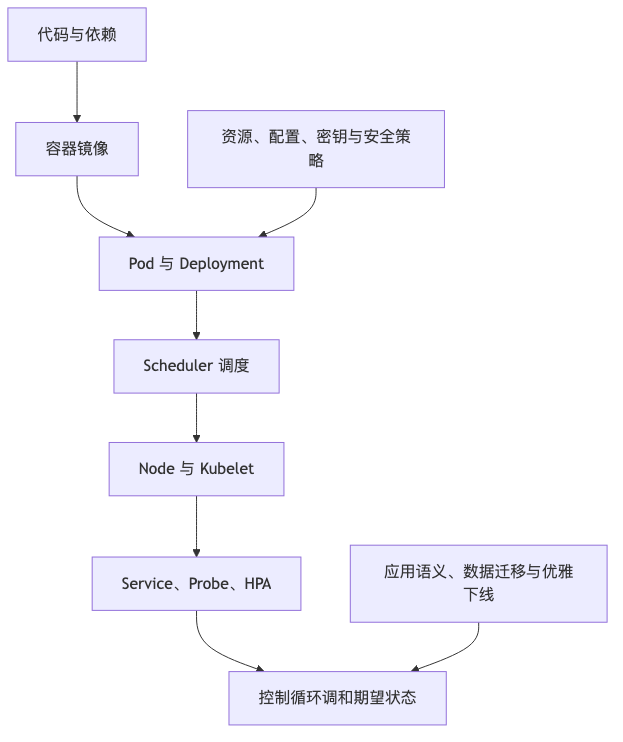

# 第五篇：云原生与平台工程

本篇讨论的不是“把系统搬到 Kubernetes 上”这么窄的问题，而是现代互联网系统如何被**构建、部署、发布、观测、治理和恢复**。当系统从几个服务增长到几十个、几百个服务之后，真正的复杂度往往不在某个业务接口，而在这些问题上：

代码如何进入生产？
配置如何安全变更？
服务如何被调度、扩缩容和隔离？
故障如何被发现？
谁能知道哪个服务属于谁？
事故中谁负责？
平台如何让团队更快，而不是多一层审批？

云原生与平台工程的核心，是把这些原本依赖经验、人工、脚本和口口相传的能力，沉淀为可复用、可审计、可演进的平台能力。

本篇案例均为工程化复合案例，用于说明设计思路，不指向某个特定公司的真实事故。

---

# 第 19 章：容器、Kubernetes 与运行时抽象

## 本章的问题链

先看原始问题：几个服务可以靠脚本和人工经验运行，几十个、几百个服务就不行了。打包不一致、调度靠猜、故障靠人拉起、扩容靠临场判断、资源边界不清，都会让运行时本身变成复杂系统。

为了解决这个问题，本章从容器镜像、OCI、Pod、Deployment、Service、Probe、requests/limits 和控制循环出发，解释 Kubernetes 如何把运行时问题抽象成声明式对象。

但这不是终点：服务能被平台稳定运行以后，新的风险会集中到变更上：代码、配置、数据库和开关如何安全进入生产，如何灰度、验证和回滚。

所以本章会按“问题 -> 机制 -> 新问题”的顺序展开：先把眼前的工程压力说清楚，再看对应机制解决了什么，最后讨论它留下的边界和下一步。



## 1. 本章解决什么问题

在小团队里，一个服务如何运行通常不是难题：打一个包，找一台机器，写一个启动脚本，配一个 Nginx，再配几个环境变量，系统就能跑起来。真正困难的是，当服务数量、机器数量、环境数量、团队数量都扩大以后，运行时会变成一个复杂系统：

同一个服务在开发、测试、预发、生产环境行为不一致；
某个节点挂了以后服务没人拉起；
发布时新旧版本流量交错，连接没 drain 完就被杀掉；
资源限制没配好，某个服务把节点打满；
配置和密钥散落在脚本、机器、环境变量和 Wiki 里；
服务扩容依赖人工判断，扩慢了影响可用性，扩多了浪费成本；
团队之间对“一个服务应该如何上线”没有统一标准。

容器解决的是**应用及其依赖如何被一致地打包和运行**。Kubernetes 进一步解决的是：在一组机器之上，如何用声明式方式描述应用期望状态，并由控制面不断调和实际状态与期望状态。Kubernetes 官方将其定位为用于自动化部署、扩缩容和管理容器化应用的开源系统；OCI 则维护容器镜像、运行时和分发等规范，降低了不同工具链之间的耦合。([Kubernetes][1])

本章的重点不是教读者背 Kubernetes 对象，而是回答：

**Kubernetes 到底抽象了什么？没有抽象什么？为什么这些抽象既能降低运维复杂度，也会制造新的失败模式？**

---

## 2. 从小系统到大系统：运行时复杂度如何出现

小系统的问题通常是“服务能不能跑起来”。大系统的问题是“服务能不能以可控成本、可观测方式、在失败时自动恢复，并且安全地演进”。

一个三人团队维护一个 Web 服务，手工 SSH 到机器上重启服务，可能还能接受。服务数量变成 100 个以后，这种方式会暴露几个问题：

第一，**环境漂移**。同一套代码在 A 机器能跑，在 B 机器失败，原因可能是操作系统包版本、环境变量、证书、字体、时区、glibc、JDK、小版本差异。容器把应用和依赖封装进镜像，至少让“构建产物是什么”变得可追踪。

第二，**调度复杂度**。服务应该跑在哪台机器？机器 CPU、内存、磁盘、GPU 是否够？是否应该和某些服务分开？某个可用区故障时是否还有副本？Kubernetes 的调度器负责根据资源请求、亲和性、污点与容忍等约束，把 Pod 放到合适节点上。

第三，**自愈需求**。进程崩了要拉起，节点挂了要迁移，健康检查失败要摘流量。没有统一控制面时，这些逻辑往往散落在 supervisor、systemd、脚本、负载均衡和人工流程里。

第四，**发布风险**。滚动发布不是“逐台机器重启”这么简单。服务是否已经准备好接流量？旧实例是否完成了正在处理的请求？新版本是否兼容旧数据和旧客户端？这些问题如果不建模，发布系统就会变成事故制造机。

第五，**资源与成本**。云上资源不是免费的。请求值设置过大，集群看起来很安全，账单很难看；请求值设置过小，调度器认为能塞进去，运行时却频繁 OOM 或 CPU throttling。Kubernetes 的 requests 和 limits 是容量、稳定性和成本之间的重要接口。([Kubernetes][2])

---

## 3. 核心概念：从镜像到应用运行抽象

### 3.1 容器、镜像、镜像仓库与 OCI

容器不是轻量虚拟机的营销说法，而是一种基于操作系统隔离能力的进程运行方式。容器镜像描述了应用运行所需的文件系统内容、入口命令和元数据。镜像仓库负责分发镜像，容器运行时负责把镜像变成实际运行的进程。

OCI 的价值在于提供行业规范：镜像格式、运行时行为和分发协议有了共同约定，构建工具、镜像仓库和运行时才能解耦。工程上，这意味着团队不应该把应用发布绑定到某个单一脚本或私有格式，而应该让制品进入标准化链路：构建、扫描、签名、推送、部署、回滚。

### 3.2 Kubernetes 的工作负载抽象

Kubernetes 不是“容器启动器”，它提供的是一组运行时对象：

| 对象                 | 解决的问题             | 常见使用场景                |
| ------------------ | ----------------- | --------------------- |
| Pod                | 最小调度单元            | 一个或多个紧密耦合容器           |
| Deployment         | 无状态服务发布与副本管理      | Web API、BFF、后台服务      |
| StatefulSet        | 有状态副本管理           | 数据库、队列、协调系统           |
| DaemonSet          | 每个节点运行一个实例        | 日志采集、网络代理、监控 Agent    |
| Job                | 一次性任务             | 数据修复、批处理              |
| CronJob            | 定时任务              | 定期报表、清理任务             |
| Service            | 稳定访问入口            | 服务发现、负载均衡             |
| Ingress / Gateway  | L7 入口路由           | HTTP 路由、TLS、跨命名空间网关治理 |
| ConfigMap / Secret | 配置与敏感信息注入         | 配置解耦、密钥管理             |
| Volume             | 存储挂载              | 持久化数据、共享文件            |
| HPA / VPA          | 自动扩缩容             | 根据指标调整副本或资源           |
| CRD / Operator     | 扩展 Kubernetes API | 数据库、消息系统、平台能力自动化      |

Kubernetes 官方文档分别定义了 Deployment、StatefulSet、Service、Gateway API、健康检查、HPA、RBAC、Operator 和自定义资源等能力。理解这些对象时，不应停留在 YAML 字段，而要理解它们对应的运行时问题：副本、身份、网络、配置、存储、扩缩容、权限和控制循环。([Kubernetes][3])

---

## 4. 一个 Web 服务部署到 Kubernetes 的完整路径

下面是一条常见路径：

```text
开发者
  |
  | 1. 提交代码
  v
Git Repository
  |
  | 2. CI: 测试、构建、扫描、生成镜像
  v
Image Registry
  |
  | 3. CD/GitOps: 更新部署声明
  v
Kubernetes API Server
  |
  | 4. 控制器创建/更新 ReplicaSet
  v
Scheduler
  |
  | 5. 选择节点
  v
Node / kubelet / container runtime
  |
  | 6. 拉镜像、启动容器、挂载配置和存储
  v
Pod
  |
  | 7. Readiness 通过后加入 Service endpoints
  v
Service / Gateway / Ingress
  |
  | 8. 接收线上流量
  v
用户请求
```

一个生产级 Web 服务通常至少需要这些配置：

```yaml
apiVersion: apps/v1
kind: Deployment
metadata:
  name: order-api
spec:
  replicas: 6
  strategy:
    type: RollingUpdate
  template:
    spec:
      containers:
        - name: order-api
          image: registry.example.com/order-api:2026.06.06
          ports:
            - containerPort: 8080
          resources:
            requests:
              cpu: "500m"
              memory: "512Mi"
            limits:
              cpu: "2"
              memory: "1Gi"
          startupProbe:
            httpGet:
              path: /health/startup
              port: 8080
          readinessProbe:
            httpGet:
              path: /health/ready
              port: 8080
          livenessProbe:
            httpGet:
              path: /health/live
              port: 8080
          lifecycle:
            preStop:
              exec:
                command: ["sh", "-c", "sleep 10"]
          terminationGracePeriodSeconds: 60
```

这段配置背后的设计意图比 YAML 本身重要：

* `startupProbe` 避免慢启动服务被误杀。
* `readinessProbe` 决定实例是否可以接流量。
* `livenessProbe` 用于识别不可恢复的进程死锁，但不能把短暂下游故障写进 liveness。
* `requests` 是调度和容量规划的依据。
* `limits` 是运行时保护边界，也可能导致 CPU throttling 或 OOM。
* `preStop` 和 `terminationGracePeriodSeconds` 用于给连接摘除和请求完成留下窗口。

Kubernetes 支持 Pod 生命周期和探针机制，但它不会自动知道业务什么时候真正安全。健康检查写错，比没有健康检查更危险。([Kubernetes][4])

---

## 5. Kubernetes 抽象了什么，没抽象什么

### 5.1 它抽象了什么

Kubernetes 主要抽象了这些运行时问题：

**应用副本**：我希望这个服务有几个实例。
**调度**：实例应该运行在哪些节点上。
**自愈**：实例失败后如何重建。
**服务发现**：其他服务如何稳定访问它。
**配置注入**：配置和镜像如何分离。
**资源声明**：应用需要多少 CPU、内存和存储。
**滚动更新**：如何逐步替换旧版本。
**扩展 API**：如何用 CRD 和 Operator 表达更高层的平台能力。

这些抽象让团队可以用声明式方式描述系统状态，而不是写一堆命令式脚本。

### 5.2 它没有抽象什么

Kubernetes 没有替你解决：

* 应用协议的向后兼容。
* 数据库 Schema 变更。
* 消息消费幂等。
* 分布式事务。
* 业务降级策略。
* 真实容量估算。
* 成本归因。
* 事故响应。
* 多租户权限模型。
* 第三方依赖故障。
* 应用自身的优雅下线。

这也是很多团队误用 Kubernetes 的地方：以为“上了 K8s”就等于系统云原生了。实际上，Kubernetes 只是给运行时提供了统一控制面。应用是否可靠，仍然取决于接口设计、数据设计、发布系统、可观测性和团队运维能力。

---

## 6. Stateless 与 Stateful Workload 的差异

无状态服务适合 Kubernetes，因为实例可以被替换、扩缩、迁移。订单查询 API、商品详情 API、用户中心 API，只要状态主要在数据库或缓存中，Pod 被重建通常不是大问题。

有状态服务则复杂得多。StatefulSet 提供稳定网络身份和存储绑定，但不等于“数据库天然适合上 Kubernetes”。数据库、消息队列、协调系统还涉及：

* 数据备份和恢复。
* 主从切换。
* 写入一致性。
* 磁盘性能。
* 跨可用区延迟。
* 节点驱逐。
* 滚动升级顺序。
* Quorum 丢失。
* Operator 质量。
* 人员运维能力。

StatefulSet 是一个运行时抽象，不是数据系统可靠性的保证。生产中是否把数据库放在 Kubernetes 上，要看团队是否具备存储、备份、恢复、故障演练和 Operator 运维能力。很多业务团队更适合使用云厂商托管数据库，把精力放在数据模型、容量和故障恢复流程上。

---

## 7. 案例：优雅下线失败导致请求丢失

某订单服务使用 Kubernetes Deployment 滚动发布。服务收到 SIGTERM 后立即退出。readinessProbe 一直返回成功，负载均衡仍在短时间内把请求打到即将退出的 Pod。发布期间，用户提交订单后偶发 502，部分客户端自动重试，又因为接口幂等设计不完整，产生了少量重复订单。

事故链路如下：

```text
滚动发布开始
  |
  v
旧 Pod 收到 SIGTERM
  |
  | readiness 仍为 true
  v
Service endpoints 仍包含旧 Pod
  |
  v
网关继续转发请求
  |
  v
应用进程快速退出
  |
  v
请求中断 / 502
  |
  v
客户端重试
  |
  v
幂等不足，产生重复订单
```

改进设计：

```text
收到终止信号
  |
  v
应用进入 draining 状态
  |
  | readiness 返回 false
  v
从 Service endpoints 摘除
  |
  v
停止接收新请求
  |
  v
等待 in-flight 请求完成
  |
  v
关闭连接池、flush 日志、提交 offset
  |
  v
进程退出
```

配套措施：

* 在应用层处理 SIGTERM。
* readinessProbe 反映是否可接流量，而不是进程是否活着。
* 配置合理的 `terminationGracePeriodSeconds`。
* 网关、Service Mesh、客户端连接池配合 connection draining。
* 对写接口使用幂等键。
* 发布演练必须包含滚动更新、节点 drain、强制 kill。
* 监控发布期间的 5xx、p99、连接重置、重复订单数。

这个案例说明：Kubernetes 能发出生命周期信号，但是否正确响应，仍然是应用设计责任。

---

## 8. Stateful 服务上 Kubernetes 的风险清单

| 风险    | 典型问题             | 设计要求              |
| ----- | ---------------- | ----------------- |
| 存储性能  | PV IOPS 不足，尾延迟升高 | 压测真实存储类           |
| 可用区分布 | 多副本落在同一区         | Pod anti-affinity |
| 节点驱逐  | 数据副本频繁迁移         | PDB、驱逐策略          |
| 备份恢复  | 只备份不演练           | 定期恢复演练            |
| 主从切换  | Operator 行为不可控   | 明确切换流程            |
| 升级顺序  | 多副本同时不可用         | 分批升级              |
| 数据迁移  | Schema 与版本耦合     | 兼容窗口              |
| 监控不足  | 只看 Pod 存活        | 看复制延迟、日志、写入错误     |
| 成本失控  | 过度请求资源           | 按负载 rightsizing   |
| 人员能力  | 会 K8s 不等于会数据库    | 明确值班和 Runbook     |

---

## 9. 安全、成本与治理影响

Kubernetes 引入了新的治理边界。

**Namespace** 可以作为环境、团队或租户的隔离边界，但它不是天然安全边界。RBAC、NetworkPolicy、资源配额、准入控制、镜像策略和 Secret 管理都必须一起设计。

**Secret** 不等于完整密钥管理系统。它解决了 Kubernetes 对象中的敏感配置表达问题，但生产环境通常还需要 KMS、Vault、External Secrets、密钥轮换、访问审计和最小权限。

**资源请求和限制** 直接影响成本。requests 太大，集群利用率低；requests 太小，调度过度乐观；limits 太紧，应用被 throttling 或 OOM；limits 太松，单个 Pod 可能拖垮节点。HPA 根据指标扩缩副本，但扩容速度、指标延迟、冷启动时间和下游容量都要一起考虑。

**Operator 和 CRD** 可以把复杂运维逻辑产品化，但也会把平台变成“黑盒中的黑盒”。引入 Operator 前，应评估其升级能力、备份恢复、故障模式、社区活跃度、文档质量和团队接管能力。

---

## 10. Kubernetes 应用设计 Checklist

* 应用是否可以无状态化？哪些状态必须外置？
* 是否定义了明确的启动、存活、就绪健康检查？
* liveness 是否只检查不可恢复故障，避免把下游短暂故障导致重启风暴？
* readiness 是否真实反映能否接流量？
* 是否支持 SIGTERM、draining 和连接优雅关闭？
* 写接口是否具备幂等能力？
* 是否设置了合理的 requests、limits、HPA 策略？
* 是否有 PodDisruptionBudget 和反亲和性？
* 配置和密钥是否有版本、审计、回滚和轮换机制？
* 是否有部署前后 SLO 监控？
* 是否能从一个坏版本快速回滚或前滚？
* 是否明确服务所有者、值班人和 Runbook？
* Stateful workload 是否经过备份恢复演练？
* 是否有镜像扫描、签名和准入控制？
* 是否有成本归因标签：team、service、env、tenant、cost-center？

---

## 11. 常见误区

**误区一：容器化等于云原生。**
容器只是打包方式。没有自动化发布、弹性、可观测性、故障恢复和治理，容器只是换了一种部署格式。

**误区二：Kubernetes 会自动让系统高可用。**
Kubernetes 能重建 Pod，但不能修复错误的重试、错误的数据迁移、错误的权限模型和错误的业务降级。

**误区三：所有服务都应该上 Kubernetes。**
小团队、低复杂度系统、强依赖托管 PaaS 的产品，可能不需要自运维 Kubernetes。

**误区四：健康检查越多越好。**
错误的健康检查会制造重启风暴和发布事故。

**误区五：StatefulSet 让数据库上 K8s 变简单。**
StatefulSet 解决身份和存储绑定，不解决数据库工程本身。

---

## 12. 本章小结

容器把应用及其依赖封装为可分发制品，Kubernetes 把应用运行变成声明式控制问题。它的价值在于统一调度、自愈、服务发现、发布、资源声明和扩展 API。但 Kubernetes 不是可靠性的替代品，它只是运行时平台。真正的生产级能力还需要应用生命周期设计、发布系统、可观测性、权限治理、成本控制和事故响应共同支撑。

---

## 13. 本章最重要的 5 个判断

1. **Kubernetes 的核心价值是运行时抽象和控制循环，不是“运行容器”。**
2. **健康检查、优雅下线和幂等设计，是 Kubernetes 应用可靠性的底线。**
3. **requests、limits 和自动扩缩容是可靠性与成本之间的接口。**
4. **Stateful workload 上 Kubernetes 前，先证明备份、恢复、升级和故障演练能力。**
5. **不是所有团队都应该自建 Kubernetes；平台能力不足时，托管服务往往更可靠。**

---

[1]: https://kubernetes.io/ "Kubernetes"
[2]: https://kubernetes.io/docs/concepts/configuration/manage-resources-containers/ "Resource Management for Pods and Containers | Kubernetes"
[3]: https://kubernetes.io/docs/concepts/workloads/controllers/deployment/ "Deployments | Kubernetes"
[4]: https://kubernetes.io/docs/concepts/workloads/pods/pod-lifecycle/ "Pod Lifecycle | Kubernetes"
[5]: https://openfeature.dev/docs/reference/intro/ "Introduction | OpenFeature"
[6]: https://flagger.app/ "Flagger"
[7]: https://tag-app-delivery.cncf.io/whitepapers/platforms/ "CNCF Platforms White Paper | CNCF TAG App Delivery"
[8]: https://backstage.io/docs/overview/what-is-backstage/ "What is Backstage? | Backstage Software Catalog and Developer Platform"
[9]: https://developer.hashicorp.com/terraform/intro "What is Terraform | Terraform | HashiCorp Developer"
[10]: https://opengitops.dev/ "Home | OpenGitOps"
[11]: https://opentelemetry.io/docs/what-is-opentelemetry/ "What is OpenTelemetry? | OpenTelemetry"
[12]: https://prometheus.io/docs/concepts/data_model/ "Data model | Prometheus"
[13]: https://www.w3.org/TR/baggage/ "Propagation format for distributed context: Baggage"
[14]: https://sre.google/sre-book/monitoring-distributed-systems/ "Google SRE monitoring ditributed system - sre golden signals"
[15]: https://sre.google/workbook/alerting-on-slos/ "Google SRE - Prometheus Alerting: Turn SLOs into Alerts"
[16]: https://opentelemetry.io/docs/concepts/signals/profiles/ "Profiles"
[17]: https://ebpf.io/ "eBPF - Introduction, Tutorials & Community Resources"
[18]: https://principlesofchaos.org/ "Principles of chaos engineering"
[19]: https://sre.google/resources/practices-and-processes/incident-management-guide/ "Learn sre incident management and response"
[20]: https://sre.google/sre-book/being-on-call/ "On Call Engineer Best Practices for IT Services"
