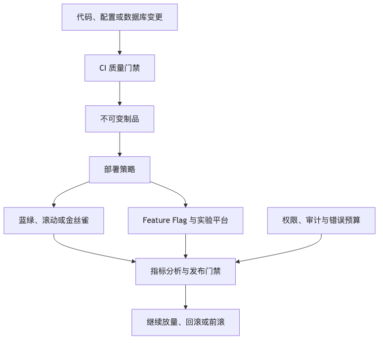

# 第 20 章：发布系统、灰度与实验平台

## 本章的问题链

先看原始问题：手工发布和一次性全量上线，会把每次代码变更都变成生产事故入口。服务越多、依赖越复杂，发布不再是“把新版本放上去”，而是一次对系统稳定性的持续挑战。

为了解决这个问题，本章用 CI/CD、GitOps、灰度发布、Feature Flag、实验平台、自动回滚、发布门禁和数据库变更流程，把变更变成可观测、可分批、可撤回的过程。

但这不是终点：发布流程标准化以后，新的问题会落到团队体验上：业务团队如何低成本使用这些能力，而不是每次都重新理解基础设施细节。

所以本章会按“问题 -> 机制 -> 新问题”的顺序展开：先把眼前的工程压力说清楚，再看对应机制解决了什么，最后讨论它留下的边界和下一步。



## 1. 本章解决什么问题

上线不是把代码部署到生产，而是把变化安全地引入系统。

生产事故中，相当一部分不是机器自然损坏，而是人主动引入的变化：代码发布、配置修改、数据库变更、流量切换、证书更新、依赖升级、特性开关、实验策略。发布系统的核心目标，不是让变化更快进入生产，而是让变化以**可控范围、可观测状态、可回滚路径**进入生产。

一个成熟发布系统要回答：

* 这次变更影响哪些用户、租户、区域和服务？
* 能不能先让 1% 流量验证？
* 失败后是回滚、前滚，还是关闭开关？
* 数据库变更是否兼容旧版本？
* 灰度指标如何定义？
* 自动回滚依据是什么？
* A/B 实验和灰度发布有什么区别？
* 谁有权限发布？谁批准高风险变更？
* 变更是否消耗错误预算？

OpenFeature 提供了厂商无关的 Feature Flag API 和规范，用于在不重新部署代码的情况下改变运行时行为；Argo Rollouts 则在 Kubernetes 上通过控制器和 CRD 提供蓝绿、金丝雀、分析和渐进式交付能力。([OpenFeature][5])

---

## 2. 从小系统到大系统：发布为什么变成主要风险

小系统里，发布常常是“晚上没人用的时候发一下”。大系统里，发布会遇到几个变化：

第一，**服务依赖变多**。一个订单服务发布，可能影响库存、优惠券、支付、风控、物流、消息通知、数据分析。

第二，**用户状态不一致**。有的用户使用旧客户端，有的使用新客户端；有的请求打到旧服务，有的打到新服务；有的数据已经迁移，有的数据还没迁移。

第三，**回滚不总是可行**。代码可以回滚，数据库结构变更、消息格式变更、外部接口调用、用户可见状态变更却未必能简单回滚。

第四，**配置变更比代码更危险**。配置绕过了编译、测试和代码评审，却可以瞬间影响全量生产。

第五，**实验和发布常被混用**。灰度发布是为了控制工程风险；A/B 实验是为了评估产品效果。两者都使用流量分配，但目标、指标和决策逻辑不同。

---

## 3. 核心概念

### 3.1 CI、CD 与制品管理

CI 关注代码进入主干前后的构建、测试和质量门禁。CD 关注制品如何进入环境。生产级系统不应该“在部署时构建代码”，而应该使用不可变制品：

```text
代码提交 -> 测试 -> 构建镜像/包 -> 安全扫描 -> 签名 -> 推送制品库
                                      |
                                      v
                               部署系统只引用制品版本
```

这样才能回答：线上运行的到底是哪一个版本？这个版本通过了哪些测试？谁批准的？能否回滚到上一个已知健康版本？

### 3.2 蓝绿、滚动、金丝雀与灰度

| 发布方式           | 思路               | 优点           | 代价            |
| -------------- | ---------------- | ------------ | ------------- |
| 蓝绿发布           | 新旧两套环境切流         | 回退快、隔离强      | 资源成本高，数据兼容要求高 |
| 滚动发布           | 分批替换实例           | 成本低，K8s 原生支持 | 新旧版本共存，问题可能扩散 |
| 金丝雀发布          | 小流量验证新版本         | 控制爆炸半径       | 指标设计复杂        |
| 灰度发布           | 按用户、租户、地区、设备定向   | 精细控制影响范围     | 策略复杂，需要治理     |
| Shadow Traffic | 复制真实流量到新系统但不影响用户 | 验证性能和兼容性     | 要避免副作用        |

Flagger 这类渐进式交付工具可以根据指标监控自动推进或回滚金丝雀发布，但自动化只能执行策略，不能替代指标设计。([Flagger][6])

### 3.3 Feature Flag

Feature Flag 的价值不是“写 if else”，而是把发布和功能开放解耦：

* 代码先上线，功能后打开。
* 小范围用户先体验。
* 出故障时快速关闭。
* 实验平台按用户分桶。
* 高风险路径可以保留 kill switch。

但 Feature Flag 也会制造技术债：长期不清理的开关会让代码路径指数级增加，测试矩阵膨胀，线上行为难以推断。

### 3.4 数据库变更发布

数据库变更比代码发布更难，因为数据是长期状态。安全的 Schema 变更通常遵循“扩展—迁移—切换—收缩”的节奏：

```text
Expand:     增加新字段/新表，保持旧逻辑可用
Migrate:    后台回填历史数据
Switch:     应用逐步读写新结构
Verify:     校验新旧数据一致
Contract:   删除旧字段/旧逻辑
```

不能把“ALTER TABLE 成功”当作数据库发布成功。真正成功要看性能、锁表影响、数据一致性、回滚路径和旧版本兼容性。

---

## 4. 发布系统架构

```text
                 +------------------+
                 |  Git Repository  |
                 +---------+--------+
                           |
                           v
                 +------------------+
                 | CI Pipeline      |
                 | test/build/scan  |
                 +---------+--------+
                           |
                           v
                 +------------------+
                 | Artifact Registry|
                 +---------+--------+
                           |
                           v
+----------------+   +-----+------+   +------------------+
| Approval/Policy|-->| CD System  |-->| Runtime Platform |
+----------------+   | GitOps/CD  |   | K8s/Serverless   |
                     +-----+------+   +--------+---------+
                           |                   |
                           v                   v
                  +----------------+   +------------------+
                  | Release Ctrl   |   | Traffic Router   |
                  | canary/bluegreen|  | gateway/mesh/lb  |
                  +--------+-------+   +--------+---------+
                           |                    |
                           v                    v
                  +----------------+   +------------------+
                  | Metrics/Logs   |<--| User Traffic     |
                  | SLO/Guardrails |   +------------------+
                  +--------+-------+
                           |
                           v
                  +----------------+
                  | Auto Rollback  |
                  +----------------+

Feature Flag / Experiment Platform 横向影响运行时行为：
用户分桶、租户策略、区域策略、实验指标、关闭开关。
```

这套系统最重要的不是工具，而是控制面：

* 谁可以发布？
* 哪些变更必须审批？
* 哪些指标阻止继续发布？
* 哪些故障触发自动回滚？
* 哪些变更只能前滚？
* 哪些时段禁止高风险变更？
* 发布记录如何进入审计？

---

## 5. 案例：订单服务发布流程

一个订单服务新版本要支持“企业采购订单”。发布流程可以这样设计：

### 5.1 发布前

* 需求拆解：是否影响普通订单、支付、库存、发票？
* 接口兼容：旧客户端是否能处理新字段？
* 数据库变更：新增 `order_type` 字段，默认 `NORMAL`。
* 合约测试：订单服务与支付、库存、风控、发票服务接口兼容。
* 压测：企业采购订单是否引入额外查询。
* 可观测性：新增企业订单成功率、失败原因、p99 延迟、金额分布。
* Feature Flag：`enterprise_order_enabled` 默认关闭。
* Runbook：发布异常时关闭开关，必要时回滚服务。

### 5.2 发布中

```text
0%  代码部署，功能关闭
1%  内部员工
5%  一个低风险租户
20% 白名单企业客户
50% 指定区域
100% 全量开放
```

每个阶段观察：

| 指标类型 | 示例                        |
| ---- | ------------------------- |
| 技术指标 | 5xx、p95/p99、CPU、内存、Pod 重启 |
| 业务指标 | 下单成功率、支付成功率、取消率           |
| 数据指标 | 订单状态机异常、重复订单、金额不一致        |
| 依赖指标 | 库存扣减失败率、支付授权失败率           |
| 护栏指标 | SLO burn rate、客服工单、退款率    |

### 5.3 发布后

* 关闭临时调试日志。
* 清理灰度策略。
* 记录 ADR 或发布决策。
* 标记 Feature Flag 清理日期。
* 回顾指标是否符合预期。
* 若实验结束，固化结果或回滚产品策略。

---

## 6. 数据库字段变更的安全发布方案

错误做法：

```text
1. 直接删除旧字段
2. 发布新代码
3. 发现旧版本还在读旧字段
4. 大量接口 500
5. 回滚代码也无法恢复已删除字段
```

改进做法：

```text
阶段一：Expand
  - 新增 nullable 字段 new_status
  - 不删除 old_status
  - 新旧代码都能运行

阶段二：Dual Write
  - 新版本同时写 old_status 和 new_status
  - 写入失败有告警

阶段三：Backfill
  - 后台任务分批回填历史数据
  - 控制速率，避免影响主库

阶段四：Read Switch
  - 小流量读取 new_status
  - 不一致时 fallback old_status 并记录日志

阶段五：Verify
  - 对账新旧字段差异
  - 指标稳定后扩大流量

阶段六：Contract
  - 确认没有旧代码读写 old_status
  - 删除旧字段和旧逻辑
```

关键点是：数据库变更必须跨多个发布周期设计，不能假设所有应用实例在同一时间切换。

---

## 7. Feature Flag 技术债案例

某团队为了加速交付，在一年内增加了 300 多个 Feature Flag。很多开关没有 owner，没有过期时间，没有文档。后来一次大促前，运营误把一个实验开关打开到全量用户，导致结算页展示了还未完成的优惠逻辑。由于多个开关组合复杂，工程师花了很久才复现线上状态。

改进策略：

| 治理项   | 要求                                   |
| ----- | ------------------------------------ |
| Owner | 每个 Flag 必须有负责人                       |
| 类型    | release、experiment、ops、permission 分开 |
| 默认值   | 明确 fail-open 还是 fail-closed          |
| 过期时间  | 临时 Flag 必须有清理日期                      |
| 审计    | 记录谁在何时改了什么                           |
| 环境隔离  | dev/staging/prod 策略分离                |
| 权限    | 高风险 Flag 需要审批                        |
| 观测    | Flag 维度进入日志和 Trace                   |
| 清理    | 实验结束后删除死代码                           |

Feature Flag 平台应该支持审计、环境管理、上下文评估和 SDK 一致性，而不是每个服务自己读配置表。

---

## 8. A/B 实验与灰度发布的区别

| 维度   | 灰度发布             | A/B 实验        |
| ---- | ---------------- | ------------- |
| 目标   | 控制工程风险           | 验证产品效果        |
| 关键问题 | 新版本是否安全          | 哪个方案更好        |
| 指标   | 错误率、延迟、SLO、业务成功率 | 转化率、留存、点击率、收入 |
| 决策   | 继续、暂停、回滚         | 胜出、失败、继续实验    |
| 样本   | 可小流量             | 需要统计功效        |
| 风险   | 事故扩散             | 错误结论          |
| 时间   | 通常较短             | 可能较长          |
| 机制   | 流量控制、自动回滚        | 分桶、显著性、实验分析   |

常见错误是用 A/B 实验平台承担发布安全，或者用灰度指标推断产品增长。灰度的第一目标是“不炸”；实验的第一目标是“做出可信产品判断”。

---

## 9. 发布失败模式

| 失败模式                | 表现        | 预防              |
| ------------------- | --------- | --------------- |
| 回滚不可行               | 数据结构已破坏   | Expand/Contract |
| 指标滞后                | 灰度时看不出问题  | 使用实时护栏指标        |
| 金丝雀样本太小             | 低频错误未暴露   | 结合合成监控和关键租户     |
| 配置无审计               | 不知道谁改了    | 配置发布平台          |
| Shadow Traffic 有副作用 | 影子请求真实扣库存 | 隔离写操作           |
| 开关组合爆炸              | 行为不可推断    | Flag 分类和清理      |
| 自动回滚误触发             | 指标噪声大     | 多指标、多窗口         |
| 发布窗口错误              | 大促前高风险发布  | 变更冻结策略          |
| 只看技术指标              | 业务已经异常    | 加业务 SLI         |

---

## 10. 发布系统 Checklist

* 是否所有生产变更都有版本、审批、审计？
* 制品是否不可变？
* 是否区分代码发布、配置发布、数据库发布？
* 是否支持按用户、租户、区域、比例灰度？
* 是否定义自动回滚指标和人工停止条件？
* 是否有 SLO burn rate 或业务护栏指标？
* 数据库变更是否向前/向后兼容？
* 回滚是否真的可行？不可行时是否有前滚方案？
* Feature Flag 是否有 owner、过期时间和审计？
* Shadow Traffic 是否避免副作用？
* A/B 实验是否有样本量和显著性设计？
* 是否记录发布后的复盘和行动项？
* 是否存在变更冻结窗口？
* 是否把发布频率、失败率、恢复时间作为平台指标？

---

## 11. 常见误区

**误区一：CI/CD 越快越好。**
快不是目标，安全可控的变化才是目标。

**误区二：有回滚按钮就安全。**
数据库、消息、外部副作用和用户可见状态往往不能简单回滚。

**误区三：Feature Flag 没有成本。**
每个开关都是一条长期代码路径，必须治理。

**误区四：灰度只看 5xx。**
业务状态错误、金额错误、数据不一致，可能不会表现为 5xx。

**误区五：A/B 实验平台可以替代发布系统。**
实验用于产品判断，发布系统用于风险控制。

---

## 12. 本章小结

发布系统的本质是变化管理。现代系统的事故很多来自代码、配置、数据和流量策略变化。蓝绿、滚动、金丝雀、灰度、Feature Flag、实验平台和数据库兼容发布，都是为了降低变化的不确定性。成熟团队不会问“怎么最快上线”，而会问“如何让变化逐步进入生产，并在影响扩大前发现和停止”。

---

## 13. 本章最重要的 5 个判断

1. **发布不是部署动作，而是风险控制流程。**
2. **数据库变更必须按兼容窗口设计，不能跟代码发布绑定成一次性动作。**
3. **Feature Flag 降低发布风险，也会制造长期技术债。**
4. **灰度发布看安全，A/B 实验看效果，二者不能混用。**
5. **自动回滚是否可靠，取决于指标设计，而不是工具本身。**

---

[1]: https://kubernetes.io/ "Kubernetes"
[2]: https://kubernetes.io/docs/concepts/configuration/manage-resources-containers/ "Resource Management for Pods and Containers | Kubernetes"
[3]: https://kubernetes.io/docs/concepts/workloads/controllers/deployment/ "Deployments | Kubernetes"
[4]: https://kubernetes.io/docs/concepts/workloads/pods/pod-lifecycle/ "Pod Lifecycle | Kubernetes"
[5]: https://openfeature.dev/docs/reference/intro/ "Introduction | OpenFeature"
[6]: https://flagger.app/ "Flagger"
[7]: https://tag-app-delivery.cncf.io/whitepapers/platforms/ "CNCF Platforms White Paper | CNCF TAG App Delivery"
[8]: https://backstage.io/docs/overview/what-is-backstage/ "What is Backstage? | Backstage Software Catalog and Developer Platform"
[9]: https://developer.hashicorp.com/terraform/intro "What is Terraform | Terraform | HashiCorp Developer"
[10]: https://opengitops.dev/ "Home | OpenGitOps"
[11]: https://opentelemetry.io/docs/what-is-opentelemetry/ "What is OpenTelemetry? | OpenTelemetry"
[12]: https://prometheus.io/docs/concepts/data_model/ "Data model | Prometheus"
[13]: https://www.w3.org/TR/baggage/ "Propagation format for distributed context: Baggage"
[14]: https://sre.google/sre-book/monitoring-distributed-systems/ "Google SRE monitoring ditributed system - sre golden signals"
[15]: https://sre.google/workbook/alerting-on-slos/ "Google SRE - Prometheus Alerting: Turn SLOs into Alerts"
[16]: https://opentelemetry.io/docs/concepts/signals/profiles/ "Profiles"
[17]: https://ebpf.io/ "eBPF - Introduction, Tutorials & Community Resources"
[18]: https://principlesofchaos.org/ "Principles of chaos engineering"
[19]: https://sre.google/resources/practices-and-processes/incident-management-guide/ "Learn sre incident management and response"
[20]: https://sre.google/sre-book/being-on-call/ "On Call Engineer Best Practices for IT Services"
