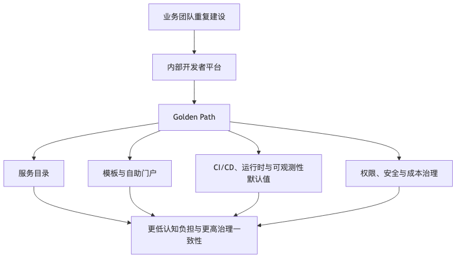

# 第 21 章：平台工程与内部开发者平台

## 本章的问题链

先看原始问题：当每个业务团队都自己拼 CI、监控、权限、模板、脚手架和发布规范，组织会重复建设，也会出现标准不一、风险不一、成本不可见和新人上手困难。

为了解决这个问题，本章用内部开发者平台、Golden Path、服务目录、模板、自助能力、权限治理和成本治理，把常见工程路径产品化，让团队以更低认知负担交付系统。

但这不是终点：平台把交付路径统一起来，不代表系统天然健康。新的问题是：系统出了问题时，团队能不能看见、定位、解释和验证真实因果。

所以本章会按“问题 -> 机制 -> 新问题”的顺序展开：先把眼前的工程压力说清楚，再看对应机制解决了什么，最后讨论它留下的边界和下一步。



## 1. 本章解决什么问题

当组织只有几个服务时，每个团队自己写脚手架、自己搭 CI、自己申请数据库、自己配置监控，问题还不明显。服务数量变多以后，这种自由会变成系统性摩擦：

新服务创建要两周；
开发者不知道应该用哪个模板；
服务没有 owner；
告警没人接；
权限申请靠聊天记录；
每个团队的日志字段都不一样；
安全扫描、成本标签、SLO、Runbook 都靠人工提醒；
平台团队被工单淹没，开发团队觉得平台是在“挡路”。

平台工程的目标不是新建一个运维审批部门，而是为开发团队提供自助、安全、标准化、可治理的 **Golden Path**。CNCF 平台工程白皮书把平台描述为面向内部客户的一组集成能力，目标包括降低认知负担、提升可靠性与韧性、降低安全合规风险、改善成本使用，并强调平台应以产品方式建设，提供自服务、文档、模板和安全默认值。([tag-app-delivery.cncf.io][7])

---

## 2. DevOps、SRE 与平台工程的关系

这三个词经常被混用，但它们解决的问题不同。

| 概念                   | 核心关注             | 典型产出                  |
| -------------------- | ---------------- | --------------------- |
| DevOps               | 打破开发与运维割裂，提升交付协作 | 文化、流程、自动化             |
| SRE                  | 用工程方法管理可靠性       | SLO、错误预算、值班、自动化运维     |
| Platform Engineering | 把共性工程能力产品化       | IDP、Golden Path、自服务平台 |

平台工程不是 DevOps 的替代品，也不是 SRE 的替代品。更准确地说，平台工程把 DevOps 和 SRE 中可复用、可产品化的部分沉淀为平台能力，让业务团队少做重复、低差异化、高风险的基础工作。

平台团队服务的对象不是机器，而是开发团队。好的平台不是“你必须按我说的做”，而是“这条路最快、最安全、最省心；你可以偏离，但要理解代价”。

---

## 3. 核心概念

### 3.1 Internal Developer Platform

内部开发者平台，简称 IDP，不一定是一个单一产品。它通常是一组能力的组合：

* 服务目录。
* 项目模板。
* CI/CD。
* 制品库。
* 环境管理。
* Kubernetes 或 Serverless 运行时。
* 数据库、缓存、消息队列申请。
* 权限和密钥管理。
* 可观测性默认接入。
* 成本标签和预算。
* 安全扫描。
* Runbook 和文档。
* Scorecard。
* On-call 归属。

Backstage 是常见的开发者门户框架，官方文档强调它通过软件目录集中跟踪服务所有权和元数据，并把基础设施工具、服务和文档统一到开发者门户中。([Backstage][8])

### 3.2 Golden Path

Golden Path 是平台为常见场景提供的推荐路径。例如“创建一个 Java HTTP 服务”：

```text
选择模板
  -> 生成仓库
  -> 默认 CI
  -> 默认 Dockerfile
  -> 默认 Kubernetes 部署
  -> 默认日志/指标/Trace
  -> 默认安全扫描
  -> 默认 SLO 模板
  -> 默认 Runbook
  -> 一键申请测试环境
  -> 灰度上线生产
```

Golden Path 不是强制所有人只能走一条路，而是让 80% 常见场景走得足够顺滑。少数特殊场景可以偏离，但偏离必须承担更多设计评审和运维责任。

### 3.3 IaC、GitOps 与控制面

Terraform 和 Pulumi 代表了基础设施即代码的两种常见方式：前者强调声明式配置和 plan/apply 工作流，后者使用通用编程语言表达基础设施。Crossplane 则把外部云资源抽象为 Kubernetes 风格的控制面对象，用于平台团队构建自服务能力。([HashiCorp Developer][9])

GitOps 的核心原则包括声明式、版本化不可变、自动拉取和持续调和；Argo CD 和 Flux 是 Kubernetes 场景中常见的 GitOps 交付工具。([OpenGitOps][10])

---

## 4. 平台能力架构

```text
                  +----------------------+
                  | Developer Portal     |
                  | Backstage / CLI / API|
                  +----------+-----------+
                             |
            +----------------+----------------+
            |                                 |
            v                                 v
+----------------------+          +----------------------+
| Service Catalog      |          | Golden Path Templates|
| owner/SLO/runbook    |          | service/job/consumer |
+----------+-----------+          +----------+-----------+
           |                                 |
           v                                 v
+----------------------+          +----------------------+
| CI/CD & Artifact     |          | IaC / Control Plane  |
| build/test/scan      |          | Terraform/Crossplane |
+----------+-----------+          +----------+-----------+
           |                                 |
           v                                 v
+----------------------+          +----------------------+
| Runtime Platform     |          | Data/Messaging       |
| K8s/Serverless       |          | DB/cache/queue       |
+----------+-----------+          +----------+-----------+
           |                                 |
           +----------------+----------------+
                            v
                  +----------------------+
                  | Built-in Governance  |
                  | security/cost/obs    |
                  +----------------------+
```

这个架构里最重要的是：平台能力应该通过门户、API、模板和自动化暴露，而不是通过工单和人工群聊暴露。

---

## 5. 从零建设内部开发者平台的路线图

### 阶段 0：识别痛点，而不是先买工具

先回答：

* 开发者最痛的 5 个流程是什么？
* 创建一个服务平均要多久？
* 申请数据库要多久？
* 新服务上线前最常漏掉什么？
* 事故中最常找不到什么信息？
* 平台团队工单最多来自哪里？

如果没有这些问题，先搭门户往往会变成“漂亮但没人用的首页”。

### 阶段 1：服务目录与 ownership

最小平台能力不是 Kubernetes，也不是门户，而是服务目录：

| 字段                  | 说明     |
| ------------------- | ------ |
| service name        | 服务名    |
| owner team          | 负责团队   |
| pager               | 值班入口   |
| repository          | 代码仓库   |
| runtime             | 运行环境   |
| dependencies        | 依赖服务   |
| SLO                 | 服务目标   |
| dashboard           | 监控面板   |
| runbook             | 故障处理文档 |
| cost center         | 成本归属   |
| data classification | 数据敏感级别 |

没有服务目录，事故中连“谁负责这个服务”都要靠猜。

### 阶段 2：一条 Golden Path

不要一开始覆盖所有语言、所有框架、所有部署模式。先选一个高频场景，例如：

* Java/Spring Boot HTTP 服务。
* Go gRPC 服务。
* Node.js BFF。
* Kafka Consumer。
* 定时 Job。

把这条路径做到足够好：创建仓库、默认依赖、CI、部署、监控、日志、Trace、安全扫描、SLO、Runbook、成本标签，一次性打包。

### 阶段 3：自服务资源申请

把常见资源变成自服务：

* 测试环境。
* 数据库。
* 缓存。
* 消息 Topic。
* 对象存储 Bucket。
* Secret。
* 权限。
* 域名。
* Feature Flag。
* Dashboard。

自服务不是“没人管”，而是把策略内建进去：命名规范、配额、权限、审批条件、成本标签、审计日志。

### 阶段 4：内建治理

把安全、合规、成本和可观测性放进 Golden Path：

* 镜像扫描默认开启。
* 高危依赖阻断发布。
* Secret 不允许明文进入 Git。
* 所有服务必须有 owner 和 on-call。
* 所有生产资源必须有成本标签。
* 所有服务默认输出结构化日志、指标和 Trace。
* 新服务必须定义最小 SLO。
* 高风险权限申请需要审批和过期时间。

### 阶段 5：平台产品化

平台团队要像产品团队一样运营平台：

* 有用户访谈。
* 有路线图。
* 有版本发布说明。
* 有 SLA/SLO。
* 有支持渠道。
* 有文档和 onboarding。
* 有弃用策略。
* 有平台自身的可观测性。

平台不是一次性项目，而是一个内部产品。

---

## 6. 服务从创建到上线的 Golden Path 示例

```text
1. 开发者进入门户
2. 选择“HTTP API 服务”模板
3. 填写服务名、团队、语言、数据等级、SLO
4. 平台生成：
   - Git 仓库
   - README
   - Dockerfile
   - CI pipeline
   - Kubernetes manifests
   - OpenTelemetry SDK 初始化
   - 日志字段规范
   - 健康检查接口
   - Runbook 模板
   - Dashboard 模板
5. 开发者申请测试数据库
6. Crossplane/Terraform 创建资源
7. CI 通过测试、扫描、构建镜像
8. GitOps 部署到测试环境
9. 契约测试和压测通过
10. 创建生产发布申请
11. 灰度 5% 流量
12. SLO 和护栏指标正常
13. 全量发布
14. 服务进入服务目录和成本看板
```

平台在这里并没有替开发者写业务逻辑，而是把“每个服务都应该有的工程能力”提前铺好。

---

## 7. 平台能力地图

| 能力域   | 基础能力                 | 成熟能力                |
| ----- | -------------------- | ------------------- |
| 服务创建  | 模板、脚手架               | 多语言 Golden Path     |
| 服务目录  | owner、repo、dashboard | 依赖图、风险评分            |
| CI/CD | 构建、测试、发布             | 渐进式交付、自动回滚          |
| 运行时   | K8s/Serverless       | 多集群、多区域             |
| 数据资源  | DB/cache/queue 申请    | 配额、备份、成本归因          |
| 安全    | 扫描、Secret 管理         | Policy as Code、准入控制 |
| 可观测性  | 默认日志指标 Trace         | SLO、Burn Rate、因果诊断  |
| 成本    | 标签、预算                | 单服务/租户成本            |
| 文档    | README、Runbook       | 自动校验、过期提醒           |
| 开发者体验 | Portal、CLI           | 个性化推荐、反馈闭环          |

---

## 8. 平台团队成功指标表

| 指标              | 含义                    | 风险          |
| --------------- | --------------------- | ----------- |
| 新服务首次上线时间       | 从创建到生产的耗时             | 只追速度可能牺牲质量  |
| 自服务完成率          | 资源申请无需人工比例            | 过度自服务可能绕过治理 |
| Golden Path 采用率 | 多少服务走推荐路径             | 强制使用会引发抵触   |
| 平均发布频率          | 团队交付能力                | 需结合失败率看     |
| 变更失败率           | 发布导致故障比例              | 定义需统一       |
| 平均恢复时间          | 故障恢复能力                | 不能只看平台故障    |
| 服务目录完整率         | owner、SLO、Runbook 覆盖率 | 信息可能过期      |
| 平台满意度           | 开发者体验                 | 主观指标需结合行为   |
| 成本归因覆盖率         | 资源是否能归属团队             | 标签质量很关键     |
| 安全策略违规率         | 违反基线次数                | 过多阻断会降低效率   |

好的平台指标应该同时看效率、可靠性、安全、成本和体验。

---

## 9. 如何避免平台变成新的工单中心

平台变成工单中心通常有几个原因：

* 平台能力没有 API。
* 门户只是提交表单，背后仍是人工。
* 平台规则不透明。
* 文档过时。
* Golden Path 不好用，团队只能绕开。
* 平台团队只关注资源交付，不关注开发者完整旅程。
* 平台缺少产品经理或用户反馈机制。

改进方式：

1. **把高频请求 API 化**。
   例如数据库申请、Topic 创建、权限申请。

2. **把审批变成策略**。
   低风险自动通过，高风险进入审批。

3. **把文档和模板绑定**。
   模板生成的服务天然带有最新文档和 Runbook。

4. **提供逃生通道**。
   特殊团队可以偏离 Golden Path，但需要 ADR 和评审。

5. **平台自身有 SLO**。
   如果平台发布系统挂了，所有业务团队都被阻断。平台也必须被当成生产系统。

---

## 10. IDP 设计 Checklist

* 平台要解决的前三个开发者痛点是什么？
* 是否有服务目录和 ownership？
* Golden Path 覆盖了哪些高频场景？
* 平台能力是否可通过 API/CLI/Portal 自服务？
* 是否有权限、成本、安全、审计默认策略？
* 是否支持多环境一致性？
* 是否能自动生成 CI/CD、监控、Runbook？
* 是否有资源配额和成本归因？
* 是否支持团队偏离 Golden Path 的评审流程？
* 平台自身是否有 SLO、告警和值班？
* 是否衡量平台采用率、满意度和交付效率？
* 是否有弃用策略和版本兼容策略？
* 平台团队是否定期访谈内部用户？
* 是否避免把所有东西塞进一个“万能门户”？

---

## 11. 常见误区

**误区一：平台工程就是买 Backstage。**
门户只是入口。没有服务目录、模板、自服务、策略和运维能力，门户只是导航页。

**误区二：平台越统一越好。**
过度统一会压制业务差异。Golden Path 应该覆盖主流场景，而不是消灭所有差异。

**误区三：平台团队是高级运维工单组。**
平台团队应该提供产品化能力，而不是长期人工代办。

**误区四：开发者体验只看界面好不好看。**
真正的体验是从创建服务到上线、观测、排障、下线的完整路径。

**误区五：平台只服务开发效率。**
平台同时是安全、合规、成本和可靠性的落地点。

---

## 12. 本章小结

平台工程把组织中反复出现的工程能力沉淀为自服务、标准化、可治理的平台。它的价值不是工具堆叠，而是降低开发者认知负担，内建安全、成本和可观测性，让团队沿着 Golden Path 更快、更稳地交付。平台团队必须把平台当成产品运营，而不是把自己变成新的审批中心。

---

## 13. 本章最重要的 5 个判断

1. **平台工程服务的是开发团队，不是工具清单。**
2. **Golden Path 的目标是降低认知负担，而不是消灭所有技术自由。**
3. **服务目录和 ownership 是平台能力的地基。**
4. **自服务必须和策略、审计、成本、安全绑定。**
5. **平台自身也是生产系统，必须有 SLO、值班和产品路线图。**

---

[1]: https://kubernetes.io/ "Kubernetes"
[2]: https://kubernetes.io/docs/concepts/configuration/manage-resources-containers/ "Resource Management for Pods and Containers | Kubernetes"
[3]: https://kubernetes.io/docs/concepts/workloads/controllers/deployment/ "Deployments | Kubernetes"
[4]: https://kubernetes.io/docs/concepts/workloads/pods/pod-lifecycle/ "Pod Lifecycle | Kubernetes"
[5]: https://openfeature.dev/docs/reference/intro/ "Introduction | OpenFeature"
[6]: https://flagger.app/ "Flagger"
[7]: https://tag-app-delivery.cncf.io/whitepapers/platforms/ "CNCF Platforms White Paper | CNCF TAG App Delivery"
[8]: https://backstage.io/docs/overview/what-is-backstage/ "What is Backstage? | Backstage Software Catalog and Developer Platform"
[9]: https://developer.hashicorp.com/terraform/intro "What is Terraform | Terraform | HashiCorp Developer"
[10]: https://opengitops.dev/ "Home | OpenGitOps"
[11]: https://opentelemetry.io/docs/what-is-opentelemetry/ "What is OpenTelemetry? | OpenTelemetry"
[12]: https://prometheus.io/docs/concepts/data_model/ "Data model | Prometheus"
[13]: https://www.w3.org/TR/baggage/ "Propagation format for distributed context: Baggage"
[14]: https://sre.google/sre-book/monitoring-distributed-systems/ "Google SRE monitoring ditributed system - sre golden signals"
[15]: https://sre.google/workbook/alerting-on-slos/ "Google SRE - Prometheus Alerting: Turn SLOs into Alerts"
[16]: https://opentelemetry.io/docs/concepts/signals/profiles/ "Profiles"
[17]: https://ebpf.io/ "eBPF - Introduction, Tutorials & Community Resources"
[18]: https://principlesofchaos.org/ "Principles of chaos engineering"
[19]: https://sre.google/resources/practices-and-processes/incident-management-guide/ "Learn sre incident management and response"
[20]: https://sre.google/sre-book/being-on-call/ "On Call Engineer Best Practices for IT Services"
