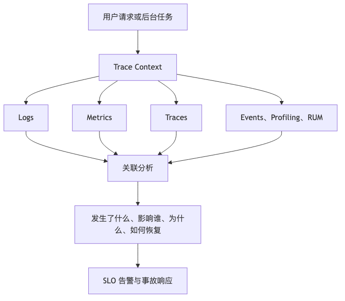

# 第 22 章：可观测性：从日志到因果诊断

## 本章的问题链

先看原始问题：服务一多，事故现场最常见的问题不是“没有日志”，而是信息太碎：日志、指标、链路、告警、用户反馈各说各话，工程师仍然不知道故障从哪里开始、影响了谁、还在不在扩大。

为了解决这个问题，本章把 logs、metrics、traces、events、profiling、eBPF、RUM、SLO 和告警放在一张观测模型里，用它们共同解释系统行为和用户影响。

但这不是终点：看见问题不等于系统能扛住问题。新的问题是：失败一定会发生，系统如何限制扩散、快速恢复，并把事故变成下一轮改进。

所以本章会按“问题 -> 机制 -> 新问题”的顺序展开：先把眼前的工程压力说清楚，再看对应机制解决了什么，最后讨论它留下的边界和下一步。



## 1. 本章解决什么问题

可观测性的目标不是收集更多日志、指标和 Trace，而是在未知故障发生时，快速回答四个问题：

发生了什么？
影响谁？
为什么发生？
如何恢复？

小系统里，工程师可以 SSH 到机器上看日志。大系统里，一个用户请求可能经过客户端、CDN、网关、BFF、多个服务、数据库、缓存、消息队列、第三方 API 和异步消费者。任何一环变慢、报错、重试、超时，都可能让用户看到失败。

OpenTelemetry 是云原生可观测性的关键项目，提供跨语言的 API、SDK、Collector 和语义约定，用于生成和收集 traces、metrics、logs 等遥测数据。W3C Trace Context 则定义了跨服务传播追踪上下文的标准 HTTP 头格式，使不同系统能够在请求链路中传递 trace 信息。([OpenTelemetry][11])

---

## 2. 从小系统到大系统：为什么“看日志”不够

大系统排障难在三个方面。

第一，**调用链跨越多个系统**。订单失败不一定是订单服务错，可能是库存慢、支付超时、优惠券锁冲突、风控拒绝、消息队列积压。

第二，**故障不是二元状态**。很多事故不是“服务挂了”，而是 p99 延迟上升、少数租户失败、某个区域错误率升高、某个新版本请求异常。

第三，**数据量和成本爆炸**。全量日志、全量 Trace、高基数指标都会带来存储和查询成本。可观测性不是采集越多越好，而是以诊断目标为导向设计数据模型。

---

## 3. 核心概念：Logs、Metrics、Traces

### 3.1 Logs

日志适合记录离散事件：

* 某个订单创建失败。
* 某次第三方调用返回错误码。
* 某条消息进入死信队列。
* 某个权限校验被拒绝。

生产日志应该结构化：

```json
{
  "timestamp": "2026-06-06T10:12:30Z",
  "level": "ERROR",
  "service": "order-api",
  "env": "prod",
  "trace_id": "4bf92f3577b34da6a3ce929d0e0e4736",
  "span_id": "00f067aa0ba902b7",
  "tenant_id": "t_123",
  "operation": "create_order",
  "error_code": "PAYMENT_TIMEOUT",
  "order_id": "o_987",
  "message": "payment authorization timeout"
}
```

非结构化日志适合人读，不适合机器关联。生产系统应避免把手机号、邮箱、身份证、Token、银行卡号写入日志。

### 3.2 Metrics

指标适合表达聚合状态：

* QPS。
* 错误率。
* p95/p99 延迟。
* 队列积压。
* 缓存命中率。
* CPU、内存、磁盘。
* 下单成功率。
* 支付成功率。

Prometheus 的数据模型把指标表示为时间序列，标签组合会生成新的时间序列；官方文档也提醒不要把用户 ID、邮箱等无界值放入标签，因为这会导致高基数问题。([prometheus.io][12])

### 3.3 Traces

Trace 适合解释一次请求如何穿过系统。一个 Trace 由多个 Span 组成：

```text
Trace: checkout request
  Span: client click checkout
  Span: gateway route
  Span: order-api create_order
    Span: inventory reserve
    Span: coupon validate
    Span: payment authorize
    Span: db insert order
    Span: outbox publish event
  Span: notification consumer
```

Trace 的价值不只是看调用耗时，还包括理解因果关系：谁调用了谁？哪里排队？哪里重试？哪个下游拖慢了整个请求？

### 3.4 Baggage 与 Correlation ID

Trace ID 用于链路追踪。Correlation ID 常用于业务关联，例如一个订单、一次批处理任务、一个租户操作。Baggage 用于跨进程传播附加上下文，但要谨慎使用，避免传播敏感信息或导致请求头过大。W3C Baggage 为跨服务传递应用上下文定义了标准机制。([W3C][13])

---

## 4. 可观测性数据模型

一个服务上线前，应定义最小遥测模型：

| 字段                     | 用途     | 注意事项             |
| ---------------------- | ------ | ---------------- |
| service.name           | 服务名    | 稳定命名             |
| service.version        | 版本     | 关联发布             |
| deployment.environment | 环境     | prod/staging/dev |
| region / zone          | 区域     | 多区域排障            |
| route / operation      | 接口或操作  | 不要用原始 URL        |
| trace_id / span_id     | 链路关联   | 全链路传递            |
| tenant_id              | 租户影响分析 | 指标中需控制基数         |
| error_code             | 错误语义   | 稳定枚举             |
| dependency             | 下游依赖   | 识别故障传播           |
| feature_flag           | 开关状态   | 关联灰度             |
| slo_class              | 服务等级   | 支持告警策略           |

一个常见原则是：**日志可以记录详细上下文，但要控制权限、脱敏和保留时间；指标必须严格控制标签基数；Trace 要采样但保留错误和慢请求。**

---

## 5. 电商下单链路 Trace 示例

```text
[Mobile App]
   |
   | traceparent
   v
[CDN / Edge]
   |
   v
[API Gateway]
   |
   v
[order-api]
   |-- span: validate request
   |-- span: get user profile
   |-- span: reserve inventory
   |       |
   |       v
   |   [inventory-api]
   |
   |-- span: authorize payment
   |       |
   |       v
   |   [payment-api] --> [third-party payment]
   |
   |-- span: insert order
   |       |
   |       v
   |   [order-db]
   |
   |-- span: publish order_created
           |
           v
       [message queue]
           |
           v
       [notification-consumer]
```

如果 trace 上下文只在 HTTP 服务之间传递，而进入消息队列后丢失，那么异步部分就会断链。现代可观测性设计必须覆盖客户端、网关、服务、数据库、消息队列和后台任务。

---

## 6. RED、USE 与 Four Golden Signals

Google SRE 体系中常用的 Four Golden Signals 包括 latency、traffic、errors、saturation。它们适合从用户影响角度观察服务是否健康。([Google SRE][14])

| 模型                  | 关注点                           | 示例            |
| ------------------- | ----------------------------- | ------------- |
| RED                 | Rate、Errors、Duration          | API 服务        |
| USE                 | Utilization、Saturation、Errors | 资源层：CPU、磁盘、网络 |
| Four Golden Signals | 延迟、流量、错误、饱和度                  | 服务级 SRE 监控    |

设计告警时，不应只盯 CPU。CPU 高可能是正常流量增长，也可能是低效代码；CPU 低也可能是服务根本没接到流量。更接近业务的告警是：用户请求失败率、订单成功率、支付授权延迟、SLO burn rate。

Google SRE Workbook 对 SLO 告警和 burn rate 有系统讨论：burn rate 描述错误预算消耗速度，能把告警从“资源异常”转向“用户目标正在被破坏”。([Google SRE][15])

---

## 7. 案例：从告警到定位问题

### 7.1 告警

晚上 21:05，checkout 服务触发告警：

```text
SLO: 30 天订单创建成功率 >= 99.9%
Alert: 1 小时窗口 burn rate 过高
Impact: 约 8% 下单请求失败或超时
```

### 7.2 第一轮判断

Dashboard 显示：

* order-api 5xx 上升。
* p99 从 800ms 升到 6s。
* CPU 不高。
* Pod 没有重启。
* 错误集中在一个支付供应商。

Trace 采样显示：

```text
order-api create_order: 6200ms
  inventory reserve: 80ms
  coupon validate: 40ms
  payment authorize: 5900ms
    third-party provider A: timeout
```

### 7.3 故障传播

进一步观察发现：

* payment-api 对 provider A 设置了 5 秒超时。
* order-api 整体超时是 6 秒。
* 客户端在 6 秒后重试。
* 重试没有 jitter。
* provider A 已经慢，重试进一步放大流量。

### 7.4 缓解

* 临时把 provider A 权重降到 0。
* provider B 承接主要流量。
* 对低风险订单启用延迟支付确认。
* 降低客户端重试次数。
* 开启支付服务熔断。
* 更新状态页和客服口径。

### 7.5 复盘行动项

* 支付供应商接入健康评分。
* Deadline 从入口传递到下游。
* 重试使用指数退避和 jitter。
* provider 级别熔断。
* 合成监控覆盖第三方支付通道。
* Trace 中增加 provider、region、error_type 维度。
* 发布前验证下游超时是否小于上游 deadline。

这个案例说明：可观测性不是为了“看到很多图”，而是为了在事故中快速建立因果链。

---

## 8. Profiling、eBPF、RUM 与 Synthetic Monitoring

日志、指标、Trace 之外，还有几类重要信号。

**Profiling** 用于观察 CPU、内存、锁、I/O 等资源消耗热点。持续 Profiling 可以发现“没有报错但成本变高”的问题，例如某个 JSON 序列化路径消耗了 30% CPU。OpenTelemetry Profiles 信号仍处于较新的发展阶段，生产采用时要关注稳定性和工具链成熟度。([OpenTelemetry][16])

**eBPF** 允许在 Linux 内核中运行受限程序，而不需要修改内核源码或加载传统内核模块，在网络、安全和性能观测中越来越常见。([ebpf.io][17])

**RUM** 观察真实用户体验，例如页面加载、交互延迟、客户端错误、弱网失败。

**Synthetic Monitoring** 通过主动探测模拟用户行为，适合发现外部路径问题：DNS、CDN、证书、登录、支付、跨区域访问。

黑盒监控告诉你“用户是否能完成动作”，白盒监控告诉你“系统内部为什么这样”。两者都需要。

---

## 9. 告警设计 Checklist

* 告警是否对应用户影响？
* 是否区分症状告警和原因告警？
* 是否有 SLO 或错误预算作为依据？
* 告警是否可行动？
* 告警消息是否包含 dashboard、runbook、owner？
* 是否避免对每台机器的普通波动告警？
* 是否有多窗口 burn rate？
* 是否按服务等级设置不同阈值？
* 是否过滤低价值噪声？
* 是否定期复盘告警疲劳？
* 是否记录告警触发后的处理结果？
* 是否避免“没有人负责”的告警？

---

## 10. 服务上线前可观测性 Checklist

* 是否定义 SLI/SLO？
* 是否有结构化日志？
* 是否有统一 trace_id？
* Trace 是否跨 HTTP、RPC、消息队列传播？
* 是否有 RED 指标？
* 是否有关键业务指标？
* 是否记录下游依赖延迟和错误？
* 是否有高基数标签审查？
* 是否有 Dashboard 和 Runbook？
* 是否有发布维度：版本、Feature Flag、区域？
* 是否有日志脱敏和保留策略？
* 是否有采样策略？
* 是否能按租户、区域、版本定位影响？
* 是否有合成监控覆盖核心用户路径？

---

## 11. 常见误区

**误区一：日志越多越好。**
日志过多会增加成本和噪声，还可能泄露敏感数据。

**误区二：有 Dashboard 就有可观测性。**
Dashboard 只展示已知问题；可观测性要支持未知问题探索。

**误区三：Trace 只用于看耗时。**
Trace 更重要的是表达因果关系和故障传播。

**误区四：CPU 告警就是服务告警。**
用户不关心 CPU，用户关心请求是否成功、体验是否正常。

**误区五：可观测性是上线后补的。**
如果接口、错误码、上下文传播和业务指标没有在设计阶段定义，事后很难补齐。

---

## 12. 本章小结

可观测性不是“三件套采购”，而是一套面向故障解释的数据设计。日志提供细节，指标提供趋势和告警，Trace 提供因果链。SLO、错误预算、burn rate、结构化日志、上下文传播、高基数控制、RUM、合成监控和 Profiling 共同构成生产系统的感知能力。它的目标不是让图表更漂亮，而是让团队在事故中更快理解影响、定位原因、恢复服务。

---

## 13. 本章最重要的 5 个判断

1. **可观测性的目标是解释未知故障，不是收集更多数据。**
2. **Trace ID 必须贯穿客户端、网关、服务、消息和数据库链路。**
3. **指标标签基数是可观测性成本失控的常见根因。**
4. **SLO 告警比机器告警更接近用户影响。**
5. **可观测性必须在设计阶段进入接口、错误码、日志和数据模型。**

---

[1]: https://kubernetes.io/ "Kubernetes"
[2]: https://kubernetes.io/docs/concepts/configuration/manage-resources-containers/ "Resource Management for Pods and Containers | Kubernetes"
[3]: https://kubernetes.io/docs/concepts/workloads/controllers/deployment/ "Deployments | Kubernetes"
[4]: https://kubernetes.io/docs/concepts/workloads/pods/pod-lifecycle/ "Pod Lifecycle | Kubernetes"
[5]: https://openfeature.dev/docs/reference/intro/ "Introduction | OpenFeature"
[6]: https://flagger.app/ "Flagger"
[7]: https://tag-app-delivery.cncf.io/whitepapers/platforms/ "CNCF Platforms White Paper | CNCF TAG App Delivery"
[8]: https://backstage.io/docs/overview/what-is-backstage/ "What is Backstage? | Backstage Software Catalog and Developer Platform"
[9]: https://developer.hashicorp.com/terraform/intro "What is Terraform | Terraform | HashiCorp Developer"
[10]: https://opengitops.dev/ "Home | OpenGitOps"
[11]: https://opentelemetry.io/docs/what-is-opentelemetry/ "What is OpenTelemetry? | OpenTelemetry"
[12]: https://prometheus.io/docs/concepts/data_model/ "Data model | Prometheus"
[13]: https://www.w3.org/TR/baggage/ "Propagation format for distributed context: Baggage"
[14]: https://sre.google/sre-book/monitoring-distributed-systems/ "Google SRE monitoring ditributed system - sre golden signals"
[15]: https://sre.google/workbook/alerting-on-slos/ "Google SRE - Prometheus Alerting: Turn SLOs into Alerts"
[16]: https://opentelemetry.io/docs/concepts/signals/profiles/ "Profiles"
[17]: https://ebpf.io/ "eBPF - Introduction, Tutorials & Community Resources"
[18]: https://principlesofchaos.org/ "Principles of chaos engineering"
[19]: https://sre.google/resources/practices-and-processes/incident-management-guide/ "Learn sre incident management and response"
[20]: https://sre.google/sre-book/being-on-call/ "On Call Engineer Best Practices for IT Services"
